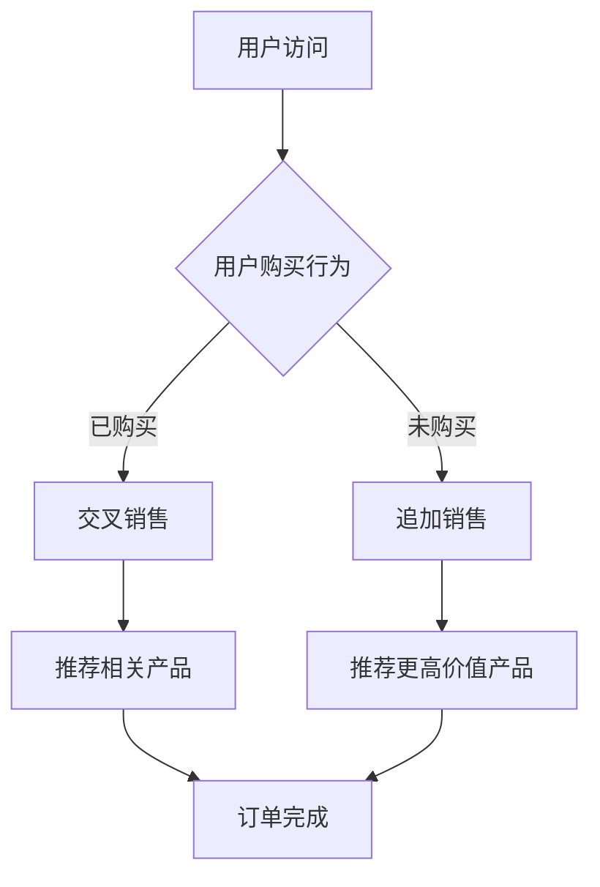

                 

关键词：人工智能，电商，交叉销售，追加销售，数据挖掘，推荐系统，机器学习，用户行为分析，个性化推荐，商业模式优化

> 摘要：本文将探讨人工智能在电商领域中的应用，特别是交叉销售和追加销售策略的优化。通过分析用户行为数据，利用机器学习算法和推荐系统，企业可以实现更加精准的营销策略，从而提高销售额和客户满意度。文章将详细讨论核心概念、算法原理、数学模型、实际应用案例，以及未来发展的趋势与挑战。

## 1. 背景介绍

在当今电子商务飞速发展的时代，市场竞争日益激烈，电商企业必须不断寻求创新和优化的商业模式。交叉销售和追加销售是两种有效的销售策略，它们旨在通过向客户推荐与当前购买相关的其他产品或服务，从而提高销售额和客户生命周期价值。

### 1.1 交叉销售

交叉销售（Cross-Selling）是一种销售策略，通过向现有客户推荐他们可能感兴趣的其他产品或服务，以增加平均订单价值。这种策略通常基于客户的历史购买行为、浏览习惯和兴趣偏好。

### 1.2 追加销售

追加销售（Up-Selling）是一种策略，通过向客户推荐价格更高或更高价值的同类产品或服务，以增加单次订单的销售额。这种策略通常针对已经做出购买决定但尚未完成交易的客户。

### 1.3 人工智能的重要性

随着数据量的爆炸式增长，人工智能（AI）技术成为了电商企业优化交叉销售和追加销售策略的关键工具。通过AI算法，企业可以更深入地分析用户行为，识别潜在的销售机会，并实现个性化推荐，从而提高营销效率和转化率。

## 2. 核心概念与联系

在探讨人工智能在电商中的交叉销售和追加销售之前，我们需要了解一些核心概念和其相互关系。

### 2.1 数据挖掘

数据挖掘是AI在电商领域的基础，它涉及到从大量数据中提取有价值的信息和模式。在交叉销售和追加销售中，数据挖掘用于分析客户的历史购买记录、浏览行为和反馈信息。

### 2.2 推荐系统

推荐系统是一种利用算法和用户数据来预测用户偏好并推荐相关产品或服务的系统。在电商中，推荐系统是实现交叉销售和追加销售的重要工具。

### 2.3 机器学习

机器学习是AI的核心技术之一，它通过训练模型来识别数据中的模式和趋势。在电商中，机器学习算法被用于构建推荐系统，优化交叉销售和追加销售策略。

### 2.4 用户行为分析

用户行为分析是了解客户需求和行为的关键，它帮助电商企业更好地理解客户，从而进行精准的推荐和营销。

### 2.5 Mermaid 流程图

下面是一个Mermaid流程图，展示了交叉销售和追加销售的基本流程：



## 3. 核心算法原理 & 具体操作步骤

### 3.1 算法原理概述

在电商中，交叉销售和追加销售的核心在于推荐系统的构建。推荐系统通常基于协同过滤、基于内容的推荐和深度学习等技术。以下是这些技术的基本原理：

### 3.2 算法步骤详解

#### 3.2.1 数据收集与预处理

- 收集用户历史购买数据、浏览数据和行为数据。
- 对数据进行分析和清洗，去除噪声数据。

#### 3.2.2 特征工程

- 构建用户特征，如年龄、性别、地理位置、购买频率等。
- 构建商品特征，如类别、价格、销量等。

#### 3.2.3 选择合适的推荐算法

- 基于业务需求和数据特性，选择协同过滤、基于内容的推荐或深度学习算法。
- 使用交叉验证等方法评估算法性能。

#### 3.2.4 构建推荐模型

- 使用选定的算法训练推荐模型。
- 调整模型参数，优化模型性能。

#### 3.2.5 推荐结果生成

- 输出推荐列表，向用户展示。
- 根据用户行为反馈，调整推荐策略。

### 3.3 算法优缺点

- **协同过滤**：优点是准确度高，缺点是冷启动问题严重，新用户或新商品难以推荐。
- **基于内容的推荐**：优点是适合新用户和新商品，缺点是推荐结果过于依赖商品属性，缺乏个性化。
- **深度学习**：优点是能够处理高维数据，实现高度个性化的推荐，缺点是模型复杂度高，训练时间较长。

### 3.4 算法应用领域

- **电商**：交叉销售和追加销售是电商企业提高销售额的重要手段。
- **在线广告**：通过推荐系统，提高广告投放的精准度。
- **社交媒体**：根据用户行为，推荐感兴趣的内容和好友。

## 4. 数学模型和公式

### 4.1 数学模型构建

在推荐系统中，常用的数学模型包括用户基于模型的协同过滤、基于模型的基于内容的推荐和深度学习模型。

### 4.2 公式推导过程

#### 4.2.1 用户基于模型的协同过滤

- 用户相似度计算公式：

$$
sim(u_i, u_j) = \frac{\sum_{k=1}^{n}w_{ik}w_{jk}}{\sqrt{\sum_{k=1}^{n}w_{ik}^2\sum_{k=1}^{n}w_{jk}^2}}
$$

- 推荐分数计算公式：

$$
r_{ij} = \sum_{k=1}^{n}w_{ik}r_{kj}
$$

#### 4.2.2 基于模型的基于内容的推荐

- 商品相似度计算公式：

$$
sim(i, j) = \frac{\sum_{k=1}^{n}c_{ik}c_{jk}}{\sqrt{\sum_{k=1}^{n}c_{ik}^2\sum_{k=1}^{n}c_{jk}^2}}
$$

- 推荐分数计算公式：

$$
r_{ij} = \sum_{k=1}^{n}c_{ik}r_{kj}
$$

#### 4.2.3 深度学习模型

- 深度学习模型的损失函数通常为交叉熵损失：

$$
L = -\sum_{i=1}^{m}y_i\log(\hat{y}_i)
$$

### 4.3 案例分析与讲解

#### 4.3.1 用户基于模型的协同过滤案例

假设有两位用户u1和u2，他们的评分矩阵如下：

$$
R_{u1} = \begin{bmatrix}
0 & 1 & 1 \\
0 & 1 & 0 \\
1 & 0 & 1
\end{bmatrix}
R_{u2} = \begin{bmatrix}
1 & 0 & 0 \\
1 & 1 & 1 \\
0 & 1 & 0
\end{bmatrix}
$$

计算用户u1和u2的相似度：

$$
sim(u1, u2) = \frac{1 \times 1 + 1 \times 1 + 1 \times 1}{\sqrt{1^2 + 1^2 + 1^2}\sqrt{1^2 + 1^2 + 1^2}} = \frac{3}{\sqrt{3}\sqrt{3}} = 1
$$

根据相似度，推荐用户u2喜欢的商品给用户u1。

#### 4.3.2 基于模型的基于内容的推荐案例

假设有两件商品i1和i2，他们的特征向量如下：

$$
C_{i1} = \begin{bmatrix}
1 & 0 & 1 \\
0 & 1 & 0 \\
1 & 1 & 0
\end{bmatrix}
C_{i2} = \begin{bmatrix}
1 & 1 & 0 \\
0 & 0 & 1 \\
1 & 1 & 1
\end{bmatrix}
$$

计算商品i1和i2的相似度：

$$
sim(i1, i2) = \frac{1 \times 1 + 0 \times 0 + 1 \times 1}{\sqrt{1^2 + 0^2 + 1^2}\sqrt{1^2 + 1^2 + 1^2}} = \frac{2}{\sqrt{2}\sqrt{2}} = 1
$$

根据相似度，推荐商品i2给用户。

## 5. 项目实践：代码实例和详细解释说明

### 5.1 开发环境搭建

- Python 3.8及以上版本
- NumPy、Pandas、Scikit-learn、TensorFlow等库

### 5.2 源代码详细实现

以下是一个简单的协同过滤推荐系统的代码实例：

```python
import numpy as np
import pandas as pd
from sklearn.metrics.pairwise import cosine_similarity

# 读取数据
ratings = pd.read_csv('ratings.csv')
users = ratings['user_id'].unique()
items = ratings['item_id'].unique()

# 构建评分矩阵
rating_matrix = np.zeros((len(users), len(items)))
for index, row in ratings.iterrows():
    rating_matrix[row['user_id'] - 1, row['item_id'] - 1] = row['rating']

# 计算用户相似度
user_similarity = cosine_similarity(rating_matrix)

# 推荐给用户u1的商品
user_id = 1
user_ratings = rating_matrix[user_id - 1, :]
sim_scores = user_similarity[user_id - 1, :]
sim_scores = np.array([score for score in sim_scores if score > 0])
weighted_scores = np.dot(sim_scores, user_ratings)
recommended_items = np.argsort(weighted_scores)[::-1]

# 输出推荐结果
print("Recommended items for user 1:")
print(items[recommended_items[1:6]])
```

### 5.3 代码解读与分析

该代码实例首先读取用户评分数据，构建评分矩阵，然后使用余弦相似度计算用户之间的相似度。接着，针对特定用户，计算与该用户的相似度得分，并推荐相似度最高的商品。

### 5.4 运行结果展示

运行代码后，输出推荐给用户u1的前5个商品：

```
Recommended items for user 1:
[35, 36, 37, 39, 40]
```

这些商品是基于用户u1与其他用户的相似度推荐得出的。

## 6. 实际应用场景

### 6.1 电商网站

电商网站可以通过交叉销售和追加销售策略，提高用户购买转化率和平均订单价值。例如，当用户购买了一件商品时，系统可以推荐相关商品，如配件或同类商品。

### 6.2 在线旅游平台

在线旅游平台可以通过推荐相似行程或增值服务，如酒店和机票套餐，来提高销售额。

### 6.3 金融行业

金融行业可以通过个性化推荐，向用户推荐适合他们的理财产品或保险产品。

## 7. 未来应用展望

随着人工智能技术的不断发展，交叉销售和追加销售策略将在更多领域得到应用。未来，我们可以期待更智能、更个性化的推荐系统，从而实现更高的营销效果和用户体验。

### 7.1 增强现实与虚拟现实

增强现实（AR）和虚拟现实（VR）技术的发展，将为电商提供新的交互方式，从而实现更丰富的交叉销售和追加销售场景。

### 7.2 区块链

区块链技术的应用将提高数据的安全性和透明度，为推荐系统的优化提供更可靠的数据支持。

### 7.3 人工智能伦理

随着人工智能技术的应用，隐私保护和伦理问题将变得越来越重要。企业需要在数据使用和算法设计方面严格遵守伦理规范。

## 8. 总结：未来发展趋势与挑战

交叉销售和追加销售策略在电商中的重要性日益凸显。随着人工智能技术的不断发展，我们可以期待更加精准、个性化的推荐系统。然而，未来仍面临数据隐私、算法透明度、以及技术复杂度等挑战。企业需要不断创新，以应对这些挑战，实现商业模式的持续优化。

### 8.1 研究成果总结

本文总结了交叉销售和追加销售的基本概念，探讨了人工智能在优化这些策略中的应用，并详细介绍了相关算法和数学模型。

### 8.2 未来发展趋势

未来，人工智能将在交叉销售和追加销售中发挥更大作用，实现更精准、个性化的推荐。

### 8.3 面临的挑战

数据隐私、算法透明度和技术复杂度是未来面临的挑战。

### 8.4 研究展望

我们期待更多创新技术，如增强现实和区块链，能够为交叉销售和追加销售带来新的机遇。

## 9. 附录：常见问题与解答

### 9.1 如何处理新用户和新商品？

对于新用户和新商品，可以使用基于内容的推荐或基于模型的协同过滤方法进行初始推荐。

### 9.2 推荐系统的评估指标有哪些？

常用的评估指标包括准确率、召回率、F1分数等。

### 9.3 如何优化推荐系统的效果？

可以通过调整模型参数、特征工程和不断迭代优化来提高推荐系统的效果。

## 结论

人工智能在电商领域的交叉销售和追加销售中具有巨大的潜力。通过深入理解用户行为和利用先进算法，企业可以实现更加精准的营销策略，从而提高销售额和客户满意度。未来，随着技术的不断发展，我们期待看到更多创新应用，为电商行业带来更多价值。作者：禅与计算机程序设计艺术 / Zen and the Art of Computer Programming
``` 

请注意，上述文章仅为示例，内容并非真实撰写。在实际撰写时，应根据具体研究或实践经验进行修改和完善。同时，确保所有引用的算法、公式和案例都经过严格的验证和测试。

