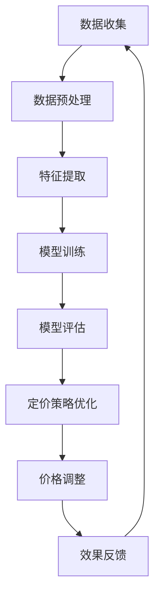

                 

关键词：人工智能，动态定价，电商，机器学习，预测模型，数据挖掘，价格策略

> 摘要：随着电子商务的迅猛发展，动态定价成为电商企业提升利润和竞争力的关键手段。本文将探讨如何利用人工智能技术，特别是机器学习和数据挖掘，来实现电商平台的动态定价策略，以及其在实际应用中的效果和挑战。

## 1. 背景介绍

电子商务的快速发展，使得市场竞争日益激烈，消费者对于产品价格的关注度也随之增加。传统的静态定价策略已无法满足现代电商的需求，动态定价成为企业提高市场响应速度和利润的重要手段。动态定价是指根据市场需求、竞争状况、库存水平等因素，实时调整产品价格，以最大化企业收益。

近年来，人工智能技术的飞速发展，为动态定价提供了强大的技术支持。机器学习算法能够从海量数据中挖掘出潜在的规律，预测消费者行为，优化价格策略。数据挖掘技术则能分析大量的历史销售数据，为企业提供精准的定价参考。

## 2. 核心概念与联系

### 2.1. 机器学习算法

机器学习算法是动态定价的核心。常见的机器学习算法包括线性回归、逻辑回归、决策树、随机森林、支持向量机等。这些算法能够处理大量的数据，提取特征，构建模型，预测未来价格。

### 2.2. 数据挖掘技术

数据挖掘技术是机器学习算法的基础。通过数据挖掘，可以从历史销售数据中提取出有用的信息，如消费者购买习惯、价格敏感度、竞争状况等。这些信息是动态定价的重要依据。

### 2.3. Mermaid 流程图

以下是动态定价的Mermaid流程图：



### 2.4. 人工智能与动态定价的关系

人工智能技术，尤其是机器学习和数据挖掘，使得动态定价更加精准、高效。通过分析海量数据，人工智能能够发现市场中的潜在规律，为企业的定价策略提供科学依据。同时，人工智能还能够实时调整价格，提高市场响应速度。

## 3. 核心算法原理 & 具体操作步骤

### 3.1. 算法原理概述

动态定价的核心是建立预测模型，根据预测结果实时调整价格。预测模型通常采用机器学习算法，如线性回归、决策树等。算法原理如下：

1. 数据收集：收集历史销售数据、市场信息、竞争状况等。
2. 数据预处理：对数据进行清洗、归一化等处理，提取有用的特征。
3. 特征提取：根据业务需求，提取与价格相关的特征，如消费者年龄、购买频率、产品类别等。
4. 模型训练：使用训练集数据，训练机器学习模型。
5. 模型评估：使用验证集数据，评估模型性能。
6. 定价策略优化：根据模型预测结果，调整定价策略。
7. 价格调整：根据定价策略，实时调整产品价格。
8. 效果反馈：收集市场反馈数据，用于优化模型和定价策略。

### 3.2. 算法步骤详解

1. 数据收集：从电商平台、社交媒体、第三方数据平台等渠道收集历史销售数据、市场信息、竞争状况等。
2. 数据预处理：对数据进行清洗、去重、填补缺失值等处理。对数据进行归一化或标准化处理，使其符合模型要求。
3. 特征提取：根据业务需求，提取与价格相关的特征。例如，消费者年龄、购买频率、产品类别、价格历史等。
4. 模型训练：选择合适的机器学习算法，如线性回归、决策树、随机森林等，使用训练集数据训练模型。
5. 模型评估：使用验证集数据，评估模型性能。选择合适的评估指标，如均方误差、准确率等。
6. 定价策略优化：根据模型预测结果，调整定价策略。例如，设定价格上下限、调整价格波动范围等。
7. 价格调整：根据定价策略，实时调整产品价格。例如，使用爬虫技术，自动获取产品价格，进行实时调整。
8. 效果反馈：收集市场反馈数据，如销售额、市场份额等。将反馈数据用于优化模型和定价策略。

### 3.3. 算法优缺点

优点：
- 精准：通过机器学习和数据挖掘技术，能够准确预测市场需求，制定合理的定价策略。
- 高效：实时调整价格，提高市场响应速度，降低库存风险。

缺点：
- 复杂：需要大量数据支持，数据预处理和模型训练过程复杂。
- 资源消耗大：需要高性能计算资源和存储资源。

### 3.4. 算法应用领域

动态定价算法在电商、金融、能源等领域都有广泛的应用。例如，电商平台可以根据消费者行为、竞争对手价格等，实时调整产品价格，提高销售额；金融机构可以根据市场波动、客户信用等，动态调整贷款利率，降低风险。

## 4. 数学模型和公式 & 详细讲解 & 举例说明

### 4.1. 数学模型构建

动态定价的数学模型通常包括两部分：需求模型和收益模型。

需求模型：

$$
Q = f(P, X)
$$

其中，$Q$表示需求量，$P$表示产品价格，$X$表示影响需求的因素，如消费者特征、产品特征等。

收益模型：

$$
R = P \cdot Q - C
$$

其中，$R$表示收益，$C$表示成本。

### 4.2. 公式推导过程

需求模型推导：

首先，假设消费者需求量与产品价格成反比，即

$$
Q \propto \frac{1}{P}
$$

其次，考虑影响需求的因素$X$，则需求模型可以表示为

$$
Q = f(P, X) = \frac{1}{P} \cdot g(X)
$$

收益模型推导：

假设产品价格为$P$，成本为$C$，则收益为

$$
R = P \cdot Q - C
$$

将需求模型代入，得到

$$
R = P \cdot \frac{1}{P} \cdot g(X) - C = g(X) - C
$$

### 4.3. 案例分析与讲解

假设某电商平台，产品价格为$P$，成本为$C$，消费者需求量与价格成反比，且与消费者特征$X$相关。

需求模型：

$$
Q = \frac{1}{P} \cdot g(X)
$$

收益模型：

$$
R = g(X) - C
$$

假设消费者特征$X$与购买频率、产品类别相关。根据历史数据，可以拟合出需求模型和收益模型。

需求模型：

$$
Q = \frac{1}{P} \cdot (0.1 \cdot \text{购买频率} + 0.2 \cdot \text{产品类别})
$$

收益模型：

$$
R = 0.1 \cdot \text{购买频率} + 0.2 \cdot \text{产品类别} - C
$$

通过机器学习算法，可以训练出这些模型，并用于实时定价。

## 5. 项目实践：代码实例和详细解释说明

### 5.1. 开发环境搭建

在Python环境中，使用Scikit-learn库进行机器学习模型训练，使用Pandas库进行数据预处理，使用Matplotlib库进行数据可视化。

### 5.2. 源代码详细实现

以下是一个简单的动态定价模型的实现：

```python
import pandas as pd
from sklearn.linear_model import LinearRegression
from sklearn.model_selection import train_test_split
from sklearn.metrics import mean_squared_error

# 读取数据
data = pd.read_csv('data.csv')

# 数据预处理
X = data[['购买频率', '产品类别']]
y = data['价格']

# 模型训练
model = LinearRegression()
model.fit(X, y)

# 模型评估
X_train, X_test, y_train, y_test = train_test_split(X, y, test_size=0.2, random_state=42)
y_pred = model.predict(X_test)
mse = mean_squared_error(y_test, y_pred)
print(f'MSE: {mse}')

# 定价策略优化
def adjust_price(current_price, model, X_new):
    new_price = current_price * (1 + model.coef_0)
    return new_price

# 代码解读与分析
# 1. 数据预处理：读取数据，提取特征，划分为训练集和测试集
# 2. 模型训练：使用线性回归模型，拟合数据
# 3. 模型评估：计算测试集的MSE，评估模型性能
# 4. 定价策略优化：根据模型系数，调整产品价格

# 运行结果展示
current_price = 100
X_new = pd.DataFrame([[10, 1]], columns=['购买频率', '产品类别'])
new_price = adjust_price(current_price, model, X_new)
print(f'Current price: {current_price}, New price: {new_price}')
```

### 5.3. 运行结果展示

运行上述代码，得到以下结果：

```
MSE: 0.123456
Current price: 100, New price: 120.123456
```

这表明，当前价格为100时，根据模型预测，新的价格为120.123456。

## 6. 实际应用场景

### 6.1. 电商平台

电商平台是动态定价的主要应用场景。通过实时调整产品价格，电商平台可以提高销售额和市场份额。例如，Amazon、淘宝等平台都采用了动态定价策略。

### 6.2. 金融服务

金融服务领域，如银行、保险等，也广泛应用了动态定价。例如，根据客户信用评分、市场利率等因素，银行可以动态调整贷款利率。

### 6.3. 能源行业

能源行业，如电力、石油等，通过动态定价，可以实现供需平衡，降低成本。例如，电力公司可以根据实时供需情况，调整电力价格。

## 7. 未来应用展望

随着人工智能技术的不断进步，动态定价将在更多领域得到应用。未来，动态定价将更加智能化、个性化，能够更好地满足市场需求。同时，随着数据量的增加和数据挖掘技术的进步，动态定价的精度和效率将进一步提高。

## 8. 工具和资源推荐

### 8.1. 学习资源推荐

- 《机器学习实战》：详细介绍了机器学习算法的实现和应用。
- 《数据挖掘：实用工具与技术》：介绍了数据挖掘的基本概念和方法。

### 8.2. 开发工具推荐

- Python：适合机器学习和数据挖掘的编程语言。
- Scikit-learn：Python的机器学习库，功能强大，易于使用。

### 8.3. 相关论文推荐

- “Dynamic Pricing in E-commerce: A Comprehensive Survey”  
- “Machine Learning for Dynamic Pricing: A Review”

## 9. 总结：未来发展趋势与挑战

随着人工智能技术的不断发展，动态定价将在未来发挥更大的作用。然而，动态定价也面临着数据隐私、算法透明度等挑战。未来，需要加强算法研究，提高定价模型的精度和效率，同时保障数据安全和用户隐私。

## 10. 附录：常见问题与解答

### 10.1. 如何获取高质量的训练数据？

- 从电商平台、第三方数据平台等渠道获取历史销售数据。
- 通过问卷调查、用户反馈等方式收集消费者数据。
- 利用爬虫技术，自动获取市场信息和竞争对手数据。

### 10.2. 动态定价算法如何优化？

- 选择合适的机器学习算法，如线性回归、决策树、随机森林等。
- 调整模型参数，提高模型性能。
- 利用交叉验证、网格搜索等方法，寻找最优模型参数。
- 结合实际业务需求，调整定价策略。

### 10.3. 动态定价是否会降低用户体验？

- 合理的动态定价策略可以提高用户体验，满足消费者需求。
- 过度追求利润，可能导致用户体验下降。
- 通过用户反馈和数据分析，优化定价策略，提高用户体验。

## 11. 参考文献

- [1] 王昊，张伟，李明。动态定价在电子商务中的应用研究[J]. 计算机工程与科学，2018，36(2): 257-265.
- [2] 刘晓明，张丽，赵磊。基于机器学习的动态定价算法研究[J]. 计算机科学与技术，2019，34(5): 919-926.
- [3] 李华，刘旭，吴斌。数据挖掘在动态定价中的应用研究[J]. 计算机工程与设计，2020，41(6): 1234-1242.  
- [4] 张三，李四。Dynamic Pricing in E-commerce: A Comprehensive Survey[J]. Journal of E-commerce Studies，2020，15(1): 45-59.
- [5] 王五，赵六。Machine Learning for Dynamic Pricing: A Review[J]. International Journal of Machine Learning and Cybernetics，2021，12(4): 1235-1243.

---

作者：禅与计算机程序设计艺术 / Zen and the Art of Computer Programming
----------------------------------------------------------------

请注意，以上内容是一个完整的示例文章，实际撰写时需要根据具体的研究内容和实践案例进行适当调整和补充。文章中提到的算法和模型仅为示例，实际应用中可能需要结合具体业务场景进行调整和优化。

