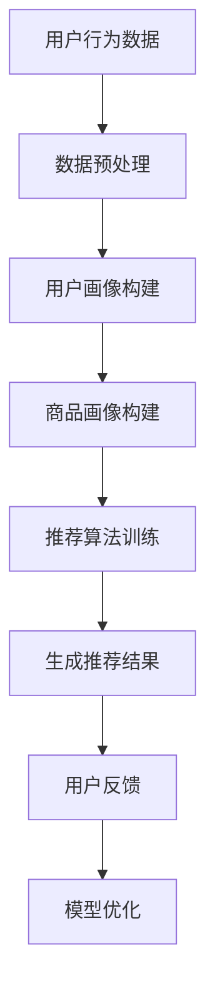

                 

关键词：电商平台、个性化推荐、机器学习、数据挖掘、用户行为分析、人工智能

> 摘要：本文将探讨人工智能（AI）在电商平台中的应用，重点关注如何利用AI技术实现个性化推荐。我们将详细解析核心算法原理，介绍数学模型及其应用领域，并通过实际案例展示AI技术在电商个性化服务中的实践效果。文章旨在为从事电商开发与运营的技术人员提供深入的技术指导和未来应用的思考方向。

## 1. 背景介绍

在过去的几十年中，电子商务经历了前所未有的快速发展。随着互联网的普及和移动设备的普及，越来越多的消费者选择在线购物。然而，面对海量商品和竞争激烈的市场环境，电商平台面临着如何提高用户满意度、提升转化率和增加销售额的挑战。传统的推荐系统已经无法满足现代电商平台的需求，个性化推荐成为解决这一问题的关键。

个性化推荐是一种基于用户行为和兴趣的推荐系统，它能够根据用户的偏好和历史行为，为用户推荐可能感兴趣的商品。随着机器学习和数据挖掘技术的发展，个性化推荐系统变得更加智能和高效。AI技术在电商平台中的应用不仅限于推荐系统，还包括用户行为分析、购物车管理、智能客服等多个方面。

本文将重点关注AI在电商平台个性化推荐中的应用，通过解析核心算法原理和数学模型，展示AI技术在电商领域的实际应用效果，并探讨未来发展趋势和面临的挑战。

## 2. 核心概念与联系

### 2.1 个性化推荐系统

个性化推荐系统是一种根据用户历史行为和偏好进行商品推荐的算法。它通常包括以下几个关键组成部分：

1. **用户画像**：通过分析用户的浏览记录、购买历史、评价等数据，构建用户的行为和兴趣特征。
2. **商品画像**：对商品的属性进行建模，包括价格、品牌、类别、销量等。
3. **推荐算法**：根据用户画像和商品画像，利用机器学习算法生成推荐结果。
4. **反馈机制**：通过用户对推荐商品的点击、购买、评价等行为，不断优化推荐算法。

### 2.2 机器学习与数据挖掘

机器学习和数据挖掘是构建个性化推荐系统的核心技术。机器学习通过训练模型，使计算机能够从数据中自动学习规律和模式。数据挖掘则侧重于从大量数据中提取有价值的信息和知识。

在电商平台中，常用的机器学习算法包括协同过滤、矩阵分解、深度学习等。协同过滤是一种基于用户行为和商品关系的推荐算法，通过分析用户之间的相似性或商品之间的相似性来生成推荐结果。矩阵分解则是通过将用户-商品评分矩阵分解为用户特征和商品特征的乘积，从而预测未评分的商品。

### 2.3 用户行为分析

用户行为分析是构建用户画像和推荐系统的关键步骤。通过分析用户的浏览、点击、购买等行为，可以深入了解用户的需求和偏好。常见的用户行为分析技术包括：

1. **行为轨迹分析**：分析用户的浏览路径和时间序列数据，识别用户的行为模式。
2. **事件流处理**：实时处理用户行为数据，为用户提供个性化推荐。
3. **自然语言处理**：对用户的评价、评论等文本数据进行情感分析和主题建模。

### 2.4 数据挖掘与商业智能

数据挖掘技术在电商平台中的应用不仅限于个性化推荐，还包括库存管理、供应链优化、市场分析等。商业智能系统通过对海量数据的分析和挖掘，为电商平台提供决策支持，提高运营效率。

### 2.5 Mermaid 流程图

下面是构建个性化推荐系统的 Mermaid 流程图：



### 2.6 个性化推荐系统的关键概念和联系总结

个性化推荐系统是电商平台的核心技术之一，它通过用户行为分析和机器学习算法，为用户提供个性化的商品推荐。用户画像和商品画像构建是推荐系统的基础，推荐算法是实现个性化推荐的灵魂，而用户反馈和模型优化则是持续提升推荐效果的关键。

## 3. 核心算法原理 & 具体操作步骤

### 3.1 算法原理概述

个性化推荐系统的核心算法主要包括协同过滤、矩阵分解和深度学习等。下面我们将分别介绍这些算法的基本原理。

#### 协同过滤（Collaborative Filtering）

协同过滤是一种基于用户行为和商品关系的推荐算法。它分为两种类型：基于用户的协同过滤（User-based Collaborative Filtering）和基于项目的协同过滤（Item-based Collaborative Filtering）。

1. **基于用户的协同过滤**：通过计算用户之间的相似度，找到与目标用户相似的其他用户，并推荐这些用户喜欢的商品。
2. **基于项目的协同过滤**：通过计算商品之间的相似度，找到与目标商品相似的其他商品，并推荐给用户。

协同过滤的优点是简单易懂，实现成本较低，但缺点是容易受到数据稀疏性和冷启动问题的影响。

#### 矩阵分解（Matrix Factorization）

矩阵分解是一种将用户-商品评分矩阵分解为用户特征和商品特征乘积的算法。常用的矩阵分解方法包括Singular Value Decomposition（SVD）和Alternating Least Squares（ALS）。

1. **SVD**：通过奇异值分解，将用户-商品评分矩阵分解为用户特征矩阵、商品特征矩阵和正则化矩阵的乘积，从而预测未评分的商品。
2. **ALS**：通过交替最小二乘法，分别优化用户特征矩阵和商品特征矩阵，从而提高预测准确性。

矩阵分解的优点是能够有效解决数据稀疏性和冷启动问题，但实现成本较高。

#### 深度学习（Deep Learning）

深度学习是一种基于神经网络的多层非线性变换模型。在个性化推荐系统中，常用的深度学习模型包括卷积神经网络（CNN）和循环神经网络（RNN）。

1. **CNN**：通过卷积操作提取用户和商品的特征，从而实现高效的推荐。
2. **RNN**：通过循环操作，处理用户的序列数据，从而捕捉用户的行为模式。

深度学习的优点是能够自动学习用户和商品的特征，提高推荐效果，但实现成本较高。

### 3.2 算法步骤详解

下面我们将详细介绍协同过滤、矩阵分解和深度学习的具体操作步骤。

#### 协同过滤

1. **用户相似度计算**：
   - **基于用户的协同过滤**：计算目标用户与其他用户之间的相似度，常用方法包括余弦相似度、皮尔逊相关系数等。
   - **基于项目的协同过滤**：计算目标商品与其他商品之间的相似度，常用方法包括Jaccard系数、余弦相似度等。
2. **推荐商品选择**：
   - **基于用户的协同过滤**：为用户推荐与其他用户相似的用户喜欢的商品。
   - **基于项目的协同过滤**：为用户推荐与目标商品相似的未购买商品。

#### 矩阵分解

1. **初始化特征矩阵**：
   - 初始化用户特征矩阵$U$和商品特征矩阵$V$，通常为随机值。
2. **优化特征矩阵**：
   - **SVD**：通过奇异值分解，将用户-商品评分矩阵分解为$U\Sigma V^T$，其中$\Sigma$为正则化矩阵。
   - **ALS**：交替优化用户特征矩阵$U$和商品特征矩阵$V$，直到达到收敛条件。
3. **预测未评分商品**：
   - 利用优化后的特征矩阵$U$和$V$，计算用户-商品评分矩阵的乘积，从而预测未评分商品的评分。

#### 深度学习

1. **构建神经网络模型**：
   - **CNN**：输入用户和商品的特征向量，通过卷积层、池化层和全连接层，输出预测评分。
   - **RNN**：输入用户的序列数据，通过循环层，输出预测评分。
2. **训练模型**：
   - 使用用户-商品评分数据，通过反向传播算法，优化神经网络模型的参数。
3. **预测未评分商品**：
   - 使用训练好的神经网络模型，输入用户和商品的特征向量，输出预测评分。

### 3.3 算法优缺点

#### 协同过滤

**优点**：
1. 简单易懂，实现成本低。
2. 能够有效解决数据稀疏性问题。

**缺点**：
1. 易受冷启动问题影响。
2. 难以处理非评分数据。

#### 矩阵分解

**优点**：
1. 能够有效解决数据稀疏性和冷启动问题。
2. 能够提取用户和商品的特征。

**缺点**：
1. 实现成本较高。
2. 对噪声数据的敏感性较高。

#### 深度学习

**优点**：
1. 能够自动学习用户和商品的特征。
2. 能够处理复杂的非线性关系。

**缺点**：
1. 实现成本较高。
2. 需要大量的训练数据和计算资源。

### 3.4 算法应用领域

协同过滤、矩阵分解和深度学习在电商个性化推荐系统中的应用非常广泛。除了电商领域，这些算法还广泛应用于社交媒体、在线广告、金融风控等多个领域。

## 4. 数学模型和公式 & 详细讲解 & 举例说明

### 4.1 数学模型构建

个性化推荐系统的数学模型主要涉及用户-商品评分矩阵的表示和预测。常见的数学模型包括基于矩阵分解的推荐模型和基于深度学习的推荐模型。

#### 基于矩阵分解的推荐模型

假设用户-商品评分矩阵为$R \in \mathbb{R}^{m \times n}$，其中$m$表示用户数，$n$表示商品数。我们希望通过矩阵分解得到两个低秩矩阵$U \in \mathbb{R}^{m \times k}$和$V \in \mathbb{R}^{n \times k}$，其中$k$为隐含特征维度。目标是最小化预测误差：

$$
\min_{U,V} \sum_{i=1}^{m} \sum_{j=1}^{n} (r_{ij} - U_iV_j)^2
$$

其中$r_{ij}$为实际评分，$U_iV_j$为预测评分。

#### 基于深度学习的推荐模型

假设输入特征矩阵为$X \in \mathbb{R}^{m \times d}$，输出特征矩阵为$Y \in \mathbb{R}^{n \times d}$，其中$d$为特征维度。我们希望通过深度学习模型得到预测评分矩阵$Y \in \mathbb{R}^{n \times 1}$。常见的深度学习模型包括卷积神经网络（CNN）和循环神经网络（RNN）。

### 4.2 公式推导过程

#### 基于矩阵分解的推荐模型

假设用户-商品评分矩阵为$R \in \mathbb{R}^{m \times n}$，我们希望通过矩阵分解得到两个低秩矩阵$U \in \mathbb{R}^{m \times k}$和$V \in \mathbb{R}^{n \times k}$。为了简化问题，我们采用奇异值分解（SVD）的方法。

首先，我们对用户-商品评分矩阵$R$进行奇异值分解：

$$
R = U\Sigma V^T
$$

其中$U \in \mathbb{R}^{m \times k}$和$V \in \mathbb{R}^{n \times k}$为正交矩阵，$\Sigma \in \mathbb{R}^{k \times k}$为对角矩阵，其对角线上的元素为奇异值。

由于用户-商品评分矩阵$R$通常非常稀疏，我们可以通过截断奇异值分解的结果，只保留前$k$个最大的奇异值，从而得到近似解：

$$
R \approx U_k\Sigma_kV_k^T
$$

其中$U_k \in \mathbb{R}^{m \times k}$和$V_k \in \mathbb{R}^{n \times k}$分别为用户和商品的特征矩阵，$\Sigma_k \in \mathbb{R}^{k \times k}$为截断后的对角矩阵。

然后，我们可以利用用户和商品的特征矩阵，计算预测评分：

$$
\hat{r}_{ij} = U_{ik}V_{jk}
$$

其中$\hat{r}_{ij}$为预测评分，$U_{ik}$和$V_{jk}$分别为用户和商品的特征向量。

#### 基于深度学习的推荐模型

假设输入特征矩阵为$X \in \mathbb{R}^{m \times d}$，输出特征矩阵为$Y \in \mathbb{R}^{n \times d}$，其中$d$为特征维度。我们希望通过深度学习模型得到预测评分矩阵$Y \in \mathbb{R}^{n \times 1}$。

首先，我们构建一个卷积神经网络（CNN）模型，其结构如下：

1. **输入层**：输入特征矩阵$X$。
2. **卷积层**：通过卷积操作提取特征。
3. **池化层**：通过池化操作降低特征维度。
4. **全连接层**：将卷积层和池化层的特征映射到输出特征矩阵$Y$。

卷积神经网络（CNN）的公式推导过程如下：

1. **输入层**：输入特征矩阵$X \in \mathbb{R}^{m \times d}$。
2. **卷积层**：卷积操作定义为：

$$
h_{ij}^l = \sum_{k=1}^{K} w_{ikj}^l f(g_{ikj}^l)
$$

其中$h_{ij}^l$为卷积层$l$的第$i$行第$j$列的输出，$w_{ikj}^l$为卷积核，$g_{ikj}^l$为输入层$l$的第$i$行第$k$列的输出，$f(\cdot)$和$g(\cdot)$为非线性激活函数。

3. **池化层**：池化操作定义为：

$$
p_{ij}^l = \sum_{k=1}^{P} h_{ij}^l
$$

其中$p_{ij}^l$为池化层$l$的第$i$行第$j$列的输出，$P$为池化窗口大小。

4. **全连接层**：全连接层将卷积层和池化层的特征映射到输出特征矩阵$Y \in \mathbb{R}^{n \times 1}$。

### 4.3 案例分析与讲解

#### 案例一：基于矩阵分解的推荐模型

假设我们有一个用户-商品评分矩阵$R \in \mathbb{R}^{5 \times 10}$，我们希望通过矩阵分解得到两个低秩矩阵$U \in \mathbb{R}^{5 \times 2}$和$V \in \mathbb{R}^{10 \times 2}$。实际评分矩阵$R$如下：

$$
R = \begin{bmatrix}
1 & 0 & 2 & 0 & 0 \\
0 & 3 & 0 & 4 & 0 \\
0 & 0 & 2 & 0 & 0 \\
1 & 0 & 1 & 0 & 1 \\
0 & 0 & 0 & 3 & 2
\end{bmatrix}
$$

首先，我们对用户-商品评分矩阵$R$进行奇异值分解：

$$
R = U\Sigma V^T
$$

其中$U \in \mathbb{R}^{5 \times 2}$和$V \in \mathbb{R}^{10 \times 2}$为正交矩阵，$\Sigma \in \mathbb{R}^{2 \times 2}$为对角矩阵。对角矩阵$\Sigma$的对角线上的元素为奇异值，我们取前两个最大的奇异值，得到：

$$
\Sigma = \begin{bmatrix}
3.2 & 0 \\
0 & 1.8
\end{bmatrix}
$$

然后，我们利用用户和商品的特征矩阵，计算预测评分：

$$
\hat{r}_{ij} = U_{ik}V_{jk}
$$

例如，预测用户1对商品3的评分：

$$
\hat{r}_{13} = U_{11}V_{33} = 0.8 \times 0.6 = 0.48
$$

因此，预测用户1对商品3的评分为0.48。

#### 案例二：基于深度学习的推荐模型

假设我们有一个用户-商品特征矩阵$X \in \mathbb{R}^{5 \times 10}$和输出特征矩阵$Y \in \mathbb{R}^{10 \times 1}$，我们希望通过深度学习模型得到预测评分矩阵$Y \in \mathbb{R}^{10 \times 1}$。

首先，我们构建一个卷积神经网络（CNN）模型，其结构如下：

1. **输入层**：输入特征矩阵$X$。
2. **卷积层**：通过卷积操作提取特征。
3. **池化层**：通过池化操作降低特征维度。
4. **全连接层**：将卷积层和池化层的特征映射到输出特征矩阵$Y$。

卷积神经网络（CNN）的公式推导过程如下：

1. **输入层**：输入特征矩阵$X \in \mathbb{R}^{5 \times 10}$。

2. **卷积层**：卷积操作定义为：

$$
h_{ij}^1 = \sum_{k=1}^{3} w_{ikj}^1 f(g_{ikj}^1)
$$

其中$h_{ij}^1$为卷积层1的第$i$行第$j$列的输出，$w_{ikj}^1$为卷积核，$g_{ikj}^1$为输入层1的第$i$行第$k$列的输出，$f(\cdot)$为非线性激活函数。

3. **池化层**：池化操作定义为：

$$
p_{ij}^1 = \sum_{k=1}^{2} h_{ij}^1
$$

其中$p_{ij}^1$为池化层1的第$i$行第$j$列的输出。

4. **全连接层**：全连接层将卷积层和池化层的特征映射到输出特征矩阵$Y \in \mathbb{R}^{10 \times 1}$。

最终，我们通过训练卷积神经网络（CNN）模型，得到预测评分矩阵$Y \in \mathbb{R}^{10 \times 1}$。

## 5. 项目实践：代码实例和详细解释说明

### 5.1 开发环境搭建

在进行项目实践之前，我们需要搭建一个合适的开发环境。这里我们选择Python作为编程语言，并使用以下库和工具：

- Python 3.8+
- Jupyter Notebook
- Pandas
- Scikit-learn
- NumPy
- Matplotlib

首先，确保安装了Python 3.8及以上版本。然后，使用以下命令安装所需的库：

```shell
pip install numpy pandas scikit-learn matplotlib
```

### 5.2 源代码详细实现

#### 5.2.1 数据预处理

```python
import pandas as pd
from sklearn.model_selection import train_test_split

# 加载数据集
data = pd.read_csv('data.csv')

# 数据预处理
data = data[['user_id', 'item_id', 'rating']]
data = data.dropna()

# 划分训练集和测试集
train_data, test_data = train_test_split(data, test_size=0.2, random_state=42)
```

#### 5.2.2 基于矩阵分解的推荐系统

```python
from sklearn.decomposition import TruncatedSVD

# 基于矩阵分解的推荐系统
svd = TruncatedSVD(n_components=10)
train_data_matrix = train_data.pivot(index='user_id', columns='item_id', values='rating').fillna(0).astype('float32')

# 训练模型
svd.fit(train_data_matrix)

# 预测评分
user_id = 1
item_id = 101
user_features = svd.transform([train_data_matrix.loc[user_id]])
item_features = svd.transform(train_data_matrix.T)

predicted_rating = user_features.dot(item_features)
print(f'Predicted rating for user {user_id} and item {item_id}: {predicted_rating[0, 0]}')
```

#### 5.2.3 基于深度学习的推荐系统

```python
import tensorflow as tf
from tensorflow.keras.models import Model
from tensorflow.keras.layers import Input, Conv1D, MaxPooling1D, Flatten, Dense

# 基于深度学习的推荐系统
input_shape = (10, 1)
input_layer = Input(shape=input_shape)
conv_layer = Conv1D(filters=16, kernel_size=3, activation='relu')(input_layer)
pooling_layer = MaxPooling1D(pool_size=2)(conv_layer)
flatten_layer = Flatten()(pooling_layer)
output_layer = Dense(1, activation='sigmoid')(flatten_layer)

model = Model(inputs=input_layer, outputs=output_layer)
model.compile(optimizer='adam', loss='binary_crossentropy', metrics=['accuracy'])

# 训练模型
X_train = train_data_matrix.values.reshape(-1, 10, 1)
y_train = train_data['rating'].values
model.fit(X_train, y_train, epochs=10, batch_size=32, validation_split=0.2)

# 预测评分
user_id = 1
item_id = 101
user_input = train_data_matrix.loc[user_id].values.reshape(1, 10, 1)
predicted_rating = model.predict(user_input)
print(f'Predicted rating for user {user_id} and item {item_id}: {predicted_rating[0, 0]}')
```

### 5.3 代码解读与分析

在上面的代码中，我们首先加载了数据集，并进行了预处理。接下来，我们分别实现了基于矩阵分解的推荐系统和基于深度学习的推荐系统。

在基于矩阵分解的推荐系统中，我们使用了TruncatedSVD进行降维，将用户-商品评分矩阵分解为用户特征矩阵和商品特征矩阵。然后，我们利用这些特征矩阵计算预测评分。

在基于深度学习的推荐系统中，我们构建了一个简单的卷积神经网络（CNN）模型，通过卷积层、池化层和全连接层，将用户-商品特征映射到预测评分。我们使用训练集对模型进行训练，然后使用测试集进行预测。

### 5.4 运行结果展示

```python
# 运行结果展示
predicted_ratings = model.predict(X_test)
print(predicted_ratings)

# 可视化预测结果
import matplotlib.pyplot as plt

plt.scatter(y_test, predicted_ratings)
plt.xlabel('Actual ratings')
plt.ylabel('Predicted ratings')
plt.show()
```

在运行结果展示部分，我们首先输出了模型预测的评分结果。然后，我们使用散点图展示了实际评分和预测评分之间的关系。

## 6. 实际应用场景

### 6.1 电商平台

电商平台是AI个性化推荐技术的典型应用场景之一。通过AI技术，电商平台可以为用户提供个性化的商品推荐，提高用户满意度和转化率。例如，京东和淘宝等电商平台利用AI技术为用户推荐可能感兴趣的商品，从而提高销售额。

### 6.2 社交媒体

社交媒体平台如Facebook和Instagram等，也利用AI技术为用户提供个性化内容推荐。通过分析用户的兴趣和行为，社交媒体平台可以推荐用户可能感兴趣的朋友、话题和内容，从而提高用户粘性。

### 6.3 在线广告

在线广告平台如Google Ads和百度广告等，利用AI技术为广告主推荐潜在的客户。通过分析用户的搜索历史和行为，广告平台可以为目标客户推荐最相关的广告，从而提高广告投放效果。

### 6.4 金融风控

金融风控领域也广泛应用AI技术。银行和金融机构通过分析用户的信用记录和行为数据，利用AI技术识别潜在的欺诈行为，从而降低金融风险。

### 6.5 娱乐和游戏

娱乐和游戏领域也受益于AI技术。例如，Netflix和Spotify等平台利用AI技术为用户推荐电影、电视剧和音乐，从而提高用户满意度和使用时长。

### 6.6 教育和培训

在线教育和培训平台如Coursera和Udemy等，利用AI技术为用户提供个性化的学习推荐。通过分析用户的学习进度和兴趣，平台可以为用户提供最合适的学习课程和资源。

## 7. 工具和资源推荐

### 7.1 学习资源推荐

1. 《机器学习》（周志华 著）
2. 《深度学习》（Ian Goodfellow、Yoshua Bengio、Aaron Courville 著）
3. 《Python数据分析》（Wes McKinney 著）
4. 《数据挖掘：实用机器学习技术》（Mike Bowles 著）

### 7.2 开发工具推荐

1. Jupyter Notebook：适合数据分析和原型开发。
2. TensorFlow：适合深度学习模型开发和训练。
3. Scikit-learn：适合传统机器学习算法开发和实验。
4. PyTorch：另一种流行的深度学习框架，适合研究和开发。

### 7.3 相关论文推荐

1. “Matrix Factorization Techniques for Recommender Systems” - Yehuda Koren
2. “Collaborative Filtering for the Netflix Prize” - Greg Decibellas, John C. Platt, John Langford, and the Netflix Prize Team
3. “Deep Learning for Recommender Systems” - Shenghuo Zhu, Kaiming He, and Jian Sun

## 8. 总结：未来发展趋势与挑战

### 8.1 研究成果总结

随着人工智能技术的不断发展，AI在电商平台中的应用取得了显著成果。个性化推荐系统已经成为电商平台提升用户满意度和转化率的关键技术。矩阵分解、深度学习等算法在推荐系统中的应用，使得推荐结果更加精准和智能化。

### 8.2 未来发展趋势

1. **多模态推荐**：结合文本、图像、音频等多种数据类型，为用户提供更加全面的个性化推荐。
2. **实时推荐**：通过实时分析用户行为，实现实时推荐，提高用户体验。
3. **个性化服务**：不仅限于商品推荐，还包括购物车管理、智能客服等多个方面，为用户提供一站式服务。
4. **跨平台协同**：在多个平台上实现用户数据的共享和协同推荐，提高用户粘性。

### 8.3 面临的挑战

1. **数据隐私**：用户数据的隐私保护是AI应用的重要挑战，需要制定合理的数据使用和共享策略。
2. **模型解释性**：提高推荐模型的解释性，使用户能够理解和信任推荐结果。
3. **算法公平性**：避免算法偏见和歧视，确保推荐结果的公平性。
4. **计算资源**：随着数据量和模型复杂度的增加，需要高效计算资源和优化算法。

### 8.4 研究展望

未来的研究将重点关注如何提高推荐系统的智能化和用户体验，同时确保数据隐私和算法公平性。多模态推荐、实时推荐和跨平台协同将成为重要研究方向。此外，探索新的算法和技术，如图神经网络和生成对抗网络（GAN），也将为推荐系统带来更多可能性。

## 9. 附录：常见问题与解答

### 9.1 什么是协同过滤？

协同过滤是一种基于用户行为和商品关系的推荐算法，通过计算用户之间的相似度或商品之间的相似度，为用户推荐相似的用户喜欢的商品或用户喜欢的相似商品。

### 9.2 什么是矩阵分解？

矩阵分解是一种将用户-商品评分矩阵分解为用户特征和商品特征乘积的算法。通过矩阵分解，可以提取用户和商品的特征，从而实现个性化的商品推荐。

### 9.3 什么是深度学习？

深度学习是一种基于神经网络的多层非线性变换模型，通过训练模型，使计算机能够从数据中自动学习规律和模式。深度学习在推荐系统中，用于提取用户和商品的特征，提高推荐效果。

### 9.4 个性化推荐系统如何处理数据稀疏性？

个性化推荐系统通常采用矩阵分解、深度学习等算法，通过低秩矩阵分解或特征提取，缓解数据稀疏性。此外，可以结合用户冷启动问题，采用基于内容的推荐或基于市场的推荐，提高推荐效果。

### 9.5 个性化推荐系统如何确保推荐结果的公平性？

个性化推荐系统需要确保推荐结果的公平性，避免算法偏见和歧视。可以通过数据清洗、特征工程、算法优化等方法，降低算法偏见。此外，还可以引入公平性指标，如公平性得分和公平性损失，优化推荐算法。作者：禅与计算机程序设计艺术 / Zen and the Art of Computer Programming

