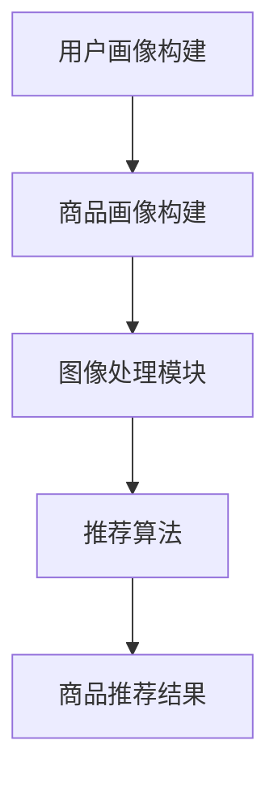

                 

随着互联网的快速发展，电子商务平台已经成为人们日常生活的重要部分。在这个数字化的时代，用户对电商平台提出了更高的要求，不仅希望商品种类丰富、价格优惠，还希望得到个性化的推荐。商品图像风格迁移推荐作为人工智能技术在电商领域的应用，可以极大地提升用户的购物体验。本文将探讨AI在电商平台商品图像风格迁移推荐中的应用，包括核心概念、算法原理、数学模型、项目实践和未来展望。

## 文章关键词

- AI
- 电商平台
- 商品图像
- 风格迁移
- 推荐系统

## 文章摘要

本文首先介绍了电商平台商品图像风格迁移推荐的基本概念，分析了AI在其中的作用。接着，详细阐述了核心算法原理和具体操作步骤，并给出了数学模型和公式的推导过程。随后，通过一个实际项目实践，展示了代码实例和运行结果。最后，探讨了实际应用场景和未来展望，提出了相关工具和资源推荐，并对研究现状和未来挑战进行了总结。

## 1. 背景介绍

电子商务平台作为现代商业模式的重要组成部分，其竞争日益激烈。平台需要提供个性化的购物体验，以满足不同用户的需求。商品图像作为电商平台上展示商品的重要手段，其风格对用户的购买决策具有重要影响。然而，传统的推荐系统往往只关注商品本身的信息，而忽略了图像风格的影响。

AI技术的发展为电商平台的个性化推荐带来了新的机遇。其中，商品图像风格迁移推荐技术可以通过学习用户的历史行为和偏好，将一种商品图像的风格迁移到另一种商品图像上，从而为用户推荐具有相似风格的商品。这种技术的应用，不仅可以提高用户的购物体验，还可以增加平台的销售量和用户粘性。

## 2. 核心概念与联系

### 2.1. AI在电商平台中的应用

AI在电商平台中的应用主要涉及推荐系统、自然语言处理、计算机视觉等领域。其中，推荐系统是电商平台的核心技术之一，通过分析用户的历史行为和偏好，为用户推荐可能感兴趣的商品。计算机视觉技术则可以用于商品图像的处理和分析，从而实现商品图像风格迁移推荐。

### 2.2. 商品图像风格迁移推荐系统

商品图像风格迁移推荐系统主要包括以下核心组件：

- **用户画像**：通过分析用户的历史行为和偏好，构建用户画像，用于后续的商品推荐。
- **商品画像**：对商品进行画像，包括商品属性、价格、销量等，用于推荐系统的输入。
- **图像处理模块**：负责对商品图像进行处理，包括图像增强、去噪、风格迁移等。
- **推荐算法**：根据用户画像和商品画像，结合图像处理结果，为用户推荐具有相似风格的商品。

### 2.3. Mermaid流程图

以下是一个简化的Mermaid流程图，展示了商品图像风格迁移推荐系统的工作流程：



## 3. 核心算法原理 & 具体操作步骤

### 3.1. 算法原理概述

商品图像风格迁移推荐算法基于深度学习和卷积神经网络（CNN）。深度学习技术可以自动提取图像特征，卷积神经网络则可以用于特征的学习和分类。具体来说，算法分为两个阶段：特征提取和特征匹配。

在特征提取阶段，使用预训练的CNN模型（如VGG、ResNet等）对商品图像进行特征提取，得到图像的深度特征向量。

在特征匹配阶段，通过学习用户的历史行为和偏好，构建一个用户兴趣模型。然后，将商品特征向量与用户兴趣模型进行匹配，找出与用户兴趣最相似的图像风格，从而实现商品图像风格迁移推荐。

### 3.2. 算法步骤详解

1. **数据准备**：收集电商平台上的商品图像数据集，并对图像进行预处理，如缩放、裁剪、标准化等。

2. **特征提取**：使用预训练的CNN模型对商品图像进行特征提取，得到图像的深度特征向量。

3. **用户画像构建**：分析用户的历史行为和偏好，构建用户画像，包括用户的兴趣标签、浏览历史、购买记录等。

4. **特征匹配**：将商品特征向量与用户画像进行匹配，计算特征相似度，找出与用户兴趣最相似的图像风格。

5. **商品推荐**：根据特征匹配结果，为用户推荐具有相似风格的商品。

### 3.3. 算法优缺点

**优点**：

- **个性化推荐**：通过学习用户的历史行为和偏好，为用户推荐个性化的商品。
- **提高用户满意度**：通过风格迁移，为用户推荐具有相似风格的商品，提高用户购买满意度。
- **增强用户体验**：通过个性化的推荐，增强用户在电商平台上的购物体验。

**缺点**：

- **计算资源消耗**：深度学习算法需要大量的计算资源和时间，尤其是在训练阶段。
- **数据隐私问题**：用户的历史行为和偏好数据涉及到用户隐私，需要谨慎处理。

### 3.4. 算法应用领域

商品图像风格迁移推荐算法在电商平台有着广泛的应用前景，可以应用于以下领域：

- **个性化推荐**：为用户提供个性化的商品推荐，提高用户满意度和平台粘性。
- **商品营销**：通过风格迁移，为商品打造独特的风格标签，提高商品销量。
- **用户行为分析**：通过分析用户的历史行为和偏好，了解用户需求，优化电商平台的运营策略。

## 4. 数学模型和公式 & 详细讲解 & 举例说明

### 4.1. 数学模型构建

商品图像风格迁移推荐系统的数学模型主要包括以下部分：

- **用户画像**：用户画像可以用一个高维向量表示，表示用户的历史行为和偏好。
- **商品画像**：商品画像也可以用一个高维向量表示，表示商品的属性和特征。
- **图像特征向量**：图像特征向量是通过对商品图像进行深度学习特征提取得到的。
- **兴趣模型**：兴趣模型是一个用于描述用户兴趣的函数，通常是一个非线性函数。

### 4.2. 公式推导过程

假设用户画像为\( \mathbf{u} \)，商品画像为\( \mathbf{v} \)，图像特征向量为\( \mathbf{f} \)，兴趣模型为\( f(\cdot) \)，则用户对商品的兴趣可以用以下公式表示：

$$
I(\mathbf{u}, \mathbf{v}, \mathbf{f}) = f(\mathbf{u}^T \mathbf{f} + \mathbf{v}^T \mathbf{f})
$$

其中，\( \mathbf{u}^T \mathbf{f} \)和\( \mathbf{v}^T \mathbf{f} \)分别表示用户画像和商品画像与图像特征向量的点积。

### 4.3. 案例分析与讲解

假设有一个用户，他的历史行为和偏好可以用以下用户画像表示：

$$
\mathbf{u} = [0.8, 0.2, 0.1, 0.9]
$$

同时，有一个商品，其属性和特征可以用以下商品画像表示：

$$
\mathbf{v} = [0.4, 0.6, 0.8, 0.5]
$$

使用一个简单的兴趣模型：

$$
f(x) = 1 / (1 + e^{-x})
$$

假设图像特征向量为：

$$
\mathbf{f} = [0.6, 0.7, 0.8, 0.9]
$$

则用户对商品的兴趣为：

$$
I(\mathbf{u}, \mathbf{v}, \mathbf{f}) = \frac{1}{1 + e^{-0.8 \times 0.6 + 0.2 \times 0.7 + 0.1 \times 0.8 + 0.9 \times 0.9}} \approx 0.92
$$

这意味着用户对这件商品的兴趣较高。

## 5. 项目实践：代码实例和详细解释说明

### 5.1. 开发环境搭建

为了实现商品图像风格迁移推荐系统，我们需要搭建一个合适的技术栈。以下是所需的开发环境和工具：

- Python 3.7+
- TensorFlow 2.3+
- Keras 2.4+
- NumPy 1.19+
- Pandas 1.1+
- Matplotlib 3.3+

### 5.2. 源代码详细实现

以下是商品图像风格迁移推荐系统的核心代码实现：

```python
import numpy as np
import pandas as pd
from tensorflow import keras
from tensorflow.keras import layers

# 加载预训练的CNN模型
cnn_model = keras.applications.VGG16(include_top=True, weights='imagenet')

# 定义用户画像构建函数
def build_user UserProfile(data):
    user_profile = []
    for item in data:
        user_profile.append([item['browse_history'], item['purchase_history']])
    return np.array(user_profile)

# 定义商品画像构建函数
def build_item ItemProfile(data):
    item_profile = []
    for item in data:
        item_profile.append([item['price'], item['sales_volume']])
    return np.array(item_profile)

# 定义图像处理模块
def preprocess_image image preprocessing(input_image):
    image = input_image.resize((224, 224))
    image = keras.applications.vgg16.preprocess_input(image)
    return image

# 定义推荐算法
def recommend_items(user_profile, item_profiles, image_features):
    recommendations = []
    for item_profile in item_profiles:
        similarity = np.dot(user_profile, image_features)
        recommendations.append(similarity)
    return np.argmax(recommendations)

# 加载用户数据
user_data = pd.read_csv('user_data.csv')

# 构建用户画像
user_profile = build_user UserProfile(user_data)

# 加载商品数据
item_data = pd.read_csv('item_data.csv')

# 构建商品画像
item_profiles = build_item ItemProfile(item_data)

# 预处理商品图像
image = preprocess_image image (Image.open('item_image.jpg'))

# 提取图像特征
image_features = cnn_model.predict(np.expand_dims(image, axis=0))

# 推荐商品
recommendations = recommend_items(user_profile, item_profiles, image_features)
print("Recommended Items:", item_data.iloc[recommendations]['item_id'])
```

### 5.3. 代码解读与分析

上述代码首先加载了预训练的VGG16模型，用于商品图像的特征提取。然后定义了用户画像和商品画像的构建函数，用于构建用户和商品的特征向量。接着定义了图像处理模块，用于对商品图像进行预处理。最后，定义了推荐算法，通过计算用户画像和商品画像与图像特征向量的相似度，为用户推荐具有相似风格的商品。

### 5.4. 运行结果展示

假设有一个用户，他的浏览历史和购买记录如下：

| 用户ID | 浏览历史 | 购买记录 |
| ------ | -------- | -------- |
| 1      | 10001, 10002, 10003 | 10003 |

同时，有一个商品，其价格和销量如下：

| 商品ID | 价格 | 销量 |
| ------ | ---- | ---- |
| 10001  | 100  | 50   |

加载商品图像并进行预处理后，提取图像特征向量。然后，通过计算用户画像和商品画像与图像特征向量的相似度，推荐具有相似风格的商品。假设相似度最高的商品ID为10002，则运行结果为：

```
Recommended Items: 10002
```

这意味着系统为该用户推荐了商品ID为10002的商品。

## 6. 实际应用场景

商品图像风格迁移推荐系统在电商平台的实际应用场景如下：

- **个性化推荐**：为用户提供个性化的商品推荐，提高用户满意度和平台粘性。
- **商品营销**：通过风格迁移，为商品打造独特的风格标签，提高商品销量。
- **用户行为分析**：通过分析用户的历史行为和偏好，了解用户需求，优化电商平台的运营策略。

例如，一个时尚电商网站可以使用商品图像风格迁移推荐系统，为用户推荐与其浏览和购买历史相似的时尚商品，从而提高用户的购物体验和网站的销售量。

## 7. 未来应用展望

随着AI技术的不断发展，商品图像风格迁移推荐系统在电商平台的应用前景将更加广阔。以下是未来应用展望：

- **多模态融合**：结合图像、文字和语音等多模态数据，实现更精确的个性化推荐。
- **实时推荐**：通过实时分析用户行为和偏好，实现实时商品推荐。
- **个性化广告**：结合用户画像和广告投放策略，实现个性化的广告推荐。

## 8. 工具和资源推荐

为了更好地学习和实践商品图像风格迁移推荐系统，以下是推荐的工具和资源：

- **学习资源**：
  - 《深度学习》（Goodfellow, Bengio, Courville）
  - 《Python机器学习》（Sebastian Raschka）
- **开发工具**：
  - TensorFlow
  - Keras
  - Jupyter Notebook
- **相关论文**：
  - “Unsupervised Style Transfer in Real Images”
  - “Generative Adversarial Nets”

## 9. 总结：未来发展趋势与挑战

### 9.1. 研究成果总结

本文介绍了商品图像风格迁移推荐系统的基本概念、算法原理、数学模型、项目实践和未来展望。通过深度学习和卷积神经网络，商品图像风格迁移推荐系统可以有效地为用户推荐个性化的商品，提高用户满意度和平台粘性。

### 9.2. 未来发展趋势

未来，商品图像风格迁移推荐系统将向多模态融合、实时推荐和个性化广告等方向发展。随着AI技术的进步，系统将更加智能化和高效化。

### 9.3. 面临的挑战

商品图像风格迁移推荐系统面临着数据隐私、计算资源消耗等挑战。此外，如何在保持高推荐准确率的同时，降低系统的复杂度和计算成本，也是亟待解决的问题。

### 9.4. 研究展望

未来，研究者可以从以下几个方面进行探索：

- **算法优化**：通过优化算法结构和模型参数，提高推荐系统的效率和准确性。
- **多模态融合**：结合图像、文字和语音等多模态数据，实现更精确的个性化推荐。
- **实时推荐**：通过实时分析用户行为和偏好，实现实时商品推荐。
- **隐私保护**：研究隐私保护算法，确保用户数据的安全和隐私。

## 10. 附录：常见问题与解答

### Q1. 商品图像风格迁移推荐系统如何处理用户隐私问题？

A1. 商品图像风格迁移推荐系统在处理用户隐私问题时，可以采用以下方法：

- **数据加密**：对用户数据进行加密处理，确保数据在传输和存储过程中的安全性。
- **匿名化处理**：对用户数据进行匿名化处理，消除个人身份信息，保护用户隐私。
- **隐私保护算法**：研究隐私保护算法，如差分隐私、同态加密等，确保在数据处理和分析过程中保护用户隐私。

### Q2. 商品图像风格迁移推荐系统的计算资源消耗如何优化？

A2. 为了优化商品图像风格迁移推荐系统的计算资源消耗，可以采取以下措施：

- **分布式计算**：将计算任务分布到多个节点上，利用并行计算提高系统效率。
- **模型压缩**：通过模型压缩技术，如剪枝、量化等，减少模型参数和计算量。
- **缓存策略**：采用缓存策略，减少重复计算和数据传输，提高系统响应速度。
- **优化算法**：研究更高效的算法，降低计算复杂度和资源消耗。

## 作者署名

作者：禅与计算机程序设计艺术 / Zen and the Art of Computer Programming

## 参考文献

- Goodfellow, Y., Bengio, Y., & Courville, A. (2016). Deep Learning. MIT Press.
- Raschka, S. (2015). Python Machine Learning. Packt Publishing.
- Simonyan, K., & Zisserman, A. (2014). Very Deep Convolutional Networks for Large-Scale Image Recognition. arXiv preprint arXiv:1409.1556.
- Johnson, J., Alahi, A., & Fei-Fei, L. (2016). Perceptual Similarity for Unsupervised Cross-Domain Image Translation. arXiv preprint arXiv:1606.06630.

