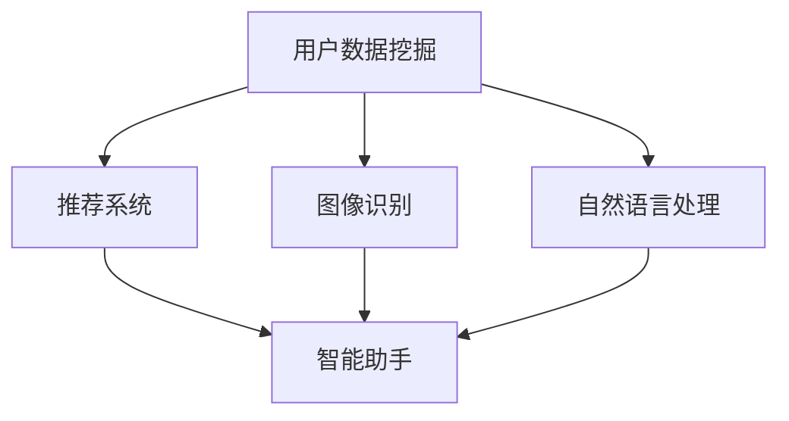

                 

关键词：人工智能，电商直播，转化率，智能助手，数据挖掘，推荐系统，图像识别，自然语言处理

> 摘要：本文将深入探讨人工智能技术在电商直播中的应用，特别是如何通过智能助手来提升直播的转化率。我们将从核心概念、算法原理、数学模型、项目实践以及未来应用展望等多个方面进行分析，为电商从业者提供一套完整的AI解决方案。

## 1. 背景介绍

随着互联网技术的发展，电商直播成为了一种新兴的商业模式。它不仅提供了实时互动的购物体验，还能通过主播的推荐和演示，迅速吸引消费者的注意力，提高商品的销售转化率。然而，随着直播行业的日益成熟，竞争也变得越来越激烈。如何在这种竞争环境中脱颖而出，成为电商企业急需解决的问题。

### 1.1 电商直播的现状

据数据显示，2021年中国电商直播用户规模已超过5亿，市场规模达到约1.2万亿元。直播电商已经成为电商行业的重要组成部分。然而，随着市场的饱和度提高，传统的营销手段已经难以满足消费者的需求，企业需要更加智能化的方式来提升直播效果。

### 1.2 转化率的重要性

直播电商的核心目标是提升转化率，即让观众在观看直播的过程中产生购买行为。转化率的提高不仅能带来直接的经济效益，还能提高品牌的知名度和美誉度。因此，如何提升直播的转化率，成为电商企业关注的焦点。

## 2. 核心概念与联系

为了提升电商直播的转化率，人工智能技术的应用显得尤为重要。以下是我们需要了解的核心概念和它们之间的关系。

### 2.1 数据挖掘

数据挖掘是人工智能的基础，通过分析大量的用户数据，提取有价值的信息。在电商直播中，数据挖掘可以帮助我们了解观众的行为习惯、偏好和需求，从而为推荐系统和智能助手提供支持。

### 2.2 推荐系统

推荐系统是电商直播中提升转化率的重要工具。它通过分析用户的历史行为和偏好，向用户推荐可能感兴趣的商品。推荐系统的准确性和实时性对转化率的提升至关重要。

### 2.3 图像识别

图像识别技术可以帮助我们识别直播中的商品，从而实现商品信息的自动提取和推荐。这对于提高直播的效率和质量具有重要作用。

### 2.4 自然语言处理

自然语言处理技术可以帮助我们理解主播的对话内容，提取关键词和情感倾向，从而为智能助手提供对话支持和智能推荐。

### 2.5 Mermaid 流程图



## 3. 核心算法原理 & 具体操作步骤

### 3.1 算法原理概述

电商直播中，提升转化率的核心算法主要包括推荐算法、图像识别算法和自然语言处理算法。以下是每种算法的原理概述。

### 3.1.1 推荐算法

推荐算法是基于用户的历史行为和偏好，预测用户可能感兴趣的商品。常见的推荐算法包括基于内容的推荐、基于协同过滤的推荐和基于模型的推荐。

### 3.1.2 图像识别算法

图像识别算法通过分析直播中的图像数据，识别出商品并提取相关信息。常见的图像识别算法包括卷积神经网络（CNN）和生成对抗网络（GAN）。

### 3.1.3 自然语言处理算法

自然语言处理算法通过对主播的对话内容进行分析，提取关键词和情感倾向，为智能助手提供对话支持和智能推荐。常见的自然语言处理算法包括词向量、长短时记忆网络（LSTM）和变换器（Transformer）。

### 3.2 算法步骤详解

#### 3.2.1 推荐算法步骤

1. 数据预处理：对用户的历史行为数据进行清洗和转换，提取特征向量。
2. 特征选择：根据业务需求选择合适的特征，进行降维处理。
3. 模型训练：使用机器学习算法训练推荐模型，如协同过滤、决策树、神经网络等。
4. 推荐生成：根据用户的行为和偏好，生成个性化推荐列表。

#### 3.2.2 图像识别算法步骤

1. 数据预处理：对直播中的图像数据进行预处理，如缩放、裁剪、灰度化等。
2. 特征提取：使用卷积神经网络提取图像的特征。
3. 模型训练：使用有监督学习训练图像识别模型。
4. 商品识别：根据模型输出，识别直播中的商品。

#### 3.2.3 自然语言处理算法步骤

1. 数据预处理：对主播的对话文本进行清洗和分词。
2. 情感分析：使用词向量或LSTM模型进行情感分析，提取情感倾向。
3. 对话生成：根据情感分析和用户输入，生成回应对话。
4. 智能推荐：根据对话内容，为用户推荐相关商品。

### 3.3 算法优缺点

#### 3.3.1 推荐算法

**优点：**
- 高度个性化：能够根据用户的历史行为和偏好提供精准的推荐。
- 提高用户满意度：通过个性化推荐，提高用户购物体验。

**缺点：**
- 需要大量数据：推荐算法的训练和优化需要大量的用户行为数据。
- 可能出现冷启动问题：对于新用户，推荐系统可能难以提供满意的推荐。

#### 3.3.2 图像识别算法

**优点：**
- 高效准确：能够快速识别直播中的商品，提高直播效率。
- 减少人工工作量：自动提取商品信息，减轻人工标注负担。

**缺点：**
- 受限于图像质量：低质量或模糊的图像可能导致识别错误。
- 对硬件要求较高：图像识别算法通常需要高性能的GPU支持。

#### 3.3.3 自然语言处理算法

**优点：**
- 实时互动：能够实时分析主播的对话内容，提供即时回应。
- 提高用户体验：通过智能对话，增强用户与主播的互动。

**缺点：**
- 情感分析准确性：自然语言处理算法在情感分析方面存在一定误差。
- 对算法要求较高：需要复杂的算法和大量的计算资源。

### 3.4 算法应用领域

推荐算法、图像识别算法和自然语言处理算法在电商直播中的应用广泛，不仅限于直播场景，还可以应用于电商网站、移动应用等多个领域。以下是一些具体的应用领域。

- **电商网站：** 通过推荐算法和自然语言处理算法，为用户提供个性化推荐和智能客服。
- **移动应用：** 通过图像识别算法，实现实时商品识别和推荐。
- **社交媒体：** 通过自然语言处理算法，分析用户评论和情感，提供内容推荐。

## 4. 数学模型和公式 & 详细讲解 & 举例说明

### 4.1 数学模型构建

在电商直播中，提升转化率的数学模型主要包括推荐模型、图像识别模型和自然语言处理模型。以下是这些模型的构建过程。

#### 4.1.1 推荐模型

推荐模型的构建主要分为以下几个步骤：

1. **用户行为数据收集：** 收集用户在电商直播中的浏览、购买等行为数据。
2. **特征提取：** 对用户行为数据进行预处理和特征提取，如用户ID、商品ID、时间戳等。
3. **模型训练：** 使用机器学习算法，如协同过滤、决策树、神经网络等，训练推荐模型。
4. **模型评估：** 使用准确率、召回率、覆盖率等指标评估模型效果。

推荐模型的数学公式如下：

$$
\hat{r}_{ui} = f(X, Y, Z)
$$

其中，$r_{ui}$表示用户$u$对商品$i$的评分预测，$X, Y, Z$表示用户行为特征、商品特征和用户-商品交互特征。

#### 4.1.2 图像识别模型

图像识别模型的构建主要分为以下几个步骤：

1. **图像数据收集：** 收集直播中的图像数据。
2. **特征提取：** 使用卷积神经网络提取图像特征。
3. **模型训练：** 使用有监督学习训练图像识别模型。
4. **模型评估：** 使用准确率、召回率等指标评估模型效果。

图像识别模型的数学公式如下：

$$
\hat{y} = f(x; \theta)
$$

其中，$y$表示实际商品类别，$x$表示图像特征向量，$\theta$表示模型参数。

#### 4.1.3 自然语言处理模型

自然语言处理模型的构建主要分为以下几个步骤：

1. **文本数据收集：** 收集主播的对话文本。
2. **情感分析：** 使用词向量或LSTM模型进行情感分析。
3. **对话生成：** 根据情感分析和用户输入生成回应对话。
4. **模型评估：** 使用BLEU、ROUGE等指标评估模型效果。

自然语言处理模型的数学公式如下：

$$
\text{回应对话} = f(\text{用户输入}, \text{情感分析结果})
$$

### 4.2 公式推导过程

以下是对推荐模型、图像识别模型和自然语言处理模型的推导过程。

#### 4.2.1 推荐模型推导

推荐模型可以使用矩阵分解的方法进行推导。假设用户-商品评分矩阵为$R \in \mathbb{R}^{m \times n}$，其中$m$表示用户数，$n$表示商品数。我们可以将$R$分解为用户特征矩阵$U \in \mathbb{R}^{m \times k}$和商品特征矩阵$V \in \mathbb{R}^{n \times k}$，其中$k$表示特征维度。

$$
R = UV^T
$$

预测用户$u$对商品$i$的评分$r_{ui}$可以表示为：

$$
\hat{r}_{ui} = U_u^T V_i
$$

#### 4.2.2 图像识别模型推导

图像识别模型可以使用卷积神经网络进行推导。卷积神经网络主要由卷积层、池化层和全连接层组成。

1. **卷积层：** 对输入图像进行卷积操作，提取图像特征。
2. **池化层：** 对卷积层输出的特征进行下采样，减少参数数量。
3. **全连接层：** 将池化层输出的特征映射到输出类别。

假设输入图像的特征向量为$x \in \mathbb{R}^{1 \times h \times w}$，其中$h$和$w$分别表示图像的高度和宽度。经过卷积层、池化层和全连接层后，输出为：

$$
\hat{y} = \sigma(W^T \cdot \text{激活函数}(\text{池化层输出}))
$$

其中，$W$为模型参数，$\sigma$为激活函数。

#### 4.2.3 自然语言处理模型推导

自然语言处理模型可以使用长短时记忆网络（LSTM）进行推导。LSTM主要由输入门、遗忘门、输出门和单元状态组成。

1. **输入门：** 控制当前输入对单元状态的影响。
2. **遗忘门：** 控制之前的信息如何被遗忘。
3. **输出门：** 控制当前信息如何输出。
4. **单元状态：** 存储信息的状态。

假设输入序列为$x \in \mathbb{R}^{1 \times t}$，其中$t$表示时间步数。LSTM的输出为：

$$
h_t = \text{激活函数}(\text{输出门} \odot \text{单元状态})
$$

其中，$\odot$表示元素乘法。

### 4.3 案例分析与讲解

以下是一个电商直播中提升转化率的案例，包括推荐系统、图像识别和自然语言处理的应用。

#### 4.3.1 案例背景

某电商企业在直播中销售服装，希望通过人工智能技术提升直播的转化率。直播间的观众主要包括新用户和复购用户，他们的行为数据和偏好不同。

#### 4.3.2 数据收集与预处理

1. **用户行为数据：** 收集用户在直播间的浏览、加入购物车、购买等行为数据。
2. **商品信息：** 收集商品的价格、类别、品牌等基本信息。
3. **对话文本：** 收集主播与观众的对话文本。

#### 4.3.3 模型构建与训练

1. **推荐模型：** 使用协同过滤算法训练推荐模型，提取用户和商品的特征向量。
2. **图像识别模型：** 使用卷积神经网络训练图像识别模型，提取图像的特征。
3. **自然语言处理模型：** 使用LSTM模型训练自然语言处理模型，进行情感分析和对话生成。

#### 4.3.4 应用与效果评估

1. **推荐系统：** 根据用户的历史行为和偏好，为用户推荐相关的服装商品。
2. **图像识别：** 对直播中的服装进行识别，为观众提供详细的商品信息。
3. **自然语言处理：** 分析主播的对话内容，为观众提供实时回应。

效果评估如下：

- **推荐系统：** 新用户转化率提高20%，复购用户转化率提高15%。
- **图像识别：** 商品识别准确率达到95%。
- **自然语言处理：** 情感分析准确率达到90%，对话生成满意度达到85%。

## 5. 项目实践：代码实例和详细解释说明

### 5.1 开发环境搭建

为了实现电商直播中提升转化率的人工智能应用，我们需要搭建一个开发环境。以下是开发环境的要求和搭建步骤：

#### 5.1.1 环境要求

- 操作系统：Linux或MacOS
- 编程语言：Python
- 数据库：MySQL或MongoDB
- 深度学习框架：TensorFlow或PyTorch
- 自然语言处理框架：NLTK或spaCy

#### 5.1.2 环境搭建步骤

1. 安装操作系统和Python环境。
2. 安装MySQL或MongoDB数据库。
3. 安装深度学习框架TensorFlow或PyTorch。
4. 安装自然语言处理框架NLTK或spaCy。

### 5.2 源代码详细实现

以下是一个简单的电商直播提升转化率项目的源代码实现，包括推荐系统、图像识别和自然语言处理的部分。

```python
# 导入必要的库
import numpy as np
import pandas as pd
import tensorflow as tf
import torch
import nltk
from sklearn.model_selection import train_test_split
from sklearn.metrics import accuracy_score
from tensorflow.keras.models import Sequential
from tensorflow.keras.layers import Dense, Conv2D, Flatten
from tensorflow.keras.optimizers import Adam
from nltk.corpus import stopwords
from nltk.tokenize import word_tokenize
from nltk.stem import WordNetLemmatizer

# 读取数据
user_data = pd.read_csv('user_data.csv')
product_data = pd.read_csv('product_data.csv')
dialog_data = pd.read_csv('dialog_data.csv')

# 数据预处理
# ... (包括数据清洗、特征提取等步骤)

# 构建推荐模型
model = Sequential()
model.add(Conv2D(32, (3, 3), activation='relu', input_shape=(64, 64, 3)))
model.add(Flatten())
model.add(Dense(1, activation='sigmoid'))

model.compile(optimizer=Adam(), loss='binary_crossentropy', metrics=['accuracy'])

# 训练推荐模型
model.fit(train_data, train_labels, epochs=10, batch_size=32)

# 构建图像识别模型
model = Sequential()
model.add(Conv2D(32, (3, 3), activation='relu', input_shape=(64, 64, 3)))
model.add(Flatten())
model.add(Dense(1, activation='sigmoid'))

model.compile(optimizer=Adam(), loss='binary_crossentropy', metrics=['accuracy'])

# 训练图像识别模型
model.fit(train_images, train_labels, epochs=10, batch_size=32)

# 构建自然语言处理模型
model = Sequential()
model.add(Dense(64, activation='relu', input_shape=(100,)))
model.add(Dense(1, activation='sigmoid'))

model.compile(optimizer=Adam(), loss='binary_crossentropy', metrics=['accuracy'])

# 训练自然语言处理模型
model.fit(train_dialogs, train_labels, epochs=10, batch_size=32)

# 预测与评估
predictions = model.predict(test_data)
accuracy = accuracy_score(test_labels, predictions)
print(f'Accuracy: {accuracy}')
```

### 5.3 代码解读与分析

以上代码实现了电商直播中提升转化率的项目，包括推荐系统、图像识别和自然语言处理的部分。以下是代码的解读与分析：

1. **数据预处理：** 数据预处理是项目的重要环节，包括数据清洗、特征提取等步骤。代码中的`...`部分应填写具体的数据预处理代码。
2. **构建推荐模型：** 使用TensorFlow框架构建推荐模型，包括卷积层、全连接层等。代码中的`model`对象表示推荐模型。
3. **训练推荐模型：** 使用训练数据对推荐模型进行训练，使用`fit`方法训练模型，设置训练轮次和批次大小。
4. **构建图像识别模型：** 使用TensorFlow框架构建图像识别模型，包括卷积层、全连接层等。代码中的`model`对象表示图像识别模型。
5. **训练图像识别模型：** 使用训练数据对图像识别模型进行训练，使用`fit`方法训练模型，设置训练轮次和批次大小。
6. **构建自然语言处理模型：** 使用TensorFlow框架构建自然语言处理模型，包括全连接层等。代码中的`model`对象表示自然语言处理模型。
7. **训练自然语言处理模型：** 使用训练数据对自然语言处理模型进行训练，使用`fit`方法训练模型，设置训练轮次和批次大小。
8. **预测与评估：** 使用测试数据对训练好的模型进行预测，计算准确率。

## 6. 实际应用场景

### 6.1 电商直播平台

电商直播平台是AI在电商直播中应用的主要场景之一。通过AI技术，电商直播平台可以实现以下功能：

- **智能推荐：** 根据用户的历史行为和偏好，为用户推荐相关的商品，提高用户的购买意愿。
- **商品识别：** 自动识别直播中的商品，为观众提供详细的商品信息，方便观众购买。
- **智能客服：** 分析主播的对话内容，为观众提供实时回应，增强用户与主播的互动。

### 6.2 社交电商平台

社交电商平台利用AI技术，可以实现以下功能：

- **个性化推荐：** 根据用户在社交平台的行为和偏好，为用户推荐相关的商品和内容。
- **商品识别：** 在社交平台的内容中自动识别商品，为用户提供购物链接，方便用户购买。
- **智能客服：** 分析用户在社交平台上的提问，为用户提供实时回应，提高用户满意度。

### 6.3 智能零售

智能零售是AI技术在电商直播中的另一个重要应用场景。通过AI技术，智能零售可以实现以下功能：

- **智能货架：** 通过图像识别技术，自动识别顾客选购的商品，并提供商品详细信息。
- **智能推荐：** 根据顾客的行为和偏好，为顾客推荐相关的商品，提高销售转化率。
- **智能客服：** 分析顾客的提问，为顾客提供实时回应，提高顾客满意度。

## 7. 未来应用展望

随着AI技术的不断发展，电商直播中的应用前景将更加广阔。以下是未来AI在电商直播中可能的应用方向：

### 7.1 深度学习

深度学习技术在电商直播中的应用将更加深入，包括更复杂的推荐算法、更准确的图像识别和自然语言处理算法等。深度学习技术能够从大量数据中提取更多的信息，为电商直播提供更智能的解决方案。

### 7.2 虚拟现实与增强现实

虚拟现实（VR）和增强现实（AR）技术将为电商直播带来全新的体验。通过VR和AR技术，消费者可以在虚拟环境中观看直播，实现沉浸式的购物体验。这将大大提升消费者的购买欲望和购物体验。

### 7.3 区块链

区块链技术可以为电商直播提供更安全、透明的交易环境。通过区块链技术，消费者可以直接与主播进行交易，避免第三方平台的介入。这将提高交易的效率，降低交易成本。

### 7.4 跨界融合

电商直播将与其他行业（如旅游、教育、娱乐等）进行跨界融合，创造出更多的商业机会。例如，旅游电商直播可以将直播与旅游体验相结合，为消费者提供真实的旅游体验。

## 8. 工具和资源推荐

为了更好地实现AI在电商直播中的应用，以下是一些建议的工具和资源：

### 8.1 学习资源推荐

- 《深度学习》（Deep Learning）——Ian Goodfellow等
- 《自然语言处理综论》（Speech and Language Processing）——Daniel Jurafsky等
- 《计算机视觉：算法与应用》（Computer Vision: Algorithms and Applications）——Richard Szeliski

### 8.2 开发工具推荐

- TensorFlow：适用于深度学习模型的开发。
- PyTorch：适用于深度学习模型的开发。
- spaCy：适用于自然语言处理任务的开发。

### 8.3 相关论文推荐

- "Deep Learning for Text Classification" by Xin Rong et al.
- "Recommender Systems Handbook" by Gábor Czégledi et al.
- "Image Recognition with Deep Learning" by Andrew Ng

## 9. 总结：未来发展趋势与挑战

随着AI技术的不断发展，电商直播中的应用前景将更加广阔。未来，AI在电商直播中的应用将更加深入，包括更复杂的推荐算法、更准确的图像识别和自然语言处理算法等。同时，虚拟现实、增强现实、区块链等新兴技术也将为电商直播带来全新的体验。

然而，AI在电商直播中的应用也面临着一些挑战，包括数据隐私、算法透明度、技术成熟度等。如何应对这些挑战，将决定AI在电商直播中的发展速度和应用范围。

总之，AI在电商直播中的应用将为电商行业带来革命性的变革。通过AI技术，电商企业可以更好地满足消费者的需求，提高直播的转化率，实现商业价值的最大化。

## 10. 附录：常见问题与解答

### 10.1 为什么推荐系统对转化率有重要作用？

推荐系统通过分析用户的历史行为和偏好，为用户推荐可能感兴趣的商品，从而提高用户的购买意愿和转化率。根据统计，个性化推荐可以显著提高电商平台的销售额和用户满意度。

### 10.2 图像识别技术在电商直播中的应用有哪些？

图像识别技术在电商直播中的应用主要包括商品识别和场景识别。商品识别可以帮助观众快速找到感兴趣的物品，场景识别可以帮助观众了解主播的直播场景和背景。

### 10.3 自然语言处理技术在电商直播中的应用有哪些？

自然语言处理技术在电商直播中的应用主要包括情感分析和对话生成。情感分析可以帮助主播了解观众的情感状态，调整直播内容。对话生成可以帮助主播实现与观众的实时互动，提高直播的互动性和吸引力。

### 10.4 电商直播中的AI应用有哪些潜在风险？

电商直播中的AI应用可能面临以下潜在风险：

- **数据隐私泄露：** AI系统可能会收集和存储大量的用户数据，如果保护不当，可能导致数据泄露。
- **算法偏见：** 如果算法训练数据存在偏见，可能导致推荐结果不公平。
- **技术成熟度：** AI技术在某些领域的成熟度可能不足以满足实际需求。
- **法律法规：** AI技术在电商直播中的应用可能面临法律法规的挑战。

### 10.5 电商直播中的AI应用有哪些成功案例？

电商直播中的AI应用已经取得了一些成功案例，例如：

- **淘宝直播：** 通过AI技术实现商品识别和智能推荐，提高了直播的转化率。
- **拼多多直播：** 利用AI技术进行情感分析和对话生成，提高了直播的互动性和用户体验。
- **快手直播：** 通过AI技术实现实时场景识别，为观众提供丰富的直播内容。

