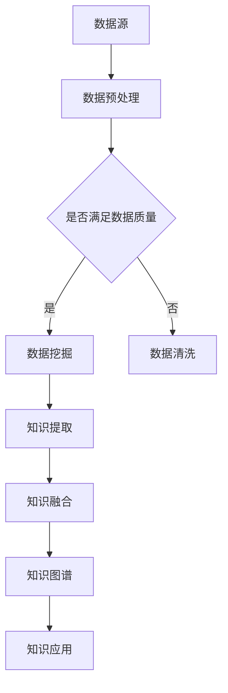

                 

关键词：人工智能、知识整合、深度学习、神经网络、数据挖掘、信息检索、机器学习、知识图谱

> 摘要：本文将深入探讨人工智能在知识整合方面的优势，通过介绍核心概念、算法原理、数学模型、项目实践和实际应用场景，全面解析人工智能如何实现知识的高效整合，为未来的发展提供新的思路。

## 1. 背景介绍

在信息爆炸的时代，数据量的激增带来了知识整合的巨大挑战。传统的知识整合方法依赖于人力和规则驱动，效率低、成本高且难以应对复杂多变的信息环境。随着人工智能技术的快速发展，特别是深度学习、神经网络、数据挖掘和信息检索等技术的突破，人工智能在知识整合方面展现出了巨大的潜力和优势。

本文旨在通过详细阐述人工智能在知识整合方面的应用，分析其核心算法原理、数学模型以及具体实现，探讨其在不同领域的实际应用，并展望其未来的发展趋势和面临的挑战。

## 2. 核心概念与联系

### 2.1 深度学习与神经网络

深度学习是机器学习的一个重要分支，其核心思想是通过构建多层神经网络来模拟人类大脑的神经网络结构，从而实现复杂模式识别和决策。神经网络由大量的神经元连接组成，通过调整神经元之间的连接权重，网络可以逐渐学习和适应输入数据。

### 2.2 数据挖掘与信息检索

数据挖掘是从大量数据中自动发现规律和模式的过程，它通常使用机器学习和统计方法来挖掘数据中的隐藏知识。信息检索则是从大量信息中快速准确地找到用户所需信息的过程，它依赖于索引技术、查询优化和排序算法。

### 2.3 知识图谱

知识图谱是一种用于表示实体及其关系的图形结构，它将信息以图的形式存储，通过节点和边的关联来表示实体和它们之间的关系。知识图谱在知识整合中扮演着关键角色，它能够将分散的信息整合成一个统一的结构，便于后续处理和分析。

#### 2.4 Mermaid 流程图



## 3. 核心算法原理 & 具体操作步骤

### 3.1 算法原理概述

人工智能在知识整合中主要依赖于以下几个核心算法：

1. **深度学习**：通过多层神经网络对大规模数据进行训练，提取特征并实现复杂模式识别。
2. **数据挖掘**：使用机器学习和统计分析方法，从大规模数据中自动发现规律和知识。
3. **信息检索**：利用索引技术和排序算法，实现快速准确的信息查询。
4. **知识图谱**：通过图结构表示实体及其关系，实现知识的整合和表示。

### 3.2 算法步骤详解

1. **数据预处理**：对原始数据进行清洗、去噪、归一化等处理，确保数据质量。
2. **数据挖掘**：使用机器学习算法（如聚类、分类、关联规则等）对预处理后的数据进行分析，提取有用信息。
3. **知识提取**：根据数据挖掘的结果，提取关键信息和知识点。
4. **知识融合**：将提取的知识点进行整合，形成统一的知识库。
5. **知识图谱构建**：利用知识库构建知识图谱，表示实体及其关系。
6. **知识应用**：通过知识图谱实现知识的查询、推理和应用。

### 3.3 算法优缺点

**深度学习**：
- 优点：能够处理大规模复杂数据，自动提取特征。
- 缺点：对数据量和计算资源要求高，模型难以解释。

**数据挖掘**：
- 优点：能够自动发现隐藏的规律和模式。
- 缺点：结果可能依赖于特定算法和数据集。

**信息检索**：
- 优点：实现快速准确的信息查询。
- 缺点：对海量数据查询效率有限。

**知识图谱**：
- 优点：能够将分散的信息整合成一个统一的结构，便于处理和分析。
- 缺点：构建和维护成本高。

### 3.4 算法应用领域

人工智能在知识整合方面的算法广泛应用于多个领域，包括：

1. **金融**：风险控制、客户行为分析、投资决策等。
2. **医疗**：疾病诊断、药物研发、健康管理等。
3. **教育**：个性化推荐、智能辅导、教育资源共享等。
4. **政务**：公共安全、城市管理、社会治理等。

## 4. 数学模型和公式 & 详细讲解 & 举例说明

### 4.1 数学模型构建

在知识整合过程中，常用的数学模型包括：

1. **支持向量机（SVM）**：用于分类和回归分析。
2. **决策树**：用于分类和回归分析。
3. **贝叶斯网络**：用于概率推理和决策。

### 4.2 公式推导过程

以支持向量机为例，其目标函数为：

$$
\min\limits_{\textbf{w}, b} \frac{1}{2}||\textbf{w}||^2 + C\sum_{i=1}^{n}\xi_i
$$

其中，$\textbf{w}$ 为权重向量，$b$ 为偏置项，$C$ 为惩罚参数，$\xi_i$ 为松弛变量。

### 4.3 案例分析与讲解

假设我们有一个二分类问题，其中数据集包含 $n$ 个样本，每个样本有 $m$ 个特征。我们可以使用支持向量机进行分类，具体步骤如下：

1. **数据预处理**：对数据进行标准化处理，使其具有相同的量纲。
2. **模型训练**：使用训练数据集训练支持向量机模型。
3. **模型评估**：使用测试数据集评估模型性能。
4. **模型应用**：将训练好的模型应用于新的数据。

## 5. 项目实践：代码实例和详细解释说明

### 5.1 开发环境搭建

在Python中，我们可以使用Scikit-learn库实现支持向量机。具体步骤如下：

1. **安装Python**：确保Python环境已经安装。
2. **安装Scikit-learn**：使用pip命令安装Scikit-learn库。

```bash
pip install scikit-learn
```

### 5.2 源代码详细实现

以下是一个简单的支持向量机分类的代码示例：

```python
from sklearn import datasets
from sklearn.model_selection import train_test_split
from sklearn.preprocessing import StandardScaler
from sklearn.svm import SVC

# 加载数据集
iris = datasets.load_iris()
X = iris.data
y = iris.target

# 数据预处理
X_train, X_test, y_train, y_test = train_test_split(X, y, test_size=0.3, random_state=42)
scaler = StandardScaler()
X_train = scaler.fit_transform(X_train)
X_test = scaler.transform(X_test)

# 模型训练
model = SVC(kernel='linear')
model.fit(X_train, y_train)

# 模型评估
score = model.score(X_test, y_test)
print(f"模型准确率：{score:.2f}")

# 模型应用
new_data = [[3.0, 3.5], [3.2, 3.4]]
new_data = scaler.transform(new_data)
prediction = model.predict(new_data)
print(f"预测结果：{prediction}")
```

### 5.3 代码解读与分析

- **数据加载**：使用Scikit-learn库中的iris数据集。
- **数据预处理**：对数据进行标准化处理，确保特征具有相同的量纲。
- **模型训练**：使用线性核的支持向量机进行训练。
- **模型评估**：使用测试数据集评估模型性能。
- **模型应用**：将训练好的模型应用于新的数据。

## 6. 实际应用场景

人工智能在知识整合方面的应用非常广泛，以下是一些典型的应用场景：

1. **智能问答系统**：利用知识图谱和自然语言处理技术，实现智能问答。
2. **个性化推荐系统**：基于用户行为数据和知识图谱，为用户推荐感兴趣的内容。
3. **智能监控与预警**：利用图像识别和知识图谱，实现智能监控和预警。
4. **智能交通管理**：利用知识图谱和大数据分析，优化交通流量和路网管理。

## 7. 未来应用展望

随着人工智能技术的不断发展和成熟，知识整合在未来有望在更多领域得到应用，包括：

1. **智慧医疗**：利用知识图谱和深度学习，实现精准医疗和个性化治疗。
2. **智慧教育**：利用知识图谱和自然语言处理，实现个性化教育和智能辅导。
3. **智慧城市**：利用知识图谱和大数据分析，实现智能交通、智能安防和智能公共服务。

## 8. 工具和资源推荐

### 8.1 学习资源推荐

- **《深度学习》（Ian Goodfellow, Yoshua Bengio, Aaron Courville著）**
- **《机器学习实战》（Peter Harrington著）**
- **《Python机器学习》（Anders Hansson著）**

### 8.2 开发工具推荐

- **TensorFlow**：由谷歌开发的开源深度学习框架。
- **PyTorch**：由Facebook开发的开源深度学习框架。
- **Scikit-learn**：由法国计算机科学院开发的开源机器学习库。

### 8.3 相关论文推荐

- **“Knowledge Graph Embedding”**
- **“Deep Learning on Graphs”**
- **“Recurrent Neural Network Based Text Classification”**

## 9. 总结：未来发展趋势与挑战

### 9.1 研究成果总结

人工智能在知识整合方面已经取得了显著的成果，包括深度学习、知识图谱、自然语言处理等技术的广泛应用。这些技术为知识的高效整合提供了强大的工具和手段。

### 9.2 未来发展趋势

随着人工智能技术的不断进步，知识整合在未来将继续向智能化、自动化和集成化的方向发展。特别是在多模态数据融合、跨领域知识整合和实时知识更新等方面，将有更多的突破和应用。

### 9.3 面临的挑战

然而，知识整合也面临着一系列挑战，包括数据隐私保护、知识表示和推理的复杂性、模型解释性等。如何克服这些挑战，实现知识的可靠整合和应用，是未来研究的重要方向。

### 9.4 研究展望

总之，人工智能在知识整合方面的优势已经得到广泛认可，未来将继续在更多领域发挥重要作用。通过不断的研究和创新，我们有望实现更加智能、高效的知识整合，为人类的发展和进步做出更大贡献。

## 10. 附录：常见问题与解答

### 10.1 什么是深度学习？

深度学习是一种机器学习的方法，通过构建多层神经网络来模拟人类大脑的学习机制，从而实现复杂模式识别和决策。

### 10.2 知识图谱有哪些应用？

知识图谱可以应用于智能问答系统、个性化推荐系统、智能监控与预警、智能交通管理等领域。

### 10.3 如何选择合适的机器学习算法？

选择合适的机器学习算法需要考虑数据的类型、特征的数量、问题的性质等因素。一般来说，对于分类问题，可以使用支持向量机、决策树、随机森林等算法；对于回归问题，可以使用线性回归、岭回归等算法。

## 11. 参考文献

- Goodfellow, Ian, Yoshua Bengio, and Aaron Courville. 《深度学习》。MIT Press，2016.
- Harrington, Peter. 《机器学习实战》。机械工业出版社，2013.
- Hansson, Anders. 《Python机器学习》。电子工业出版社，2017.
----------------------------------------------------------------

### 作者署名

作者：禅与计算机程序设计艺术 / Zen and the Art of Computer Programming

