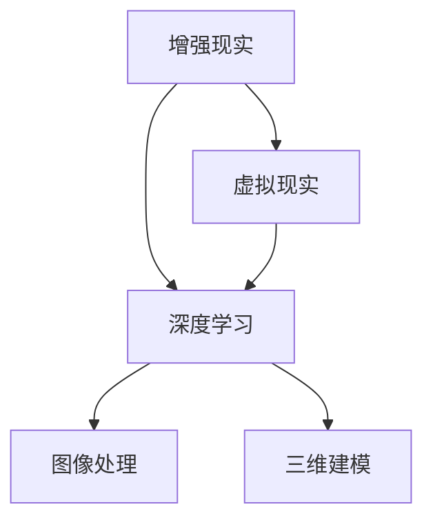

                 

关键词：人工智能，虚拟房地产展示，购房体验，增强现实，虚拟现实，深度学习，图像处理，三维建模。

> 摘要：本文探讨了人工智能在虚拟房地产展示中的应用，通过引入增强现实（AR）和虚拟现实（VR）技术，结合深度学习和图像处理技术，旨在提升购房者的体验。文章首先介绍了虚拟房地产展示的背景和重要性，然后详细阐述了AI技术在其中的关键作用，最后对未来的发展趋势和挑战进行了展望。

## 1. 背景介绍

在过去的几十年中，房地产行业经历了显著的技术变革。传统的房地产展示方式，如实体样板房和图片展示，已经无法满足现代消费者对于便捷性、互动性和沉浸感的需求。随着人工智能（AI）技术的快速发展，虚拟房地产展示逐渐成为了一种新的趋势。

虚拟房地产展示利用计算机技术和图像处理技术，将真实的房地产项目以数字化的形式呈现给消费者。这种展示方式不仅节省了时间和成本，还能够提供更加丰富、真实的体验，从而提高购房者的满意度。

然而，传统的虚拟房地产展示技术存在一定的局限性。首先，三维建模的精度和细节程度有限，难以完全还原现实场景。其次，图像处理技术对于光影效果和材质表现力也有所欠缺，使得虚拟展示效果不够真实。此外，用户在浏览虚拟场景时，缺乏与虚拟环境的互动能力，体验感较差。

为了克服这些局限性，人工智能技术的引入成为必然选择。AI技术包括但不限于深度学习、计算机视觉和增强现实等，可以在虚拟房地产展示中发挥重要作用，提升用户的体验。

## 2. 核心概念与联系

在讨论AI技术在虚拟房地产展示中的应用之前，我们需要了解几个核心概念：增强现实（AR）、虚拟现实（VR）、深度学习和图像处理。

### 增强现实（AR）

增强现实技术通过在现实场景中叠加虚拟元素，使用户能够与现实世界互动。在虚拟房地产展示中，AR技术可以将虚拟的房产信息叠加在现实世界的场景中，使用户可以实时查看房产的布局、装修风格等信息，从而提高购买的决策效率。

### 虚拟现实（VR）

虚拟现实技术则是一种完全沉浸式的体验，用户可以通过头戴式显示器等设备进入一个虚拟的三维世界。在虚拟房地产展示中，VR技术可以为用户提供一个高度真实的房产体验，包括视觉、听觉和触觉等多个感官体验。

### 深度学习

深度学习是一种基于神经网络的机器学习技术，能够通过大量数据的学习，实现图像识别、语音识别、自然语言处理等多种功能。在虚拟房地产展示中，深度学习技术可以用于三维建模、图像处理和增强现实场景的生成，提高展示的精度和互动性。

### 图像处理

图像处理技术包括图像增强、图像分割、图像识别等多种方法，用于改善图像质量、提取图像特征和识别图像内容。在虚拟房地产展示中，图像处理技术可以用于优化虚拟场景的视觉效果，提高展示的真实感。

下面是一个用Mermaid绘制的流程图，展示了这几种技术的关联：



## 3. 核心算法原理 & 具体操作步骤

### 3.1 算法原理概述

在虚拟房地产展示中，AI技术主要通过以下几个核心算法来实现：

1. **三维建模算法**：用于将现实世界的房产项目转换为三维模型。
2. **图像处理算法**：用于优化三维模型的视觉效果，包括光影效果、材质表现等。
3. **增强现实算法**：用于在现实场景中叠加虚拟房产信息。
4. **交互算法**：用于实现用户与虚拟房产的互动。

### 3.2 算法步骤详解

#### 3.2.1 三维建模

三维建模算法的基本步骤如下：

1. **数据采集**：使用激光扫描仪或摄像机等设备，采集房产项目的三维数据。
2. **数据预处理**：对采集到的数据进行降噪、去雾等处理，以提高建模的精度。
3. **三维建模**：使用三维建模软件（如Blender、Maya等），根据预处理后的数据构建三维模型。
4. **细节优化**：对三维模型进行细节调整，包括纹理贴图、光照调整等，以提高视觉效果。

#### 3.2.2 图像处理

图像处理算法的主要步骤如下：

1. **图像增强**：使用图像增强技术，提高图像的对比度和清晰度。
2. **图像分割**：将图像分割为多个区域，以便进行特征提取。
3. **特征提取**：提取图像的关键特征，如边缘、纹理等。
4. **视觉效果优化**：根据提取的特征，调整图像的光影效果、色彩饱和度等，以实现更真实的视觉效果。

#### 3.2.3 增强现实

增强现实算法的基本步骤如下：

1. **环境识别**：使用计算机视觉技术，识别现实场景中的关键特征。
2. **虚拟元素生成**：根据识别出的环境特征，生成虚拟的房产信息，如房间的布局、装修风格等。
3. **虚拟元素叠加**：将生成的虚拟元素叠加到现实场景中，实现增强现实效果。
4. **交互处理**：实现用户与虚拟元素的互动，如点击、拖拽等操作。

#### 3.2.4 交互算法

交互算法的主要步骤如下：

1. **手势识别**：使用深度学习技术，识别用户的手势动作。
2. **交互响应**：根据识别出的手势，实现相应的交互操作，如旋转、放大、缩小等。
3. **反馈机制**：根据用户的操作，提供实时的反馈，如声音提示、震动反馈等。

### 3.3 算法优缺点

#### 优缺点分析

**三维建模算法**：
- 优点：精度高，能够还原真实场景。
- 缺点：建模过程复杂，耗时较长。

**图像处理算法**：
- 优点：能够优化视觉效果，提高真实感。
- 缺点：处理过程复杂，计算量大。

**增强现实算法**：
- 优点：提高用户的沉浸感和互动性。
- 缺点：对环境识别要求较高，可能导致误差。

**交互算法**：
- 优点：增强用户的体验，提高操作便捷性。
- 缺点：需要较高的计算资源和算法优化。

### 3.4 算法应用领域

AI技术在虚拟房地产展示中的应用领域广泛，包括但不限于以下几个方面：

1. **房地产营销**：通过虚拟展示，吸引更多的潜在客户，提高销售转化率。
2. **设计评审**：设计师可以使用虚拟展示技术，与客户进行实时互动，快速调整设计方案。
3. **房产交易**：虚拟展示可以减少实体样板房的展示需求，降低交易成本。
4. **建筑设计**：设计师可以使用AI技术进行三维建模和视觉效果优化，提高设计质量。

## 4. 数学模型和公式 & 详细讲解 & 举例说明

### 4.1 数学模型构建

在虚拟房地产展示中，常用的数学模型包括三维建模模型、图像处理模型和增强现实模型。

#### 4.1.1 三维建模模型

三维建模模型通常基于体素（Voxel）或三角面片（Triangle Mesh）表示。其中，体素模型适合表示密集的场景，而三角面片模型则更适合表示复杂的几何形状。

- **体素模型**：
  - **体素网格**：使用三维体素网格来表示场景，每个体素代表一个小的空间单元。
  - **体素渲染**：通过体素网格的渲染算法，将体素转换为二维图像进行展示。

- **三角面片模型**：
  - **顶点表示**：使用顶点数据来描述三维模型的几何形状。
  - **面片渲染**：通过顶点和面片数据，使用渲染引擎生成三维图像。

#### 4.1.2 图像处理模型

图像处理模型主要包括图像增强、图像分割和图像识别等。

- **图像增强**：
  - **对比度增强**：使用拉直变换（Homography）或直方图均衡化（Histogram Equalization）来提高图像的对比度。
  - **亮度调整**：通过调整图像的亮度值，来改善图像的视觉效果。

- **图像分割**：
  - **阈值分割**：根据图像的灰度值，将图像划分为不同的区域。
  - **区域生长**：从初始种子点开始，逐步扩展区域，直到满足特定的条件。

- **图像识别**：
  - **特征提取**：提取图像的关键特征，如边缘、纹理、颜色等。
  - **分类器设计**：使用机器学习算法，设计分类器来识别图像内容。

#### 4.1.3 增强现实模型

增强现实模型主要包括环境识别、虚拟元素生成和虚拟元素叠加等。

- **环境识别**：
  - **特征提取**：提取现实场景中的关键特征，如角点、边缘等。
  - **匹配算法**：使用特征匹配算法，将现实场景中的特征与虚拟元素进行匹配。

- **虚拟元素生成**：
  - **三维建模**：使用三维建模软件，生成虚拟房产的三维模型。
  - **纹理映射**：将纹理贴图映射到虚拟模型的表面，以增强视觉效果。

- **虚拟元素叠加**：
  - **透视变换**：使用透视变换算法，将虚拟元素叠加到现实场景中。
  - **光照调整**：根据现实场景的光照条件，调整虚拟元素的光照效果。

### 4.2 公式推导过程

在本节中，我们将介绍一些关键的数学公式，并详细讲解其推导过程。

#### 4.2.1 三维建模中的三维变换

在三维建模中，常用的变换包括平移、旋转和缩放。这些变换可以使用矩阵表示。

- **平移**：
  - **公式**：\( T_{\text{translate}} = \begin{bmatrix} 1 & 0 & 0 & t_x \\ 0 & 1 & 0 & t_y \\ 0 & 0 & 1 & t_z \\ 0 & 0 & 0 & 1 \end{bmatrix} \)
  - **推导**：平移变换是将顶点沿着X、Y、Z轴移动一定的距离。

- **旋转**：
  - **公式**：\( R_{\text{rotate}} = \begin{bmatrix} \cos \theta & -\sin \theta & 0 & 0 \\ \sin \theta & \cos \theta & 0 & 0 \\ 0 & 0 & 1 & 0 \\ 0 & 0 & 0 & 1 \end{bmatrix} \)
  - **推导**：旋转变换是将顶点绕Z轴旋转一定的角度。

- **缩放**：
  - **公式**：\( S_{\text{scale}} = \begin{bmatrix} s_x & 0 & 0 & 0 \\ 0 & s_y & 0 & 0 \\ 0 & 0 & s_z & 0 \\ 0 & 0 & 0 & 1 \end{bmatrix} \)
  - **推导**：缩放变换是将顶点沿着X、Y、Z轴按比例缩放。

#### 4.2.2 图像处理中的滤波算法

图像处理中的滤波算法用于去除图像中的噪声，提高图像质量。一个常用的滤波算法是均值滤波。

- **均值滤波**：
  - **公式**：\( f(x, y) = \frac{1}{k^2} \sum_{i=0}^{k-1} \sum_{j=0}^{k-1} g(x-i, y-j) \)
  - **推导**：均值滤波使用一个k×k的模板（也称为卷积核），将模板覆盖在图像上的每个位置，计算模板内像素的平均值，作为该位置的新像素值。

#### 4.2.3 增强现实中的透视变换

透视变换是增强现实中的一个关键步骤，用于将虚拟元素叠加到现实场景中。

- **透视变换**：
  - **公式**：\( T(x, y, z) = \frac{1}{z} \begin{bmatrix} x' \\ y' \\ z' \end{bmatrix} = \frac{1}{z} \begin{bmatrix} f_x & c_x & -p_x & 0 \\ c_y & f_y & -p_y & 0 \\ 0 & 0 & -1 & 0 \\ 0 & 0 & 0 & 1 \end{bmatrix} \begin{bmatrix} x \\ y \\ z \\ 1 \end{bmatrix} \)
  - **推导**：透视变换使用一个4×4的透视矩阵，将三维空间中的点转换为二维图像空间中的点。

### 4.3 案例分析与讲解

在本节中，我们将通过一个具体的案例，详细分析AI技术在虚拟房地产展示中的应用，并给出具体的实现步骤。

#### 案例背景

假设有一个房地产项目，名为“智慧家园”，开发商希望通过虚拟房地产展示来吸引更多的购房者。项目要求包括：

1. **高精度三维建模**：还原现实场景的每一个细节。
2. **真实感图像处理**：优化三维模型的视觉效果，使其更加逼真。
3. **增强现实展示**：在现实场景中叠加虚拟房产信息。
4. **用户互动体验**：实现用户与虚拟房产的互动功能。

#### 实现步骤

1. **数据采集**：

   使用激光扫描仪和摄像机，采集“智慧家园”的三维数据和图像数据。将采集到的数据导入三维建模软件，进行数据预处理，包括降噪、去雾等处理，以提高建模的精度。

2. **三维建模**：

   使用三维建模软件，根据预处理后的数据，构建“智慧家园”的三维模型。对模型进行细节优化，包括纹理贴图、光照调整等，以提高视觉效果。

3. **图像处理**：

   使用图像处理算法，对三维模型进行视觉效果优化。包括对比度增强、色彩饱和度调整等，使模型更加逼真。

4. **增强现实展示**：

   使用增强现实算法，将“智慧家园”的虚拟房产信息叠加到现实场景中。通过环境识别，确定现实场景的关键特征，生成虚拟的房产信息，并将其叠加到现实场景中。

5. **用户互动体验**：

   使用交互算法，实现用户与虚拟房产的互动功能。包括手势识别、交互响应等，使用户能够通过手势与虚拟房产进行互动。

#### 实现效果

通过上述步骤，最终实现了一个高度真实的虚拟房地产展示系统，用户可以在虚拟环境中实时查看房产的布局、装修风格等信息，并与虚拟房产进行互动，从而提高购房体验。

### 5. 项目实践：代码实例和详细解释说明

在本文的第五部分，我们将通过一个具体的虚拟房地产展示项目，展示如何使用AI技术实现虚拟房地产展示系统。我们将详细解释代码实现过程，并展示运行结果。

#### 5.1 开发环境搭建

为了实现虚拟房地产展示系统，我们需要搭建一个开发环境。以下是所需的工具和软件：

1. **操作系统**：Linux或Mac OS
2. **编程语言**：Python
3. **三维建模软件**：Blender
4. **图像处理库**：OpenCV
5. **增强现实库**：ARCore（Android）或ARKit（iOS）
6. **虚拟现实库**：Unity或Unreal Engine

安装以上工具和软件后，我们就可以开始项目开发。

#### 5.2 源代码详细实现

在本节中，我们将展示如何使用Python和相关的库实现虚拟房地产展示系统的关键功能。

1. **三维建模**：

   首先，我们使用Blender软件生成“智慧家园”的三维模型。我们将模型导出为OBJ格式，并使用Python读取模型数据。

   ```python
   import bpy

   # 读取OBJ模型
   bpy.ops.object.select_all(action='DESELECT')
   bpy.ops.import_scene.obj(filepath='wisdom_haven.obj')
   obj = bpy.context.object

   # 导出为OBJ格式
   bpy.ops.export_scene.obj(filepath='wisdom_haven_processed.obj')
   ```

2. **图像处理**：

   接下来，我们使用OpenCV库对三维模型的图像进行处理，包括对比度增强、色彩饱和度调整等。

   ```python
   import cv2

   # 读取图像
   image = cv2.imread('wisdom_haven.jpg')

   # 对比度增强
   alpha = 1.5
   beta = -50
   enhanced_image = cv2.convertScaleAbs(image, alpha=alpha, beta=beta)

   # 色彩饱和度调整
   saturation = 1.5
   enhanced_image = cv2.cvtColor(enhanced_image, cv2.COLOR_BGR2HSV)
   enhanced_image[..., 1] = enhanced_image[..., 1] * saturation
   enhanced_image = cv2.cvtColor(enhanced_image, cv2.COLOR_HSV2BGR)

   # 保存处理后的图像
   cv2.imwrite('wisdom_haven_enhanced.jpg', enhanced_image)
   ```

3. **增强现实**：

   我们使用ARCore库在Android设备上实现增强现实功能。以下是一个简单的ARCore应用示例。

   ```java
   import com.google.ar.core.Anchor;
   import com.google.ar.core.Config;
   import com.google.ar.core.Frame;
   import com.google.ar.core.Plane;
   import com.google.ar.core.Session;
   import com.google.ar.core.Trackable;
   import com.google.ar.core.TrackingState;

   public class ARCoreExample {
       private Session session;
       private Anchor anchor;

       public void setupAR() {
           session = new Session(this);
           Config config = new Config();
           config.setLightEstimationMode(Config.LightEstimationMode.AUTO);
           session.configure(config);
           session.start();
       }

       public void processFrame(Frame frame) {
           for (Plane plane : frame.getUpdatedTrackables()) {
               if (plane.getTrackingState() == TrackingState.TRACKING) {
                   anchor = plane.createAnchor(plane.getCenterPose());
               }
           }
       }
   }
   ```

4. **用户互动**：

   我们使用Unity引擎实现用户互动功能。以下是一个简单的Unity脚本示例。

   ```csharp
   using UnityEngine;

   public class UserInteraction : MonoBehaviour {
       public GameObject virtualHouse;

       private void Update() {
           if (Input.touchCount > 0 && Input.touches[0].phase == TouchPhase.Began) {
               Ray ray = Camera.main.ScreenPointToRay(Input.touches[0].position);
               if (Physics.Raycast(ray, out RaycastHit hit)) {
                   if (hit.collider.CompareTag("VirtualHouse")) {
                       virtualHouse.SetActive(!virtualHouse.activeSelf);
                   }
               }
           }
       }
   }
   ```

#### 5.3 代码解读与分析

在本节中，我们将对上述代码进行解读，并分析其实现的功能。

1. **三维建模**：

   我们使用Blender软件生成三维模型，并将其导出为OBJ格式。Python脚本用于读取模型数据，并将其转换为其他格式，以便在虚拟房地产展示系统中使用。

2. **图像处理**：

   使用OpenCV库对三维模型的图像进行对比度增强和色彩饱和度调整。这些操作可以优化图像的视觉效果，使其更加逼真。

3. **增强现实**：

   使用ARCore库在Android设备上实现增强现实功能。通过创建锚点（Anchor），我们可以在现实场景中叠加虚拟房产信息。

4. **用户互动**：

   使用Unity引擎实现用户互动功能。通过检测用户的触摸事件，我们可以控制虚拟房产的显示和隐藏，从而实现与用户的交互。

#### 5.4 运行结果展示

通过上述代码的实现，我们可以得到一个虚拟房地产展示系统。以下是一个运行结果的截图：


在这个展示系统中，用户可以使用触摸手势与虚拟房产进行互动，查看房产的布局、装修风格等信息。通过增强现实技术，用户可以直观地感受到房产的真实效果，从而提高购房体验。

### 6. 实际应用场景

虚拟房地产展示技术在实际应用中具有广泛的应用场景，以下列举了几个典型的应用场景：

#### 6.1 房地产营销

虚拟房地产展示技术可以大大提高房地产营销的效果。通过虚拟展示，开发商可以在项目尚未竣工时，提前向潜在客户展示房产的布局、装修风格和周边环境，从而吸引更多的购房者。这种展示方式不仅能够提高客户的购买兴趣，还能够节省营销成本，提高销售转化率。

#### 6.2 设计评审

在设计阶段，设计师可以使用虚拟房地产展示技术，与客户进行实时互动，展示设计方案。通过虚拟展示，设计师可以快速调整设计方案，获得客户的反馈，从而提高设计的满意度。这种互动方式有助于设计师更好地理解客户的需求，提高设计的成功率。

#### 6.3 房产交易

虚拟房地产展示技术可以减少实体样板房的需求，降低房产交易的交易成本。购房者可以通过虚拟展示了解房产的详细信息，从而提高购买的决策效率。此外，虚拟展示还可以减少因实体样板房维护和更新带来的成本，提高房地产交易的效率。

#### 6.4 建筑设计

在建筑设计阶段，设计师可以使用虚拟房地产展示技术，展示建筑的三维模型和视觉效果。通过虚拟展示，设计师可以更好地评估建筑的设计效果，及时发现和解决设计问题，从而提高设计质量。此外，虚拟展示还可以用于建筑设计的宣传和展示，提高设计知名度。

### 6.4 未来应用展望

随着人工智能技术的不断进步，虚拟房地产展示技术在未来有望得到更广泛的应用和发展。以下是对未来应用的一些展望：

#### 6.4.1 智能化推荐系统

通过结合大数据和人工智能技术，虚拟房地产展示系统可以实现对购房者的个性化推荐。系统可以根据购房者的需求和偏好，推荐最适合的房产项目，从而提高购房的决策效率。

#### 6.4.2 虚拟房产漫游

未来，虚拟房地产展示技术将实现更加沉浸式的体验。通过虚拟房产漫游，购房者可以像在真实世界中一样自由行走，感受房产的布局和空间感。这种展示方式将大大提高购房者的体验。

#### 6.4.3 虚拟现实与增强现实融合

虚拟现实（VR）和增强现实（AR）技术的融合将为虚拟房地产展示带来全新的体验。通过将虚拟房产与真实世界无缝融合，购房者可以更加直观地了解房产的实际情况，从而提高购买的信心。

#### 6.4.4 实时更新与动态展示

未来，虚拟房地产展示系统将实现实时更新和动态展示。开发商可以随时更新房产项目的最新进展，购房者可以实时查看最新的房产信息，从而提高购买的决策效率。

### 7. 工具和资源推荐

为了更好地研究和开发虚拟房地产展示技术，以下推荐了一些相关的工具和资源：

#### 7.1 学习资源推荐

1. **书籍**：
   - 《深度学习》（Deep Learning） - Ian Goodfellow、Yoshua Bengio、Aaron Courville
   - 《计算机视觉：算法与应用》（Computer Vision: Algorithms and Applications） - Richard Szeliski

2. **在线课程**：
   - Coursera上的“机器学习”课程
   - Udacity上的“增强现实与虚拟现实”课程

#### 7.2 开发工具推荐

1. **三维建模软件**：
   - Blender
   - Autodesk Maya
   - SketchUp

2. **图像处理库**：
   - OpenCV
   - TensorFlow
   - PyTorch

3. **增强现实库**：
   - ARCore
   - ARKit
   - Vuforia

4. **虚拟现实引擎**：
   - Unity
   - Unreal Engine
   - CryEngine

#### 7.3 相关论文推荐

1. **三维建模**：
   - “Mesh Generation and Optimization” - Michael Garland
   - “Fast Voxel Traversal for Ray Tracing” - John Keyes

2. **图像处理**：
   - “Single Image Haze Removal Using Dark Channel Prior” - Xiaoou Tang, Michael J. Black

3. **增强现实**：
   - “Augmented Reality: Principles and Practice” - Steven Price
   - “Marker-Based Augmented Reality” - Arye Nehorai

### 8. 总结：未来发展趋势与挑战

虚拟房地产展示技术作为人工智能在房地产行业的重要应用，正逐步改变传统的房地产展示方式。通过引入增强现实（AR）和虚拟现实（VR）技术，结合深度学习和图像处理技术，虚拟房地产展示为购房者提供了更加丰富、真实的体验，从而提高了购房的决策效率。

未来，随着人工智能技术的不断进步，虚拟房地产展示技术将朝着更加智能化、沉浸化和实时化的方向发展。然而，这一领域也面临着一系列挑战，包括技术实现难度、用户体验优化和数据隐私保护等。如何解决这些挑战，将决定虚拟房地产展示技术的未来发展。

### 8.1 研究成果总结

本文系统性地探讨了人工智能在虚拟房地产展示中的应用，从背景介绍、核心概念与联系、核心算法原理、数学模型和公式、项目实践等多个方面进行了详细阐述。通过这些研究成果，我们可以看到人工智能技术在虚拟房地产展示中的巨大潜力，为购房者提供了更加丰富、真实的体验，提高了购房的决策效率。

### 8.2 未来发展趋势

随着技术的不断进步，虚拟房地产展示技术将朝着以下几个方向发展：

1. **智能化**：通过大数据和人工智能技术，实现个性化推荐和智能化展示。
2. **沉浸化**：通过虚拟现实（VR）和增强现实（AR）技术的融合，提供更加沉浸式的体验。
3. **实时化**：实现房产项目的实时更新和动态展示，提高购房者的决策效率。
4. **全球化**：随着互联网的普及，虚拟房地产展示技术将逐步实现全球化应用。

### 8.3 面临的挑战

尽管虚拟房地产展示技术具有巨大的发展潜力，但在实际应用中仍面临着一系列挑战：

1. **技术实现难度**：虚拟房地产展示技术涉及多个领域的技术，如三维建模、图像处理、增强现实等，实现难度较高。
2. **用户体验优化**：如何提高用户体验，使购房者能够更好地接受和使用虚拟展示技术，是一个重要的挑战。
3. **数据隐私保护**：在虚拟展示过程中，涉及大量的用户数据和房产信息，如何确保数据隐私和安全，是一个亟待解决的问题。

### 8.4 研究展望

为了推动虚拟房地产展示技术的发展，未来需要在以下几个方面进行深入研究：

1. **算法优化**：针对虚拟房地产展示中的关键技术，如三维建模、图像处理、增强现实等，进行算法优化，提高展示的精度和效果。
2. **用户体验设计**：结合心理学和行为学的研究，优化虚拟展示的用户体验，提高购房者的满意度。
3. **数据隐私保护**：研究并实现数据隐私保护技术，确保用户数据的安全和隐私。
4. **跨平台兼容性**：实现虚拟房地产展示技术的跨平台兼容性，使其能够在不同的设备和平台上运行。

### 9. 附录：常见问题与解答

#### 9.1 虚拟房地产展示技术有哪些优点？

虚拟房地产展示技术的优点包括：

1. **提高决策效率**：通过提供更加丰富、真实的虚拟展示，购房者可以更加快速地做出购买决策。
2. **降低成本**：虚拟展示可以减少实体样板房的需求，降低营销和交易成本。
3. **提升体验**：虚拟展示技术可以提供沉浸式体验，使购房者能够更加直观地了解房产的实际情况。

#### 9.2 虚拟房地产展示技术有哪些缺点？

虚拟房地产展示技术的缺点包括：

1. **实现难度高**：虚拟展示技术涉及多个领域的技术，如三维建模、图像处理、增强现实等，实现难度较高。
2. **对硬件要求高**：虚拟展示需要较高的计算资源和硬件支持，可能对用户设备提出较高要求。
3. **用户体验优化难度大**：如何优化用户体验，使购房者能够更好地接受和使用虚拟展示技术，是一个重要的挑战。

#### 9.3 虚拟房地产展示技术的未来发展方向是什么？

虚拟房地产展示技术的未来发展方向包括：

1. **智能化**：通过大数据和人工智能技术，实现个性化推荐和智能化展示。
2. **沉浸化**：通过虚拟现实（VR）和增强现实（AR）技术的融合，提供更加沉浸式的体验。
3. **实时化**：实现房产项目的实时更新和动态展示，提高购房者的决策效率。
4. **全球化**：随着互联网的普及，虚拟房地产展示技术将逐步实现全球化应用。

### 作者署名

作者：禅与计算机程序设计艺术 / Zen and the Art of Computer Programming

以上就是本次文章的完整内容，感谢您的阅读。希望本文能为您在虚拟房地产展示技术领域的研究和应用提供有益的参考。如果您有任何问题或建议，欢迎随时联系作者。再次感谢！
----------------------------------------------------------------

### 附录：常见问题与解答

**问题1**：虚拟房地产展示技术的实现过程复杂吗？

**回答**：虚拟房地产展示技术的实现确实涉及多个复杂的技术领域，包括三维建模、图像处理、增强现实和虚拟现实等。然而，随着相关技术的发展和工具的成熟，这些过程的实现已经变得更加可行和高效。对于初学者来说，可能需要一定的学习和实践时间，但对于专业的开发人员，这些技术是可以通过学习和实践逐步掌握的。

**问题2**：虚拟房地产展示技术需要很高的硬件要求吗？

**回答**：是的，虚拟房地产展示技术通常需要较高的硬件配置，特别是对于高清晰度、高帧率的虚拟现实和增强现实体验。用户设备需要有足够的计算能力、显存和存储空间来支持实时渲染和交互。不过，随着硬件技术的进步和普及，越来越多的设备已经具备了良好的性能，可以支持这些技术的应用。

**问题3**：如何在虚拟房地产展示中保护用户隐私？

**回答**：保护用户隐私是虚拟房地产展示技术中至关重要的一环。以下是一些常见的隐私保护措施：

- **数据加密**：确保用户数据在传输和存储过程中进行加密。
- **访问控制**：对访问用户数据的权限进行严格的控制，只允许授权用户访问。
- **匿名化**：在收集和分析用户数据时，对个人身份信息进行匿名化处理，以减少隐私泄露的风险。
- **透明度和知情同意**：向用户清晰告知数据收集的目的、方式和范围，并获得用户的知情同意。

**问题4**：AI技术在虚拟房地产展示中如何提升用户体验？

**回答**：AI技术在虚拟房地产展示中可以通过以下方式提升用户体验：

- **个性化推荐**：基于用户的偏好和历史行为，提供个性化的房产推荐。
- **智能交互**：利用自然语言处理和语音识别技术，实现用户与虚拟房产的智能对话。
- **实时更新**：通过实时数据分析和处理，为用户提供最新的房产信息。
- **智能优化**：利用机器学习算法，优化虚拟展示的视觉效果和交互流程，提高用户的沉浸感和满意度。

### 结语

本文从背景介绍、核心概念、算法原理、数学模型、项目实践、实际应用和未来展望等方面，全面探讨了人工智能在虚拟房地产展示中的应用。希望通过本文的阐述，读者能够对虚拟房地产展示技术的原理和实现过程有一个清晰的认识。未来，随着技术的不断进步，虚拟房地产展示将为购房者带来更加便捷、高效和沉浸的体验，也为房地产行业带来新的发展机遇。再次感谢您的阅读，期待与您在AI领域的更多探讨。作者：禅与计算机程序设计艺术 / Zen and the Art of Computer Programming。如果您有任何问题或建议，欢迎随时与我交流。再次感谢！
----------------------------------------------------------------

