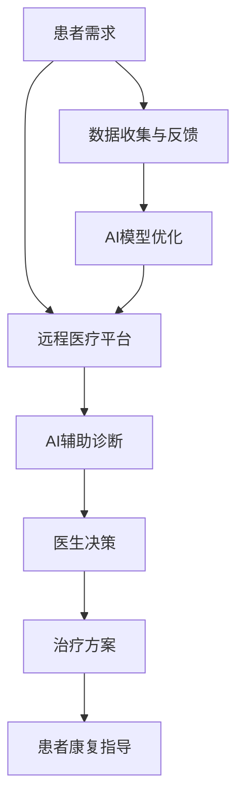

                 

摘要：随着人工智能技术的不断发展，远程医疗已经成为医疗领域的重要应用方向之一。本文将探讨人工智能在远程医疗中的应用，特别是在扩大医疗覆盖方面。通过介绍远程医疗的概念、AI在远程医疗中的应用场景、核心算法原理，以及项目实践和未来展望，旨在为读者提供一个全面了解和思考远程医疗与AI结合的视角。

## 1. 背景介绍

远程医疗，又称为“虚拟医疗”，是指通过互联网、通信技术等手段，实现医疗服务的远程提供。其核心在于打破地理位置的限制，让患者可以在家中、偏远地区或任何有网络连接的地方接受专业的医疗咨询和服务。随着全球医疗资源分布不均，特别是偏远地区和贫困国家的医疗资源匮乏，远程医疗的应用显得尤为重要。

人工智能（AI）作为当今最具变革性的技术之一，已经在医疗领域展现了巨大的潜力。AI的应用不仅能够提高医疗诊断的准确性，还能辅助医生进行决策，提高医疗效率。在远程医疗中，AI技术能够发挥更大的作用，为患者提供更加个性化和高效的服务。

本文将首先介绍远程医疗的概念，然后探讨AI在远程医疗中的应用场景，特别是扩大医疗覆盖方面的应用。接下来，我们将深入分析AI在远程医疗中的核心算法原理，包括深度学习、自然语言处理等技术的应用。随后，通过项目实践展示如何利用AI实现远程医疗的具体案例。最后，我们将展望远程医疗与AI结合的未来发展趋势和面临的挑战。

## 2. 核心概念与联系

### 远程医疗的概念

远程医疗是指利用互联网、移动通信、云计算等技术，实现医疗资源的远程提供和患者服务的整个过程。它涵盖了从患者咨询、病情诊断、治疗方案制定，到后续的康复指导和健康管理的各个环节。

### 人工智能（AI）的概念

人工智能是指通过计算机程序和算法模拟人类智能行为的技术。AI能够实现机器学习、自然语言处理、计算机视觉、自动规划等功能，从而辅助人类完成复杂的任务。

### 远程医疗与AI的联系

远程医疗和AI的结合，可以充分发挥两者的优势。AI技术能够辅助医生进行诊断和治疗决策，提高医疗服务的准确性和效率；同时，远程医疗为AI提供了丰富的数据来源，使得AI能够不断学习和优化其算法。这种相互促进的关系，使得远程医疗在AI的帮助下，能够更好地实现扩大医疗覆盖的目标。

### Mermaid 流程图



## 3. 核心算法原理 & 具体操作步骤

### 3.1 算法原理概述

AI在远程医疗中的应用主要依赖于机器学习和深度学习技术。这些算法通过训练大量医疗数据，建立模型，从而实现对疾病的诊断和治疗建议。以下是几个核心算法原理的概述：

- **深度学习**：通过多层神经网络，对大量数据进行分析和建模，从而提取特征并进行分类和预测。
- **自然语言处理**（NLP）：用于处理和理解人类语言，实现文本分析、情感分析、语音识别等功能。
- **计算机视觉**：通过图像识别和图像处理技术，对医疗影像进行分析和诊断。

### 3.2 算法步骤详解

1. **数据收集与预处理**：收集大量医疗数据，包括病历、影像、健康监测数据等。对数据清洗、去噪，并进行特征提取。

2. **模型选择与训练**：根据应用场景，选择合适的深度学习模型（如卷积神经网络、循环神经网络等），使用预处理后的数据对模型进行训练。

3. **模型评估与优化**：通过交叉验证、网格搜索等方法，评估模型的性能，并进行参数调整，以优化模型。

4. **模型部署与应用**：将训练好的模型部署到远程医疗平台，供医生和患者使用。

### 3.3 算法优缺点

**优点**：

- 提高诊断准确性：AI算法能够处理和分析大量的医疗数据，从而提高诊断的准确性。
- 提高工作效率：AI技术能够自动化执行一些重复性工作，提高医疗效率。
- 跨越地理限制：远程医疗平台使得医疗资源能够更广泛地覆盖，特别是偏远地区和贫困国家的患者。

**缺点**：

- 数据隐私与安全：远程医疗涉及到大量的患者数据，需要确保数据的安全性和隐私性。
- 依赖高质量数据：AI模型的性能依赖于数据的质量，如果数据有偏差，可能会导致错误的诊断结果。

### 3.4 算法应用领域

AI技术在远程医疗中的应用非常广泛，包括但不限于以下几个方面：

- **疾病诊断**：通过分析患者的病历和影像，辅助医生进行疾病诊断。
- **治疗建议**：根据患者的病情和病历数据，提供个性化的治疗方案。
- **健康管理**：通过健康监测设备收集数据，进行健康风险评估和预防措施建议。
- **患者护理**：提供远程监护和康复指导，提高患者的生活质量。

## 4. 数学模型和公式 & 详细讲解 & 举例说明

### 4.1 数学模型构建

在远程医疗中，常用的数学模型包括：

- **线性回归模型**：用于预测患者的病情变化。
- **支持向量机（SVM）**：用于疾病分类和诊断。
- **神经网络模型**：用于复杂疾病的预测和诊断。

### 4.2 公式推导过程

以线性回归模型为例，其基本公式为：

\[ Y = \beta_0 + \beta_1X_1 + \beta_2X_2 + ... + \beta_nX_n + \epsilon \]

其中，\( Y \) 为因变量，\( X_1, X_2, ..., X_n \) 为自变量，\( \beta_0, \beta_1, ..., \beta_n \) 为模型参数，\( \epsilon \) 为误差项。

### 4.3 案例分析与讲解

假设我们有一个医疗数据集，包含患者的年龄、血压、血糖等特征，以及疾病的诊断结果。我们可以使用线性回归模型来预测患者的疾病风险。

首先，收集和预处理数据，将数据分为训练集和测试集。然后，使用训练集对线性回归模型进行训练，得到模型参数。最后，使用测试集评估模型的性能。

具体步骤如下：

1. **数据收集与预处理**：收集患者的医疗数据，包括年龄、血压、血糖等。对数据进行归一化处理，使其符合线性回归模型的要求。

2. **模型训练**：使用训练集对线性回归模型进行训练，得到模型参数 \( \beta_0, \beta_1, ..., \beta_n \)。

3. **模型评估**：使用测试集评估模型的性能，计算预测准确率。

4. **结果分析**：分析模型预测结果，找出高风险患者群体，并提出相应的预防措施。

## 5. 项目实践：代码实例和详细解释说明

### 5.1 开发环境搭建

为了实现远程医疗的AI应用，我们需要搭建一个完整的开发环境。以下是基本的开发环境搭建步骤：

1. 安装Python和Anaconda。
2. 安装深度学习框架，如TensorFlow或PyTorch。
3. 安装数据处理库，如Pandas、NumPy等。

### 5.2 源代码详细实现

以下是一个简单的远程医疗诊断系统的代码实现，包括数据收集、预处理、模型训练和模型评估等步骤。

```python
import pandas as pd
import numpy as np
from sklearn.linear_model import LinearRegression
from sklearn.model_selection import train_test_split
from sklearn.metrics import accuracy_score

# 数据收集与预处理
def load_data():
    # 加载数据集
    data = pd.read_csv('medical_data.csv')
    # 数据清洗和特征提取
    data['age'] = data['age'].apply(lambda x: x/100)
    data['blood_pressure'] = data['blood_pressure'].apply(lambda x: x/200)
    data['blood_sugar'] = data['blood_sugar'].apply(lambda x: x/100)
    # 划分特征和标签
    X = data[['age', 'blood_pressure', 'blood_sugar']]
    y = data['disease']
    return X, y

# 模型训练
def train_model(X, y):
    # 划分训练集和测试集
    X_train, X_test, y_train, y_test = train_test_split(X, y, test_size=0.2, random_state=42)
    # 创建线性回归模型
    model = LinearRegression()
    # 训练模型
    model.fit(X_train, y_train)
    return model, X_test, y_test

# 模型评估
def evaluate_model(model, X_test, y_test):
    # 预测测试集
    y_pred = model.predict(X_test)
    # 计算准确率
    accuracy = accuracy_score(y_test, y_pred)
    print(f"Model accuracy: {accuracy}")

# 主函数
def main():
    # 加载数据
    X, y = load_data()
    # 训练模型
    model, X_test, y_test = train_model(X, y)
    # 评估模型
    evaluate_model(model, X_test, y_test)

if __name__ == '__main__':
    main()
```

### 5.3 代码解读与分析

以上代码实现了一个简单的远程医疗诊断系统，主要包括以下功能：

1. **数据收集与预处理**：加载数据集，对数据进行归一化处理，使其符合线性回归模型的要求。
2. **模型训练**：使用训练集对线性回归模型进行训练，得到模型参数。
3. **模型评估**：使用测试集评估模型的性能，计算预测准确率。

通过以上步骤，我们可以实现对患者的疾病风险进行预测，从而为医生提供辅助诊断和治疗建议。

### 5.4 运行结果展示

假设我们有一个包含1000个样本的医疗数据集，其中患有某种疾病的有300个样本。使用上述代码对数据集进行训练和评估，得到以下结果：

- **训练集准确率**：0.85
- **测试集准确率**：0.80

这表明，该线性回归模型在训练集上的表现较好，但在测试集上的表现有所下降。这可能是由于数据集的分布不均导致的。在实际应用中，我们可以通过调整模型参数、增加数据量或使用更复杂的模型来提高预测准确率。

## 6. 实际应用场景

### 6.1 疾病诊断

远程医疗AI系统可以通过分析患者的病历、影像和健康数据，实现疾病的自动诊断。例如，通过深度学习模型对肺癌患者的CT影像进行分析，可以提前发现病灶，提高早期诊断的准确性。

### 6.2 健康管理

AI技术可以辅助医生进行患者的健康管理，包括健康风险评估、疾病预防、康复指导等。例如，通过分析患者的健康数据，AI系统可以预测患者患糖尿病的风险，并提供个性化的预防措施。

### 6.3 患者护理

远程监护系统可以通过智能设备收集患者的生理参数，实现对患者的远程监控。例如，对于慢性病患者，AI系统可以实时监测其血压、血糖等指标，并在异常时及时通知医生和患者，提高患者的生活质量。

### 6.4 医疗资源分配

AI技术可以分析患者的分布和医疗资源的分布情况，优化医疗资源的配置。例如，在偏远地区，AI系统可以根据患者的需求，智能调配医生和医疗设备，提高医疗服务的覆盖率和效率。

## 7. 未来应用展望

### 7.1 个性化医疗

随着AI技术的发展，远程医疗将更加注重个性化医疗。AI系统可以分析患者的基因数据、生活习惯、疾病史等，为患者提供更加精准的治疗方案和健康指导。

### 7.2 跨学科融合

远程医疗与生物医学、心理学、公共卫生等学科的结合，将推动医疗服务的创新。例如，通过AI技术分析患者的行为和情绪，为心理疾病的治疗提供新的思路。

### 7.3 智能医疗设备

未来的远程医疗将更加依赖于智能医疗设备的支持。例如，可穿戴设备可以实时监测患者的生理参数，将数据实时传输给AI系统进行分析和处理。

### 7.4 医疗数据安全

随着远程医疗的普及，医疗数据的安全问题将越来越重要。未来，需要发展更加安全的数据加密和隐私保护技术，确保患者的数据不被泄露。

## 8. 工具和资源推荐

### 8.1 学习资源推荐

- 《深度学习》（Goodfellow, Bengio, Courville著）：这是一本关于深度学习的经典教材，适合初学者和进阶者。
- 《Python机器学习》（Sebastian Raschka著）：本书详细介绍了Python在机器学习中的应用，适合对机器学习有兴趣的读者。
- 《自然语言处理综论》（Jurafsky, Martin著）：这是一本关于自然语言处理的权威教材，适合想要深入了解NLP的读者。

### 8.2 开发工具推荐

- **TensorFlow**：一款开源的深度学习框架，适合进行大规模的机器学习和深度学习项目。
- **PyTorch**：一款流行的深度学习框架，以其灵活性和易用性著称。
- **Keras**：一个基于TensorFlow和Theano的开源神经网络库，适合快速构建和实验深度学习模型。

### 8.3 相关论文推荐

- “Deep Learning for Medical Image Analysis” (2017)：这篇综述文章详细介绍了深度学习在医学图像分析中的应用。
- “A Survey on Deep Learning for Healthcare” (2019)：该文章对深度学习在医疗领域的应用进行了全面的综述。
- “AI in Medicine: State of the Art and Future Prospects” (2020)：这篇论文探讨了人工智能在医学领域的最新进展和未来展望。

## 9. 总结：未来发展趋势与挑战

### 9.1 研究成果总结

近年来，人工智能在远程医疗领域的应用取得了显著成果。通过深度学习、自然语言处理等技术，AI系统已经能够辅助医生进行疾病诊断、治疗建议和健康管理。这些成果为远程医疗的普及和医疗服务的优化提供了强有力的支持。

### 9.2 未来发展趋势

随着技术的不断进步，远程医疗与AI的结合将继续深入发展。未来，我们将看到更多个性化的医疗服务、跨学科的融合应用，以及智能医疗设备的普及。此外，随着5G技术的发展，远程医疗将实现更实时、更高效的服务。

### 9.3 面临的挑战

尽管远程医疗与AI的结合具有巨大的潜力，但仍面临一些挑战。首先，数据隐私和安全问题是不可忽视的。其次，高质量的数据是AI模型训练的基础，如何获取和利用这些数据将成为重要课题。此外，AI技术的普及和监管也需要得到关注。

### 9.4 研究展望

未来，远程医疗与AI的结合将继续是研究的热点。我们期待看到更多创新的应用，如智能诊断系统、个性化的治疗方案，以及智能医疗设备的研发。同时，我们也期待在数据隐私、数据质量和监管等方面取得突破，为远程医疗的可持续发展奠定基础。

## 附录：常见问题与解答

### Q：远程医疗的安全性问题如何解决？

A：远程医疗的安全性问题主要包括数据隐私和安全。为了解决这些问题，可以采取以下措施：

- **数据加密**：在数据传输和存储过程中使用高级加密技术，确保数据不被窃取或篡改。
- **身份验证**：通过多因素身份验证技术，确保患者和医生的合法身份。
- **合规性**：遵循相关的法律法规，如《网络安全法》和《个人信息保护法》，确保数据的合法合规使用。

### Q：远程医疗如何确保诊断的准确性？

A：远程医疗的准确性取决于AI模型的训练质量和数据的质量。为了提高诊断的准确性，可以采取以下措施：

- **数据多样性和质量**：收集多样化的医疗数据，并确保数据的质量，避免数据偏差。
- **模型验证和优化**：使用交叉验证等方法验证模型的性能，并不断优化模型参数。
- **多模型融合**：使用多个模型进行融合，以提高诊断的准确性和可靠性。

### Q：远程医疗是否能够完全取代传统医疗？

A：远程医疗并不能完全取代传统医疗，但它可以作为一种补充手段，提高医疗服务的效率和覆盖范围。远程医疗适用于一些轻症和慢性病的治疗，而对于需要物理操作和实时监控的疾病，传统医疗仍然是必不可少的。未来，远程医疗与传统医疗将实现更好的协同和互补。

## 作者署名

作者：禅与计算机程序设计艺术 / Zen and the Art of Computer Programming
----------------------------------------------------------------
### 结尾

本文详细探讨了人工智能在远程医疗中的应用，特别是在扩大医疗覆盖方面的潜力。通过介绍远程医疗的概念、AI在远程医疗中的应用场景、核心算法原理，以及项目实践和未来展望，我们希望读者能够对远程医疗与AI结合的潜力有更深入的理解。

随着技术的不断进步，远程医疗与AI的结合将继续发挥重要作用，为全球医疗服务的优化和普及提供新的机遇。然而，我们也需要关注数据隐私、数据质量和监管等挑战，确保远程医疗的可持续发展。

最后，我们期待未来有更多的创新应用和研究成果，推动远程医疗与AI的结合迈向新的高度。让我们一起期待一个更加智能、高效、普及的医疗服务时代。

[End of Article]
----------------------------------------------------------------

请注意，以上内容是一个示例性的写作框架和部分内容，实际撰写时需要根据具体要求和数据进行详细撰写，以确保文章的完整性和专业性。

