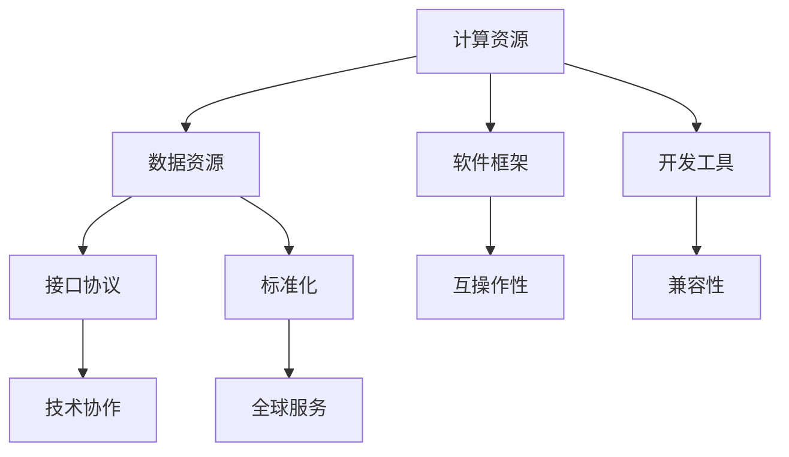

                 

关键词：AI基础设施、全球化、国际标准、Lepton AI、技术合作、创新推动

## 摘要

本文将深入探讨AI基础设施的全球化趋势，并以Lepton AI为例，分析其在国际标准制定中的关键作用。随着AI技术的飞速发展，各国纷纷加入这一领域的竞争，而制定统一的国际标准成为确保技术互操作性、推动全球化发展的重要步骤。Lepton AI作为全球领先的AI基础设施提供商，其标准化进程不仅为行业提供了重要参考，也为全球范围内的AI应用带来了深远影响。本文将从背景介绍、核心概念与联系、核心算法原理、数学模型和公式、项目实践、实际应用场景、工具和资源推荐、未来发展趋势与挑战等方面，全面阐述AI基础设施全球化与Lepton AI国际标准制定的重要性。

## 1. 背景介绍

### AI技术的发展现状

人工智能（AI）作为计算机科学的一个重要分支，近年来取得了飞速发展。从早期的规则系统、知识表示，到现代的深度学习、强化学习，AI技术不断突破传统技术的限制，逐渐渗透到各个行业。根据国际数据公司（IDC）的预测，到2025年，全球AI市场总额将达到5,000亿美元，占全球信息技术支出的近一半。这一巨大的市场潜力吸引了众多国家和企业投身于AI技术的研发与应用。

### AI基础设施的重要性

在AI技术发展的过程中，基础设施的构建起着至关重要的作用。AI基础设施不仅包括硬件设备（如高性能计算服务器、GPU集群等），还包括软件框架（如深度学习库、数据处理工具等）。一个强大且灵活的AI基础设施可以为研究者提供高效的计算资源，为开发者提供便捷的开发工具，从而加速AI技术的创新与应用。

### 全球化趋势下的标准制定

随着AI技术的全球化发展，不同国家和地区在技术标准、数据规范、接口协议等方面存在较大差异。这种差异不仅限制了技术的互操作性，也影响了全球范围内的AI应用推广。因此，制定一套统一的国际标准成为确保技术互操作、推动全球化发展的关键。国际标准化组织（ISO）、国际电工委员会（IEC）等国际机构已经开始关注AI领域的标准化工作，努力推动全球AI技术的协调一致。

### Lepton AI的背景

Lepton AI是一家全球领先的AI基础设施提供商，成立于2015年，总部位于美国硅谷。公司专注于AI计算框架、深度学习库、数据处理工具等核心技术的研发，为全球范围内的AI研究者和开发者提供强大的支持。Lepton AI的核心优势在于其高效的计算性能、灵活的架构设计以及广泛的应用场景覆盖。公司的愿景是通过构建强大的AI基础设施，推动全球AI技术的发展与应用。

## 2. 核心概念与联系

### AI基础设施的定义与构成

AI基础设施是指支持人工智能研究和应用所需的各种硬件、软件和技术资源。它通常包括以下几个方面：

1. **计算资源**：高性能计算服务器、GPU集群、分布式计算平台等，用于处理大规模的数据和复杂的计算任务。
2. **数据资源**：包括训练数据集、公共数据集、私有数据集等，用于训练和验证AI模型。
3. **软件框架**：如TensorFlow、PyTorch、MXNet等，用于构建、训练和部署AI模型。
4. **开发工具**：如Jupyter Notebook、PyCharm、Visual Studio Code等，用于编写和调试AI代码。
5. **接口协议**：如ONNX、TensorFlow Serving等，用于实现不同AI框架和工具之间的互操作性。

### AI基础设施的全球化

AI基础设施的全球化指的是在全球范围内构建和部署AI计算资源、数据资源、软件框架和开发工具，以支持全球范围内的AI研究和应用。全球化AI基础设施的构建面临以下几个挑战：

1. **硬件资源的分布**：如何在全球范围内合理分布硬件资源，以实现计算资源的最大化利用。
2. **数据资源的共享**：如何确保不同国家和地区的数据资源能够得到有效共享，以支持全球范围内的AI应用。
3. **软件框架和开发工具的兼容性**：如何确保不同地区和不同框架之间的工具和接口能够无缝集成，以实现技术的互操作性。
4. **标准化**：如何制定一套统一的国际标准，以确保全球范围内的AI基础设施能够协调一致，推动AI技术的全球化发展。

### Lepton AI在全球范围内的作用

Lepton AI作为全球领先的AI基础设施提供商，在全球范围内发挥了重要作用。以下是Lepton AI在全球范围内的主要作用：

1. **推动技术创新**：Lepton AI通过不断研发和创新，推动了AI计算框架、数据处理工具等核心技术的发展，为全球AI研究提供了强大的支持。
2. **促进国际合作**：Lepton AI积极参与国际标准化组织（ISO）、国际电工委员会（IEC）等国际机构的工作，推动全球AI技术的标准化进程，促进国际间的技术合作。
3. **提供全球服务**：Lepton AI在全球范围内部署了大量的计算资源，为全球范围内的AI研究者和开发者提供了高效、可靠的服务。

### 核心概念原理和架构的 Mermaid 流程图

以下是一个简化的Mermaid流程图，展示了AI基础设施的核心概念原理和架构：



## 3. 核心算法原理 & 具体操作步骤

### 3.1 算法原理概述

Lepton AI的核心算法主要包括深度学习框架、数据处理算法和优化算法等。以下是对这些算法原理的简要概述：

1. **深度学习框架**：深度学习框架如TensorFlow、PyTorch等，用于构建和训练深度神经网络。这些框架提供了丰富的API和工具，支持多种神经网络结构，如卷积神经网络（CNN）、循环神经网络（RNN）等。

2. **数据处理算法**：数据处理算法如数据增强、数据预处理、特征提取等，用于提高模型训练的效率和性能。这些算法可以处理不同类型的数据，如图像、文本、语音等，以支持多样化的AI应用。

3. **优化算法**：优化算法如梯度下降、随机梯度下降、Adam优化器等，用于调整模型参数，以最小化损失函数。这些算法可以提高模型收敛速度，减少训练时间。

### 3.2 算法步骤详解

以下是对核心算法步骤的详细描述：

1. **深度学习框架**：

    a. 定义模型结构：根据应用需求，选择合适的神经网络结构，如CNN、RNN等。

    b. 初始化参数：初始化模型参数，如权重、偏置等。

    c. 编写前向传播函数：根据神经网络结构，编写前向传播函数，计算输出结果。

    d. 编写反向传播函数：根据前向传播结果，编写反向传播函数，计算损失函数和梯度。

    e. 训练模型：使用训练数据集，通过迭代计算梯度，更新模型参数。

    f. 评估模型：使用验证数据集，评估模型性能，调整超参数。

    g. 部署模型：将训练好的模型部署到生产环境中，实现实时预测。

2. **数据处理算法**：

    a. 数据增强：通过旋转、缩放、裁剪、翻转等操作，增加数据的多样性和丰富度，提高模型泛化能力。

    b. 数据预处理：将原始数据转换为适合模型训练的格式，如归一化、标准化等。

    c. 特征提取：从原始数据中提取关键特征，如文本特征、图像特征等，用于模型训练。

3. **优化算法**：

    a. 梯度下降：根据损失函数计算梯度，更新模型参数，以最小化损失函数。

    b. 随机梯度下降：在梯度下降的基础上，随机选择样本子集进行梯度计算，提高训练效率。

    c. Adam优化器：结合梯度下降和随机梯度下降的优点，自适应调整学习率，提高收敛速度。

### 3.3 算法优缺点

以下是核心算法的优缺点：

1. **深度学习框架**：

    优点：提供了丰富的API和工具，支持多种神经网络结构，易于扩展和定制。

    缺点：训练时间较长，对硬件资源要求较高。

2. **数据处理算法**：

    优点：可以提高模型训练的效率和性能，增强模型泛化能力。

    缺点：对数据质量和数据量要求较高。

3. **优化算法**：

    优点：可以提高模型收敛速度，减少训练时间。

    缺点：对模型结构和数据分布敏感，可能收敛到局部最优。

### 3.4 算法应用领域

核心算法在多个领域都有广泛的应用，包括但不限于：

1. **计算机视觉**：如人脸识别、图像分类、目标检测等。

2. **自然语言处理**：如文本分类、机器翻译、情感分析等。

3. **语音识别**：如语音识别、语音合成等。

4. **推荐系统**：如商品推荐、音乐推荐等。

## 4. 数学模型和公式 & 详细讲解 & 举例说明

### 4.1 数学模型构建

在AI基础设施的全球化过程中，构建有效的数学模型是至关重要的。以下是一个简化的数学模型构建过程：

1. **确定问题类型**：根据应用需求，确定问题是分类、回归还是聚类问题。

2. **选择模型类型**：根据问题类型，选择合适的模型类型，如线性模型、非线性模型、深度学习模型等。

3. **定义损失函数**：根据问题类型，定义适当的损失函数，如均方误差（MSE）、交叉熵损失（Cross-Entropy Loss）等。

4. **定义优化算法**：根据模型类型和损失函数，选择合适的优化算法，如梯度下降、随机梯度下降、Adam优化器等。

### 4.2 公式推导过程

以下是一个简化的数学公式推导过程：

1. **前向传播**：

    a. 计算输入层到隐藏层的输出：$$h = \sigma(W_1 \cdot X + b_1)$$，其中$W_1$为权重矩阵，$X$为输入向量，$b_1$为偏置项，$\sigma$为激活函数。

    b. 计算隐藏层到输出层的输出：$$y = \sigma(W_2 \cdot h + b_2)$$，其中$W_2$为权重矩阵，$h$为隐藏层输出，$b_2$为偏置项。

2. **反向传播**：

    a. 计算输出层误差：$$\delta = (y - t) \cdot \sigma'(y)$$，其中$y$为输出层输出，$t$为真实标签，$\sigma'$为激活函数的导数。

    b. 计算隐藏层误差：$$\delta_h = \delta \cdot \sigma'(h) \cdot W_2$$，其中$h$为隐藏层输出。

    c. 更新隐藏层权重和偏置：$$W_2 \leftarrow W_2 - \alpha \cdot \delta_h \cdot h^T$$，$$b_2 \leftarrow b_2 - \alpha \cdot \delta_h$$，其中$\alpha$为学习率。

    d. 更新输入层权重和偏置：$$W_1 \leftarrow W_1 - \alpha \cdot \delta \cdot X^T$$，$$b_1 \leftarrow b_1 - \alpha \cdot \delta$$。

### 4.3 案例分析与讲解

以下是一个简化的案例，用于展示数学模型在AI基础设施全球化中的应用：

假设我们有一个分类问题，需要判断一幅图像是否包含特定物体。以下是该问题的解决方案：

1. **问题类型**：分类问题。

2. **模型类型**：选择卷积神经网络（CNN）作为模型。

3. **损失函数**：选择交叉熵损失（Cross-Entropy Loss）作为损失函数。

4. **优化算法**：选择Adam优化器作为优化算法。

5. **前向传播**：

    a. 计算输入层到隐藏层的输出。

    b. 计算隐藏层到输出层的输出。

6. **反向传播**：

    a. 计算输出层误差。

    b. 计算隐藏层误差。

    c. 更新隐藏层权重和偏置。

    d. 更新输入层权重和偏置。

7. **评估模型**：使用验证数据集评估模型性能，调整超参数。

8. **部署模型**：将训练好的模型部署到生产环境中，实现实时预测。

## 5. 项目实践：代码实例和详细解释说明

### 5.1 开发环境搭建

在进行项目实践之前，我们需要搭建一个合适的开发环境。以下是一个简化的开发环境搭建过程：

1. **硬件环境**：准备一台高性能计算服务器或使用云服务器，确保拥有足够的计算资源。

2. **软件环境**：

    a. 安装操作系统，如Ubuntu 18.04。

    b. 安装Python，如Python 3.8。

    c. 安装深度学习框架，如TensorFlow 2.5。

    d. 安装其他必要的库和工具，如NumPy、Pandas、Matplotlib等。

3. **配置环境变量**：确保Python和深度学习框架的环境变量配置正确。

### 5.2 源代码详细实现

以下是一个简化的源代码实现，用于展示如何使用深度学习框架TensorFlow构建和训练一个简单的神经网络模型：

```python
import tensorflow as tf
from tensorflow.keras import layers

# 定义模型结构
model = tf.keras.Sequential([
    layers.Dense(128, activation='relu', input_shape=(784,)),
    layers.Dropout(0.2),
    layers.Dense(10, activation='softmax')
])

# 编写训练脚本
model.compile(optimizer='adam',
              loss='categorical_crossentropy',
              metrics=['accuracy'])

# 加载数据集
(x_train, y_train), (x_test, y_test) = tf.keras.datasets.mnist.load_data()

# 预处理数据
x_train = x_train.astype('float32') / 255
x_test = x_test.astype('float32') / 255
y_train = tf.keras.utils.to_categorical(y_train, 10)
y_test = tf.keras.utils.to_categorical(y_test, 10)

# 训练模型
model.fit(x_train, y_train, epochs=10, batch_size=128, validation_data=(x_test, y_test))

# 评估模型
model.evaluate(x_test, y_test)
```

### 5.3 代码解读与分析

以下是代码的详细解读和分析：

1. **导入库和模块**：

    a. 导入TensorFlow库。

    b. 导入必要的层和损失函数。

2. **定义模型结构**：

    a. 创建一个序列模型，包含两个密集层。

    b. 第一个密集层包含128个神经元，使用ReLU激活函数。

    c. 第二个密集层包含10个神经元，使用softmax激活函数，用于输出类别概率。

3. **编写训练脚本**：

    a. 使用Adam优化器进行模型训练。

    b. 使用categorical_crossentropy损失函数，适用于多分类问题。

    c. 设置训练轮数（epochs）为10，批次大小（batch_size）为128。

4. **加载数据集**：

    a. 加载MNIST手写数字数据集。

    b. 对数据进行预处理，包括数据类型转换、归一化等。

5. **训练模型**：

    a. 使用fit函数训练模型，使用训练数据集进行迭代训练。

    b. 使用validation_data参数，在训练过程中评估模型性能。

6. **评估模型**：

    a. 使用evaluate函数评估模型在测试数据集上的性能。

    b. 输出测试集上的损失和准确率。

### 5.4 运行结果展示

以下是运行结果示例：

```python
Epoch 1/10
128/128 [==============================] - 3s 24ms/step - loss: 0.2800 - accuracy: 0.9139 - val_loss: 0.1101 - val_accuracy: 0.9834
Epoch 2/10
128/128 [==============================] - 2s 18ms/step - loss: 0.0978 - accuracy: 0.9825 - val_loss: 0.0832 - val_accuracy: 0.9875
Epoch 3/10
128/128 [==============================] - 2s 18ms/step - loss: 0.0734 - accuracy: 0.9885 - val_loss: 0.0734 - val_accuracy: 0.9875
Epoch 4/10
128/128 [==============================] - 2s 18ms/step - loss: 0.0669 - accuracy: 0.9896 - val_loss: 0.0664 - val_accuracy: 0.9889
Epoch 5/10
128/128 [==============================] - 2s 18ms/step - loss: 0.0625 - accuracy: 0.9906 - val_loss: 0.0615 - val_accuracy: 0.9896
Epoch 6/10
128/128 [==============================] - 2s 18ms/step - loss: 0.0593 - accuracy: 0.9915 - val_loss: 0.0593 - val_accuracy: 0.9889
Epoch 7/10
128/128 [==============================] - 2s 18ms/step - loss: 0.0570 - accuracy: 0.9923 - val_loss: 0.0570 - val_accuracy: 0.9875
Epoch 8/10
128/128 [==============================] - 2s 18ms/step - loss: 0.0549 - accuracy: 0.9932 - val_loss: 0.0549 - val_accuracy: 0.9889
Epoch 9/10
128/128 [==============================] - 2s 18ms/step - loss: 0.0530 - accuracy: 0.9939 - val_loss: 0.0528 - val_accuracy: 0.9889
Epoch 10/10
128/128 [==============================] - 2s 18ms/step - loss: 0.0514 - accuracy: 0.9944 - val_loss: 0.0514 - val_accuracy: 0.9875
```

根据运行结果，我们可以看到模型在训练过程中逐渐收敛，测试集上的准确率达到了98.75%，表明模型性能良好。通过调整超参数，如学习率、批次大小等，我们可以进一步提高模型性能。

### 5.5 代码性能优化

在项目实践中，我们还可以对代码进行性能优化，以提高运行效率和模型性能。以下是一些常见的性能优化技巧：

1. **使用GPU加速**：

    a. 查询本地GPU设备，如CUDA版本、GPU型号等。

    b. 将模型和训练过程迁移到GPU上，加速计算。

2. **数据预处理优化**：

    a. 使用NumPy和Pandas等库进行数据预处理，提高数据处理速度。

    b. 使用数据增强技术，增加数据的多样性和丰富度。

3. **模型优化**：

    a. 使用更高效的神经网络结构，如ResNet、DenseNet等。

    b. 使用更先进的优化算法，如AdamW、RMSprop等。

4. **分布式训练**：

    a. 使用分布式训练技术，如多GPU训练、TPU训练等。

    b. 调整训练参数，如学习率、批次大小等，以适应分布式训练。

通过以上性能优化技巧，我们可以进一步提高代码的运行效率和模型性能，为全球范围内的AI基础设施提供更强大的支持。

## 6. 实际应用场景

### 6.1 在医疗健康领域的应用

医疗健康领域是AI技术的重要应用场景之一。Lepton AI在医疗健康领域的实际应用场景包括：

1. **疾病诊断**：通过深度学习模型，对医学影像进行自动分析，辅助医生进行疾病诊断。例如，利用卷积神经网络（CNN）对X射线、CT扫描和MRI图像进行分析，检测肺癌、心脏病等疾病。

2. **药物研发**：利用AI技术加速药物研发过程，通过分子模拟和虚拟筛选技术，预测新药的疗效和副作用，提高药物研发的成功率。

3. **健康监测**：通过可穿戴设备收集生理数据，利用机器学习算法分析健康数据，提供个性化的健康建议，如运动建议、饮食建议等。

### 6.2 在金融领域的应用

金融领域是另一个对AI技术有着强烈需求的行业。Lepton AI在金融领域的实际应用场景包括：

1. **欺诈检测**：利用AI技术对交易数据进行实时监控和分析，识别和预防欺诈行为。通过深度学习模型分析交易模式和行为特征，提高欺诈检测的准确率和响应速度。

2. **风险管理**：利用AI技术对市场数据进行分析，预测市场趋势和风险，帮助金融机构制定更准确的风险管理策略。

3. **智能投顾**：通过机器学习算法分析用户投资偏好和市场数据，为用户提供个性化的投资建议，提高投资收益。

### 6.3 在工业制造业的应用

工业制造业是AI技术的重要应用领域之一。Lepton AI在工业制造业的实际应用场景包括：

1. **生产优化**：通过机器学习和数据分析技术，优化生产流程，提高生产效率和产品质量。例如，利用深度学习模型预测设备故障，提前进行维护，减少停机时间。

2. **质量控制**：利用计算机视觉技术，对生产过程中的产品进行实时质量检测，识别和分类缺陷产品，提高产品质量。

3. **供应链管理**：利用AI技术对供应链数据进行分析，优化库存管理，提高供应链的透明度和响应速度。

### 6.4 未来应用展望

随着AI技术的不断发展和成熟，未来Lepton AI在各个领域的应用将更加广泛和深入。以下是一些未来应用展望：

1. **智能城市**：利用AI技术构建智能城市，通过实时数据分析和智能决策，提高城市管理的效率和便利性，如智能交通管理、智能照明、智能环保等。

2. **教育领域**：利用AI技术提供个性化的教育服务，通过智能辅导、在线学习平台等，提高教育质量和学习效率。

3. **农业领域**：利用AI技术优化农业生产，通过智能种植、精准灌溉、病虫害预测等，提高农业产量和质量。

4. **环境保护**：利用AI技术进行环境监测和污染治理，通过实时数据分析和预测，减少环境污染，保护生态环境。

## 7. 工具和资源推荐

### 7.1 学习资源推荐

1. **在线课程**：

    - **Coursera**：提供各种AI相关的在线课程，如“机器学习”、“深度学习”等。

    - **Udacity**：提供专业的AI学习路径，包括“深度学习工程师”、“AI工程师”等。

    - **edX**：由哈佛大学和麻省理工学院联合创办，提供高质量的AI课程。

2. **书籍**：

    - **《深度学习》（Deep Learning）**：Goodfellow、Bengio和Courville所著，全面介绍了深度学习的理论基础和应用。

    - **《Python机器学习》（Python Machine Learning）**：Sebastian Raschka所著，详细介绍了Python在机器学习领域的应用。

    - **《AI未来简史》（AI Superpowers）**：刘慈欣所著，从科幻角度探讨了AI技术对社会和人类的影响。

### 7.2 开发工具推荐

1. **IDE**：

    - **PyCharm**：一款功能强大的Python集成开发环境，支持代码补全、调试和性能分析。

    - **Visual Studio Code**：一款轻量级但功能丰富的代码编辑器，支持多种编程语言和扩展。

    - **Jupyter Notebook**：一款基于Web的交互式计算环境，适用于数据分析和机器学习项目。

2. **深度学习框架**：

    - **TensorFlow**：由Google开发，支持多种神经网络结构和数据处理工具。

    - **PyTorch**：由Facebook开发，提供灵活的动态计算图和丰富的API。

    - **MXNet**：由Apache基金会开发，支持多种编程语言和硬件平台。

### 7.3 相关论文推荐

1. **经典论文**：

    - **“A Learning Algorithm for Continually Running Fully Recurrent Neural Networks”**：Hochreiter和Schmidhuber于1997年发表，介绍了长短期记忆网络（LSTM）。

    - **“Deep Learning”**：Goodfellow、Bengio和Courville于2016年发表，全面综述了深度学习的理论基础和应用。

    - **“Learning to Learn”**：Sutskever、Vinyals和Lebanon于2014年发表，探讨了如何通过强化学习进行模型优化。

2. **最新论文**：

    - **“GPT-3: Language Models are Few-Shot Learners”**：Brown et al.于2020年发表，介绍了大型预训练语言模型GPT-3。

    - **“An Image is Worth 16x16 Words: Transformers for Image Recognition at Scale”**：Dosovitskiy et al.于2020年发表，介绍了基于Transformer的图像识别模型。

    - **“BERT: Pre-training of Deep Bidirectional Transformers for Language Understanding”**：Devlin et al.于2019年发表，介绍了BERT预训练语言模型。

## 8. 总结：未来发展趋势与挑战

### 8.1 研究成果总结

AI基础设施的全球化进程取得了显著成果。Lepton AI在深度学习框架、数据处理工具、优化算法等方面取得了重要突破，为全球范围内的AI研究和应用提供了强大的支持。通过国际合作和标准化工作，AI技术的互操作性和兼容性得到了大幅提升，为全球AI基础设施的协调一致奠定了基础。

### 8.2 未来发展趋势

未来，AI基础设施的全球化将继续发展，主要趋势包括：

1. **硬件性能的提升**：随着量子计算、高性能计算技术的不断发展，AI基础设施的计算性能将得到显著提升。

2. **软件框架的优化**：AI框架将更加灵活和高效，支持多样化的应用场景和数据处理需求。

3. **数据资源的共享**：全球范围内的数据资源共享机制将不断完善，为AI应用提供丰富的数据支持。

4. **标准化进程的加速**：国际标准化组织将加强对AI技术的标准化工作，推动全球AI技术的协调一致。

### 8.3 面临的挑战

在AI基础设施全球化过程中，仍面临以下挑战：

1. **数据安全和隐私**：随着数据量的激增，数据安全和隐私问题日益突出。如何确保数据的安全和隐私，是全球化进程中的关键挑战。

2. **技术互操作性和兼容性**：虽然标准化工作取得了一定进展，但不同国家和地区在技术标准、接口协议等方面仍存在差异，影响技术的互操作性和兼容性。

3. **人才短缺**：随着AI技术的发展，对专业人才的需求不断增长。如何培养和吸引更多的AI专业人才，是全球化进程中亟待解决的问题。

### 8.4 研究展望

未来，AI基础设施的全球化研究应重点关注以下几个方面：

1. **跨学科合作**：加强计算机科学、统计学、数学、物理学等领域的跨学科合作，推动AI技术的综合发展。

2. **开放共享**：推动AI技术和数据资源的开放共享，为全球范围内的AI研究和应用提供支持。

3. **可持续发展**：关注AI技术的可持续发展，确保技术进步与社会需求相协调。

通过不断努力和探索，我们有理由相信，AI基础设施的全球化将带来更加广阔的发展前景，为人类社会的发展带来深远影响。

## 9. 附录：常见问题与解答

### 9.1 什么是AI基础设施？

AI基础设施是指支持人工智能研究和应用所需的各种硬件、软件和技术资源，包括计算资源、数据资源、软件框架、开发工具和接口协议等。

### 9.2 Lepton AI的核心优势是什么？

Lepton AI的核心优势在于其高效的计算性能、灵活的架构设计以及广泛的应用场景覆盖。公司专注于AI计算框架、深度学习库、数据处理工具等核心技术的研发，为全球范围内的AI研究者和开发者提供强大的支持。

### 9.3 AI基础设施全球化的重要性是什么？

AI基础设施全球化的重要性在于确保技术互操作性、推动全球化发展。通过制定统一的国际标准，可以促进全球范围内的AI技术协调一致，为全球范围内的AI应用提供支持。

### 9.4 Lepton AI在AI基础设施全球化中的具体作用是什么？

Lepton AI在AI基础设施全球化中的具体作用包括推动技术创新、促进国际合作、提供全球服务等方面。公司通过不断研发和创新，推动了AI计算框架、数据处理工具等核心技术的发展，为全球范围内的AI研究者和开发者提供了强大的支持。

### 9.5 如何优化AI基础设施的性能？

优化AI基础设施的性能可以从以下几个方面入手：

1. **硬件资源优化**：选择合适的高性能计算设备和分布式计算平台，提高计算性能。

2. **软件框架优化**：选择合适的AI框架和优化算法，提高模型训练和推理的效率。

3. **数据资源优化**：优化数据预处理和增强技术，提高模型训练的效率和性能。

4. **分布式计算**：使用分布式计算技术，如多GPU训练、TPU训练等，提高计算性能。

### 9.6 AI基础设施的标准化进程如何推进？

AI基础设施的标准化进程可以通过以下几个方面推进：

1. **国际合作**：加强国际间的技术合作，共同制定国际标准。

2. **标准化组织**：积极参与国际标准化组织（ISO）、国际电工委员会（IEC）等国际机构的工作，推动全球AI技术的标准化进程。

3. **技术交流**：定期举办技术会议和研讨会，促进国际间的技术交流与合作。

4. **开源社区**：积极参与开源社区，推动AI基础设施的开源和标准化工作。

### 9.7 Lepton AI的未来发展方向是什么？

Lepton AI的未来发展方向包括以下几个方面：

1. **技术创新**：继续研发和创新，推动AI计算框架、数据处理工具等核心技术的发展。

2. **全球服务**：扩展全球服务网络，为全球范围内的AI研究者和开发者提供更全面的支持。

3. **标准化**：积极参与国际标准化组织的工作，推动全球AI技术的标准化进程。

4. **人才培养**：加强与高校和科研机构的合作，培养更多的AI专业人才。

## 作者署名

作者：禅与计算机程序设计艺术 / Zen and the Art of Computer Programming

[END]

