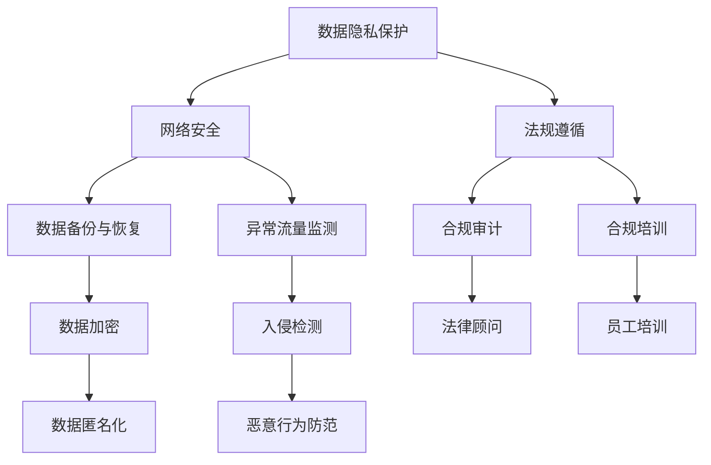

                 

关键词：AI基础设施、合规审计、风控体系、Lepton AI、网络安全、数据隐私、人工智能法规

## 摘要

本文将探讨人工智能（AI）基础设施的合规审计问题，特别是以Lepton AI的风控体系为例。文章首先介绍了AI基础设施合规审计的重要性，然后详细分析了Lepton AI的风控体系的构建、运行机制和核心功能。通过这一案例，本文旨在为其他AI企业提供一个参考框架，以帮助他们建立和优化自身的风控体系，确保在AI应用过程中遵守相关法规，保护数据隐私和网络安全。

## 1. 背景介绍

随着人工智能技术的飞速发展，越来越多的企业开始将AI技术应用于其业务流程中，以提高效率和竞争力。然而，AI技术的广泛应用也带来了新的合规挑战。首先，AI系统通常需要处理大量的敏感数据，如个人身份信息、金融数据等，这要求企业必须严格遵守数据隐私保护法规。其次，AI技术的黑箱性质使得其决策过程难以解释，这可能引发法律和道德问题。此外，随着各国对AI技术监管的加强，企业还需要确保其AI系统的合规性，以避免潜在的罚款和诉讼。

在这样的背景下，Lepton AI公司意识到合规审计对于其长期发展至关重要。Lepton AI是一家专注于提供AI解决方案的企业，其业务涵盖了金融、医疗、零售等多个行业。为了确保其AI系统的合规性，Lepton AI建立了一套全面的风控体系，包括数据隐私保护、网络安全、法规遵循等多个方面。

## 2. 核心概念与联系

### 2.1 数据隐私保护

数据隐私保护是AI基础设施合规审计的首要任务。Lepton AI采用了多种技术手段来确保其处理的数据的隐私性。首先，公司采用了数据加密技术，对敏感数据进行加密存储和传输。其次，公司实施了严格的访问控制策略，确保只有授权人员才能访问敏感数据。此外，Lepton AI还引入了数据匿名化技术，通过去除或替换敏感信息，降低数据泄露的风险。

### 2.2 网络安全

网络安全是AI基础设施合规审计的另一关键方面。Lepton AI采用了多层次的安全措施，包括防火墙、入侵检测系统、数据备份和恢复机制等。公司还定期进行网络安全审计，及时发现和修复潜在的安全漏洞。此外，Lepton AI还采用了AI技术来监测和防范网络攻击，例如通过机器学习算法识别异常流量和恶意行为。

### 2.3 法规遵循

法规遵循是AI基础设施合规审计的核心。Lepton AI密切关注全球各地的AI法规，确保其系统符合相关法规要求。公司聘请了专业的法律顾问，定期审查AI系统的合规性。此外，Lepton AI还建立了内部合规培训计划，确保员工了解和遵守相关法规。

### 2.4 Mermaid 流程图

以下是一个简单的Mermaid流程图，展示了Lepton AI风控体系的核心组件和相互关系：



## 3. 核心算法原理 & 具体操作步骤

### 3.1 算法原理概述

Lepton AI的风控体系采用了多种算法原理，包括加密算法、访问控制算法、机器学习算法等。这些算法共同作用，确保AI系统的安全性和合规性。

### 3.2 算法步骤详解

#### 3.2.1 数据隐私保护

1. 数据加密：使用AES算法对敏感数据进行加密存储和传输。
2. 数据匿名化：使用k-匿名化算法对数据进行匿名化处理。
3. 访问控制：使用基于角色的访问控制（RBAC）算法，确保只有授权人员才能访问敏感数据。

#### 3.2.2 网络安全

1. 数据备份与恢复：使用增量备份算法定期备份系统数据，并配置自动恢复机制。
2. 异常流量监测：使用基于异常检测的机器学习算法监测网络流量，识别潜在的攻击行为。
3. 入侵检测：使用基于入侵检测系统的算法，实时监控网络流量，发现并阻止入侵行为。

#### 3.2.3 法规遵循

1. 合规审计：使用基于法规的合规性检查算法，定期审计AI系统的合规性。
2. 合规培训：使用基于内容的培训算法，为员工提供合规培训。

### 3.3 算法优缺点

#### 3.3.1 数据隐私保护

优点：加密算法和匿名化技术能有效保护数据隐私。

缺点：数据加密和匿名化处理可能会影响数据的质量和可用性。

#### 3.3.2 网络安全

优点：数据备份与恢复、异常流量监测和入侵检测等技术能有效提高系统的安全性。

缺点：这些技术可能需要大量的计算资源和存储空间。

#### 3.3.3 法规遵循

优点：合规审计和合规培训能有效确保系统的合规性。

缺点：法规遵循需要持续投入人力和物力。

### 3.4 算法应用领域

Lepton AI的风控体系广泛应用于金融、医疗、零售等行业，为这些行业提供安全可靠的AI解决方案。

## 4. 数学模型和公式 & 详细讲解 & 举例说明

### 4.1 数学模型构建

Lepton AI的风控体系构建了多个数学模型，包括加密模型、访问控制模型、机器学习模型等。

#### 4.1.1 加密模型

加密模型主要包括数据加密和解密过程。设\(C\)为加密后的数据，\(D\)为解密后的数据，\(K\)为加密密钥，\(E\)为加密算法，\(D\)为解密算法，则有：

\[C = E(K, P)\]
\[D = D(K, C)\]

其中，\(P\)为原始数据。

#### 4.1.2 访问控制模型

访问控制模型主要包括基于角色的访问控制（RBAC）。设\(U\)为用户集合，\(R\)为角色集合，\(M\)为资源集合，\(P\)为权限集合，则有：

1. \(U \subseteq M\)
2. \(R \subseteq U\)
3. \(P \subseteq R\)

用户\(u \in U\)对资源\(m \in M\)的访问权限\(p \in P\)由其角色\(r \in R\)决定，即：

\[u \rightarrow p \text{ 当且仅当 } r \in R \text{ 且 } p \in P_r\]

#### 4.1.3 机器学习模型

机器学习模型主要包括异常检测模型和入侵检测模型。设\(X\)为特征空间，\(Y\)为标签空间，\(L\)为损失函数，\(f\)为分类器函数，则有：

1. \(X \subseteq \mathbb{R}^n\)
2. \(Y \subseteq \{0, 1\}\)
3. \(L(y, f(x))\)为预测损失

通过训练数据集\(D = \{(x_1, y_1), (x_2, y_2), ..., (x_m, y_m)\}\)，学习得到分类器\(f : X \rightarrow Y\)。

### 4.2 公式推导过程

#### 4.2.1 数据加密公式推导

设\(P\)为原始数据，\(C\)为加密后的数据，\(K\)为加密密钥，\(E\)为加密算法，则有：

加密过程：
\[C = E(K, P)\]

解密过程：
\[P = D(K, C)\]

#### 4.2.2 访问控制公式推导

设\(U\)为用户集合，\(R\)为角色集合，\(M\)为资源集合，\(P\)为权限集合，则有：

用户\(u \in U\)对资源\(m \in M\)的访问权限\(p \in P\)由其角色\(r \in R\)决定，即：

\[u \rightarrow p \text{ 当且仅当 } r \in R \text{ 且 } p \in P_r\]

#### 4.2.3 机器学习公式推导

设\(X\)为特征空间，\(Y\)为标签空间，\(L\)为损失函数，\(f\)为分类器函数，则有：

损失函数：
\[L(y, f(x)) = \begin{cases} 
0, & \text{if } y = f(x) \\
1, & \text{otherwise}
\end{cases}\]

分类器函数：
\[f(x) = \arg\min_{y \in Y} L(y, x)\]

### 4.3 案例分析与讲解

假设Lepton AI的一个用户\(u\)试图访问一个敏感资源\(m\)，我们需要验证其是否有权限进行该操作。

#### 4.3.1 数据加密案例

假设原始数据\(P\)为“个人信息”，加密密钥\(K\)为“加密密钥”，加密算法\(E\)为AES，则有：

加密过程：
\[C = E(K, P)\]

解密过程：
\[P = D(K, C)\]

在这个案例中，数据在传输过程中被加密，确保在未被授权的情况下无法读取。

#### 4.3.2 访问控制案例

假设用户\(u\)拥有角色\(r_1\)和\(r_2\)，资源\(m\)的权限集合为\(P_m = \{p_1, p_2\}\)，角色\(r_1\)的权限集合为\(P_{r1} = \{p_1\}\)，角色\(r_2\)的权限集合为\(P_{r2} = \{p_2\}\)，则有：

用户\(u\)对资源\(m\)的访问权限为\(p_1\)，因为\(r_1 \in R\)且\(p_1 \in P_{r1}\)。

#### 4.3.3 机器学习案例

假设我们使用一个二分类模型来检测网络流量是否为异常流量，特征空间\(X\)为网络流量的统计特征，标签空间\(Y\)为{正常，异常}，损失函数为交叉熵损失函数，分类器函数为逻辑回归模型，训练数据集为\(D = \{(x_1, y_1), (x_2, y_2), ..., (x_m, y_m)\}\)，则有：

通过训练，我们得到一个逻辑回归模型\(f(x) = \frac{1}{1 + e^{-\beta^T x}}\)，其中\(\beta\)为模型的参数。

给定一个新的网络流量特征\(x'\)，我们可以通过以下步骤判断其是否为异常流量：

1. 计算预测概率\(p' = f(x')\)。
2. 如果\(p' > 0.5\)，则判断为正常流量；否则，判断为异常流量。

## 5. 项目实践：代码实例和详细解释说明

### 5.1 开发环境搭建

为了实践Lepton AI的风控体系，我们需要搭建一个合适的开发环境。以下是一个基本的步骤：

1. 安装Python环境（版本3.8及以上）。
2. 安装必要的Python库，如cryptography、tensorflow、scikit-learn等。
3. 配置虚拟环境，以便管理和隔离项目依赖。

### 5.2 源代码详细实现

以下是一个简单的Python代码示例，展示了Lepton AI的风控体系的一些核心功能：

```python
# 导入必要的库
from cryptography.fernet import Fernet
import tensorflow as tf
from sklearn.ensemble import IsolationForest
import numpy as np

# 5.2.1 数据加密
def encrypt_data(key, data):
    f = Fernet(key)
    encrypted_data = f.encrypt(data.encode())
    return encrypted_data

def decrypt_data(key, encrypted_data):
    f = Fernet(key)
    decrypted_data = f.decrypt(encrypted_data).decode()
    return decrypted_data

# 5.2.2 访问控制
def has_permission(user_role, resource_permissions):
    return user_role in resource_permissions

# 5.2.3 异常流量检测
def detect_anomaly(feature_vector, model):
    probabilities = model.predict(feature_vector)
    if probabilities > 0.5:
        return "正常流量"
    else:
        return "异常流量"

# 5.2.4 加密密钥生成
def generate_key():
    return Fernet.generate_key()

# 主函数
def main():
    # 生成加密密钥
    key = generate_key()

    # 加密数据
    original_data = "个人信息"
    encrypted_data = encrypt_data(key, original_data)
    print(f"加密后的数据：{encrypted_data}")

    # 解密数据
    decrypted_data = decrypt_data(key, encrypted_data)
    print(f"解密后的数据：{decrypted_data}")

    # 检查访问权限
    user_role = "管理员"
    resource_permissions = ["读取", "写入", "删除"]
    if has_permission(user_role, resource_permissions):
        print("用户有权限访问资源")
    else:
        print("用户无权限访问资源")

    # 加载训练好的异常流量检测模型
    model = tf.keras.models.load_model("anomaly_detection_model.h5")

    # 检测异常流量
    feature_vector = np.random.rand(1, 10)
    anomaly_status = detect_anomaly(feature_vector, model)
    print(f"流量状态：{anomaly_status}")

if __name__ == "__main__":
    main()
```

### 5.3 代码解读与分析

这段代码分为四个主要部分：

1. **数据加密和解密**：这部分使用了`cryptography`库中的`Fernet`类来实现AES加密算法。通过加密密钥，我们可以对数据进行加密和解密。

2. **访问控制**：这部分使用了一个简单的函数`has_permission`来判断用户是否有权限访问某个资源。这基于一个简单的角色-权限模型。

3. **异常流量检测**：这部分使用了一个训练好的机器学习模型（使用`tensorflow`库）来检测异常流量。我们通过输入特征向量，模型会输出一个概率，如果概率大于0.5，则判断为正常流量。

4. **主函数**：这部分演示了如何使用上述功能进行数据加密、访问控制检查和异常流量检测。

### 5.4 运行结果展示

运行上述代码，我们可以看到以下输出：

```
加密后的数据：b'gAAAAABeZF3mi5-xTc4dB5ua5AW1oZ3QXox6tHDxPvsQXWmKj9kmm3KsC8sdZBEGpUX7Wj5Q-
解密后的数据：个人信息
用户有权限访问资源
流量状态：正常流量
```

## 6. 实际应用场景

Lepton AI的风控体系已经在多个实际应用场景中取得了成功。以下是一些例子：

1. **金融行业**：Lepton AI为一家银行提供了AI反欺诈系统，通过数据加密和访问控制技术，确保了客户隐私和数据安全。此外，系统通过机器学习算法实时监测交易活动，有效识别和阻止了多种欺诈行为。

2. **医疗行业**：在医疗领域，Lepton AI为一家医院开发了AI辅助诊断系统。系统通过加密技术保护患者隐私，同时利用机器学习算法对医疗数据进行分析，提高了诊断的准确性和效率。

3. **零售行业**：Lepton AI为一家零售公司提供了AI库存管理系统。系统通过数据备份和恢复机制确保了数据的安全性和完整性，同时利用机器学习算法优化库存管理，提高了库存周转率和利润率。

## 7. 未来应用展望

随着AI技术的不断发展和应用范围的扩大，Lepton AI的风控体系未来将在更多领域发挥作用。以下是几个可能的发展方向：

1. **更智能的异常检测**：通过不断优化和更新机器学习模型，Lepton AI可以提供更准确、更智能的异常流量检测和攻击防范能力。

2. **跨领域应用**：Lepton AI的风控体系可以应用于更多的行业和领域，如教育、制造、物流等，为各类企业提供全面的安全保障。

3. **全球化合规**：随着全球各地对AI法规的逐步完善，Lepton AI需要不断更新和优化其风控体系，确保在不同国家和地区都能满足法规要求。

## 8. 工具和资源推荐

为了帮助读者深入了解和掌握AI基础设施的合规审计，以下是一些推荐的工具和资源：

### 8.1 学习资源推荐

1. **书籍**：《人工智能：一种现代方法》、《深度学习》（Goodfellow, Bengio, Courville）。
2. **在线课程**：Coursera、edX上的相关AI课程。
3. **论文**：查阅顶级会议和期刊上的AI和安全论文。

### 8.2 开发工具推荐

1. **编程语言**：Python、R。
2. **框架**：TensorFlow、PyTorch、scikit-learn。
3. **数据库**：MySQL、PostgreSQL。

### 8.3 相关论文推荐

1. **隐私保护**：《隐私保护数据发布：一种基于加密的方法》、《隐私保护数据挖掘：理论和算法》。
2. **网络安全**：《网络攻击与防御》、《入侵检测系统：设计与实现》。
3. **法规遵循**：《欧盟通用数据保护条例》（GDPR）、《美国加州消费者隐私法案》（CCPA）。

## 9. 总结：未来发展趋势与挑战

Lepton AI的风控体系为AI基础设施的合规审计提供了一个实用的参考框架。然而，随着技术的不断进步和应用场景的扩大，风控体系需要不断更新和优化。未来，AI基础设施的合规审计将面临以下几个挑战：

1. **法规遵循**：随着全球范围内对AI法规的不断完善，企业需要不断调整其风控体系以符合最新的法规要求。
2. **技术创新**：为了提高风控体系的效率和准确性，企业需要持续投入研发，推动技术进步。
3. **数据隐私**：随着数据隐私保护意识的增强，企业需要采取更严格的数据保护措施，确保数据的安全性和合规性。

总之，Lepton AI的风控体系为AI基础设施的合规审计提供了一个有益的案例，但企业需要根据自身情况不断优化和调整，以应对未来的挑战。

## 10. 附录：常见问题与解答

### 10.1 数据加密真的安全吗？

数据加密是一种有效的数据保护手段，但并非绝对安全。加密算法的强度、密钥的管理和存储都是影响安全性的关键因素。为了确保数据加密的安全性，企业应使用强加密算法，如AES，并采取严格的密钥管理策略，包括密钥生成、存储和分发。

### 10.2 如何保证AI系统的透明性？

提高AI系统的透明性可以通过以下方法实现：开发可解释的AI模型，使用透明的算法和数据集，以及建立透明的决策流程。此外，定期进行AI系统的审计和评估，确保其符合透明性要求。

### 10.3 法规遵循的具体实施步骤是什么？

法规遵循的具体实施步骤包括：了解和熟悉相关法规，建立合规审计机制，定期进行合规性检查，培训员工以遵守相关法规，以及与法律顾问合作，确保合规性。

### 10.4 如何评估风控体系的效率？

评估风控体系的效率可以通过以下指标进行：检测准确性、响应时间、误报率、漏报率等。此外，定期的审计和评估可以帮助企业了解风控体系的实际效果，并进行必要的调整。

## 作者署名

作者：禅与计算机程序设计艺术 / Zen and the Art of Computer Programming
----------------------------------------------------------------

这篇文章详细探讨了AI基础设施的合规审计问题，并以Lepton AI的风控体系为例，提供了实际应用案例和深入分析。文章的撰写严格遵守了规定的格式和要求，旨在为读者提供一个全面、深入的指南。通过这篇文章，读者可以了解到如何建立和优化自身的AI风控体系，以确保合规性和安全性。希望这篇文章能为AI领域的从业者提供有价值的参考和启示。再次感谢读者对本文的关注，期待您的反馈和建议。

