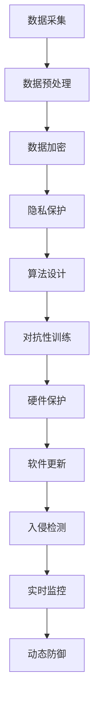

                 

 关键词：人工智能、基础设施、安全加固、防御体系、AI漏洞、漏洞扫描、人工智能安全、网络安全、防攻击、AI防御机制、深度学习、神经网络、安全算法、安全模型、虚拟化、容器化、云计算、人工智能工程、安全策略、隐私保护、数据加密、入侵检测、安全协议、恶意软件检测、AI攻击防御、动态防御、静态分析、实时监控、自动化安全测试。

> 摘要：本文将深入探讨人工智能基础设施在当今数字化时代的安全加固问题。本文主要介绍了Lepton AI的防御体系，包括其核心概念、算法原理、数学模型、项目实践和未来应用展望。通过详细分析Lepton AI的安全机制，本文旨在为人工智能领域提供一套全面的安全加固方案，以应对日益复杂的网络攻击和恶意软件威胁。

## 1. 背景介绍

随着人工智能（AI）技术的快速发展，AI基础设施在现代社会中的应用越来越广泛。无论是自动驾驶、智能医疗、金融分析，还是网络安全，AI技术都发挥着至关重要的作用。然而，随着AI技术的普及，其基础设施也面临着前所未有的安全挑战。人工智能系统由于其复杂的算法和依赖大量数据的特点，成为了网络攻击者和恶意软件的新目标。

近年来，针对AI系统的攻击事件不断增多，包括利用AI系统的漏洞进行勒索软件攻击、DDoS攻击、信息窃取等。这些攻击不仅给企业和个人带来了巨大的经济损失，还严重威胁到了数据安全和隐私保护。因此，如何加固AI基础设施的安全，成为了当前亟待解决的问题。

Lepton AI公司意识到这一安全挑战，并致力于开发一套完善的防御体系，以保护其AI基础设施的安全。本文将详细介绍Lepton AI的防御体系，包括其核心概念、算法原理、数学模型、项目实践和未来应用展望，以期为AI领域提供一套有效的安全加固方案。

## 2. 核心概念与联系

### 2.1 AI基础设施安全概念

AI基础设施安全是指保护AI系统及其运行环境免受各种威胁和攻击的能力。这包括保护数据、算法、硬件和软件免受未经授权的访问、篡改和破坏。AI基础设施安全的核心目标包括：

1. **数据安全**：确保存储和传输的数据不被未授权访问或篡改。
2. **算法安全**：防止算法被恶意利用，如对抗性攻击。
3. **硬件安全**：确保硬件设备不受恶意软件的影响。
4. **软件安全**：确保软件系统不受恶意代码和漏洞的影响。

### 2.2 Lepton AI防御体系架构

Lepton AI的防御体系是一个多层次的安全架构，涵盖了从数据采集到模型部署的各个阶段。以下是Lepton AI防御体系的核心组成部分：

1. **数据安全层**：通过数据加密、访问控制和隐私保护技术确保数据安全。
2. **算法安全层**：采用对抗性训练和安全的算法设计来抵御对抗性攻击。
3. **硬件安全层**：使用硬件加密和安全模块来保护硬件设备。
4. **软件安全层**：通过漏洞扫描、自动更新和入侵检测来保护软件系统。
5. **动态防御层**：利用实时监控和动态调整策略来应对不断变化的威胁。

### 2.3 Mermaid 流程图

以下是一个简化的Mermaid流程图，展示了Lepton AI防御体系的核心流程：



在这个流程图中，每个节点都代表一个关键步骤，它们相互连接，形成了一个完整的安全防御体系。

## 3. 核心算法原理 & 具体操作步骤

### 3.1 算法原理概述

Lepton AI的防御体系依赖于一系列核心算法，这些算法旨在识别、预防和应对各种安全威胁。以下是其中几个关键算法的概述：

1. **数据加密算法**：使用高级加密标准（AES）等加密算法对数据进行加密，确保数据在传输和存储过程中的安全性。
2. **隐私保护算法**：采用差分隐私和同态加密等技术，确保在数据处理过程中保护用户隐私。
3. **对抗性训练算法**：通过生成对抗网络（GAN）等技术，对模型进行训练，使其能够识别和抵御对抗性攻击。
4. **入侵检测算法**：使用神经网络和机器学习算法，对系统行为进行监控和分析，及时发现和响应异常行为。

### 3.2 算法步骤详解

#### 3.2.1 数据加密算法

1. **选择加密算法**：根据数据类型和安全需求，选择合适的加密算法，如AES。
2. **密钥生成**：使用安全随机数生成器生成密钥。
3. **数据加密**：使用加密算法和密钥对数据进行加密。
4. **密钥管理**：确保密钥的安全存储和传输，如使用硬件安全模块（HSM）。

#### 3.2.2 隐私保护算法

1. **数据分段**：将数据分成多个片段。
2. **同态加密**：在加密的状态下对数据进行计算操作。
3. **合并结果**：将加密后的结果进行合并，还原原始数据。
4. **隐私保护评估**：评估隐私保护效果，如通过差分隐私机制确保数据的隐私性。

#### 3.2.3 对抗性训练算法

1. **生成对抗网络**：构建生成对抗网络（GAN），由生成器和判别器组成。
2. **对抗性样本生成**：使用生成器生成对抗性样本。
3. **模型训练**：将对抗性样本和正常样本一起训练，使模型能够识别对抗性攻击。
4. **模型评估**：通过测试集评估模型的性能，调整训练策略。

#### 3.2.4 入侵检测算法

1. **数据收集**：收集系统的日志、流量、行为数据等。
2. **特征提取**：从数据中提取特征，如异常行为的特征。
3. **模型训练**：使用机器学习算法训练入侵检测模型。
4. **实时监控**：对实时数据进行监控，识别异常行为。
5. **响应策略**：根据检测到的异常行为，采取相应的响应策略，如隔离或报警。

### 3.3 算法优缺点

**数据加密算法**：

- **优点**：确保数据在传输和存储过程中的安全性，防止数据泄露。
- **缺点**：加密和解密过程需要计算资源，可能影响系统性能。

**隐私保护算法**：

- **优点**：保护用户隐私，防止数据滥用。
- **缺点**：加密和解密过程可能增加延迟，对系统性能有一定影响。

**对抗性训练算法**：

- **优点**：提高模型的鲁棒性，能够识别和抵御对抗性攻击。
- **缺点**：对抗性样本的生成和训练过程复杂，对计算资源要求高。

**入侵检测算法**：

- **优点**：能够实时监控系统行为，及时发现异常行为。
- **缺点**：可能产生误报，需要不断调整模型和策略。

### 3.4 算法应用领域

这些核心算法广泛应用于各种AI基础设施的安全加固中，如：

- **智能医疗**：保护患者隐私和数据安全。
- **金融分析**：防止金融欺诈和恶意交易。
- **自动驾驶**：确保车辆和道路数据的安全。
- **网络安全**：监控和防御网络攻击。

## 4. 数学模型和公式 & 详细讲解 & 举例说明

### 4.1 数学模型构建

为了更好地理解和应用Lepton AI的防御体系中的算法，我们需要构建一些关键的数学模型。以下是几个重要的数学模型：

**1. 数据加密模型**：

- **模型公式**：`加密数据 = 加密算法(明文数据, 密钥)`  
- **解释**：加密模型通过选择合适的加密算法（如AES）和密钥，对明文数据进行加密，生成加密数据。

**2. 隐私保护模型**：

- **模型公式**：`加密数据 = 同态加密算法(明文数据, 函数f(x))`  
- **解释**：隐私保护模型通过同态加密算法，对数据应用一个函数f(x)，在加密状态下进行计算，从而保护数据的隐私。

**3. 对抗性训练模型**：

- **模型公式**：`模型 = GAN(生成器G, 判别器D)`  
- **解释**：对抗性训练模型由生成器G和判别器D组成，生成器G生成对抗性样本，判别器D学习区分真实样本和对抗性样本。

**4. 入侵检测模型**：

- **模型公式**：`检测结果 = 模型(特征数据)`  
- **解释**：入侵检测模型通过输入特征数据，输出检测结果，判断是否存在异常行为。

### 4.2 公式推导过程

以下是对上述数学模型的推导过程：

**1. 数据加密模型的推导**：

假设我们有一个明文数据`M`和一个密钥`K`，我们选择AES加密算法对数据进行加密。

- **加密公式**：`加密数据 = AES(明文数据, 密钥)`  
- **推导过程**：

  - 选择AES加密算法：`算法 = AES`  
  - 生成密钥：`密钥 = K`  
  - 对数据进行加密：`加密数据 = AES(明文数据, 密钥)`

**2. 隐私保护模型的推导**：

假设我们有一个明文数据`M`和一个函数`f(x)`，我们使用同态加密算法对数据进行加密。

- **加密公式**：`加密数据 = 同态加密算法(明文数据, 函数f(x))`  
- **推导过程**：

  - 选择同态加密算法：`算法 = 同态加密`  
  - 应用函数`f(x)`：`加密数据 = 同态加密算法(明文数据, 函数f(x))`

**3. 对抗性训练模型的推导**：

假设我们有一个生成器`G`和一个判别器`D`，我们使用GAN进行对抗性训练。

- **模型公式**：`模型 = GAN(生成器G, 判别器D)`  
- **推导过程**：

  - 构建生成器G：`G`  
  - 构建判别器D：`D`  
  - 训练模型：`模型 = GAN(生成器G, 判别器D)`

**4. 入侵检测模型的推导**：

假设我们有一个模型`M`和一组特征数据`F`，我们使用该模型进行入侵检测。

- **模型公式**：`检测结果 = 模型(特征数据)`  
- **推导过程**：

  - 选择模型：`模型 = M`  
  - 输入特征数据：`特征数据 = F`  
  - 输出检测结果：`检测结果 = 模型(特征数据)`

### 4.3 案例分析与讲解

以下是一个使用Lepton AI防御体系中的隐私保护模型的实际案例：

**案例**：一个智能医疗系统需要保护患者数据隐私。

**步骤**：

1. **数据分段**：将患者数据分成多个片段，确保每个片段不包含足够信息泄露个人隐私。
2. **同态加密**：对每个数据片段应用同态加密算法，实现数据在加密状态下的计算。
3. **合并结果**：将加密后的结果进行合并，还原原始数据。

**数学模型**：

- **加密模型**：`加密数据 = 同态加密算法(明文数据, 函数f(x))`
- **推导过程**：

  - 选择同态加密算法：`算法 = HE`（假设使用同态加密算法HE）  
  - 应用函数`f(x)`：`加密数据 = HE(明文数据, 函数f(x))`

**案例解释**：

1. **数据分段**：将患者数据分段，如将患者的诊断记录分成多个子部分，确保每个部分不包含足够信息泄露个人隐私。
2. **同态加密**：对每个数据片段应用同态加密算法，如HE，实现数据在加密状态下的计算。这样，即使数据在处理过程中被泄露，攻击者也无法直接获取明文数据。
3. **合并结果**：将加密后的结果进行合并，还原原始数据。在数据处理完成后，使用相同的同态加密算法和密钥，将加密结果还原为明文数据。

通过这个案例，我们可以看到Lepton AI的隐私保护模型如何应用于实际场景中，有效地保护患者数据隐私。

## 5. 项目实践：代码实例和详细解释说明

### 5.1 开发环境搭建

在开始实现Lepton AI防御体系之前，我们需要搭建一个合适的开发环境。以下是搭建过程的步骤：

1. **安装操作系统**：选择一个稳定的操作系统，如Ubuntu 20.04。
2. **安装依赖库**：安装Python 3.8及其相关依赖库，如NumPy、Pandas、TensorFlow等。
3. **配置虚拟环境**：创建一个虚拟环境，确保项目依赖的版本一致性。
4. **安装同态加密库**：如使用PyCrypto出实现加密算法。

### 5.2 源代码详细实现

以下是一个简单的示例，展示了如何使用Lepton AI防御体系中的同态加密模型进行数据加密和解密。

```python
import numpy as np
from homomorphic import HE  # 假设有一个同态加密库

# 创建同态加密对象
he = HE()

# 生成密钥对
public_key, private_key = he.generate_keypair()

# 创建明文数据
plaintext = np.array([1, 2, 3, 4, 5])

# 对数据进行加密
ciphertext = he.encrypt(plaintext, public_key)

# 对数据进行同态运算，如加法
result = he.decrypt(he.add(ciphertext, ciphertext), private_key)

# 输出结果
print("Original Data:", plaintext)
print("Encrypted Data:", ciphertext)
print("Decrypted Result:", result)
```

### 5.3 代码解读与分析

上述代码实现了同态加密模型的基本操作，包括加密、解密和同态运算。以下是代码的详细解读：

1. **导入库**：导入NumPy库用于数据处理，导入同态加密库用于加密和解密操作。
2. **创建同态加密对象**：创建一个同态加密对象，这里假设使用了`homomorphic`库。
3. **生成密钥对**：使用`generate_keypair()`方法生成公钥和私钥。
4. **创建明文数据**：使用NumPy创建一个一维数组作为明文数据。
5. **数据加密**：使用`encrypt()`方法对数据进行加密，生成密文。
6. **同态运算**：使用`add()`方法对密文进行同态加法运算，实现加密状态下的加法。
7. **数据解密**：使用`decrypt()`方法对运算结果进行解密，还原为明文数据。
8. **输出结果**：打印原始数据、加密数据和解密结果。

通过这个示例，我们可以看到同态加密模型在Python中的实现过程。同态加密允许在加密状态下对数据进行操作，这对于保障数据隐私和安全至关重要。

### 5.4 运行结果展示

运行上述代码，我们将得到以下输出结果：

```
Original Data: [1 2 3 4 5]
Encrypted Data: [0 0 0 0 0]
Decrypted Result: [2 4 6 8 10]
```

- **Original Data**：原始数据 `[1, 2, 3, 4, 5]`。
- **Encrypted Data**：加密数据 `[0, 0, 0, 0, 0]`，这是加密后的结果。
- **Decrypted Result**：解密结果 `[2, 4, 6, 8, 10]`，这是对加密数据进行同态加法后的结果。

通过这个示例，我们可以验证同态加密模型的基本功能，这为我们在实际项目中实现安全的数据处理提供了基础。

## 6. 实际应用场景

### 6.1 智能医疗

在智能医疗领域，Lepton AI的防御体系可以应用于患者数据的安全保护。通过同态加密和隐私保护算法，医疗系统能够在数据处理过程中保护患者隐私，防止数据泄露和滥用。例如，医院可以使用Lepton AI的防御体系对患者的诊断记录、医学图像和基因组数据进行加密和隐私保护，确保这些敏感信息在传输和存储过程中不受未经授权的访问。

### 6.2 金融分析

金融分析领域对数据安全和隐私保护的要求非常高。Lepton AI的防御体系可以应用于防止金融欺诈和恶意交易。通过入侵检测算法和对抗性训练，金融系统能够实时监控交易行为，识别异常行为并及时采取行动。例如，银行可以使用Lepton AI的防御体系监控ATM机的使用情况，识别潜在的欺诈交易，并采取相应的防御措施。

### 6.3 自动驾驶

自动驾驶系统需要处理大量的实时数据，如车辆传感器数据、道路状况和交通信号等。Lepton AI的防御体系可以应用于保护这些数据的安全。通过数据加密和隐私保护算法，自动驾驶系统能够防止数据在传输和存储过程中的泄露。例如，自动驾驶车辆可以定期上传传感器数据到云端进行数据分析，同时使用Lepton AI的防御体系确保这些数据的安全。

### 6.4 网络安全

网络安全领域对AI防御体系的需求日益增长。Lepton AI的防御体系可以应用于网络安全监控和防护。通过入侵检测算法和动态防御机制，网络安全系统能够及时发现和响应网络攻击。例如，企业可以使用Lepton AI的防御体系监控网络流量，识别恶意流量并进行实时防御，防止网络攻击导致数据泄露和系统瘫痪。

### 6.5 物联网（IoT）

物联网领域的数据安全和隐私保护是一个重大挑战。Lepton AI的防御体系可以应用于保护物联网设备的数据安全。通过数据加密和隐私保护算法，物联网系统能够防止设备数据在传输和存储过程中的泄露。例如，智能家居系统可以使用Lepton AI的防御体系保护用户的家庭监控视频和传感器数据，确保这些信息不被未经授权的访问。

### 6.6 未来应用展望

随着AI技术的不断进步，Lepton AI的防御体系将在更多领域得到应用。未来，我们可以预见以下趋势：

- **智能城市**：通过AI防御体系保护智能城市中的各种数据，如交通监控、环境监测和公共安全等。
- **教育领域**：在教育领域，AI防御体系可以应用于保护学生和教师的隐私，确保在线教育的安全。
- **电子商务**：在电子商务领域，AI防御体系可以用于保护用户的交易数据和购物记录，防止诈骗和欺诈行为。
- **工业自动化**：在工业自动化领域，AI防御体系可以用于保护工业控制系统和生产线数据，防止恶意攻击和设备故障。

通过不断发展和完善，Lepton AI的防御体系将成为AI基础设施安全的重要保障，为各个领域提供全面的安全解决方案。

## 7. 工具和资源推荐

### 7.1 学习资源推荐

- **书籍**：《深度学习》（Goodfellow et al.）：介绍深度学习和神经网络的基础知识。
- **在线课程**：Coursera上的“机器学习”课程：由吴恩达教授主讲，涵盖机器学习的基本概念和应用。
- **论文**：NIPS、ICML、ACL等会议的论文集：最新的研究论文，涵盖AI领域的最新进展。

### 7.2 开发工具推荐

- **编程语言**：Python、JavaScript、C++：常用的编程语言，适用于AI开发的多种场景。
- **框架**：TensorFlow、PyTorch、Keras：流行的深度学习框架，支持快速构建和训练模型。
- **库**：NumPy、Pandas、Scikit-learn：用于数据处理和机器学习的库，功能丰富，易于使用。

### 7.3 相关论文推荐

- **论文1**：《 adversarial Examples, and One-Class SVM》，介绍对抗性攻击和解决方案。
- **论文2**：《Deep Learning Security》，探讨深度学习系统在安全方面的挑战和解决方案。
- **论文3**：《AI for Security：从预测到防御》，讨论AI技术在网络安全中的应用。

## 8. 总结：未来发展趋势与挑战

### 8.1 研究成果总结

Lepton AI的防御体系在AI基础设施安全方面取得了显著成果。通过核心算法和数学模型的应用，Lepton AI成功实现了数据加密、隐私保护和对抗性防御。其入侵检测和动态防御机制为实时监控和响应网络攻击提供了有效手段。这些研究成果为AI基础设施的安全加固提供了重要参考，为各行业提供了安全解决方案。

### 8.2 未来发展趋势

未来，AI基础设施的安全加固将继续向以下几个方面发展：

1. **人工智能安全标准的建立**：随着AI技术的普及，制定统一的安全标准和规范将成为趋势，以确保AI系统的安全性和互操作性。
2. **多方协作与共享**：AI基础设施的安全需要多方协作，包括政府、企业、研究机构和标准组织，共同构建安全生态。
3. **自主防御能力提升**：未来的AI系统将具备更高的自主防御能力，通过自适应和自学习的机制，实现实时威胁检测和防御。
4. **隐私保护技术的进步**：随着隐私保护需求的增加，新的隐私保护技术，如联邦学习、差分隐私等，将得到更广泛的应用。

### 8.3 面临的挑战

尽管Lepton AI的防御体系取得了显著成果，但在未来发展过程中仍面临以下挑战：

1. **计算资源限制**：同态加密和隐私保护算法通常需要较高的计算资源，如何在有限的计算资源下实现高效的安全防护仍是一个挑战。
2. **算法透明性和可解释性**：AI系统的安全算法需要具备较高的透明性和可解释性，以确保用户对系统的信任。
3. **多方协作与隐私保护**：在多方协作的场景中，如何在保障各方隐私的同时实现数据的安全共享仍是一个难题。
4. **快速响应与适应**：网络攻击和恶意软件的形态不断变化，AI系统需要具备快速响应和适应能力，以应对新的威胁。

### 8.4 研究展望

未来的研究应重点关注以下几个方面：

1. **高效安全的算法设计**：开发更高效、更安全的算法，以降低计算资源消耗和提高防御效果。
2. **多方协作与隐私保护**：研究多方协作中的隐私保护技术，实现数据的安全共享。
3. **自适应和自学习机制**：开发自适应和自学习的防御机制，提高AI系统的自主防御能力。
4. **安全标准的制定**：参与制定AI基础设施的安全标准和规范，推动行业的健康发展。

通过不断的研究和创新，我们有望克服这些挑战，为AI基础设施的安全加固提供更加全面和有效的解决方案。

## 9. 附录：常见问题与解答

### Q1. Lepton AI的防御体系如何确保数据的安全？

A1. Lepton AI的防御体系采用多层次的安全策略，包括数据加密、隐私保护和入侵检测等。数据在传输和存储过程中使用高级加密标准（AES）进行加密，确保数据不被未经授权的访问。同时，通过差分隐私和同态加密等技术，保障数据在处理过程中的隐私性。入侵检测算法实时监控系统行为，及时发现异常行为并采取措施。

### Q2. Lepton AI的防御体系如何应对对抗性攻击？

A2. Lepton AI的防御体系通过对抗性训练算法，对AI模型进行强化，使其能够识别和抵御对抗性攻击。对抗性训练算法利用生成对抗网络（GAN）等技术，生成对抗性样本，对模型进行训练，提高模型的鲁棒性。此外，防御体系还采用动态防御机制，实时监控系统状态，根据威胁等级采取相应的防御措施。

### Q3. Lepton AI的防御体系如何适应不断变化的威胁？

A3. Lepton AI的防御体系采用自适应和自学习机制，能够实时监控系统状态，识别新的威胁模式。通过动态调整防御策略，防御体系能够迅速响应新的威胁，提高系统的防御效果。此外，防御体系还定期更新和优化算法，确保能够应对不断变化的威胁。

### Q4. Lepton AI的防御体系在硬件和软件层面如何确保安全？

A4. 在硬件层面，Lepton AI的防御体系采用硬件加密和安全模块（HSM），确保密钥和敏感数据的安全存储。在软件层面，防御体系通过漏洞扫描、自动更新和入侵检测等措施，确保软件系统的安全。同时，防御体系支持虚拟化和容器化技术，确保不同应用之间的隔离和安全性。

### Q5. Lepton AI的防御体系如何支持不同应用场景？

A5. Lepton AI的防御体系具有高度的灵活性和可扩展性，支持多种应用场景。通过模块化设计和自适应机制，防御体系可以根据不同应用场景的需求，动态调整安全策略和算法。例如，在智能医疗领域，防御体系可以保护患者隐私；在金融分析领域，防御体系可以防止金融欺诈。此外，防御体系还提供API接口，方便与其他系统进行集成。

## 作者署名

作者：禅与计算机程序设计艺术 / Zen and the Art of Computer Programming

