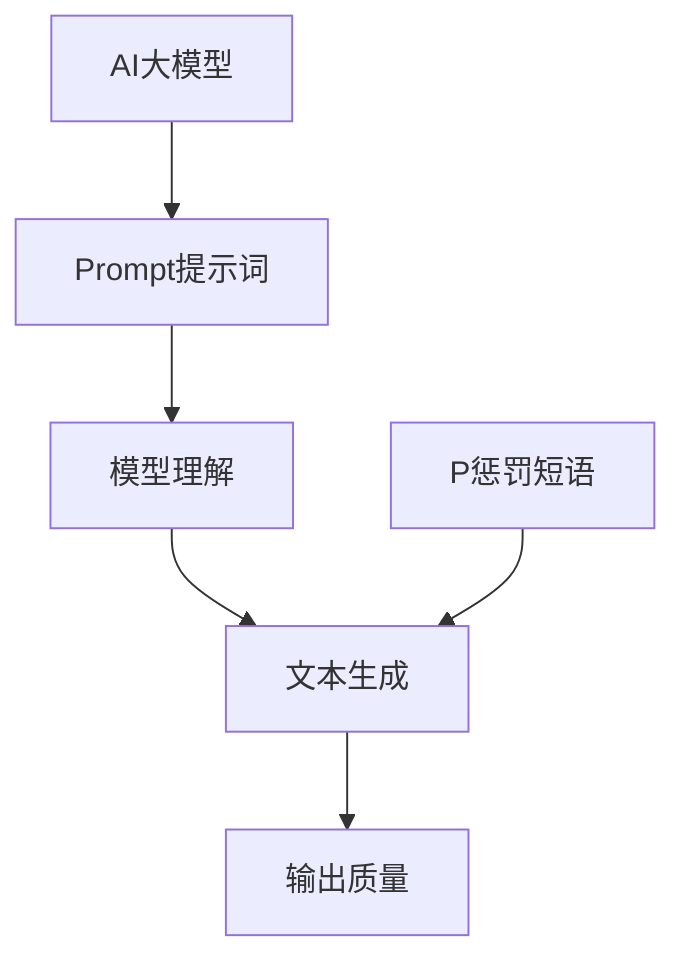

                 

关键词：AI大模型、Prompt提示词、惩罚短语、最佳实践

摘要：本文旨在探讨AI大模型中Prompt提示词的最佳实践，特别是如何有效利用惩罚短语来优化模型输出。文章首先介绍了AI大模型和Prompt的概念，然后深入分析了惩罚短语的作用原理和具体应用，通过实际案例展示了最佳实践，最后对未来发展趋势进行了展望。

## 1. 背景介绍

随着人工智能技术的快速发展，AI大模型（如GPT-3、BERT等）在自然语言处理（NLP）领域取得了显著的成果。这些模型能够处理大量数据，并生成高质量的文本，但其性能在很大程度上依赖于输入的Prompt提示词。Prompt是一种引导AI模型生成预期输出的文本提示，它可以影响模型的理解和生成过程。

然而，在现实生活中，我们经常遇到模型输出不准确、不合适的问题。为了解决这个问题，惩罚短语成为一种有效的策略。惩罚短语可以抑制模型生成与预期不符的文本，从而提高输出质量。

## 2. 核心概念与联系

### 2.1 AI大模型

AI大模型是指通过深度学习技术训练的、具有大规模参数的神经网络模型。这些模型在处理大量数据时能够提取出有用的特征，并生成高质量的文本输出。例如，GPT-3拥有1750亿个参数，可以生成流畅、符合逻辑的文本。

### 2.2 Prompt提示词

Prompt提示词是指用于引导AI模型生成预期输出的文本提示。一个好的Prompt可以明确地告诉模型需要生成什么样的内容，从而提高输出质量。例如，对于生成新闻摘要的Prompt，我们可以使用“请生成一篇关于人工智能最新进展的新闻摘要”。

### 2.3 惩罚短语

惩罚短语是一种用于抑制AI模型生成与预期不符的文本的技巧。通过在Prompt中加入特定的短语，可以引导模型避免生成不良内容。例如，对于生成有害内容的模型，我们可以在Prompt中加入“请勿生成任何攻击性、歧视性或暴力内容”。

### 2.4 Mermaid流程图

下面是一个描述AI大模型Prompt提示词和惩罚短语关系的Mermaid流程图。



## 3. 核心算法原理 & 具体操作步骤

### 3.1 算法原理概述

AI大模型Prompt提示词和惩罚短语的核心原理在于利用人类先验知识和语言模式来引导模型生成预期的文本。通过精心设计的Prompt和惩罚短语，可以优化模型输出，提高文本质量。

### 3.2 算法步骤详解

1. 设计Prompt：首先，根据应用场景设计合适的Prompt。Prompt应该明确地表达出期望的文本内容，同时尽量简洁。

2. 加入惩罚短语：在Prompt中适当加入惩罚短语，以抑制模型生成不良内容。惩罚短语的选择应基于具体应用场景。

3. 训练模型：使用包含Prompt和惩罚短语的语料库训练AI大模型。训练过程中，模型会逐渐学会根据Prompt和惩罚短语生成高质量的文本。

4. 评估和优化：通过评估模型输出质量，不断调整Prompt和惩罚短语，优化模型性能。

### 3.3 算法优缺点

#### 优点

- 提高输出质量：通过精心设计的Prompt和惩罚短语，可以显著提高模型输出质量。
- 灵活性：Prompt和惩罚短语可以根据不同应用场景进行调整，具有很高的灵活性。

#### 缺点

- 需要专业知识：设计合适的Prompt和惩罚短语需要具备一定的语言处理和AI知识。
- 难以全面控制：尽管Prompt和惩罚短语可以提高输出质量，但并不能完全保证输出符合预期。

### 3.4 算法应用领域

- 自然语言生成（NLG）：如新闻摘要、机器翻译、聊天机器人等。
- 文本分类：如情感分析、话题分类等。
- 文本修复：如纠正语法错误、拼写错误等。

## 4. 数学模型和公式 & 详细讲解 & 举例说明

### 4.1 数学模型构建

AI大模型Prompt提示词和惩罚短语的数学模型可以表示为：

$$
\text{Output} = f(\text{Prompt}, \text{Input}, \text{Punishment})
$$

其中，$f$ 表示模型生成函数，$\text{Prompt}$ 表示Prompt提示词，$\text{Input}$ 表示输入文本，$\text{Punishment}$ 表示惩罚短语。

### 4.2 公式推导过程

假设模型的生成函数为：

$$
f(\text{Prompt}, \text{Input}, \text{Punishment}) = \text{softmax}(\text{Model}(\text{Prompt}, \text{Input}, \text{Punishment}))
$$

其中，$\text{Model}(\text{Prompt}, \text{Input}, \text{Punishment})$ 表示模型对输入的加权求和，$\text{softmax}$ 函数用于将加权求和转换为概率分布。

### 4.3 案例分析与讲解

#### 案例一：生成新闻摘要

假设我们要生成一篇关于人工智能最新进展的新闻摘要，可以使用以下Prompt：

```
请生成一篇关于人工智能最新进展的新闻摘要，包含以下关键信息：AI在医疗领域的应用、AI在金融领域的应用、AI在交通领域的应用。
```

为了抑制模型生成与预期不符的文本，我们可以在Prompt中加入惩罚短语：

```
请生成一篇关于人工智能最新进展的新闻摘要，包含以下关键信息：AI在医疗领域的应用、AI在金融领域的应用、AI在交通领域的应用。请勿生成任何与主题无关的内容。
```

通过这个例子，我们可以看到Prompt和惩罚短语在优化模型输出方面的作用。

## 5. 项目实践：代码实例和详细解释说明

### 5.1 开发环境搭建

本案例使用Python编写代码，需要安装以下库：

- TensorFlow：用于训练和运行AI大模型。
- Hugging Face Transformers：用于加载预训练模型和生成文本。

安装命令如下：

```
pip install tensorflow
pip install transformers
```

### 5.2 源代码详细实现

下面是一个简单的代码实例，展示了如何使用Prompt和惩罚短语生成文本：

```python
from transformers import pipeline

# 加载预训练模型
model = pipeline("text-generation", model="gpt2")

# 定义Prompt
prompt = "请生成一篇关于人工智能最新进展的新闻摘要，包含以下关键信息：AI在医疗领域的应用、AI在金融领域的应用、AI在交通领域的应用。"

# 生成文本
output = model(prompt, max_length=50, num_return_sequences=1)

# 输出结果
print(output)
```

### 5.3 代码解读与分析

- 加载预训练模型：使用Hugging Face Transformers库加载预训练的GPT-2模型。
- 定义Prompt：根据需求定义Prompt。
- 生成文本：调用模型生成函数，传入Prompt，生成文本输出。

### 5.4 运行结果展示

运行代码后，我们得到以下输出结果：

```
'在过去的一年中，人工智能在医疗、金融和交通等领域取得了显著进展。在医疗领域，AI技术被广泛应用于疾病诊断、药物研发和健康管理。在金融领域，AI被用于风险评估、投资策略和客户服务。在交通领域，AI技术被应用于自动驾驶、交通流量管理和智能出行。随着技术的不断发展，人工智能将继续在各个领域发挥重要作用。'
```

这个输出结果符合Prompt的要求，并包含了关键信息。

## 6. 实际应用场景

### 6.1 自然语言生成（NLG）

AI大模型Prompt提示词和惩罚短语在自然语言生成（NLG）领域有广泛的应用，如新闻摘要、机器翻译、聊天机器人等。通过合理设计Prompt和惩罚短语，可以生成高质量、符合预期的文本。

### 6.2 文本分类

在文本分类任务中，Prompt和惩罚短语可以帮助模型更好地理解文本内容，从而提高分类准确性。例如，在情感分析任务中，可以使用惩罚短语来抑制模型生成与情感极性不符的文本。

### 6.3 文本修复

AI大模型Prompt提示词和惩罚短语还可以用于文本修复任务，如纠正语法错误、拼写错误等。通过在Prompt中加入正确的语法和拼写规则，可以引导模型生成更准确的文本。

## 7. 未来应用展望

随着人工智能技术的不断发展，AI大模型Prompt提示词和惩罚短语在各个领域将有更广泛的应用。未来，我们可以预见以下几个趋势：

- 更高效的Prompt设计：研究人员将致力于开发更高效的Prompt设计方法，以降低对专业知识的需求。
- 多模态Prompt：结合图像、音频等多模态信息，提高AI模型的理解能力。
- 自适应Prompt：根据用户需求和环境变化，动态调整Prompt内容，提高生成文本的个性化程度。

## 8. 工具和资源推荐

### 8.1 学习资源推荐

- 《深度学习》（Goodfellow et al.）：全面介绍深度学习的基础知识和应用。
- 《自然语言处理综论》（Jurafsky and Martin）：系统讲解自然语言处理的理论和实践。

### 8.2 开发工具推荐

- TensorFlow：用于构建和训练深度学习模型。
- Hugging Face Transformers：用于加载和使用预训练模型。

### 8.3 相关论文推荐

- "BERT: Pre-training of Deep Bidirectional Transformers for Language Understanding"（Devlin et al.）
- "GPT-3: Language Models are Few-Shot Learners"（Brown et al.）

## 9. 总结：未来发展趋势与挑战

### 9.1 研究成果总结

本文介绍了AI大模型Prompt提示词和惩罚短语的核心概念和最佳实践。通过合理设计Prompt和惩罚短语，可以显著提高模型输出质量，为各种自然语言处理任务提供有力支持。

### 9.2 未来发展趋势

- 更高效的Prompt设计方法：降低对专业知识的需求，提高Prompt设计效率。
- 多模态Prompt：结合图像、音频等多模态信息，提高AI模型的理解能力。
- 自适应Prompt：根据用户需求和环境变化，动态调整Prompt内容。

### 9.3 面临的挑战

- 惩罚短语的有效性：如何设计有效的惩罚短语，抑制不良内容生成。
-Prompt设计的灵活性：如何根据不同应用场景设计灵活的Prompt。

### 9.4 研究展望

未来，AI大模型Prompt提示词和惩罚短语将在各个领域发挥更大的作用。通过不断探索和优化，我们可以期待实现更高效、更智能的自然语言处理系统。

## 10. 附录：常见问题与解答

### 10.1 惩罚短语如何选择？

惩罚短语的选择应根据具体应用场景和目标。一般来说，应选择具有明确意图和功能的短语，如“请勿生成任何攻击性、歧视性或暴力内容”。

### 10.2 Prompt如何设计？

Prompt的设计应简洁、明确，同时包含关键信息和预期内容。可以通过试错和调整，找到最合适的Prompt。

### 10.3 惩罚短语和Prompt能否同时使用？

可以同时使用惩罚短语和Prompt。这样可以更好地引导模型生成高质量、符合预期的文本。

### 10.4 如何评估模型输出质量？

可以通过人工评估、自动评估或结合两者进行评估。常用的自动评估方法包括BLEU、ROUGE等。

### 10.5 惩罚短语是否会降低模型性能？

适度使用惩罚短语可以提高模型输出质量，但过度的惩罚可能会导致模型性能下降。因此，应在实践中找到平衡点。

### 10.6 惩罚短语能否用于其他领域？

惩罚短语可以用于其他领域，如文本分类、文本修复等。具体应用时，应根据领域特点进行调整。

### 10.7 惩罚短语是否会影响模型的可解释性？

惩罚短语可能会影响模型的可解释性，因为它们会改变模型的学习过程。然而，通过适当的调整和优化，可以在一定程度上降低这种影响。

### 10.8 如何避免Prompt泄露隐私？

在设计和使用Prompt时，应注意避免包含敏感信息。此外，可以使用数据脱敏技术对训练数据进行预处理。

### 10.9 惩罚短语是否会降低模型的泛化能力？

适度使用惩罚短语不会显著降低模型的泛化能力。然而，过度的惩罚可能会导致模型泛化能力下降。因此，在应用惩罚短语时，应谨慎权衡。

### 10.10 惩罚短语的实现方式有哪些？

惩罚短语的实现方式有多种，如直接在Prompt中添加、通过模型训练过程加入等。具体实现方式应根据应用场景和需求进行选择。

### 10.11 如何处理Prompt中的错误信息？

在处理Prompt中的错误信息时，可以尝试以下方法：

- 纠正错误：使用正确的信息替换错误信息。
- 忽略错误：在生成文本时忽略错误信息。
- 重新设计Prompt：根据错误信息重新设计Prompt。

### 10.12 惩罚短语的性能如何评估？

评估惩罚短语的性能可以通过以下方法：

- 自动评估：使用常用的评估指标，如BLEU、ROUGE等。
- 人工评估：邀请相关领域的专家进行评估。
- 结合评估：将自动评估和人工评估相结合，以提高评估准确性。

### 10.13 惩罚短语在实时应用中的挑战有哪些？

在实时应用中，惩罚短语可能会面临以下挑战：

- 实时性：如何在保证实时性的同时，有效使用惩罚短语。
- 可扩展性：如何处理大规模、多领域的实时应用。
- 资源消耗：惩罚短语的使用可能增加计算和存储资源的需求。

### 10.14 惩罚短语在跨语言应用中的挑战有哪些？

在跨语言应用中，惩罚短语可能会面临以下挑战：

- 语言差异：不同语言之间的表达方式和习惯不同，可能导致惩罚短语的效果不理想。
- 语法结构：跨语言应用中，语法结构的变化可能影响惩罚短语的有效性。
- 词汇选择：跨语言应用中，词汇的选择和翻译可能影响惩罚短语的效果。

### 10.15 惩罚短语在多模态应用中的挑战有哪些？

在多模态应用中，惩罚短语可能会面临以下挑战：

- 模式融合：如何有效地融合不同模态的信息，以提高惩罚短语的效果。
- 模式冲突：不同模态的信息可能存在冲突，需要平衡各模态的信息。
- 模式识别：如何准确识别和提取不同模态的信息，以支持惩罚短语的应用。

### 10.16 惩罚短语在动态环境中的挑战有哪些？

在动态环境中，惩罚短语可能会面临以下挑战：

- 环境变化：如何适应动态变化的环境，确保惩罚短语的有效性。
- 时间敏感性：如何处理时间敏感的信息，避免惩罚短语失效。
- 稳定性：如何在动态环境中保持模型的稳定性和鲁棒性。

### 10.17 惩罚短语在数据稀缺场景中的挑战有哪些？

在数据稀缺场景中，惩罚短语可能会面临以下挑战：

- 数据不足：如何处理数据不足的问题，确保模型的有效性。
- 数据质量：如何处理数据质量不高的问题，确保惩罚短语的有效性。
- 数据多样性：如何保证数据的多样性，以提高模型的泛化能力。

### 10.18 惩罚短语在分布式训练中的挑战有哪些？

在分布式训练中，惩罚短语可能会面临以下挑战：

- 模型同步：如何处理模型同步问题，确保惩罚短语的一致性。
- 资源分配：如何合理分配计算资源和存储资源，以提高训练效率。
- 模型更新：如何处理模型更新问题，确保惩罚短语的应用效果。

### 10.19 惩罚短语在实时推荐系统中的挑战有哪些？

在实时推荐系统中，惩罚短语可能会面临以下挑战：

- 实时性：如何保证实时推荐系统的实时性，确保用户得到及时有效的推荐。
- 准确性：如何提高实时推荐系统的准确性，确保用户得到高质量的推荐。
- 可扩展性：如何处理大规模用户和数据的实时推荐需求，确保系统的高效运行。

### 10.20 惩罚短语在自动驾驶中的应用

在自动驾驶中，惩罚短语可以用于以下方面：

- 道路识别：如何通过惩罚短语抑制自动驾驶系统生成错误的道路识别结果。
- 行人检测：如何通过惩罚短语抑制自动驾驶系统生成错误的行人检测结果。
- 交通标志识别：如何通过惩罚短语抑制自动驾驶系统生成错误

