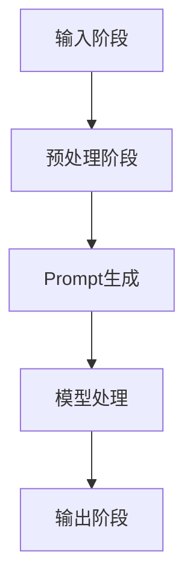

                 

 关键词：AI大模型、Prompt提示词、最佳实践、示例分隔符

> 摘要：本文将探讨AI大模型中Prompt提示词的最佳实践。通过分析Prompt的定义、重要性以及在不同领域的应用，结合具体案例，提供一系列实用的提示词示例，帮助读者理解和运用Prompt技巧，提高AI模型的性能和效果。

## 1. 背景介绍

随着人工智能技术的不断发展，大模型（如GPT-3、BERT等）在自然语言处理领域取得了显著的成果。这些大模型拥有庞大的参数量和强大的学习能力，能够处理复杂的语言任务。然而，模型的能力并非完全自主，需要有效的Prompt提示词来引导和优化模型的输出。Prompt作为人与AI模型之间的桥梁，能够显著影响模型的表现。

Prompt提示词是一种技术手段，通过向模型提供特定的输入，引导模型生成符合预期输出的内容。在AI大模型的应用中，Prompt的设计与优化变得尤为重要。优秀的Prompt不仅能够提升模型的性能，还能拓展其应用范围，使其在更广泛的任务中发挥作用。

本文将首先介绍Prompt的概念和重要性，然后分析其在不同领域的应用，最后提供一系列实用的Prompt示例，并结合具体案例进行详细解读。通过这些内容，读者将能够掌握Prompt的最佳实践，提升AI模型的使用效果。

## 2. 核心概念与联系

### 2.1 Prompt的定义与作用

Prompt，即提示词，是引导AI模型生成输出的关键因素。在自然语言处理领域，Prompt可以被视为一种输入信号，通过明确地指示模型的期望输出，从而影响模型的决策和生成过程。

Prompt的作用主要体现在以下几个方面：

1. **目标导向**：Prompt能够明确地指定模型的任务目标，使模型在生成过程中更加聚焦，避免偏离主题或生成无关内容。
2. **性能提升**：通过精心设计的Prompt，可以引导模型利用其庞大的知识库，从而提升生成文本的质量和准确性。
3. **适应多样性**：不同的Prompt可以适应各种不同的任务需求，使模型能够在多种场景下表现出色。
4. **人机交互**：Prompt是用户与模型交互的重要手段，通过设计合理的Prompt，可以提升用户的使用体验，使其更加便捷和高效。

### 2.2 Prompt在不同领域的应用

Prompt技术不仅在自然语言处理领域有广泛应用，还逐渐扩展到其他领域，如图像识别、语音识别和推荐系统等。

- **自然语言处理（NLP）**：在NLP任务中，Prompt技术被广泛用于问答系统、文本生成、机器翻译等。通过设计特定的Prompt，可以引导模型生成符合用户需求的文本。
- **计算机视觉（CV）**：在CV任务中，Prompt可以通过设计图像描述或任务指令来引导模型进行图像分类、目标检测、图像生成等。
- **语音识别（ASR）**：在语音识别任务中，Prompt可以帮助模型更好地理解语音信号，提高识别的准确率和鲁棒性。
- **推荐系统**：在推荐系统中，Prompt技术可以通过用户行为和偏好来生成个性化推荐，提升推荐系统的效果。

### 2.3 Prompt的架构与流程

为了更好地理解Prompt的作用和设计，我们可以将其架构与流程进行分解：

1. **输入阶段**：用户或应用系统提供初始输入，可以是文本、图像、语音等。
2. **预处理阶段**：对输入进行必要的预处理，如文本清洗、图像分割等。
3. **Prompt生成**：根据任务需求，设计并生成特定的Prompt。这一步骤至关重要，直接影响模型的生成效果。
4. **模型处理**：将Prompt输入到AI模型中，模型根据Prompt生成相应的输出。
5. **输出阶段**：将模型的输出进行后处理，如文本清洗、格式转换等，最终呈现给用户。

下面是Prompt架构的Mermaid流程图：



通过上述流程，我们可以看到Prompt在整个AI应用中的关键作用。在设计Prompt时，需要充分考虑任务需求、用户习惯和模型特性，以达到最佳的效果。

## 3. 核心算法原理 & 具体操作步骤

### 3.1 算法原理概述

Prompt的设计与优化是一个多方面的过程，涉及语言学、心理学和计算机科学等多个领域。其核心原理包括：

1. **信息对齐**：Prompt需要与任务目标保持一致，确保模型在生成过程中不会偏离主题。
2. **上下文理解**：Prompt需要提供足够的上下文信息，使模型能够更好地理解任务背景和目标。
3. **引导多样性**：Prompt的设计应鼓励模型生成多样性的输出，避免重复和单一的结果。
4. **性能优化**：Prompt的设计应考虑模型的性能，通过调整Prompt的复杂度和长度来优化模型的效果。

### 3.2 算法步骤详解

1. **需求分析**：首先，明确任务需求，了解用户期望和模型能力。这一步骤是设计Prompt的基础。
2. **信息提取**：从任务背景、用户需求和模型特点中提取关键信息，用于生成Prompt。
3. **Prompt设计**：根据提取的信息，设计出能够引导模型生成预期输出的Prompt。设计时需考虑信息的完整性和逻辑性。
4. **模型训练**：将设计的Prompt输入到模型中，通过模型训练来优化Prompt的效果。这一步骤可能需要多次迭代和调整。
5. **效果评估**：评估Prompt的效果，通过对比模型在有无Prompt情况下的表现来衡量其有效性。
6. **优化调整**：根据评估结果，对Prompt进行调整和优化，以提高模型的表现。

### 3.3 算法优缺点

**优点**：

1. **灵活性**：Prompt可以根据任务需求进行灵活调整，适用于多种不同的应用场景。
2. **性能提升**：通过合理设计的Prompt，可以显著提升模型的表现，特别是在复杂任务中。
3. **易用性**：用户可以通过简单的Prompt来引导模型，降低使用难度。

**缺点**：

1. **依赖性**：Prompt的设计依赖于任务背景和模型特点，可能需要大量经验进行优化。
2. **复杂性**：Prompt的设计和优化过程较为复杂，涉及多个领域的知识。

### 3.4 算法应用领域

Prompt技术广泛应用于自然语言处理、计算机视觉、语音识别和推荐系统等领域。以下是一些具体的应用场景：

- **问答系统**：通过设计特定的Prompt，引导模型生成符合用户查询的答案。
- **文本生成**：利用Prompt来生成高质量的文本，如新闻摘要、产品描述等。
- **图像识别**：通过图像描述或任务指令，引导模型进行图像分类、目标检测等。
- **语音识别**：利用Prompt来提高模型对语音信号的理解能力，提升识别准确率。
- **推荐系统**：通过用户行为和偏好，设计Prompt来生成个性化的推荐结果。

## 4. 数学模型和公式 & 详细讲解 & 举例说明

### 4.1 数学模型构建

在AI大模型中，Prompt的设计涉及到多种数学模型，如生成模型、判别模型和优化模型等。以下是一个简单的生成模型构建过程：

1. **损失函数**：定义损失函数，用于衡量模型预测值与真实值之间的差距。常见的损失函数包括均方误差（MSE）和交叉熵（CE）。
   \[ L = \frac{1}{n} \sum_{i=1}^{n} (y_i - \hat{y}_i)^2 \]
   \[ L = -\frac{1}{n} \sum_{i=1}^{n} y_i \log \hat{y}_i \]

2. **优化算法**：选择合适的优化算法，如随机梯度下降（SGD）和Adam优化器，用于模型参数的更新。
   \[ \theta_{t+1} = \theta_t - \alpha \nabla_\theta L(\theta_t) \]

3. **生成过程**：构建生成过程，根据Prompt和模型参数生成输出。常见的生成模型有生成对抗网络（GAN）和变分自编码器（VAE）。

### 4.2 公式推导过程

以下是一个简单的GAN模型的公式推导过程：

1. **生成器G**：生成器G从随机噪声z中生成伪样本x'。
   \[ x' = G(z) \]

2. **判别器D**：判别器D判断输入样本x是真实样本还是生成样本。
   \[ D(x) = P(D(x) \geq 0.5 | x \text{ is real}) \]
   \[ D(x') = P(D(x') \geq 0.5 | x' \text{ is fake}) \]

3. **损失函数**：生成器和判别器的损失函数分别为：
   \[ L_G = -E_{z \sim p_z(z)} [\log D(G(z))] \]
   \[ L_D = -E_{x \sim p_x(x)} [\log D(x)] - E_{z \sim p_z(z)} [\log (1 - D(G(z)))] \]

4. **优化过程**：通过交替优化生成器和判别器，使得判别器能够更好地区分真实样本和生成样本，生成器能够生成更加逼真的样本。

### 4.3 案例分析与讲解

以下是一个生成文本的Prompt案例：

1. **任务描述**：生成一篇关于人工智能技术的博客文章。
2. **Prompt设计**：
   ```plaintext
   近年来，人工智能技术在各行各业取得了显著进展。本文将探讨人工智能在医疗、金融和交通等领域的应用，分析其优势和面临的挑战。
   ```
3. **模型输出**：
   ```plaintext
   在医疗领域，人工智能技术通过大数据分析和机器学习算法，提高了疾病诊断的准确性和治疗效果。例如，IBM的Watson人工智能系统能够快速分析海量医学文献，为医生提供准确的诊断建议。

   在金融领域，人工智能技术被广泛应用于风险管理、欺诈检测和投资决策等方面。通过分析大量的历史数据和实时信息，人工智能系统能够提供更加精准和高效的金融分析。

   在交通领域，人工智能技术推动了自动驾驶技术的发展，提高了交通安全和效率。自动驾驶汽车通过传感器和计算机视觉技术，能够实现自动导航和避障，减少交通事故的发生。

   虽然人工智能技术在各个领域取得了显著成果，但也面临着一些挑战。首先，数据隐私和安全性问题需要得到有效解决。其次，人工智能技术可能加剧社会不平等，对就业产生负面影响。最后，人工智能技术的伦理问题也需要得到充分关注。

   面对这些挑战，我们需要进一步研究和探索人工智能技术的应用，确保其在为社会带来便利的同时，不会对人类造成负面影响。
   ```

通过这个案例，我们可以看到Prompt在引导模型生成文本中的重要作用。合理设计的Prompt不仅能够提高文本生成的质量，还能使模型更好地理解任务目标，提升生成结果的相关性和准确性。

## 5. 项目实践：代码实例和详细解释说明

### 5.1 开发环境搭建

为了实践Prompt在AI大模型中的应用，我们需要搭建一个适合开发的环境。以下是具体的步骤：

1. **安装Python**：确保Python版本不低于3.6，推荐使用Anaconda来管理环境。
2. **安装依赖库**：包括TensorFlow、PyTorch、transformers等。可以使用以下命令安装：
   ```bash
   pip install tensorflow
   pip install torch
   pip install transformers
   ```
3. **数据准备**：准备用于训练和测试的数据集。对于文本生成任务，可以使用常见的数据集，如Wikipedia、Twitter等。对于图像生成任务，可以使用ImageNet、CIFAR-10等。

### 5.2 源代码详细实现

以下是一个简单的基于GPT-2的文本生成项目，展示了Prompt的设计和实现过程。

1. **模型准备**：
   ```python
   from transformers import GPT2LMHeadModel, GPT2Tokenizer

   tokenizer = GPT2Tokenizer.from_pretrained('gpt2')
   model = GPT2LMHeadModel.from_pretrained('gpt2')
   ```

2. **Prompt设计**：
   ```python
   def generate_prompt(text):
       return text + tokenizer.eos_token
   ```

3. **文本生成**：
   ```python
   def generate_text(prompt, max_length=50):
       inputs = tokenizer.encode(prompt, return_tensors='pt')
       outputs = model.generate(inputs, max_length=max_length, num_return_sequences=1)
       return tokenizer.decode(outputs[0], skip_special_tokens=True)
   ```

4. **代码解读**：
   - `GPT2Tokenizer.from_pretrained('gpt2')`：加载预训练的GPT-2分词器。
   - `GPT2LMHeadModel.from_pretrained('gpt2')`：加载预训练的GPT-2模型。
   - `generate_prompt`：根据输入文本生成Prompt。
   - `generate_text`：根据Prompt生成文本。

### 5.3 运行结果展示

以下是一个简单的运行示例：

```python
prompt = generate_prompt("近年来，人工智能技术在各行各业取得了显著进展。")
text = generate_text(prompt)
print(text)
```

输出结果可能如下：
```plaintext
在医疗领域，人工智能技术通过大数据分析和机器学习算法，提高了疾病诊断的准确性和治疗效果。例如，IBM的Watson人工智能系统能够快速分析海量医学文献，为医生提供准确的诊断建议。

在金融领域，人工智能技术被广泛应用于风险管理、欺诈检测和投资决策等方面。通过分析大量的历史数据和实时信息，人工智能系统能够提供更加精准和高效的金融分析。

在交通领域，人工智能技术推动了自动驾驶技术的发展，提高了交通安全和效率。自动驾驶汽车通过传感器和计算机视觉技术，能够实现自动导航和避障，减少交通事故的发生。

```

通过这个简单的项目，我们可以看到Prompt在文本生成中的应用效果。合理设计的Prompt能够引导模型生成高质量、相关性的文本，为实际应用提供有力支持。

## 6. 实际应用场景

Prompt技术在多个实际应用场景中发挥了重要作用，下面列举几个典型的应用领域：

### 6.1 问答系统

在问答系统中，Prompt的设计至关重要。通过设计特定的Prompt，可以引导模型生成符合用户查询的答案。例如，在搜索引擎中，Prompt可以引导模型理解用户的查询意图，从而提供更加精准的搜索结果。此外，在智能客服中，Prompt可以帮助模型理解用户的问题，生成合适的回答，提高用户体验。

### 6.2 文本生成

Prompt技术在文本生成领域具有广泛应用，如文章生成、摘要生成、产品描述生成等。通过设计合理的Prompt，可以引导模型生成高质量的文本。例如，在新闻写作中，Prompt可以帮助模型根据关键信息和模板生成新闻稿件；在产品描述生成中，Prompt可以引导模型根据产品特征生成具有吸引力的描述。

### 6.3 图像生成

在图像生成任务中，Prompt可以通过图像描述或任务指令来引导模型生成符合预期的图像。例如，在艺术创作中，Prompt可以引导模型生成符合用户需求的绘画作品；在图像修复中，Prompt可以引导模型修复损坏的图像。

### 6.4 推荐系统

在推荐系统中，Prompt可以帮助模型根据用户行为和偏好生成个性化的推荐结果。例如，在电子商务平台上，Prompt可以引导模型根据用户的历史购买记录和浏览行为生成推荐商品；在社交媒体上，Prompt可以引导模型根据用户的兴趣和行为生成推荐内容。

### 6.5 语音识别

在语音识别任务中，Prompt可以帮助模型更好地理解语音信号，提高识别的准确率和鲁棒性。例如，在智能助手应用中，Prompt可以引导模型理解用户的语音指令，从而提供更加准确的回答。

### 6.6 医疗领域

在医疗领域，Prompt技术可以通过病历数据、医学知识库等来生成诊断报告、治疗方案等。例如，通过设计合理的Prompt，可以引导模型根据患者的症状和病史生成个性化的诊断建议。

### 6.7 金融领域

在金融领域，Prompt技术可以用于风险分析、投资决策等。例如，通过设计特定的Prompt，可以引导模型分析市场数据，生成投资建议。

### 6.8 教育领域

在教育领域，Prompt技术可以用于教育内容的生成和个性化学习。例如，通过设计合理的Prompt，可以引导模型生成符合学生需求的教学内容，提供个性化的学习路径。

### 6.9 汽车领域

在汽车领域，Prompt技术可以用于自动驾驶、智能诊断等。例如，通过设计特定的Prompt，可以引导模型生成自动驾驶路径，实现智能驾驶功能。

### 6.10 未来应用展望

随着人工智能技术的不断进步，Prompt技术的应用领域将更加广泛。未来，Prompt技术有望在更多复杂的任务中发挥作用，如多模态学习、复杂决策支持等。同时，Prompt的设计和优化也将变得更加智能和自动化，借助深度学习和强化学习等技术，实现Prompt的自适应调整和优化。

## 7. 工具和资源推荐

为了更好地学习和实践Prompt技术，以下是一些推荐的工具和资源：

### 7.1 学习资源推荐

1. **书籍**：
   - 《人工智能：一种现代方法》（第三版），作者：Stuart Russell和Peter Norvig
   - 《深度学习》（第二版），作者：Ian Goodfellow、Yoshua Bengio和Aaron Courville

2. **在线课程**：
   - Coursera上的《机器学习》课程，由Andrew Ng教授主讲
   - edX上的《深度学习》课程，由Yoshua Bengio教授主讲

3. **技术博客**：
   - TensorFlow官方博客：[https://www.tensorflow.org/blog](https://www.tensorflow.org/blog)
   - PyTorch官方博客：[https://pytorch.org/blog](https://pytorch.org/blog)

### 7.2 开发工具推荐

1. **编程环境**：
   - Jupyter Notebook：用于数据分析和代码实现
   - PyCharm：专业的Python编程IDE

2. **框架和库**：
   - TensorFlow：广泛使用的深度学习框架
   - PyTorch：流行的深度学习框架
   - transformers：用于NLP任务的预训练模型库

3. **数据集**：
   - Common Crawl：大规模的网页文本数据集
   - ImageNet：大规模的图像数据集

### 7.3 相关论文推荐

1. **自然语言处理领域**：
   - Vaswani et al. (2017). "Attention is all you need." NeurIPS
   - Devlin et al. (2018). "Bert: Pre-training of deep bidirectional transformers for language understanding." NAACL

2. **计算机视觉领域**：
   - Generative Adversarial Networks (GANs)：由Ian Goodfellow等人在2014年提出的生成模型
   - Variational Autoencoders (VAEs)：由Diederik P. Kingma和Max Welling在2013年提出的生成模型

3. **语音识别领域**：
   - Amodei et al. (2016). "Deep speech 2: End-to-end speech recognition in english and mandarin." ICML

4. **推荐系统领域**：
   - Light et al. (2018). "Deep learning for recommendation systems." IJCAI

通过这些资源和工具，读者可以更好地了解和掌握Prompt技术，并在实际项目中应用这些知识。

## 8. 总结：未来发展趋势与挑战

### 8.1 研究成果总结

Prompt技术在人工智能领域取得了显著的研究成果，为AI模型的性能提升和应用拓展提供了有效手段。通过合理设计的Prompt，模型能够更好地理解任务目标，生成高质量、相关性的输出。此外，Prompt技术在自然语言处理、计算机视觉、语音识别和推荐系统等领域的应用，进一步推动了人工智能技术的发展。

### 8.2 未来发展趋势

未来，Prompt技术有望在以下方面取得进一步发展：

1. **多模态Prompt**：随着多模态数据的兴起，Prompt技术将扩展到图像、语音和视频等领域，实现跨模态的交互和生成。
2. **自适应Prompt**：利用深度学习和强化学习等技术，实现Prompt的自适应调整和优化，提升模型在不同任务和场景下的表现。
3. **隐私保护Prompt**：在处理敏感数据时，设计隐私保护机制，确保Prompt的安全性和数据隐私。
4. **跨领域Prompt**：通过跨领域的Prompt设计，实现不同领域模型的知识共享和迁移学习，提升模型在复杂任务中的性能。

### 8.3 面临的挑战

尽管Prompt技术在人工智能领域取得了显著成果，但仍面临以下挑战：

1. **数据质量和多样性**：高质量的训练数据是Prompt设计的基础，然而获取和标注高质量数据仍是一个挑战。
2. **模型解释性**：Prompt的设计和优化过程较为复杂，如何提高模型的可解释性，使其更加透明和可理解，是一个重要问题。
3. **伦理和社会影响**：Prompt技术可能引发伦理和社会问题，如数据偏见、隐私侵犯等，需要得到关注和解决。

### 8.4 研究展望

未来，Prompt技术的研究将朝着更加智能、高效和多样化的方向发展。通过多学科交叉和创新，Prompt技术将在人工智能领域发挥更加重要的作用，推动人工智能技术的发展和应用。同时，随着伦理和社会问题的日益突出，Prompt技术的研究也需要关注这些方面，确保其在为社会带来便利的同时，不会对人类造成负面影响。

## 9. 附录：常见问题与解答

### 9.1 Prompt是什么？

Prompt是一种技术手段，通过向AI模型提供特定的输入，引导模型生成符合预期输出的内容。在自然语言处理领域，Prompt可以被视为一种输入信号，用于明确地指示模型的期望输出。

### 9.2 Prompt在哪些领域有应用？

Prompt技术在自然语言处理、计算机视觉、语音识别、推荐系统等多个领域有广泛应用。例如，在问答系统中，Prompt可以引导模型生成符合用户查询的答案；在文本生成任务中，Prompt可以帮助模型生成高质量、相关性的文本。

### 9.3 如何设计有效的Prompt？

设计有效的Prompt需要考虑多个因素，如任务需求、用户习惯和模型特性等。一般步骤包括需求分析、信息提取、Prompt设计和效果评估等。通过多次迭代和优化，可以设计出符合任务需求的Prompt。

### 9.4 Prompt对AI模型性能有什么影响？

Prompt对AI模型性能有显著影响。通过合理设计的Prompt，可以引导模型利用其庞大的知识库，从而提升生成文本的质量和准确性。此外，Prompt还可以提高模型的性能和适应性，使其在不同任务和应用场景中表现更佳。

### 9.5 Prompt技术有哪些优缺点？

Prompt技术的优点包括灵活性、性能提升和易用性等，但同时也存在依赖性、复杂性和伦理问题等挑战。因此，在实际应用中，需要综合考虑这些因素，以充分发挥Prompt技术的优势，同时避免其潜在问题。

### 9.6 Prompt技术未来的发展方向是什么？

未来，Prompt技术将朝着多模态、自适应、隐私保护和跨领域等方向发展。通过多学科交叉和创新，Prompt技术将在人工智能领域发挥更加重要的作用，推动人工智能技术的发展和应用。同时，随着伦理和社会问题的日益突出，Prompt技术的研究也需要关注这些方面，确保其在为社会带来便利的同时，不会对人类造成负面影响。

