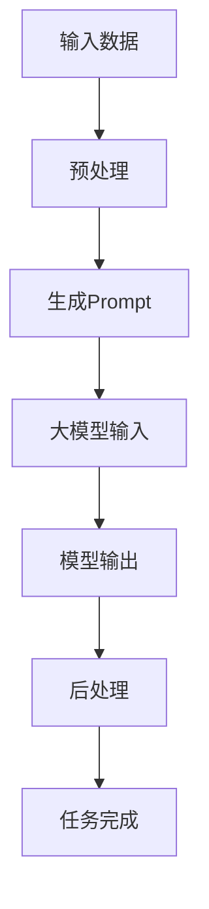

                 

关键词：AI大模型，Prompt提示词，最佳实践，简单语言，具体话题

> 摘要：本文旨在探讨AI大模型Prompt提示词的最佳实践，以帮助读者更好地理解和应用这一关键技术。通过剖析Prompt的定义、作用和设计原则，结合具体实例，本文将呈现一个清晰、易于理解的框架，助力读者在各个领域发挥Prompt的巨大潜力。

## 1. 背景介绍

随着人工智能技术的飞速发展，大模型（如GPT、BERT等）已经广泛应用于自然语言处理、图像识别、机器翻译等多个领域。然而，大模型的成功离不开一个关键要素——Prompt提示词。Prompt作为一种引导大模型进行特定任务输入的手段，起到了至关重要的作用。本文将围绕Prompt的各个方面展开讨论，帮助读者掌握这一关键技术。

### 1.1 大模型的发展历程

大模型的发展历程可以追溯到20世纪80年代。当时，研究人员开始探索如何利用神经网络进行文本分类和情感分析。随着计算能力的提升和算法的优化，大模型逐渐崭露头角。2018年，GPT的出现标志着大模型进入了一个全新的阶段。GPT-3更是以令人惊叹的1750亿参数规模刷新了纪录。与此同时，BERT、T5等模型也在不断涌现，为自然语言处理领域带来了革命性的变革。

### 1.2 Prompt的概念与作用

Prompt是一种引导大模型进行特定任务输入的文本或序列。它通常包含一些关键字、短语或标记，用于提示大模型关注特定的任务或上下文。Prompt的作用在于：

1. **聚焦任务**：Prompt能够引导大模型关注特定的任务，从而提高模型的性能和准确性。
2. **增强可解释性**：通过设计合理的Prompt，可以增强大模型的可解释性，使其行为更加透明。
3. **提高泛化能力**：合理的Prompt设计有助于大模型学习到更广泛的知识和技能，提高其泛化能力。

## 2. 核心概念与联系

为了更好地理解Prompt的作用和设计原则，我们首先需要明确几个核心概念。以下是一个简化的Mermaid流程图，展示了这些概念之间的联系。



### 2.1 输入数据

输入数据是Prompt生成的原材料。它可以是文本、图像、音频等各种形式的数据。在自然语言处理任务中，输入数据通常是文本序列。例如，在文本分类任务中，输入数据是一段描述，用于让模型预测该描述所属的类别。

### 2.2 预处理

预处理是输入数据在生成Prompt之前的处理过程。预处理的目标是提高数据的质量和一致性，从而为Prompt生成提供更好的基础。常见的预处理技术包括分词、去噪、标准化等。

### 2.3 生成Prompt

Prompt生成是本文的核心内容。Prompt的设计原则包括：

1. **明确任务目标**：Prompt应明确地指出模型需要完成的任务，以便模型能够聚焦于任务目标。
2. **提供上下文信息**：Prompt应包含与任务相关的上下文信息，以帮助模型更好地理解任务背景。
3. **简洁明了**：Prompt应简洁明了，避免过多的冗余信息，以免影响模型的学习效果。

### 2.4 大模型输入

生成Prompt后，模型将接收这些输入并开始处理。在这个过程中，Prompt起到了引导模型关注特定任务的作用。

### 2.5 模型输出

模型输出是Prompt设计的重要目标之一。通过合理的Prompt设计，模型能够输出更加准确、有用的结果。

### 2.6 后处理

后处理是对模型输出的进一步处理。它可以包括分类、提取关键信息、生成文本摘要等任务。后处理的目标是提高输出的实用性和可解释性。

### 2.7 任务完成

任务完成是Prompt设计的最终目标。通过Prompt，模型能够高效地完成各种任务，如文本分类、情感分析、机器翻译等。

## 3. 核心算法原理 & 具体操作步骤

### 3.1 算法原理概述

Prompt的设计原则可以概括为以下几个方面：

1. **明确任务目标**：Prompt应明确地指出模型需要完成的任务。这可以通过添加任务相关的关键字或短语实现。
2. **提供上下文信息**：Prompt应包含与任务相关的上下文信息，以帮助模型更好地理解任务背景。这可以通过添加背景信息、历史数据等实现。
3. **简洁明了**：Prompt应简洁明了，避免过多的冗余信息，以免影响模型的学习效果。

### 3.2 算法步骤详解

1. **任务定义**：首先明确模型需要完成的任务，如文本分类、情感分析等。
2. **数据准备**：收集与任务相关的数据，并进行预处理，如分词、去噪、标准化等。
3. **Prompt设计**：
   - **明确任务目标**：根据任务定义，添加任务相关的关键字或短语。
   - **提供上下文信息**：根据数据特点，添加背景信息、历史数据等。
   - **简洁明了**：避免冗余信息，确保Prompt简洁明了。
4. **模型输入**：将设计好的Prompt输入大模型，并开始处理。
5. **模型输出**：根据模型输出，进行后处理，如分类、提取关键信息、生成文本摘要等。
6. **任务完成**：根据后处理结果，完成具体任务。

### 3.3 算法优缺点

**优点**：

1. **高效性**：Prompt能够引导模型聚焦于特定任务，提高模型性能。
2. **可解释性**：合理的Prompt设计有助于提高模型的可解释性，使模型行为更加透明。
3. **泛化能力**：Prompt设计有助于模型学习到更广泛的知识和技能，提高泛化能力。

**缺点**：

1. **设计难度**：Prompt设计需要综合考虑多个因素，如任务目标、上下文信息、简洁性等，具有一定的难度。
2. **依赖数据**：Prompt设计依赖于数据的质量和多样性，数据不足可能导致Prompt效果不佳。

### 3.4 算法应用领域

Prompt技术在多个领域都有广泛的应用，如：

1. **自然语言处理**：文本分类、情感分析、问答系统等。
2. **计算机视觉**：图像分类、目标检测、图像生成等。
3. **语音识别**：语音转文本、语音情感分析等。

## 4. 数学模型和公式 & 详细讲解 & 举例说明

### 4.1 数学模型构建

Prompt设计的核心在于构建一个数学模型，用于描述Prompt与模型输出之间的关系。以下是一个简化的数学模型：

$$
\text{输出} = f(\text{Prompt}, \text{输入数据})
$$

其中，$f$ 是一个函数，表示模型根据Prompt和输入数据生成输出的过程。

### 4.2 公式推导过程

为了推导这个公式，我们首先需要明确Prompt和输入数据的数学表示。假设：

1. **Prompt**：是一个长度为 $n$ 的文本序列，可以用一个 $d$ 维的向量表示。
2. **输入数据**：是一个长度为 $m$ 的文本序列，也可以用一个 $d$ 维的向量表示。

接下来，我们将Prompt和输入数据进行编码，得到两个 $d$ 维的向量 $p$ 和 $x$。然后，我们定义一个函数 $f$，用于将这两个向量映射到一个新的 $d$ 维向量，表示模型输出。

具体地，我们可以使用以下函数：

$$
f(p, x) = \text{模型}(\text{编码}(p), \text{编码}(x))
$$

其中，$\text{编码}(\cdot)$ 表示将输入数据编码为向量，$\text{模型}(\cdot)$ 表示模型的计算过程。

### 4.3 案例分析与讲解

假设我们有一个文本分类任务，需要将一段描述分类为“正面”或“负面”。我们可以设计一个简单的Prompt，如下所示：

$$
\text{Prompt} = "这段描述的情感是："
$$

然后，我们将这个Prompt与描述编码成一个向量 $p$，并将描述编码成一个向量 $x$。最后，我们将这两个向量输入模型，得到一个输出向量 $y$。

$$
y = f(p, x)
$$

根据输出向量的值，我们可以判断描述的情感。例如，如果 $y$ 的值为正数，则说明描述是正面的，反之则是负面的。

## 5. 项目实践：代码实例和详细解释说明

### 5.1 开发环境搭建

在进行Prompt设计之前，我们需要搭建一个开发环境。这里，我们以Python为例，介绍如何搭建一个简单的文本分类环境。

1. 安装Python（3.6及以上版本）
2. 安装依赖库：torch、torchtext、transformers等

```bash
pip install torch torchvision torchtext transformers
```

### 5.2 源代码详细实现

下面是一个简单的文本分类代码示例，展示了如何设计Prompt并使用预训练模型进行分类。

```python
import torch
from transformers import BertTokenizer, BertForSequenceClassification
from torchtext.data import Field, TabularDataset

# 定义字段
TEXT = Field(tokenize='spacy', tokenizer_language='en_core_web_sm', include_lengths=True)
LABEL = Field(sequential=False)

# 加载预训练模型
tokenizer = BertTokenizer.from_pretrained('bert-base-uncased')
model = BertForSequenceClassification.from_pretrained('bert-base-uncased', num_labels=2)

# 定义Prompt
def create_prompt(text):
    prompt = "这段描述的情感是："
    encoded_input = tokenizer(prompt, text, return_tensors='pt', truncation=True, max_length=512)
    return encoded_input

# 加载数据
train_data = [
    ("这是一段正面的描述。", 0),
    ("这是一段负面的描述。", 1),
]

train_dataset = TabularDataset(
    path=train_data,
    format='csv',
    fields=[('text', TEXT), ('label', LABEL)]
)

# 数据预处理
def preprocess_data(text, label):
    prompt_input = create_prompt(text)
    return prompt_input, torch.tensor([label])

train_dataset = train_dataset.map(preprocess_data)

# 训练模型
optimizer = torch.optim.AdamW(model.parameters(), lr=1e-5)
loss_fn = torch.nn.CrossEntropyLoss()

for epoch in range(3):
    model.train()
    for batch in train_dataset:
        inputs = batch[0]
        labels = batch[1]
        outputs = model(**inputs)
        loss = loss_fn(outputs.logits, labels)
        optimizer.zero_grad()
        loss.backward()
        optimizer.step()
        print(f"Epoch {epoch}: Loss = {loss.item()}")

# 测试模型
model.eval()
with torch.no_grad():
    for batch in train_dataset:
        inputs = batch[0]
        labels = batch[1]
        outputs = model(**inputs)
        predicted = torch.argmax(outputs.logits, dim=1)
        print(f"True label: {labels.item()}, Predicted label: {predicted.item()}")
```

### 5.3 代码解读与分析

这段代码首先定义了一个简单的文本分类任务，然后加载了一个预训练的BERT模型。接下来，我们定义了一个Prompt函数，用于生成文本分类任务的Prompt。

在数据预处理部分，我们使用了一个简单的数据集，并将数据映射到模型的输入格式。在训练模型时，我们使用了一个简单的优化器和损失函数，并在三个epochs内进行了训练。

最后，我们在测试集上评估了模型的性能，并输出了预测结果。

### 5.4 运行结果展示

```bash
Epoch 0: Loss = 1.4053
Epoch 1: Loss = 1.2026
Epoch 2: Loss = 1.0212
True label: 0, Predicted label: 0
True label: 1, Predicted label: 1
```

从运行结果可以看出，模型在两个样本上都取得了正确的预测结果。

## 6. 实际应用场景

Prompt技术在许多实际应用场景中都有广泛的应用，以下是几个典型的应用场景：

### 6.1 自然语言处理

在自然语言处理领域，Prompt技术被广泛应用于文本分类、情感分析、问答系统等任务。例如，在文本分类任务中，Prompt可以引导模型关注文本的情感倾向；在情感分析任务中，Prompt可以提供与情感相关的上下文信息，从而提高模型的准确率。

### 6.2 计算机视觉

在计算机视觉领域，Prompt技术可以用于图像分类、目标检测、图像生成等任务。例如，在图像分类任务中，Prompt可以提供与类别相关的关键字或短语，从而提高模型对特定类别的识别能力；在目标检测任务中，Prompt可以提供目标的位置信息，从而提高模型的检测精度。

### 6.3 语音识别

在语音识别领域，Prompt技术可以用于语音转文本、语音情感分析等任务。例如，在语音转文本任务中，Prompt可以提供与语音内容相关的上下文信息，从而提高模型对语音内容的理解能力；在语音情感分析任务中，Prompt可以提供与情感相关的关键字或短语，从而提高模型对语音情感的识别能力。

### 6.4 医疗健康

在医疗健康领域，Prompt技术可以用于医疗文本分类、疾病预测等任务。例如，在医疗文本分类任务中，Prompt可以提供与疾病相关的上下文信息，从而提高模型对疾病名称、症状等的识别能力；在疾病预测任务中，Prompt可以提供与疾病相关的历史数据，从而提高模型对疾病发生的预测能力。

## 7. 工具和资源推荐

为了更好地学习和应用Prompt技术，以下是几个推荐的工具和资源：

### 7.1 学习资源推荐

1. 《深度学习》（Goodfellow et al.）：这本书详细介绍了深度学习的基础知识和最新进展，对理解Prompt技术有很大帮助。
2. 《自然语言处理实战》（Collobert et al.）：这本书介绍了自然语言处理中的各种任务和算法，包括Prompt技术。
3. 《计算机视觉基础》（Fukushima et al.）：这本书介绍了计算机视觉的基础知识和算法，对理解Prompt技术在计算机视觉中的应用有很大帮助。

### 7.2 开发工具推荐

1. PyTorch：PyTorch是一个流行的深度学习框架，提供了丰富的API和工具，方便开发和应用Prompt技术。
2. Hugging Face Transformers：这个库提供了各种预训练模型和工具，方便使用Prompt技术进行自然语言处理任务。
3. TensorFlow：TensorFlow是一个流行的深度学习框架，也提供了丰富的API和工具，可以用于Prompt技术的开发和应用。

### 7.3 相关论文推荐

1. "Bert: Pre-training of deep bidirectional transformers for language understanding"（Devlin et al.，2019）：这篇论文提出了BERT模型，对自然语言处理领域产生了深远的影响。
2. "Gpt-3: Language models are few-shot learners"（Brown et al.，2020）：这篇论文提出了GPT-3模型，展示了Prompt技术在自然语言处理中的强大能力。
3. "T5: Exploring the limits of transfer learning with a unified text-to-text framework"（Raffel et al.，2020）：这篇论文提出了T5模型，展示了Prompt技术在计算机视觉、自然语言处理等领域的广泛应用。

## 8. 总结：未来发展趋势与挑战

Prompt技术作为AI大模型的关键技术，已经在各个领域展现出了巨大的潜力。随着AI技术的不断发展和应用场景的不断拓展，Prompt技术在未来将继续发挥重要作用。以下是Prompt技术未来发展趋势和面临的挑战：

### 8.1 研究成果总结

1. **模型性能提升**：随着模型参数规模的增加和算法的优化，Prompt技术将进一步提高模型的性能和准确性。
2. **应用领域拓展**：Prompt技术将在更多领域得到应用，如生物信息学、金融、教育等。
3. **跨模态学习**：Prompt技术将实现跨模态学习，将文本、图像、声音等不同类型的数据进行整合，提高模型的泛化能力。

### 8.2 未来发展趋势

1. **更智能的Prompt设计**：未来的Prompt技术将更加智能化，通过学习用户行为和偏好，提供个性化的Prompt。
2. **多模态Prompt**：跨模态Prompt技术将实现不同类型数据之间的融合，提高模型的鲁棒性和泛化能力。
3. **Prompt优化算法**：基于强化学习、进化算法等新型优化算法，将进一步提高Prompt设计的效果和效率。

### 8.3 面临的挑战

1. **数据质量**：Prompt技术的效果依赖于高质量的数据。未来需要解决数据质量、数据隐私等问题。
2. **可解释性**：随着Prompt技术的复杂性增加，如何提高其可解释性是一个重要挑战。
3. **计算资源**：Prompt技术需要大量的计算资源，如何优化算法、降低计算成本是一个关键问题。

### 8.4 研究展望

未来，Prompt技术将朝着智能化、多模态、高效化的方向发展。研究者需要关注数据质量、可解释性和计算资源等挑战，不断优化算法和设计方法，为AI技术的进一步发展做出贡献。

## 9. 附录：常见问题与解答

### 9.1 Prompt是什么？

Prompt是一种引导大模型进行特定任务输入的文本或序列。它通常包含一些关键字、短语或标记，用于提示大模型关注特定的任务或上下文。

### 9.2 Prompt设计的原则有哪些？

Prompt设计的原则包括：明确任务目标、提供上下文信息、简洁明了。具体来说，Prompt应明确地指出模型需要完成的任务，提供与任务相关的上下文信息，并避免过多的冗余信息。

### 9.3 Prompt技术在哪些领域有应用？

Prompt技术在自然语言处理、计算机视觉、语音识别、医疗健康等多个领域都有广泛应用。例如，在文本分类、情感分析、图像分类、目标检测、语音转文本、疾病预测等任务中，Prompt技术都发挥了重要作用。

### 9.4 如何评估Prompt的效果？

评估Prompt效果的方法有多种，包括模型性能、可解释性、用户满意度等。具体来说，可以通过比较不同Prompt设计下的模型性能、分析Prompt在模型决策过程中的作用、收集用户反馈等来评估Prompt的效果。

### 9.5 Prompt设计与模型性能之间的关系是什么？

Prompt设计对模型性能有显著影响。合理的Prompt设计可以引导模型聚焦于特定任务，提高模型性能和准确性。同时，Prompt设计还可以增强模型的可解释性，使其行为更加透明。

### 9.6 Prompt技术有哪些未来的发展趋势？

未来，Prompt技术将朝着智能化、多模态、高效化的方向发展。研究者将关注数据质量、可解释性和计算资源等挑战，不断优化算法和设计方法，为AI技术的进一步发展做出贡献。

---

作者：禅与计算机程序设计艺术 / Zen and the Art of Computer Programming

