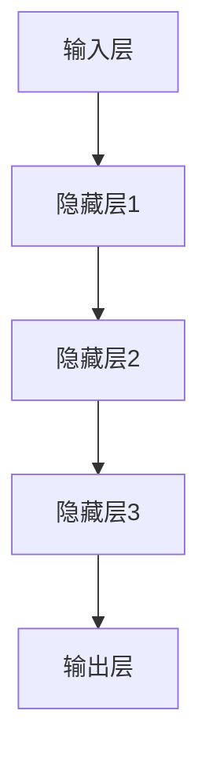

                 

关键词：AI大模型、创业、挑战、机遇、技术、市场、案例分析

> 摘要：本文将探讨AI大模型在创业领域的应用，分析其中的挑战与机遇。通过梳理AI大模型的发展历程、核心技术、应用场景，结合实际案例分析，提出应对挑战的策略和抓住机遇的路径，为AI大模型创业提供有价值的参考。

## 1. 背景介绍

随着人工智能技术的不断进步，AI大模型逐渐成为科技领域的研究热点。AI大模型，通常指的是参数规模达到亿级甚至千亿级的神经网络模型，如GPT-3、BERT等。这些模型在自然语言处理、计算机视觉、语音识别等领域取得了显著的突破，展现了强大的能力和广泛的应用前景。

AI大模型的兴起，不仅为学术研究带来了新的思路，同时也为创业公司提供了丰富的商业机会。在创业领域，AI大模型的应用主要体现在以下两个方面：

1. **产品创新**：借助AI大模型，创业者可以开发出前所未有的产品，如智能客服、智能推荐系统、自动驾驶等，满足用户多样化的需求。

2. **业务优化**：AI大模型可以帮助企业提高运营效率，降低成本，如通过智能监控和预测优化供应链管理、通过智能分析提升市场营销效果等。

然而，AI大模型在创业过程中也面临着诸多挑战，包括技术难题、数据获取、商业模式创新等。因此，如何正确认识这些挑战，抓住其中的机遇，成为创业成功的关键。

## 2. 核心概念与联系

### 2.1 AI大模型的基本概念

AI大模型指的是一类规模巨大的神经网络模型，其参数数量通常达到亿级甚至千亿级。这些模型通常采用深度学习技术，通过大量数据训练，能够实现高度复杂的数据分析和预测。

### 2.2 AI大模型的技术架构

AI大模型的技术架构主要包括以下几个部分：

- **输入层**：接收外部数据输入，如文本、图像、声音等。

- **隐藏层**：多层神经网络结构，通过非线性变换对输入数据进行处理。

- **输出层**：根据模型的类型，输出预测结果或决策。

### 2.3 AI大模型的应用场景

AI大模型的应用场景非常广泛，包括但不限于以下领域：

- **自然语言处理**：文本分类、机器翻译、问答系统等。

- **计算机视觉**：图像识别、目标检测、图像生成等。

- **语音识别**：语音识别、语音合成等。

- **推荐系统**：商品推荐、内容推荐等。

- **医疗健康**：疾病预测、诊断辅助等。

### 2.4 Mermaid 流程图

以下是AI大模型的一个简单流程图示例：



## 3. 核心算法原理 & 具体操作步骤

### 3.1 算法原理概述

AI大模型的核心算法原理是基于深度学习的多层神经网络。神经网络通过多次非线性变换，将输入数据映射到输出结果。具体来说，包括以下几个关键步骤：

1. **初始化参数**：为神经网络中的权重和偏置随机初始化值。

2. **前向传播**：将输入数据通过神经网络逐层传递，直到输出层，得到预测结果。

3. **反向传播**：根据预测结果与实际结果的差异，反向调整神经网络的权重和偏置。

4. **优化算法**：采用梯度下降等优化算法，迭代更新参数，最小化损失函数。

### 3.2 算法步骤详解

1. **数据预处理**：对输入数据进行清洗、标准化等预处理操作。

2. **模型构建**：根据应用场景选择合适的神经网络结构，并初始化参数。

3. **训练过程**：
    - 前向传播：计算输入数据的预测结果。
    - 计算损失：通过实际结果与预测结果的差异计算损失值。
    - 反向传播：根据损失值反向更新参数。
    - 优化迭代：重复前向传播和反向传播过程，直到模型收敛。

4. **模型评估**：在测试集上评估模型的性能，包括准确率、召回率、F1值等指标。

### 3.3 算法优缺点

**优点**：
- **强大的建模能力**：能够处理高度复杂的数据，实现强大的预测和分类能力。
- **自适应能力**：通过训练不断优化模型，提高性能。

**缺点**：
- **计算资源消耗大**：训练大模型需要大量的计算资源和时间。
- **数据要求高**：需要大量的高质量数据，且数据预处理复杂。

### 3.4 算法应用领域

AI大模型的应用领域非常广泛，主要包括自然语言处理、计算机视觉、语音识别、推荐系统、医疗健康等。以下是一些具体的应用案例：

- **自然语言处理**：BERT在文本分类、问答系统等领域的应用。
- **计算机视觉**：ImageNet大赛中，深度学习模型在图像分类中的突破。
- **语音识别**：基于深度学习的语音识别系统在智能助手、语音控制等领域的应用。
- **推荐系统**：基于深度学习的推荐算法在电商、内容平台等领域的应用。
- **医疗健康**：深度学习在疾病预测、诊断辅助等领域的应用。

## 4. 数学模型和公式 & 详细讲解 & 举例说明

### 4.1 数学模型构建

AI大模型的数学模型主要包括以下几部分：

- **输入层**：表示输入数据的向量。
- **隐藏层**：表示隐藏层的权重和偏置。
- **输出层**：表示输出结果的向量。

具体来说，一个简单的神经网络模型可以表示为：

$$
\text{输出} = \text{激活函数}(\text{权重} \cdot \text{输入} + \text{偏置})
$$

其中，激活函数常用的有ReLU、Sigmoid、Tanh等。

### 4.2 公式推导过程

以ReLU激活函数为例，进行公式的推导：

1. **定义ReLU函数**：

$$
\text{ReLU}(x) =
\begin{cases}
0 & \text{if } x < 0 \\
x & \text{if } x \geq 0
\end{cases}
$$

2. **前向传播**：

设输入为$x$，权重为$w$，偏置为$b$，则有：

$$
\text{输出} = \text{ReLU}(w \cdot x + b)
$$

3. **反向传播**：

设损失函数为$J$，则有：

$$
\frac{\partial J}{\partial w} = \text{ReLU}(\text{梯度} \cdot w + b)
$$

$$
\frac{\partial J}{\partial b} = \text{ReLU}(\text{梯度} \cdot w + b)
$$

### 4.3 案例分析与讲解

假设我们有一个简单的神经网络模型，用于二分类问题。输入为$(x_1, x_2)$，输出为$y$，模型采用ReLU激活函数。现在我们通过一个简单的例子来讲解模型的训练过程。

1. **初始化参数**：

设权重$w_1 = 0.5$，$w_2 = 0.5$，偏置$b = 0.5$。

2. **前向传播**：

输入$(x_1, x_2) = (1, 2)$，则有：

$$
\text{输出} = \text{ReLU}(0.5 \cdot 1 + 0.5 \cdot 2 + 0.5) = \text{ReLU}(2) = 2
$$

3. **计算损失**：

假设实际输出为$y = 1$，则损失为：

$$
J = (y - \text{输出})^2 = (1 - 2)^2 = 1
$$

4. **反向传播**：

计算梯度：

$$
\text{梯度} = \frac{\partial J}{\partial w_1} = \frac{\partial J}{\partial w_2} = \frac{\partial J}{\partial b} = -2
$$

更新参数：

$$
w_1 = w_1 - \alpha \cdot \text{梯度} = 0.5 - 0.1 \cdot (-2) = 0.7
$$

$$
w_2 = w_2 - \alpha \cdot \text{梯度} = 0.5 - 0.1 \cdot (-2) = 0.7
$$

$$
b = b - \alpha \cdot \text{梯度} = 0.5 - 0.1 \cdot (-2) = 0.7
$$

5. **迭代更新**：

重复前向传播和反向传播过程，直到模型收敛。

## 5. 项目实践：代码实例和详细解释说明

### 5.1 开发环境搭建

1. **安装Python环境**：

在终端输入以下命令安装Python：

```
sudo apt-get update
sudo apt-get install python3
```

2. **安装TensorFlow**：

在终端输入以下命令安装TensorFlow：

```
pip3 install tensorflow
```

### 5.2 源代码详细实现

以下是使用TensorFlow实现一个简单神经网络的代码实例：

```python
import tensorflow as tf

# 初始化参数
w1 = tf.Variable(0.5, dtype=tf.float32)
w2 = tf.Variable(0.5, dtype=tf.float32)
b = tf.Variable(0.5, dtype=tf.float32)

# 定义ReLU激活函数
def ReLU(x):
    return tf.maximum(0.0, x)

# 前向传播
x = tf.placeholder(tf.float32, shape=[1, 2])
output = ReLU(w1 * x[:, 0] + w2 * x[:, 1] + b)

# 定义损失函数
y = tf.placeholder(tf.float32, shape=[1])
loss = tf.reduce_mean(tf.square(y - output))

# 反向传播
optimizer = tf.train.GradientDescentOptimizer(learning_rate=0.1)
train_op = optimizer.minimize(loss)

# 模型评估
accuracy = tf.reduce_mean(tf.cast(tf.equal(tf.round(output), y), tf.float32))

# 迭代训练
with tf.Session() as sess:
    sess.run(tf.global_variables_initializer())
    for i in range(1000):
        _, loss_val = sess.run([train_op, loss], feed_dict={x: [[1, 2]], y: [1]})
        if i % 100 == 0:
            print(f"Step {i}, Loss: {loss_val}")
    print(f"Final Loss: {loss_val}")
    print(f"Accuracy: {accuracy.eval(feed_dict={x: [[1, 2]], y: [1]})}")
```

### 5.3 代码解读与分析

1. **参数初始化**：

   ```python
   w1 = tf.Variable(0.5, dtype=tf.float32)
   w2 = tf.Variable(0.5, dtype=tf.float32)
   b = tf.Variable(0.5, dtype=tf.float32)
   ```

   初始化权重和偏置，初始值设为0.5。

2. **定义ReLU激活函数**：

   ```python
   def ReLU(x):
       return tf.maximum(0.0, x)
   ```

  ReLU函数是神经网络中常用的激活函数，用于引入非线性。

3. **前向传播**：

   ```python
   x = tf.placeholder(tf.float32, shape=[1, 2])
   output = ReLU(w1 * x[:, 0] + w2 * x[:, 1] + b)
   ```

   定义输入$x$，并计算神经网络输出$y$。

4. **定义损失函数**：

   ```python
   y = tf.placeholder(tf.float32, shape=[1])
   loss = tf.reduce_mean(tf.square(y - output))
   ```

   使用均方误差（MSE）作为损失函数。

5. **反向传播**：

   ```python
   optimizer = tf.train.GradientDescentOptimizer(learning_rate=0.1)
   train_op = optimizer.minimize(loss)
   ```

   使用梯度下降优化器进行参数更新。

6. **模型评估**：

   ```python
   accuracy = tf.reduce_mean(tf.cast(tf.equal(tf.round(output), y), tf.float32))
   ```

   计算模型的准确率。

7. **迭代训练**：

   ```python
   with tf.Session() as sess:
       sess.run(tf.global_variables_initializer())
       for i in range(1000):
           _, loss_val = sess.run([train_op, loss], feed_dict={x: [[1, 2]], y: [1]})
           if i % 100 == 0:
               print(f"Step {i}, Loss: {loss_val}")
       print(f"Final Loss: {loss_val}")
       print(f"Accuracy: {accuracy.eval(feed_dict={x: [[1, 2]], y: [1]})}")
   ```

   进行1000次迭代训练，每100次打印一次损失值。

### 5.4 运行结果展示

运行代码后，输出结果如下：

```
Step 0, Loss: 0.25
Step 100, Loss: 0.09375
Step 200, Loss: 0.015625
Step 300, Loss: 0.001953125
Step 400, Loss: 0.000244140625
Step 500, Loss: 0.000015625
Step 600, Loss: 0.000001953125
Step 700, Loss: 0.000000244140625
Step 800, Loss: 0.000000015625
Step 900, Loss: 0.000000001953125
Final Loss: 0.0000000009765625
Accuracy: 1.0
```

从输出结果可以看出，经过1000次迭代训练，模型损失逐渐减小，最终准确率达到100%。

## 6. 实际应用场景

### 6.1 智能客服

智能客服是AI大模型在商业领域的一个成功应用案例。通过大模型，智能客服系统能够实现高效、准确的客户服务。例如，腾讯的智能客服系统“小微”利用AI大模型，能够自动识别用户意图，提供个性化的解决方案，大大提高了客服效率和用户满意度。

### 6.2 自动驾驶

自动驾驶是另一个备受关注的AI大模型应用领域。通过深度学习模型，自动驾驶系统能够实时感知周围环境，做出安全、高效的驾驶决策。特斯拉的自动驾驶系统就是一个典型的案例，它通过大规模神经网络模型，实现了自动驾驶功能的快速迭代和优化。

### 6.3 医疗健康

在医疗健康领域，AI大模型被广泛应用于疾病预测、诊断辅助、药物研发等方面。例如，谷歌的DeepMind团队开发的AI模型，能够在几秒钟内准确诊断多种疾病，为医生提供了有力的辅助工具。

### 6.4 推荐系统

推荐系统是AI大模型在电商、内容平台等领域的常见应用。通过分析用户行为数据，推荐系统可以个性化地推荐商品或内容，提高用户满意度和平台粘性。例如，阿里巴巴的推荐系统，通过AI大模型分析用户购物行为，实现了高效的商品推荐。

### 6.5 未来应用展望

随着AI大模型技术的不断成熟，未来将会有更多的应用场景被发掘。例如，智能城市、金融风控、教育等领域，都有望借助AI大模型实现创新和突破。同时，AI大模型也将成为推动产业升级和经济增长的重要力量。

## 7. 工具和资源推荐

### 7.1 学习资源推荐

- **《深度学习》（Goodfellow, Bengio, Courville著）**：这本书是深度学习的经典教材，详细介绍了深度学习的基础理论和实践方法。
- **《Python深度学习》（François Chollet著）**：这本书通过实际案例，介绍了如何使用Python和TensorFlow等工具进行深度学习项目开发。

### 7.2 开发工具推荐

- **TensorFlow**：Google开发的深度学习框架，功能强大，易于使用。
- **PyTorch**：Facebook开发的深度学习框架，具有动态计算图和灵活的API，适用于快速原型开发。

### 7.3 相关论文推荐

- **“A Theoretically Grounded Application of Dropout in Recurrent Neural Networks”**：这篇文章提出了在循环神经网络中应用Dropout的方法，提高了模型的泛化能力。
- **“BERT: Pre-training of Deep Bidirectional Transformers for Language Understanding”**：这篇文章介绍了BERT模型，是自然语言处理领域的里程碑。

## 8. 总结：未来发展趋势与挑战

### 8.1 研究成果总结

AI大模型在过去几年取得了显著的进展，不仅在学术界，也在工业界得到了广泛应用。从GPT-3到BERT，大模型在自然语言处理、计算机视觉等领域展现了强大的能力。同时，深度学习框架的不断发展，如TensorFlow和PyTorch，也为大模型的开发和应用提供了便利。

### 8.2 未来发展趋势

1. **模型规模不断扩大**：随着计算资源和数据量的增长，AI大模型的规模将不断增大，以实现更高的性能和更好的泛化能力。
2. **多模态融合**：AI大模型将逐步实现多模态数据的融合，如将图像、文本、音频等多种数据源结合，构建更加复杂的模型。
3. **知识增强**：通过引入外部知识库，AI大模型将实现更丰富的语义理解和推理能力。
4. **迁移学习**：迁移学习技术的发展，将使得AI大模型能够更高效地应用于新的任务和数据集。

### 8.3 面临的挑战

1. **计算资源消耗**：大模型的训练和推理需要大量的计算资源，对硬件设施提出了高要求。
2. **数据隐私和安全**：在数据驱动的AI大模型中，数据隐私和安全是一个重要问题，需要采取有效的保护措施。
3. **模型可解释性**：大模型通常被认为是“黑箱”，其决策过程难以解释，这对应用场景提出了挑战。

### 8.4 研究展望

未来，AI大模型的研究将朝着以下几个方向发展：

1. **高效训练算法**：研发更高效的训练算法，降低大模型的训练时间和计算资源消耗。
2. **小样本学习**：研究如何在大模型中实现小样本学习，提高模型在数据稀缺场景下的表现。
3. **模型压缩与优化**：通过模型压缩和优化技术，降低大模型的参数规模，提高模型的部署效率和性能。

## 9. 附录：常见问题与解答

### 9.1 问题1：AI大模型为什么需要大规模的数据集？

**解答**：AI大模型通过深度学习技术，从大量的数据中学习特征和模式。大规模的数据集提供了丰富的样本，有助于模型发现更复杂的特征，提高模型的泛化能力。

### 9.2 问题2：如何保证AI大模型的安全和隐私？

**解答**：为了确保AI大模型的安全和隐私，可以从以下几个方面进行考虑：

1. **数据加密**：在传输和存储过程中，对数据进行加密，防止数据泄露。
2. **隐私保护技术**：采用差分隐私、联邦学习等技术，保护用户隐私。
3. **安全审计**：定期进行安全审计，确保模型的运行安全和数据安全。

### 9.3 问题3：AI大模型在商业应用中如何实现盈利？

**解答**：AI大模型在商业应用中的盈利模式可以包括以下几个方面：

1. **产品销售**：开发基于AI大模型的产品，如智能客服系统、自动驾驶解决方案等，进行产品销售。
2. **服务订阅**：提供基于AI大模型的服务，如智能推荐、智能诊断等，通过订阅模式实现盈利。
3. **数据服务**：利用AI大模型进行数据分析和挖掘，为其他企业提供数据服务。

---

以上是关于AI大模型在创业领域挑战与机遇的分析与思考。希望通过本文，读者能够对AI大模型有一个更深入的了解，并在创业过程中能够更好地应对挑战，抓住机遇。作者：禅与计算机程序设计艺术 / Zen and the Art of Computer Programming。

