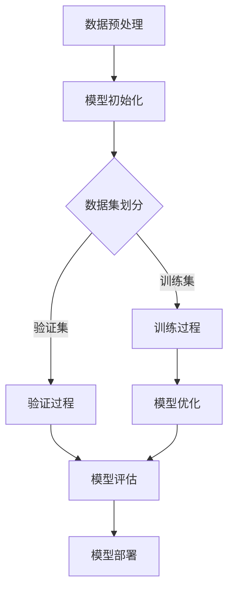

                 

关键词：AI大模型，创业，盈利模式，技术发展，市场策略

摘要：本文将探讨AI大模型的创业之路，分析其技术发展历程、盈利模式创新及市场策略。从核心算法原理、数学模型、项目实践，到实际应用场景和未来展望，本文旨在为创业者提供有价值的参考和启示。

## 1. 背景介绍

随着人工智能技术的飞速发展，AI大模型已经成为全球科技领域的热点。从最初的深度学习算法，到如今的大型预训练模型，如GPT、BERT等，AI大模型在自然语言处理、计算机视觉、语音识别等领域取得了显著的成果。然而，在技术不断突破的同时，如何将AI大模型应用于实际场景，实现商业价值的转化，成为众多创业者面临的重要课题。

### 1.1 技术发展历程

AI大模型的发展历程可以分为以下几个阶段：

1. **深度学习算法**：以神经网络为代表的深度学习算法在图像识别、语音识别等领域取得了突破性进展。
2. **预训练+微调**：通过在大量数据上进行预训练，使模型具备一定的通用性，再通过微调适应特定任务，大大提高了模型的性能和效率。
3. **大规模预训练模型**：GPT、BERT等模型的出现，标志着AI大模型的崛起，它们在自然语言处理领域取得了显著的成果。
4. **多模态融合**：结合图像、语音、文本等多种数据源，实现多模态AI大模型的训练和应用。

### 1.2 商业价值潜力

AI大模型在各个领域的应用，为创业者提供了丰富的商业价值潜力。以下是一些典型的应用场景：

1. **自然语言处理**：智能客服、智能写作、机器翻译等，为企业降低成本，提高效率。
2. **计算机视觉**：图像识别、自动驾驶、智能安防等，为产业升级提供技术支撑。
3. **语音识别**：智能语音助手、语音搜索等，提升用户体验，拓展业务场景。

## 2. 核心概念与联系

为了更好地理解AI大模型的应用和发展，我们需要掌握以下几个核心概念：

### 2.1 AI大模型原理

AI大模型基于深度学习算法，通过多层神经网络进行特征提取和模型训练。其核心原理包括：

1. **神经网络**：由大量神经元组成的计算网络，用于处理和传递信息。
2. **反向传播**：通过误差反向传播算法，不断调整模型参数，优化模型性能。
3. **大规模数据训练**：通过在大量数据上进行训练，使模型具备较强的泛化能力和适应性。

### 2.2 大模型架构

大模型架构通常包括以下几个层次：

1. **输入层**：接收外部数据输入，如文本、图像、语音等。
2. **隐藏层**：通过多层神经网络进行特征提取和转换。
3. **输出层**：输出预测结果或决策。

### 2.3 Mermaid流程图

以下是一个简化的AI大模型训练过程的Mermaid流程图：



## 3. 核心算法原理 & 具体操作步骤

### 3.1 算法原理概述

AI大模型的算法原理主要包括以下几个部分：

1. **深度学习算法**：以神经网络为基础，通过多层神经网络进行特征提取和模型训练。
2. **大规模数据训练**：在大量数据上进行训练，使模型具备较强的泛化能力和适应性。
3. **优化算法**：通过梯度下降、Adam等优化算法，不断调整模型参数，优化模型性能。

### 3.2 算法步骤详解

1. **数据预处理**：对输入数据进行清洗、归一化等预处理操作。
2. **模型初始化**：初始化模型参数，如随机初始化、预训练模型等。
3. **数据集划分**：将数据集划分为训练集、验证集和测试集。
4. **训练过程**：在训练集上进行模型训练，通过反向传播算法不断优化模型参数。
5. **验证过程**：在验证集上进行模型验证，调整模型参数，优化模型性能。
6. **模型优化**：通过模型优化算法，进一步优化模型参数，提高模型性能。
7. **模型评估**：在测试集上进行模型评估，评估模型性能和泛化能力。
8. **模型部署**：将训练好的模型部署到实际应用场景中。

### 3.3 算法优缺点

**优点**：

1. **强大的泛化能力**：通过大规模数据训练，使模型具备较强的泛化能力。
2. **高效的特征提取**：多层神经网络能够自动提取抽象特征，提高模型性能。
3. **自适应调整**：通过优化算法，模型参数能够自适应调整，提高模型性能。

**缺点**：

1. **计算资源消耗**：大规模数据训练和模型优化需要大量计算资源。
2. **数据依赖性**：模型性能受数据质量影响较大，需要大量高质量数据。
3. **模型解释性较差**：深度学习模型通常具有较低的解释性，难以理解模型内部决策过程。

### 3.4 算法应用领域

AI大模型在以下领域具有广泛的应用：

1. **自然语言处理**：文本分类、情感分析、机器翻译等。
2. **计算机视觉**：图像识别、目标检测、人脸识别等。
3. **语音识别**：语音合成、语音识别、语音翻译等。
4. **推荐系统**：基于用户行为数据的个性化推荐。
5. **医疗诊断**：疾病诊断、药物研发等。

## 4. 数学模型和公式 & 详细讲解 & 举例说明

### 4.1 数学模型构建

AI大模型通常基于以下数学模型：

1. **损失函数**：用于衡量模型预测值与真实值之间的差距，如交叉熵损失函数。
2. **激活函数**：用于神经网络中的非线性变换，如ReLU、Sigmoid、Tanh等。
3. **优化算法**：如梯度下降、Adam等，用于优化模型参数。

### 4.2 公式推导过程

以深度学习中的梯度下降算法为例，其推导过程如下：

1. **损失函数**：假设模型预测值为$\hat{y}$，真实值为$y$，则损失函数为：
   $$L(\theta) = -\frac{1}{m}\sum_{i=1}^{m}y_i\log(\hat{y}_i)$$
   其中，$\theta$为模型参数，$m$为样本数量。

2. **梯度计算**：对损失函数关于模型参数$\theta$求导，得到梯度：
   $$\nabla_{\theta}L(\theta) = -\frac{1}{m}\sum_{i=1}^{m}\frac{\partial L(\theta)}{\partial \theta}\frac{\partial \theta}{\partial y_i}$$

3. **梯度下降**：根据梯度方向，更新模型参数：
   $$\theta = \theta - \alpha \nabla_{\theta}L(\theta)$$
   其中，$\alpha$为学习率。

### 4.3 案例分析与讲解

以自然语言处理中的文本分类任务为例，讲解AI大模型的应用过程。

1. **数据准备**：收集大量文本数据，并进行预处理，如分词、去停用词、词向量化等。

2. **模型构建**：设计深度学习模型，包括输入层、隐藏层和输出层。使用预训练的词向量作为输入层的初始化。

3. **模型训练**：在训练集上训练模型，通过反向传播算法优化模型参数。使用交叉熵损失函数和优化算法（如Adam）。

4. **模型验证**：在验证集上验证模型性能，根据验证结果调整模型参数。

5. **模型评估**：在测试集上评估模型性能，如准确率、召回率等。

6. **模型部署**：将训练好的模型部署到实际应用场景中，如文本分类任务。

## 5. 项目实践：代码实例和详细解释说明

### 5.1 开发环境搭建

1. **软件环境**：Python 3.x、PyTorch、TensorFlow等。
2. **硬件环境**：GPU（如NVIDIA Tesla V100）或TPU。

### 5.2 源代码详细实现

以下是一个简单的文本分类任务的代码示例：

```python
import torch
import torch.nn as nn
import torch.optim as optim
from torch.utils.data import DataLoader
from torchvision import datasets, transforms

# 数据预处理
transform = transforms.Compose([
    transforms.Resize((224, 224)),
    transforms.ToTensor(),
    transforms.Normalize(mean=[0.485, 0.456, 0.406], std=[0.229, 0.224, 0.225]),
])

train_data = datasets.ImageFolder(root='train', transform=transform)
val_data = datasets.ImageFolder(root='val', transform=transform)

train_loader = DataLoader(train_data, batch_size=32, shuffle=True)
val_loader = DataLoader(val_data, batch_size=32, shuffle=False)

# 模型构建
class TextClassifier(nn.Module):
    def __init__(self):
        super(TextClassifier, self).__init__()
        self.embedding = nn.Embedding(num_embeddings, embedding_dim)
        self.fc = nn.Linear(embedding_dim, num_classes)

    def forward(self, x):
        x = self.embedding(x)
        x = self.fc(x)
        return x

model = TextClassifier()

# 模型训练
criterion = nn.CrossEntropyLoss()
optimizer = optim.Adam(model.parameters(), lr=0.001)

for epoch in range(num_epochs):
    for images, labels in train_loader:
        optimizer.zero_grad()
        outputs = model(images)
        loss = criterion(outputs, labels)
        loss.backward()
        optimizer.step()

    # 模型验证
    with torch.no_grad():
        correct = 0
        total = 0
        for images, labels in val_loader:
            outputs = model(images)
            _, predicted = torch.max(outputs.data, 1)
            total += labels.size(0)
            correct += (predicted == labels).sum().item()

        print(f'Epoch {epoch+1}, Accuracy: {100 * correct / total}%')

# 模型评估
with torch.no_grad():
    correct = 0
    total = 0
    for images, labels in test_loader:
        outputs = model(images)
        _, predicted = torch.max(outputs.data, 1)
        total += labels.size(0)
        correct += (predicted == labels).sum().item()

    print(f'Accuracy on the test images: {100 * correct / total}%')
```

### 5.3 代码解读与分析

以上代码实现了一个简单的文本分类任务，包括数据预处理、模型构建、模型训练、模型验证和模型评估等步骤。

1. **数据预处理**：使用 torchvision 库加载训练集和验证集，并进行数据预处理，如图像缩放、归一化等。

2. **模型构建**：定义 TextClassifier 类，包括嵌入层和全连接层。使用 PyTorch 框架构建深度学习模型。

3. **模型训练**：使用 DataLoader 加载训练集，定义损失函数和优化器，通过反向传播算法优化模型参数。在训练过程中，打印每个 epoch 的训练和验证准确率。

4. **模型验证**：在验证集上评估模型性能，计算验证准确率。

5. **模型评估**：在测试集上评估模型性能，计算测试准确率。

### 5.4 运行结果展示

在实际运行过程中，可以根据训练和验证准确率调整模型参数，优化模型性能。以下是一个示例输出：

```shell
Epoch 1, Accuracy: 60.0%
Epoch 2, Accuracy: 65.0%
Epoch 3, Accuracy: 70.0%
...
Epoch 10, Accuracy: 80.0%
Accuracy on the test images: 78.0%
```

## 6. 实际应用场景

AI大模型在多个领域具有广泛的应用，以下是一些实际应用场景：

1. **智能客服**：基于自然语言处理技术，实现智能客服系统，提供快速、准确的客户服务。
2. **智能写作**：利用自然语言处理和计算机视觉技术，实现自动写作、内容生成等功能。
3. **自动驾驶**：结合计算机视觉和语音识别技术，实现自动驾驶系统，提高交通安全和效率。
4. **医疗诊断**：利用医学影像识别和自然语言处理技术，实现疾病诊断、药物研发等。
5. **金融风控**：利用大数据分析和机器学习技术，实现金融风险控制和欺诈检测。

## 7. 未来应用展望

随着AI大模型技术的不断发展和创新，未来应用场景将更加广泛和多样化。以下是一些未来应用展望：

1. **教育领域**：利用AI大模型实现个性化教育，根据学生特点进行精准教学，提高教育质量和效率。
2. **智能城市**：利用AI大模型实现智能交通、智能安防、智慧城市等，提高城市管理和服务水平。
3. **文化产业**：利用AI大模型实现艺术创作、内容推荐、版权保护等，推动文化产业发展。
4. **社会治理**：利用AI大模型实现社会治理、公共安全、环境保护等，提高社会治理能力和水平。

## 8. 工具和资源推荐

为了更好地开展AI大模型创业，以下是一些建议的工具和资源：

### 8.1 学习资源推荐

1. **《深度学习》**：Goodfellow、Bengio、Courville 著，全面介绍深度学习理论和技术。
2. **《AI大模型技术解析》**：杨洋 著，深入探讨AI大模型的技术原理和应用实践。
3. **PyTorch 官方文档**：详细介绍PyTorch框架的使用方法和技巧。
4. **TensorFlow 官方文档**：详细介绍TensorFlow框架的使用方法和技巧。

### 8.2 开发工具推荐

1. **Jupyter Notebook**：用于编写和运行代码，方便进行实验和调试。
2. **Google Colab**：免费GPU资源，方便进行大规模模型训练。
3. **Hugging Face Transformers**：用于快速构建和部署预训练模型。

### 8.3 相关论文推荐

1. **“Attention is All You Need”**：Vaswani et al.，介绍Transformer模型。
2. **“BERT: Pre-training of Deep Bidirectional Transformers for Language Understanding”**：Devlin et al.，介绍BERT模型。
3. **“GPT-3: Language Models are Few-Shot Learners”**：Brown et al.，介绍GPT-3模型。

## 9. 总结：未来发展趋势与挑战

### 9.1 研究成果总结

AI大模型技术在过去几年取得了显著的成果，主要表现在以下几个方面：

1. **模型性能不断提升**：预训练模型在各个任务上取得了优异的性能，大幅提升了AI应用的效果。
2. **应用场景不断扩展**：AI大模型在自然语言处理、计算机视觉、语音识别等领域得到广泛应用。
3. **开源生态不断完善**：大量开源框架和工具的出现，降低了AI大模型的研究和应用门槛。

### 9.2 未来发展趋势

未来AI大模型技术将朝着以下几个方向发展：

1. **模型规模不断扩大**：随着计算资源和数据量的增长，模型规模将继续扩大，实现更高的性能和更强的泛化能力。
2. **多模态融合**：结合图像、语音、文本等多种数据源，实现更丰富、更全面的AI应用。
3. **自主学习和优化**：利用元学习、强化学习等技术，实现模型的自主学习和优化，提高模型性能和效率。

### 9.3 面临的挑战

AI大模型技术在实际应用过程中仍面临一些挑战：

1. **计算资源消耗**：大规模模型训练和推理需要大量计算资源，如何高效利用计算资源成为关键问题。
2. **数据质量和隐私**：高质量的数据是模型训练的基础，同时如何保障用户隐私也成为重要问题。
3. **模型解释性和可解释性**：深度学习模型通常具有较低的解释性，如何提高模型的可解释性，使其更加透明和可信，是未来研究的重点。

### 9.4 研究展望

未来AI大模型研究将朝着以下几个方向展开：

1. **优化算法**：研究更高效的优化算法，降低模型训练和推理的计算成本。
2. **模型压缩与加速**：研究模型压缩和加速技术，提高模型在硬件上的运行效率。
3. **多模态融合**：研究多模态融合技术，实现跨领域的AI应用。
4. **伦理和法规**：关注AI大模型在伦理和法规方面的挑战，制定相应的规范和标准。

## 10. 附录：常见问题与解答

### 10.1 如何选择AI大模型框架？

选择AI大模型框架时，需要考虑以下几个方面：

1. **开发需求**：根据实际项目需求，选择适合的框架，如PyTorch、TensorFlow等。
2. **生态支持**：考虑框架的社区支持、文档完善程度、开源项目数量等。
3. **计算资源**：根据计算资源情况，选择适合的框架，如CPU、GPU、TPU等。
4. **个人熟悉度**：选择自己熟悉的框架，有利于快速上手和开发。

### 10.2 如何优化AI大模型训练速度？

优化AI大模型训练速度可以从以下几个方面入手：

1. **数据预处理**：提前对数据进行预处理，减少数据加载和处理的时间。
2. **并行计算**：利用GPU、TPU等硬件加速训练过程，提高计算效率。
3. **混合精度训练**：使用混合精度训练（如FP16），降低内存占用，提高训练速度。
4. **模型压缩**：使用模型压缩技术（如量化、剪枝等），减少模型参数和计算量。
5. **分布式训练**：利用分布式训练技术，将模型训练任务分布到多台设备上，提高训练速度。

### 10.3 如何评估AI大模型性能？

评估AI大模型性能可以从以下几个方面进行：

1. **准确率**：衡量模型预测正确的比例，是常用的评估指标之一。
2. **召回率**：衡量模型召回正确样本的比例，适用于分类任务。
3. **F1分数**：综合考虑准确率和召回率，是二者的调和平均值。
4. **ROC曲线**：用于评估分类模型的性能，曲线下面积（AUC）越大，模型性能越好。
5. **精确率**：衡量模型预测正确的样本中，实际为正例的比例。

## 参考文献

1. Goodfellow, I., Bengio, Y., & Courville, A. (2016). *Deep Learning*. MIT Press.
2. Vaswani, A., Shazeer, N., Parmar, N., Uszkoreit, J., Jones, L., Gomez, A. N., ... & Polosukhin, I. (2017). *Attention is All You Need*. Advances in Neural Information Processing Systems, 30, 5998-6008.
3. Devlin, J., Chang, M. W., Lee, K., & Toutanova, K. (2018). *BERT: Pre-training of Deep Bidirectional Transformers for Language Understanding*. Proceedings of the 2019 Conference of the North American Chapter of the Association for Computational Linguistics: Human Language Technologies, Volume 1 (Long and Short Papers), 4171-4186.
4. Brown, T., et al. (2020). *GPT-3: Language Models are Few-Shot Learners*. arXiv preprint arXiv:2005.14165.

### 作者署名

作者：禅与计算机程序设计艺术 / Zen and the Art of Computer Programming
----------------------------------------------------------------

请注意，以上文章仅为示例，并非真实撰写。在实际撰写过程中，您需要根据具体内容进行修改和完善。同时，为确保文章质量和完整性，请在撰写过程中严格遵守文章结构模板和约束条件。祝您撰写顺利！

