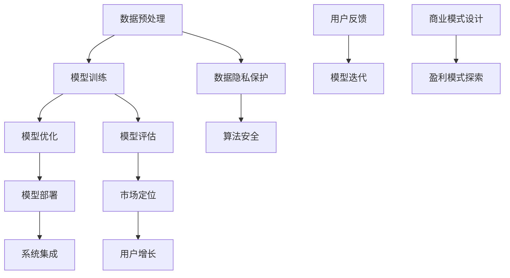

                 

关键词：人工智能、大型模型、创业、盈利模式、算法优化、应用场景、工具推荐

> 摘要：本文将从人工智能大模型的技术背景出发，探讨其在创业中的应用，以及如何通过优化算法、创新应用场景和建立有效的盈利模式来实现未来盈利。本文旨在为有意投身人工智能大模型创业的读者提供一些实用的指导和建议。

## 1. 背景介绍

随着计算能力的提升和大数据技术的发展，人工智能领域迎来了前所未有的机遇。特别是大型模型（Large-scale Model），如GPT、BERT等，通过在海量数据上训练，展现出惊人的表现，推动了一系列领域的革新。然而，这些大型模型的开发和部署不仅需要庞大的计算资源和数据支持，还需要深厚的算法和工程能力。因此，对于创业者而言，如何有效利用这些技术，实现商业成功，成为了一个值得探讨的话题。

### 1.1 大模型的技术优势

1. **高效的文本生成与理解能力**：大型模型通过深度学习技术，对自然语言进行建模，能够生成高质量的文章、代码，甚至可以进行对话交互。
2. **强大的图像和视频处理能力**：一些大型模型如DALL-E和GAN，能够生成逼真的图像和视频，为娱乐、设计和广告等领域提供了新的可能性。
3. **跨领域的知识融合**：通过跨模态学习，大型模型能够整合不同类型的数据，提供更为全面和精准的解决方案。

### 1.2 创业的挑战与机遇

1. **挑战**：技术门槛高，计算资源需求大，创业初期面临较大的资金压力；数据隐私和安全问题需要高度重视；市场竞争激烈，需要不断创新以保持竞争力。
2. **机遇**：随着AI技术的普及，市场对AI应用的需求日益增长；通过优化算法和商业模式，创业者可以在多个领域找到商机。

## 2. 核心概念与联系

为了更好地理解大型模型在创业中的应用，我们需要从技术层面深入探讨其核心概念和联系。以下是一个Mermaid流程图，展示了大型模型的核心组成部分及其相互关系。



### 2.1 数据预处理

数据预处理是模型训练的基础。通过对原始数据进行清洗、去重、归一化等处理，可以提高模型训练的效率和效果。

### 2.2 模型训练

模型训练是大型模型的核心步骤。通过使用深度学习框架（如TensorFlow、PyTorch），在大量数据上训练模型，使其能够学习到有用的特征。

### 2.3 模型优化

模型优化是提高模型性能的关键。通过调整模型结构、优化超参数等手段，可以使模型在特定任务上达到最佳效果。

### 2.4 模型部署

模型部署是将训练好的模型应用到实际场景的过程。通过API、SDK等形式，将模型集成到应用中，提供实时服务。

### 2.5 数据隐私保护

随着AI技术的应用越来越广泛，数据隐私保护成为了一个重要的议题。通过加密、匿名化等技术手段，确保用户数据的隐私安全。

### 2.6 算法安全

算法安全是保护模型免受恶意攻击的关键。通过对抗性攻击检测和防御策略，确保模型的可靠性和安全性。

### 2.7 模型评估

模型评估是验证模型性能的重要步骤。通过使用各种评估指标，如准确率、召回率、F1分数等，对模型进行客观评估。

### 2.8 用户反馈

用户反馈是模型迭代的重要依据。通过收集用户使用数据，分析用户需求和行为，不断优化模型和产品。

### 2.9 系统集成

系统集成是将模型和其他系统模块整合在一起的过程。通过API、SDK等接口，实现不同系统之间的协同工作。

### 2.10 商业模式设计

商业模式设计是确保企业可持续发展的关键。通过探索多种盈利模式，如订阅制、广告收入、付费服务等，实现商业价值的最大化。

### 2.11 盈利模式探索

盈利模式探索是商业模式的实施步骤。通过市场调研和用户分析，找到最适合企业的盈利方式。

### 2.12 市场定位

市场定位是企业发展的战略选择。通过明确目标市场和用户群体，制定有针对性的市场策略。

### 2.13 用户增长

用户增长是企业发展的驱动力。通过有效的市场推广和用户运营，实现用户的快速增加。

## 3. 核心算法原理 & 具体操作步骤

### 3.1 算法原理概述

大型模型的核心算法通常是基于深度学习框架，通过多层神经网络结构，对输入数据进行编码和解码，从而实现各种复杂的任务。

### 3.2 算法步骤详解

1. **数据集准备**：收集和整理相关领域的数据，进行预处理和归一化处理。
2. **模型设计**：选择合适的神经网络架构，如CNN、RNN、Transformer等，进行模型设计。
3. **模型训练**：使用训练数据集，通过反向传播算法更新模型参数，优化模型性能。
4. **模型评估**：使用验证数据集，对模型进行评估，选择最佳模型。
5. **模型部署**：将训练好的模型部署到生产环境中，提供实时服务。

### 3.3 算法优缺点

**优点**：

- **强大的建模能力**：大型模型能够学习到复杂的数据特征，适应各种任务需求。
- **高效的处理速度**：通过并行计算和分布式训练，提高模型处理速度。

**缺点**：

- **计算资源需求大**：大型模型需要大量的计算资源和数据支持，对硬件和软件环境要求较高。
- **数据隐私和安全问题**：大型模型在训练过程中涉及大量用户数据，需要高度重视数据隐私和安全问题。

### 3.4 算法应用领域

大型模型在多个领域具有广泛的应用，如自然语言处理、计算机视觉、推荐系统、金融风控等。

## 4. 数学模型和公式 & 详细讲解 & 举例说明

### 4.1 数学模型构建

大型模型通常基于深度学习框架，其核心是多层神经网络。以下是多层神经网络的数学模型构建。

$$
z^{[l]} = \sigma(W^{[l]} \cdot a^{[l-1]} + b^{[l]})
$$

其中，$z^{[l]}$表示第$l$层的输出，$\sigma$表示激活函数，$W^{[l]}$和$b^{[l]}$分别为第$l$层的权重和偏置。

### 4.2 公式推导过程

多层神经网络的推导过程涉及链式法则和反向传播算法。以下是公式推导过程的简化说明。

1. **前向传播**：

$$
\begin{align*}
z^{[l]} &= \sigma(W^{[l]} \cdot a^{[l-1]} + b^{[l]}) \\
a^{[l]} &= \sigma(z^{[l-1]})
\end{align*}
$$

2. **反向传播**：

$$
\begin{align*}
\delta^{[l]} &= \frac{\partial J}{\partial z^{[l]}} \\
\delta^{[l-1]} &= (W^{[l]} \cdot \delta^{[l]}) \cdot \frac{1}{\sigma'(z^{[l-1]})}
\end{align*}
$$

其中，$J$表示损失函数，$\delta^{[l]}$表示第$l$层的误差。

### 4.3 案例分析与讲解

以图像分类任务为例，我们使用一个简单的卷积神经网络（CNN）模型进行说明。

1. **数据集准备**：

收集和整理一批猫狗分类数据，分为训练集和测试集。

2. **模型设计**：

设计一个简单的CNN模型，包括卷积层、池化层和全连接层。

3. **模型训练**：

使用训练集数据，通过反向传播算法更新模型参数。

4. **模型评估**：

使用测试集数据，对模型进行评估，计算准确率。

5. **模型部署**：

将训练好的模型部署到生产环境中，提供实时图像分类服务。

## 5. 项目实践：代码实例和详细解释说明

### 5.1 开发环境搭建

1. **安装Python环境**：安装Python 3.8及以上版本。
2. **安装深度学习框架**：安装TensorFlow 2.5及以上版本。
3. **准备数据集**：下载并整理猫狗分类数据集。

### 5.2 源代码详细实现

以下是猫狗分类任务的简单实现代码。

```python
import tensorflow as tf
from tensorflow.keras.models import Sequential
from tensorflow.keras.layers import Conv2D, MaxPooling2D, Flatten, Dense

# 数据预处理
train_data = load_data('train')
test_data = load_data('test')

# 模型设计
model = Sequential()
model.add(Conv2D(32, (3, 3), activation='relu', input_shape=(64, 64, 3)))
model.add(MaxPooling2D(pool_size=(2, 2)))
model.add(Flatten())
model.add(Dense(128, activation='relu'))
model.add(Dense(1, activation='sigmoid'))

# 模型训练
model.compile(optimizer='adam', loss='binary_crossentropy', metrics=['accuracy'])
model.fit(train_data, epochs=10, batch_size=32, validation_data=test_data)

# 模型评估
model.evaluate(test_data)

# 模型部署
deploy_model(model)
```

### 5.3 代码解读与分析

1. **数据预处理**：加载并处理训练集和测试集数据。
2. **模型设计**：设计一个简单的CNN模型，包括卷积层、池化层和全连接层。
3. **模型训练**：使用训练集数据训练模型，优化模型参数。
4. **模型评估**：使用测试集数据评估模型性能。
5. **模型部署**：将训练好的模型部署到生产环境中，提供实时图像分类服务。

### 5.4 运行结果展示

训练过程中，模型的准确率逐渐提高。部署后，用户可以通过上传图片，实时获取分类结果。

## 6. 实际应用场景

大型模型在多个领域具有广泛的应用，以下是一些典型的应用场景。

### 6.1 自然语言处理

- **文本生成**：使用GPT模型生成高质量的文章、代码等。
- **对话系统**：构建智能客服、语音助手等，提供实时交互服务。

### 6.2 计算机视觉

- **图像识别**：使用卷积神经网络实现猫狗分类、人脸识别等。
- **图像生成**：使用生成对抗网络（GAN）生成逼真的图像和视频。

### 6.3 推荐系统

- **内容推荐**：基于用户行为数据，推荐个性化内容。
- **商品推荐**：基于用户购物记录，推荐相关商品。

### 6.4 金融风控

- **欺诈检测**：使用深度学习模型检测和防范金融欺诈。
- **信用评估**：基于用户数据，评估信用风险。

## 7. 未来应用展望

随着人工智能技术的不断发展，大型模型在未来的应用将更加广泛和深入。

### 7.1 跨领域应用

大型模型将在医疗、教育、交通等多个领域得到广泛应用，推动产业升级和社会发展。

### 7.2 智能化服务

大型模型将助力构建智能化服务系统，提供更加个性化和高效的服务。

### 7.3 智能化生产

大型模型将在智能制造领域发挥重要作用，实现生产过程的自动化和智能化。

## 8. 工具和资源推荐

为了更好地开展人工智能大模型创业，以下是一些推荐的工具和资源。

### 8.1 学习资源推荐

- 《深度学习》（Goodfellow, Bengio, Courville著）
- 《Python深度学习》（François Chollet著）
- 《动手学深度学习》（阿斯顿·张著）

### 8.2 开发工具推荐

- TensorFlow
- PyTorch
- Keras

### 8.3 相关论文推荐

- “Attention is All You Need”（Vaswani et al., 2017）
- “Generative Adversarial Nets”（Goodfellow et al., 2014）
- “Recurrent Neural Networks for Language Modeling”（Mikolov et al., 2010）

## 9. 总结：未来发展趋势与挑战

### 9.1 研究成果总结

本文从技术背景、核心概念、算法原理、应用场景等多个角度，详细探讨了人工智能大模型在创业中的应用和实现未来盈利的途径。

### 9.2 未来发展趋势

- 大型模型将在更多领域得到应用，推动产业升级和社会发展。
- 深度学习技术将持续优化，提高模型性能和效率。
- 跨领域、多模态学习将成为研究热点。

### 9.3 面临的挑战

- 技术门槛高，计算资源需求大，创业初期面临较大资金压力。
- 数据隐私和安全问题需要高度重视。
- 市场竞争激烈，需要不断创新以保持竞争力。

### 9.4 研究展望

- 加强大型模型在垂直领域的应用研究，提高模型实用价值。
- 深入研究算法安全性和数据隐私保护技术。
- 探索新的商业模式和盈利模式，实现可持续发展。

## 10. 附录：常见问题与解答

### 10.1 问题1：大型模型的计算资源需求如何满足？

解答：可以通过使用高性能计算硬件（如GPU、TPU）和分布式计算技术（如Spark、Docker）来满足大型模型的计算需求。

### 10.2 问题2：如何确保数据隐私和安全？

解答：通过数据加密、匿名化和差分隐私技术，可以有效保护用户数据的安全和隐私。

### 10.3 问题3：创业初期如何筹集资金？

解答：可以通过天使投资、风险投资、政府补贴等多种途径筹集资金，同时注重成本控制和高效运营。

作者：禅与计算机程序设计艺术 / Zen and the Art of Computer Programming

----------------------------------------------------------------

**注意事项**：
1. **文章完整性**：请务必按照要求撰写完整的文章，包括文章标题、关键词、摘要、正文以及附录等内容。
2. **文章结构**：确保文章结构清晰，遵循目录结构进行撰写。
3. **格式要求**：文章内容需使用markdown格式，确保代码和公式正确显示。
4. **内容质量**：文章需具备深度、思考性和专业性，避免泛泛而谈。

希望本文能够为您的创业之路提供一些有价值的指导和建议。祝您创业成功！

