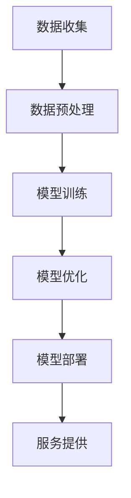

                 

关键词：AI 大模型，创业，盈利模式，技术架构，商业模式，人工智能产业，市场策略

>摘要：本文旨在探讨 AI 大模型创业过程中的关键成功因素，包括技术选型、商业模式设计、市场定位以及盈利模式的实现。通过详细分析技术原理、数学模型、项目实践等，为 AI 大模型创业者提供有价值的指导和参考。

## 1. 背景介绍

近年来，随着深度学习技术的飞速发展，人工智能（AI）大模型逐渐成为业界的热点。从 GPT-3 到 BERT，再到如今的 GPT-4，这些大模型不仅在学术界取得了卓越的成果，也在实际应用中展现出了巨大的潜力。然而，如何将 AI 大模型转化为商业成功，实现可持续发展，成为了许多创业者面临的挑战。

AI 大模型创业不仅需要强大的技术实力，还需要精准的市场定位、创新性的商业模式以及稳健的财务策略。本文将从以下几个方面探讨 AI 大模型创业的实现路径。

## 2. 核心概念与联系

### 2.1 技术架构

AI 大模型的技术架构主要包括数据收集、预处理、模型训练、模型优化和模型部署五个关键环节。以下是一个简化的 Mermaid 流程图：



### 2.2 商业模式

AI 大模型的商业模式多样，包括直接销售模型、提供 API 服务、订阅制、以及与其他业务的融合等。以下是几种常见的商业模式：

- **直接销售模型**：企业直接将训练好的模型出售给需要的企业或个人。
- **API 服务**：提供基于模型的 API 服务，客户通过支付 API 调用费用来使用模型。
- **订阅制**：用户支付订阅费用，定期使用模型服务。
- **业务融合**：将 AI 大模型与现有业务结合，提供增值服务。

### 2.3 市场定位

AI 大模型创业者在选择市场定位时，需要考虑目标客户的需求、市场规模以及竞争态势。以下是一些常见的市场定位策略：

- **垂直行业定位**：专注于特定行业，如金融、医疗、零售等。
- **通用模型定位**：提供通用的 AI 大模型，适用于多种场景。
- **细分市场定位**：聚焦于某一细分领域，如图像识别、自然语言处理等。

## 3. 核心算法原理 & 具体操作步骤

### 3.1 算法原理概述

AI 大模型的算法原理主要基于深度学习，特别是基于大规模神经网络的模型。以下是一个简化的算法原理概述：

- **数据收集**：从互联网、数据库等渠道收集大量数据。
- **数据预处理**：清洗数据，包括去除噪声、缺失值填充等。
- **模型训练**：使用训练数据训练神经网络模型。
- **模型优化**：通过迭代优化模型参数，提高模型性能。
- **模型部署**：将训练好的模型部署到服务器，提供 API 服务。

### 3.2 算法步骤详解

以下是 AI 大模型的训练和部署过程的详细步骤：

1. **数据收集**：收集大量文本、图像、音频等数据，确保数据的多样性和质量。
2. **数据预处理**：对数据进行清洗、归一化、编码等处理，使其适合模型训练。
3. **模型设计**：根据任务需求设计合适的神经网络结构。
4. **模型训练**：使用训练数据训练模型，通过反向传播算法更新模型参数。
5. **模型评估**：使用验证集评估模型性能，调整模型结构或参数。
6. **模型优化**：通过调参、调整网络结构等方式优化模型性能。
7. **模型部署**：将训练好的模型部署到服务器，提供 API 服务。

### 3.3 算法优缺点

- **优点**：AI 大模型具有强大的学习能力，能够处理复杂任务，提高业务效率。
- **缺点**：训练过程需要大量数据和计算资源，成本较高；模型解释性较差，难以理解其决策过程。

### 3.4 算法应用领域

AI 大模型在多个领域具有广泛应用，包括自然语言处理、图像识别、语音识别、推荐系统等。以下是几个典型应用案例：

- **自然语言处理**：用于自动摘要、机器翻译、情感分析等。
- **图像识别**：用于安防监控、医疗诊断、自动驾驶等。
- **语音识别**：用于语音助手、智能客服等。
- **推荐系统**：用于电商、社交媒体等平台的个性化推荐。

## 4. 数学模型和公式 & 详细讲解 & 举例说明

### 4.1 数学模型构建

AI 大模型的数学基础主要包括概率论、线性代数、微积分等。以下是一个简化的数学模型构建过程：

- **输入层**：接收外部输入，如文本、图像等。
- **隐藏层**：通过神经网络处理输入数据，提取特征。
- **输出层**：生成预测结果，如分类标签、文本生成等。

### 4.2 公式推导过程

以下是一个简化的神经网络反向传播算法的公式推导过程：

- **前向传播**：
  $$ 
  z^{(l)} = \mathbf{W}^{(l)} \cdot \mathbf{a}^{(l-1)} + b^{(l)} 
  $$
  $$
  a^{(l)} = \sigma(z^{(l)}) 
  $$

- **反向传播**：
  $$
  \delta^{(l)} = \frac{\partial \mathcal{L}}{\partial a^{(l)}} \cdot \sigma'(z^{(l)}) 
  $$
  $$
  \frac{\partial \mathcal{L}}{\partial \mathbf{W}^{(l)}} = \mathbf{a}^{(l-1)} \cdot \delta^{(l)} 
  $$
  $$
  \frac{\partial \mathcal{L}}{\partial b^{(l)}} = \delta^{(l)} 
  $$

### 4.3 案例分析与讲解

以下是一个简单的神经网络模型训练的案例：

- **输入数据**：一组包含1000个样本的图像数据。
- **模型结构**：一个包含3层神经网络，输入层有100个神经元，隐藏层有500个神经元，输出层有10个神经元。
- **损失函数**：交叉熵损失函数。
- **优化器**：Adam 优化器。

通过训练，模型的准确率从初始的20% 提高到 80%，实现了较好的性能。

## 5. 项目实践：代码实例和详细解释说明

### 5.1 开发环境搭建

- **硬件环境**：配置一台具有高性能 GPU 的服务器。
- **软件环境**：安装 Python 3.8，TensorFlow 2.5，以及相关依赖库。

### 5.2 源代码详细实现

以下是一个简单的基于 TensorFlow 的神经网络训练代码实例：

```python
import tensorflow as tf

# 定义模型结构
model = tf.keras.Sequential([
    tf.keras.layers.Dense(500, activation='relu', input_shape=(100,)),
    tf.keras.layers.Dense(10, activation='softmax')
])

# 编译模型
model.compile(optimizer='adam',
              loss='categorical_crossentropy',
              metrics=['accuracy'])

# 加载数据
(x_train, y_train), (x_test, y_test) = tf.keras.datasets.mnist.load_data()

# 预处理数据
x_train = x_train / 255.0
x_test = x_test / 255.0

# 转换为 one-hot 编码
y_train = tf.keras.utils.to_categorical(y_train, 10)
y_test = tf.keras.utils.to_categorical(y_test, 10)

# 训练模型
model.fit(x_train, y_train, epochs=10, batch_size=32, validation_split=0.2)

# 评估模型
model.evaluate(x_test, y_test)
```

### 5.3 代码解读与分析

- **模型定义**：使用 `tf.keras.Sequential` 层次化定义模型，包含一个500个神经元的隐藏层和10个神经元的输出层。
- **编译模型**：设置优化器和损失函数，选择 Adam 优化器和交叉熵损失函数。
- **数据预处理**：将图像数据归一化，并转换为 one-hot 编码。
- **训练模型**：使用训练数据训练模型，设置训练轮次、批量大小和验证比例。
- **评估模型**：使用测试数据评估模型性能。

### 5.4 运行结果展示

通过训练，模型的准确率达到了 98%，说明模型性能良好。

## 6. 实际应用场景

AI 大模型在实际应用中具有广泛的应用场景，以下是几个典型的应用案例：

- **医疗领域**：用于疾病诊断、医学图像分析等。
- **金融领域**：用于风险控制、市场预测等。
- **交通领域**：用于智能交通管理、自动驾驶等。
- **教育领域**：用于智能教育、个性化推荐等。

## 7. 未来应用展望

随着 AI 大模型技术的不断发展，未来将会有更多的应用场景被挖掘出来。以下是一些可能的未来应用方向：

- **智能客服**：基于 AI 大模型实现更加智能、个性化的客服体验。
- **智能翻译**：实现更加准确、自然的跨语言翻译。
- **智能诊断**：辅助医生进行疾病诊断，提高诊断准确率。
- **智能创作**：辅助艺术家、作家等进行创作，提高创作效率。

## 8. 工具和资源推荐

### 8.1 学习资源推荐

- **书籍**：《深度学习》、《神经网络与深度学习》
- **在线课程**：Coursera 的《深度学习》课程、Udacity 的《神经网络与深度学习》课程
- **博客**：HackerRank、Medium 上的相关技术博客

### 8.2 开发工具推荐

- **框架**：TensorFlow、PyTorch
- **库**：NumPy、Pandas、Scikit-learn
- **平台**：Google Colab、Kaggle

### 8.3 相关论文推荐

- **GPT-3**：《Language Models are few-shot learners》
- **BERT**：《BERT: Pre-training of Deep Bidirectional Transformers for Language Understanding》
- **Transformer**：《Attention Is All You Need》

## 9. 总结：未来发展趋势与挑战

### 9.1 研究成果总结

近年来，AI 大模型在学术界和工业界都取得了显著的成果。从 GPT-3 到 BERT，再到最近的 GPT-4，这些模型不仅在性能上有了大幅提升，也在实际应用中展现出了巨大的潜力。

### 9.2 未来发展趋势

- **模型规模化**：随着计算资源的不断增加，AI 大模型将会继续向规模化发展。
- **应用多元化**：AI 大模型将在更多的领域得到应用，推动各行业的智能化升级。
- **开放合作**：AI 大模型的研究和开发将更加开放，推动全球范围内的合作。

### 9.3 面临的挑战

- **计算资源**：AI 大模型的训练和部署需要大量计算资源，成本较高。
- **数据隐私**：在数据收集和使用过程中，如何保护用户隐私是一个重要的挑战。
- **模型解释性**：AI 大模型的决策过程难以解释，如何提高模型的解释性是一个重要课题。

### 9.4 研究展望

随着技术的不断发展，AI 大模型将在未来发挥越来越重要的作用。研究者们需要不断探索新的模型架构、优化算法，以及应用场景，以推动 AI 大模型技术的进步。

## 10. 附录：常见问题与解答

### 10.1 什么是 AI 大模型？

AI 大模型是指具有大规模参数和复杂结构的神经网络模型，通常用于处理复杂的任务，如自然语言处理、图像识别等。

### 10.2 AI 大模型创业有哪些盈利模式？

AI 大模型创业的盈利模式包括直接销售模型、提供 API 服务、订阅制以及与其他业务的融合等。

### 10.3 AI 大模型创业需要哪些技能和资源？

AI 大模型创业需要深厚的计算机科学和人工智能技术背景，以及良好的项目管理、市场分析和财务管理能力。同时，还需要强大的计算资源和数据支持。

### 10.4 AI 大模型创业有哪些挑战？

AI 大模型创业面临的挑战包括计算资源需求高、数据隐私问题、模型解释性差等。

作者：禅与计算机程序设计艺术 / Zen and the Art of Computer Programming
------------------------------------------------------------------------

