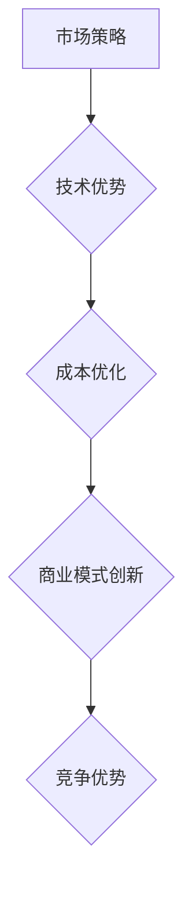

                 

关键词：AI大模型、创业、价格战、市场策略、技术优势、成本优化、商业模式创新

## 摘要

随着人工智能技术的快速发展，大模型成为众多企业竞相追逐的新风口。然而，价格战作为市场竞争的一种常见现象，也在这个领域愈演愈烈。本文将深入探讨AI大模型创业中如何应对未来价格战，从市场策略、技术优势、成本优化和商业模式创新四个方面，为创业者提供实用的指导和建议。

## 1. 背景介绍

### 1.1 AI大模型的发展历程

人工智能（AI）的发展历程可以追溯到20世纪50年代，随着计算机技术的发展，AI的研究逐步深入。从最初的符号主义AI，到基于神经网络的感知机，再到现代的深度学习，AI技术不断革新。近年来，随着计算资源的提升和海量数据的出现，AI大模型逐渐崭露头角，成为推动产业变革的重要力量。

### 1.2 AI大模型在商业中的应用

AI大模型在商业领域的应用日益广泛，包括但不限于自然语言处理、计算机视觉、推荐系统、语音识别等。这些模型能够帮助企业提高效率、降低成本、提升用户体验，进而创造更大的商业价值。然而，随着市场需求的增长，竞争也日益激烈，价格战逐渐成为企业争夺市场份额的一种手段。

## 2. 核心概念与联系

### 2.1 市场策略

市场策略是企业在市场竞争中为获取竞争优势而制定的行动计划。在AI大模型创业中，合理的市场策略能够帮助企业吸引客户、扩大市场份额。

### 2.2 技术优势

技术优势是指企业在技术领域相对于竞争对手所拥有的优势，包括研发能力、技术水平、创新能力等。在AI大模型领域，技术优势是企业核心竞争力的重要体现。

### 2.3 成本优化

成本优化是指企业在生产和运营过程中通过各种手段降低成本、提高效率。在AI大模型创业中，成本优化对于企业的可持续发展具有重要意义。

### 2.4 商业模式创新

商业模式创新是指企业在商业模式层面进行的创新，以创造新的价值获取方式和竞争优势。在AI大模型领域，商业模式创新能够帮助企业实现差异化竞争。

### 2.5 Mermaid 流程图



## 3. 核心算法原理 & 具体操作步骤

### 3.1 算法原理概述

AI大模型的核心算法原理主要包括深度学习、神经网络、数据预处理等。这些算法通过学习大量数据，提取特征并建立模型，从而实现复杂问题的求解。

### 3.2 算法步骤详解

1. 数据收集：收集大量相关领域的数据，确保数据质量和数量。
2. 数据预处理：对数据进行清洗、标准化等处理，以消除噪声和提高数据质量。
3. 模型设计：根据应用场景选择合适的模型架构，如卷积神经网络（CNN）、循环神经网络（RNN）等。
4. 训练模型：使用预处理后的数据训练模型，通过不断迭代优化模型参数。
5. 模型评估：使用验证集对训练好的模型进行评估，确保模型具有良好的性能。
6. 模型部署：将训练好的模型部署到实际应用环境中，供用户使用。

### 3.3 算法优缺点

#### 优点

- **强大的学习能力**：AI大模型通过深度学习能够从大量数据中自动提取特征，具有较强的学习能力。
- **高效的解决方案**：AI大模型能够针对复杂问题提供高效、准确的解决方案。
- **广泛的应用场景**：AI大模型在各个领域都有广泛应用，如自然语言处理、计算机视觉、推荐系统等。

#### 缺点

- **计算资源需求高**：训练AI大模型需要大量的计算资源和时间。
- **数据依赖性强**：AI大模型依赖于大量高质量的数据，数据质量和数量直接影响模型性能。
- **解释性不足**：AI大模型的决策过程较为复杂，难以解释。

### 3.4 算法应用领域

AI大模型在商业领域的应用场景非常广泛，包括但不限于：

- **自然语言处理**：如智能客服、机器翻译、文本分类等。
- **计算机视觉**：如图像识别、目标检测、自动驾驶等。
- **推荐系统**：如个性化推荐、广告投放等。
- **语音识别**：如语音助手、语音翻译等。

## 4. 数学模型和公式 & 详细讲解 & 举例说明

### 4.1 数学模型构建

AI大模型的数学模型主要包括神经网络、深度学习等。以下是一个简单的神经网络模型：

$$
y = \sigma(W \cdot x + b)
$$

其中，$W$ 为权重矩阵，$x$ 为输入向量，$b$ 为偏置项，$\sigma$ 为激活函数，如Sigmoid函数或ReLU函数。

### 4.2 公式推导过程

神经网络的推导过程涉及大量的微积分和线性代数知识。以下是神经网络的一个简单推导过程：

$$
\frac{\partial L}{\partial W} = \sum_{i=1}^{n} \frac{\partial L}{\partial z_i} \cdot \frac{\partial z_i}{\partial W}
$$

其中，$L$ 为损失函数，$z_i$ 为神经元的输出，$W$ 为权重矩阵。

### 4.3 案例分析与讲解

以下是一个简单的案例：使用神经网络进行手写数字识别。

1. 数据收集：收集大量手写数字的图片，并进行标注。
2. 数据预处理：对图片进行缩放、翻转等预处理，以增强模型的泛化能力。
3. 模型设计：设计一个简单的卷积神经网络，包括卷积层、池化层和全连接层。
4. 训练模型：使用预处理后的数据训练模型，通过反向传播算法不断优化模型参数。
5. 模型评估：使用验证集对训练好的模型进行评估，确保模型具有良好的性能。
6. 模型部署：将训练好的模型部署到实际应用环境中，供用户使用。

## 5. 项目实践：代码实例和详细解释说明

### 5.1 开发环境搭建

1. 安装Python环境
2. 安装TensorFlow库
3. 准备数据集

### 5.2 源代码详细实现

以下是一个简单的手写数字识别模型的Python代码：

```python
import tensorflow as tf
from tensorflow.keras import layers

model = tf.keras.Sequential([
    layers.Conv2D(32, (3, 3), activation='relu', input_shape=(28, 28, 1)),
    layers.MaxPooling2D((2, 2)),
    layers.Conv2D(64, (3, 3), activation='relu'),
    layers.MaxPooling2D((2, 2)),
    layers.Flatten(),
    layers.Dense(128, activation='relu'),
    layers.Dense(10, activation='softmax')
])

model.compile(optimizer='adam',
              loss='sparse_categorical_crossentropy',
              metrics=['accuracy'])

model.fit(x_train, y_train, epochs=5)
```

### 5.3 代码解读与分析

上述代码实现了一个简单的卷积神经网络，用于手写数字识别。首先，定义了一个Sequential模型，包含了卷积层、池化层、全连接层等。接着，编译模型，选择适当的优化器和损失函数。最后，使用训练集训练模型，通过多次迭代优化模型参数。

### 5.4 运行结果展示

```python
test_loss, test_acc = model.evaluate(x_test,  y_test, verbose=2)
print('\nTest accuracy:', test_acc)
```

输出结果为测试集上的准确率，表明模型在测试集上的性能。

## 6. 实际应用场景

### 6.1 智能客服

智能客服是AI大模型在商业领域的一个重要应用场景。通过训练大模型，企业可以实现自动化的客服系统，提高客户服务质量，降低人力成本。

### 6.2 个性化推荐

个性化推荐是AI大模型在商业领域的另一个重要应用场景。通过分析用户行为和偏好，大模型能够为用户提供个性化的推荐服务，提高用户满意度和转化率。

### 6.3 自动驾驶

自动驾驶是AI大模型在工业领域的一个重要应用场景。通过训练大模型，企业可以实现自动驾驶车辆的感知、决策和控制，提高交通安全性和效率。

## 7. 未来应用展望

### 7.1 智能医疗

智能医疗是AI大模型未来应用的一个重要方向。通过训练大模型，医生可以更准确地诊断疾病，提高医疗质量，降低医疗成本。

### 7.2 金融科技

金融科技是AI大模型未来应用的一个重要方向。通过训练大模型，金融机构可以实现智能风控、智能投顾等服务，提高金融服务的效率和质量。

### 7.3 教育领域

教育领域是AI大模型未来应用的一个重要方向。通过训练大模型，教育机构可以实现智能教学、智能评价等服务，提高教育质量和效率。

## 8. 工具和资源推荐

### 8.1 学习资源推荐

- 《深度学习》（Goodfellow, Bengio, Courville著）
- 《Python深度学习》（François Chollet著）

### 8.2 开发工具推荐

- TensorFlow
- PyTorch

### 8.3 相关论文推荐

- "Deep Learning: A Brief History, a Roadmap, and an Overview of Current Applications"
- "Bridging the Gap Between Human and Machine Object Recognition: A Multi-Modal Approach"

## 9. 总结：未来发展趋势与挑战

### 9.1 研究成果总结

AI大模型在商业领域取得了显著的研究成果，广泛应用于智能客服、个性化推荐、自动驾驶等领域。然而，随着技术的不断发展，AI大模型仍面临许多挑战。

### 9.2 未来发展趋势

未来，AI大模型将在智能医疗、金融科技、教育领域等进一步拓展应用。同时，模型的可解释性、隐私保护等问题也将成为研究的热点。

### 9.3 面临的挑战

AI大模型在商业领域面临的主要挑战包括数据隐私、模型可解释性、计算资源需求等。解决这些问题需要技术、政策和伦理等多方面的努力。

### 9.4 研究展望

未来，AI大模型研究将继续深入，从技术、应用、伦理等多个角度探索其发展路径。同时，产学研合作将成为推动AI大模型发展的重要力量。

## 附录：常见问题与解答

### 1. 如何快速训练AI大模型？

**答案：** 快速训练AI大模型的方法包括使用预训练模型、迁移学习、多GPU并行训练等。这些方法可以减少训练时间，提高模型性能。

### 2. AI大模型是否具有伦理问题？

**答案：** 是的，AI大模型在应用过程中确实存在伦理问题，如数据隐私、偏见、模型解释性等。解决这些问题需要加强技术、政策和伦理的研究和探讨。

## 作者署名

作者：禅与计算机程序设计艺术 / Zen and the Art of Computer Programming
----------------------------------------------------------------

