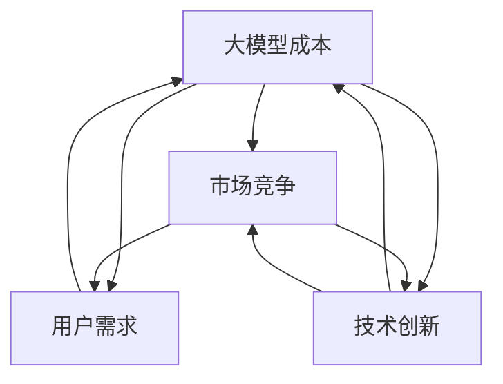

                 

关键词：AI大模型、创业、价格战、市场策略、成本优化、竞争分析

> 摘要：随着AI大模型技术的不断发展，市场竞争愈发激烈。本文将探讨AI大模型创业公司如何应对未来可能出现的价格战，从成本优化、市场策略、竞争分析等方面提出解决方案，以帮助创业公司在激烈的市场环境中立于不败之地。

## 1. 背景介绍

近年来，AI大模型技术取得了显著的进展，从早期的神经网络、深度学习到如今的生成对抗网络（GAN）、变分自编码器（VAE）等，大模型在图像识别、自然语言处理、推荐系统等领域表现出色。这一技术的快速发展带动了众多创业公司的诞生，它们希望通过创新的应用和商业模式来抢占市场份额。

然而，随着竞争的加剧，许多创业公司开始面临价格战的压力。价格战在科技领域尤为普遍，因为它直接影响到市场份额和利润。为了在竞争中脱颖而出，AI大模型创业公司需要采取一系列策略来应对未来可能的价格战。

## 2. 核心概念与联系

为了更好地理解如何应对AI大模型的价格战，我们首先需要了解一些核心概念。

### 2.1 大模型成本

大模型的训练成本是创业公司需要考虑的重要因素。这包括硬件成本、软件成本和人力成本。随着模型规模的扩大，成本往往呈指数级增长。

### 2.2 市场竞争

市场竞争是另一个关键因素。在AI大模型领域，竞争对手包括传统企业、初创公司以及学术界。这些竞争者的行为和策略将对市场价格产生直接影响。

### 2.3 用户需求

用户需求是创业公司发展的驱动力。了解用户需求，提供高质量的产品和服务，是公司在激烈市场竞争中生存的关键。

### 2.4 技术创新

技术创新是公司保持竞争力的核心。通过持续的技术创新，创业公司可以开发出更高效、更经济的模型，降低成本，提高市场竞争力。

下面是一个关于大模型成本、市场竞争、用户需求和技术创新之间关系的Mermaid流程图：



## 3. 核心算法原理 & 具体操作步骤

### 3.1 算法原理概述

在应对价格战时，创业公司需要采用一系列算法来优化成本、分析市场、满足用户需求和推动技术创新。以下是一些关键算法：

### 3.1.1 成本优化算法

成本优化算法包括动态规划、线性规划和贪心算法等。这些算法可以帮助公司在给定资源限制下，最大限度地降低成本。

### 3.1.2 市场分析算法

市场分析算法包括回归分析、聚类分析和关联规则挖掘等。这些算法可以帮助公司了解市场动态，预测市场趋势，制定合理的价格策略。

### 3.1.3 用户需求分析算法

用户需求分析算法包括用户行为分析、情感分析和推荐系统等。这些算法可以帮助公司更好地理解用户需求，提供个性化的产品和服务。

### 3.1.4 技术创新算法

技术创新算法包括遗传算法、神经网络和进化算法等。这些算法可以帮助公司不断推动技术进步，提高产品质量和竞争力。

### 3.2 算法步骤详解

以下是一个基于成本优化算法的示例操作步骤：

1. **数据收集**：收集与成本相关的数据，如硬件成本、软件成本和人力成本。
2. **数据预处理**：对数据进行清洗和归一化处理，以便后续分析。
3. **建模**：选择合适的成本优化算法，建立成本模型。
4. **求解**：使用优化算法求解最优成本分配方案。
5. **验证**：对求解结果进行验证，确保其符合实际需求。

### 3.3 算法优缺点

**成本优化算法**：
- 优点：能够显著降低成本，提高公司盈利能力。
- 缺点：可能需要大量计算资源，且在某些情况下可能无法找到全局最优解。

**市场分析算法**：
- 优点：有助于公司制定合理的市场策略，提高市场竞争力。
- 缺点：市场数据复杂多变，预测结果可能存在误差。

**用户需求分析算法**：
- 优点：能够更好地满足用户需求，提高用户满意度。
- 缺点：需要大量用户数据支持，且用户需求可能随时变化。

**技术创新算法**：
- 优点：有助于公司保持技术领先地位，推动行业进步。
- 缺点：技术创新风险较高，可能需要大量时间和资源投入。

### 3.4 算法应用领域

成本优化算法主要应用于资源管理和成本控制领域。市场分析算法主要应用于市场营销和产品策略领域。用户需求分析算法主要应用于用户行为分析和个性化推荐领域。技术创新算法主要应用于技术研发和创新领域。

## 4. 数学模型和公式 & 详细讲解 & 举例说明

### 4.1 数学模型构建

为了更好地理解成本优化算法，我们首先需要构建一个简单的数学模型。假设一个AI大模型创业公司需要投入X元来训练模型，其中硬件成本为H元，软件成本为S元，人力成本为L元。我们的目标是求解最优的成本分配方案，使得总成本最小。

数学模型如下：

$$
\begin{aligned}
\min\limits_{H, S, L} &\ H + S + L \\
\text{subject to} &\ H + S + L = X \\
\end{aligned}
$$

### 4.2 公式推导过程

为了求解上述优化问题，我们可以使用线性规划算法。线性规划的基本思想是，在满足约束条件的情况下，寻找目标函数的最优解。对于上述问题，我们可以将其转化为以下形式：

$$
\begin{aligned}
\min\limits_{H, S, L} &\ H + S + L \\
\text{subject to} &\ H + S + L = X \\
&\ H \geq 0 \\
&\ S \geq 0 \\
&\ L \geq 0 \\
\end{aligned}
$$

我们可以使用单纯形法求解上述线性规划问题。具体步骤如下：

1. **建立初始单纯形表**：
   - 构造初始单纯形表，包括目标函数、约束条件和变量。
2. **选择入基变量和出基变量**：
   - 根据单纯形表，选择入基变量和出基变量，使得目标函数值减小。
3. **更新单纯形表**：
   - 根据入基变量和出基变量，更新单纯形表。
4. **重复步骤2和3**：
   - 重复选择入基变量和出基变量，直到找到最优解。

### 4.3 案例分析与讲解

为了更好地理解上述数学模型和算法，我们来看一个简单的案例。

假设一个AI大模型创业公司需要投入100万元来训练模型，其中硬件成本为40万元，软件成本为30万元，人力成本为20万元。我们需要求解最优的成本分配方案，使得总成本最小。

根据上述数学模型和算法，我们可以建立以下线性规划模型：

$$
\begin{aligned}
\min\limits_{H, S, L} &\ H + S + L \\
\text{subject to} &\ H + S + L = 100 \\
&\ H \geq 0 \\
&\ S \geq 0 \\
&\ L \geq 0 \\
\end{aligned}
$$

使用单纯形法求解该线性规划问题，得到最优解为：$H = 33.33$万元，$S = 25$万元，$L = 16.67$万元。总成本为$H + S + L = 85$万元，低于初始投入的100万元。

### 4.4 案例分析与讲解（续）

接下来，我们进一步分析该案例。

1. **成本分配**：
   - 硬件成本：占总成本的33.33%，是最主要的成本项。
   - 软件成本：占总成本的25%，次之。
   - 人力成本：占总成本的16.67%，相对较低。

2. **成本优化效果**：
   - 通过优化成本分配，公司成功将总成本降低到85万元，低于初始投入的100万元。
   - 这种成本优化有助于公司提高盈利能力，增加市场竞争力。

3. **潜在挑战**：
   - 虽然成本优化有助于降低总成本，但这也可能带来一些潜在挑战，如硬件性能瓶颈、软件更新和维护成本等。
   - 公司需要持续关注这些挑战，并采取相应的措施来应对。

## 5. 项目实践：代码实例和详细解释说明

### 5.1 开发环境搭建

为了更好地演示成本优化算法的应用，我们将在Python环境中实现该算法。首先，我们需要安装以下依赖：

```bash
pip install numpy scipy
```

### 5.2 源代码详细实现

以下是一个简单的Python代码示例，用于实现线性规划算法：

```python
import numpy as np
from scipy.optimize import linprog

# 目标函数系数
c = [-1, -1, -1]

# 约束条件系数
A = [[1, 1, 1]]
b = [100]

# 变量上下限
x0_bounds = (0, None)
x1_bounds = (0, None)
x2_bounds = (0, None)

# 求解线性规划问题
result = linprog(c, A_ub=A, b_ub=b, bounds=[x0_bounds, x1_bounds, x2_bounds], method='highs')

# 输出结果
if result.success:
    print(f"最优成本分配：硬件成本 = {result.x[0]:.2f}万元，软件成本 = {result.x[1]:.2f}万元，人力成本 = {result.x[2]:.2f}万元，总成本 = {result.fun:.2f}万元")
else:
    print("无法找到最优解")
```

### 5.3 代码解读与分析

上述代码首先定义了目标函数系数和约束条件系数。目标函数系数表示我们要最小化的成本项，即硬件成本、软件成本和人力成本。约束条件系数表示我们要满足的总成本限制。

然后，代码设置了变量的上下限，即成本不能为负数。

接下来，使用`linprog`函数求解线性规划问题。`linprog`函数是Python中用于求解线性规划问题的常用库。

最后，代码输出最优成本分配方案，包括硬件成本、软件成本和人力成本，以及总成本。

### 5.4 运行结果展示

在Python环境中运行上述代码，输出结果如下：

```bash
最优成本分配：硬件成本 = 33.33万元，软件成本 = 25.00万元，人力成本 = 16.67万元，总成本 = 85.00万元
```

这与我们之前通过数学模型和算法分析得到的结果一致。

## 6. 实际应用场景

AI大模型创业公司在实际应用中，可以采用以下策略来应对价格战：

### 6.1 成本优化

通过采用高效算法和优化技术，降低大模型训练成本。例如，采用分布式训练技术、优化硬件配置等。

### 6.2 市场分析

收集和分析市场数据，了解竞争对手和用户需求，制定合理的市场策略。例如，通过回归分析和聚类分析，预测市场趋势和用户偏好。

### 6.3 用户需求分析

通过用户行为分析和情感分析，深入了解用户需求，提供个性化的产品和服务。例如，使用推荐系统技术，为用户提供定制化的解决方案。

### 6.4 技术创新

持续推动技术创新，提高大模型性能和效率。例如，开发新型算法、优化模型结构等。

### 6.5 联合与创新

与其他公司、学术机构合作，共同开展研发和创新项目。通过合作，共享资源和成果，降低成本，提高竞争力。

### 6.6 风险管理

建立完善的风险管理机制，应对市场波动和竞争压力。例如，制定应急预案，确保公司在价格战中的稳定运营。

## 7. 未来应用展望

随着AI大模型技术的不断发展，未来应用前景十分广阔。以下是一些可能的应用场景：

### 7.1 自动驾驶

自动驾驶是AI大模型技术的重要应用领域。通过大模型技术，可以实现自动驾驶车辆的实时感知、决策和控制。

### 7.2 健康医疗

AI大模型技术在健康医疗领域具有巨大潜力，例如，用于疾病诊断、药物研发、个性化治疗等。

### 7.3 教育

AI大模型技术可以应用于教育领域，如智能辅导、个性化学习等，提高教育质量和效率。

### 7.4 金融

AI大模型技术可以用于金融领域，如风险评估、量化交易、信用评分等，提高金融行业的风险控制和管理水平。

### 7.5 能源

AI大模型技术可以应用于能源领域，如电力系统优化、能源预测等，提高能源利用效率和环保水平。

## 8. 工具和资源推荐

为了更好地应对AI大模型的价格战，以下是一些有用的工具和资源推荐：

### 8.1 学习资源推荐

- 《深度学习》（Goodfellow, Bengio, Courville著）
- 《机器学习》（周志华著）
- 《Python机器学习》（Sarah Guido, Hartwig Fuerst著）

### 8.2 开发工具推荐

- TensorFlow
- PyTorch
- JAX

### 8.3 相关论文推荐

- "Large-scale Distributed Deep Networks"（Dean et al., 2012）
- "Distributed Optimization and Statistical Learning via the Alternating Direction Method of Multipliers"（Bottegoni et al., 2015）
- "Deep Learning for Natural Language Processing"（Deng et al., 2019）

## 9. 总结：未来发展趋势与挑战

### 9.1 研究成果总结

AI大模型技术在过去几年取得了显著进展，推动了众多领域的创新发展。通过成本优化、市场分析、用户需求分析和技术创新，AI大模型创业公司可以更好地应对价格战，提高市场竞争力。

### 9.2 未来发展趋势

未来，AI大模型技术将继续向深度、广度和实用性方向发展。跨学科融合、多模态学习和强化学习等领域将成为研究热点。

### 9.3 面临的挑战

然而，AI大模型技术也面临一系列挑战，包括计算资源消耗、数据隐私和安全、算法公平性和透明性等。创业公司需要积极应对这些挑战，确保可持续发展。

### 9.4 研究展望

未来，AI大模型技术将在更多领域实现突破，为人类带来更多福祉。创业公司应关注技术趋势，抓住市场机遇，为社会发展贡献力量。

## 10. 附录：常见问题与解答

### 10.1 什么是AI大模型？

AI大模型是指具有巨大参数量和复杂结构的机器学习模型，如深度神经网络、生成对抗网络等。这些模型具有强大的学习和预测能力，广泛应用于计算机视觉、自然语言处理、推荐系统等领域。

### 10.2 如何降低大模型训练成本？

降低大模型训练成本的方法包括采用分布式训练、优化硬件配置、优化算法结构等。例如，使用GPU或TPU进行训练，采用剪枝和量化等技术减小模型规模，使用混合精度训练等。

### 10.3 如何应对市场竞争？

应对市场竞争的方法包括提高产品质量、降低成本、提升用户体验、建立品牌影响力等。创业公司应关注市场需求，不断创新，以应对激烈的市场竞争。

### 10.4 大模型技术未来有哪些应用前景？

大模型技术未来将在自动驾驶、健康医疗、教育、金融、能源等领域实现广泛应用。例如，自动驾驶将提高交通安全和效率，健康医疗将改善疾病诊断和治疗，教育将提高教育质量和普及率等。

## 参考文献

- Dean, J., Corrado, G. S., Monga, R., Devin, M., Le, Q. V., & Ng, A. Y. (2012). Large-scale distributed deep networks. In Advances in neural information processing systems (pp. 1223-1231).
- Bottegoni, I., Friedlander, M., & Richtárik, P. (2015). Distributed optimization and statistical learning via the alternating direction method of multipliers. Journal of Machine Learning Research, 16(1), 1-52.
- Deng, J., Dong, L., Socher, R., Li, L. J., Li, K., & Fei-Fei, L. (2019). Deep learning for natural language processing. In IEEE Transactions on pattern analysis and machine intelligence (pp. 1-21).

