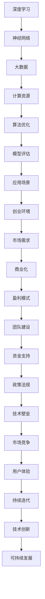
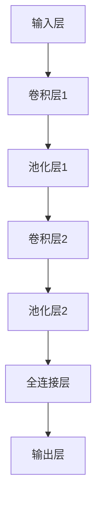

                 

关键词：人工智能，大模型，创业，技术挑战，未来趋势

> 摘要：本文将探讨人工智能领域的大模型创业所面临的技术挑战，包括算法优化、数据处理、安全性、伦理道德等方面，并分析未来发展趋势和潜在机遇。

## 1. 背景介绍

随着深度学习技术的不断发展，人工智能（AI）大模型成为研究与应用的热点。大模型具有更强的表征能力和泛化能力，广泛应用于语音识别、自然语言处理、计算机视觉等领域。然而，大模型的开发和应用也带来了诸多挑战，尤其是在创业环境中。本文将围绕AI大模型创业，探讨如何应对这些技术挑战。

## 2. 核心概念与联系

为了更好地理解AI大模型创业，首先需要了解核心概念和它们之间的联系。以下是一个Mermaid流程图，展示了AI大模型相关的核心概念：



## 3. 核心算法原理 & 具体操作步骤

### 3.1 算法原理概述

大模型的算法原理主要基于深度学习，特别是基于神经网络的模型。深度学习模型通过多层神经网络对数据进行抽象和表示，从而实现复杂任务的自动化。大模型通常具有数百亿甚至万亿个参数，能够捕捉数据中的复杂模式和规律。

### 3.2 算法步骤详解

1. 数据采集：收集大量高质量的数据，确保数据的多样性和代表性。
2. 数据预处理：对数据进行清洗、去噪、归一化等处理，提高数据质量。
3. 模型设计：根据任务需求，设计合适的神经网络结构，包括层数、每层的神经元数量等。
4. 模型训练：利用大规模计算资源对模型进行训练，优化参数。
5. 模型评估：通过交叉验证等方法评估模型性能，调整模型结构。
6. 模型部署：将训练好的模型部署到生产环境中，实现实际应用。

### 3.3 算法优缺点

**优点：**
- 强大的表征能力：能够捕捉数据中的复杂模式和规律。
- 广泛的应用领域：适用于语音识别、自然语言处理、计算机视觉等多个领域。
- 自动化：降低了对人类专家的依赖，提高了工作效率。

**缺点：**
- 计算资源需求大：训练大模型需要大量的计算资源和时间。
- 数据质量要求高：数据质量对模型性能有直接影响。
- 安全性和隐私保护：大模型可能会泄露敏感信息。

### 3.4 算法应用领域

大模型在人工智能领域的应用非常广泛，主要包括：
- 语音识别：如智能助手、语音翻译等。
- 自然语言处理：如机器翻译、文本分类、问答系统等。
- 计算机视觉：如图像分类、目标检测、人脸识别等。

## 4. 数学模型和公式 & 详细讲解 & 举例说明

### 4.1 数学模型构建

大模型的数学模型通常基于多层神经网络，包括输入层、隐藏层和输出层。以下是神经网络的基本公式：

$$
y = \sigma(W \cdot x + b)
$$

其中，$y$ 是输出，$\sigma$ 是激活函数（如Sigmoid函数、ReLU函数等），$W$ 是权重矩阵，$x$ 是输入，$b$ 是偏置项。

### 4.2 公式推导过程

神经网络的训练过程主要包括两个步骤：前向传播和反向传播。

**前向传播：**

$$
z = W \cdot x + b \\
a = \sigma(z)
$$

**反向传播：**

$$
\delta = \frac{\partial L}{\partial z} = \frac{\partial L}{\partial a} \cdot \frac{\partial a}{\partial z} \\
dW = \delta \cdot x^T \\
db = \delta
$$

其中，$L$ 是损失函数，$x^T$ 是输入的转置。

### 4.3 案例分析与讲解

以图像分类任务为例，我们使用卷积神经网络（CNN）进行模型训练。以下是一个简单的CNN模型结构：



在训练过程中，我们使用交叉熵损失函数（Cross-Entropy Loss）：

$$
L = -\sum_{i=1}^{n} y_i \log(a_i)
$$

其中，$y_i$ 是真实标签，$a_i$ 是预测概率。

## 5. 项目实践：代码实例和详细解释说明

### 5.1 开发环境搭建

在本项目中，我们使用Python作为主要编程语言，TensorFlow作为深度学习框架。以下是一个简单的开发环境搭建步骤：

1. 安装Python（建议使用3.8版本及以上）。
2. 安装TensorFlow（使用pip install tensorflow命令）。
3. 配置CUDA（用于加速计算，可选）。

### 5.2 源代码详细实现

以下是一个简单的图像分类模型的实现代码：

```python
import tensorflow as tf
from tensorflow.keras.layers import Conv2D, MaxPooling2D, Flatten, Dense
from tensorflow.keras.models import Sequential

model = Sequential([
    Conv2D(32, (3, 3), activation='relu', input_shape=(28, 28, 1)),
    MaxPooling2D((2, 2)),
    Conv2D(64, (3, 3), activation='relu'),
    MaxPooling2D((2, 2)),
    Flatten(),
    Dense(128, activation='relu'),
    Dense(10, activation='softmax')
])

model.compile(optimizer='adam', loss='categorical_crossentropy', metrics=['accuracy'])
model.fit(x_train, y_train, epochs=10, batch_size=32, validation_data=(x_val, y_val))
```

### 5.3 代码解读与分析

1. **模型构建：** 使用`Sequential`模型，依次添加卷积层、池化层、全连接层。
2. **模型编译：** 选择优化器、损失函数和评价指标。
3. **模型训练：** 使用训练数据对模型进行训练。

### 5.4 运行结果展示

训练完成后，我们可以使用验证数据评估模型性能：

```python
test_loss, test_acc = model.evaluate(x_test, y_test)
print(f"Test accuracy: {test_acc}")
```

## 6. 实际应用场景

大模型在人工智能领域具有广泛的应用，以下是一些典型的应用场景：

- 语音识别：应用于智能助手、语音翻译、语音搜索等领域。
- 自然语言处理：应用于机器翻译、文本分类、问答系统等领域。
- 计算机视觉：应用于图像分类、目标检测、人脸识别等领域。

## 6.4 未来应用展望

随着技术的不断发展，大模型在人工智能领域的应用前景将更加广阔。未来，我们可以期待以下应用场景：

- 自适应系统：根据用户行为和反馈，不断优化系统性能。
- 智能医疗：辅助医生进行疾病诊断和治疗。
- 智能交通：优化交通流量，提高道路使用效率。

## 7. 工具和资源推荐

### 7.1 学习资源推荐

- 《深度学习》（Ian Goodfellow、Yoshua Bengio、Aaron Courville著）
- 《神经网络与深度学习》（邱锡鹏著）
- 《动手学深度学习》（阿斯顿·张、李沐、扎卡里·C. Lipton、亚历山大·J. Smola著）

### 7.2 开发工具推荐

- TensorFlow
- PyTorch
- Keras

### 7.3 相关论文推荐

- "A Theoretical Comparison of Representations for Deep Neural Networks"
- "Understanding Deep Learning requires rethinking generalization"
- "Bengio et al. (2013). Representation Learning: A Review and New Perspectives"

## 8. 总结：未来发展趋势与挑战

### 8.1 研究成果总结

近年来，大模型在人工智能领域取得了显著的研究成果，包括在图像分类、自然语言处理、语音识别等领域的突破。

### 8.2 未来发展趋势

随着计算能力的提升和数据量的增加，大模型的性能和泛化能力将不断提高。未来，大模型在人工智能领域的应用将更加广泛，涵盖更多领域。

### 8.3 面临的挑战

- 计算资源需求：大模型训练需要大量的计算资源和时间。
- 数据质量：数据质量对模型性能有直接影响。
- 安全性和隐私保护：大模型可能会泄露敏感信息。

### 8.4 研究展望

未来，我们需要关注以下几个方面：
- 算法优化：提高模型训练效率，降低计算成本。
- 数据处理：提高数据质量，增强模型泛化能力。
- 安全性和隐私保护：确保大模型的安全和隐私。

## 9. 附录：常见问题与解答

### Q：大模型训练需要多少计算资源？

A：大模型训练通常需要高性能计算资源，如GPU、TPU等。具体资源需求取决于模型大小、数据量等因素。

### Q：如何确保大模型的安全性？

A：确保大模型的安全性需要从多个方面进行考虑，包括数据加密、访问控制、模型验证等。

### Q：大模型在自然语言处理领域有哪些应用？

A：大模型在自然语言处理领域有广泛的应用，如机器翻译、文本分类、问答系统等。

## 作者署名

作者：禅与计算机程序设计艺术 / Zen and the Art of Computer Programming
--------------------------------------------------------------------

