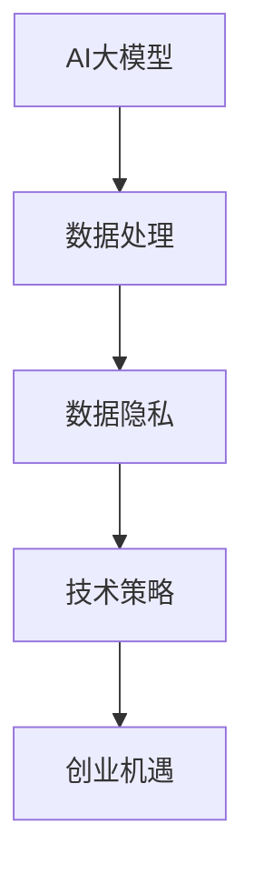

                 

关键词：AI大模型、创业、数据挑战、数据处理、技术策略、未来展望

>摘要：本文从AI大模型的创业视角出发，探讨了在未来数据挑战中的应对策略。通过对核心概念的阐述、算法原理的分析、数学模型的构建以及实际应用场景的展望，为AI大模型创业提供了全面的指导。

## 1. 背景介绍

随着人工智能技术的飞速发展，大模型如BERT、GPT等逐渐成为研究和应用的热点。这些大模型在自然语言处理、图像识别等领域取得了显著成果，展现了强大的潜力。然而，伴随着大模型的应用普及，数据挑战也随之而来。如何应对这些数据挑战，成为AI大模型创业的关键问题。

### 数据挑战

1. **数据质量**：数据质量直接影响模型的性能。噪声、偏差和缺失的数据会导致模型学习效果下降，甚至造成模型过拟合。
2. **数据量**：大模型的训练需要海量数据支持。数据量的不足可能导致模型无法充分学习，影响最终效果。
3. **数据隐私**：数据隐私问题日益突出。如何在确保用户隐私的前提下，有效地利用数据成为亟待解决的问题。
4. **数据处理效率**：大规模数据处理的效率成为瓶颈。如何优化数据处理流程，提高处理速度，是提升模型训练效率的关键。

### 创业机遇

1. **技术创新**：AI大模型为创业者提供了广阔的创新空间。通过不断优化算法、提升数据处理效率，创业者可以在市场中脱颖而出。
2. **市场潜力**：随着AI技术的普及，越来越多的行业和领域需要大模型的支持。这为创业者带来了巨大的市场潜力。
3. **合作机会**：AI大模型创业不仅需要技术突破，还需要与各行业深度合作，共同探索应用场景。

## 2. 核心概念与联系

### AI大模型

AI大模型是指具有数百万甚至数十亿参数的深度神经网络模型。这些模型通过大量的数据进行训练，能够自动从数据中学习复杂的模式和规律。

### 数据处理

数据处理是指对原始数据进行清洗、转换和整合，以便更好地用于模型训练和应用。

### 数据隐私

数据隐私涉及如何保护用户的个人数据，确保数据在处理过程中不被泄露或滥用。

### 技术策略

技术策略是指通过技术创新和优化，提高数据处理效率和模型性能。



## 3. 核心算法原理 & 具体操作步骤

### 3.1 算法原理概述

AI大模型的核心算法是基于深度学习的。深度学习通过多层神经网络对数据进行学习，逐层提取特征，最终实现对数据的理解和预测。

### 3.2 算法步骤详解

1. **数据预处理**：对原始数据进行清洗、去噪、归一化等处理，确保数据质量。
2. **模型构建**：设计神经网络结构，确定层数、神经元数量和激活函数等参数。
3. **模型训练**：使用训练数据对模型进行训练，通过反向传播算法优化模型参数。
4. **模型评估**：使用测试数据对模型进行评估，确定模型的性能。
5. **模型部署**：将训练好的模型部署到实际应用场景中，进行预测和决策。

### 3.3 算法优缺点

- **优点**：大模型具有强大的学习和泛化能力，能够处理复杂数据和任务。
- **缺点**：大模型训练需要大量的数据和计算资源，且容易出现过拟合问题。

### 3.4 算法应用领域

- **自然语言处理**：如文本分类、情感分析、机器翻译等。
- **计算机视觉**：如图像识别、目标检测、图像生成等。
- **推荐系统**：如商品推荐、新闻推荐等。

## 4. 数学模型和公式 & 详细讲解 & 举例说明

### 4.1 数学模型构建

AI大模型的数学模型主要基于深度学习的框架。深度学习通过多层神经网络对数据进行学习，其中每一层都可以看作是一个非线性变换。

### 4.2 公式推导过程

假设我们有一个输入数据集 $X$，每个数据点 $x$ 可以表示为一个向量。我们需要通过神经网络模型 $f$ 对数据 $x$ 进行预测。

$$
f(x) = W_1 \cdot \sigma(W_2 \cdot \sigma(... \cdot \sigma(W_n \cdot x)...) )
$$

其中，$W_1, W_2, ..., W_n$ 是权重矩阵，$\sigma$ 是激活函数，如ReLU、Sigmoid等。

### 4.3 案例分析与讲解

假设我们有一个文本分类任务，需要将文本数据分类为两类。我们可以使用一个简单的神经网络模型进行训练。

1. **数据预处理**：对文本数据进行分词、去停用词等处理，将文本转化为向量表示。
2. **模型构建**：设计一个多层神经网络模型，输入层、隐藏层和输出层。
3. **模型训练**：使用训练数据对模型进行训练，优化模型参数。
4. **模型评估**：使用测试数据对模型进行评估，计算准确率、召回率等指标。

通过这个案例，我们可以看到，数学模型和公式在大模型训练中起着关键作用。通过优化模型参数，我们可以提高模型的性能。

## 5. 项目实践：代码实例和详细解释说明

### 5.1 开发环境搭建

1. **硬件环境**：配置高性能的计算机或GPU。
2. **软件环境**：安装Python、TensorFlow等依赖库。

### 5.2 源代码详细实现

```python
import tensorflow as tf

# 数据预处理
def preprocess_data(data):
    # 省略具体实现
    return processed_data

# 模型构建
def build_model(input_shape):
    model = tf.keras.Sequential([
        tf.keras.layers.Dense(units=128, activation='relu', input_shape=input_shape),
        tf.keras.layers.Dense(units=64, activation='relu'),
        tf.keras.layers.Dense(units=1, activation='sigmoid')
    ])
    return model

# 模型训练
def train_model(model, train_data, train_labels):
    model.compile(optimizer='adam', loss='binary_crossentropy', metrics=['accuracy'])
    model.fit(train_data, train_labels, epochs=10, batch_size=32)
    return model

# 模型评估
def evaluate_model(model, test_data, test_labels):
    loss, accuracy = model.evaluate(test_data, test_labels)
    print(f"Test accuracy: {accuracy:.2f}")
```

### 5.3 代码解读与分析

上述代码实现了一个简单的文本分类模型。首先，我们对数据进行预处理，然后构建神经网络模型，接着使用训练数据进行模型训练，最后使用测试数据进行模型评估。

### 5.4 运行结果展示

```python
# 加载数据
train_data, train_labels = preprocess_data(train_data)
test_data, test_labels = preprocess_data(test_data)

# 构建模型
model = build_model(input_shape)

# 训练模型
model = train_model(model, train_data, train_labels)

# 评估模型
evaluate_model(model, test_data, test_labels)
```

通过运行结果，我们可以看到模型的准确率。

## 6. 实际应用场景

### 6.1 自然语言处理

在自然语言处理领域，大模型可以用于文本分类、情感分析、机器翻译等任务。例如，在社交媒体数据分析中，大模型可以帮助企业了解用户情绪，优化营销策略。

### 6.2 计算机视觉

在计算机视觉领域，大模型可以用于图像识别、目标检测、图像生成等任务。例如，在自动驾驶领域，大模型可以帮助车辆识别道路标志、行人等，提高驾驶安全性。

### 6.3 推荐系统

在推荐系统领域，大模型可以用于用户画像、商品推荐等任务。例如，在电商平台上，大模型可以帮助用户发现潜在感兴趣的商品，提高购物体验。

## 7. 工具和资源推荐

### 7.1 学习资源推荐

1. **书籍**：《深度学习》、《神经网络与深度学习》
2. **在线课程**：Coursera、Udacity、edX等平台上的深度学习课程

### 7.2 开发工具推荐

1. **框架**：TensorFlow、PyTorch
2. **IDE**：Jupyter Notebook、PyCharm

### 7.3 相关论文推荐

1. **《Attention Is All You Need》**：介绍了Transformer模型，为自然语言处理领域带来了重大突破。
2. **《A Theoretical Analysis of the Stability of Deep Learning》**：分析了深度学习的稳定性问题，为优化模型提供了理论支持。

## 8. 总结：未来发展趋势与挑战

### 8.1 研究成果总结

随着AI技术的不断发展，AI大模型在各个领域的应用取得了显著成果。同时，数据处理、数据隐私等技术也在不断进步，为AI大模型创业提供了有力支持。

### 8.2 未来发展趋势

1. **算法创新**：持续优化算法，提升模型性能。
2. **跨领域应用**：探索AI大模型在更多领域的应用，实现跨领域协同创新。
3. **数据协同**：通过数据协同，提高数据质量和处理效率。

### 8.3 面临的挑战

1. **数据处理效率**：提高数据处理效率，降低成本。
2. **数据隐私**：确保数据在处理过程中不被泄露或滥用。
3. **技术人才**：培养更多AI大模型领域的专业人才。

### 8.4 研究展望

未来，AI大模型将继续在各个领域发挥重要作用。通过不断探索和创新，我们有信心应对未来数据挑战，推动AI技术的发展。

## 9. 附录：常见问题与解答

### 9.1 如何处理数据缺失？

**解答**：可以使用数据填补、插值等方法处理数据缺失。在处理缺失数据时，需要根据具体场景和数据特点选择合适的方法。

### 9.2 如何确保数据隐私？

**解答**：可以使用数据加密、匿名化等方法确保数据隐私。在数据处理过程中，需要严格遵守相关法律法规，确保用户隐私得到保护。

### 9.3 如何优化模型训练效率？

**解答**：可以通过以下方法优化模型训练效率：
1. **数据预处理**：提前对数据进行预处理，减少模型训练时间。
2. **并行计算**：使用并行计算技术，提高模型训练速度。
3. **模型压缩**：使用模型压缩技术，降低模型参数数量，提高训练速度。

### 9.4 如何评估模型性能？

**解答**：可以使用以下方法评估模型性能：
1. **准确率**：计算模型预测正确的样本比例。
2. **召回率**：计算模型预测正确的正样本比例。
3. **F1分数**：综合考虑准确率和召回率，计算模型的综合性能。

---

作者：禅与计算机程序设计艺术 / Zen and the Art of Computer Programming
-----------------------------------------------------------------------------<|im_sep|>

