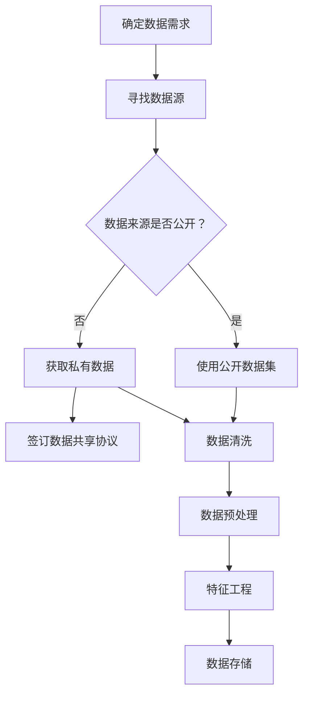
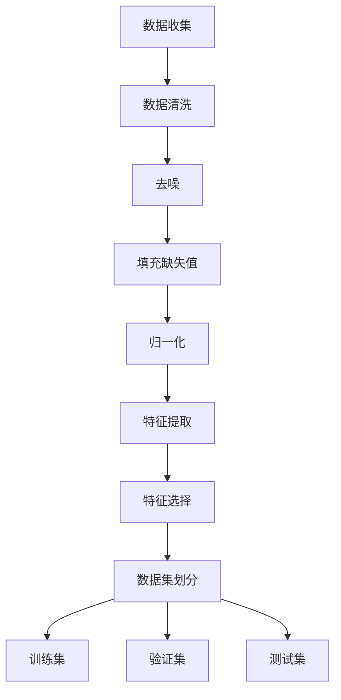
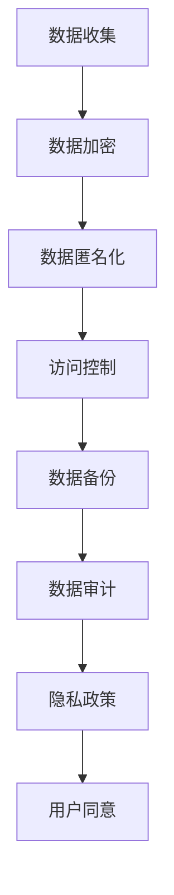

                 

关键词：AI大模型、创业、数据挑战、模型训练、数据处理、数据安全、数据隐私

> 摘要：随着AI大模型的兴起，创业者们面临着前所未有的数据挑战。本文将深入探讨如何应对这些挑战，为AI大模型创业提供实用的策略和建议。

## 1. 背景介绍

近年来，人工智能（AI）技术取得了显著的进展，特别是大模型（如GPT、BERT等）在自然语言处理、计算机视觉等领域展现出了惊人的效果。这些模型通常需要大量的数据进行训练，因此，数据成为AI创业的核心资源。然而，随着数据量的急剧增加，创业者们面临着一系列复杂的数据挑战。

### 数据获取

获取足够的高质量数据是AI大模型训练的基础。对于创业者来说，数据获取可能面临以下问题：

- 数据来源有限：创业者可能无法获得大规模的公开数据集。
- 数据质量差：获取到的数据可能存在噪音、缺失值等问题。
- 数据获取成本高：获取数据需要投入大量的人力、物力和财力。

### 数据处理

数据处理是AI大模型训练的重要环节。数据处理不当可能导致以下问题：

- 数据预处理复杂：需要大量的预处理步骤，如数据清洗、归一化、特征提取等。
- 特征工程困难：选择合适的特征对模型的性能至关重要，但特征工程往往需要大量的实验和经验。
- 数据不平衡：数据集中某些类别的样本数量远多于其他类别，可能导致模型偏斜。

### 数据安全与隐私

数据安全和隐私是AI大模型创业必须考虑的重要因素。数据泄露、滥用或不当处理可能导致以下问题：

- 法律风险：违反数据保护法规，如GDPR、CCPA等。
- 商业损失：数据泄露可能导致商业机密泄露、损失客户信任等。
- 道德问题：对用户隐私的侵犯可能引发社会争议。

### 模型训练与优化

AI大模型训练和优化是创业过程中的关键技术挑战。模型训练可能面临以下问题：

- 计算资源不足：训练大模型需要大量的计算资源，创业者可能无法负担。
- 模型调优复杂：需要不断调整模型参数，寻找最佳配置。
- 模型泛化能力差：模型在训练集上表现良好，但在测试集或现实场景中表现不佳。

## 2. 核心概念与联系

### 数据获取

数据获取是AI大模型创业的基础。以下是数据获取的Mermaid流程图：



### 数据处理

数据处理包括数据清洗、预处理、特征工程等步骤。以下是数据处理过程的Mermaid流程图：



### 数据安全与隐私

数据安全和隐私保护涉及多个方面。以下是数据安全与隐私保护的Mermaid流程图：



## 3. 核心算法原理 & 具体操作步骤

### 3.1 算法原理概述

AI大模型的核心算法通常是基于深度学习，特别是基于神经网络的模型。深度学习通过多层神经网络对数据进行建模，逐层提取特征，最终实现对复杂任务的预测或分类。

### 3.2 算法步骤详解

- 数据获取：使用上述流程图中的方法收集数据。
- 数据预处理：对数据进行清洗、去噪、归一化等预处理操作。
- 特征提取与选择：使用特征提取技术（如卷积神经网络、自编码器等）提取有用特征，并选择对模型性能最有影响的特征。
- 模型训练：使用预处理的训练数据训练神经网络模型，通过反向传播算法调整模型参数。
- 模型调优：通过交叉验证、网格搜索等方法选择最佳模型参数。
- 模型评估：使用验证集和测试集评估模型性能，调整模型以达到最佳效果。

### 3.3 算法优缺点

- 优点：深度学习模型能够自动提取特征，对复杂任务具有强大的建模能力。
- 缺点：需要大量数据和高计算资源，模型调优复杂。

### 3.4 算法应用领域

深度学习算法广泛应用于自然语言处理、计算机视觉、语音识别、推荐系统等多个领域。

## 4. 数学模型和公式 & 详细讲解 & 举例说明

### 4.1 数学模型构建

深度学习模型通常基于多层感知机（MLP）、卷积神经网络（CNN）、循环神经网络（RNN）等结构。以下是MLP模型的数学模型：

$$
\begin{aligned}
\text{输出} &= \text{激活函数}(W_1 \cdot \text{输入} + b_1) \\
\text{权重更新} &= \alpha \cdot (\text{输出} - \text{目标}) \cdot \text{激活函数的导数} \cdot \text{输入}
\end{aligned}
$$

### 4.2 公式推导过程

MLP模型中的权重更新过程基于梯度下降算法。以下是梯度下降算法的推导过程：

$$
\begin{aligned}
\text{损失函数} &= \frac{1}{2} (\text{输出} - \text{目标})^2 \\
\text{梯度} &= \frac{\partial \text{损失函数}}{\partial \text{权重}} \\
\text{权重更新} &= \text{权重} - \alpha \cdot \text{梯度}
\end{aligned}
$$

### 4.3 案例分析与讲解

假设我们有一个简单的二分类问题，数据集包含特征矩阵 $X \in \mathbb{R}^{m \times n}$ 和标签矩阵 $Y \in \mathbb{R}^{m \times 1}$。我们可以使用MLP模型进行分类。

- 数据预处理：对特征矩阵 $X$ 进行归一化处理，将标签矩阵 $Y$ 转换为二进制形式（0或1）。
- 模型训练：初始化模型参数，通过梯度下降算法迭代更新权重。
- 模型评估：使用验证集和测试集评估模型性能，调整模型参数。

## 5. 项目实践：代码实例和详细解释说明

### 5.1 开发环境搭建

- 安装Python 3.8及以上版本。
- 安装TensorFlow 2.5及以上版本。
- 安装NumPy、Pandas等常用库。

### 5.2 源代码详细实现

以下是一个简单的MLP模型训练和评估的Python代码实例：

```python
import tensorflow as tf
import numpy as np
import pandas as pd

# 数据预处理
X = ...  # 特征矩阵
Y = ...  # 标签矩阵
X_normalized = (X - X.mean()) / X.std()
Y_binary = np.where(Y > 0.5, 1, 0)

# 模型定义
model = tf.keras.Sequential([
    tf.keras.layers.Dense(units=1, input_shape=(X_normalized.shape[1],), activation='sigmoid')
])

# 模型编译
model.compile(optimizer='adam', loss='binary_crossentropy', metrics=['accuracy'])

# 模型训练
model.fit(X_normalized, Y_binary, epochs=10, batch_size=32, validation_split=0.2)

# 模型评估
loss, accuracy = model.evaluate(X_normalized, Y_binary)
print(f"Test accuracy: {accuracy:.2f}")
```

### 5.3 代码解读与分析

- 数据预处理：对特征矩阵 $X$ 进行归一化处理，将标签矩阵 $Y$ 转换为二进制形式。
- 模型定义：使用TensorFlow定义一个单层感知机模型，激活函数为sigmoid。
- 模型编译：编译模型，指定优化器和损失函数。
- 模型训练：使用训练数据训练模型，设置训练轮数、批次大小和验证集比例。
- 模型评估：使用测试数据评估模型性能。

## 6. 实际应用场景

AI大模型在多个领域具有广泛的应用，如自然语言处理、计算机视觉、推荐系统等。以下是AI大模型在实际应用场景中的示例：

- 自然语言处理：使用GPT模型进行文本生成、摘要生成、情感分析等。
- 计算机视觉：使用BERT模型进行图像分类、目标检测、图像分割等。
- 推荐系统：使用深度学习模型进行用户行为预测、商品推荐等。

### 6.4 未来应用展望

随着AI大模型技术的不断发展，未来在医疗、金融、教育等领域将有更多创新应用。例如：

- 医疗：使用AI大模型进行疾病预测、诊断辅助等。
- 金融：使用AI大模型进行风险预测、信用评估等。
- 教育：使用AI大模型进行个性化学习、教育诊断等。

## 7. 工具和资源推荐

### 7.1 学习资源推荐

- 《深度学习》（Goodfellow, Bengio, Courville著）
- 《动手学深度学习》（阿斯顿·张著）
- 《神经网络与深度学习》（邱锡鹏著）

### 7.2 开发工具推荐

- TensorFlow
- PyTorch
- Keras

### 7.3 相关论文推荐

- “Attention Is All You Need”（Vaswani等，2017）
- “BERT: Pre-training of Deep Bidirectional Transformers for Language Understanding”（Devlin等，2019）
- “GPT-3: Language Models are few-shot learners”（Brown等，2020）

## 8. 总结：未来发展趋势与挑战

### 8.1 研究成果总结

AI大模型技术在近年来取得了显著进展，成为自然语言处理、计算机视觉等领域的核心技术。随着计算资源和算法的不断发展，AI大模型在更多领域将发挥重要作用。

### 8.2 未来发展趋势

- 计算资源的不断提升将推动更大规模、更复杂AI大模型的训练和应用。
- 跨学科融合将推动AI大模型在医疗、金融、教育等领域的创新应用。
- 开放数据和开源工具的普及将加速AI大模型技术的发展。

### 8.3 面临的挑战

- 数据获取和处理仍然是一个重大挑战，需要更多的数据隐私保护技术和高效的数据处理方法。
- AI大模型的计算资源需求巨大，如何降低计算成本和提高计算效率仍需解决。
- AI大模型的伦理和社会问题需要引起广泛关注和深入研究。

### 8.4 研究展望

未来，AI大模型技术将继续快速发展，并在更多领域取得突破。研究者们需要关注以下方向：

- 开发更高效、更安全的AI大模型算法。
- 探索跨学科的应用场景，推动AI大模型在医疗、金融、教育等领域的创新。
- 加强AI大模型的伦理和社会研究，确保技术发展符合人类价值观。

## 9. 附录：常见问题与解答

### 问题1：如何获取高质量数据？

解答：获取高质量数据可以通过以下方法：

- 利用公开数据集：如ImageNet、CIFAR-10等。
- 与数据供应商合作：获取商业数据或用户生成数据。
- 自行收集数据：通过爬虫、问卷调查等方式获取数据。

### 问题2：如何处理数据不平衡问题？

解答：处理数据不平衡问题可以采用以下方法：

- 过采样：增加少数类别的样本数量。
- 缺失值填充：使用统计学方法填充缺失值。
- 特征工程：选择对模型性能有较大影响的特征。

### 问题3：如何保证数据安全和隐私？

解答：保证数据安全和隐私可以采用以下方法：

- 数据加密：对数据进行加密处理。
- 数据匿名化：去除或模糊化敏感信息。
- 访问控制：限制对数据的访问权限。

## 作者署名

作者：禅与计算机程序设计艺术 / Zen and the Art of Computer Programming
----------------------------------------------------------------

以上就是根据您提供的约束条件和模板，撰写的完整文章。希望对您有所帮助！如果您有任何修改意见或需要进一步调整，请随时告诉我。

