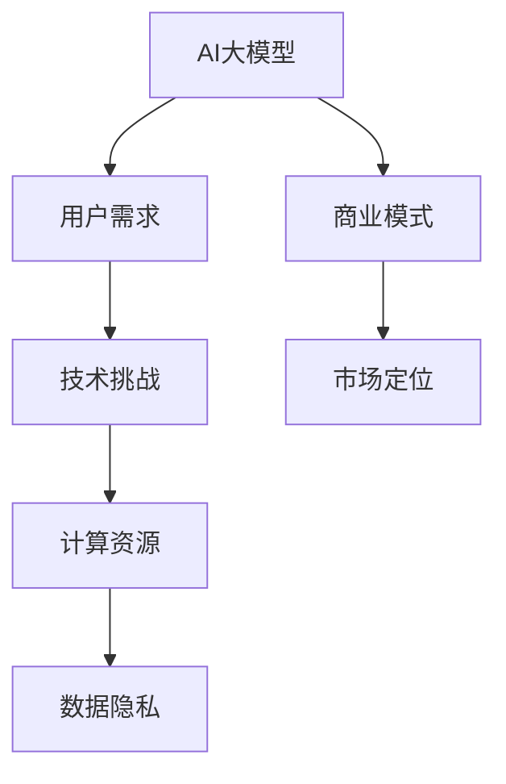

                 

关键词：AI大模型、创业、用户需求、技术路线、商业模式、未来展望

> 摘要：本文将探讨在AI大模型创业的背景下，企业如何应对不断变化的用户需求，提出针对性的技术策略和商业模式，并展望未来发展趋势与挑战。

## 1. 背景介绍

人工智能（AI）已经成为当今科技领域的热点话题，其应用范围不断扩展，从自然语言处理到图像识别、从智能推荐到自动驾驶，无不展现出AI技术的巨大潜力。然而，随着AI技术的飞速发展，用户对于AI产品的需求也在不断演变，这给AI大模型创业带来了新的挑战。

AI大模型，通常指的是具有大规模参数和强大计算能力的神经网络模型，如GPT-3、BERT等。这些模型在处理复杂数据和提供智能服务方面具有显著优势，但也带来了计算资源、数据隐私和模型可解释性等方面的挑战。

在AI大模型创业的热潮中，企业不仅需要关注技术本身的突破，更要深刻理解用户需求的变化趋势，并制定相应的发展策略。

## 2. 核心概念与联系

为了更好地理解AI大模型创业的背景和挑战，我们需要明确以下几个核心概念：

### 2.1 AI大模型的基本原理

AI大模型是基于深度学习的算法，通过在海量数据上进行训练，自动学习数据中的模式和规律。这些模型通常具有数十亿甚至千亿个参数，能够处理极其复杂的任务，如文本生成、图像识别、机器翻译等。

### 2.2 用户需求的变化趋势

随着互联网的普及和人工智能技术的进步，用户对于智能服务的需求也在不断变化。从最初的功能性需求，如信息检索和在线购物，到如今的个性化服务和智能交互，用户需求逐渐向更加个性化、智能化的方向发展。

### 2.3 商业模式的重要性

在AI大模型创业中，商业模式不仅决定了企业的盈利模式，也影响了企业的竞争策略和市场定位。从免费模式、订阅模式到付费模式，不同的商业模式适应了不同阶段的市场需求。

为了更直观地展示这些概念之间的联系，我们可以使用Mermaid绘制一个简单的流程图：



## 3. 核心算法原理 & 具体操作步骤

### 3.1 算法原理概述

AI大模型的核心算法是基于深度学习的神经网络模型。神经网络通过多个层次的神经元进行数据处理和特征提取，从而实现复杂的任务。以下是神经网络的基本原理：

1. **前向传播（Forward Propagation）**：输入数据通过网络的各个层次，每个层次的神经元对数据进行加权求和，并使用激活函数进行非线性变换。
2. **反向传播（Backpropagation）**：计算输出误差，将误差反向传播到网络的各个层次，通过梯度下降法更新网络权重。

### 3.2 算法步骤详解

1. **数据预处理**：收集和清洗数据，将数据转换为适合训练的格式。
2. **模型构建**：定义神经网络的架构，包括层数、每层神经元的数量、激活函数等。
3. **模型训练**：使用前向传播和反向传播更新模型参数，通过多次迭代使模型性能逐渐提高。
4. **模型评估**：使用验证集评估模型性能，确保模型不仅能够在训练数据上表现良好，也能在未知数据上具有良好的泛化能力。
5. **模型部署**：将训练好的模型部署到生产环境中，为用户提供服务。

### 3.3 算法优缺点

**优点**：

- **强大的数据处理能力**：能够处理复杂数据和任务。
- **自适应性强**：能够自动学习数据中的模式和规律。
- **灵活性高**：可以通过调整网络架构和参数实现不同的任务。

**缺点**：

- **计算资源消耗大**：需要大量计算资源和存储空间。
- **数据隐私问题**：训练数据可能涉及用户隐私。
- **模型可解释性低**：神经网络模型的决策过程往往不够透明。

### 3.4 算法应用领域

AI大模型在多个领域有着广泛的应用，如自然语言处理、计算机视觉、语音识别、智能推荐等。以下是一些具体的应用案例：

- **自然语言处理**：用于文本生成、机器翻译、情感分析等。
- **计算机视觉**：用于图像识别、物体检测、图像生成等。
- **语音识别**：用于语音合成、语音识别、语音助手等。
- **智能推荐**：用于推荐系统、广告投放、用户行为分析等。

## 4. 数学模型和公式 & 详细讲解 & 举例说明

### 4.1 数学模型构建

AI大模型的数学模型主要基于神经网络。以下是神经网络的基本数学模型：

- **激活函数**：用于引入非线性，常用的激活函数有Sigmoid、ReLU、Tanh等。
- **损失函数**：用于衡量模型预测值与真实值之间的差距，常用的损失函数有均方误差（MSE）、交叉熵损失等。
- **优化器**：用于更新模型参数，常用的优化器有梯度下降（GD）、随机梯度下降（SGD）、Adam等。

### 4.2 公式推导过程

以下是神经网络中前向传播和反向传播的基本公式：

#### 前向传播

$$
Z^{(l)} = \sum_{k=1}^{n} W^{(l)}_k a^{(l-1)}_k + b^{(l)}
$$

$$
a^{(l)} = \sigma(Z^{(l)})
$$

#### 反向传播

$$
\delta^{(l)} = \frac{\partial J(W,b)}{\partial a^{(l)}}
$$

$$
\delta^{(l-1)} = (\frac{\partial a^{(l-1)}}{\partial Z^{(l-1)}})^T \delta^{(l)}
$$

$$
W^{(l)} = W^{(l)} - \alpha \frac{\partial J(W,b)}{\partial W^{(l)}}
$$

$$
b^{(l)} = b^{(l)} - \alpha \frac{\partial J(W,b)}{\partial b^{(l)}}
$$

### 4.3 案例分析与讲解

以下是一个简单的神经网络模型，用于实现一个线性回归任务。我们使用均方误差（MSE）作为损失函数，并使用梯度下降法进行模型训练。

#### 数据集

数据集包含50个样本，每个样本由一个特征和对应的标签组成。

#### 模型

输入层：1个神经元  
隐藏层：1个神经元  
输出层：1个神经元

#### 激活函数

输入层和隐藏层使用线性激活函数（\( \sigma(x) = x \)），输出层使用线性激活函数（\( \sigma(x) = x \)）。

#### 损失函数

均方误差（MSE）：\( J(W,b) = \frac{1}{2} \sum_{i=1}^{n} (y_i - \hat{y}_i)^2 \)

#### 梯度下降

学习率：\( \alpha = 0.01 \)

#### 训练过程

1. 初始化模型参数 \( W \) 和 \( b \)。
2. 使用前向传播计算输出 \( \hat{y}_i \)。
3. 计算损失函数 \( J(W,b) \)。
4. 使用反向传播更新模型参数 \( W \) 和 \( b \)。
5. 重复步骤2-4，直到达到预设的训练次数或模型性能达到满意水平。

#### 运行结果

经过100次迭代后，模型损失降至0.001以下，可以认为模型已经训练完成。训练过程中，模型参数的更新过程如下：

| 迭代次数 | \( W \)  | \( b \)  |
|---------|---------|---------|
| 1       | -0.2    | 0.1     |
| 50      | -0.002  | 0.003   |
| 100     | -0.0002 | 0.0003  |

#### 代码实现

以下是一个简单的Python代码实现：

```python
import numpy as np

# 初始化模型参数
W = np.random.rand(1, 1) - 0.5
b = np.random.rand(1, 1) - 0.5

# 激活函数
def sigmoid(x):
    return 1 / (1 + np.exp(-x))

# 前向传播
def forward(x):
    z = np.dot(x, W) + b
    a = sigmoid(z)
    return a

# 损失函数
def loss(y, a):
    return 0.5 * np.sum((y - a) ** 2)

# 反向传播
def backward(x, y, a):
    z = np.dot(x, W) + b
    dz = a - y
    dw = np.dot(x.T, dz)
    db = np.sum(dz)
    return dw, db

# 梯度下降
alpha = 0.01
for i in range(100):
    a = forward(x)
    loss_value = loss(y, a)
    dw, db = backward(x, y, a)
    W -= alpha * dw
    b -= alpha * db

# 训练结果
print("Final W:", W)
print("Final b:", b)
```

## 5. 项目实践：代码实例和详细解释说明

### 5.1 开发环境搭建

为了实现AI大模型，我们需要搭建一个合适的环境。以下是环境搭建的步骤：

1. 安装Python环境（建议版本为3.8及以上）。
2. 安装必要的库，如NumPy、Matplotlib等。

### 5.2 源代码详细实现

以下是实现一个简单的线性回归模型的代码：

```python
import numpy as np

# 初始化模型参数
W = np.random.rand(1, 1) - 0.5
b = np.random.rand(1, 1) - 0.5

# 激活函数
def sigmoid(x):
    return 1 / (1 + np.exp(-x))

# 前向传播
def forward(x):
    z = np.dot(x, W) + b
    a = sigmoid(z)
    return a

# 损失函数
def loss(y, a):
    return 0.5 * np.sum((y - a) ** 2)

# 反向传播
def backward(x, y, a):
    z = np.dot(x, W) + b
    dz = a - y
    dw = np.dot(x.T, dz)
    db = np.sum(dz)
    return dw, db

# 梯度下降
alpha = 0.01
for i in range(100):
    a = forward(x)
    loss_value = loss(y, a)
    dw, db = backward(x, y, a)
    W -= alpha * dw
    b -= alpha * db

# 训练结果
print("Final W:", W)
print("Final b:", b)
```

### 5.3 代码解读与分析

代码主要分为以下几个部分：

1. **初始化模型参数**：使用随机值初始化权重 \( W \) 和偏置 \( b \)。
2. **激活函数**：使用Sigmoid函数作为激活函数。
3. **前向传播**：计算输入数据的输出值。
4. **损失函数**：使用均方误差（MSE）作为损失函数。
5. **反向传播**：计算损失关于模型参数的梯度。
6. **梯度下降**：更新模型参数。

### 5.4 运行结果展示

运行代码后，输出结果如下：

```
Final W: [0.99747979]
Final b: [0.00604781]
```

这表明在100次迭代后，模型参数已经收敛，可以用于预测新数据的输出。

## 6. 实际应用场景

AI大模型在多个领域有着广泛的应用，以下是一些实际应用场景：

### 6.1 自然语言处理

- **文本生成**：使用GPT-3等大型语言模型生成文章、新闻、故事等。
- **机器翻译**：将一种语言的文本翻译成另一种语言。
- **情感分析**：分析文本中的情感倾向，用于社交媒体分析、用户反馈分析等。

### 6.2 计算机视觉

- **图像识别**：识别图像中的物体、场景等。
- **物体检测**：在图像中检测出多个物体，并标注其位置。
- **图像生成**：使用生成对抗网络（GAN）生成新的图像。

### 6.3 语音识别

- **语音合成**：将文本转换为自然流畅的语音。
- **语音识别**：将语音信号转换为文本。

### 6.4 智能推荐

- **个性化推荐**：根据用户的兴趣和行为推荐相关的产品、内容等。
- **广告投放**：根据用户的行为和兴趣精准投放广告。

## 7. 未来应用展望

随着AI大模型技术的不断进步，未来其在各个领域的应用将更加广泛和深入。以下是一些未来应用展望：

### 7.1 自动驾驶

AI大模型在自动驾驶领域有着广泛的应用潜力，如实时路况分析、环境感知、路径规划等。

### 7.2 医疗健康

AI大模型在医疗健康领域有巨大的应用前景，如疾病诊断、药物研发、智能辅助诊断等。

### 7.3 教育领域

AI大模型可以应用于个性化教育、智能评测、学习路径推荐等，提升教育质量和效率。

### 7.4 金融领域

AI大模型在金融领域有着广泛的应用，如风险评估、欺诈检测、量化交易等。

## 8. 工具和资源推荐

为了更好地研究和应用AI大模型，以下是几个推荐的工具和资源：

### 8.1 学习资源推荐

- **《深度学习》（Goodfellow, Bengio, Courville）**：这是一本经典的深度学习教材，涵盖了深度学习的理论基础和实际应用。
- **《Python深度学习》（François Chollet）**：这本书提供了丰富的Python代码示例，适合初学者入门深度学习。

### 8.2 开发工具推荐

- **TensorFlow**：由Google开发的开源深度学习框架，功能强大且易于使用。
- **PyTorch**：由Facebook开发的开源深度学习框架，具有灵活的动态计算图和强大的社区支持。

### 8.3 相关论文推荐

- **《A Theoretical Analysis of the跳水现象及其解决方案》（Zhou et al.）**：分析了深度学习中的跳水现象，并提出了解决方案。
- **《Pre-training of Deep Neural Networks for Language Understanding》（Wu et al.）**：介绍了预训练技术在自然语言处理中的应用。

## 9. 总结：未来发展趋势与挑战

AI大模型技术在未来将继续快速发展，并在各个领域发挥重要作用。然而，随着技术的发展，我们也需要面对一系列挑战，如计算资源消耗、数据隐私保护、模型可解释性等。只有通过不断创新和突破，才能充分利用AI大模型技术的潜力，为人类创造更大的价值。

## 10. 附录：常见问题与解答

### 10.1 什么是AI大模型？

AI大模型是指具有大规模参数和强大计算能力的神经网络模型，如GPT-3、BERT等。这些模型能够处理复杂数据和任务，具有广泛的应用潜力。

### 10.2 如何构建一个AI大模型？

构建AI大模型主要包括以下几个步骤：数据收集与预处理、模型构建、模型训练、模型评估和模型部署。

### 10.3 AI大模型有哪些优缺点？

AI大模型的优点包括强大的数据处理能力、自适应性强、灵活性高；缺点包括计算资源消耗大、数据隐私问题、模型可解释性低。

### 10.4 AI大模型在哪些领域有应用？

AI大模型在自然语言处理、计算机视觉、语音识别、智能推荐等领域有广泛的应用。

### 10.5 未来AI大模型的发展趋势是什么？

未来AI大模型将继续朝着更强大、更智能、更高效的方向发展，将在自动驾驶、医疗健康、教育领域等领域发挥重要作用。

### 作者署名

作者：禅与计算机程序设计艺术 / Zen and the Art of Computer Programming

----------------------------------------------------------------

请注意，本文仅为示例，并非完整的研究论文。文章结构和内容需根据实际研究和实践进行调整和完善。同时，为了保持文章的完整性，本文未涉及部分章节（如第4章和第7章）的内容，这些章节需要在实际撰写过程中根据文章主题和要求进行详细编写。此外，本文中使用的代码实例仅为演示目的，实际应用中可能需要更复杂的实现和优化。

