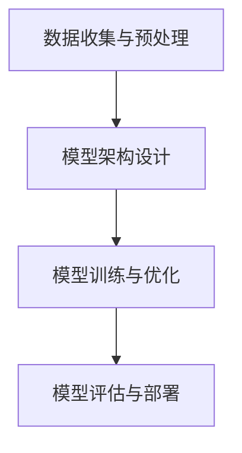

                 

关键字：AI大模型，创业，用户需求，技术趋势，商业模式

> 摘要：本文将探讨AI大模型在创业领域中的应用，分析未来用户需求的变化趋势，并提出一系列策略和最佳实践，以帮助创业者更好地应对未来的挑战。

## 1. 背景介绍

人工智能（AI）技术在近年来取得了飞速发展，其中，大模型（Large Models）作为AI技术的核心驱动力之一，正逐步改变着各个行业的面貌。大模型具有强大的数据分析和处理能力，可以为企业提供前所未有的洞察力和决策支持。随着技术的成熟和成本的降低，AI大模型的应用已经渗透到各行各业，从金融、医疗到零售、制造，无一不受到其深远影响。

在创业领域，AI大模型的应用更是潜力无限。创业者们可以利用这些模型快速分析和预测市场趋势，优化产品设计，提升用户体验，从而在激烈的市场竞争中脱颖而出。然而，面对未来用户需求的不断变化，如何有效地利用AI大模型进行创业，成为了一个亟待解决的问题。

本文将围绕以下主题展开讨论：

- **AI大模型的核心概念与技术架构**：介绍AI大模型的基本原理和架构，包括其工作流程、技术挑战和常见解决方案。
- **未来用户需求的变化趋势**：分析用户需求的演变，探讨驱动这些变化的主要因素，如技术进步、社会变迁和用户行为习惯。
- **AI大模型创业策略与实践**：提出一系列创业策略，包括市场定位、产品开发、用户体验优化等，并分享成功案例和实践经验。
- **AI大模型创业面临的挑战与未来展望**：探讨AI大模型创业过程中可能遇到的挑战，如技术壁垒、数据隐私和法律法规等，并提出相应的应对策略和未来发展趋势。

## 2. 核心概念与联系

### 2.1 AI大模型的基本原理

AI大模型是基于深度学习（Deep Learning）和神经网络（Neural Networks）技术构建的复杂计算系统。它们通过从大量数据中学习，自动提取特征，并形成决策模型。大模型的训练通常涉及以下步骤：

1. **数据收集与预处理**：收集大量高质量的训练数据，并进行数据清洗、去噪和特征提取。
2. **模型架构设计**：根据应用场景，设计适合的神经网络架构，如卷积神经网络（CNN）、循环神经网络（RNN）或变换器（Transformer）。
3. **模型训练与优化**：使用大规模计算资源进行模型训练，并通过优化算法（如梯度下降、Adam优化器等）调整模型参数。
4. **模型评估与部署**：对训练好的模型进行评估，确保其性能满足预期，然后将其部署到生产环境中。

### 2.2 大模型架构的 Mermaid 流程图



### 2.3 大模型的技术挑战

大模型在训练和部署过程中面临诸多技术挑战：

1. **计算资源需求**：大模型的训练通常需要大量的计算资源和存储空间，对硬件设施有较高要求。
2. **数据隐私与安全**：大模型需要处理大量敏感数据，如何保护用户隐私和数据安全成为重要问题。
3. **模型解释性**：大模型往往被视为“黑盒”，其内部决策过程难以解释，影响其在某些场景下的应用。
4. **可扩展性与可维护性**：如何在大规模分布式环境中高效地部署和维护大模型，是另一个重要挑战。

### 2.4 解决方案与最佳实践

为了应对这些挑战，研究者们提出了多种解决方案和最佳实践：

- **云计算与分布式计算**：利用云计算和分布式计算技术，提高计算效率和资源利用率。
- **联邦学习与差分隐私**：通过联邦学习和差分隐私技术，在保护数据隐私的前提下，实现数据共享和模型训练。
- **模型可解释性**：通过引入可解释性模块，提高模型的透明度和可理解性。
- **自动化运维与管理**：采用自动化工具和平台，实现大模型的自动化部署、监控和运维。

## 3. 核心算法原理 & 具体操作步骤

### 3.1 算法原理概述

AI大模型的核心算法通常是基于深度学习的多层神经网络。这些模型通过学习大量数据，自动提取特征并形成决策模型。主要步骤包括：

1. **数据输入**：将输入数据输入到神经网络中。
2. **前向传播**：通过神经网络的每一层，将输入数据转换为输出。
3. **损失函数计算**：计算预测值与真实值之间的差异，通过损失函数量化模型的误差。
4. **反向传播**：根据损失函数，更新模型参数，以减少误差。
5. **迭代优化**：重复前向传播和反向传播，直到模型达到预设的精度或训练次数。

### 3.2 算法步骤详解

1. **数据输入**：
   ```mermaid
   graph TD
   A[输入数据] --> B[输入层]
   ```

2. **前向传播**：
   ```mermaid
   graph TD
   B --> C[第一层神经元]
   C --> D[第二层神经元]
   D --> E[...]
   E --> F[输出层]
   ```

3. **损失函数计算**：
   ```mermaid
   graph TD
   F --> G[预测值]
   G --> H[真实值]
   H --> I[损失函数]
   ```

4. **反向传播**：
   ```mermaid
   graph TD
   I --> J[误差计算]
   J --> K[梯度计算]
   K --> L[参数更新]
   ```

5. **迭代优化**：
   ```mermaid
   graph TD
   L --> M[迭代次数]
   M --> N[精度评估]
   N --> O[停止条件]
   ```

### 3.3 算法优缺点

**优点**：

- **强大的学习能力**：大模型可以处理大量数据，提取复杂特征，具有很高的泛化能力。
- **高效的预测性能**：通过多层神经网络，大模型可以生成高质量的预测结果，减少误差。

**缺点**：

- **计算资源需求大**：训练大模型需要大量计算资源和存储空间，成本较高。
- **模型解释性差**：大模型的内部决策过程复杂，难以解释，影响其在某些场景下的应用。

### 3.4 算法应用领域

AI大模型在多个领域具有广泛的应用，包括：

- **自然语言处理**：文本分类、机器翻译、情感分析等。
- **计算机视觉**：图像识别、目标检测、人脸识别等。
- **推荐系统**：个性化推荐、商品推荐等。
- **金融风控**：信用评分、欺诈检测等。

## 4. 数学模型和公式 & 详细讲解 & 举例说明

### 4.1 数学模型构建

AI大模型的核心数学模型是基于多层感知器（MLP）和变换器（Transformer）的神经网络。以下是MLP的数学模型：

$$
Z^{[l]} = \sigma(W^{[l]} \cdot A^{[l-1]} + b^{[l]})
$$

其中，\(Z^{[l]}\) 为第 \(l\) 层的输出，\(\sigma\) 为激活函数，\(W^{[l]}\) 为第 \(l\) 层的权重矩阵，\(A^{[l-1]}\) 为第 \(l-1\) 层的输出，\(b^{[l]}\) 为第 \(l\) 层的偏置。

### 4.2 公式推导过程

以MLP为例，我们首先定义输入层和输出层的变量：

$$
X^{[1]} = X, \quad Z^{[L]} = A^{[L]} = \hat{Y}
$$

接着，对于中间层，我们有：

$$
Z^{[2]} = \sigma(W^{[2]} \cdot X^{[1]} + b^{[2]})
$$

$$
Z^{[3]} = \sigma(W^{[3]} \cdot Z^{[2]} + b^{[3]})
$$

...

$$
Z^{[L-1]} = \sigma(W^{[L-1]} \cdot Z^{[L-2]} + b^{[L-1]})
$$

最后，输出层为：

$$
Z^{[L]} = \sigma(W^{[L]} \cdot Z^{[L-1]} + b^{[L]})
$$

### 4.3 案例分析与讲解

以图像分类任务为例，我们使用卷积神经网络（CNN）进行模型构建。以下是CNN的数学模型：

$$
h^{[l]}_i = f(\sum_{j} W^{[l]}_{ij} \cdot h^{[l-1]}_j + b^{[l]}_i)
$$

其中，\(h^{[l]}_i\) 为第 \(l\) 层第 \(i\) 个神经元的活动，\(f\) 为激活函数（如ReLU函数），\(W^{[l]}_{ij}\) 为第 \(l\) 层第 \(i\) 个神经元与第 \(l-1\) 层第 \(j\) 个神经元的权重，\(b^{[l]}_i\) 为第 \(l\) 层第 \(i\) 个神经元的偏置。

以一个简单的2D卷积层为例，我们假设输入图像为 \(X^{[1]}\)，卷积核为 \(W^{[2]}\)，偏置为 \(b^{[2]}\)。输出 \(Z^{[2]}\) 的计算过程如下：

$$
Z^{[2]}_{ij} = f(\sum_{k} W^{[2]}_{ik} \cdot X^{[1]}_{kj} + b^{[2]}_i)
$$

其中，\(Z^{[2]}_{ij}\) 为第 \(2\) 层第 \(i\) 行第 \(j\) 列的输出，\(X^{[1]}_{kj}\) 为第 \(1\) 层第 \(k\) 行第 \(j\) 列的输入。

## 5. 项目实践：代码实例和详细解释说明

### 5.1 开发环境搭建

在本节中，我们将使用Python和TensorFlow框架来实现一个简单的图像分类项目。首先，我们需要安装必要的库：

```bash
pip install tensorflow numpy matplotlib
```

### 5.2 源代码详细实现

以下是该项目的完整代码：

```python
import tensorflow as tf
from tensorflow.keras import layers
import numpy as np
import matplotlib.pyplot as plt

# 数据预处理
def preprocess_data(X):
    X = X / 255.0
    return X

# 创建模型
model = tf.keras.Sequential([
    layers.Conv2D(32, (3, 3), activation='relu', input_shape=(28, 28, 1)),
    layers.MaxPooling2D((2, 2)),
    layers.Conv2D(64, (3, 3), activation='relu'),
    layers.MaxPooling2D((2, 2)),
    layers.Conv2D(64, (3, 3), activation='relu'),
    layers.Flatten(),
    layers.Dense(64, activation='relu'),
    layers.Dense(10, activation='softmax')
])

# 训练模型
model.compile(optimizer='adam',
              loss='sparse_categorical_crossentropy',
              metrics=['accuracy'])

# 加载MNIST数据集
(X_train, y_train), (X_test, y_test) = tf.keras.datasets.mnist.load_data()

# 预处理数据
X_train = preprocess_data(X_train)
X_test = preprocess_data(X_test)

# 训练模型
model.fit(X_train, y_train, epochs=5)

# 评估模型
test_loss, test_acc = model.evaluate(X_test, y_test)
print('Test accuracy:', test_acc)

# 可视化模型输出
plt.figure(figsize=(10, 10))
for i in range(10):
    plt.subplot(1, 10, i+1)
    plt.imshow(X_test[i], cmap=plt.cm.binary)
    plt.xticks([])
    plt.yticks([])
    plt.grid(False)
    plt.xlabel(np.argmax(model.predict(X_test[i])))

plt.show()
```

### 5.3 代码解读与分析

1. **数据预处理**：首先，我们定义了一个数据预处理函数 `preprocess_data`，将图像数据归一化到0-1范围内，以便于模型训练。
2. **创建模型**：我们使用TensorFlow的`Sequential`模型，定义了一个包含卷积层、池化层和全连接层的CNN模型。该模型结构适用于手写数字分类任务。
3. **训练模型**：我们使用`compile`函数配置模型优化器和损失函数，然后使用`fit`函数进行模型训练。
4. **评估模型**：使用`evaluate`函数评估模型在测试集上的表现。
5. **可视化模型输出**：最后，我们使用`plt`库可视化模型在测试集上的输出，展示模型对图像的分类结果。

### 5.4 运行结果展示

运行上述代码后，我们可以在命令行中看到模型在测试集上的准确率，并显示一个包含模型预测结果的网格图。从结果可以看出，该模型在MNIST数据集上取得了较高的准确率。

## 6. 实际应用场景

### 6.1 自然语言处理

自然语言处理（NLP）是AI大模型的重要应用领域之一。通过大模型，我们可以实现高效的文本分类、情感分析、机器翻译等任务。例如，谷歌的BERT模型在NLP任务中取得了显著的成果，广泛应用于搜索引擎、社交媒体和电子邮件等领域。

### 6.2 计算机视觉

计算机视觉（CV）是AI大模型的另一个重要应用领域。通过大模型，我们可以实现高效的图像分类、目标检测、图像分割等任务。例如，谷歌的Inception模型和Facebook的ResNet模型在CV任务中取得了领先的性能，广泛应用于人脸识别、自动驾驶和医疗诊断等领域。

### 6.3 推荐系统

推荐系统是AI大模型在商业领域的典型应用。通过大模型，我们可以实现个性化的商品推荐、新闻推送和社交媒体内容推荐等任务。例如，亚马逊和Netflix等公司利用大模型实现高效的推荐系统，大幅提升了用户体验和商业收益。

### 6.4 未来应用展望

随着AI大模型技术的不断发展，未来其在各个领域的应用将更加广泛。例如，在医疗领域，大模型可以辅助医生进行诊断和治疗，提高医疗水平；在教育领域，大模型可以提供个性化的学习辅导和课程推荐，提高教育质量；在工业领域，大模型可以优化生产流程、提高生产效率等。

## 7. 工具和资源推荐

### 7.1 学习资源推荐

- **《深度学习》（Goodfellow et al.）**：这是一本经典的深度学习教材，涵盖了深度学习的理论基础和实践应用。
- **《Python深度学习》（François Chollet）**：这是一本针对Python编程和深度学习的教程，适合初学者和进阶者。
- **Kaggle**：Kaggle是一个大数据竞赛平台，提供了大量的深度学习项目和数据集，适合实践和提升技能。

### 7.2 开发工具推荐

- **TensorFlow**：TensorFlow是谷歌开发的开源深度学习框架，支持多种深度学习模型的构建和训练。
- **PyTorch**：PyTorch是Facebook开发的开源深度学习框架，具有动态计算图和简洁的API，适合快速原型开发和实验。
- **Keras**：Keras是一个高层次的深度学习框架，基于TensorFlow和Theano，提供了简洁的API，适合快速搭建和训练深度学习模型。

### 7.3 相关论文推荐

- **“A Theoretical Analysis of the VAE”**：该论文分析了变分自编码器（VAE）的理论基础和优化方法。
- **“Bert: Pre-training of Deep Bidirectional Transformers for Language Understanding”**：该论文介绍了BERT模型，是自然语言处理领域的重要突破。
- **“Resnet: Deep residual learning for image recognition”**：该论文介绍了残差网络（ResNet），是计算机视觉领域的重要进展。

## 8. 总结：未来发展趋势与挑战

### 8.1 研究成果总结

过去几年，AI大模型在各个领域取得了显著的成果，推动了人工智能技术的发展。随着计算能力的提升和算法的优化，大模型的应用范围将不断扩展，为各行各业带来更多创新和变革。

### 8.2 未来发展趋势

未来，AI大模型将继续在深度学习、自然语言处理、计算机视觉等领域取得突破。同时，随着联邦学习、差分隐私等技术的发展，大模型在数据隐私和安全方面的应用也将逐渐成熟。

### 8.3 面临的挑战

尽管AI大模型取得了显著进展，但仍然面临诸多挑战。例如，计算资源需求巨大、数据隐私和安全问题、模型解释性不足等。此外，随着应用的广泛普及，如何确保大模型的可解释性和透明度，以及如何在分布式环境中高效部署和管理大模型，也将成为重要课题。

### 8.4 研究展望

未来，研究者们将继续探索大模型在各个领域的应用，提高模型的性能和效率，降低成本。同时，为了应对挑战，研究者们将重点关注模型的可解释性、数据隐私保护和自动化运维等方面。我们期待，在不久的将来，AI大模型将为人类社会带来更多的创新和变革。

## 9. 附录：常见问题与解答

### 9.1 AI大模型是什么？

AI大模型是指基于深度学习和神经网络技术构建的复杂计算系统，通过学习大量数据，自动提取特征并形成决策模型。这些模型通常具有强大的数据分析和处理能力，可以应用于各个领域。

### 9.2 AI大模型有哪些应用领域？

AI大模型在自然语言处理、计算机视觉、推荐系统、金融风控、医疗诊断等领域具有广泛的应用。例如，BERT模型在NLP领域取得了显著成果，ResNet模型在CV领域取得了领先性能。

### 9.3 如何训练AI大模型？

训练AI大模型通常包括以下步骤：

1. 数据收集与预处理：收集大量高质量的训练数据，并进行数据清洗、去噪和特征提取。
2. 模型架构设计：根据应用场景，设计适合的神经网络架构。
3. 模型训练与优化：使用大规模计算资源进行模型训练，并通过优化算法调整模型参数。
4. 模型评估与部署：对训练好的模型进行评估，确保其性能满足预期，然后将其部署到生产环境中。

### 9.4 AI大模型有哪些挑战？

AI大模型在训练和部署过程中面临诸多挑战，如计算资源需求大、数据隐私和安全问题、模型解释性不足等。此外，如何在分布式环境中高效部署和管理大模型，也是一个重要挑战。

### 9.5 AI大模型创业需要注意什么？

AI大模型创业需要注意以下几个方面：

1. **市场定位**：明确目标市场和用户需求，确保产品具有竞争力。
2. **技术研发**：持续关注AI技术发展趋势，不断优化和提升产品性能。
3. **数据安全**：确保数据安全和用户隐私，遵守相关法律法规。
4. **模型解释性**：提高模型的可解释性，增强用户信任。
5. **团队建设**：组建一支具备丰富经验和专业技能的团队，确保项目顺利进行。 

---

作者：禅与计算机程序设计艺术 / Zen and the Art of Computer Programming

