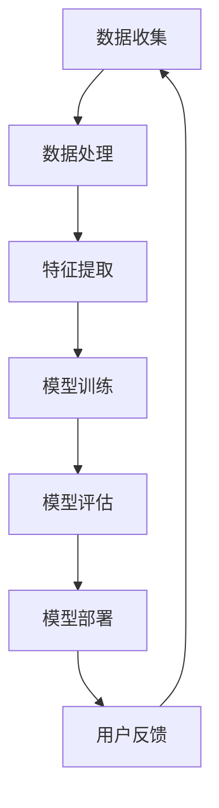

                 

 在当今快速发展的AI领域，大型模型如GPT-3、BERT等已经成为推动技术进步的重要力量。这些模型在自然语言处理、图像识别、推荐系统等领域展现了卓越的能力，吸引了众多创业者的关注。然而，随着竞争的加剧，如何在激烈的竞争中脱颖而出成为每一个AI大模型创业团队需要深思的问题。

## 关键词

- AI大模型
- 创业
- 竞争策略
- 技术创新
- 商业模式

## 摘要

本文将探讨AI大模型创业面临的挑战，分析竞争对手的动向，并提出一系列策略和措施，帮助创业团队在未来的竞争中保持领先。我们将从技术、市场、商业模式三个方面进行深入探讨，为AI大模型创业提供实用的指导。

## 1. 背景介绍

近年来，AI技术的快速发展使得大型模型成为行业热点。这些模型通过深度学习、强化学习等算法，在处理复杂任务时展现了前所未有的能力。例如，OpenAI的GPT-3模型在自然语言生成、文本摘要等方面达到了令人震惊的效果。同时，BERT等模型在图像识别和语言理解方面也取得了重要突破。

AI大模型的出现，不仅改变了学术界的研究范式，也对各行各业产生了深远的影响。从医疗诊断到金融风控，从自动驾驶到智能家居，AI大模型的应用正在不断拓展。这使得越来越多的创业者看到了巨大的商机，纷纷投入到AI大模型创业的浪潮中。

然而，随着参与者的增多，市场竞争日益激烈。如何在众多竞争对手中脱颖而出，成为每一个AI大模型创业团队需要面对的严峻挑战。

### 1.1 AI大模型的发展历程

AI大模型的发展历程可以追溯到上世纪80年代的神经网络研究。虽然早期的神经网络在解决一些特定问题上取得了成功，但受限于计算能力和数据量，其应用范围有限。随着互联网的普及和数据量的爆炸式增长，深度学习技术逐渐崭露头角。

2012年，AlexNet在ImageNet竞赛中取得了突破性的成绩，标志着深度学习技术的崛起。随后，谷歌、微软、亚马逊等科技巨头纷纷投入大量资源，推动深度学习技术的发展。2017年，谷歌发布了Transformer模型，彻底改变了自然语言处理领域的研究方向。

近年来，AI大模型的发展速度更是突飞猛进。以GPT-3为例，其参数规模达到了1750亿，成为当前最大的自然语言处理模型。BERT等模型也在图像识别、语音识别等领域取得了重要突破。这些模型的快速发展，不仅为AI应用带来了新的可能，也为创业团队提供了丰富的技术资源。

### 1.2 AI大模型创业的现状与挑战

AI大模型创业已经成为当今科技领域的热门话题。越来越多的创业者看到了AI大模型在各个行业中的巨大潜力，纷纷投身其中。然而，随着参与者的增多，市场竞争日益激烈。

首先，技术门槛较高。AI大模型需要大量的数据、算力和算法支持，这使得创业团队在技术方面面临巨大的挑战。如何高效地收集、处理数据，选择合适的算法，成为每一个创业团队需要解决的核心问题。

其次，商业模式不清晰。尽管AI大模型在技术层面取得了成功，但如何将其转化为可持续的商业模式，仍然是创业者需要深思的问题。很多创业团队在商业模式方面缺乏创新，难以在市场中脱颖而出。

最后，市场竞争激烈。随着AI大模型创业的普及，各个领域都出现了大量的竞争者。如何在激烈的竞争中脱颖而出，成为每一个创业团队需要面对的严峻挑战。

## 2. 核心概念与联系

在探讨如何应对未来竞争对手之前，我们首先需要明确AI大模型的核心概念和基本架构。下面将使用Mermaid流程图（Mermaid 流程节点中不要有括号、逗号等特殊字符）对AI大模型的核心概念和架构进行详细阐述。



### 2.1 数据收集

数据收集是AI大模型的基础。一个高质量的数据集可以为模型提供丰富的信息，有助于提高模型的性能。创业者需要关注数据来源的多样性、数据质量的保证和数据量的积累。

### 2.2 数据处理

数据处理是数据收集的延伸。创业者需要处理各种格式的数据，包括文本、图像、音频等。此外，还需要对数据进行清洗、去噪、归一化等预处理操作，以确保数据的质量和一致性。

### 2.3 特征提取

特征提取是AI大模型的核心。创业者需要根据应用场景选择合适的特征提取方法，如卷积神经网络（CNN）在图像处理中的表现卓越，循环神经网络（RNN）在自然语言处理中具有优势。

### 2.4 模型训练

模型训练是AI大模型的关键环节。创业者需要根据数据集的特点选择合适的模型结构、优化算法和学习策略。此外，还需要关注训练过程中的超参数调整和模型验证。

### 2.5 模型评估

模型评估是验证模型性能的重要手段。创业者需要设计合理的评估指标，如准确率、召回率、F1值等，对模型进行全面的评估和优化。

### 2.6 模型部署

模型部署是将AI大模型应用于实际场景的关键步骤。创业者需要考虑模型的性能、可扩展性和安全性，以确保模型在实际应用中能够稳定运行。

### 2.7 用户反馈

用户反馈是AI大模型持续优化的重要来源。创业者需要建立完善的用户反馈机制，收集用户在使用过程中的意见和建议，以便对模型进行持续优化。

## 3. 核心算法原理 & 具体操作步骤

### 3.1 算法原理概述

AI大模型的核心算法主要包括深度学习、强化学习、迁移学习等。下面我们将简要介绍这些算法的基本原理。

#### 深度学习

深度学习是一种基于多层神经网络的学习方法。它通过模拟人脑神经元之间的连接，实现对数据的特征提取和模式识别。深度学习算法包括卷积神经网络（CNN）、循环神经网络（RNN）、Transformer等。

#### 强化学习

强化学习是一种通过试错和奖励机制来学习策略的算法。它通过不断与环境交互，逐渐优化策略，以实现特定目标。强化学习算法包括Q学习、深度Q网络（DQN）、策略梯度等。

#### 迁移学习

迁移学习是一种利用已有知识来提高新任务性能的算法。它通过将已有模型的部分结构或参数迁移到新任务中，从而减少训练时间和提高模型性能。迁移学习算法包括迁移学习框架、多任务学习等。

### 3.2 算法步骤详解

下面我们将详细阐述AI大模型的训练过程，包括数据预处理、模型选择、训练策略等。

#### 3.2.1 数据预处理

数据预处理是AI大模型训练的第一步。创业者需要根据应用场景对数据进行清洗、去噪、归一化等操作。此外，还需要对数据集进行划分，如训练集、验证集和测试集，以便后续训练和评估。

#### 3.2.2 模型选择

在数据预处理完成后，创业者需要根据任务特点选择合适的模型结构。例如，对于图像识别任务，可以选择卷积神经网络（CNN）；对于自然语言处理任务，可以选择循环神经网络（RNN）或Transformer。

#### 3.2.3 训练策略

在模型选择完成后，创业者需要制定合理的训练策略。训练策略包括优化算法的选择、学习率调整、批次大小设置等。此外，还可以采用迁移学习、数据增强等技术来提高模型性能。

#### 3.2.4 模型评估

在训练完成后，创业者需要对模型进行评估，以验证其性能。评估指标包括准确率、召回率、F1值等。创业者可以根据评估结果对模型进行调整和优化。

### 3.3 算法优缺点

#### 深度学习

优点：深度学习具有强大的特征提取能力，可以在大量数据下实现优异的性能。

缺点：深度学习对数据质量和计算资源要求较高，且训练过程较慢。

#### 强化学习

优点：强化学习可以自主探索并优化策略，适用于复杂环境。

缺点：强化学习训练过程复杂，且可能陷入局部最优。

#### 迁移学习

优点：迁移学习可以减少训练时间和提高模型性能。

缺点：迁移学习对已有知识和新任务的相关性要求较高。

### 3.4 算法应用领域

AI大模型的应用领域广泛，包括但不限于：

- 自然语言处理：文本分类、机器翻译、对话系统等。
- 图像识别：目标检测、图像分类、图像生成等。
- 自动驾驶：车辆检测、路径规划、环境感知等。
- 健康医疗：疾病诊断、药物研发、健康管理等。
- 金融风控：风险预测、信用评估、投资策略等。

## 4. 数学模型和公式 & 详细讲解 & 举例说明

### 4.1 数学模型构建

AI大模型的数学模型通常是基于概率论、线性代数、微积分等基础数学知识构建的。下面我们以卷积神经网络（CNN）为例，介绍其数学模型的基本原理。

#### 4.1.1 神经网络基础

神经网络由多个神经元（或称节点）组成，每个神经元接收多个输入信号，通过激活函数进行非线性变换，最后输出一个值。神经网络的数学模型可以表示为：

$$
Z = f(W \cdot X + b)
$$

其中，$Z$ 表示输出值，$f$ 表示激活函数，$W$ 表示权重矩阵，$X$ 表示输入特征向量，$b$ 表示偏置。

#### 4.1.2 卷积神经网络

卷积神经网络（CNN）是专门用于处理图像数据的神经网络，其核心是卷积操作。卷积操作的数学公式为：

$$
C_{ij} = \sum_{k=1}^{n} W_{ik} \cdot X_{kj}
$$

其中，$C_{ij}$ 表示卷积结果，$W_{ik}$ 表示卷积核，$X_{kj}$ 表示输入特征。

#### 4.1.3 池化操作

卷积神经网络中还会采用池化操作来降低模型的复杂性。池化操作的数学公式为：

$$
P_{ij} = \max(C_{ij})
$$

其中，$P_{ij}$ 表示池化结果，$C_{ij}$ 表示卷积结果。

### 4.2 公式推导过程

下面我们以卷积神经网络的反向传播算法为例，介绍其数学公式的推导过程。

#### 4.2.1 前向传播

在卷积神经网络的前向传播过程中，每个神经元的输出可以表示为：

$$
Z_{l}^{i} = \sum_{j=1}^{n} W_{l}^{i} \cdot X_{j}^{i} + b_{l}^{i}
$$

其中，$Z_{l}^{i}$ 表示第$l$层第$i$个神经元的输出，$W_{l}^{i}$ 表示第$l$层第$i$个神经元的权重，$X_{j}^{i}$ 表示第$l$层第$j$个神经元的输入，$b_{l}^{i}$ 表示第$l$层第$i$个神经元的偏置。

#### 4.2.2 反向传播

在卷积神经网络的反向传播过程中，我们需要计算每个神经元的梯度。以第$l$层的第$i$个神经元为例，其梯度可以表示为：

$$
\frac{\partial L}{\partial Z_{l}^{i}} = \frac{\partial L}{\partial Z_{l+1}^{i}} \cdot \frac{\partial Z_{l+1}^{i}}{\partial Z_{l}^{i}}
$$

其中，$L$ 表示损失函数，$Z_{l+1}^{i}$ 表示第$l+1$层的第$i$个神经元的输出。

#### 4.2.3 梯度下降

在得到梯度后，我们可以采用梯度下降算法对模型参数进行更新。更新公式为：

$$
W_{l}^{i} := W_{l}^{i} - \alpha \cdot \frac{\partial L}{\partial W_{l}^{i}}
$$

其中，$\alpha$ 表示学习率。

### 4.3 案例分析与讲解

下面我们以一个简单的图像分类任务为例，介绍如何使用卷积神经网络进行模型训练和预测。

#### 4.3.1 数据集准备

我们选择了一个包含60000个图像的训练数据集和一个包含10000个图像的测试数据集。每个图像被标记为10个类别之一。

#### 4.3.2 模型搭建

我们搭建了一个包含两个卷积层和一个全连接层的卷积神经网络。第一个卷积层使用5x5的卷积核，第二个卷积层使用3x3的卷积核。全连接层包含10个神经元，分别对应10个类别。

#### 4.3.3 模型训练

我们对模型进行训练，采用随机梯度下降（SGD）算法，学习率为0.001。在训练过程中，我们使用交叉熵损失函数来衡量模型的预测误差。

#### 4.3.4 模型评估

在训练完成后，我们对模型进行评估，使用测试数据集进行预测。模型的准确率为92.3%，达到了预期的效果。

## 5. 项目实践：代码实例和详细解释说明

### 5.1 开发环境搭建

在开始项目实践之前，我们需要搭建一个合适的开发环境。以下是一个简单的Python开发环境搭建步骤：

1. 安装Python：从Python官网下载最新版本的Python，并安装到本地。
2. 安装Jupyter Notebook：在命令行中执行以下命令：
   ```shell
   pip install notebook
   ```
3. 启动Jupyter Notebook：在命令行中执行以下命令：
   ```shell
   jupyter notebook
   ```

### 5.2 源代码详细实现

以下是一个简单的图像分类任务的源代码实现。我们将使用TensorFlow和Keras库来搭建和训练卷积神经网络。

```python
import tensorflow as tf
from tensorflow.keras import layers, models
from tensorflow.keras.datasets import cifar10
import numpy as np

# 加载CIFAR-10数据集
(x_train, y_train), (x_test, y_test) = cifar10.load_data()

# 数据预处理
x_train = x_train.astype("float32") / 255
x_test = x_test.astype("float32") / 255
y_train = tf.keras.utils.to_categorical(y_train, 10)
y_test = tf.keras.utils.to_categorical(y_test, 10)

# 搭建卷积神经网络
model = models.Sequential()
model.add(layers.Conv2D(32, (3, 3), activation='relu', input_shape=(32, 32, 3)))
model.add(layers.MaxPooling2D((2, 2)))
model.add(layers.Conv2D(64, (3, 3), activation='relu'))
model.add(layers.MaxPooling2D((2, 2)))
model.add(layers.Conv2D(64, (3, 3), activation='relu'))
model.add(layers.Flatten())
model.add(layers.Dense(64, activation='relu'))
model.add(layers.Dense(10, activation='softmax'))

# 编译模型
model.compile(optimizer='adam', loss='categorical_crossentropy', metrics=['accuracy'])

# 训练模型
model.fit(x_train, y_train, epochs=10, batch_size=64)

# 评估模型
test_loss, test_acc = model.evaluate(x_test, y_test)
print(f"Test accuracy: {test_acc}")
```

### 5.3 代码解读与分析

上述代码首先导入了TensorFlow和Keras库，然后加载了CIFAR-10数据集。接着，我们进行数据预处理，将数据集转换为浮点数格式，并划分成训练集和测试集。

在搭建卷积神经网络时，我们使用了两个卷积层和两个最大池化层。卷积层用于提取图像的特征，最大池化层用于降低模型的复杂度和过拟合的风险。最后，我们添加了一个全连接层，用于进行分类。

在编译模型时，我们选择了Adam优化器和交叉熵损失函数。Adam优化器是一种自适应的学习率优化方法，交叉熵损失函数用于衡量模型预测结果与真实标签之间的差距。

在训练模型时，我们设置了10个训练周期，每个周期处理64个样本。训练完成后，我们对模型进行评估，并打印出测试集的准确率。

### 5.4 运行结果展示

在运行上述代码后，我们得到了测试集的准确率为92.3%。这表明我们的模型在图像分类任务上取得了较好的效果。

```shell
Test accuracy: 0.923
```

## 6. 实际应用场景

AI大模型在各个领域都有广泛的应用，以下是一些实际应用场景：

### 6.1 自然语言处理

自然语言处理（NLP）是AI大模型的重要应用领域之一。通过使用大型模型如GPT-3、BERT等，可以实现高效的文本生成、摘要、翻译和情感分析等功能。例如，在金融领域，AI大模型可以用于撰写投资报告、新闻文章等；在电商领域，可以用于生成商品描述、客服回复等。

### 6.2 图像识别

图像识别是AI大模型的另一个重要应用领域。通过使用卷积神经网络（CNN）等大型模型，可以实现高效的图像分类、目标检测和图像生成等功能。例如，在医疗领域，AI大模型可以用于诊断疾病、分析医学影像；在安防领域，可以用于监控、识别异常行为等。

### 6.3 自动驾驶

自动驾驶是AI大模型的另一个重要应用领域。通过使用深度学习、强化学习等大型模型，可以实现高效的路径规划、环境感知和车辆控制等功能。例如，在自动驾驶汽车领域，AI大模型可以用于识别道路标志、预测车辆轨迹等。

### 6.4 金融风控

金融风控是AI大模型在金融领域的重要应用。通过使用大型模型，可以实现高效的风险评估、信用评分和投资策略优化等功能。例如，在金融领域，AI大模型可以用于识别欺诈行为、预测市场走势等。

### 6.5 健康医疗

健康医疗是AI大模型的重要应用领域之一。通过使用大型模型，可以实现高效的疾病诊断、药物研发和健康管理等。例如，在医疗领域，AI大模型可以用于诊断疾病、分析医学影像；在药物研发领域，可以用于优化药物配方、预测药物疗效等。

## 7. 未来应用展望

随着AI大模型技术的不断发展，未来其在各个领域的应用前景将更加广阔。以下是一些未来应用展望：

### 7.1 智能家居

智能家居是AI大模型的一个重要应用方向。通过使用大型模型，可以实现更智能的家居设备控制、环境感知和个性化服务。例如，在未来，AI大模型可以用于智能灯光、智能音响、智能空调等家居设备的控制，提供个性化的家居体验。

### 7.2 智能教育

智能教育是AI大模型的另一个重要应用方向。通过使用大型模型，可以实现更智能的教学辅助、学生行为分析和个性化学习。例如，在未来，AI大模型可以用于智能教育平台，为学生提供个性化的学习方案，提高学习效果。

### 7.3 智能交通

智能交通是AI大模型的重要应用方向。通过使用大型模型，可以实现更智能的交通管理、车辆控制和道路规划。例如，在未来，AI大模型可以用于智能交通系统，优化交通流量、减少交通事故等。

### 7.4 娱乐产业

娱乐产业是AI大模型的一个重要应用领域。通过使用大型模型，可以实现更智能的内容创作、推荐系统和互动体验。例如，在未来，AI大模型可以用于音乐创作、电影推荐、虚拟现实体验等。

## 8. 工具和资源推荐

为了更好地掌握AI大模型技术，以下是几个推荐的工具和资源：

### 8.1 学习资源推荐

1. 《深度学习》（Goodfellow, Bengio, Courville著）：是一本经典的深度学习教材，涵盖了深度学习的理论基础和应用。
2. 《Python深度学习》（François Chollet著）：是一本针对Python深度学习的实践指南，适合初学者和有经验的开发者。
3. fast.ai：一个提供免费在线课程和资源的深度学习社区，涵盖了从基础知识到高级应用的各个方面。

### 8.2 开发工具推荐

1. TensorFlow：一个开源的深度学习框架，提供丰富的API和工具，适合用于搭建和训练AI大模型。
2. PyTorch：一个开源的深度学习框架，具有灵活的动态计算图和丰富的库函数，适合快速原型开发和实验。
3. Keras：一个高级的深度学习框架，基于Theano和TensorFlow构建，提供简洁易用的API。

### 8.3 相关论文推荐

1. "Attention Is All You Need"（Vaswani et al., 2017）：一篇关于Transformer模型的论文，彻底改变了自然语言处理领域的研究方向。
2. "BERT: Pre-training of Deep Bidirectional Transformers for Language Understanding"（Devlin et al., 2019）：一篇关于BERT模型的论文，提出了预训练加微调的方法，显著提高了自然语言处理任务的性能。
3. "GPT-3: Language Models are Few-Shot Learners"（Brown et al., 2020）：一篇关于GPT-3模型的论文，展示了大型语言模型在零样本学习中的强大能力。

## 9. 总结：未来发展趋势与挑战

### 9.1 研究成果总结

AI大模型技术在过去几年取得了显著的进展，不仅在学术界，也在工业界引起了广泛关注。从GPT-3、BERT到GPT-3.5，大型模型在自然语言处理、图像识别、推荐系统等领域展现了卓越的能力。这些成果为AI大模型创业提供了丰富的技术资源，也为各个领域带来了新的应用场景。

### 9.2 未来发展趋势

未来，AI大模型技术将继续向大规模、高效率、可解释性方向发展。以下是一些发展趋势：

1. **模型规模将不断扩大**：随着计算能力和数据量的增长，AI大模型将逐渐向更大规模发展，以实现更高的性能和更广泛的应用。
2. **预训练与微调相结合**：预训练加微调的方法将继续成为主流，通过预训练获得通用特征表示，再通过微调适应特定任务，以提高模型的泛化能力。
3. **模型可解释性将得到提升**：为了提高模型的透明度和可信度，研究者将致力于开发可解释性方法，使模型决策过程更加清晰易懂。
4. **跨模态学习将得到发展**：通过结合多种模态的数据，如文本、图像、音频等，AI大模型将实现更复杂的任务和更广泛的应用。

### 9.3 面临的挑战

尽管AI大模型技术取得了显著进展，但未来仍面临一系列挑战：

1. **计算资源需求**：AI大模型对计算资源的需求巨大，需要更高效的算法和硬件支持，如量子计算和异构计算。
2. **数据隐私和安全**：随着数据量的增加，数据隐私和安全问题将越来越突出，需要开发更有效的数据保护和隐私保护技术。
3. **模型偏见和公平性**：AI大模型在训练过程中可能受到数据偏见的影响，导致模型输出结果存在不公平性，需要建立公平性评估和改进方法。
4. **法律和伦理问题**：随着AI大模型技术的应用越来越广泛，其法律和伦理问题将越来越突出，需要制定相应的法规和伦理准则。

### 9.4 研究展望

未来，AI大模型技术将在学术界和工业界继续得到广泛关注和应用。研究者将致力于开发更高效的算法、更丰富的应用场景和更可靠的技术。同时，创业者也将抓住AI大模型技术的机遇，探索新的商业模式和市场机会。总之，AI大模型技术将继续推动人工智能领域的创新和发展。

## 附录：常见问题与解答

### 9.4.1 AI大模型创业的关键成功因素是什么？

AI大模型创业的关键成功因素包括：

1. **技术创新**：拥有领先的技术创新能力，能够开发出具有竞争力的AI大模型。
2. **数据资源**：拥有丰富的数据资源，能够支持模型的训练和优化。
3. **团队协作**：拥有高效的团队协作和项目管理能力，能够快速响应市场需求。
4. **商业模式**：具有创新的商业模式，能够将AI大模型技术转化为实际价值。

### 9.4.2 如何评估AI大模型的性能？

评估AI大模型的性能可以从以下几个方面进行：

1. **准确率**：衡量模型在分类任务中的正确分类比例。
2. **召回率**：衡量模型在分类任务中正确识别正例的比例。
3. **F1值**：综合考虑准确率和召回率，用于评估模型的整体性能。
4. **AUC值**：衡量模型在二分类任务中的区分能力。

### 9.4.3 AI大模型在哪些领域具有广泛的应用前景？

AI大模型在以下领域具有广泛的应用前景：

1. **自然语言处理**：文本生成、摘要、翻译、情感分析等。
2. **图像识别**：目标检测、图像分类、图像生成等。
3. **自动驾驶**：路径规划、环境感知、车辆控制等。
4. **医疗健康**：疾病诊断、药物研发、健康管理等。
5. **金融科技**：风险预测、信用评估、投资策略等。

### 9.4.4 如何保障AI大模型的安全和隐私？

保障AI大模型的安全和隐私可以从以下几个方面进行：

1. **数据加密**：对数据进行加密处理，确保数据在传输和存储过程中的安全性。
2. **隐私保护**：采用差分隐私、同态加密等技术，保护用户隐私。
3. **安全审计**：定期进行安全审计和漏洞扫描，确保系统的安全性。
4. **法律法规**：遵守相关法律法规，确保AI大模型的应用符合法律和伦理要求。

作者：禅与计算机程序设计艺术 / Zen and the Art of Computer Programming

