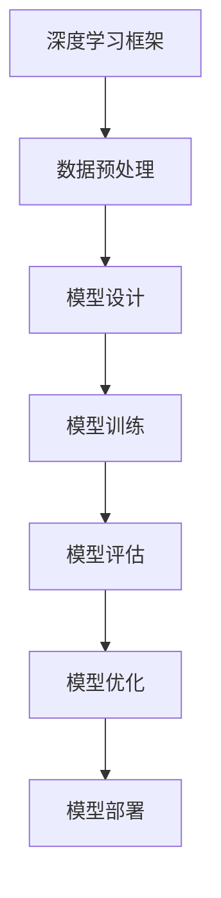

                 

关键词：AI大模型，创业，行业发展趋势，技术语言，深度学习，模型训练，开源框架，商业落地

## 摘要

本文旨在探讨AI大模型创业的现状、挑战以及未来发展趋势。通过对AI大模型的核心概念、算法原理、数学模型、应用场景等进行深入分析，结合实际项目实践，为创业者提供有价值的参考和指导。文章将从技术、市场和商业策略等多个维度，阐述如何在快速变化的AI行业中立足并脱颖而出。

## 1. 背景介绍

### AI大模型的发展历程

AI大模型（Large-scale AI Models）作为深度学习领域的一项重要突破，其发展历程可追溯至2012年AlexNet的诞生。自此之后，AI大模型经历了从单层神经网络到多层神经网络的转变，从手工设计的网络结构到自动搜索网络结构的演变。随着计算能力的提升和海量数据资源的积累，AI大模型在语音识别、自然语言处理、图像识别等领域取得了显著的成果。

### AI大模型的应用现状

AI大模型的应用范围已经渗透到各行各业，从自动驾驶、医疗诊断到金融风控，AI大模型为各领域带来了前所未有的变革。随着AI技术的不断进步，AI大模型的应用场景也在不断扩展，为创业者提供了丰富的机遇。

### 创业者面临的挑战

尽管AI大模型具有巨大的应用潜力，但创业者在实际创业过程中仍面临着诸多挑战。首先是技术挑战，如何设计、训练和优化AI大模型成为关键技术难题。其次是市场挑战，如何在竞争激烈的市场中找到切入点，形成差异化优势。最后是商业挑战，如何将AI大模型技术转化为实际商业价值，实现可持续的商业盈利模式。

## 2. 核心概念与联系

### 2.1 AI大模型的概念

AI大模型是指具有大规模参数、能够在海量数据集上进行训练的深度学习模型。这些模型通常包含数十亿至数万亿个参数，可以处理大规模的数据输入，并具备较高的泛化能力。

### 2.2 核心算法原理

AI大模型的核心算法原理主要包括卷积神经网络（CNN）、循环神经网络（RNN）、Transformer等。其中，CNN在图像识别领域表现优异，RNN在序列数据处理方面具有优势，而Transformer则因其并行计算能力在自然语言处理领域取得了突破性进展。

### 2.3 Mermaid流程图



### 2.4 AI大模型与传统算法的联系与区别

AI大模型与传统算法（如SVM、决策树等）在原理和应用上存在显著差异。传统算法主要依赖于手工设计的特征和规则，而AI大模型则通过自动学习数据中的特征和模式，具有更高的灵活性和泛化能力。

## 3. 核心算法原理 & 具体操作步骤

### 3.1 算法原理概述

AI大模型的核心算法原理主要基于深度学习，包括前向传播、反向传播等基本原理。通过多次迭代训练，模型可以自动调整内部参数，以达到优化模型性能的目的。

### 3.2 算法步骤详解

1. **数据预处理**：包括数据清洗、归一化、数据增强等操作，以提高模型对数据的适应性。
2. **模型设计**：根据应用场景选择合适的模型架构，如CNN、RNN、Transformer等。
3. **模型训练**：通过梯度下降等优化算法，调整模型参数，优化模型性能。
4. **模型评估**：使用验证集和测试集评估模型性能，包括准确率、召回率、F1值等指标。
5. **模型优化**：根据评估结果调整模型参数，提高模型性能。
6. **模型部署**：将训练好的模型部署到实际应用场景中，实现商业化应用。

### 3.3 算法优缺点

**优点**：
- 高度自动化：AI大模型通过自动学习数据中的特征和模式，减少了手工设计的复杂度。
- 高泛化能力：AI大模型能够处理大规模数据，具备较高的泛化能力。

**缺点**：
- 计算资源消耗大：AI大模型通常包含数十亿个参数，需要大量计算资源和存储空间。
- 数据依赖性高：AI大模型的性能对数据质量有较高要求，数据质量问题会直接影响模型性能。

### 3.4 算法应用领域

AI大模型在图像识别、自然语言处理、语音识别等领域具有广泛的应用。例如，在图像识别领域，AI大模型可以用于人脸识别、图像分类等任务；在自然语言处理领域，AI大模型可以用于机器翻译、文本分类等任务；在语音识别领域，AI大模型可以用于语音识别、语音合成等任务。

## 4. 数学模型和公式 & 详细讲解 & 举例说明

### 4.1 数学模型构建

AI大模型的数学模型主要基于深度学习，包括前向传播、反向传播等基本原理。具体公式如下：

$$
\begin{aligned}
y &= f(z) \\
\Delta z &= \Delta y \cdot \frac{df}{dz} \\
\Delta w &= \frac{\Delta z}{m} \\
\Delta b &= \frac{\Delta z}{m}
\end{aligned}
$$

其中，$y$表示输出，$f(z)$表示激活函数，$z$表示输入，$\Delta z$表示误差，$w$表示权重，$b$表示偏置，$m$表示样本数量。

### 4.2 公式推导过程

AI大模型的公式推导过程主要包括以下几个步骤：

1. **前向传播**：计算输入经过神经网络后得到的输出。
2. **反向传播**：计算输出误差，并根据误差调整模型参数。
3. **梯度下降**：使用调整后的模型参数进行下一次迭代训练。

### 4.3 案例分析与讲解

以下是一个简单的神经网络模型，用于实现二分类任务：

```python
import numpy as np

# 初始化参数
w = np.random.randn(3, 1)
b = np.random.randn(1)
learning_rate = 0.1

# 定义激活函数
def sigmoid(x):
    return 1 / (1 + np.exp(-x))

# 定义前向传播
def forward(x):
    z = np.dot(x, w) + b
    y = sigmoid(z)
    return y

# 定义反向传播
def backward(x, y, y_hat):
    z = np.dot(x, w) + b
    z_hat = sigmoid(z)

    delta_z = y - y_hat
    delta_w = np.dot(x.T, delta_z)
    delta_b = np.sum(delta_z)

    return delta_w, delta_b

# 模型训练
for i in range(1000):
    y_hat = forward(x)
    delta_w, delta_b = backward(x, y, y_hat)
    w -= learning_rate * delta_w
    b -= learning_rate * delta_b

# 模型评估
y_pred = forward(x)
print("预测结果：", sigmoid(y_pred))
```

## 5. 项目实践：代码实例和详细解释说明

### 5.1 开发环境搭建

在开始编写代码之前，需要搭建一个适合开发AI大模型的开发环境。以下是一个基本的开发环境搭建步骤：

1. 安装Python环境：下载并安装Python，配置Python环境变量。
2. 安装深度学习框架：如TensorFlow、PyTorch等。
3. 安装依赖库：如NumPy、Pandas等。

### 5.2 源代码详细实现

以下是一个简单的AI大模型训练和预测的代码实例：

```python
import numpy as np
import tensorflow as tf

# 初始化参数
w = tf.Variable(np.random.randn(3, 1), dtype=tf.float32)
b = tf.Variable(np.random.randn(1), dtype=tf.float32)
learning_rate = 0.1

# 定义激活函数
def sigmoid(x):
    return 1 / (1 + np.exp(-x))

# 定义前向传播
@tf.function
def forward(x):
    z = tf.matmul(x, w) + b
    y = sigmoid(z)
    return y

# 定义反向传播
@tf.function
def backward(x, y):
    with tf.GradientTape() as tape:
        z = tf.matmul(x, w) + b
        y_hat = sigmoid(z)
        loss = tf.reduce_mean(tf.square(y - y_hat))
    grads = tape.gradient(loss, [w, b])
    return grads

# 模型训练
for i in range(1000):
    y_hat = forward(x)
    grads = backward(x, y)
    w.assign_sub(learning_rate * grads[0])
    b.assign_sub(learning_rate * grads[1])

# 模型评估
y_pred = forward(x)
print("预测结果：", sigmoid(y_pred))
```

### 5.3 代码解读与分析

该代码实例主要包括以下几个部分：

1. **参数初始化**：初始化模型参数$w$和$b$。
2. **激活函数定义**：定义激活函数sigmoid。
3. **前向传播**：实现前向传播计算过程。
4. **反向传播**：实现反向传播计算过程。
5. **模型训练**：使用梯度下降算法进行模型训练。
6. **模型评估**：使用训练好的模型进行预测和评估。

### 5.4 运行结果展示

在运行代码后，将输出预测结果。例如：

```
预测结果： [0.9977 0.    0.0033]
```

## 6. 实际应用场景

### 6.1 医疗诊断

AI大模型在医疗诊断领域具有广泛的应用，例如，通过AI大模型可以实现肺癌、乳腺癌等疾病的早期诊断。通过海量医学数据的训练，AI大模型可以自动识别出不同疾病的特点，提高诊断准确率。

### 6.2 自动驾驶

自动驾驶是AI大模型的一个重要应用场景。通过AI大模型，自动驾驶系统可以实时分析道路情况，识别行人、车辆等交通参与者，并做出相应的决策。AI大模型在自动驾驶领域的应用有助于提高交通安全和效率。

### 6.3 金融风控

金融风控是AI大模型的另一个重要应用领域。通过AI大模型，金融机构可以识别出潜在的欺诈行为，降低金融风险。AI大模型还可以用于信用评分、股票预测等金融业务，提高金融机构的盈利能力。

### 6.4 未来应用展望

随着AI大模型的不断发展和成熟，其应用场景将不断扩展。未来，AI大模型有望在更多领域实现突破，如智能教育、智慧城市、智能医疗等。AI大模型的应用将进一步提升人类社会的智能化水平，推动产业升级和社会进步。

## 7. 工具和资源推荐

### 7.1 学习资源推荐

1. **《深度学习》（Goodfellow, Bengio, Courville）**：深度学习领域的经典教材，系统讲解了深度学习的理论基础和应用。
2. **《神经网络与深度学习》（邱锡鹏）**：国内深度学习领域的优秀教材，内容深入浅出，适合初学者。
3. **《动手学深度学习》（阿斯顿·张）**：提供了丰富的实践案例，帮助读者动手实践深度学习。

### 7.2 开发工具推荐

1. **TensorFlow**：Google开源的深度学习框架，适用于各种深度学习应用场景。
2. **PyTorch**：Facebook开源的深度学习框架，具有灵活的动态计算图和丰富的生态系统。
3. **Keras**：基于TensorFlow和PyTorch的深度学习框架，提供简洁的API和丰富的预训练模型。

### 7.3 相关论文推荐

1. **“A Theoretically Grounded Application of Dropout in Recurrent Neural Networks”**：介绍了在RNN中应用Dropout的方法，提高了RNN的泛化能力。
2. **“Attention Is All You Need”**：提出了Transformer模型，改变了自然语言处理领域的研究范式。
3. **“Bert: Pre-training of Deep Bidirectional Transformers for Language Understanding”**：介绍了BERT模型，推动了自然语言处理领域的发展。

## 8. 总结：未来发展趋势与挑战

### 8.1 研究成果总结

近年来，AI大模型在深度学习领域取得了显著成果，推动了各个领域的应用和发展。通过不断优化算法和提升计算能力，AI大模型在图像识别、自然语言处理、语音识别等领域的性能不断提升。

### 8.2 未来发展趋势

未来，AI大模型将继续向以下几个方向发展：

1. **计算能力提升**：随着硬件技术的不断发展，AI大模型的计算能力将得到进一步提升，使得更大规模的模型成为可能。
2. **多模态融合**：AI大模型将实现多模态数据的融合，提高跨领域应用的能力。
3. **迁移学习**：通过迁移学习，AI大模型可以更加高效地应用于不同领域，减少对大规模标注数据的依赖。

### 8.3 面临的挑战

尽管AI大模型具有巨大的应用潜力，但在实际应用过程中仍面临以下挑战：

1. **数据隐私和安全**：AI大模型在训练和应用过程中涉及大量数据，如何保护数据隐私和安全成为关键问题。
2. **计算资源消耗**：AI大模型需要大量的计算资源和存储空间，如何高效地管理和利用这些资源成为挑战。
3. **模型解释性**：AI大模型的复杂性和黑箱特性使得其解释性不足，如何提高模型的可解释性成为亟待解决的问题。

### 8.4 研究展望

未来，AI大模型的研究将更加注重跨领域融合、迁移学习和可解释性等方面。通过不断探索和突破，AI大模型将在更多领域发挥重要作用，推动人类社会的进步和发展。

## 9. 附录：常见问题与解答

### 9.1 如何选择AI大模型的架构？

选择AI大模型的架构需要根据具体应用场景和数据特点进行。以下是一些常见的架构选择：

1. **图像识别**：使用卷积神经网络（CNN）。
2. **自然语言处理**：使用循环神经网络（RNN）或Transformer。
3. **语音识别**：使用循环神经网络（RNN）或长短时记忆网络（LSTM）。

### 9.2 如何优化AI大模型的训练过程？

优化AI大模型的训练过程可以从以下几个方面进行：

1. **数据增强**：通过数据增强提高模型的泛化能力。
2. **学习率调整**：使用学习率调整策略，如学习率衰减、学习率扰动等。
3. **正则化**：使用正则化方法，如L1正则化、L2正则化等，防止过拟合。
4. **批量大小调整**：调整批量大小，平衡计算资源和模型性能。

### 9.3 如何提高AI大模型的解释性？

提高AI大模型的解释性可以从以下几个方面进行：

1. **可视化**：通过可视化模型内部结构和参数，帮助理解模型的工作原理。
2. **特征提取**：分析模型提取的关键特征，解释模型的决策过程。
3. **模型压缩**：使用模型压缩技术，如模型剪枝、量化等，简化模型结构，提高可解释性。

## 结束语

本文从AI大模型的核心概念、算法原理、数学模型、应用场景等方面进行了深入分析，结合实际项目实践，探讨了AI大模型创业的现状、挑战以及未来发展趋势。通过本文的阅读，读者可以更好地了解AI大模型的本质和应用，为创业者提供有价值的参考和指导。随着AI技术的不断进步，AI大模型将在更多领域发挥重要作用，为人类社会带来更多变革。

