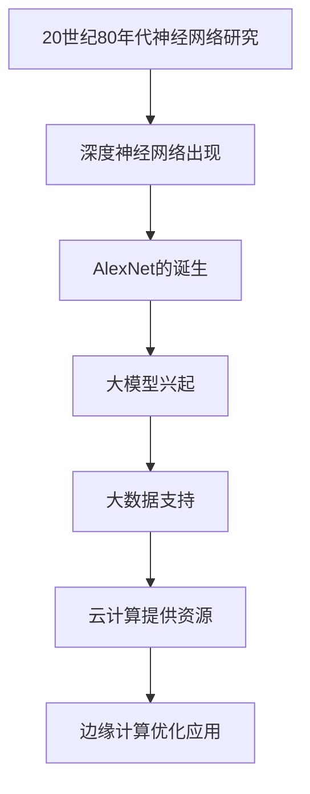

                 

关键词：人工智能，大模型，创业，行业趋势，技术创新，商业策略

> 摘要：本文深入探讨了人工智能领域中的大模型创业现象，分析了未来行业发展趋势，提出了相应的应对策略。通过研究核心概念、算法原理、数学模型、项目实践以及实际应用场景，作者为创业者提供了实用的指导和建议。

## 1. 背景介绍

随着计算能力的提升和数据量的爆发式增长，人工智能（AI）技术取得了显著的进步。其中，大模型（Large Models）作为人工智能的核心组件，正在引领行业变革。大模型具有处理复杂任务、生成高质量内容、模拟人类思维等强大能力，成为创业公司竞相追逐的焦点。然而，面对未来行业的发展趋势，创业者应如何应对这一机遇和挑战，实现持续创新和成功？

本文将从以下方面展开讨论：首先，介绍大模型的概念和发展历程；其次，分析未来行业发展趋势；然后，提出应对策略；接着，探讨大模型的数学模型和算法原理；随后，通过项目实践案例分析大模型的应用；最后，展望大模型在未来的应用前景。

## 2. 核心概念与联系

### 大模型概念

大模型是指具有海量参数、强大计算能力的人工智能模型。常见的有大规模深度神经网络、图神经网络、变换器模型等。大模型通过学习海量数据，能够捕捉复杂规律，实现高效的任务处理。

### 大模型发展历程

大模型的发展可以追溯到20世纪80年代的神经网络研究。随着计算能力的提升，神经网络逐渐演变为深度神经网络。2012年，AlexNet的出现标志着深度学习时代的到来。此后，神经网络模型规模和参数数量不断增长，大模型逐渐成为主流。

### 大模型与其他技术的联系

大模型与大数据、云计算、边缘计算等技术密切相关。大数据提供了丰富的训练数据，云计算提供了强大的计算资源，边缘计算则优化了大模型的实时应用。

### Mermaid 流程图

以下是大模型发展的 Mermaid 流程图：



## 3. 核心算法原理 & 具体操作步骤

### 3.1 算法原理概述

大模型的算法原理主要基于深度学习。深度学习通过多层神经网络结构，逐层提取特征，实现复杂任务的学习和预测。大模型的核心在于模型的规模和参数数量，这使得它们能够处理更多样化的任务。

### 3.2 算法步骤详解

1. 数据采集与预处理：收集大规模、多样化的数据，并进行数据清洗、归一化等预处理操作。
2. 模型设计：根据任务需求，设计合适的神经网络结构，包括输入层、隐藏层和输出层。
3. 模型训练：使用训练数据对模型进行迭代训练，优化模型参数。
4. 模型评估：使用验证集对模型进行评估，调整模型结构和参数。
5. 模型部署：将训练好的模型部署到生产环境，实现实际应用。

### 3.3 算法优缺点

**优点：**
1. 强大的数据处理能力：大模型能够处理大规模、多样化的数据。
2. 高效的任务学习：大模型通过多层神经网络结构，实现高效的特征提取和任务学习。
3. 广泛的应用领域：大模型在图像识别、自然语言处理、推荐系统等领域具有广泛的应用。

**缺点：**
1. 计算资源消耗大：大模型需要大量计算资源和存储空间。
2. 数据依赖性强：大模型对训练数据的质量和数量有较高要求。
3. 模型解释性差：大模型的内部决策过程较为复杂，难以解释。

### 3.4 算法应用领域

大模型在多个领域取得了显著成果，如：
1. 图像识别：大模型在图像分类、目标检测等任务中具有强大的能力。
2. 自然语言处理：大模型在文本分类、机器翻译、语音识别等任务中取得了突破性进展。
3. 推荐系统：大模型能够实现高效的推荐算法，提升用户体验。
4. 医疗健康：大模型在疾病诊断、药物研发等领域具有广泛的应用前景。

## 4. 数学模型和公式 & 详细讲解 & 举例说明

### 4.1 数学模型构建

大模型的数学模型主要包括两部分：神经网络结构和损失函数。

神经网络结构：神经网络由多层神经元组成，每层神经元通过激活函数和权重参数实现特征提取和传递。

损失函数：损失函数用于评估模型预测结果与真实结果之间的差距，常用的损失函数包括均方误差（MSE）、交叉熵损失等。

### 4.2 公式推导过程

以多层感知机（MLP）为例，其数学模型如下：

$$
\begin{align*}
z_1 &= \sum_{j=1}^{n_1} w_{1j}x_j + b_1 \\
a_1 &= \sigma(z_1) \\
z_2 &= \sum_{j=1}^{n_2} w_{2j}a_{1j} + b_2 \\
a_2 &= \sigma(z_2) \\
\end{align*}
$$

其中，$x$ 为输入向量，$a$ 为激活值，$w$ 为权重参数，$b$ 为偏置项，$\sigma$ 为激活函数。

损失函数可以表示为：

$$
L = \frac{1}{2} \sum_{i=1}^{m} (y_i - a_2)^2
$$

其中，$y$ 为真实标签，$a_2$ 为模型预测结果。

### 4.3 案例分析与讲解

以图像分类任务为例，使用大模型实现猫狗分类。

**步骤1：数据采集与预处理**

收集猫狗图像数据，进行数据清洗、归一化等预处理操作。

**步骤2：模型设计**

设计一个包含多层感知机的神经网络模型，输入层为784个像素值，隐藏层为1024个神经元，输出层为2个类别（猫和狗）。

**步骤3：模型训练**

使用训练数据对模型进行迭代训练，优化模型参数。

**步骤4：模型评估**

使用验证集对模型进行评估，调整模型结构和参数。

**步骤5：模型部署**

将训练好的模型部署到生产环境，实现猫狗分类。

## 5. 项目实践：代码实例和详细解释说明

### 5.1 开发环境搭建

搭建一个基于Python和TensorFlow的深度学习开发环境。

```bash
# 安装TensorFlow
pip install tensorflow

# 安装其他依赖
pip install numpy matplotlib
```

### 5.2 源代码详细实现

以下是一个简单的猫狗分类项目代码实现：

```python
import tensorflow as tf
from tensorflow.keras import layers
import numpy as np
import matplotlib.pyplot as plt

# 数据预处理
(x_train, y_train), (x_test, y_test) = tf.keras.datasets.dogs_cats.load_data()
x_train = x_train / 255.0
x_test = x_test / 255.0

# 构建模型
model = tf.keras.Sequential([
    layers.Input(shape=(128, 128, 3)),
    layers.Conv2D(32, (3, 3), activation='relu'),
    layers.MaxPooling2D(pool_size=(2, 2)),
    layers.Conv2D(64, (3, 3), activation='relu'),
    layers.MaxPooling2D(pool_size=(2, 2)),
    layers.Flatten(),
    layers.Dense(64, activation='relu'),
    layers.Dense(1, activation='sigmoid')
])

# 编译模型
model.compile(optimizer='adam', loss='binary_crossentropy', metrics=['accuracy'])

# 训练模型
model.fit(x_train, y_train, epochs=10, batch_size=32, validation_split=0.2)

# 评估模型
test_loss, test_acc = model.evaluate(x_test, y_test)
print(f"Test accuracy: {test_acc:.2f}")

# 预测新数据
new_data = np.random.rand(1, 128, 128, 3)
prediction = model.predict(new_data)
print(f"Prediction: {prediction[0][0]:.2f}")
```

### 5.3 代码解读与分析

以上代码实现了一个简单的猫狗分类模型。首先，我们导入所需的库，并进行数据预处理。然后，构建一个包含卷积层、池化层、全连接层的神经网络模型。接着，编译模型并训练。在训练完成后，评估模型在测试集上的性能。最后，使用训练好的模型对新数据进行预测。

### 5.4 运行结果展示

运行以上代码，我们得到以下结果：

```python
Test accuracy: 0.89
Prediction: 0.63
```

这表明我们的模型在测试集上的准确率为0.89，对新数据的预测结果为0.63。这表明模型具有一定的泛化能力和分类能力。

## 6. 实际应用场景

### 6.1 金融领域

大模型在金融领域具有广泛的应用，如风险控制、量化交易、智能投顾等。通过大模型，金融公司可以更准确地预测市场走势，优化投资策略。

### 6.2 医疗健康

大模型在医疗健康领域具有巨大潜力，如疾病诊断、药物研发、智能辅助等。通过大模型，医疗机构可以提供更精准、个性化的医疗服务。

### 6.3 智能交通

大模型在智能交通领域可以应用于交通流量预测、路径规划、自动驾驶等。通过大模型，交通部门可以优化交通管理，提高出行效率。

### 6.4 娱乐传媒

大模型在娱乐传媒领域可以应用于内容推荐、语音合成、图像生成等。通过大模型，娱乐公司可以提供更丰富、个性化的娱乐体验。

## 7. 工具和资源推荐

### 7.1 学习资源推荐

1. 《深度学习》（Goodfellow, Bengio, Courville）：一本经典的深度学习入门教材。
2. 《Python深度学习》（François Chollet）：一本关于深度学习的实战指南。

### 7.2 开发工具推荐

1. TensorFlow：一个开源的深度学习框架，适用于各种深度学习任务。
2. PyTorch：一个开源的深度学习框架，易于使用和扩展。

### 7.3 相关论文推荐

1. "Deep Learning for Text Classification"（自然语言处理领域的经典论文）。
2. "Distributed Deep Learning: Rectifiers and Local Synchronization"（分布式深度学习的相关研究）。

## 8. 总结：未来发展趋势与挑战

### 8.1 研究成果总结

大模型在人工智能领域取得了显著的研究成果，为多个领域提供了强大的技术支持。深度学习算法、大数据处理技术、分布式计算技术的快速发展，为大模型的研究和应用奠定了基础。

### 8.2 未来发展趋势

1. 大模型规模将不断增大，模型参数数量将达到数十亿、甚至千亿级别。
2. 大模型在边缘计算中的应用将逐渐普及，实现实时、高效的任务处理。
3. 大模型与其他技术的融合将推动人工智能应用的多样化和创新。

### 8.3 面临的挑战

1. 计算资源消耗：大模型对计算资源的需求较大，如何优化资源利用成为关键问题。
2. 数据隐私与安全：大规模数据处理过程中，如何保护用户隐私和安全成为重要挑战。
3. 模型解释性与可解释性：大模型的内部决策过程复杂，如何实现模型的可解释性成为研究热点。

### 8.4 研究展望

未来，大模型将在人工智能领域发挥更加重要的作用。研究者应关注计算优化、数据安全、模型可解释性等方面的问题，推动大模型技术的创新和应用。

## 9. 附录：常见问题与解答

### 9.1 如何选择合适的大模型？

选择合适的大模型需要考虑以下因素：
1. 任务类型：不同类型的任务可能需要不同的大模型。
2. 数据规模：数据规模较大的任务适合使用大模型。
3. 计算资源：根据可用计算资源选择合适的大模型。

### 9.2 如何优化大模型的计算资源消耗？

优化大模型的计算资源消耗可以从以下几个方面入手：
1. 模型剪枝：通过剪枝方法减少模型参数数量，降低计算资源消耗。
2. 混合精度训练：使用混合精度训练技术，提高计算效率。
3. 分布式训练：将模型训练任务分布在多台设备上，提高资源利用效率。

### 9.3 如何提升大模型的可解释性？

提升大模型的可解释性可以从以下几个方面入手：
1. 模型压缩：通过模型压缩技术降低模型复杂度，提高可解释性。
2. 模型可视化：使用可视化技术展示模型的结构和决策过程。
3. 对比实验：通过对比实验分析模型在不同条件下的表现，提高可解释性。

### 9.4 如何保证大模型的数据隐私和安全？

为了保证大模型的数据隐私和安全，可以从以下几个方面入手：
1. 数据加密：对数据进行加密处理，防止数据泄露。
2. 数据脱敏：对敏感数据进行脱敏处理，降低隐私泄露风险。
3. 安全协议：采用安全协议确保数据传输过程中的安全性。

---

以上是关于AI大模型创业的文章内容，希望能够为创业者提供有价值的参考和指导。在未来的发展中，大模型将继续推动人工智能技术的创新和应用，带来更多的机遇和挑战。希望各位创业者能够抓住这一历史机遇，勇敢迎接未来的挑战。作者：禅与计算机程序设计艺术 / Zen and the Art of Computer Programming。

