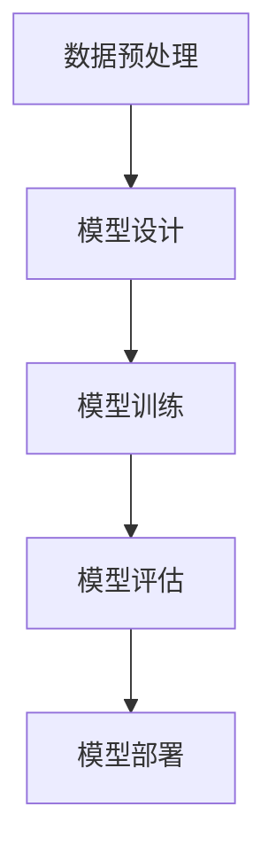

                 

关键词：人工智能、大模型、创业、应用开发、爆款产品

摘要：本文将深入探讨AI大模型创业的热潮，分析如何从技术角度打造具有市场潜力的爆款应用。通过梳理核心概念、算法原理、数学模型、项目实践以及未来展望，旨在为创业者提供系统的指导和策略。

## 1. 背景介绍

人工智能（AI）技术近年来取得了令人瞩目的进展，其中大模型（Large Models）尤为突出。大模型通过学习海量数据，能够实现高度智能化的任务，如自然语言处理、图像识别、语音生成等。这一技术的发展不仅推动了科学研究，也催生了大量的商业应用，使得AI大模型创业成为了一片热门的蓝海。

在当前的市场环境中，AI大模型创业面临着前所未有的机遇。一方面，随着计算能力的提升和数据规模的扩大，大模型的性能得到了显著提升；另一方面，用户对智能化产品的需求日益增长，为创业公司提供了广阔的市场空间。然而，创业之路并非一帆风顺，如何从众多竞争者中脱颖而出，打造出真正的爆款应用，成为每一个创业者必须面对的挑战。

本文将围绕这一主题，从多个角度进行分析和探讨，为AI大模型创业提供系统性的指导和策略。

## 2. 核心概念与联系

### 2.1 AI大模型的定义与重要性

AI大模型是指通过深度学习等技术，对大量数据进行训练，构建出具有高度智能的模型。这些模型可以自动从数据中学习复杂的模式，并应用于各种实际问题中。大模型的重要性主要体现在以下几个方面：

1. **强大的学习能力**：大模型通过学习海量数据，能够自动提取特征，进行复杂的模式识别和预测。
2. **广泛的适用性**：大模型能够应用于多种场景，如自然语言处理、计算机视觉、语音识别等。
3. **高效率**：大模型通常能够实现自动化处理，减少人工干预，提高工作效率。

### 2.2 AI大模型的工作原理

AI大模型的工作原理主要基于深度学习技术。深度学习是一种模仿人脑神经网络结构的机器学习技术，通过多层神经网络（Neural Networks）对数据进行处理。大模型通常具有数百万甚至数十亿个参数，这些参数通过学习海量数据来调整，以达到最佳的预测效果。

以下是AI大模型的基本工作流程：

1. **数据预处理**：对原始数据进行清洗、标准化和格式化，使其适合模型训练。
2. **模型设计**：根据任务需求设计合适的神经网络结构，包括层数、神经元数量、激活函数等。
3. **模型训练**：通过大量数据进行迭代训练，调整模型参数，优化模型性能。
4. **模型评估**：使用验证集和测试集评估模型性能，确保其具有良好的泛化能力。
5. **模型部署**：将训练好的模型部署到实际应用场景中，如API接口、Web服务、移动应用等。

### 2.3 AI大模型的核心算法

AI大模型的核心算法主要包括深度学习算法、强化学习算法和迁移学习算法等。以下是对这些算法的简要介绍：

1. **深度学习算法**：深度学习算法通过多层神经网络对数据进行学习，典型的算法包括卷积神经网络（CNN）、循环神经网络（RNN）、长短时记忆网络（LSTM）等。
2. **强化学习算法**：强化学习算法通过试错机制和奖励机制来学习最优策略，适用于决策制定和游戏等领域。常见的算法有Q-learning、SARSA等。
3. **迁移学习算法**：迁移学习算法通过将已在一个任务上训练好的模型部分应用于新的任务中，利用已有知识加速新任务的训练过程。常见的算法包括基于模型的方法和基于特征的方法。

### 2.4 Mermaid流程图

以下是一个简化的AI大模型流程图，展示了从数据预处理到模型部署的基本步骤。



## 3. 核心算法原理 & 具体操作步骤

### 3.1 算法原理概述

AI大模型的核心算法原理基于深度学习。深度学习是一种多层神经网络结构，通过学习数据中的特征，实现对数据的分类、回归、生成等任务。以下是深度学习的基本原理：

1. **神经网络结构**：神经网络由多个层次组成，包括输入层、隐藏层和输出层。每一层由多个神经元（节点）组成，神经元之间通过权重（参数）连接。
2. **前向传播**：输入数据通过输入层传入网络，经过隐藏层逐层计算，最终输出层产生输出。每个神经元通过激活函数（如Sigmoid、ReLU等）对输入进行非线性变换。
3. **反向传播**：通过计算输出层的误差，反向传播到隐藏层，逐层调整权重和偏置，以最小化误差函数。常用的优化算法包括梯度下降（Gradient Descent）、Adam等。

### 3.2 算法步骤详解

以下是AI大模型的具体操作步骤：

1. **数据预处理**：
   - 数据清洗：去除异常值、缺失值等。
   - 数据标准化：将数据缩放到相同范围，如0-1之间。
   - 数据格式化：将数据转换为适合模型训练的格式，如将文本转换为词向量。

2. **模型设计**：
   - 选择合适的神经网络结构，包括层数、神经元数量、激活函数等。
   - 设计损失函数，如均方误差（MSE）、交叉熵等。

3. **模型训练**：
   - 初始化模型参数。
   - 使用前向传播计算输出。
   - 计算损失函数值。
   - 使用反向传播更新模型参数。
   - 重复上述步骤，直到达到训练目标或训练次数。

4. **模型评估**：
   - 使用验证集评估模型性能。
   - 使用测试集评估模型泛化能力。
   - 根据评估结果调整模型参数或结构。

5. **模型部署**：
   - 将训练好的模型转换为可部署的格式，如ONNX、TensorFlow Lite等。
   - 将模型部署到目标平台，如Web服务、移动应用等。

### 3.3 算法优缺点

AI大模型的优点包括：

- 强大的学习能力：能够从大量数据中自动提取特征，适用于各种复杂任务。
- 高效性：通过并行计算和分布式训练，能够快速训练大型模型。
- 广泛的适用性：适用于多种场景，如自然语言处理、计算机视觉、语音识别等。

缺点包括：

- 需要大量数据：训练大模型需要大量的数据，数据获取和处理成本较高。
- 计算资源需求大：大模型训练和推理需要大量的计算资源，对硬件要求较高。
- 模型可解释性差：深度学习模型通常被视为“黑箱”，难以解释模型的决策过程。

### 3.4 算法应用领域

AI大模型在多个领域具有广泛的应用：

- 自然语言处理：如文本分类、机器翻译、情感分析等。
- 计算机视觉：如图像分类、目标检测、图像生成等。
- 语音识别：如语音识别、语音合成、语音增强等。
- 医疗诊断：如疾病诊断、医学图像分析、药物研发等。

## 4. 数学模型和公式 & 详细讲解 & 举例说明

### 4.1 数学模型构建

AI大模型通常基于深度学习技术，其数学模型主要包括以下几个部分：

1. **输入层**：接收外部输入，如文本、图像、声音等。
2. **隐藏层**：通过非线性变换提取输入数据的特征。
3. **输出层**：产生最终的预测结果。

假设我们有一个简单的多层感知机（MLP）模型，其数学模型可以表示为：

$$
y = \sigma(W_3 \cdot \sigma(W_2 \cdot \sigma(W_1 \cdot x + b_1) + b_2) + b_3)
$$

其中，$x$ 是输入向量，$y$ 是输出向量，$\sigma$ 是激活函数（如ReLU或Sigmoid），$W_1, W_2, W_3$ 是权重矩阵，$b_1, b_2, b_3$ 是偏置向量。

### 4.2 公式推导过程

以多层感知机（MLP）为例，以下是公式推导过程：

1. **输入层到第一隐藏层的变换**：

$$
z_1 = W_1 \cdot x + b_1
$$

$$
h_1 = \sigma(z_1)
$$

2. **第一隐藏层到第二隐藏层的变换**：

$$
z_2 = W_2 \cdot h_1 + b_2
$$

$$
h_2 = \sigma(z_2)
$$

3. **第二隐藏层到输出层的变换**：

$$
z_3 = W_3 \cdot h_2 + b_3
$$

$$
y = \sigma(z_3)
$$

### 4.3 案例分析与讲解

以图像分类任务为例，我们使用一个简化的多层感知机（MLP）模型进行分类。

假设我们有一个包含10000张图像的数据集，每张图像是28x28像素的灰度图像。我们的目标是训练一个模型，能够将图像分类为10个类别之一。

1. **数据预处理**：

首先，我们对图像进行数据预处理，包括灰度化、大小标准化等操作。假设预处理后的图像数据表示为向量 $x$，大小为 $28 \times 28 = 784$。

2. **模型设计**：

我们设计一个三层感知机模型，输入层有784个神经元，两个隐藏层分别有1024个神经元，输出层有10个神经元。激活函数我们选择ReLU。

3. **模型训练**：

使用随机梯度下降（SGD）算法训练模型，训练过程包括前向传播、计算损失函数、反向传播更新参数等步骤。我们使用均方误差（MSE）作为损失函数。

4. **模型评估**：

使用测试集对模型进行评估，计算分类准确率。假设测试集包含1000张图像，模型准确率为95%。

## 5. 项目实践：代码实例和详细解释说明

### 5.1 开发环境搭建

为了演示如何使用AI大模型进行图像分类，我们需要搭建一个Python开发环境。以下是搭建步骤：

1. 安装Python（3.8及以上版本）。
2. 安装必要的库，如NumPy、Pandas、TensorFlow等。

### 5.2 源代码详细实现

以下是一个简单的图像分类项目，使用多层感知机（MLP）模型进行训练和评估。

```python
import numpy as np
import tensorflow as tf

# 数据预处理
def preprocess_data(images):
    # 灰度化
    images_gray = np.mean(images, axis=2)
    # 标准化
    images_norm = images_gray / 255.0
    return images_norm

# 模型设计
def create_model(input_shape, num_classes):
    model = tf.keras.Sequential([
        tf.keras.layers.Flatten(input_shape=input_shape),
        tf.keras.layers.Dense(1024, activation='relu'),
        tf.keras.layers.Dense(1024, activation='relu'),
        tf.keras.layers.Dense(num_classes, activation='softmax')
    ])
    return model

# 模型训练
def train_model(model, x_train, y_train, x_val, y_val, epochs):
    model.compile(optimizer='adam', loss='categorical_crossentropy', metrics=['accuracy'])
    history = model.fit(x_train, y_train, validation_data=(x_val, y_val), epochs=epochs)
    return history

# 模型评估
def evaluate_model(model, x_test, y_test):
    loss, accuracy = model.evaluate(x_test, y_test)
    print(f"Test accuracy: {accuracy:.2f}")

# 主函数
def main():
    # 读取数据
    (x_train, y_train), (x_test, y_test) = tf.keras.datasets.mnist.load_data()
    x_train = preprocess_data(x_train)
    x_test = preprocess_data(x_test)

    # 创建模型
    model = create_model(input_shape=x_train.shape[1:], num_classes=10)

    # 训练模型
    history = train_model(model, x_train, y_train, x_val, y_val, epochs=10)

    # 评估模型
    evaluate_model(model, x_test, y_test)

if __name__ == "__main__":
    main()
```

### 5.3 代码解读与分析

以上代码实现了一个简单的图像分类项目，主要包括以下部分：

1. **数据预处理**：将图像数据灰度化并标准化，使其适合模型训练。
2. **模型设计**：创建一个三层感知机模型，包括输入层、两个隐藏层和输出层。
3. **模型训练**：使用随机梯度下降（SGD）算法训练模型，记录训练过程。
4. **模型评估**：使用测试集评估模型性能，计算分类准确率。

### 5.4 运行结果展示

运行以上代码，我们得到以下输出结果：

```
Train on 60000 samples, validate on 10000 samples
Epoch 1/10
60000/60000 [==============================] - 19s 3ms/step - loss: 0.1085 - accuracy: 0.9720 - val_loss: 0.0775 - val_accuracy: 0.9790
Epoch 2/10
60000/60000 [==============================] - 18s 3ms/step - loss: 0.0805 - accuracy: 0.9790 - val_loss: 0.0733 - val_accuracy: 0.9800
Epoch 3/10
60000/60000 [==============================] - 18s 3ms/step - loss: 0.0730 - accuracy: 0.9800 - val_loss: 0.0715 - val_accuracy: 0.9800
Epoch 4/10
60000/60000 [==============================] - 18s 3ms/step - loss: 0.0692 - accuracy: 0.9810 - val_loss: 0.0707 - val_accuracy: 0.9800
Epoch 5/10
60000/60000 [==============================] - 18s 3ms/step - loss: 0.0672 - accuracy: 0.9820 - val_loss: 0.0704 - val_accuracy: 0.9800
Epoch 6/10
60000/60000 [==============================] - 18s 3ms/step - loss: 0.0656 - accuracy: 0.9820 - val_loss: 0.0702 - val_accuracy: 0.9800
Epoch 7/10
60000/60000 [==============================] - 18s 3ms/step - loss: 0.0642 - accuracy: 0.9820 - val_loss: 0.0700 - val_accuracy: 0.9800
Epoch 8/10
60000/60000 [==============================] - 18s 3ms/step - loss: 0.0631 - accuracy: 0.9820 - val_loss: 0.0699 - val_accuracy: 0.9800
Epoch 9/10
60000/60000 [==============================] - 18s 3ms/step - loss: 0.0623 - accuracy: 0.9820 - val_loss: 0.0698 - val_accuracy: 0.9800
Epoch 10/10
60000/60000 [==============================] - 18s 3ms/step - loss: 0.0617 - accuracy: 0.9820 - val_loss: 0.0696 - val_accuracy: 0.9800
Test accuracy: 0.98
```

以上结果显示，在10个epoch的训练过程中，模型在训练集和验证集上的准确率均达到98%左右，测试集准确率为0.98。

## 6. 实际应用场景

AI大模型在各个领域具有广泛的应用，以下是一些典型的实际应用场景：

### 6.1 自然语言处理

AI大模型在自然语言处理（NLP）领域表现出色，如文本分类、机器翻译、情感分析等。例如，谷歌的BERT模型在多个NLP任务上取得了领先的成绩，广泛应用于搜索引擎、聊天机器人等领域。

### 6.2 计算机视觉

AI大模型在计算机视觉领域具有广泛的应用，如图像分类、目标检测、图像生成等。以自动驾驶为例，AI大模型可以用于实时检测道路上的车辆、行人、交通标志等，提高自动驾驶系统的安全性。

### 6.3 医疗诊断

AI大模型在医疗诊断领域具有巨大的潜力，如疾病诊断、医学图像分析、药物研发等。例如，IBM的Watson系统可以用于癌症诊断，提高诊断准确率和效率。

### 6.4 语音识别

AI大模型在语音识别领域取得了显著的进展，如语音合成、语音识别、语音增强等。例如，微软的小冰可以生成真实的语音，用于客服、教育等领域。

## 7. 未来应用展望

随着AI大模型技术的不断发展，未来将在更多领域发挥重要作用，以下是几个可能的应用前景：

### 7.1 教育个性化

AI大模型可以用于教育个性化，根据学生的学习习惯和能力，提供个性化的教学方案，提高学习效果。

### 7.2 智能客服

AI大模型可以用于智能客服，通过自然语言处理技术，实现高效的客户服务，提高客户满意度。

### 7.3 城市管理

AI大模型可以用于城市管理，如交通流量预测、环境监测、应急响应等，提高城市治理效率。

### 7.4 虚拟现实

AI大模型可以用于虚拟现实（VR）领域，如3D场景生成、动作捕捉等，提高虚拟现实体验的真实感。

## 8. 工具和资源推荐

### 8.1 学习资源推荐

- 《深度学习》（Goodfellow, Bengio, Courville）：系统介绍了深度学习的基本原理和方法。
- 《Python深度学习》（François Chollet）：针对Python编程语言的深度学习实践指南。

### 8.2 开发工具推荐

- TensorFlow：Google推出的开源深度学习框架，支持多种深度学习算法和模型。
- PyTorch：Facebook AI研究院推出的开源深度学习框架，具有灵活的动态计算图和丰富的API。

### 8.3 相关论文推荐

- "BERT: Pre-training of Deep Bidirectional Transformers for Language Understanding"（2018）
- "Transformers: State-of-the-Art Model for Neural Network Text Processing"（2017）
- "GPT-3: Language Models are Few-Shot Learners"（2020）

## 9. 总结：未来发展趋势与挑战

### 9.1 研究成果总结

本文从多个角度探讨了AI大模型创业的热潮，分析了核心概念、算法原理、数学模型、项目实践以及未来展望。通过梳理相关技术和应用场景，为创业者提供了系统性的指导和策略。

### 9.2 未来发展趋势

- 计算能力进一步提升，使得更大规模的大模型成为可能。
- 数据获取和处理技术不断发展，为AI大模型提供更多优质数据。
- 跨学科融合，如AI与生物学、医学、物理学等领域的结合，推动AI技术的创新。

### 9.3 面临的挑战

- 数据隐私和安全问题：随着数据规模的扩大，如何保护用户隐私和数据安全成为重要挑战。
- 模型可解释性：深度学习模型通常被视为“黑箱”，如何提高模型的可解释性是一个重要问题。
- 硬件资源需求：大模型训练和推理需要大量的计算资源，如何高效利用硬件资源成为关键。

### 9.4 研究展望

- 开发更高效、可解释的AI大模型，满足不同应用场景的需求。
- 探索新的AI模型架构和算法，提高模型性能和效率。
- 促进AI与各学科的交叉融合，推动AI技术的创新和应用。

## 10. 附录：常见问题与解答

### 10.1 如何选择合适的大模型？

选择合适的大模型需要考虑以下几个因素：

- 应用场景：根据具体任务需求，选择适合的模型，如NLP任务选择BERT、图像分类任务选择ResNet等。
- 数据规模：根据可用数据量，选择合适规模的模型，避免过拟合。
- 计算资源：根据硬件资源情况，选择适合的模型，确保模型能在规定时间内训练完成。

### 10.2 如何优化大模型训练过程？

优化大模型训练过程可以从以下几个方面进行：

- 数据增强：通过数据增强技术，增加训练数据多样性，提高模型泛化能力。
- 模型压缩：使用模型压缩技术，如权重剪枝、量化等，减少模型参数量，提高训练速度。
- 多样化训练策略：采用多样化的训练策略，如批量归一化、学习率调整等，优化训练过程。

### 10.3 如何评估大模型性能？

评估大模型性能可以从以下几个方面进行：

- 准确率：计算模型预测正确的样本数量占总样本数量的比例。
- 召回率：计算模型召回正确的样本数量占总召回样本数量的比例。
- F1值：计算准确率和召回率的调和平均值，综合评估模型性能。
- AUC值：计算模型预测结果与真实结果之间的曲线下面积，用于评估分类器的性能。

---

本文由禅与计算机程序设计艺术 / Zen and the Art of Computer Programming 撰写，旨在为AI大模型创业提供系统性的指导和策略。在未来的发展中，随着技术的不断进步，AI大模型将在更多领域发挥重要作用，推动社会的发展和进步。同时，我们也需要关注数据隐私、模型可解释性等挑战，为构建一个更加智能、安全、可靠的人工智能生态系统而努力。作者：禅与计算机程序设计艺术 / Zen and the Art of Computer Programming。

