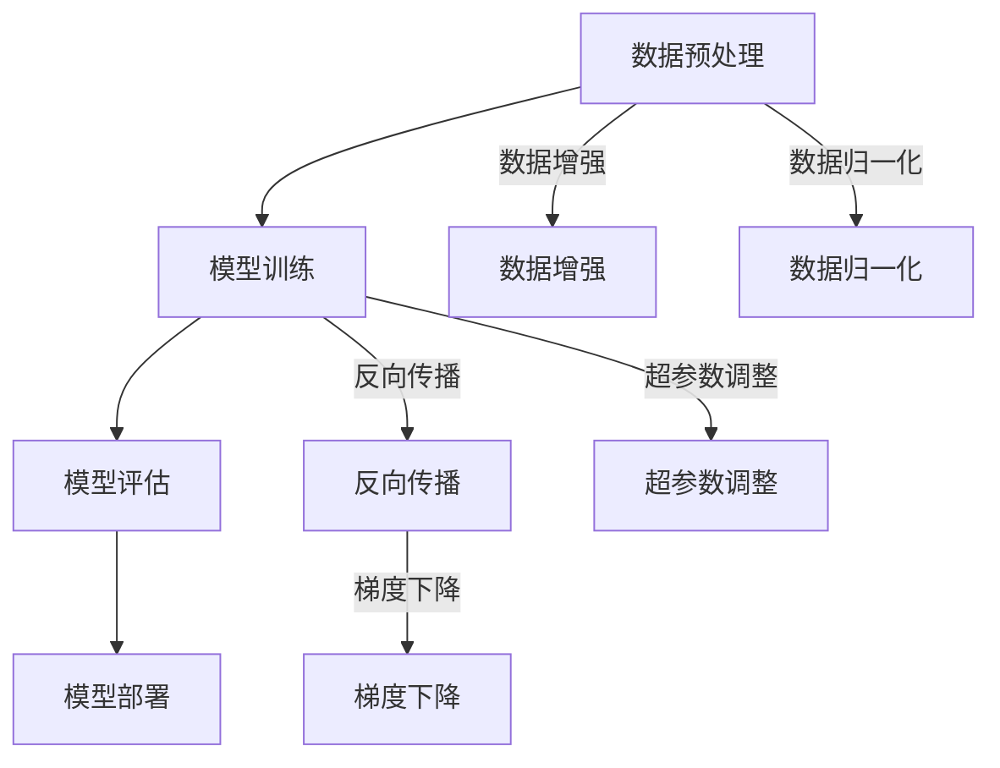

                 

在人工智能浪潮的推动下，大模型（如GPT-3、BERT等）正在成为企业创新的核心驱动力。这些强大的模型能够处理海量数据，生成高质量的文本、图像和语音，为各行各业带来前所未有的变革。然而，如何利用这些大模型打造出具有广泛影响力的爆款应用，仍然是许多创业者和技术专家面临的挑战。本文将深入探讨AI大模型创业的方方面面，为读者提供切实可行的策略和指导。

> 关键词：AI大模型，创业，爆款应用，技术，市场，策略

> 摘要：本文首先介绍AI大模型的发展背景和核心概念，随后分析其技术架构和关键算法。接着，探讨如何通过数学模型和具体操作步骤构建高效的大模型，并通过实际项目实例进行详细解读。文章还将探讨大模型在实际应用场景中的表现和未来展望，并推荐相关学习和开发资源。最后，总结未来发展趋势和面临的挑战，为读者提供研究展望。

## 1. 背景介绍

人工智能（AI）的快速发展已经深刻影响了我们的日常生活。从智能家居到自动驾驶，从医疗诊断到金融服务，AI正在成为各个行业创新的重要驱动力。而大模型作为AI技术的核心组成部分，扮演着至关重要的角色。大模型，尤其是基于深度学习的模型，通过大规模数据训练能够达到超越人类专家的性能。这不仅提升了各种任务的自动化水平，也激发了创业者在各领域进行创新的热情。

### 大模型的发展历程

大模型的发展可以追溯到上世纪80年代的神经网络研究。彼时，Rumelhart, Hinton和Williams等人提出了反向传播算法，这一算法的提出标志着神经网络研究的一个重要转折点。尽管在初期，神经网络的性能并不理想，但随着计算能力的提升和算法的优化，神经网络开始展现其强大的潜力。进入21世纪，特别是随着深度学习理论的成熟和大规模数据的可用，深度神经网络逐渐成为AI领域的主流。

2012年，AlexNet在ImageNet竞赛中取得突破性的成绩，标志着深度学习时代的到来。随后，谷歌的Inception、微软的ResNet等模型相继问世，这些模型不仅提高了计算机视觉的性能，也为其他领域的大模型研究奠定了基础。特别是2018年，GPT-2的发布引起了广泛关注，这一模型展示了自然语言处理（NLP）领域的巨大潜力。

### 大模型在各个领域的应用

大模型已经在多个领域取得了显著的成果。在计算机视觉领域，大模型被广泛应用于图像识别、目标检测、视频分析等任务，大大提高了自动化程度和准确率。在自然语言处理领域，大模型能够生成高质量的自然语言文本，应用于机器翻译、文本摘要、问答系统等任务，极大地提升了人机交互的效率。在语音识别领域，大模型能够实现高精度的语音转文本和文本转语音，使得语音助手等应用变得更加智能和人性化。

此外，大模型还在医疗、金融、教育等领域展现出了巨大的潜力。例如，在医疗领域，大模型能够辅助医生进行疾病诊断和治疗方案推荐；在金融领域，大模型能够分析市场趋势和用户行为，为投资决策提供支持；在教育领域，大模型能够生成个性化的教学方案，提高学习效果。

## 2. 核心概念与联系

### 大模型的核心概念

大模型通常指的是由数百万甚至数十亿个参数组成的神经网络模型。这些模型通过大量数据进行训练，能够自动提取特征并学会解决复杂问题。核心概念包括：

- **深度神经网络**：深度神经网络（DNN）是由多层神经元构成的神经网络，通过逐层提取特征，能够处理更加复杂的任务。
- **反向传播算法**：反向传播算法是一种用于训练神经网络的优化算法，通过计算梯度信息，不断调整网络参数，以达到优化模型性能的目的。
- **超参数**：超参数是用于调整模型性能的参数，如学习率、批次大小、正则化强度等。
- **注意力机制**：注意力机制是一种用于提高模型处理复杂任务的性能的技术，通过在处理过程中动态关注重要信息，提高了模型的准确性和效率。

### 大模型的技术架构

大模型的技术架构主要包括以下几个部分：

- **数据预处理**：数据预处理包括数据清洗、数据增强、数据归一化等步骤，以确保模型训练的质量和效率。
- **模型训练**：模型训练是使用大量数据对模型进行训练的过程，通过反向传播算法不断调整模型参数，以达到最优性能。
- **模型评估**：模型评估是使用测试数据对模型进行评估，以判断模型性能是否达到预期目标。
- **模型部署**：模型部署是将训练好的模型部署到实际应用环境中，如服务器、移动设备等。

### 大模型的关键算法

大模型的关键算法包括：

- **深度学习算法**：如卷积神经网络（CNN）、循环神经网络（RNN）、长短期记忆网络（LSTM）等。
- **强化学习算法**：如Q-learning、DQN、PPO等，用于解决动态决策问题。
- **生成对抗网络（GAN）**：用于生成逼真的图像、语音和文本。

### 大模型架构的 Mermaid 流程图

下面是一个简化的Mermaid流程图，展示了大模型的基本架构和关键步骤：



## 3. 核心算法原理 & 具体操作步骤

### 3.1 算法原理概述

大模型的核心算法通常是基于深度学习理论的。深度学习算法通过多层神经网络结构，对数据进行层次化的特征提取和表示。核心原理包括：

- **多层神经网络**：多层神经网络通过逐层提取特征，能够捕捉数据中的复杂结构。
- **前向传播与反向传播**：前向传播是将输入数据通过神经网络的前向路径传播，得到输出结果。反向传播则是通过计算输出结果与真实值的差异，反向传播误差，更新网络参数。
- **优化算法**：如梯度下降、Adam、RMSprop等，用于优化模型参数，以最小化损失函数。

### 3.2 算法步骤详解

以下是构建和训练大模型的详细步骤：

#### 3.2.1 数据预处理

1. **数据收集**：收集用于训练和评估的原始数据。
2. **数据清洗**：去除数据中的噪声和异常值，确保数据的准确性和一致性。
3. **数据增强**：通过旋转、缩放、裁剪等操作，增加数据的多样性，提高模型泛化能力。
4. **数据归一化**：将数据归一化到相同的范围，如[0, 1]，以提高训练效率。

#### 3.2.2 模型构建

1. **选择神经网络架构**：如卷积神经网络（CNN）或循环神经网络（RNN）。
2. **定义损失函数**：如交叉熵损失函数，用于衡量模型预测与真实值之间的差距。
3. **选择优化器**：如Adam优化器，用于调整模型参数，以最小化损失函数。

#### 3.2.3 模型训练

1. **初始化模型参数**：随机初始化模型参数。
2. **前向传播**：将输入数据通过神经网络的前向路径传播，得到输出结果。
3. **计算损失**：使用损失函数计算模型输出结果与真实值之间的差异。
4. **反向传播**：计算梯度信息，并使用优化算法更新模型参数。
5. **迭代训练**：重复上述步骤，直到模型收敛或达到预定的训练次数。

#### 3.2.4 模型评估

1. **验证集评估**：使用验证集评估模型性能，以避免过拟合。
2. **测试集评估**：使用测试集评估模型性能，以衡量模型在未知数据上的表现。

#### 3.2.5 模型部署

1. **模型保存**：将训练好的模型保存为文件。
2. **模型加载**：在实际应用中加载模型，进行预测和决策。

### 3.3 算法优缺点

#### 优点

- **强大的特征提取能力**：通过多层神经网络，大模型能够自动提取数据中的复杂特征，提高模型性能。
- **泛化能力强**：通过大量数据训练，大模型具有良好的泛化能力，能够在未知数据上取得良好的表现。
- **灵活的应用场景**：大模型可以应用于多种任务，如图像识别、自然语言处理、语音识别等。

#### 缺点

- **训练成本高**：大模型需要大量计算资源和时间进行训练，成本较高。
- **过拟合风险**：大模型容易过拟合，特别是在训练数据量有限的情况下。
- **解释性差**：大模型的决策过程较为复杂，难以进行解释，影响其在某些领域的应用。

### 3.4 算法应用领域

大模型在以下领域取得了显著的应用成果：

- **计算机视觉**：用于图像识别、目标检测、视频分析等任务。
- **自然语言处理**：用于文本分类、情感分析、机器翻译、问答系统等任务。
- **语音识别**：用于语音转文本、语音合成、语音助手等任务。
- **医疗诊断**：用于疾病诊断、药物研发、医学图像分析等任务。
- **金融分析**：用于市场预测、风险管理、欺诈检测等任务。
- **教育领域**：用于智能推荐、个性化教学、学习效果评估等任务。

## 4. 数学模型和公式 & 详细讲解 & 举例说明

### 4.1 数学模型构建

在构建大模型时，我们需要定义一系列数学模型和公式，用于描述模型的输入、输出、损失函数和优化过程。以下是一个简化的数学模型示例：

#### 4.1.1 输入和输出

假设我们有一个输入向量 $x \in \mathbb{R}^n$ 和一个输出向量 $y \in \mathbb{R}^m$。输入向量 $x$ 可以表示为一系列特征的集合，输出向量 $y$ 可以表示为一系列标签的集合。

#### 4.1.2 损失函数

常见的损失函数包括均方误差（MSE）、交叉熵（Cross-Entropy）等。以下是一个MSE损失函数的例子：

$$
L(y, \hat{y}) = \frac{1}{2} \sum_{i=1}^{m} (y_i - \hat{y}_i)^2
$$

其中，$y$ 是真实标签，$\hat{y}$ 是模型预测的标签。

#### 4.1.3 激活函数

激活函数用于引入非线性因素，常见的激活函数包括Sigmoid、ReLU等。以下是一个ReLU激活函数的例子：

$$
\text{ReLU}(x) = \max(0, x)
$$

### 4.2 公式推导过程

在构建和训练大模型时，我们需要使用一系列数学公式来推导模型参数的更新过程。以下是一个简化的推导过程：

#### 4.2.1 前向传播

假设我们有一个多层神经网络，包括输入层、隐藏层和输出层。输入层接收输入向量 $x$，隐藏层通过激活函数 $a_i$ 提取特征，输出层生成预测结果 $\hat{y}$。

前向传播的推导如下：

$$
z_l = \sum_{j=1}^{n_l} w_{lj} a_{j}^{l-1} + b_l \\
a_l = \text{ReLU}(z_l)
$$

其中，$z_l$ 是第 $l$ 层的输入，$a_l$ 是第 $l$ 层的输出，$w_{lj}$ 是第 $l$ 层到第 $l+1$ 层的权重，$b_l$ 是第 $l$ 层的偏置。

#### 4.2.2 反向传播

反向传播用于计算模型参数的梯度，以更新模型参数。以下是一个简化的反向传播推导：

$$
\frac{\partial L}{\partial w_{lj}} = \frac{\partial L}{\partial z_l} \frac{\partial z_l}{\partial w_{lj}} \\
\frac{\partial L}{\partial b_l} = \frac{\partial L}{\partial z_l} \frac{\partial z_l}{\partial b_l}
$$

其中，$\frac{\partial L}{\partial w_{lj}}$ 和 $\frac{\partial L}{\partial b_l}$ 分别是权重 $w_{lj}$ 和偏置 $b_l$ 的梯度。

#### 4.2.3 梯度下降

梯度下降是一种常用的优化算法，用于更新模型参数，以最小化损失函数。以下是一个简化的梯度下降推导：

$$
w_{lj}^{new} = w_{lj} - \alpha \frac{\partial L}{\partial w_{lj}} \\
b_l^{new} = b_l - \alpha \frac{\partial L}{\partial b_l}
$$

其中，$\alpha$ 是学习率。

### 4.3 案例分析与讲解

#### 4.3.1 图像分类

假设我们要使用卷积神经网络（CNN）进行图像分类。以下是一个简化的案例：

1. **数据预处理**：将图像数据归一化，并将标签转换为独热编码。
2. **模型构建**：构建一个CNN模型，包括卷积层、池化层和全连接层。
3. **模型训练**：使用训练数据对模型进行训练，使用交叉熵损失函数和Adam优化器。
4. **模型评估**：使用验证集评估模型性能，调整超参数以优化模型。

#### 4.3.2 自然语言处理

假设我们要使用循环神经网络（RNN）进行自然语言处理。以下是一个简化的案例：

1. **数据预处理**：将文本数据转换为词向量，并添加序列维度。
2. **模型构建**：构建一个RNN模型，包括嵌入层、RNN层和全连接层。
3. **模型训练**：使用训练数据对模型进行训练，使用交叉熵损失函数和Adam优化器。
4. **模型评估**：使用验证集评估模型性能，调整超参数以优化模型。

## 5. 项目实践：代码实例和详细解释说明

### 5.1 开发环境搭建

在开始构建大模型项目之前，我们需要搭建一个合适的技术环境。以下是一个基于Python的TensorFlow库的示例：

```python
# 安装TensorFlow库
!pip install tensorflow

# 导入必要的库
import tensorflow as tf
from tensorflow.keras.layers import Conv2D, MaxPooling2D, Flatten, Dense
from tensorflow.keras.models import Sequential

# 设置随机种子，以保证实验可复现
tf.random.set_seed(42)
```

### 5.2 源代码详细实现

以下是一个使用TensorFlow构建图像分类模型的示例：

```python
# 创建一个简单的CNN模型
model = Sequential([
    Conv2D(32, (3, 3), activation='relu', input_shape=(28, 28, 1)),
    MaxPooling2D((2, 2)),
    Conv2D(64, (3, 3), activation='relu'),
    MaxPooling2D((2, 2)),
    Flatten(),
    Dense(128, activation='relu'),
    Dense(10, activation='softmax')
])

# 编译模型，指定优化器和损失函数
model.compile(optimizer='adam',
              loss='categorical_crossentropy',
              metrics=['accuracy'])

# 加载数据集
(x_train, y_train), (x_test, y_test) = tf.keras.datasets.mnist.load_data()
x_train = x_train.astype('float32') / 255.0
x_test = x_test.astype('float32') / 255.0
y_train = tf.keras.utils.to_categorical(y_train, 10)
y_test = tf.keras.utils.to_categorical(y_test, 10)

# 训练模型
model.fit(x_train, y_train, batch_size=64, epochs=10, validation_data=(x_test, y_test))

# 评估模型
model.evaluate(x_test, y_test)
```

### 5.3 代码解读与分析

1. **模型构建**：使用`Sequential`模型定义一个简单的卷积神经网络，包括两个卷积层、两个池化层、一个全连接层和一个输出层。
2. **编译模型**：指定优化器（Adam）和损失函数（categorical_crossentropy，用于多分类问题）。
3. **数据预处理**：加载数据集，并对数据进行归一化和标签转换。
4. **模型训练**：使用训练数据对模型进行训练，设置批次大小和训练轮次。
5. **模型评估**：使用测试数据评估模型性能，计算损失和准确率。

### 5.4 运行结果展示

```python
# 输出训练结果
print(model.history.history)

# 输出测试结果
predictions = model.predict(x_test)
print(predictions[:10])

# 输出预测结果
predicted_labels = np.argmax(predictions, axis=1)
print(predicted_labels[:10])
```

通过上述代码，我们可以观察到模型的训练过程和测试结果。在实际应用中，可以根据需求调整模型的架构、超参数和训练策略，以提高模型性能。

## 6. 实际应用场景

大模型在各个领域展现了巨大的应用潜力，以下是一些具体的实际应用场景：

### 6.1 医疗领域

大模型在医疗领域具有广泛的应用前景。例如，在疾病诊断方面，大模型可以通过分析医学影像数据，帮助医生进行早期诊断和精准治疗。在药物研发方面，大模型可以加速新药发现过程，通过分析大量生物数据和化学结构，预测药物的疗效和副作用。

### 6.2 金融领域

大模型在金融领域也有广泛应用。例如，在市场预测方面，大模型可以通过分析历史数据和实时信息，预测股票价格、汇率变动等市场趋势。在风险管理方面，大模型可以识别欺诈行为，降低金融机构的风险。

### 6.3 教育领域

在教育领域，大模型可以用于智能推荐、个性化教学和学习效果评估。例如，通过分析学生的学习行为和成绩，大模型可以为学生提供个性化的学习建议，提高学习效果。在在线教育平台中，大模型可以用于自动生成教学视频和习题，提高教学效率。

### 6.4 工业制造领域

在工业制造领域，大模型可以用于质量控制、设备维护和供应链管理。例如，通过分析生产线数据，大模型可以预测设备故障，提前进行维护，减少停机时间。在供应链管理中，大模型可以优化库存管理，降低成本，提高供应链效率。

## 7. 未来应用展望

随着大模型技术的不断进步，未来将在更多领域产生深远影响。以下是一些未来应用展望：

### 7.1 智能家居

智能家居将成为大模型的重要应用场景。通过大模型，智能家居系统可以更好地理解和响应用户的请求，提供个性化服务。例如，智能音箱可以通过大模型实现更加自然和流畅的语音交互，智能门锁可以通过大模型实现更加安全和便捷的访问控制。

### 7.2 自动驾驶

自动驾驶是另一个具有巨大潜力的应用领域。大模型可以用于实时感知环境、规划行驶路径和决策驾驶行为。通过大模型，自动驾驶车辆可以实现更高的安全性和可靠性，减少交通事故，提高道路通行效率。

### 7.3 医疗辅助

大模型在医疗辅助方面的应用将继续扩展。例如，通过大模型，医生可以更准确地诊断疾病，制定治疗方案。此外，大模型还可以辅助医学研究，通过分析大量临床数据和文献，发现新的医学知识和治疗方法。

### 7.4 金融科技

大模型在金融科技领域的应用也将不断深入。例如，通过大模型，金融机构可以更好地了解用户需求，提供个性化的金融产品和服务。此外，大模型可以用于风险评估、欺诈检测和投资决策，提高金融行业的效率和安全性。

## 8. 工具和资源推荐

### 8.1 学习资源推荐

- **书籍**：
  - 《深度学习》（Goodfellow, Bengio, Courville）
  - 《Python机器学习》（Sebastian Raschka）
  - 《动手学深度学习》（A Dive into Deep Learning）

- **在线课程**：
  - Coursera的《深度学习》课程
  - edX的《机器学习基础》课程
  - Udacity的《深度学习工程师纳米学位》

### 8.2 开发工具推荐

- **TensorFlow**：Google开发的开源深度学习框架，适用于各种深度学习应用。
- **PyTorch**：Facebook开发的深度学习框架，具有良好的灵活性和易用性。
- **Keras**：基于TensorFlow和Theano的开源深度学习库，简化了深度学习模型构建和训练。

### 8.3 相关论文推荐

- **《Deep Learning Papers Reading Group》**：提供大量深度学习论文的阅读材料和解读。
- **《Neural Networks and Deep Learning》**：Goodfellow等人撰写的经典教材，涵盖深度学习的基础理论和应用。
- **《Natural Language Processing with Deep Learning》**：关于深度学习在自然语言处理领域的应用的论文集。

## 9. 总结：未来发展趋势与挑战

### 9.1 研究成果总结

大模型在人工智能领域取得了显著的成果，不仅在计算机视觉、自然语言处理等领域取得了突破性进展，还在医疗、金融、教育等领域展现出了巨大的潜力。通过大规模数据训练，大模型能够自动提取复杂特征，实现高精度的任务完成。

### 9.2 未来发展趋势

未来，大模型技术将继续快速发展，趋势包括：

- **模型规模扩大**：随着计算能力的提升，大模型的规模将进一步扩大，能够处理更加复杂的任务。
- **算法优化**：研究人员将继续探索新的深度学习算法和优化方法，提高模型性能和效率。
- **跨模态学习**：大模型将能够跨不同模态（如图像、文本、语音）进行学习，实现更加全面的信息处理。

### 9.3 面临的挑战

尽管大模型技术取得了显著成果，但仍面临以下挑战：

- **计算资源需求**：大模型需要大量计算资源和时间进行训练，成本较高。
- **过拟合问题**：大模型容易过拟合，特别是在训练数据量有限的情况下。
- **模型解释性**：大模型的决策过程较为复杂，难以进行解释，影响其在某些领域的应用。
- **数据隐私和安全**：大模型在处理敏感数据时，需要确保数据隐私和安全。

### 9.4 研究展望

未来，研究将继续围绕如何构建高效、可解释和可信赖的大模型展开。同时，随着技术的进步，大模型将在更多领域产生深远影响，推动人工智能技术的发展和应用。研究人员和创业者应紧密关注这些趋势，积极探索新的应用场景和解决方案。

## 附录：常见问题与解答

### 1. 大模型需要多少数据才能训练？

大模型的训练数据量取决于任务和模型的复杂度。通常，需要数百万到数十亿的数据点。对于简单的任务，如图像分类，几千到几万的数据点可能已经足够。但对于复杂的任务，如文本生成和语音识别，需要的数据量更大。

### 2. 如何避免大模型过拟合？

为了避免大模型过拟合，可以采取以下策略：

- **增加训练数据**：通过增加训练数据量，可以提高模型的泛化能力。
- **数据增强**：通过旋转、缩放、裁剪等操作增加数据的多样性，降低过拟合风险。
- **正则化**：使用正则化技术，如L1正则化、L2正则化，惩罚模型参数的绝对值或平方值，减少模型的复杂性。
- **Dropout**：在训练过程中，随机丢弃部分神经元，降低模型的复杂性。

### 3. 大模型的计算资源需求如何？

大模型的计算资源需求取决于模型的规模、训练数据量和训练时间。通常，大模型需要高性能的GPU或TPU进行训练。对于大规模模型，可能需要使用分布式训练技术，将训练任务分配到多个节点上进行并行计算。

### 4. 如何评估大模型的性能？

评估大模型的性能通常包括以下几个方面：

- **准确率**：模型在测试集上的预测准确率，用于衡量模型的分类或回归性能。
- **召回率**：模型能够召回真实正例的比例，用于衡量模型的召回能力。
- **F1分数**：准确率和召回率的加权平均，用于综合衡量模型的性能。
- **损失函数**：训练过程中使用的损失函数，如交叉熵损失函数，用于衡量模型输出与真实值之间的差异。

### 5. 大模型是否容易受到数据隐私和安全问题的挑战？

是的，大模型在处理敏感数据时，确实容易受到数据隐私和安全问题的挑战。为了避免这些问题，可以采取以下措施：

- **数据匿名化**：对敏感数据进行匿名化处理，隐藏个人身份信息。
- **数据加密**：对敏感数据进行加密处理，确保数据在传输和存储过程中的安全性。
- **隐私保护算法**：使用隐私保护算法，如差分隐私，对模型训练过程进行保护，确保数据隐私不被泄露。
- **监管合规**：遵守相关法律法规，确保数据处理的合法性和合规性。

作者：禅与计算机程序设计艺术 / Zen and the Art of Computer Programming

