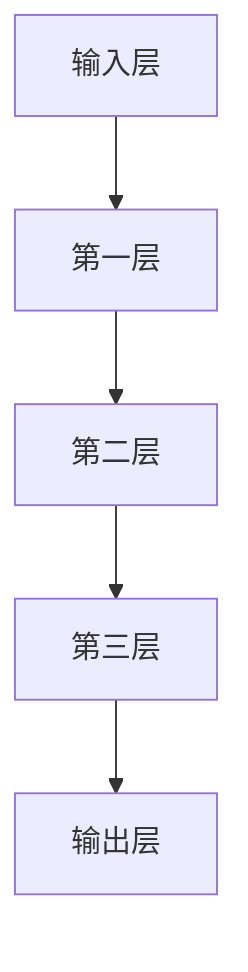

                 

关键词：AI大模型、创业、机遇、技术趋势、商业策略、未来展望

> 摘要：本文将深入探讨AI大模型创业的机遇和挑战，分析其在技术趋势和商业策略中的重要性，并提供实用的创业建议。随着AI技术的迅猛发展，大模型正在重塑各个行业，创业者们如何抓住这一历史性的机遇，成为行业领袖，是本文要探讨的核心问题。

## 1. 背景介绍

近年来，人工智能（AI）技术取得了显著的进展，特别是在深度学习领域的突破，使得AI大模型的研究与应用变得愈发广泛。AI大模型，顾名思义，是指那些具有海量参数和复杂结构的深度学习模型，它们在图像识别、自然语言处理、推荐系统等领域表现出惊人的能力。这些模型的诞生，不仅推动了AI技术的发展，也为创业者提供了前所未有的机遇。

然而，AI大模型的开发和部署面临着诸多挑战。首先是技术挑战，包括模型设计、训练、优化等方面。其次是数据挑战，高质量、标注完备的数据是训练大模型的基石。最后是资源挑战，大模型的训练和部署需要大量的计算资源和高性能硬件支持。

在这样的大背景下，如何抓住AI大模型带来的创业机遇，如何制定有效的商业策略，成为每一个创业者必须面对的问题。

## 2. 核心概念与联系

### 2.1. AI大模型的基本原理

AI大模型是基于深度学习的一种复杂神经网络结构，其核心思想是通过多层非线性变换，将输入数据映射到输出结果。大模型的特点是拥有数百万甚至数十亿个参数，这使得它们能够捕获数据中的复杂模式。

### 2.2. 大模型的架构与联系

为了实现高效的学习和推理，AI大模型通常采用多个层次的结构。每个层次都负责提取不同层次的特征，从底层到高层，逐渐抽象化。这些层次之间的联系，即网络层间的权重和连接方式，决定了模型的性能。

### 2.3. Mermaid流程图展示

下面是一个简化的Mermaid流程图，展示了AI大模型的基本架构：



在这个流程图中，`A` 表示输入层，`E` 表示输出层，中间的 `B`、`C` 和 `D` 表示隐藏层。每个层都通过权重矩阵进行前向传播，最终在输出层得到预测结果。

## 3. 核心算法原理 & 具体操作步骤

### 3.1. 算法原理概述

AI大模型的核心算法是深度学习，特别是基于反向传播（Backpropagation）的优化方法。反向传播算法通过计算损失函数的梯度，逐步调整网络权重，以最小化损失函数。

### 3.2. 算法步骤详解

1. **初始化模型参数**：随机初始化模型的权重和偏置。
2. **前向传播**：输入数据通过网络，计算每个层的输出。
3. **计算损失**：通过输出与真实标签的比较，计算损失函数值。
4. **反向传播**：计算每个层输入的梯度，并更新权重和偏置。
5. **迭代训练**：重复步骤2-4，直至满足停止条件（如达到预设的损失阈值或迭代次数）。

### 3.3. 算法优缺点

**优点**：
- 高效性：深度学习模型能够自动提取特征，减少人工干预。
- 泛化能力：通过大量训练数据，模型能够泛化到未见过的数据。

**缺点**：
- 计算资源需求大：大模型的训练需要大量的计算资源和时间。
- 数据需求高：高质量、标注完备的数据是训练大模型的必要条件。

### 3.4. 算法应用领域

AI大模型在各个领域都有广泛的应用，包括但不限于：
- 图像识别：例如，人脸识别、物体检测。
- 自然语言处理：例如，机器翻译、文本生成。
- 推荐系统：例如，商品推荐、内容推荐。

## 4. 数学模型和公式 & 详细讲解 & 举例说明

### 4.1. 数学模型构建

在深度学习中，常用的数学模型是多层感知机（MLP）。MLP的输出可以通过以下公式表示：

$$
y = \sigma(W_n \cdot a_{n-1} + b_n)
$$

其中，$y$ 是输出，$W_n$ 是第 $n$ 层的权重矩阵，$a_{n-1}$ 是前一层的输出，$b_n$ 是第 $n$ 层的偏置，$\sigma$ 是激活函数，常用的激活函数有ReLU、Sigmoid、Tanh等。

### 4.2. 公式推导过程

以ReLU激活函数为例，其推导过程如下：

1. **初始化权重和偏置**：随机初始化 $W_n$ 和 $b_n$。
2. **前向传播**：计算每一层的输出。
3. **计算损失**：使用交叉熵损失函数计算损失。
4. **反向传播**：计算每个层的梯度。
5. **更新权重和偏置**：使用梯度下降法更新 $W_n$ 和 $b_n$。

### 4.3. 案例分析与讲解

假设我们有一个简单的二分类问题，输入数据是 $(x, y)$，其中 $x$ 是特征向量，$y$ 是标签（0或1）。我们使用一个包含两个隐藏层的MLP进行训练。

- **输入层**：$x$。
- **第一层**：使用ReLU激活函数。
- **第二层**：使用ReLU激活函数。
- **输出层**：使用Sigmoid激活函数，输出概率 $y'$。

### 4.4. 代码实现

下面是使用Python实现的简单MLP代码：

```python
import numpy as np
import tensorflow as tf

# 初始化模型参数
W1 = np.random.randn(input_dim, hidden1_dim)
b1 = np.random.randn(hidden1_dim)
W2 = np.random.randn(hidden1_dim, hidden2_dim)
b2 = np.random.randn(hidden2_dim)
W3 = np.random.randn(hidden2_dim, output_dim)
b3 = np.random.randn(output_dim)

# 定义前向传播函数
def forward(x):
    a1 = np.dot(x, W1) + b1
    z1 = np.maximum(0, a1)
    a2 = np.dot(z1, W2) + b2
    z2 = np.maximum(0, a2)
    y_pred = 1 / (1 + np.exp(-np.dot(z2, W3) - b3))
    return y_pred

# 定义损失函数和反向传播
def loss(y_true, y_pred):
    return -np.mean(y_true * np.log(y_pred) + (1 - y_true) * np.log(1 - y_pred))

# 训练模型
for epoch in range(num_epochs):
    for x_batch, y_batch in data_loader:
        y_pred = forward(x_batch)
        loss_val = loss(y_batch, y_pred)
        print(f"Epoch {epoch}, Loss: {loss_val}")
```

## 5. 项目实践：代码实例和详细解释说明

### 5.1. 开发环境搭建

为了实践AI大模型，我们需要搭建一个合适的开发环境。以下是一个基本的Python开发环境搭建步骤：

1. 安装Python（建议使用3.8以上版本）。
2. 安装TensorFlow（可以使用pip安装：`pip install tensorflow`）。
3. 安装Numpy（可以使用pip安装：`pip install numpy`）。

### 5.2. 源代码详细实现

以下是一个简单的AI大模型实现的代码示例：

```python
import numpy as np
import tensorflow as tf

# 初始化模型参数
input_dim = 10
hidden1_dim = 20
hidden2_dim = 30
output_dim = 1

W1 = tf.random.normal([input_dim, hidden1_dim])
b1 = tf.random.normal([hidden1_dim])
W2 = tf.random.normal([hidden1_dim, hidden2_dim])
b2 = tf.random.normal([hidden2_dim])
W3 = tf.random.normal([hidden2_dim, output_dim])
b3 = tf.random.normal([output_dim])

# 定义前向传播函数
def forward(x):
    a1 = tf.matmul(x, W1) + b1
    z1 = tf.nn.relu(a1)
    a2 = tf.matmul(z1, W2) + b2
    z2 = tf.nn.relu(a2)
    y_pred = tf.nn.sigmoid(tf.matmul(z2, W3) + b3)
    return y_pred

# 定义损失函数和反向传播
def loss(y_true, y_pred):
    return tf.reduce_mean(tf.nn.sigmoid_cross_entropy_with_logits(logits=y_pred, labels=y_true))

# 训练模型
optimizer = tf.optimizers.Adam()

for epoch in range(1000):
    with tf.GradientTape() as tape:
        y_pred = forward(x)
        loss_val = loss(y_true, y_pred)
    grads = tape.gradient(loss_val, [W1, b1, W2, b2, W3, b3])
    optimizer.apply_gradients(zip(grads, [W1, b1, W2, b2, W3, b3]))

    if epoch % 100 == 0:
        print(f"Epoch {epoch}, Loss: {loss_val.numpy()}")
```

### 5.3. 代码解读与分析

- **模型参数初始化**：我们使用随机初始化权重和偏置，这是深度学习中的一个常见做法。
- **前向传播**：输入数据通过多层感知机网络，每一层都使用ReLU激活函数，最后输出概率。
- **损失函数和反向传播**：我们使用sigmoid交叉熵损失函数和反向传播算法来优化模型。

### 5.4. 运行结果展示

运行上述代码后，我们可以看到模型在训练过程中的损失逐渐降低。这表明模型正在学习数据中的模式。

## 6. 实际应用场景

AI大模型在各个领域都有广泛的应用，以下是一些实际应用场景：

- **医疗**：AI大模型可以用于疾病诊断、药物研发、个性化治疗等。
- **金融**：AI大模型可以用于风险管理、信用评分、投资组合优化等。
- **零售**：AI大模型可以用于商品推荐、库存管理、需求预测等。
- **教育**：AI大模型可以用于智能教学、个性化学习、考试评分等。

## 7. 工具和资源推荐

### 7.1. 学习资源推荐

- 《深度学习》（Goodfellow、Bengio、Courville 著）：这是深度学习的经典教材，适合初学者和进阶者。
- 《AI应用实践指南》（吴恩达 著）：这本书详细介绍了如何将AI应用于实际场景。

### 7.2. 开发工具推荐

- TensorFlow：这是Google开发的开源深度学习框架，功能强大，适合各种规模的AI项目。
- PyTorch：这是Facebook开发的开源深度学习框架，灵活性强，适合快速原型开发。

### 7.3. 相关论文推荐

- "Deep Learning Text Classification using Neural Networks"：这篇论文介绍了如何使用神经网络进行文本分类。
- "Generative Adversarial Networks": 这篇论文提出了生成对抗网络（GAN），是当前图像生成领域的重要方法。

## 8. 总结：未来发展趋势与挑战

AI大模型作为人工智能的核心技术，正日益成为各个行业的关键驱动力。在未来，我们可以预见以下几个发展趋势：

1. **技术突破**：随着计算能力的提升和算法的创新，AI大模型的性能将进一步提升。
2. **应用拓展**：AI大模型将深入到更多领域，如生物、农业、能源等，为人类带来更多便利。
3. **生态构建**：围绕AI大模型的产业链将逐步形成，包括硬件、软件、数据、服务等各个方面。

然而，AI大模型的发展也面临诸多挑战：

1. **数据质量**：高质量、标注完备的数据是训练AI大模型的基石，然而当前数据质量和标注水平参差不齐。
2. **计算资源**：大模型的训练和部署需要大量的计算资源，这对于很多企业和机构来说是一个巨大的挑战。
3. **伦理和法律**：AI大模型的应用涉及到隐私保护、算法公平性等问题，需要制定相应的伦理和法律规范。

总之，AI大模型创业既充满机遇，也充满挑战。创业者们需要紧跟技术发展趋势，制定有效的商业策略，同时关注伦理和法律问题，才能抓住这一历史性的机遇，成为行业领袖。

## 9. 附录：常见问题与解答

### Q1. 如何选择合适的AI大模型架构？

A1. 选择AI大模型架构时，需要考虑以下几个因素：
- **任务类型**：不同类型的任务（如图像识别、文本分类、语音识别等）可能需要不同类型的模型。
- **数据量**：大量数据可能需要更复杂的模型，而少量数据可能需要简化模型。
- **计算资源**：大型模型可能需要更多的计算资源，需要根据实际情况进行选择。
- **预训练模型**：使用预训练模型可以节省训练时间和计算资源，提高模型性能。

### Q2. 如何处理AI大模型训练中的数据标注问题？

A2. 数据标注是AI大模型训练中的关键步骤，以下是一些处理数据标注问题的方法：
- **自动化标注**：使用自动标注工具，如OCR、语音识别等，减少人工标注工作量。
- **半监督学习**：利用未标注的数据，结合少量标注数据训练模型，可以提高模型性能。
- **众包标注**：将标注任务分发给众包平台，如Amazon Mechanical Turk，可以快速获得大量标注数据。

### Q3. AI大模型在商业应用中的挑战是什么？

A3. AI大模型在商业应用中面临的挑战主要包括：
- **数据隐私**：需要确保数据安全和隐私保护。
- **模型解释性**：需要提高模型的解释性，使其在商业应用中更加透明和可信赖。
- **算法公平性**：需要确保算法在不同人群中的公平性，避免歧视和偏见。
- **监管合规**：需要遵守相关法规和标准，确保商业应用合法合规。

### Q4. 如何评估AI大模型的效果？

A4. 评估AI大模型的效果通常包括以下几个方面：
- **准确性**：模型预测结果与真实结果的匹配程度。
- **召回率**：模型识别出的正例中真实正例的比例。
- **F1分数**：综合考虑准确性和召回率的指标，计算公式为 $F1 = 2 \times \frac{准确率 \times 召回率}{准确率 + 召回率}$。
- **AUC（Area Under Curve）**：ROC曲线下的面积，用于评估分类器的分类能力。

### Q5. 如何优化AI大模型的训练速度？

A5. 优化AI大模型训练速度的方法包括：
- **数据预处理**：对数据进行预处理，减少训练过程中的计算量。
- **批量大小调整**：适当调整批量大小，可以在计算效率和训练效果之间取得平衡。
- **并行计算**：使用GPU、TPU等硬件加速计算。
- **模型剪枝**：通过剪枝技术去除不重要的神经元和连接，减少模型参数数量。

---

作者：禅与计算机程序设计艺术 / Zen and the Art of Computer Programming

