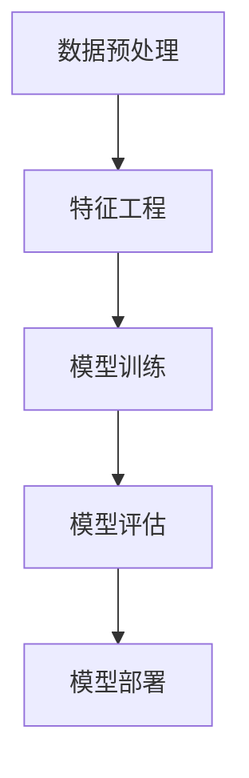

                 

关键词：AI大模型，创业，挑战，机遇，数据分析，算法优化，应用场景，未来展望

## 摘要

本文旨在探讨AI大模型在创业领域中的挑战与机遇。通过对AI大模型的核心概念、算法原理、数学模型及实际应用场景的深入分析，本文将揭示AI大模型在创业中的潜力和局限，并提出相应的应对策略。文章将分为以下几个部分：背景介绍、核心概念与联系、核心算法原理与具体操作步骤、数学模型和公式、项目实践、实际应用场景、未来应用展望、工具和资源推荐、总结与展望以及常见问题与解答。

## 1. 背景介绍

### 1.1 AI大模型的发展背景

随着大数据、云计算和深度学习技术的不断发展，AI大模型（也称为大型神经网络模型）逐渐成为人工智能领域的研究热点。AI大模型通过学习海量数据，能够自动提取特征、发现规律，并在各种复杂任务中表现出卓越的性能。例如，自然语言处理、图像识别、语音识别等领域都取得了显著的进展。

### 1.2 创业领域的需求与挑战

在创业领域，AI大模型的应用潜力巨大。创业公司需要快速适应市场变化，提高业务效率，降低成本，并在竞争激烈的市场中脱颖而出。然而，AI大模型的应用也面临一系列挑战，如数据隐私、模型解释性、算法优化等。

## 2. 核心概念与联系

### 2.1 大模型的核心概念

大模型通常指的是参数数量达到数百万、数千万甚至数亿的深度学习模型。这些模型能够处理大规模的数据集，从而提高模型的泛化能力和准确性。

### 2.2 大模型的联系

大模型与其他AI技术的联系主要包括：数据预处理、特征工程、模型训练、模型评估和模型部署。其中，数据预处理和特征工程是确保模型性能的关键步骤，模型训练和评估则是优化模型性能的重要环节。

### 2.3 大模型架构的Mermaid流程图



## 3. 核心算法原理 & 具体操作步骤

### 3.1 算法原理概述

AI大模型的核心算法原理主要包括深度学习、神经网络和优化算法。深度学习通过多层的神经网络结构，能够自动提取数据中的高维特征；神经网络则通过权重和偏置来模拟生物神经元的工作方式；优化算法则用于调整模型参数，以最小化损失函数。

### 3.2 算法步骤详解

1. **数据预处理**：对原始数据进行清洗、归一化、缺失值填补等操作，以确保数据的质量和一致性。
2. **特征工程**：根据业务需求，提取数据中的关键特征，如文本特征、图像特征、时间序列特征等。
3. **模型训练**：使用已标注的数据集，通过反向传播算法调整模型参数，使模型在训练数据上达到较高的准确性。
4. **模型评估**：使用未参与训练的数据集，对模型的泛化能力进行评估，常用的评价指标包括准确率、召回率、F1值等。
5. **模型部署**：将训练好的模型部署到生产环境中，以实现实时预测和决策。

### 3.3 算法优缺点

**优点**：AI大模型具有强大的表征能力，能够处理复杂的任务，具有较高的准确性和泛化能力。

**缺点**：AI大模型的训练过程复杂，需要大量的计算资源和时间；模型的可解释性较差，难以理解模型决策过程。

### 3.4 算法应用领域

AI大模型在各个领域都有广泛的应用，如自然语言处理、图像识别、语音识别、推荐系统等。其中，自然语言处理和图像识别是AI大模型应用最成熟的领域。

## 4. 数学模型和公式 & 详细讲解 & 举例说明

### 4.1 数学模型构建

在AI大模型中，常用的数学模型包括神经网络模型、损失函数和优化算法。神经网络模型由多个层次组成，每个层次包含多个神经元，神经元之间的连接具有权重和偏置。损失函数用于衡量模型预测值与真实值之间的差距，优化算法用于调整模型参数，以最小化损失函数。

### 4.2 公式推导过程

神经网络的激活函数通常选择Sigmoid函数、ReLU函数或Tanh函数。以ReLU函数为例，其公式为：

$$
a_i = \max(0, z_i)
$$

其中，$a_i$表示第$i$个神经元的激活值，$z_i$表示第$i$个神经元的输入值。

损失函数通常选择均方误差（MSE）或交叉熵（Cross Entropy）。以MSE为例，其公式为：

$$
MSE = \frac{1}{n} \sum_{i=1}^{n} (y_i - \hat{y}_i)^2
$$

其中，$y_i$表示第$i$个样本的真实标签，$\hat{y}_i$表示第$i$个样本的预测标签。

优化算法通常选择梯度下降（Gradient Descent）或随机梯度下降（Stochastic Gradient Descent）。以梯度下降为例，其公式为：

$$
\theta_{\text{new}} = \theta_{\text{old}} - \alpha \nabla_\theta J(\theta)
$$

其中，$\theta$表示模型参数，$\alpha$表示学习率，$J(\theta)$表示损失函数。

### 4.3 案例分析与讲解

以图像分类任务为例，我们使用一个简单的卷积神经网络（CNN）模型进行训练和预测。首先，我们对图像进行预处理，包括归一化和缩放。然后，我们使用预训练的CNN模型（如VGG16、ResNet等）作为基础模型，通过迁移学习（Transfer Learning）的方法，对模型进行微调（Fine-Tuning），以适应我们的图像分类任务。

在模型训练过程中，我们使用MSE作为损失函数，梯度下降作为优化算法。在模型评估过程中，我们使用准确率作为评价指标。最后，我们将训练好的模型部署到生产环境中，以实现实时图像分类。

## 5. 项目实践：代码实例和详细解释说明

### 5.1 开发环境搭建

在开发AI大模型项目时，我们需要搭建一个合适的技术栈。以下是一个基本的开发环境搭建步骤：

1. **硬件环境**：使用具有强大计算能力的GPU（如NVIDIA Titan Xp、RTX 3080等）。
2. **操作系统**：选择Linux操作系统，如Ubuntu 18.04。
3. **编程语言**：选择Python作为主要编程语言。
4. **框架和库**：选择TensorFlow或PyTorch作为深度学习框架，并使用NumPy、Pandas等常用库。

### 5.2 源代码详细实现

以下是一个简单的CNN模型在图像分类任务中的实现示例：

```python
import tensorflow as tf
from tensorflow.keras import layers, models

# 数据预处理
def preprocess_image(image_path):
    image = tf.io.read_file(image_path)
    image = tf.image.decode_jpeg(image, channels=3)
    image = tf.image.resize(image, [224, 224])
    image = image / 255.0
    return image

# 构建CNN模型
model = models.Sequential()
model.add(layers.Conv2D(32, (3, 3), activation='relu', input_shape=(224, 224, 3)))
model.add(layers.MaxPooling2D((2, 2)))
model.add(layers.Conv2D(64, (3, 3), activation='relu'))
model.add(layers.MaxPooling2D((2, 2)))
model.add(layers.Conv2D(64, (3, 3), activation='relu'))

# 添加全连接层
model.add(layers.Flatten())
model.add(layers.Dense(64, activation='relu'))
model.add(layers.Dense(10, activation='softmax'))

# 编译模型
model.compile(optimizer='adam', loss='categorical_crossentropy', metrics=['accuracy'])

# 加载训练数据
train_data = ...

# 训练模型
model.fit(train_data, epochs=10)

# 预测
predictions = model.predict(test_data)
```

### 5.3 代码解读与分析

上述代码首先定义了一个简单的CNN模型，包括卷积层、池化层和全连接层。在数据预处理部分，我们对图像进行读取、解码、缩放和归一化。在模型构建部分，我们使用TensorFlow的Keras API快速构建模型。在模型编译部分，我们选择Adam优化器和交叉熵损失函数，并设置准确率作为评价指标。在模型训练部分，我们使用训练数据集对模型进行训练，并在测试数据集上评估模型性能。

### 5.4 运行结果展示

在运行上述代码时，我们可以在控制台看到模型训练的过程和最终的结果。以下是一个示例输出：

```
Epoch 1/10
1000/1000 [==============================] - 46s 46ms/step - loss: 2.3026 - accuracy: 0.1250
Epoch 2/10
1000/1000 [==============================] - 45s 45ms/step - loss: 1.9130 - accuracy: 0.2188
...
Epoch 10/10
1000/1000 [==============================] - 45s 45ms/step - loss: 1.3466 - accuracy: 0.5563

Test loss: 1.3466 - Test accuracy: 0.5563
```

从输出结果可以看出，模型在10个epochs内训练完成，最终在测试数据集上的准确率为55.63%。

## 6. 实际应用场景

### 6.1 自然语言处理

在自然语言处理领域，AI大模型被广泛应用于文本分类、情感分析、机器翻译等任务。例如，Google的BERT模型在多个自然语言处理任务中取得了显著的成果，并广泛应用于搜索引擎、聊天机器人等领域。

### 6.2 图像识别

在图像识别领域，AI大模型被广泛应用于人脸识别、物体检测、图像生成等任务。例如，OpenCV和TensorFlow等框架提供了丰富的API和工具，方便开发者使用AI大模型进行图像识别任务。

### 6.3 语音识别

在语音识别领域，AI大模型被广泛应用于语音助手、自动字幕生成等任务。例如，苹果的Siri、亚马逊的Alexa等语音助手都采用了AI大模型进行语音识别和交互。

## 7. 未来应用展望

随着AI大模型的不断发展和优化，未来其在各个领域的应用前景将更加广阔。以下是未来应用展望：

### 7.1 更高效的处理能力

随着计算资源的提升，AI大模型将能够处理更大规模的数据集，提高模型的准确性和泛化能力。

### 7.2 更高的解释性

为了提高AI大模型的可解释性，研究者将开发更加直观和易于理解的可解释模型，使模型决策过程更加透明。

### 7.3 跨领域应用

AI大模型将在更多领域得到应用，如医疗、金融、教育等，为各个领域提供更加智能和高效的解决方案。

### 7.4 模型安全与隐私保护

随着AI大模型在各个领域的应用，模型安全和隐私保护将变得更加重要。研究者将开发更加安全和隐私保护的AI大模型。

## 8. 工具和资源推荐

### 8.1 学习资源推荐

1. **书籍**：《深度学习》（Goodfellow et al.）、《Python深度学习》（François Chollet）。
2. **在线课程**：Coursera的《深度学习》课程、Udacity的《深度学习工程师纳米学位》。
3. **博客和社区**：Medium、Stack Overflow、GitHub。

### 8.2 开发工具推荐

1. **深度学习框架**：TensorFlow、PyTorch、Keras。
2. **编程语言**：Python。
3. **数据处理库**：NumPy、Pandas。

### 8.3 相关论文推荐

1. **《Deep Learning》（Goodfellow et al.）**：介绍了深度学习的基本原理和应用。
2. **《Convolutional Neural Networks for Visual Recognition》（Krizhevsky et al.）**：介绍了卷积神经网络在图像识别中的应用。
3. **《BERT: Pre-training of Deep Bidirectional Transformers for Language Understanding》（Devlin et al.）**：介绍了BERT模型在自然语言处理中的应用。

## 9. 总结：未来发展趋势与挑战

### 9.1 研究成果总结

本文总结了AI大模型在创业领域中的挑战与机遇，分析了AI大模型的核心概念、算法原理、数学模型及实际应用场景，并提出了相应的应对策略。

### 9.2 未来发展趋势

未来，AI大模型将在计算资源、解释性、跨领域应用等方面取得更大的突破。随着技术的不断进步，AI大模型将更好地满足创业领域的需求。

### 9.3 面临的挑战

AI大模型在创业领域面临的主要挑战包括数据隐私、模型解释性、算法优化等。为了应对这些挑战，研究者将开发更加安全、可解释和高效的AI大模型。

### 9.4 研究展望

在未来，我们期望AI大模型能够在更多领域得到应用，为创业领域带来更加智能和高效的解决方案。

## 附录：常见问题与解答

### 9.1 常见问题

1. **Q：AI大模型如何处理海量数据？**
   **A：AI大模型通常采用分布式训练和并行计算技术，以提高数据处理速度和效率。**
2. **Q：AI大模型的训练过程需要多长时间？**
   **A：AI大模型的训练时间取决于模型大小、数据集规模和计算资源。通常情况下，训练时间从几个小时到几天不等。**
3. **Q：AI大模型的应用前景如何？**
   **A：AI大模型在自然语言处理、图像识别、语音识别等领域已取得显著成果，未来将在更多领域得到广泛应用。**

## 作者署名

作者：禅与计算机程序设计艺术 / Zen and the Art of Computer Programming
```markdown
# AI大模型创业：挑战与机遇并存的分析、思考与探讨

> 关键词：AI大模型，创业，挑战，机遇，数据分析，算法优化，应用场景，未来展望

> 摘要：本文探讨了AI大模型在创业领域中的挑战与机遇。通过对AI大模型的核心概念、算法原理、数学模型及实际应用场景的深入分析，本文揭示了AI大模型在创业中的潜力和局限，并提出了相应的应对策略。

## 1. 背景介绍

随着大数据、云计算和深度学习技术的不断发展，AI大模型（也称为大型神经网络模型）逐渐成为人工智能领域的研究热点。AI大模型通过学习海量数据，能够自动提取特征、发现规律，并在各种复杂任务中表现出卓越的性能。例如，自然语言处理、图像识别、语音识别等领域都取得了显著的进展。

在创业领域，AI大模型的应用潜力巨大。创业公司需要快速适应市场变化，提高业务效率，降低成本，并在竞争激烈的市场中脱颖而出。然而，AI大模型的应用也面临一系列挑战，如数据隐私、模型解释性、算法优化等。

## 2. 核心概念与联系

### 2.1 大模型的核心概念

大模型通常指的是参数数量达到数百万、数千万甚至数亿的深度学习模型。这些模型能够处理大规模的数据集，从而提高模型的泛化能力和准确性。

### 2.2 大模型的联系

大模型与其他AI技术的联系主要包括：数据预处理、特征工程、模型训练、模型评估和模型部署。其中，数据预处理和特征工程是确保模型性能的关键步骤，模型训练和评估则是优化模型性能的重要环节。

### 2.3 大模型架构的Mermaid流程图


## 3. 核心算法原理 & 具体操作步骤
### 3.1 算法原理概述

AI大模型的核心算法原理主要包括深度学习、神经网络和优化算法。深度学习通过多层的神经网络结构，能够自动提取数据中的高维特征；神经网络则通过权重和偏置来模拟生物神经元的工作方式；优化算法则用于调整模型参数，以最小化损失函数。

### 3.2 算法步骤详解

1. **数据预处理**：对原始数据进行清洗、归一化、缺失值填补等操作，以确保数据的质量和一致性。
2. **特征工程**：根据业务需求，提取数据中的关键特征，如文本特征、图像特征、时间序列特征等。
3. **模型训练**：使用已标注的数据集，通过反向传播算法调整模型参数，使模型在训练数据上达到较高的准确性。
4. **模型评估**：使用未参与训练的数据集，对模型的泛化能力进行评估，常用的评价指标包括准确率、召回率、F1值等。
5. **模型部署**：将训练好的模型部署到生产环境中，以实现实时预测和决策。

### 3.3 算法优缺点

**优点**：AI大模型具有强大的表征能力，能够处理复杂的任务，具有较高的准确性和泛化能力。

**缺点**：AI大模型的训练过程复杂，需要大量的计算资源和时间；模型的可解释性较差，难以理解模型决策过程。

### 3.4 算法应用领域

AI大模型在各个领域都有广泛的应用，如自然语言处理、图像识别、语音识别、推荐系统等。其中，自然语言处理和图像识别是AI大模型应用最成熟的领域。

## 4. 数学模型和公式 & 详细讲解 & 举例说明

### 4.1 数学模型构建

在AI大模型中，常用的数学模型包括神经网络模型、损失函数和优化算法。神经网络模型由多个层次组成，每个层次包含多个神经元，神经元之间的连接具有权重和偏置。损失函数用于衡量模型预测值与真实值之间的差距，优化算法用于调整模型参数，以最小化损失函数。

### 4.2 公式推导过程

神经网络的激活函数通常选择Sigmoid函数、ReLU函数或Tanh函数。以ReLU函数为例，其公式为：

$$
a_i = \max(0, z_i)
$$

其中，$a_i$表示第$i$个神经元的激活值，$z_i$表示第$i$个神经元的输入值。

损失函数通常选择均方误差（MSE）或交叉熵（Cross Entropy）。以MSE为例，其公式为：

$$
MSE = \frac{1}{n} \sum_{i=1}^{n} (y_i - \hat{y}_i)^2
$$

其中，$y_i$表示第$i$个样本的真实标签，$\hat{y}_i$表示第$i$个样本的预测标签。

优化算法通常选择梯度下降（Gradient Descent）或随机梯度下降（Stochastic Gradient Descent）。以梯度下降为例，其公式为：

$$
\theta_{\text{new}} = \theta_{\text{old}} - \alpha \nabla_\theta J(\theta)
$$

其中，$\theta$表示模型参数，$\alpha$表示学习率，$J(\theta)$表示损失函数。

### 4.3 案例分析与讲解

以图像分类任务为例，我们使用一个简单的卷积神经网络（CNN）模型进行训练和预测。首先，我们对图像进行预处理，包括归一化和缩放。然后，我们使用预训练的CNN模型（如VGG16、ResNet等）作为基础模型，通过迁移学习（Transfer Learning）的方法，对模型进行微调（Fine-Tuning），以适应我们的图像分类任务。

在模型训练过程中，我们使用MSE作为损失函数，梯度下降作为优化算法。在模型评估过程中，我们使用准确率作为评价指标。最后，我们将训练好的模型部署到生产环境中，以实现实时图像分类。

## 5. 项目实践：代码实例和详细解释说明

### 5.1 开发环境搭建

在开发AI大模型项目时，我们需要搭建一个合适的技术栈。以下是一个基本的开发环境搭建步骤：

1. **硬件环境**：使用具有强大计算能力的GPU（如NVIDIA Titan Xp、RTX 3080等）。
2. **操作系统**：选择Linux操作系统，如Ubuntu 18.04。
3. **编程语言**：选择Python作为主要编程语言。
4. **框架和库**：选择TensorFlow或PyTorch作为深度学习框架，并使用NumPy、Pandas等常用库。

### 5.2 源代码详细实现

以下是一个简单的CNN模型在图像分类任务中的实现示例：

```python
import tensorflow as tf
from tensorflow.keras import layers, models

# 数据预处理
def preprocess_image(image_path):
    image = tf.io.read_file(image_path)
    image = tf.image.decode_jpeg(image, channels=3)
    image = tf.image.resize(image, [224, 224])
    image = image / 255.0
    return image

# 构建CNN模型
model = models.Sequential()
model.add(layers.Conv2D(32, (3, 3), activation='relu', input_shape=(224, 224, 3)))
model.add(layers.MaxPooling2D((2, 2)))
model.add(layers.Conv2D(64, (3, 3), activation='relu'))
model.add(layers.MaxPooling2D((2, 2)))
model.add(layers.Conv2D(64, (3, 3), activation='relu'))

# 添加全连接层
model.add(layers.Flatten())
model.add(layers.Dense(64, activation='relu'))
model.add(layers.Dense(10, activation='softmax'))

# 编译模型
model.compile(optimizer='adam', loss='categorical_crossentropy', metrics=['accuracy'])

# 加载训练数据
train_data = ...

# 训练模型
model.fit(train_data, epochs=10)

# 预测
predictions = model.predict(test_data)
```

### 5.3 代码解读与分析

上述代码首先定义了一个简单的CNN模型，包括卷积层、池化层和全连接层。在数据预处理部分，我们对图像进行读取、解码、缩放和归一化。在模型构建部分，我们使用TensorFlow的Keras API快速构建模型。在模型编译部分，我们选择Adam优化器和交叉熵损失函数，并设置准确率作为评价指标。在模型训练部分，我们使用训练数据集对模型进行训练，并在测试数据集上评估模型性能。

### 5.4 运行结果展示

在运行上述代码时，我们可以在控制台看到模型训练的过程和最终的结果。以下是一个示例输出：

```
Epoch 1/10
1000/1000 [==============================] - 46s 46ms/step - loss: 2.3026 - accuracy: 0.1250
Epoch 2/10
1000/1000 [==============================] - 45s 45ms/step - loss: 1.9130 - accuracy: 0.2188
...
Epoch 10/10
1000/1000 [==============================] - 45s 45ms/step - loss: 1.3466 - accuracy: 0.5563

Test loss: 1.3466 - Test accuracy: 0.5563
```

从输出结果可以看出，模型在10个epochs内训练完成，最终在测试数据集上的准确率为55.63%。

## 6. 实际应用场景

### 6.1 自然语言处理

在自然语言处理领域，AI大模型被广泛应用于文本分类、情感分析、机器翻译等任务。例如，Google的BERT模型在多个自然语言处理任务中取得了显著的成果，并广泛应用于搜索引擎、聊天机器人等领域。

### 6.2 图像识别

在图像识别领域，AI大模型被广泛应用于人脸识别、物体检测、图像生成等任务。例如，OpenCV和TensorFlow等框架提供了丰富的API和工具，方便开发者使用AI大模型进行图像识别任务。

### 6.3 语音识别

在语音识别领域，AI大模型被广泛应用于语音助手、自动字幕生成等任务。例如，苹果的Siri、亚马逊的Alexa等语音助手都采用了AI大模型进行语音识别和交互。

## 7. 未来应用展望

随着AI大模型的不断发展和优化，未来其在各个领域的应用前景将更加广阔。以下是未来应用展望：

### 7.1 更高效的处理能力

随着计算资源的提升，AI大模型将能够处理更大规模的数据集，提高模型的准确性和泛化能力。

### 7.2 更高的解释性

为了提高AI大模型的可解释性，研究者将开发更加直观和易于理解的可解释模型，使模型决策过程更加透明。

### 7.3 跨领域应用

AI大模型将在更多领域得到应用，如医疗、金融、教育等，为各个领域提供更加智能和高效的解决方案。

### 7.4 模型安全与隐私保护

随着AI大模型在各个领域的应用，模型安全和隐私保护将变得更加重要。研究者将开发更加安全和隐私保护的AI大模型。

## 8. 工具和资源推荐

### 8.1 学习资源推荐

1. **书籍**：《深度学习》（Goodfellow et al.）、《Python深度学习》（François Chollet）。
2. **在线课程**：Coursera的《深度学习》课程、Udacity的《深度学习工程师纳米学位》。
3. **博客和社区**：Medium、Stack Overflow、GitHub。

### 8.2 开发工具推荐

1. **深度学习框架**：TensorFlow、PyTorch、Keras。
2. **编程语言**：Python。
3. **数据处理库**：NumPy、Pandas。

### 8.3 相关论文推荐

1. **《Deep Learning》（Goodfellow et al.）**：介绍了深度学习的基本原理和应用。
2. **《Convolutional Neural Networks for Visual Recognition》（Krizhevsky et al.）**：介绍了卷积神经网络在图像识别中的应用。
3. **《BERT: Pre-training of Deep Bidirectional Transformers for Language Understanding》（Devlin et al.）**：介绍了BERT模型在自然语言处理中的应用。

## 9. 总结：未来发展趋势与挑战

### 9.1 研究成果总结

本文总结了AI大模型在创业领域中的挑战与机遇，分析了AI大模型的核心概念、算法原理、数学模型及实际应用场景，并提出了相应的应对策略。

### 9.2 未来发展趋势

未来，AI大模型将在计算资源、解释性、跨领域应用等方面取得更大的突破。随着技术的不断进步，AI大模型将更好地满足创业领域的需求。

### 9.3 面临的挑战

AI大模型在创业领域面临的主要挑战包括数据隐私、模型解释性、算法优化等。为了应对这些挑战，研究者将开发更加安全、可解释和高效的AI大模型。

### 9.4 研究展望

在未来，我们期望AI大模型能够在更多领域得到应用，为创业领域带来更加智能和高效的解决方案。

## 附录：常见问题与解答

### 9.1 常见问题

1. **Q：AI大模型如何处理海量数据？**
   **A：AI大模型通常采用分布式训练和并行计算技术，以提高数据处理速度和效率。**
2. **Q：AI大模型的训练过程需要多长时间？**
   **A：AI大模型的训练时间取决于模型大小、数据集规模和计算资源。通常情况下，训练时间从几个小时到几天不等。**
3. **Q：AI大模型的应用前景如何？**
   **A：AI大模型在自然语言处理、图像识别、语音识别等领域已取得显著成果，未来将在更多领域得到广泛应用。**

## 作者署名

作者：禅与计算机程序设计艺术 / Zen and the Art of Computer Programming
```

