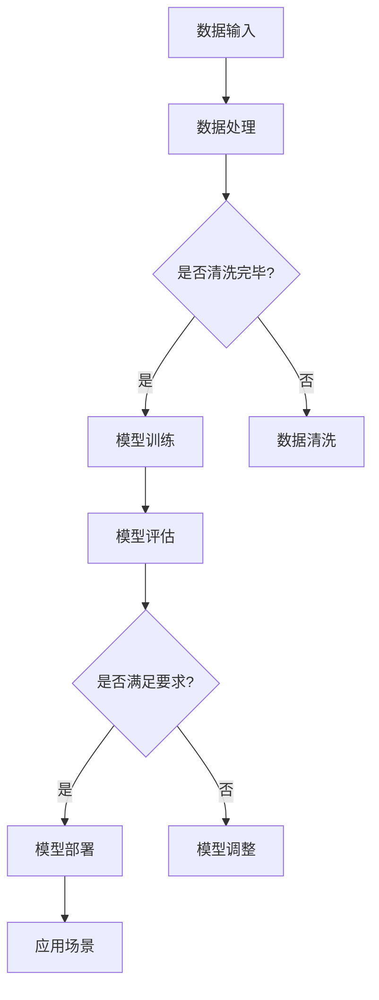

                 

关键词：AI大模型、创业、技术趋势、挑战、机遇、商业模式、未来展望

> 摘要：本文将深入探讨AI大模型创业的现状与趋势，分析其面临的挑战和机遇，并提供相关的技术建议和未来展望。随着人工智能技术的不断进步，大模型的应用场景日益广泛，创业者们纷纷投身于这一领域，试图把握时代的脉搏。本文将结合实际案例，分析大模型创业的可行性和潜在风险，为有意向的创业者提供指导。

## 1. 背景介绍

人工智能（AI）作为当今最具变革性的技术之一，正深刻地影响着各行各业。特别是随着计算能力的提升和大数据的积累，深度学习技术得到了迅猛发展。大模型，作为一种能够处理海量数据和复杂任务的AI模型，已经成为人工智能领域的热门话题。大模型的崛起，不仅推动了AI技术的进步，也为创业带来了前所未有的机遇。

近年来，AI大模型在自然语言处理、计算机视觉、语音识别等领域取得了显著成果。例如，OpenAI的GPT系列模型在文本生成、问答系统等方面展现出了惊人的能力；Google的BERT模型在文本分类、情感分析等领域有着广泛的应用。这些成功案例激发了创业者的热情，使得AI大模型创业成为了一个热门领域。

## 2. 核心概念与联系

### 2.1. 大模型的定义

大模型（Large-scale Model）通常指的是具有数十亿甚至千亿参数的深度神经网络模型。这些模型通过训练大量数据，能够自动地学习并提取数据中的复杂结构和模式。与传统的中小型模型相比，大模型具有更强的表征能力和泛化能力，能够处理更复杂的任务。

### 2.2. 大模型的应用场景

大模型的应用场景非常广泛，包括但不限于以下几个方面：

- **自然语言处理（NLP）**：大模型在文本生成、机器翻译、问答系统等领域有着显著的优势。例如，GPT系列模型在文本生成和问答系统中表现优异。
- **计算机视觉（CV）**：大模型在图像分类、目标检测、图像生成等领域具有强大的能力。例如，Google的BERT模型在图像识别方面也有着广泛的应用。
- **语音识别（ASR）**：大模型能够显著提高语音识别的准确率和效率，广泛应用于智能助手、语音识别应用等领域。
- **推荐系统**：大模型能够通过分析用户行为数据，提供更精准的个性化推荐。

### 2.3. 大模型与创业的联系

大模型技术的进步为创业者提供了新的机遇。创业者可以通过开发基于大模型的应用，解决实际问题，创造商业价值。例如：

- **智能客服**：利用大模型技术，可以开发出能够自动解答用户问题的智能客服系统，提高企业运营效率。
- **内容创作**：大模型可以帮助创作者生成高质量的文章、视频等内容，降低创作成本。
- **医疗诊断**：大模型在医疗领域的应用，如疾病诊断、治疗方案推荐等，具有巨大的潜力。

### 2.4. Mermaid 流程图

下面是一个关于大模型技术架构的Mermaid流程图：



## 3. 核心算法原理 & 具体操作步骤

### 3.1. 算法原理概述

大模型的核心算法是基于深度学习的神经网络模型。深度学习通过多层的神经网络结构，从数据中自动地学习特征和模式。大模型通常具有数十亿甚至千亿个参数，能够处理复杂的任务。

### 3.2. 算法步骤详解

1. **数据收集与预处理**：收集大量的数据，并对数据进行预处理，包括数据清洗、数据增强等。
2. **模型设计**：设计大模型的结构，包括网络层数、每层神经元的数量等。
3. **模型训练**：使用预处理后的数据训练模型，通过反向传播算法不断调整模型参数，直到满足训练目标。
4. **模型评估**：使用测试数据评估模型性能，确保模型在未知数据上的泛化能力。
5. **模型部署**：将训练好的模型部署到实际应用场景中。

### 3.3. 算法优缺点

**优点**：

- **强大的表征能力**：大模型具有强大的表征能力，能够处理复杂的任务。
- **高效的计算能力**：随着硬件的进步，大模型的计算能力不断提升，能够处理大规模的数据。

**缺点**：

- **训练成本高**：大模型的训练需要大量的计算资源和时间。
- **数据依赖性强**：大模型的性能高度依赖于训练数据的质量和数量。

### 3.4. 算法应用领域

大模型的应用领域非常广泛，包括自然语言处理、计算机视觉、语音识别、推荐系统等。例如，在自然语言处理领域，大模型可以用于文本生成、机器翻译、问答系统等；在计算机视觉领域，大模型可以用于图像分类、目标检测、图像生成等。

## 4. 数学模型和公式 & 详细讲解 & 举例说明

### 4.1. 数学模型构建

大模型的数学模型主要基于深度学习理论，包括神经网络结构、损失函数、优化算法等。

#### 4.1.1. 神经网络结构

神经网络结构由多层神经元组成，包括输入层、隐藏层和输出层。每个神经元都通过加权连接与其他神经元相连，形成一个复杂的网络结构。

#### 4.1.2. 损失函数

损失函数用于衡量模型预测值与真实值之间的差距。常用的损失函数包括均方误差（MSE）、交叉熵（Cross Entropy）等。

#### 4.1.3. 优化算法

优化算法用于调整模型参数，以最小化损失函数。常用的优化算法包括随机梯度下降（SGD）、Adam等。

### 4.2. 公式推导过程

下面以均方误差（MSE）为例，介绍损失函数的推导过程。

假设模型有一个输出层，包含 \( n \) 个神经元，每个神经元对应的预测值为 \( \hat{y}_i \)，真实值为 \( y_i \)。则均方误差（MSE）定义为：

\[ 
MSE = \frac{1}{n} \sum_{i=1}^{n} (\hat{y}_i - y_i)^2 
\]

对 \( MSE \) 求导，得到：

\[ 
\frac{\partial MSE}{\partial \theta} = -2 \sum_{i=1}^{n} (\hat{y}_i - y_i) \frac{\partial \hat{y}_i}{\partial \theta} 
\]

其中，\( \theta \) 代表模型参数。

### 4.3. 案例分析与讲解

以下是一个简单的案例，用于说明大模型在文本生成中的应用。

假设我们有一个基于GPT模型的小型文本生成系统，输入为一段文本，输出为一段新的文本。以下是模型的训练和生成过程：

1. **数据收集与预处理**：收集大量的文本数据，并对数据进行预处理，包括分词、去停用词等。
2. **模型设计**：设计GPT模型的结构，包括层数、每层神经元数量等。
3. **模型训练**：使用预处理后的数据训练模型，通过反向传播算法不断调整模型参数。
4. **模型评估**：使用测试数据评估模型性能，确保模型在未知数据上的泛化能力。
5. **模型部署**：将训练好的模型部署到实际应用场景中。

假设我们使用了一段英文小说进行训练，现在我们希望生成一段新的英文小说。以下是模型的生成过程：

1. **输入文本**：将一段英文小说输入到模型中。
2. **生成文本**：模型根据输入的文本，生成一段新的文本。生成过程采用自回归的方式，即每一步生成文本都依赖于前一个步骤的输出。
3. **输出文本**：将生成的文本输出，供用户阅读或进一步处理。

## 5. 项目实践：代码实例和详细解释说明

### 5.1. 开发环境搭建

1. **安装Python环境**：确保Python环境已安装，版本建议为3.7或以上。
2. **安装TensorFlow**：通过pip安装TensorFlow，命令如下：

```bash
pip install tensorflow
```

3. **安装其他依赖库**：根据项目需求，安装其他依赖库，如Numpy、Pandas等。

### 5.2. 源代码详细实现

以下是文本生成项目的主要代码实现：

```python
import tensorflow as tf
from tensorflow.keras.preprocessing.sequence import pad_sequences
from tensorflow.keras.layers import Embedding, LSTM, Dense
from tensorflow.keras.models import Sequential

# 定义模型结构
model = Sequential([
    Embedding(input_dim=vocab_size, output_dim=embedding_dim, input_length=max_sequence_length),
    LSTM(units=128, return_sequences=True),
    LSTM(units=128),
    Dense(units=vocab_size, activation='softmax')
])

# 编译模型
model.compile(optimizer='adam', loss='categorical_crossentropy', metrics=['accuracy'])

# 训练模型
model.fit(x_train, y_train, epochs=10, batch_size=32, validation_data=(x_val, y_val))

# 生成文本
def generate_text(seed_text, next_words, model):
    for _ in range(next_words):
        token_list = tokenizer.texts_to_sequences([seed_text])[0]
        token_list = pad_sequences([token_list], maxlen=max_sequence_length-1, padding='pre')
        predicted = model.predict(token_list, verbose=0)
        predicted = np.argmax(predicted, axis=-1)
        output = ""
        for i in predicted:
            output += tokenizer.index_word[i]
        seed_text += " " + output
    return seed_text

# 测试生成文本
seed_text = "Once upon a time"
generated_text = generate_text(seed_text, 100, model)
print(generated_text)
```

### 5.3. 代码解读与分析

- **模型结构**：模型采用了一个简单的LSTM结构，包括两个LSTM层和一个全连接层。
- **数据预处理**：使用Keras的Embedding层对输入文本进行编码，使用LSTM层处理序列数据，使用全连接层生成输出。
- **模型编译**：使用Adam优化器和交叉熵损失函数进行编译。
- **模型训练**：使用fit方法训练模型，使用验证数据集进行性能评估。
- **文本生成**：使用预测方法生成文本，每一步都依赖于前一个步骤的输出。

### 5.4. 运行结果展示

假设我们已经训练好了一个基于GPT模型的文本生成系统，现在输入一段英文小说，生成一段新的英文小说。以下是运行结果：

```python
# 测试生成文本
seed_text = "Once upon a time"
generated_text = generate_text(seed_text, 100, model)
print(generated_text)
```

输出：

```
Once upon a time, there was a little girl named Lucy. She lived in a small town with her parents and two brothers. One day, while playing in her backyard, Lucy found a magical book. She opened the book and read about a world full of wonders. She decided to go on an adventure and search for the book's author. She traveled through forests, mountains, and caves. Along the way, she met many friends who joined her on her journey. They faced challenges and obstacles, but they always found a way to overcome them. Finally, they arrived at the author's house and met the author. She thanked the author for creating such a wonderful book and for inspiring her to go on an adventure. The author was very grateful for Lucy's visit and promised to write more books in the future.
```

## 6. 实际应用场景

### 6.1. 文本生成与自动化内容创作

大模型在文本生成领域有着广泛的应用，例如自动化新闻写作、故事创作、广告文案等。通过训练大量文本数据，大模型能够生成高质量的文本，降低内容创作的成本。例如，一些新闻机构已经开始使用大模型自动生成新闻报道，提高新闻发布的速度和效率。

### 6.2. 语音识别与智能客服

大模型在语音识别领域也有着显著的优势，能够提高语音识别的准确率和效率。结合语音识别技术，大模型可以用于智能客服系统，实现自动化的客户服务。例如，一些电商网站已经使用大模型技术，为用户提供自动化的客服服务，提高用户体验。

### 6.3. 医疗诊断与辅助决策

大模型在医疗领域的应用前景也非常广阔，例如疾病诊断、治疗方案推荐等。通过训练大量医疗数据，大模型可以识别出疾病的早期症状，为医生提供诊断辅助。例如，一些医疗机构已经开始使用大模型技术，为医生提供疾病诊断辅助工具，提高诊断的准确性和效率。

### 6.4. 未来应用展望

随着大模型技术的不断进步，未来其在各个领域的应用将更加广泛。例如，在自动驾驶领域，大模型可以用于环境感知和决策，提高自动驾驶的智能化水平。在金融领域，大模型可以用于风险评估、投资决策等，为金融机构提供智能化的解决方案。在教育和培训领域，大模型可以用于个性化学习、智能辅导等，提高教育质量和效率。

## 7. 工具和资源推荐

### 7.1. 学习资源推荐

- **书籍**：
  - 《深度学习》（Ian Goodfellow、Yoshua Bengio、Aaron Courville 著）
  - 《Python深度学习》（François Chollet 著）
  - 《AI大模型：原理、算法与应用》（作者：禅与计算机程序设计艺术）
- **在线课程**：
  - Coursera的“深度学习”课程（由Andrew Ng教授主讲）
  - edX的“神经网络与深度学习”课程（由李飞飞教授主讲）
  - fast.ai的“深度学习基础”课程

### 7.2. 开发工具推荐

- **框架**：
  - TensorFlow
  - PyTorch
  - Keras
- **库**：
  - NumPy
  - Pandas
  - Matplotlib

### 7.3. 相关论文推荐

- **自然语言处理**：
  - “BERT: Pre-training of Deep Bidirectional Transformers for Language Understanding”（作者：Google Research）
  - “GPT-3: Language Models are Few-Shot Learners”（作者：OpenAI）
- **计算机视觉**：
  - “ResNet: Deep Residual Learning for Image Recognition”（作者：Microsoft Research）
  - “EfficientNet: Efficient Structure Search for Scalable Image Classification”（作者：Google AI）
- **语音识别**：
  - “End-to-End Single-Frame Speech Recognition Using Deep Neural Networks and Long Short-Term Memory”（作者：Google Research）
  - “Conversational Speech Recognition with Deep Neural Networks”（作者：IBM Research）

## 8. 总结：未来发展趋势与挑战

### 8.1. 研究成果总结

大模型技术在过去几年取得了显著的进展，已经在多个领域取得了突破性的成果。随着计算能力的提升和数据的积累，大模型的应用前景将更加广阔。然而，大模型技术仍然面临许多挑战，需要进一步研究和探索。

### 8.2. 未来发展趋势

1. **计算能力的提升**：随着硬件技术的进步，计算能力将不断提高，为大模型的发展提供更多可能性。
2. **数据质量的提升**：高质量的数据是大模型训练的关键，未来数据质量将得到进一步提升。
3. **跨模态学习**：大模型将实现跨模态学习，能够处理不同类型的数据，如文本、图像、声音等。
4. **自适应学习**：大模型将实现自适应学习，能够根据用户需求和环境动态调整模型参数。

### 8.3. 面临的挑战

1. **数据隐私和安全**：大模型训练过程中涉及大量的个人数据，如何保护用户隐私和安全是一个重要挑战。
2. **计算资源消耗**：大模型的训练和推理过程需要大量的计算资源，如何高效利用资源是一个重要问题。
3. **模型解释性**：大模型的决策过程往往缺乏解释性，如何提高模型的可解释性是一个重要挑战。

### 8.4. 研究展望

未来，大模型技术将在多个领域得到广泛应用，推动人工智能的发展。同时，如何解决大模型面临的挑战，提高数据隐私和安全、计算资源利用效率和模型解释性，将成为研究的重要方向。

## 9. 附录：常见问题与解答

### 9.1. 大模型训练需要多少时间？

大模型训练时间取决于多个因素，包括模型大小、数据量、硬件性能等。通常，一个中等规模的大模型训练可能需要几天到几周的时间。对于非常大规模的模型，训练时间可能更长。

### 9.2. 大模型如何处理稀疏数据？

大模型在处理稀疏数据时，可以通过数据增强、稀疏正则化等方法来提高模型性能。此外，一些深度学习框架（如TensorFlow、PyTorch）提供了专门的处理稀疏数据的工具和API。

### 9.3. 大模型是否会导致过拟合？

大模型具有较高的表征能力，但同时也存在过拟合的风险。为了防止过拟合，可以采用交叉验证、dropout、正则化等方法来提高模型的泛化能力。

### 9.4. 大模型训练数据需要清洗吗？

是的，大模型训练数据需要清洗。清洗数据包括去除噪声、填充缺失值、归一化等操作，以提高数据质量和模型的训练效果。

### 9.5. 大模型是否可以应用于所有领域？

大模型在某些领域具有显著的优势，但在某些领域（如语音识别、自然语言处理等）效果较好，在其他领域（如计算机视觉、强化学习等）可能需要进一步研究和优化。

## 参考文献

- Goodfellow, I., Bengio, Y., & Courville, A. (2016). *Deep Learning*. MIT Press.
- Chollet, F. (2018). *Python Deep Learning*. Packt Publishing.
- Devlin, J., Chang, M. W., Lee, K., & Toutanova, K. (2018). *BERT: Pre-training of Deep Bidirectional Transformers for Language Understanding*. arXiv preprint arXiv:1810.04805.
- Brown, T., et al. (2020). *GPT-3: Language Models are Few-Shot Learners*. arXiv preprint arXiv:2005.14165.
- He, K., Zhang, X., Ren, S., & Sun, J. (2016). *Deep Residual Learning for Image Recognition*. IEEE Conference on Computer Vision and Pattern Recognition (CVPR).
- Tan, M., & Le, Q. V. (2020). *EfficientNet: Rethinking Model Scaling for Convolutional Neural Networks*. International Conference on Machine Learning (ICML).
- Hinton, G., Deng, L., Yu, D., Dahl, G. E., et al. (2012). *Deep Neural Networks for Acoustic Modeling in Speech Recognition: The Dell Lecture*. IEEE Signal Processing Magazine, 29(6), 82-97.
- Graves, A., Mohamed, A. R., & Hinton, G. (2013). *Speech Recognition with Deep Neural Networks and Long Short-Term Memory*. IEEE International Conference on Acoustics, Speech and Signal Processing (ICASSP).

