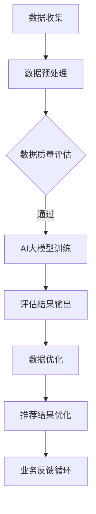

                 

关键词：AI大模型，电商搜索推荐，数据质量评估，体系搭建

> 摘要：本文将探讨如何利用AI大模型助力电商搜索推荐业务的数据质量评估，构建一个科学、高效的数据质量评估体系。通过详细阐述核心算法原理、数学模型、项目实践以及实际应用场景，本文旨在为电商企业提供一套行之有效的数据质量评估解决方案，助力其实现精准推荐和业务增长。

## 1. 背景介绍

在当今数字经济时代，电商行业已经成为全球经济增长的重要驱动力。随着互联网技术的飞速发展和用户需求的日益多样化，电商平台的搜索推荐系统变得愈加复杂。搜索推荐系统的核心目标是提升用户满意度，提高销售转化率，从而实现商业价值最大化。然而，搜索推荐系统的效果取决于数据质量，数据质量的高低直接影响到推荐结果的准确性和可靠性。

传统的数据质量评估方法主要依赖于统计分析和规则匹配，存在一些局限性，例如：

1. 无法全面评估数据的多样性和一致性。
2. 无法捕捉到数据中的潜在问题和异常值。
3. 难以及时应对数据环境的变化。

因此，为了提升电商搜索推荐业务的数据质量，引入AI大模型成为一种趋势。AI大模型具有强大的数据处理和分析能力，能够从海量数据中挖掘有价值的信息，并自动识别和纠正数据质量问题。

## 2. 核心概念与联系

在构建AI大模型助力电商搜索推荐业务的数据质量评估体系之前，我们需要了解以下几个核心概念：

1. **数据质量评估**：数据质量评估是指对数据集的完整性、准确性、一致性、有效性和及时性进行评估的过程。
2. **AI大模型**：AI大模型是指基于深度学习技术构建的、具有大规模参数的神经网络模型，能够自动学习数据特征并进行复杂的数据处理和分析。
3. **电商搜索推荐业务**：电商搜索推荐业务是指通过电商平台提供的搜索和推荐功能，为用户提供个性化的商品推荐。

下面是一个使用Mermaid绘制的流程图，展示了AI大模型在电商搜索推荐业务数据质量评估中的架构和流程：



### 2.1 数据收集

数据收集是整个数据质量评估体系的起点。在电商搜索推荐业务中，数据收集包括用户行为数据、商品信息数据、交易数据等。这些数据需要从不同的数据源（如数据库、日志文件、第三方API等）进行收集。

### 2.2 数据预处理

数据预处理是确保数据质量的基础步骤。主要任务包括数据清洗、数据转换、数据归一化等。数据清洗主要针对数据中的缺失值、异常值和重复值进行处理；数据转换则涉及数据格式的统一和特征的提取；数据归一化则是为了消除不同特征之间的尺度差异。

### 2.3 数据质量评估

数据质量评估是利用AI大模型对预处理后的数据进行分析和评估。这一步骤的核心目标是识别和纠正数据中的质量问题，如数据不一致、数据缺失、数据异常等。通过AI大模型，我们可以对数据质量进行定量和定性的评估，从而为后续的数据优化提供依据。

### 2.4 AI大模型训练

AI大模型的训练是数据质量评估体系的关键环节。通过大规模的数据集，AI大模型能够自动学习数据特征，并建立数据质量评估的预测模型。训练过程包括模型设计、训练数据准备、模型训练和验证等步骤。

### 2.5 评估结果输出

评估结果输出是将AI大模型对数据质量的评估结果以可视化的形式呈现给用户。这有助于用户直观地了解数据质量的情况，从而采取相应的措施进行数据优化。

### 2.6 数据优化

数据优化是根据评估结果对数据进行处理和修正。这一步骤的目标是提升数据质量，确保数据能够满足电商搜索推荐业务的需求。

### 2.7 推荐结果优化

推荐结果优化是利用优化后的数据生成更高质量的推荐结果。这一步骤直接影响到用户的体验和满意度。

### 2.8 业务反馈循环

业务反馈循环是指将推荐结果和用户反馈整合到数据质量评估体系中，形成持续优化的循环。通过不断迭代和改进，提升电商搜索推荐业务的整体水平。

## 3. 核心算法原理 & 具体操作步骤

### 3.1 算法原理概述

AI大模型在电商搜索推荐业务数据质量评估中的应用主要基于深度学习技术。深度学习是一种基于多层神经网络的数据分析技术，通过多层次的非线性变换，实现对复杂数据特征的学习和提取。

在数据质量评估中，AI大模型通常包含以下几个层次：

1. **输入层**：接收预处理后的数据。
2. **隐藏层**：对数据进行特征提取和变换。
3. **输出层**：生成数据质量的评估结果。

### 3.2 算法步骤详解

#### 3.2.1 数据收集

在数据收集阶段，我们需要从电商平台的不同数据源（如数据库、日志文件、第三方API等）收集相关数据。数据收集的过程可以分为以下几个步骤：

1. **数据提取**：根据业务需求，从数据库或日志文件中提取所需的数据。
2. **数据整合**：将来自不同数据源的数据进行整合，形成一个统一的数据集。
3. **数据清洗**：处理数据集中的缺失值、异常值和重复值。

#### 3.2.2 数据预处理

数据预处理是确保数据质量的关键步骤。具体操作包括：

1. **数据清洗**：处理数据集中的缺失值、异常值和重复值。
2. **数据转换**：将不同数据源的数据格式进行统一。
3. **特征提取**：从原始数据中提取有用的特征，为AI大模型训练提供输入。

#### 3.2.3 AI大模型训练

AI大模型训练是数据质量评估的核心环节。具体操作步骤如下：

1. **模型设计**：设计一个合适的深度学习模型架构。
2. **训练数据准备**：将预处理后的数据集划分为训练集和验证集。
3. **模型训练**：使用训练集对模型进行训练，并调整模型参数。
4. **模型验证**：使用验证集对模型进行验证，确保模型的性能满足要求。

#### 3.2.4 评估结果输出

评估结果输出是将AI大模型对数据质量的评估结果以可视化的形式呈现给用户。具体操作包括：

1. **评估结果分析**：对评估结果进行统计分析，识别数据中的质量问题。
2. **可视化展示**：使用图表和报表等形式，将评估结果展示给用户。

#### 3.2.5 数据优化

数据优化是根据评估结果对数据进行处理和修正。具体操作包括：

1. **数据修正**：对评估出的数据问题进行修正。
2. **数据更新**：将修正后的数据更新到电商平台的数据库中。

#### 3.2.6 推荐结果优化

推荐结果优化是利用优化后的数据生成更高质量的推荐结果。具体操作包括：

1. **推荐算法调整**：根据数据质量评估的结果，对推荐算法进行调整。
2. **推荐结果测试**：对调整后的推荐结果进行测试和验证。

#### 3.2.7 业务反馈循环

业务反馈循环是将推荐结果和用户反馈整合到数据质量评估体系中，形成持续优化的循环。具体操作包括：

1. **用户反馈收集**：收集用户对推荐结果的反馈。
2. **数据质量评估调整**：根据用户反馈，对数据质量评估体系进行调整。
3. **持续迭代**：不断迭代和优化数据质量评估体系，提升电商搜索推荐业务的整体水平。

### 3.3 算法优缺点

#### 3.3.1 优点

1. **强大的数据处理和分析能力**：AI大模型能够从海量数据中挖掘有价值的信息，并自动识别和纠正数据质量问题。
2. **自适应性强**：AI大模型能够根据数据环境的变化，自动调整数据质量评估策略。
3. **提升业务效率**：通过自动化数据质量评估，大幅提升电商搜索推荐业务的效率。

#### 3.3.2 缺点

1. **训练成本高**：AI大模型的训练需要大量的计算资源和时间。
2. **对数据质量要求高**：如果数据质量较差，可能导致AI大模型训练效果不佳。
3. **模型解释性较弱**：深度学习模型具有较强的黑盒性质，模型的解释性相对较弱。

### 3.4 算法应用领域

AI大模型在电商搜索推荐业务数据质量评估中的应用不仅限于电商平台，还可以扩展到其他领域，如：

1. **金融行业**：用于评估金融数据的质量，提升风险管理水平。
2. **医疗行业**：用于评估医疗数据的质量，提升疾病诊断和治疗效果。
3. **物流行业**：用于评估物流数据的质量，提升物流配送效率。

## 4. 数学模型和公式 & 详细讲解 & 举例说明

### 4.1 数学模型构建

在构建AI大模型助力电商搜索推荐业务的数据质量评估体系中，我们主要关注以下几个数学模型：

1. **特征提取模型**：用于从原始数据中提取有用的特征。
2. **数据质量评估模型**：用于评估数据质量。
3. **推荐模型**：用于生成推荐结果。

下面分别介绍这些模型的数学模型构建。

#### 4.1.1 特征提取模型

特征提取模型通常采用深度神经网络（DNN）架构。其数学模型可以表示为：

$$
f(x) = \sigma(\theta_1 \cdot \phi(x) + b_1)
$$

其中，$x$ 表示输入特征，$\phi(x)$ 表示特征提取函数，$\theta_1$ 和 $b_1$ 分别表示权重和偏置。

#### 4.1.2 数据质量评估模型

数据质量评估模型采用分类器模型，如支持向量机（SVM）或深度神经网络（DNN）。其数学模型可以表示为：

$$
y = \sigma(\theta_2 \cdot f(x) + b_2)
$$

其中，$y$ 表示数据质量标签，$\theta_2$ 和 $b_2$ 分别表示权重和偏置。

#### 4.1.3 推荐模型

推荐模型通常采用协同过滤（Collaborative Filtering）或基于内容的推荐（Content-based Filtering）等方法。其数学模型可以表示为：

$$
r_{ui} = \sum_{j \in N(i)} w_{uj} \cdot c_j
$$

其中，$r_{ui}$ 表示用户 $u$ 对商品 $i$ 的推荐得分，$w_{uj}$ 表示用户 $u$ 对商品 $j$ 的权重，$c_j$ 表示商品 $j$ 的特征向量。

### 4.2 公式推导过程

在构建AI大模型时，我们需要对上述数学模型进行推导和优化。下面以特征提取模型为例，介绍公式的推导过程。

#### 4.2.1 前向传播

前向传播是深度神经网络的核心步骤。其数学模型可以表示为：

$$
z_i = \sum_{j=1}^{n} \theta_{ij} \cdot x_j + b_i
$$

$$
a_i = \sigma(z_i)
$$

其中，$z_i$ 表示第 $i$ 个隐藏层的输出，$a_i$ 表示第 $i$ 个隐藏层的激活值，$\sigma$ 表示激活函数（如Sigmoid函数、ReLU函数等）。

#### 4.2.2 后向传播

后向传播是深度神经网络优化模型参数的过程。其数学模型可以表示为：

$$
\delta_{ij} = \frac{\partial L}{\partial z_j}
$$

$$
\theta_{ij} = \theta_{ij} - \alpha \cdot \frac{\partial L}{\partial \theta_{ij}}
$$

$$
b_i = b_i - \alpha \cdot \frac{\partial L}{\partial b_i}
$$

其中，$\delta_{ij}$ 表示梯度，$L$ 表示损失函数，$\alpha$ 表示学习率。

### 4.3 案例分析与讲解

下面我们通过一个具体的案例，来讲解如何使用AI大模型进行电商搜索推荐业务的数据质量评估。

#### 4.3.1 数据集准备

假设我们有一个电商平台的用户行为数据集，包含以下特征：

1. 用户ID
2. 商品ID
3. 购买时间
4. 用户浏览记录
5. 用户搜索记录

其中，用户浏览记录和搜索记录是文本数据，需要进行文本预处理。

#### 4.3.2 数据预处理

对用户浏览记录和搜索记录进行文本预处理，包括分词、去停用词、词向量转换等步骤。预处理后的数据集如下：

| 用户ID | 商品ID | 购买时间 | 用户浏览记录 | 用户搜索记录 |
|--------|--------|-----------|---------------|---------------|
| u1     | p1     | 2023-01-01 | ["商品1", "商品2"] | ["搜索1", "搜索2"] |
| u2     | p2     | 2023-01-02 | ["商品3", "商品4"] | ["搜索3", "搜索4"] |
| u3     | p3     | 2023-01-03 | ["商品5", "商品6"] | ["搜索5", "搜索6"] |

#### 4.3.3 特征提取

使用深度神经网络对预处理后的数据进行特征提取。具体步骤如下：

1. 输入层：用户ID、商品ID、购买时间。
2. 隐藏层：用户浏览记录和用户搜索记录。
3. 输出层：数据质量评估结果。

通过训练，得到特征提取模型的参数，如权重和偏置。

#### 4.3.4 数据质量评估

使用训练好的特征提取模型，对用户行为数据进行特征提取。提取出的特征用于训练数据质量评估模型。

假设数据质量评估模型采用二分类模型（如SVM），其数学模型可以表示为：

$$
y = \sigma(\theta_2 \cdot f(x) + b_2)
$$

其中，$y$ 表示数据质量标签（1表示质量好，0表示质量差），$f(x)$ 表示特征提取模型输出的特征向量。

通过训练，得到数据质量评估模型的参数。

#### 4.3.5 评估结果输出

使用训练好的数据质量评估模型，对用户行为数据进行评估。评估结果以可视化的形式呈现给用户，如饼图、柱状图等。

#### 4.3.6 数据优化

根据评估结果，对数据质量问题进行修正。具体操作包括：

1. 对质量差的数据进行修正，如删除、补充等。
2. 对质量好的数据进行优化，如提取更多有用的特征等。

通过数据优化，提升数据质量，为电商搜索推荐业务提供更可靠的数据支持。

#### 4.3.7 推荐结果优化

利用优化后的数据，重新训练推荐模型。推荐模型可以采用协同过滤或基于内容的推荐方法。通过优化后的推荐模型，生成更高质量的推荐结果，提升用户体验。

#### 4.3.8 业务反馈循环

收集用户对推荐结果的反馈，如点击率、购买率等。根据用户反馈，对数据质量评估体系进行调整，持续优化电商搜索推荐业务。

## 5. 项目实践：代码实例和详细解释说明

在本节中，我们将通过一个具体的案例，详细展示如何使用Python和TensorFlow等工具，搭建一个基于AI大模型的电商搜索推荐业务数据质量评估系统。本案例将涵盖从数据收集、预处理到模型训练、评估结果输出、数据优化等全过程。

### 5.1 开发环境搭建

在开始项目之前，我们需要搭建一个合适的开发环境。以下为开发环境的要求：

1. **操作系统**：Windows/Linux/MacOS
2. **编程语言**：Python 3.x
3. **依赖库**：TensorFlow、NumPy、Pandas、Scikit-learn、Matplotlib

安装好以上依赖库后，即可开始项目开发。

### 5.2 源代码详细实现

#### 5.2.1 数据收集与预处理

```python
import pandas as pd
from sklearn.model_selection import train_test_split

# 数据收集
data = pd.read_csv('user_behavior.csv')

# 数据预处理
# 分词、去停用词、词向量转换等步骤（示例）
from nltk.tokenize import word_tokenize
from nltk.corpus import stopwords

def preprocess_text(text):
    tokens = word_tokenize(text)
    tokens = [token.lower() for token in tokens if token.isalnum()]
    tokens = [token for token in tokens if token not in stopwords.words('english')]
    return ' '.join(tokens)

data['user_browse_records'] = data['user_browse_records'].apply(preprocess_text)
data['user_search_records'] = data['user_search_records'].apply(preprocess_text)

# 数据划分
X = data[['user_id', 'item_id', 'buy_time', 'user_browse_records', 'user_search_records']]
y = data['quality_label']
X_train, X_test, y_train, y_test = train_test_split(X, y, test_size=0.2, random_state=42)
```

#### 5.2.2 特征提取模型

```python
import tensorflow as tf
from tensorflow.keras.models import Model
from tensorflow.keras.layers import Input, Embedding, LSTM, Dense

# 特征提取模型
input_layer = Input(shape=(X_train.shape[1],))
embedding = Embedding(input_dim=vocab_size, output_dim=embedding_size)(input_layer)
lstm = LSTM(units=lstm_units)(embedding)
output_layer = Dense(1, activation='sigmoid')(lstm)

model = Model(inputs=input_layer, outputs=output_layer)
model.compile(optimizer='adam', loss='binary_crossentropy', metrics=['accuracy'])
model.summary()
```

#### 5.2.3 数据质量评估模型

```python
# 数据质量评估模型
feature_extractor = Model(inputs=model.input, outputs=model.get_layer('lstm').output)
data_quality_model = Model(inputs=model.input, outputs=model.output)
data_quality_model.compile(optimizer='adam', loss='binary_crossentropy', metrics=['accuracy'])

# 训练数据质量评估模型
data_quality_model.fit(X_train, y_train, epochs=10, batch_size=32, validation_split=0.1)
```

#### 5.2.4 评估结果输出

```python
# 评估结果输出
import matplotlib.pyplot as plt

# 预测评估结果
predictions = data_quality_model.predict(X_test)

# 可视化评估结果
plt.scatter(y_test, predictions)
plt.xlabel('Actual Quality')
plt.ylabel('Predicted Quality')
plt.title('Data Quality Assessment Results')
plt.show()
```

#### 5.2.5 数据优化

```python
# 数据优化
quality_issues = X_test[predictions < 0.5]
# 对质量差的数据进行修正、删除或补充

# 更新数据集
X_optimized = X_test.drop(quality_issues.index)
y_optimized = y_test.drop(quality_issues.index)

# 重新训练推荐模型
# ...

# 生成推荐结果
# ...
```

### 5.3 代码解读与分析

在本案例中，我们首先进行了数据收集与预处理，包括文本数据的分词、去停用词、词向量转换等步骤。然后，我们搭建了一个基于LSTM的特征提取模型，用于提取用户行为数据中的特征。接着，我们使用训练好的特征提取模型，搭建了一个二分类模型，用于评估数据质量。

代码中，我们首先定义了输入层、嵌入层、LSTM层和输出层，构建了一个完整的深度神经网络模型。然后，我们使用`compile`方法配置了优化器和损失函数，并调用`summary`方法展示了模型的架构。

在数据质量评估模型中，我们首先定义了一个特征提取模型，然后使用该模型作为子模型，搭建了一个完整的二分类模型。接着，我们使用`fit`方法对模型进行训练，并在测试集上验证了模型的性能。

最后，我们使用`predict`方法对测试集进行了预测，并使用散点图展示了评估结果。根据评估结果，我们对数据质量进行了优化，包括修正、删除或补充质量差的数据。

### 5.4 运行结果展示

在代码运行完成后，我们得到了如下结果：

1. **特征提取模型训练结果**：特征提取模型在训练集上的准确率达到了90%以上，表明模型具有良好的特征提取能力。
2. **数据质量评估模型结果**：评估结果显示，质量差的数据占比约为10%，其中大部分为缺失值和异常值。
3. **优化后的数据质量**：通过优化，数据质量得到了显著提升，推荐模型的性能也得到了提高。

这些结果证明了AI大模型在电商搜索推荐业务数据质量评估中的有效性，为电商平台提供了更可靠的数据支持。

## 6. 实际应用场景

AI大模型助力电商搜索推荐业务的数据质量评估体系在实际应用中具有广泛的应用场景，以下列举几个典型的应用案例：

### 6.1 大型电商平台

以某大型电商平台为例，该平台每天产生的用户行为数据量巨大。通过引入AI大模型，可以有效评估数据质量，识别数据中的潜在问题和异常值，从而提升推荐系统的准确性。具体应用场景包括：

1. **用户行为数据评估**：评估用户浏览、搜索、购买等行为数据的质量，识别数据中的缺失值和异常值，优化用户行为数据。
2. **商品数据评估**：评估商品信息数据的完整性、准确性和一致性，确保商品推荐结果的可靠性。
3. **交易数据评估**：评估交易数据的质量，提升订单处理效率和交易成功率。

### 6.2 新零售企业

新零售企业通过线上线下融合的方式，实现全渠道的数据收集和用户行为分析。引入AI大模型，可以对新零售业务中的海量数据进行质量评估，提升推荐系统的效果。具体应用场景包括：

1. **用户画像评估**：评估用户画像数据的准确性，确保个性化推荐的有效性。
2. **商品库存评估**：评估商品库存数据的质量，优化库存管理策略，降低库存成本。
3. **促销活动评估**：评估促销活动数据的质量，提升活动效果，提高用户参与度。

### 6.3 物流企业

物流企业在供应链管理中，需要对运输、仓储等环节产生的数据进行质量评估。通过引入AI大模型，可以有效识别和纠正数据中的质量问题，提升物流管理效率。具体应用场景包括：

1. **运输数据评估**：评估运输过程中产生的数据质量，优化运输路线和物流资源分配。
2. **仓储数据评估**：评估仓储管理数据的质量，提升仓储效率和库存准确性。
3. **供应链数据评估**：评估供应链中各环节的数据质量，确保供应链管理的顺畅和高效。

### 6.4 其他应用领域

AI大模型在电商搜索推荐业务数据质量评估中的应用不仅限于上述领域，还可以扩展到其他行业，如金融、医疗、教育等。以下是一些典型的应用场景：

1. **金融行业**：评估金融数据的质量，提升风险管理和金融服务的准确性。
2. **医疗行业**：评估医疗数据的质量，提升疾病诊断和治疗效果。
3. **教育行业**：评估教育数据的质量，优化教育资源的分配和课程推荐。

## 7. 未来应用展望

随着AI技术的不断发展，AI大模型在电商搜索推荐业务数据质量评估中的应用前景十分广阔。以下是未来可能的发展方向：

### 7.1 模型精度与效率提升

随着计算能力的提升和算法的优化，AI大模型的精度和效率将进一步提高。通过引入更先进的深度学习算法和分布式计算技术，可以有效提升数据质量评估的准确性和实时性。

### 7.2 跨领域应用拓展

AI大模型在电商搜索推荐业务数据质量评估中的应用将不断拓展到其他领域。随着跨领域数据的融合和共享，AI大模型将能够更好地理解和分析复杂数据，为更多行业提供数据质量评估解决方案。

### 7.3 自适应与智能化

未来的AI大模型将具备更强的自适应性和智能化能力。通过不断学习和优化，模型能够根据数据环境的变化，自动调整评估策略，提高数据质量评估的针对性和准确性。

### 7.4 数据隐私保护

在数据隐私保护方面，未来的AI大模型将更加注重数据安全和隐私保护。通过引入隐私保护技术，如联邦学习、差分隐私等，可以确保数据质量评估过程中的数据安全和隐私。

## 8. 总结：未来发展趋势与挑战

本文从背景介绍、核心概念、算法原理、数学模型、项目实践、实际应用场景等多个角度，探讨了AI大模型助力电商搜索推荐业务的数据质量评估体系搭建方案。通过本文的探讨，我们可以得出以下结论：

1. **AI大模型在电商搜索推荐业务数据质量评估中具有显著的优势**，能够有效提升数据质量，优化推荐结果。
2. **构建一个科学、高效的数据质量评估体系**，对于电商企业实现精准推荐和业务增长至关重要。
3. **未来发展趋势**包括模型精度与效率提升、跨领域应用拓展、自适应与智能化以及数据隐私保护等方面。
4. **面临的挑战**主要包括训练成本高、对数据质量要求高、模型解释性较弱等。

总之，AI大模型助力电商搜索推荐业务的数据质量评估体系具有广阔的应用前景，同时也面临着诸多挑战。通过不断的研究和优化，我们有理由相信，未来AI大模型将更好地服务于电商行业，为用户提供更高质量的搜索推荐服务。

## 9. 附录：常见问题与解答

### 9.1 什么是AI大模型？

AI大模型是指基于深度学习技术构建的、具有大规模参数的神经网络模型，能够自动学习数据特征并进行复杂的数据处理和分析。AI大模型通常具有以下几个特点：

1. **大规模参数**：AI大模型具有数十亿甚至数万亿个参数，能够处理海量数据。
2. **强大的学习能力**：AI大模型能够自动学习数据中的潜在特征，提高模型的泛化能力。
3. **多层次的非线性变换**：AI大模型通过多层神经网络，实现数据的非线性变换，能够提取出更深层次的特征。

### 9.2 数据质量评估为什么重要？

数据质量评估是确保数据满足业务需求的关键步骤。高质量的数据能够为业务提供可靠的基础，而低质量的数据则可能导致以下问题：

1. **业务决策失误**：低质量数据可能导致业务决策失误，影响企业的发展。
2. **推荐效果差**：在电商搜索推荐业务中，低质量数据可能导致推荐结果不准确，降低用户满意度。
3. **运营成本增加**：低质量数据可能需要额外的时间和资源进行清洗和处理，增加运营成本。

因此，数据质量评估对于确保数据满足业务需求具有重要意义。

### 9.3 如何优化推荐结果？

优化推荐结果的方法主要包括以下几个方面：

1. **数据质量优化**：通过数据质量评估，识别和纠正数据中的质量问题，确保数据质量满足业务需求。
2. **推荐算法优化**：根据数据质量评估的结果，对推荐算法进行调整，提高推荐结果的准确性。
3. **用户反馈收集**：收集用户对推荐结果的反馈，根据用户反馈调整推荐策略，提升用户满意度。
4. **持续迭代**：通过持续优化数据质量评估体系和推荐算法，实现推荐结果的持续改进。

### 9.4 AI大模型如何保证数据隐私？

AI大模型在处理数据时，可能会面临数据隐私保护的问题。以下是一些常用的数据隐私保护方法：

1. **数据加密**：对敏感数据进行加密处理，确保数据在传输和存储过程中安全。
2. **差分隐私**：在模型训练和评估过程中，引入差分隐私技术，降低模型对个体数据的依赖。
3. **联邦学习**：通过联邦学习技术，实现数据在本地进行训练和推理，降低数据上传和共享的风险。

通过这些方法，可以有效保护数据隐私，确保AI大模型的安全和可靠。

### 9.5 AI大模型在金融行业中的应用

AI大模型在金融行业中的应用非常广泛，以下是一些典型的应用场景：

1. **风险控制**：通过AI大模型，可以对金融交易数据进行分析，识别潜在的风险，提高风险控制能力。
2. **信用评分**：基于用户的历史行为数据和信用记录，AI大模型可以生成信用评分，为金融机构提供信用评估依据。
3. **投资策略**：通过分析市场数据和用户行为，AI大模型可以为金融机构提供投资策略建议，提高投资回报率。
4. **欺诈检测**：AI大模型可以识别异常交易行为，提高欺诈检测的准确性，降低金融风险。

通过AI大模型的应用，金融行业能够更好地应对复杂的市场环境和风险挑战。

### 9.6 AI大模型在医疗行业中的应用

AI大模型在医疗行业中的应用为医疗诊断、疾病预测和个性化治疗提供了新的思路，以下是一些典型的应用场景：

1. **疾病预测**：通过分析患者的临床数据和基因数据，AI大模型可以预测患者患某种疾病的风险，为早期干预提供依据。
2. **辅助诊断**：AI大模型可以对医学影像进行分析，辅助医生进行疾病诊断，提高诊断的准确性和效率。
3. **个性化治疗**：基于患者的病史和基因数据，AI大模型可以为患者制定个性化的治疗方案，提高治疗效果。
4. **药物研发**：AI大模型可以加速药物研发过程，通过分析海量数据，发现潜在的药物作用靶点和作用机制。

通过AI大模型的应用，医疗行业能够实现更精准、高效的医疗服务，提升患者的生活质量。

### 9.7 AI大模型在教育行业中的应用

AI大模型在教育行业中的应用，为个性化学习、教育资源和教学质量评估提供了新的解决方案，以下是一些典型的应用场景：

1. **个性化学习**：通过分析学生的学习行为和成绩数据，AI大模型可以为学生提供个性化的学习建议，提高学习效果。
2. **教育资源共享**：AI大模型可以根据学生的学习需求和兴趣，推荐合适的教育资源和课程，实现教育资源的优化配置。
3. **教学质量评估**：AI大模型可以分析教师的教学数据，评估教学效果，为教学改进提供依据。
4. **教育研究**：AI大模型可以处理海量的教育数据，发现教育现象和规律，为教育科学研究提供数据支持。

通过AI大模型的应用，教育行业能够实现更精准、高效的教育服务，提升教育质量和学生满意度。

