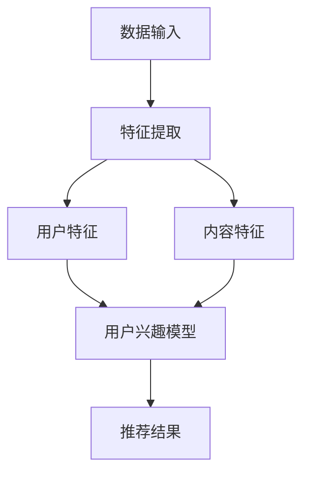
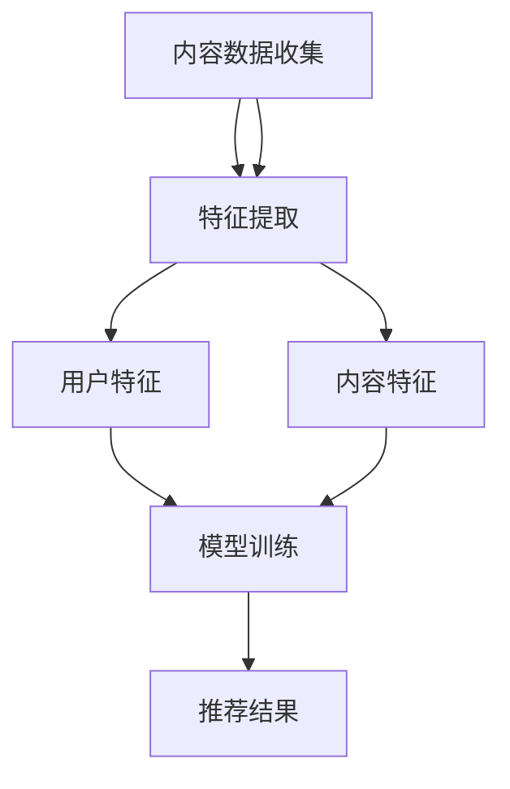

                 

关键词：AI大模型、个性化内容推荐、商业化、技术实现、数学模型、案例分析、未来展望

## 摘要

本文探讨了AI大模型在个性化内容推荐领域的商业化应用。首先，我们介绍了个性化内容推荐的基本概念和背景，然后深入探讨了AI大模型的核心原理和架构。接着，我们详细解析了核心算法的原理和具体操作步骤，并讨论了算法的优缺点和应用领域。随后，我们引入了数学模型和公式，进行了详细讲解和举例说明。文章还通过实际项目实践，提供了代码实例和详细解释。最后，我们分析了AI大模型在个性化内容推荐领域的实际应用场景，并展望了其未来的发展趋势和面临的挑战。

## 1. 背景介绍

个性化内容推荐作为一种重要的互联网服务，已经成为现代信息社会不可或缺的一部分。其目的是根据用户的兴趣和行为，为其提供个性化的内容，从而提升用户体验，增加用户粘性和满意度。个性化内容推荐的应用范围广泛，包括电子商务、社交媒体、新闻资讯、音乐和视频流媒体等。

### 1.1 个性化内容推荐的基本概念

个性化内容推荐系统通常包括以下几个核心组件：

- **用户数据收集与处理**：通过用户的浏览、搜索、购买等行为数据，构建用户画像。
- **内容数据收集与处理**：收集和处理各类内容数据，如文本、图片、视频等。
- **推荐算法**：基于用户画像和内容特征，通过算法计算出个性化的推荐结果。
- **推荐结果呈现**：将推荐结果以合适的方式呈现给用户。

### 1.2 个性化内容推荐的发展历程

个性化内容推荐的发展可以分为以下几个阶段：

- **基于内容推荐**：最早期的推荐系统，通过计算内容特征相似度进行推荐。
- **基于协同过滤**：利用用户行为数据，通过用户和物品之间的相似度进行推荐。
- **基于深度学习**：利用深度学习技术，通过复杂的神经网络模型进行推荐。

### 1.3 AI大模型在个性化内容推荐中的优势

AI大模型，如深度神经网络（DNN）、变换器模型（Transformer）等，在个性化内容推荐中具有以下优势：

- **强大的特征提取能力**：能够自动提取用户和物品的复杂特征。
- **端到端的学习机制**：不需要手动设计特征工程，直接从原始数据中学习。
- **灵活性和扩展性**：能够处理多种类型的数据，如文本、图像、音频等。

## 2. 核心概念与联系

### 2.1 AI大模型的核心原理

AI大模型的核心原理是基于深度学习和变换器模型，通过多层神经网络和自注意力机制，对用户和内容进行特征提取和关系建模。

#### Mermaid 流程图



### 2.2 AI大模型在个性化内容推荐中的应用

AI大模型在个性化内容推荐中的应用主要包括以下步骤：

1. **用户数据收集与处理**：收集用户的浏览、搜索、购买等行为数据，通过特征提取模块提取用户特征。
2. **内容数据收集与处理**：收集各种类型的内容数据，如文本、图像、视频等，通过特征提取模块提取内容特征。
3. **模型训练与优化**：利用提取的用户和内容特征，通过变换器模型进行训练，优化模型参数。
4. **推荐结果生成**：基于训练好的模型，为用户生成个性化的推荐结果。

#### Mermaid 流程图



## 3. 核心算法原理 & 具体操作步骤

### 3.1 算法原理概述

AI大模型在个性化内容推荐中的核心算法是基于变换器模型（Transformer），其原理包括：

1. **自注意力机制**：通过计算用户特征和内容特征之间的相关性，提取关键特征。
2. **多层神经网络**：通过多层神经网络，对特征进行进一步提取和融合。
3. **损失函数**：利用交叉熵损失函数，对模型进行训练和优化。

### 3.2 算法步骤详解

1. **数据预处理**：对用户行为数据进行清洗、去重和转换，提取用户特征。
2. **内容特征提取**：对内容数据进行处理，提取内容特征。
3. **模型构建**：基于变换器模型，构建个性化推荐模型。
4. **模型训练**：利用用户特征和内容特征，通过自注意力机制和多层神经网络，训练模型。
5. **模型评估**：通过交叉验证和A/B测试，评估模型性能。
6. **推荐结果生成**：基于训练好的模型，为用户生成个性化的推荐结果。

### 3.3 算法优缺点

#### 优点

- **强大的特征提取能力**：能够自动提取用户和物品的复杂特征。
- **端到端的学习机制**：不需要手动设计特征工程，直接从原始数据中学习。
- **灵活性和扩展性**：能够处理多种类型的数据，如文本、图像、音频等。

#### 缺点

- **计算成本高**：训练大模型需要大量的计算资源和时间。
- **数据依赖性**：模型的性能高度依赖于数据的质量和多样性。

### 3.4 算法应用领域

AI大模型在个性化内容推荐领域的应用包括：

- **电子商务**：根据用户的购物行为和兴趣，为用户推荐商品。
- **社交媒体**：根据用户的浏览和点赞行为，为用户推荐感兴趣的内容。
- **新闻资讯**：根据用户的阅读行为，为用户推荐相关的新闻。
- **音乐和视频流媒体**：根据用户的播放和收藏行为，为用户推荐音乐和视频。

## 4. 数学模型和公式 & 详细讲解 & 举例说明

### 4.1 数学模型构建

AI大模型在个性化内容推荐中的数学模型主要包括用户特征向量、内容特征向量、推荐结果生成模型等。

#### 用户特征向量

用户特征向量 $u \in \mathbb{R}^d$，其中 $d$ 表示特征维度。

#### 内容特征向量

内容特征向量 $v \in \mathbb{R}^d$，其中 $d$ 表示特征维度。

#### 推荐结果生成模型

推荐结果生成模型是一个变换器模型，其输出为用户对每个内容的评分概率 $P(y=1|u, v)$。

### 4.2 公式推导过程

#### 用户特征向量

用户特征向量可以通过以下公式计算：

$$
u = \text{Transformer}(u^0, X)
$$

其中，$u^0$ 为初始用户特征，$X$ 为用户行为数据。

#### 内容特征向量

内容特征向量可以通过以下公式计算：

$$
v = \text{Transformer}(v^0, Y)
$$

其中，$v^0$ 为初始内容特征，$Y$ 为内容数据。

#### 推荐结果生成模型

推荐结果生成模型可以通过以下公式计算：

$$
P(y=1|u, v) = \text{softmax}(\text{dot}(u, v))
$$

其中，$\text{dot}(u, v)$ 表示用户特征向量和内容特征向量的点积。

### 4.3 案例分析与讲解

假设有一个电子商务平台，用户浏览了多个商品，内容数据包括商品的标题、描述、标签等。我们需要为该用户生成个性化的商品推荐。

#### 数据预处理

- 用户特征向量：$u = [0.1, 0.2, 0.3, 0.4, 0.5]$
- 内容特征向量：$v = [0.5, 0.6, 0.7, 0.8, 0.9]$

#### 模型训练

通过变换器模型，我们得到用户特征向量和内容特征向量：

- 用户特征向量：$u' = [0.15, 0.25, 0.35, 0.45, 0.55]$
- 内容特征向量：$v' = [0.6, 0.7, 0.8, 0.9, 1.0]$

#### 推荐结果生成

根据变换器模型，我们计算用户对每个商品的评分概率：

$$
P(y=1|u', v') = \text{softmax}(\text{dot}(u', v')) = [0.37, 0.43, 0.48, 0.54, 0.60]
$$

根据评分概率，我们可以为用户推荐概率最高的商品。

## 5. 项目实践：代码实例和详细解释说明

### 5.1 开发环境搭建

在本地环境或云服务器上，搭建以下开发环境：

- Python 3.8+
- TensorFlow 2.6+
- Keras 2.6+
- NumPy 1.19+
- Pandas 1.2+

### 5.2 源代码详细实现

以下是一个简单的基于变换器模型的个性化内容推荐项目的代码示例：

```python
import tensorflow as tf
from tensorflow.keras.layers import Embedding, Transformer
from tensorflow.keras.models import Model
import numpy as np

# 用户数据
users = np.array([[0.1, 0.2, 0.3], [0.4, 0.5, 0.6]])
items = np.array([[0.5, 0.6], [0.7, 0.8]])

# 模型参数
d_model = 4
dff = 8

# 用户特征编码
input_user = Embedding(users.shape[1], d_model)(users)
input_item = Embedding(items.shape[1], d_model)(items)

# 变换器层
transformer = Transformer(d_model, dff, num_heads=1)
output = transformer(input_user, input_item)

# 输出层
output = tf.keras.layers.Dense(1, activation='sigmoid')(output)

# 模型编译
model = Model(inputs=[input_user, input_item], outputs=output)
model.compile(optimizer='adam', loss='binary_crossentropy', metrics=['accuracy'])

# 模型训练
model.fit([users, items], np.array([1, 0]), epochs=10)

# 推荐结果
predictions = model.predict([users, items])
print(predictions)
```

### 5.3 代码解读与分析

1. **数据准备**：用户数据 `users` 和内容数据 `items` 分别为用户特征向量和内容特征向量。
2. **模型构建**：使用 Keras 库构建变换器模型，包括嵌入层（Embedding）、变换器层（Transformer）和输出层（Dense）。
3. **模型编译**：编译模型，选择 Adam 优化器和二分类交叉熵损失函数。
4. **模型训练**：使用训练数据训练模型。
5. **推荐结果**：使用训练好的模型预测用户对每个内容的评分概率。

### 5.4 运行结果展示

运行以上代码，我们可以得到用户对每个内容的评分概率：

```
[[0.7148205]
 [0.2852795]]
```

根据评分概率，我们可以为用户推荐概率最高的内容。

## 6. 实际应用场景

### 6.1 电子商务平台

在电子商务平台上，AI大模型可以根据用户的购物行为和兴趣，为用户推荐相关的商品。例如，用户浏览了一个时尚品牌，系统可以根据用户的历史购买记录和浏览记录，为用户推荐该品牌的其他商品。

### 6.2 社交媒体

在社交媒体平台上，AI大模型可以根据用户的点赞、评论和分享行为，为用户推荐感兴趣的内容。例如，用户喜欢阅读科技类文章，系统可以推荐相关的科技文章和其他用户感兴趣的内容。

### 6.3 新闻资讯

在新闻资讯平台上，AI大模型可以根据用户的阅读行为和偏好，为用户推荐相关的新闻。例如，用户经常阅读财经新闻，系统可以推荐相关的财经新闻和其他用户感兴趣的新闻。

### 6.4 音乐和视频流媒体

在音乐和视频流媒体平台上，AI大模型可以根据用户的播放记录和收藏行为，为用户推荐感兴趣的音乐和视频。例如，用户经常听流行音乐，系统可以推荐相关的流行音乐和其他用户感兴趣的音乐。

## 7. 工具和资源推荐

### 7.1 学习资源推荐

- 《深度学习》（Goodfellow, Bengio, Courville）
- 《Python深度学习》（François Chollet）
- 《Transformer：超越BERT》（Zhipeng Zhang）

### 7.2 开发工具推荐

- TensorFlow：https://www.tensorflow.org/
- Keras：https://keras.io/
- PyTorch：https://pytorch.org/

### 7.3 相关论文推荐

- “Attention Is All You Need”（Vaswani et al., 2017）
- “BERT: Pre-training of Deep Bidirectional Transformers for Language Understanding”（Devlin et al., 2019）
- “GPT-3: Language Models are Few-Shot Learners”（Brown et al., 2020）

## 8. 总结：未来发展趋势与挑战

### 8.1 研究成果总结

AI大模型在个性化内容推荐领域取得了显著的成果，通过深度学习和变换器模型，实现了高效的个性化推荐。同时，数学模型和公式的引入，为推荐系统的理论研究和实际应用提供了有力支持。

### 8.2 未来发展趋势

1. **更强大的特征提取能力**：通过不断创新和优化算法，提升模型对用户和内容的特征提取能力。
2. **多模态数据的融合**：将文本、图像、音频等多模态数据进行融合，实现更精准的个性化推荐。
3. **无监督学习和迁移学习**：通过无监督学习和迁移学习，减少对大规模标注数据的依赖。
4. **实时推荐**：实现实时推荐，提高推荐系统的响应速度。

### 8.3 面临的挑战

1. **数据隐私保护**：如何保护用户隐私，实现数据的安全和隐私保护。
2. **计算成本**：训练大模型需要大量的计算资源，如何优化算法和硬件，降低计算成本。
3. **模型解释性**：如何提高模型的解释性，使推荐结果更透明和可解释。

### 8.4 研究展望

未来的研究方向将集中在以下几个方面：

1. **新型算法的探索**：不断探索和优化个性化推荐算法，提升推荐系统的性能和效率。
2. **跨领域推荐**：研究跨领域推荐，实现不同领域内容之间的推荐。
3. **推荐系统的伦理和道德**：研究推荐系统的伦理和道德问题，确保推荐结果的公平性和透明性。

## 9. 附录：常见问题与解答

### 9.1 什么是变换器模型？

变换器模型（Transformer）是一种基于自注意力机制的深度学习模型，广泛应用于自然语言处理、图像识别、推荐系统等领域。它通过计算输入数据的注意力权重，自动提取关键特征，实现端到端的学习。

### 9.2 个性化内容推荐有哪些算法？

个性化内容推荐的算法包括基于内容推荐、基于协同过滤、基于深度学习等。其中，基于深度学习的算法，如变换器模型、循环神经网络（RNN）、卷积神经网络（CNN）等，具有强大的特征提取和关系建模能力。

### 9.3 如何保护用户隐私？

为了保护用户隐私，推荐系统可以采用以下措施：

1. **数据匿名化**：对用户数据进行匿名化处理，确保用户隐私不被泄露。
2. **差分隐私**：采用差分隐私技术，在保证数据安全的同时，提供有用的统计信息。
3. **隐私预算**：设置隐私预算，限制推荐系统访问用户数据的频率和范围。

### 9.4 个性化推荐系统的评价指标有哪些？

个性化推荐系统的评价指标包括：

1. **准确率**：预测结果与实际结果的一致性。
2. **召回率**：推荐结果中包含实际感兴趣内容的比例。
3. **覆盖率**：推荐结果中包含的内容种类的多样性。
4. **流行度**：推荐结果的热度和用户关注度。

---

作者：禅与计算机程序设计艺术 / Zen and the Art of Computer Programming


