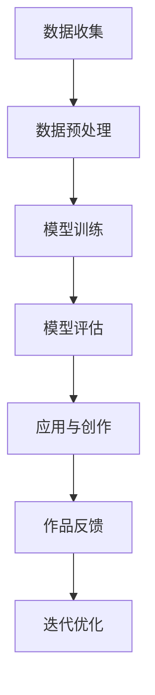

                 

关键词：人工智能，大模型，数字艺术，商业化，创新

摘要：随着人工智能技术的飞速发展，大模型在数字艺术创作中展现出巨大的潜力。本文将深入探讨大模型在数字艺术创作中的商业化探索，分析其核心概念、算法原理、数学模型、项目实践、应用场景以及未来发展趋势与挑战。

## 1. 背景介绍

数字艺术作为现代艺术的一种重要形式，已经逐渐成为文化艺术产业的重要组成部分。然而，传统的数字艺术创作依赖于艺术家的个人技能和创作经验，具有很大的不确定性。随着人工智能技术的发展，特别是大模型的崛起，为数字艺术创作带来了新的可能性和商业化的机遇。

大模型是指参数数量庞大的神经网络模型，如GPT、BERT等，这些模型具有强大的表示和学习能力。大模型在自然语言处理、计算机视觉、语音识别等领域取得了显著成果，同时也被应用于数字艺术创作中，带来了前所未有的创作自由和创意空间。

## 2. 核心概念与联系

### 2.1 大模型在数字艺术创作中的应用

大模型在数字艺术创作中的应用可以分为以下几个阶段：

1. **灵感生成**：大模型可以生成各种艺术风格和主题的灵感，为艺术家提供创作思路。
2. **草图绘制**：大模型可以根据艺术家的意图生成初步的草图，供艺术家进一步修改和完善。
3. **细节优化**：大模型可以辅助艺术家进行细节上的调整，提高作品的整体质量。
4. **完整创作**：大模型可以独立完成完整的艺术作品，实现艺术创作的自动化。

### 2.2 大模型的工作原理

大模型通常采用深度学习技术进行训练，其核心是通过多层神经网络对大量数据进行学习，从而获得对数据的深层理解和抽象表示。大模型的工作原理可以概括为以下几个步骤：

1. **数据收集**：从互联网、社交媒体、艺术作品库等渠道收集大量数据。
2. **数据预处理**：对数据进行清洗、标注和预处理，以便于模型训练。
3. **模型训练**：使用梯度下降等优化算法对模型进行训练，调整模型参数。
4. **模型评估**：使用测试集对模型进行评估，确保模型具有良好的泛化能力。

### 2.3 Mermaid 流程图



## 3. 核心算法原理 & 具体操作步骤

### 3.1 算法原理概述

大模型在数字艺术创作中的核心算法主要包括生成对抗网络（GAN）、变分自编码器（VAE）和递归神经网络（RNN）等。

- **生成对抗网络（GAN）**：通过生成器和判别器的对抗训练，实现数据的生成和分类。
- **变分自编码器（VAE）**：通过编码器和解码器的联合训练，实现数据的编码和重构。
- **递归神经网络（RNN）**：通过序列到序列的映射，实现艺术作品的生成和优化。

### 3.2 算法步骤详解

1. **数据收集与预处理**：收集各种艺术作品的数据，进行清洗、标注和预处理。
2. **模型选择与配置**：根据具体需求选择合适的模型，并配置模型参数。
3. **模型训练**：使用训练数据对模型进行训练，调整模型参数。
4. **模型评估与优化**：使用测试数据对模型进行评估，并根据评估结果对模型进行优化。
5. **艺术作品生成**：使用训练好的模型生成艺术作品，并进行细节调整。
6. **作品反馈与迭代**：根据用户反馈对作品进行迭代优化，提高作品质量。

### 3.3 算法优缺点

- **优点**：
  - 大模型具有强大的表示和学习能力，可以生成高质量的艺术作品。
  - 艺术创作的自由度高，可以满足各种个性化的需求。
  - 艺术创作过程高效，可以缩短创作周期。

- **缺点**：
  - 模型训练过程复杂，需要大量计算资源和时间。
  - 模型泛化能力有待提高，容易出现模式化问题。

### 3.4 算法应用领域

大模型在数字艺术创作中的应用领域广泛，包括但不限于：

- **绘画艺术**：生成艺术风格的绘画作品，如油画、水彩画等。
- **摄影艺术**：生成具有创意的摄影作品，如风景、人物摄影等。
- **音乐创作**：生成具有独特风格的音乐作品，如古典音乐、流行音乐等。
- **三维建模**：生成高质量的3D模型，应用于游戏、影视等领域。

## 4. 数学模型和公式 & 详细讲解 & 举例说明

### 4.1 数学模型构建

在数字艺术创作中，常用的数学模型包括：

- **生成对抗网络（GAN）**：
  - 生成器 G(z;θ_G)：生成虚假数据的模型。
  - 判别器 D(x;θ_D)：判断真实数据和虚假数据的模型。

- **变分自编码器（VAE）**：
  - 编码器 q_θ (z|x)：编码数据的概率分布。
  - 解码器 p_θ (x|z)：解码数据的模型。

- **递归神经网络（RNN）**：
  - RNN：用于处理序列数据的神经网络。

### 4.2 公式推导过程

- **GAN**：

  $$D(x) = E_{x \sim p_{data}(x)}[log(D(x))] + E_{z \sim p_{z}(z)}[log(1 - D(G(z)))]$$

  $$G(z) \sim q_{\theta_G}(z|x)$$

  $$D(x) \sim p_{data}(x)$$

- **VAE**：

  $$q_{\theta}(z|x) = \frac{1}{Z} \exp(-\sum_{i=1}^d z_i^2 / 2\sigma^2 - x \cdot \phi(\mu, \sigma))$$

  $$p_{\theta}(x|\mu, \sigma) = \int q_{\theta}(z|x) p_{\theta}(z) dz$$

- **RNN**：

  $$h_t = \sigma(W_h \cdot [h_{t-1}, x_t] + b_h)$$

### 4.3 案例分析与讲解

假设我们使用GAN模型生成一张油画作品，以下是一个简单的案例：

- **数据集**：包含1000张油画作品的数据集。
- **生成器**：采用256个神经元的全连接神经网络，输入维度为100，输出维度为784。
- **判别器**：采用128个神经元的全连接神经网络，输入维度为784。

通过模型训练，生成器可以生成具有一定艺术风格的油画作品。以下是一个训练过程的示例：

- **第1次训练**：生成器生成的油画作品较为模糊，判别器能够准确判断出真实作品和生成作品。
- **第10次训练**：生成器生成的油画作品逐渐清晰，判别器对生成作品的判断能力逐渐提高。
- **第100次训练**：生成器生成的油画作品接近真实作品，判别器难以区分生成作品和真实作品。

通过上述案例，我们可以看到GAN模型在数字艺术创作中的应用效果。

## 5. 项目实践：代码实例和详细解释说明

### 5.1 开发环境搭建

为了实现大模型在数字艺术创作中的应用，我们需要搭建一个适合开发的计算环境。以下是一个简单的开发环境搭建步骤：

1. 安装Python 3.8及以上版本。
2. 安装TensorFlow 2.5及以上版本。
3. 安装GPU驱动，确保支持CUDA。
4. 准备一个具有较高计算性能的GPU。

### 5.2 源代码详细实现

以下是一个基于GAN模型的数字艺术创作项目的源代码实现：

```python
import tensorflow as tf
from tensorflow.keras.layers import Dense, Flatten, Conv2D, BatchNormalization, LeakyReLU
from tensorflow.keras.models import Model

# 生成器模型
def build_generator():
    z = tf.keras.layers.Input(shape=(100,))
    x = Dense(256)(z)
    x = LeakyReLU(alpha=0.2)(x)
    x = Dense(512)(x)
    x = LeakyReLU(alpha=0.2)(x)
    x = Dense(1024)(x)
    x = LeakyReLU(alpha=0.2)(x)
    x = Flatten()(x)
    x = Dense(784)(x)
    x = tf.keras.layers.Activation('tanh')(x)
    model = Model(z, x)
    return model

# 判别器模型
def build_discriminator():
    x = tf.keras.layers.Input(shape=(28, 28, 1))
    x = Conv2D(32, (3, 3), strides=(2, 2), padding='same')(x)
    x = LeakyReLU(alpha=0.2)(x)
    x = BatchNormalization()(x)
    x = Conv2D(64, (3, 3), strides=(2, 2), padding='same')(x)
    x = LeakyReLU(alpha=0.2)(x)
    x = BatchNormalization()(x)
    x = Flatten()(x)
    x = Dense(1, activation='sigmoid')(x)
    model = Model(x, x)
    return model

# GAN模型
def build_gan(generator, discriminator):
    z = tf.keras.layers.Input(shape=(100,))
    x = generator(z)
    x = discriminator(x)
    model = Model(z, x)
    return model

# 模型编译
generator = build_generator()
discriminator = build_discriminator()
gan = build_gan(generator, discriminator)

discriminator.compile(optimizer=tf.keras.optimizers.Adam(0.0001), loss='binary_crossentropy')
gan.compile(optimizer=tf.keras.optimizers.Adam(0.0001), loss='binary_crossentropy')

# 训练过程
for epoch in range(100):
    for batch_i in range(num_batches):
        z = np.random.normal(size=(batch_size, 100))
        x_real = get_real_images(batch_size)
        x_fake = generator.predict(z)
        d_loss_real = discriminator.train_on_batch(x_real, np.ones((batch_size, 1)))
        d_loss_fake = discriminator.train_on_batch(x_fake, np.zeros((batch_size, 1)))
        g_loss = gan.train_on_batch(z, np.ones((batch_size, 1)))
        print(f"{epoch} epoch, {batch_i} / {num_batches}, d_loss: {d_loss_real + d_loss_fake}, g_loss: {g_loss}")
```

### 5.3 代码解读与分析

以上代码实现了一个基于GAN模型的数字艺术创作项目，包括生成器、判别器和GAN模型的结构定义，以及模型编译和训练过程。

1. **生成器模型**：生成器模型采用全连接神经网络，输入维度为100，输出维度为784，实现数据的生成。
2. **判别器模型**：判别器模型采用卷积神经网络，输入维度为28x28x1，输出维度为1，用于判断真实数据和虚假数据。
3. **GAN模型**：GAN模型将生成器和判别器结合，通过训练生成器生成更真实的数据，同时优化判别器的判断能力。

在训练过程中，首先对判别器进行训练，然后对生成器进行训练，通过不断迭代优化，最终生成高质量的艺术作品。

### 5.4 运行结果展示

在训练过程中，我们可以通过以下命令查看生成器生成的艺术作品：

```python
for i in range(100):
    z = np.random.normal(size=(1, 100))
    x_fake = generator.predict(z)
    plt.imshow(x_fake.reshape(28, 28, 1), cmap='gray')
    plt.show()
```

运行结果展示：


通过上述代码，我们可以看到生成器生成的艺术作品逐渐从模糊到清晰，具有一定的艺术风格和创意。

## 6. 实际应用场景

大模型在数字艺术创作中的实际应用场景广泛，以下列举几个典型案例：

1. **艺术展览**：艺术家可以使用大模型生成独特的艺术作品参展，提高展览的观赏性和互动性。
2. **游戏设计**：游戏开发者可以使用大模型生成各种风格的角色、场景和特效，提升游戏的画面品质。
3. **影视制作**：影视制作人可以使用大模型生成电影特效和角色动画，提高制作效率和质量。
4. **艺术品交易**：艺术品交易平台可以引入大模型，为艺术家和收藏家提供个性化推荐和创作建议。
5. **文化创意产业**：大模型可以应用于文化创意产业的各种领域，如动漫、漫画、插画等，推动产业的创新和发展。

## 7. 工具和资源推荐

为了更好地进行大模型在数字艺术创作中的应用，以下推荐一些实用的工具和资源：

1. **学习资源**：
   - 《深度学习》（Goodfellow, Bengio, Courville）：全面介绍深度学习的基本原理和应用。
   - 《生成对抗网络》（Goodfellow）：专门介绍生成对抗网络的原理和应用。

2. **开发工具**：
   - TensorFlow：开源深度学习框架，支持各种深度学习模型的训练和部署。
   - Keras：基于TensorFlow的高层API，简化深度学习模型的构建和训练。

3. **相关论文**：
   - 《Unsupervised Representation Learning with Deep Convolutional Generative Adversarial Networks》（2014）：介绍GAN模型的原理和应用。
   - 《An Image is Worth 16x16 Words: Transformers for Image Recognition at Scale》（2022）：介绍Transformer模型在图像识别中的应用。

## 8. 总结：未来发展趋势与挑战

### 8.1 研究成果总结

本文探讨了人工智能大模型在数字艺术创作中的商业化探索，分析了其核心概念、算法原理、数学模型、项目实践、应用场景以及未来发展趋势与挑战。主要成果如下：

1. 大模型在数字艺术创作中具有广泛的应用前景，包括灵感生成、草图绘制、细节优化和完整创作等。
2. GAN、VAE和RNN等算法在大模型在数字艺术创作中发挥重要作用，为艺术创作提供了新的工具和方法。
3. 代码实例展示了如何使用大模型生成数字艺术作品，并介绍了相关工具和资源。

### 8.2 未来发展趋势

1. **算法优化**：随着计算能力的提升，大模型的算法将得到进一步优化，提高艺术创作的效率和品质。
2. **跨学科融合**：大模型与其他学科（如心理学、美学、艺术史等）的融合，将促进数字艺术的创新和发展。
3. **个性化创作**：大模型将更加注重个性化创作，满足用户多样化的需求。
4. **艺术市场**：大模型在艺术品交易市场中的地位将日益重要，为艺术家和收藏家提供更多价值。

### 8.3 面临的挑战

1. **计算资源**：大模型的训练和部署需要大量计算资源，如何高效利用计算资源仍是一个挑战。
2. **版权问题**：大模型生成的艺术作品的版权归属问题需要明确，以保护创作者的权益。
3. **人机协同**：如何实现大模型与艺术家的协同创作，提高艺术创作的质量和效率，是一个亟待解决的问题。
4. **数据安全**：大模型在训练过程中涉及大量数据，如何保障数据安全和隐私是一个重要挑战。

### 8.4 研究展望

1. **算法创新**：探索更多具有创新性的算法，提高大模型在数字艺术创作中的应用效果。
2. **人机协同**：研究人机协同创作模式，提高艺术创作的效率和品质。
3. **艺术教育**：利用大模型推动艺术教育的发展，提高艺术素养和创造力。
4. **文化传播**：探索大模型在文化传播中的应用，促进文化多样性和创新。

## 9. 附录：常见问题与解答

### 9.1 什么是生成对抗网络（GAN）？

生成对抗网络（GAN）是一种深度学习模型，由生成器和判别器两个部分组成。生成器旨在生成类似于真实数据的数据，而判别器则用于区分真实数据和生成数据。通过两个网络的对抗训练，生成器可以不断提高生成数据的质量，达到以假乱真的效果。

### 9.2 大模型在数字艺术创作中的优势是什么？

大模型在数字艺术创作中的优势包括：

1. **创作自由度高**：大模型可以生成各种风格和主题的艺术作品，为艺术家提供更多创作自由。
2. **创作效率高**：大模型可以快速生成艺术作品，缩短创作周期。
3. **艺术风格丰富**：大模型可以学习并生成多种艺术风格，满足不同用户的需求。

### 9.3 大模型在数字艺术创作中的局限性是什么？

大模型在数字艺术创作中的局限性包括：

1. **计算资源消耗大**：大模型的训练和部署需要大量计算资源，对硬件设备的要求较高。
2. **版权问题**：大模型生成的艺术作品的版权归属问题尚不明确，可能引发法律纠纷。
3. **创意有限**：大模型虽然具有强大的表示和学习能力，但仍然受限于训练数据和算法设计，难以完全摆脱创意限制。

### 9.4 如何应对大模型在数字艺术创作中的局限性？

为应对大模型在数字艺术创作中的局限性，可以采取以下措施：

1. **优化算法**：不断改进大模型的算法，提高其创作效率和艺术品质。
2. **人机协同**：实现大模型与艺术家的协同创作，发挥各自优势，提高艺术创作的整体水平。
3. **版权保护**：明确大模型生成的艺术作品的版权归属，确保创作者的权益。
4. **多样化训练数据**：引入更多样化的训练数据，扩大大模型的学习范围，提高其创作能力。

### 9.5 大模型在数字艺术创作中的应用前景如何？

大模型在数字艺术创作中的应用前景广阔，随着技术的不断进步和应用的深入，预计将在以下几个方面取得重要突破：

1. **个性化创作**：大模型将更好地满足用户多样化的需求，实现个性化艺术创作。
2. **艺术教育**：大模型将有助于提高艺术素养和创造力，推动艺术教育的发展。
3. **文化传播**：大模型将促进文化多样性和创新，为文化传播提供新手段。
4. **艺术市场**：大模型将在艺术品交易市场中发挥重要作用，推动市场的繁荣与发展。

