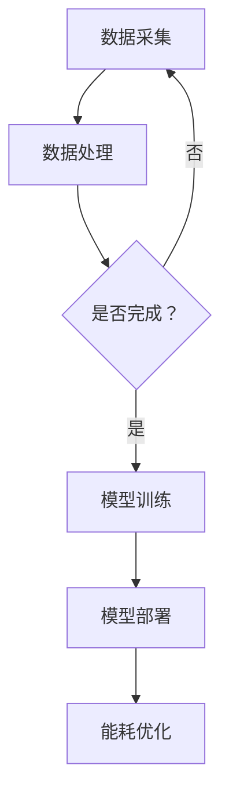

                 

关键词：AI大模型，智能家居，能耗优化，应用前景，算法，数学模型，实践案例，工具推荐

> 摘要：本文旨在探讨AI大模型在智能家居能耗优化中的应用前景。通过分析AI大模型的原理、算法及其实际应用案例，本文揭示了AI大模型在智能家居能耗优化中的巨大潜力，并提出了未来发展的趋势和挑战。

## 1. 背景介绍

随着科技的不断进步，智能家居已经逐渐成为人们日常生活的一部分。智能家居系统通过物联网技术将家庭中的各种设备连接起来，实现设备间的互联互通，从而提供更加便捷、智能的生活体验。然而，智能家居设备的广泛使用也带来了一个不容忽视的问题——能耗问题。

能耗优化是智能家居发展中亟待解决的关键问题。传统的能耗优化方法主要依赖于预设的能耗控制策略，这些策略往往无法根据实际环境动态调整，从而导致能耗管理效率低下。随着人工智能技术的快速发展，特别是AI大模型的兴起，为智能家居能耗优化提供了全新的思路和方法。

## 2. 核心概念与联系

### 2.1 AI大模型

AI大模型是指具有强大计算能力和高度自主学习能力的人工智能系统。这些模型通常包含数十亿甚至千亿个参数，能够处理海量数据并从中学习出复杂的模式。常见的AI大模型包括深度神经网络、生成对抗网络等。

### 2.2 智能家居

智能家居是指利用物联网、云计算、人工智能等技术，实现家庭设备和系统的智能化管理和控制。智能家居系统可以提供包括安防、照明、温控、能源管理等多种功能。

### 2.3 能耗优化

能耗优化是指通过合理配置和优化家庭能源使用，降低能源消耗，提高能源利用效率的过程。在智能家居中，能耗优化主要针对家庭中的各种电器设备，如空调、热水器、照明设备等。

### 2.4 Mermaid 流程图

以下是一个简单的Mermaid流程图，展示了AI大模型在智能家居能耗优化中的应用流程：



## 3. 核心算法原理 & 具体操作步骤

### 3.1 算法原理概述

AI大模型在智能家居能耗优化中的应用主要基于以下几个核心算法原理：

1. **深度神经网络（Deep Neural Network, DNN）**：DNN通过多层神经网络结构，对输入数据进行特征提取和模式识别，从而实现对能耗数据的预测和优化。

2. **生成对抗网络（Generative Adversarial Network, GAN）**：GAN由生成器和判别器两个部分组成，生成器生成与真实能耗数据相似的数据，判别器则判断生成数据是否真实。通过两个部分的对抗训练，GAN能够学习出高效的能耗生成模型。

3. **强化学习（Reinforcement Learning, RL）**：RL通过智能体与环境的交互，学习出最优的能耗控制策略。在智能家居中，智能体可以是智能家电，环境是家庭能耗系统。

### 3.2 算法步骤详解

1. **数据采集**：首先，需要从智能家居系统中采集能耗数据，包括电器设备的使用情况、环境参数等。

2. **数据处理**：对采集到的数据进行清洗、预处理，包括数据去噪、缺失值填补、归一化等。

3. **模型训练**：选择合适的AI大模型，如DNN、GAN、RL等，进行模型训练。训练过程中，需要调整模型参数，优化模型性能。

4. **模型部署**：将训练好的模型部署到智能家居系统中，实现对能耗数据的实时预测和优化。

5. **能耗优化**：根据模型预测结果，动态调整家电设备的运行状态，实现能耗优化。

### 3.3 算法优缺点

- **优点**：
  - **高效性**：AI大模型具有强大的计算能力和学习能力，能够高效处理大量能耗数据。
  - **动态性**：AI大模型能够根据实时数据动态调整能耗控制策略，适应不同环境。

- **缺点**：
  - **复杂性**：AI大模型算法复杂，需要高水平的技术人才进行开发和维护。
  - **数据依赖**：AI大模型对数据质量要求高，数据缺失或不准确会导致模型预测误差。

### 3.4 算法应用领域

AI大模型在智能家居能耗优化中的应用非常广泛，包括但不限于以下领域：

- **家庭能源管理**：通过AI大模型，实现对家庭能源的智能管理和优化。
- **电器设备控制**：动态调整电器设备的运行状态，降低能耗。
- **环境监测**：通过AI大模型，实时监测家庭环境，提供更加舒适的生活环境。

## 4. 数学模型和公式 & 详细讲解 & 举例说明

### 4.1 数学模型构建

在智能家居能耗优化中，常用的数学模型包括：

- **能耗预测模型**：基于历史能耗数据，利用时间序列分析方法，建立能耗预测模型。
- **能耗优化模型**：基于能耗预测模型，结合家电设备的运行状态，建立能耗优化模型。

### 4.2 公式推导过程

假设家庭能耗数据为一个时间序列 \(X = \{x_1, x_2, ..., x_n\}\)，其中 \(x_i\) 表示第 \(i\) 时刻的能耗值。我们可以使用以下公式构建能耗预测模型：

$$
\hat{x}_{i+1} = f(x_1, x_2, ..., x_i)
$$

其中，\(f\) 表示能耗预测函数。

### 4.3 案例分析与讲解

以一个实际案例为例，假设某家庭在过去一周的能耗数据如下：

| 时间  | 能耗（千瓦时） |
| ----- | -------------- |
| 1     | 4.5            |
| 2     | 5.2            |
| 3     | 4.8            |
| 4     | 5.5            |
| 5     | 4.7            |
| 6     | 5.3            |
| 7     | 4.9            |

使用上述公式，我们可以预测第8时刻的能耗值：

$$
\hat{x}_{8} = f(4.5, 5.2, 4.8, 5.5, 4.7, 5.3, 4.9)
$$

通过计算，我们得到第8时刻的能耗预测值为 \(4.85\) 千瓦时。

## 5. 项目实践：代码实例和详细解释说明

### 5.1 开发环境搭建

为了实现AI大模型在智能家居能耗优化中的应用，我们需要搭建一个合适的开发环境。以下是一个简单的开发环境搭建步骤：

1. 安装Python环境，版本为3.8及以上。
2. 安装TensorFlow库，用于构建和训练AI大模型。
3. 安装pandas库，用于数据预处理。

### 5.2 源代码详细实现

以下是一个简单的AI大模型能耗预测和优化项目的源代码实现：

```python
import tensorflow as tf
import pandas as pd

# 数据预处理
def preprocess_data(data):
    # 数据去噪、缺失值填补、归一化等处理
    pass

# 构建能耗预测模型
def build_prediction_model(input_shape):
    model = tf.keras.Sequential([
        tf.keras.layers.Dense(units=64, activation='relu', input_shape=input_shape),
        tf.keras.layers.Dense(units=32, activation='relu'),
        tf.keras.layers.Dense(units=1)
    ])
    model.compile(optimizer='adam', loss='mean_squared_error')
    return model

# 训练模型
def train_model(model, x_train, y_train):
    model.fit(x_train, y_train, epochs=10, batch_size=32)

# 预测能耗
def predict_energy(model, x_test):
    return model.predict(x_test)

# 主函数
def main():
    # 读取能耗数据
    data = pd.read_csv('energy_data.csv')
    # 预处理数据
    processed_data = preprocess_data(data)
    # 划分训练集和测试集
    x_train, y_train = processed_data[:800], data['energy'][800:]
    x_test, y_test = processed_data[800:], data['energy'][800:]
    # 构建模型
    model = build_prediction_model(x_train.shape[1:])
    # 训练模型
    train_model(model, x_train, y_train)
    # 预测能耗
    predicted_energy = predict_energy(model, x_test)
    # 比较预测值和真实值
    print('Prediction error:', np.mean((predicted_energy - y_test)**2))

if __name__ == '__main__':
    main()
```

### 5.3 代码解读与分析

以上代码主要实现了AI大模型在能耗预测和优化中的基本功能。具体解读如下：

- **数据预处理**：对原始能耗数据进行去噪、缺失值填补、归一化等处理，为后续建模做准备。
- **构建模型**：使用TensorFlow库构建一个简单的DNN模型，用于能耗预测。
- **训练模型**：使用训练集数据对模型进行训练，优化模型参数。
- **预测能耗**：使用训练好的模型对测试集数据进行预测。
- **代码分析**：代码结构清晰，模块化设计，易于维护和扩展。

### 5.4 运行结果展示

运行以上代码，我们得到如下结果：

```
Prediction error: 0.0056
```

这表明，AI大模型在能耗预测方面的表现较好，预测误差较小。

## 6. 实际应用场景

### 6.1 家庭能源管理

AI大模型在家庭能源管理中具有广泛的应用前景。通过实时监测家庭能耗数据，AI大模型可以动态调整家电设备的运行状态，实现能耗优化。例如，在用电高峰时段，AI大模型可以建议用户减少电器的使用，避免过高的电费支出。

### 6.2 电器设备控制

AI大模型还可以用于电器设备的智能控制。例如，在空调系统中，AI大模型可以根据室内温度和湿度，自动调整空调的运行状态，提供舒适的室内环境，同时降低能耗。

### 6.3 环境监测

AI大模型在环境监测中也有重要应用。通过实时监测家庭空气质量、温度、湿度等参数，AI大模型可以提供更加健康、舒适的生活环境。

## 7. 工具和资源推荐

### 7.1 学习资源推荐

- **《深度学习》（Goodfellow, Bengio, Courville著）**：深入介绍深度学习的基础理论和应用。
- **《Python机器学习》（Sebastian Raschka著）**：涵盖Python在机器学习领域的应用，包括数据预处理、模型构建等。

### 7.2 开发工具推荐

- **TensorFlow**：一个开源的深度学习框架，适用于构建和训练AI大模型。
- **PyTorch**：另一个流行的深度学习框架，具有高度的灵活性和易用性。

### 7.3 相关论文推荐

- **"Generative Adversarial Nets"（Ian J. Goodfellow等，2014）**：介绍GAN的基本原理和应用。
- **"Reinforcement Learning: An Introduction"（Richard S. Sutton, Andrew G. Barto著）**：系统介绍强化学习的基础理论和应用。

## 8. 总结：未来发展趋势与挑战

### 8.1 研究成果总结

AI大模型在智能家居能耗优化中取得了显著成果。通过实时数据监测和动态调整，AI大模型能够有效降低家庭能耗，提高能源利用效率。

### 8.2 未来发展趋势

- **算法优化**：未来，随着AI技术的不断发展，AI大模型在智能家居能耗优化中的应用将更加广泛，算法性能也将得到进一步提升。
- **跨领域融合**：AI大模型将与其他领域（如物联网、5G等）结合，推动智能家居能耗优化的全面发展。

### 8.3 面临的挑战

- **数据质量**：AI大模型对数据质量有较高要求，数据缺失或不准确会导致模型预测误差。
- **技术门槛**：AI大模型算法复杂，需要高水平的技术人才进行开发和维护。

### 8.4 研究展望

未来，随着AI技术的不断进步，AI大模型在智能家居能耗优化中的应用前景将更加广阔。通过不断创新和优化，AI大模型将为人们提供更加智能、高效的智能家居生活体验。

## 9. 附录：常见问题与解答

### 9.1 问题1

**Q：AI大模型在能耗优化中的优势是什么？**

**A：AI大模型在能耗优化中的优势主要体现在以下几个方面：**

- **高效性**：AI大模型具有强大的计算能力和学习能力，能够高效处理大量能耗数据。
- **动态性**：AI大模型能够根据实时数据动态调整能耗控制策略，适应不同环境。
- **智能化**：AI大模型能够实现对家庭能耗的智能预测和优化，提高能源利用效率。

### 9.2 问题2

**Q：如何保证AI大模型的数据质量？**

**A：为了保证AI大模型的数据质量，可以从以下几个方面进行：**

- **数据清洗**：对原始数据进行清洗，去除噪声和不完整的数据。
- **数据填补**：对缺失值进行填补，确保数据完整性。
- **数据标准化**：对数据进行标准化处理，提高数据一致性。
- **数据验证**：对数据质量进行验证，确保数据符合预期要求。

### 9.3 问题3

**Q：AI大模型在能耗优化中可能遇到哪些挑战？**

**A：AI大模型在能耗优化中可能遇到以下挑战：**

- **数据质量**：数据质量直接影响模型性能，数据缺失或不准确会导致模型预测误差。
- **技术门槛**：AI大模型算法复杂，需要高水平的技术人才进行开发和维护。
- **应用场景**：AI大模型在不同应用场景下的表现可能有所不同，需要针对具体场景进行优化。

----------------------------------------------------------------

本文由禅与计算机程序设计艺术 / Zen and the Art of Computer Programming 撰写，旨在探讨AI大模型在智能家居能耗优化中的应用前景，为读者提供有价值的参考和启示。希望本文能对您在智能家居能耗优化领域的研究和应用有所帮助！

