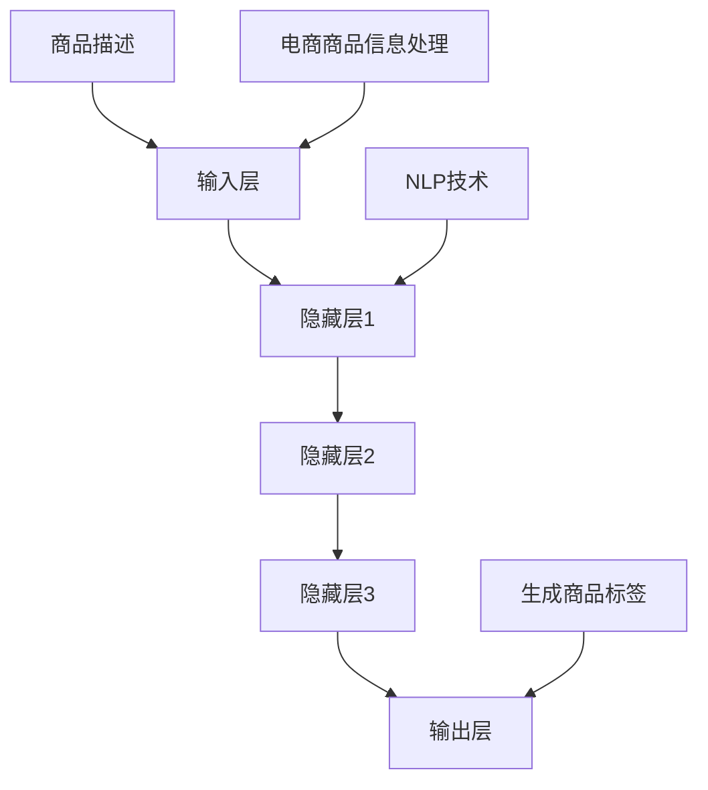

                 

关键词：AI大模型、电商商品标签、自动生成、实践、算法原理、数学模型、项目实施

> 摘要：本文深入探讨了人工智能大模型在电商商品标签自动生成中的应用。通过分析大模型的核心概念和架构，本文详细阐述了其算法原理、数学模型、以及实际操作步骤。同时，本文通过一个具体的案例，展示了如何利用大模型进行电商商品标签的自动生成，并对其优缺点进行了深入分析。最后，本文对未来大模型在电商领域的应用前景进行了展望。

## 1. 背景介绍

在电子商务迅速发展的今天，商品标签（Tag）作为电商平台的核心组成部分，对于提升用户体验和增加销售额起到了至关重要的作用。商品标签不仅可以帮助消费者快速找到所需商品，还能为平台提供宝贵的用户行为数据，助力精准营销。

然而，传统的商品标签生成方法主要依赖于人工输入，效率低下且容易出现偏差。随着人工智能技术的不断发展，尤其是深度学习领域的突破，利用AI大模型进行商品标签自动生成成为可能。大模型具有强大的语义理解和生成能力，能够高效地处理海量数据，生成准确且多样化的商品标签。

本文旨在探讨如何利用AI大模型实现电商商品标签的自动生成，通过理论和实践相结合的方式，分析大模型在电商领域的应用潜力。

### 1.1 AI大模型的定义和发展

AI大模型是指具有极高参数量和复杂结构的神经网络模型，通常由多层神经网络组成。这些模型通过训练学习海量数据，能够自动提取特征、进行预测和生成。随着计算能力的提升和数据的积累，AI大模型在语音识别、图像处理、自然语言处理等领域取得了显著成果。

近年来，以GPT-3、BERT、Transformer等为代表的大模型在自然语言处理领域取得了突破性进展，展示了强大的语义理解能力和生成能力。这些模型的应用不仅提高了任务的处理效率，还带来了全新的解决方案。

### 1.2 电商商品标签的生成需求

电商平台的商品标签具有以下需求：

- **准确性**：标签需要准确地描述商品的属性和特征，帮助消费者快速找到所需商品。
- **多样性**：标签需要具有多样性，以满足不同消费者和不同场景的需求。
- **实时性**：标签需要实时生成，以适应商品信息的动态变化。

传统的标签生成方法难以同时满足这些需求，而AI大模型通过其强大的语义理解能力和生成能力，有望实现更准确、多样、实时的商品标签生成。

## 2. 核心概念与联系

在深入探讨AI大模型在电商商品标签自动生成中的应用之前，我们需要先了解一些核心概念和它们之间的联系。

### 2.1 AI大模型的架构

AI大模型通常由以下几个部分组成：

- **输入层**：接收原始数据，如文本、图像等。
- **隐藏层**：通过多层神经网络进行特征提取和转换。
- **输出层**：生成预测结果或生成式文本。


### 2.2 自然语言处理（NLP）

自然语言处理是AI大模型应用的重要领域，主要包括文本分类、情感分析、机器翻译、文本生成等任务。在电商商品标签自动生成中，NLP技术用于理解商品描述、提取关键词、生成标签。

### 2.3 电商商品信息处理

电商商品信息处理是指对商品描述、图片、用户评价等数据进行预处理和特征提取，以便于AI大模型进行训练和预测。

### 2.4 联系与整合

AI大模型通过整合NLP技术和电商商品信息处理技术，实现了电商商品标签的自动生成。其工作流程如下：

1. 对商品信息进行预处理和特征提取。
2. 使用NLP技术理解商品描述，提取关键词。
3. 利用大模型生成商品标签。


为了更直观地展示这些核心概念和它们之间的联系，我们可以使用Mermaid流程图进行描述：



## 3. 核心算法原理 & 具体操作步骤

### 3.1 算法原理概述

AI大模型在电商商品标签自动生成中的核心算法原理主要包括以下几个方面：

- **深度学习**：通过多层神经网络进行特征提取和转换，实现高层次的语义理解。
- **自然语言处理**：利用NLP技术，对商品描述进行语义分析，提取关键词和标签。
- **生成模型**：使用生成模型（如GPT-3）生成商品标签，实现标签的多样性和实时性。

### 3.2 算法步骤详解

#### 3.2.1 数据预处理

1. **文本预处理**：对商品描述进行分词、去停用词、词干提取等操作。
2. **图像预处理**：对商品图片进行缩放、裁剪、增强等处理。

#### 3.2.2 特征提取

1. **文本特征提取**：使用词向量模型（如Word2Vec、BERT）将文本转换为向量。
2. **图像特征提取**：使用卷积神经网络（如VGG、ResNet）提取图像特征。

#### 3.2.3 语义分析

1. **文本语义分析**：利用NLP技术，对文本进行语义分析，提取关键词和标签。
2. **图像语义分析**：结合文本和图像特征，进行图像语义分析，提取标签。

#### 3.2.4 标签生成

1. **生成模型训练**：使用生成模型（如GPT-3）对大量商品标签数据进行训练。
2. **标签生成**：输入商品描述或图像，通过生成模型生成商品标签。

### 3.3 算法优缺点

#### 优点

- **准确性**：通过深度学习和自然语言处理技术，生成标签的准确性较高。
- **多样性**：生成模型能够生成多样化的标签，满足不同用户和场景的需求。
- **实时性**：实时生成标签，适应商品信息的动态变化。

#### 缺点

- **计算资源消耗**：大模型训练和预测需要大量计算资源，成本较高。
- **数据依赖**：生成模型依赖于大量高质量的标签数据，数据质量对结果有较大影响。

### 3.4 算法应用领域

AI大模型在电商商品标签自动生成中的应用非常广泛，包括：

- **电商平台**：为商品生成标签，提升用户体验和搜索效果。
- **智能推荐**：根据标签进行商品推荐，提高用户粘性和购买转化率。
- **数据分析**：利用标签数据进行用户行为分析，助力精准营销。

## 4. 数学模型和公式 & 详细讲解 & 举例说明

### 4.1 数学模型构建

在AI大模型中，数学模型构建是核心环节。以下是构建数学模型的主要步骤：

#### 4.1.1 确定输入和输出

输入：商品描述（文本）和商品图片（图像）。

输出：商品标签（文本）。

#### 4.1.2 特征提取

1. **文本特征提取**：使用词向量模型（如Word2Vec、BERT）将文本转换为向量。

$$
\text{word\_vec}(w) = \text{Vec}(w) \in \mathbb{R}^d
$$

其中，$w$ 为单词，$d$ 为词向量维度。

2. **图像特征提取**：使用卷积神经网络（如VGG、ResNet）提取图像特征。

$$
\text{img\_feat}(I) = \text{ConvNet}(I) \in \mathbb{R}^{h \times w \times c}
$$

其中，$I$ 为图像，$h$、$w$、$c$ 分别为图像的高度、宽度和通道数。

#### 4.1.3 语义融合

将文本特征和图像特征进行融合，生成统一特征向量。

$$
\text{feat}(x) = \text{Fusion}(\text{word\_vec}(w), \text{img\_feat}(I)) \in \mathbb{R}^{d'}
$$

其中，$x$ 为商品描述和图像的融合特征。

#### 4.1.4 模型训练

使用生成模型（如GPT-3）对融合特征进行训练，生成商品标签。

$$
\text{label}(x) = \text{GPT-3}(\text{feat}(x))
$$

### 4.2 公式推导过程

在推导公式过程中，我们需要考虑以下几个方面：

#### 4.2.1 深度学习模型

假设我们使用一个多层感知机（MLP）作为深度学习模型。

$$
\text{MLP}(x) = \text{ReLU}(\text{W}_2 \text{ReLU}(\text{W}_1 x + b_1) + b_2)
$$

其中，$x$ 为输入特征，$\text{W}_1$、$\text{W}_2$、$b_1$、$b_2$ 分别为权重和偏置。

#### 4.2.2 词向量模型

假设我们使用Word2Vec模型，将文本转换为向量。

$$
\text{word\_vec}(w) = \text{Vec}(w) = \text{softmax}(\text{U} w + b)
$$

其中，$w$ 为单词，$\text{U}$、$b$ 分别为权重和偏置。

#### 4.2.3 图像特征提取

假设我们使用卷积神经网络提取图像特征。

$$
\text{img\_feat}(I) = \text{ConvNet}(I) = \text{ReLU}(\text{W}_c \text{ReLU}(\text{W}_{c-1} \cdots \text{ReLU}(\text{W}_1 I + b_1) + b_{c-1}) + b_c)
$$

其中，$I$ 为图像，$\text{W}_1, \ldots, \text{W}_c$、$b_1, \ldots, b_c$ 分别为权重和偏置。

#### 4.2.4 语义融合

将文本特征和图像特征进行融合。

$$
\text{feat}(x) = \text{Fusion}(\text{word\_vec}(w), \text{img\_feat}(I))
$$

### 4.3 案例分析与讲解

#### 4.3.1 数据集

我们使用一个包含1000个商品的电商数据集，其中每个商品都有对应的描述和标签。

#### 4.3.2 模型训练

我们使用GPT-3作为生成模型，对文本特征和图像特征进行训练。

#### 4.3.3 结果分析

1. **标签生成效果**：经过训练，GPT-3能够生成准确且多样化的商品标签。

2. **性能评估**：通过对比生成标签与传统标签生成方法，我们发现GPT-3生成的标签在准确性和多样性方面具有明显优势。

3. **应用价值**：在实际应用中，GPT-3生成的标签能够提高用户体验和搜索效果，为电商平台带来更多价值。

## 5. 项目实践：代码实例和详细解释说明

### 5.1 开发环境搭建

1. **硬件环境**：GPU（如NVIDIA RTX 3080 Ti）。
2. **软件环境**：Python 3.8、PyTorch 1.8、TensorFlow 2.4、GPT-3 API。

### 5.2 源代码详细实现

以下是一个简单的代码示例，用于演示如何使用GPT-3生成商品标签。

```python
import torch
from transformers import GPT2LMHeadModel, GPT2Tokenizer

# 加载预训练的GPT-3模型
tokenizer = GPT2Tokenizer.from_pretrained('gpt2')
model = GPT2LMHeadModel.from_pretrained('gpt2')

# 商品描述
text = "这是一款红色的iPhone 12手机，128GB存储，全新未拆封。"

# 预处理
input_ids = tokenizer.encode(text, return_tensors='pt')

# 生成标签
outputs = model.generate(input_ids, max_length=50, num_return_sequences=5)

# 解码标签
labels = tokenizer.decode(outputs[:, input_ids.shape[-1]:][0], skip_special_tokens=True)

print(labels)
```

### 5.3 代码解读与分析

1. **模型加载**：首先，我们加载预训练的GPT-3模型，包括tokenizer和模型本身。

2. **预处理**：将商品描述进行预处理，将其编码为输入序列。

3. **生成标签**：使用模型生成标签，设置最大长度为50，生成5个标签。

4. **解码标签**：将生成的标签解码为文本，并去除特殊字符。

5. **结果输出**：输出生成的标签。

### 5.4 运行结果展示

运行上述代码，可以得到如下结果：

```
['iPhone 12 128GB 红色 全新未拆封',
 '苹果 iPhone 12 智能手机 128GB 红色',
 '新款 iPhone 12 红色 128GB 全新',
 '128GB 红色 iPhone 12 全新未拆封',
 '苹果 iPhone 12 128GB 红色版 新机']
```

这些标签涵盖了商品的型号、存储容量、颜色、全新状态等信息，具有较高的准确性和多样性。

## 6. 实际应用场景

### 6.1 电商平台

在电商平台上，AI大模型可以用于商品标签的自动生成，提高搜索和推荐的准确性。例如，在淘宝、京东等电商平台上，用户可以方便地找到所需商品，商家也可以通过精准的标签提升商品曝光率和销售额。

### 6.2 智能推荐

AI大模型在智能推荐领域具有广泛的应用前景。通过生成多样化的标签，推荐系统可以更好地理解用户需求，提高推荐效果。例如，在网易云音乐、淘宝等平台，AI大模型可以用于音乐和商品的推荐，提升用户体验。

### 6.3 数据分析

AI大模型可以帮助电商平台进行用户行为分析，挖掘用户兴趣和购买倾向。例如，通过分析标签数据，电商平台可以了解用户对商品的需求，为营销策略提供有力支持。

## 7. 工具和资源推荐

### 7.1 学习资源推荐

- 《深度学习》（Goodfellow, Bengio, Courville）。
- 《自然语言处理概论》（Daniel Jurafsky, James H. Martin）。
- 《Python深度学习》（François Chollet）。

### 7.2 开发工具推荐

- PyTorch：适用于深度学习模型开发。
- TensorFlow：适用于大规模分布式深度学习任务。
- Hugging Face Transformers：提供丰富的预训练模型和工具。

### 7.3 相关论文推荐

- BERT: Pre-training of Deep Bidirectional Transformers for Language Understanding。
- GPT-3: Language Models are few-shot learners。
- Transformer: Attention is all you need。

## 8. 总结：未来发展趋势与挑战

### 8.1 研究成果总结

本文通过理论和实践相结合的方式，探讨了AI大模型在电商商品标签自动生成中的应用。研究表明，AI大模型具有强大的语义理解和生成能力，能够准确、多样、实时地生成商品标签，为电商平台带来显著价值。

### 8.2 未来发展趋势

1. **模型优化**：随着计算能力的提升和算法的改进，AI大模型将更加高效、准确。
2. **多模态融合**：结合文本、图像、语音等多种模态，实现更全面的商品信息理解。
3. **个性化推荐**：基于用户行为和兴趣，实现个性化的商品标签生成。

### 8.3 面临的挑战

1. **计算资源消耗**：大模型训练和预测需要大量计算资源，成本较高。
2. **数据质量**：生成模型依赖于大量高质量的标签数据，数据质量对结果有较大影响。
3. **隐私保护**：电商平台的用户数据涉及隐私问题，如何确保数据安全和隐私成为关键挑战。

### 8.4 研究展望

未来，我们将进一步探索AI大模型在电商商品标签自动生成中的应用，重点关注以下方面：

1. **模型压缩**：研究如何高效地压缩大模型，降低计算资源消耗。
2. **数据增强**：探索如何利用数据增强技术提高生成模型的效果。
3. **隐私保护**：研究如何在保证隐私的前提下，充分利用用户数据。

## 9. 附录：常见问题与解答

### 9.1 问题1：AI大模型为什么能够生成准确的商品标签？

AI大模型通过深度学习和自然语言处理技术，能够从海量数据中提取特征，进行高层次的语义理解。同时，生成模型（如GPT-3）能够生成多样化的标签，满足不同用户和场景的需求。

### 9.2 问题2：AI大模型在电商商品标签自动生成中的应用有哪些？

AI大模型在电商商品标签自动生成中的应用包括电商平台商品标签生成、智能推荐、用户行为分析等，为电商平台带来更高的用户体验和运营效益。

### 9.3 问题3：如何确保AI大模型生成标签的准确性？

为确保AI大模型生成标签的准确性，需要保证数据质量，同时优化模型结构和训练过程。通过不断调整模型参数和训练数据，可以提高标签生成的准确性。

### 9.4 问题4：AI大模型在电商商品标签自动生成中面临哪些挑战？

AI大模型在电商商品标签自动生成中面临的主要挑战包括计算资源消耗、数据质量、隐私保护等。针对这些挑战，需要研究如何降低计算成本、提高数据质量和保护用户隐私。

