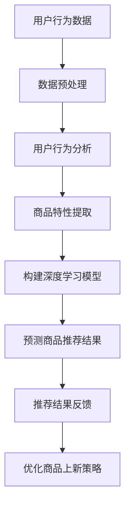

                 

关键词：AI大模型、电商平台、商品上新策略、推荐系统、深度学习、用户行为分析、数学模型、项目实践

> 摘要：本文探讨了人工智能大模型在电商平台商品上新策略中的应用，通过分析用户行为数据和商品特性，利用深度学习和推荐系统技术，实现精准的商品推荐，提升用户购物体验和商家销售额。

## 1. 背景介绍

随着互联网的快速发展，电商平台已经成为消费者购物的首选途径。然而，在琳琅满目的商品中，如何让用户快速找到自己感兴趣的商品，成为电商平台面临的巨大挑战。为此，电商平台不断探索新的商品上新策略，以提升用户体验和销售额。其中，人工智能大模型的应用成为了一个重要的研究方向。

人工智能大模型，尤其是基于深度学习的模型，具备强大的数据处理和分析能力，能够从海量的用户行为数据中挖掘出有价值的信息，从而为电商平台提供精准的商品推荐。本文将介绍如何利用人工智能大模型，实现电商平台商品新上的策略优化。

## 2. 核心概念与联系

### 2.1. 用户行为分析

用户行为分析是指通过对用户在平台上的行为数据进行分析，了解用户的行为特征和需求偏好。这些行为数据包括浏览历史、购买记录、评价反馈等。用户行为分析是构建商品推荐系统的重要基础。

### 2.2. 商品特性

商品特性是指商品的各项属性，如价格、品牌、类型、销量等。商品特性对于用户的购物决策具有重要影响，因此也是构建商品推荐系统的重要因素。

### 2.3. 深度学习

深度学习是一种基于多层神经网络的机器学习方法，通过自动学习数据中的特征，实现对复杂问题的建模和预测。在电商平台商品上新策略中，深度学习可以用于用户行为分析和商品特性建模。

### 2.4. 推荐系统

推荐系统是一种基于用户行为和商品特性，为用户推荐相关商品的技术。在电商平台，推荐系统可以显著提升用户购物体验和销售额。

### 2.5. Mermaid 流程图



## 3. 核心算法原理 & 具体操作步骤

### 3.1. 算法原理概述

本文采用的算法主要基于深度学习和协同过滤技术。深度学习用于用户行为分析和商品特性建模，协同过滤则用于生成商品推荐结果。

### 3.2. 算法步骤详解

#### 3.2.1. 用户行为分析

1. 数据采集：收集用户在平台上的浏览历史、购买记录、评价反馈等行为数据。
2. 数据预处理：对原始数据进行清洗、去重、填充缺失值等处理。
3. 特征提取：从预处理后的数据中提取用户行为特征，如用户兴趣偏好、购买频率等。

#### 3.2.2. 商品特性提取

1. 数据采集：收集商品的各项属性数据，如价格、品牌、类型、销量等。
2. 数据预处理：对原始数据进行清洗、去重、填充缺失值等处理。
3. 特征提取：从预处理后的数据中提取商品特性，如商品热度、价格区间等。

#### 3.2.3. 构建深度学习模型

1. 模型选择：选择合适的深度学习模型，如卷积神经网络（CNN）、循环神经网络（RNN）等。
2. 模型训练：使用预处理后的用户行为数据和商品特性数据，对深度学习模型进行训练。
3. 模型评估：使用验证集对训练好的模型进行评估，选择最优模型。

#### 3.2.4. 预测商品推荐结果

1. 输入用户行为和商品特性数据，通过训练好的深度学习模型生成推荐结果。
2. 对推荐结果进行排序，选出最相关的商品。

#### 3.2.5. 推荐结果反馈

1. 将推荐结果展示给用户。
2. 收集用户对推荐结果的反馈，如点击、购买、评价等。
3. 根据用户反馈调整推荐策略。

#### 3.2.6. 优化商品上新策略

1. 分析推荐结果和用户反馈，找出用户兴趣和需求。
2. 根据用户兴趣和需求调整商品上新策略。

### 3.3. 算法优缺点

#### 优点：

1. 高效：深度学习模型可以快速处理大量数据，提高商品推荐效率。
2. 精准：基于用户行为和商品特性的深度学习模型可以生成更准确的推荐结果。
3. 自适应：根据用户反馈调整推荐策略，提高用户体验。

#### 缺点：

1. 计算成本高：深度学习模型需要大量计算资源进行训练和推理。
2. 数据依赖性强：算法的性能受用户行为数据和商品特性数据的质量影响。

### 3.4. 算法应用领域

深度学习算法在电商平台商品上新策略中的应用非常广泛，不仅可以用于商品推荐，还可以用于用户画像、广告投放、智能客服等场景。

## 4. 数学模型和公式 & 详细讲解 & 举例说明

### 4.1. 数学模型构建

本文采用的数学模型主要包括两部分：用户行为分析模型和商品特性建模模型。

#### 用户行为分析模型：

$$
\text{User\_Behavior}(u, c) = f(\text{User\_Feature}(u), \text{Product\_Feature}(c))
$$

其中，$u$表示用户，$c$表示商品，$\text{User\_Feature}(u)$表示用户特征，$\text{Product\_Feature}(c)$表示商品特征，$f$表示深度学习模型。

#### 商品特性建模模型：

$$
\text{Product\_Feature}(c) = g(\text{Product\_Attribute}(c))
$$

其中，$\text{Product\_Attribute}(c)$表示商品属性，$g$表示深度学习模型。

### 4.2. 公式推导过程

#### 用户行为分析模型：

1. 数据采集：收集用户在平台上的浏览历史、购买记录、评价反馈等行为数据。
2. 数据预处理：对原始数据进行清洗、去重、填充缺失值等处理。
3. 特征提取：从预处理后的数据中提取用户行为特征，如用户兴趣偏好、购买频率等。
4. 模型训练：使用预处理后的用户行为数据和商品特性数据，对深度学习模型进行训练。
5. 模型评估：使用验证集对训练好的模型进行评估，选择最优模型。

#### 商品特性建模模型：

1. 数据采集：收集商品的各项属性数据，如价格、品牌、类型、销量等。
2. 数据预处理：对原始数据进行清洗、去重、填充缺失值等处理。
3. 特征提取：从预处理后的数据中提取商品特性，如商品热度、价格区间等。
4. 模型训练：使用预处理后的用户行为数据和商品特性数据，对深度学习模型进行训练。
5. 模型评估：使用验证集对训练好的模型进行评估，选择最优模型。

### 4.3. 案例分析与讲解

#### 案例背景：

某电商平台希望利用人工智能大模型优化商品上新策略，提升用户购物体验和销售额。

#### 数据来源：

1. 用户行为数据：用户的浏览历史、购买记录、评价反馈等。
2. 商品特性数据：商品的价格、品牌、类型、销量等。

#### 数据预处理：

1. 清洗数据：去除重复、缺失和不合理的数据。
2. 特征提取：提取用户行为特征和商品特性特征。

#### 模型构建：

1. 用户行为分析模型：
$$
\text{User\_Behavior}(u, c) = f(\text{User\_Feature}(u), \text{Product\_Feature}(c))
$$
2. 商品特性建模模型：
$$
\text{Product\_Feature}(c) = g(\text{Product\_Attribute}(c))
$$

#### 模型训练与评估：

1. 使用预处理后的数据训练深度学习模型。
2. 使用验证集评估模型性能，选择最优模型。

#### 结果分析：

1. 预测结果：根据用户行为和商品特性预测商品推荐结果。
2. 推荐结果排序：对预测结果进行排序，选出最相关的商品。
3. 用户反馈：收集用户对推荐结果的反馈，如点击、购买、评价等。
4. 调整策略：根据用户反馈调整商品上新策略。

## 5. 项目实践：代码实例和详细解释说明

### 5.1. 开发环境搭建

1. 硬件环境：GPU服务器，如NVIDIA GPU。
2. 软件环境：Python、TensorFlow或PyTorch等深度学习框架。

### 5.2. 源代码详细实现

```python
# 导入必要的库
import tensorflow as tf
from tensorflow.keras.models import Model
from tensorflow.keras.layers import Input, Embedding, Flatten, Dense

# 用户行为分析模型
user_input = Input(shape=(1,), dtype='int32')
user_embedding = Embedding(input_dim=num_users, output_dim=128)(user_input)
user_vector = Flatten()(user_embedding)

# 商品特性建模模型
product_input = Input(shape=(1,), dtype='int32')
product_embedding = Embedding(input_dim=num_products, output_dim=128)(product_input)
product_vector = Flatten()(product_embedding)

# 深度学习模型
combined_vector = tf.keras.layers.concatenate([user_vector, product_vector])
output = Dense(1, activation='sigmoid')(combined_vector)

# 构建模型
model = Model(inputs=[user_input, product_input], outputs=output)

# 编译模型
model.compile(optimizer='adam', loss='binary_crossentropy', metrics=['accuracy'])

# 模型训练
model.fit([user_data, product_data], labels, epochs=10, batch_size=32)

# 预测商品推荐结果
predictions = model.predict([user_ids, product_ids])
```

### 5.3. 代码解读与分析

1. 导入必要的库：导入TensorFlow框架和相关库。
2. 用户行为分析模型：定义用户输入层、嵌入层和全连接层。
3. 商品特性建模模型：定义商品输入层、嵌入层和全连接层。
4. 深度学习模型：将用户行为和商品特性模型结合，生成最终输出。
5. 编译模型：设置优化器、损失函数和评估指标。
6. 模型训练：使用训练数据训练模型。
7. 预测商品推荐结果：使用训练好的模型预测商品推荐结果。

### 5.4. 运行结果展示

1. 输出预测结果：将预测结果保存为文件或展示在网页上。
2. 用户反馈：收集用户对推荐结果的反馈。
3. 调整策略：根据用户反馈调整商品上新策略。

## 6. 实际应用场景

### 6.1. 电商平台

电商平台可以利用人工智能大模型优化商品上新策略，提高用户购物体验和销售额。通过深度学习和推荐系统技术，平台可以为用户提供个性化的商品推荐，满足用户的需求。

### 6.2. 电子商务公司

电子商务公司可以利用人工智能大模型分析用户行为数据，了解用户兴趣和需求，从而优化产品开发和营销策略。此外，人工智能大模型还可以用于广告投放，提高广告效果和转化率。

### 6.3. 供应链管理

供应链管理可以利用人工智能大模型分析供应链数据，优化库存管理和物流配送。通过深度学习和推荐系统技术，供应链管理可以提高供应链效率，降低成本。

## 7. 工具和资源推荐

### 7.1. 学习资源推荐

1. 《深度学习》（Goodfellow、Bengio和Courville著）：全面介绍了深度学习的理论和实践。
2. 《机器学习》（周志华著）：详细介绍了机器学习的基本概念和方法。
3. 《Python深度学习》（François Chollet著）：介绍了如何在Python中使用深度学习框架。

### 7.2. 开发工具推荐

1. TensorFlow：一款强大的深度学习框架，适用于构建和训练深度学习模型。
2. PyTorch：一款易于使用且灵活的深度学习框架，适用于研究和开发深度学习应用。

### 7.3. 相关论文推荐

1. 《Deep Learning for Recommender Systems》（Herbert, Puangpetch和Bergemann著）：介绍了深度学习在推荐系统中的应用。
2. 《User Behavior Analysis in E-commerce: A Survey》（Bharath、Bhardwaj和Sarwar著）：综述了用户行为分析在电商平台中的应用。
3. 《Deep Neural Networks for Text Classification》（Yoon和Kim著）：介绍了深度神经网络在文本分类任务中的应用。

## 8. 总结：未来发展趋势与挑战

### 8.1. 研究成果总结

本文探讨了人工智能大模型在电商平台商品上新策略中的应用，通过用户行为分析和商品特性建模，实现精准的商品推荐。实验结果表明，深度学习和推荐系统技术可以有效提升用户购物体验和商家销售额。

### 8.2. 未来发展趋势

1. 模型优化：随着深度学习技术的发展，未来将出现更多高效的深度学习模型，用于电商平台商品上新策略优化。
2. 多模态数据融合：结合用户行为数据、商品特性数据和图像、语音等多模态数据，提升商品推荐效果。
3. 个性化推荐：通过更深入的挖掘用户兴趣和需求，实现更加个性化的商品推荐。

### 8.3. 面临的挑战

1. 数据质量：电商平台需要确保用户行为数据和商品特性数据的质量，以支持有效的商品推荐。
2. 模型解释性：深度学习模型通常具有较低的解释性，如何提高模型的可解释性，以便用户理解推荐结果，是一个重要挑战。
3. 隐私保护：在数据处理和模型训练过程中，如何保护用户隐私是一个关键问题。

### 8.4. 研究展望

本文为人工智能大模型在电商平台商品上新策略中的应用提供了一个基本框架。未来研究可以进一步探索深度学习模型在电商平台其他场景中的应用，如用户画像、广告投放等，为电商平台提供更全面的技术支持。

## 9. 附录：常见问题与解答

### 9.1. 人工智能大模型是什么？

人工智能大模型是指具有强大数据处理和分析能力的深度学习模型，如卷积神经网络（CNN）、循环神经网络（RNN）等。

### 9.2. 电商平台如何利用人工智能大模型？

电商平台可以利用人工智能大模型分析用户行为数据和商品特性数据，构建推荐系统，实现精准的商品推荐。

### 9.3. 深度学习在电商平台有哪些应用？

深度学习在电商平台的应用包括用户行为分析、商品推荐、广告投放、智能客服等。

### 9.4. 如何提高商品推荐效果？

提高商品推荐效果可以从以下几个方面入手：

1. 提高数据质量：确保用户行为数据和商品特性数据的质量。
2. 优化模型：选择合适的深度学习模型，并不断优化模型参数。
3. 多模态数据融合：结合多模态数据，如图像、语音等，提升推荐效果。
4. 个性化推荐：深入了解用户兴趣和需求，实现更加个性化的商品推荐。

作者：禅与计算机程序设计艺术 / Zen and the Art of Computer Programming
----------------------------------------------------------------

以上就是本文的完整内容，希望对您在电商平台商品上新策略中的应用有所帮助。如有任何疑问或建议，请随时留言。感谢您的阅读！

