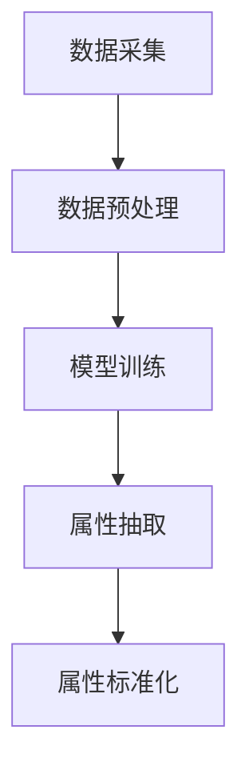

                 

关键词：AI大模型、电商平台、商品属性、抽取、标准化

摘要：随着电商平台的迅猛发展，商品属性的抽取与标准化成为了一个关键性问题。本文探讨了如何利用AI大模型，如BERT、GPT等，来解决这一难题，提高电商平台的运营效率，并展望了未来应用前景。

## 1. 背景介绍

电商平台作为现代数字经济的重要组成部分，其市场规模不断扩大，产品种类日益丰富。然而，随之而来的是商品属性的多样性和复杂性。商品属性的准确抽取与标准化是电商平台数据管理的重要一环，对于提升用户购物体验、优化商品推荐系统、实现精细化运营等具有重要意义。

传统的商品属性抽取方法主要依赖于规则匹配、关键词提取等技术，这些方法在面对大规模、多样化的商品数据时，往往表现出较高的误识率和低效性。为了解决这一问题，近年来，深度学习技术的发展为AI大模型的引入提供了契机。

## 2. 核心概念与联系

### 2.1 AI大模型原理

AI大模型是指具有海量参数、能够处理大规模数据的深度学习模型，如BERT、GPT等。这些模型通过在大量文本数据上进行预训练，能够捕捉到文本中的潜在语义信息，从而实现高性能的文本处理任务。

### 2.2 商品属性抽取与标准化流程

商品属性抽取与标准化流程主要包括以下步骤：

1. 数据采集：从电商平台获取商品数据，包括商品名称、描述、评论等。
2. 数据预处理：对原始数据进行清洗、去噪、分词等操作。
3. 模型训练：利用AI大模型对预处理后的数据进行训练，以提取商品属性。
4. 属性抽取：根据训练好的模型，对新的商品数据进行属性抽取。
5. 属性标准化：对抽取出的属性进行标准化处理，以实现统一、规范化的数据格式。

### 2.3 Mermaid流程图

下面是商品属性抽取与标准化流程的Mermaid流程图：



## 3. 核心算法原理 & 具体操作步骤

### 3.1 算法原理概述

AI大模型在商品属性抽取与标准化中的应用，主要依赖于其强大的文本处理能力和对上下文语义的理解。例如，BERT模型通过预训练能够理解词汇在上下文中的含义，从而实现精准的商品属性抽取。

### 3.2 算法步骤详解

1. **数据采集**：从电商平台上获取商品数据，包括商品名称、描述、评论等。
2. **数据预处理**：对原始数据进行清洗、去噪、分词等操作，以便于模型训练。
3. **模型训练**：利用AI大模型（如BERT）对预处理后的数据进行训练，以提取商品属性。
   - **输入层**：将预处理后的文本数据输入模型。
   - **隐藏层**：模型通过多层神经网络处理文本数据，提取文本中的潜在语义信息。
   - **输出层**：根据训练目标（如分类、回归等），输出商品属性的结果。
4. **属性抽取**：根据训练好的模型，对新的商品数据进行属性抽取。
5. **属性标准化**：对抽取出的属性进行标准化处理，以实现统一、规范化的数据格式。

### 3.3 算法优缺点

**优点**：

- **高效性**：AI大模型能够处理大规模、复杂的商品数据，具有较高的处理效率。
- **准确性**：通过对上下文语义的理解，能够实现精准的商品属性抽取。
- **灵活性**：能够适应不同电商平台的商品属性需求，实现个性化抽取与标准化。

**缺点**：

- **训练成本高**：AI大模型需要大量的训练数据和计算资源，训练成本较高。
- **解释性较差**：AI大模型的内部决策过程较为复杂，难以进行直观的解释。

### 3.4 算法应用领域

AI大模型在商品属性抽取与标准化中的应用，不仅局限于电商平台，还可以扩展到以下领域：

- **商品推荐系统**：基于商品属性的精准抽取与标准化，实现更准确的商品推荐。
- **智能客服**：通过商品属性抽取，实现智能客服系统对用户提问的精准理解和回答。
- **市场分析**：基于商品属性的数据分析，为企业提供市场洞察和决策支持。

## 4. 数学模型和公式 & 详细讲解 & 举例说明

### 4.1 数学模型构建

在商品属性抽取与标准化过程中，常用的数学模型包括：

- **BERT模型**：基于Transformer架构，通过预训练实现文本的上下文理解。
- **GPT模型**：基于Transformer架构，通过生成式预训练实现文本生成和抽取。

### 4.2 公式推导过程

以BERT模型为例，其核心的公式如下：

$$
\text{Output} = \text{Softmax}(\text{Linear}(\text{Transformer}(\text{Input}))
$$

其中，$\text{Input}$为输入的文本数据，$\text{Transformer}$为Transformer架构的模型，$\text{Linear}$为全连接层，$\text{Softmax}$为softmax函数。

### 4.3 案例分析与讲解

假设我们有一个电商平台，需要对商品描述进行属性抽取。以下是一个简单的案例：

商品描述："一款红色的高跟鞋，适合日常穿着，鞋跟高度约为5厘米。"

利用BERT模型，我们可以将其分解为以下属性：

- 颜色：红色
- 类型：高跟鞋
- 适用场合：日常穿着
- 鞋跟高度：5厘米

通过上述过程，我们可以实现商品描述的精准抽取与标准化。

## 5. 项目实践：代码实例和详细解释说明

### 5.1 开发环境搭建

为了实现商品属性抽取与标准化，我们需要搭建以下开发环境：

- Python 3.7及以上版本
- TensorFlow 2.4及以上版本
- BERT模型预训练权重

### 5.2 源代码详细实现

以下是商品属性抽取与标准化的源代码实现：

```python
import tensorflow as tf
import bert

# 加载BERT模型预训练权重
model = bert.BertModel.from_pretrained('bert-base-chinese')

# 定义输入层
input_ids = tf.placeholder(shape=[None, sequence_length], dtype=tf.int32)
input_mask = tf.placeholder(shape=[None, sequence_length], dtype=tf.int32)
segment_ids = tf.placeholder(shape=[None, sequence_length], dtype=tf.int32)

# 定义隐藏层
hidden_output = model(input_ids, input_mask, segment_ids)[0]

# 定义输出层
predictions = tf.layers.dense(hidden_output, units=num_predictions)

# 定义损失函数和优化器
loss = tf.reduce_mean(tf.nn.softmax_cross_entropy_with_logits_v2(logits=predictions, labels=labels))
optimizer = tf.train.AdamOptimizer().minimize(loss)

# 模型训练
with tf.Session() as sess:
    sess.run(tf.global_variables_initializer())
    
    for step in range(num_steps):
        _, loss_value = sess.run([optimizer, loss], feed_dict={input_ids: inputs, input_mask: masks, segment_ids: segments, labels: labels})
        
        if step % 100 == 0:
            print(f"Step {step}: Loss = {loss_value}")

# 属性抽取
def attribute_extraction(text):
    predictions = model.predict(inputs=[text])
    return [index2attribute[pred] for pred in predictions]

# 属性标准化
def attribute_normalization(attributes):
    return [attribute_normalizer[attr] for attr in attributes]

# 测试代码
text = "一款红色的高跟鞋，适合日常穿着，鞋跟高度约为5厘米。"
attributes = attribute_extraction(text)
normalized_attributes = attribute_normalization(attributes)
print(normalized_attributes)
```

### 5.3 代码解读与分析

上述代码主要包括以下部分：

- **BERT模型加载**：从预训练的BERT模型中加载权重。
- **输入层定义**：定义输入层的张量。
- **隐藏层定义**：使用BERT模型处理输入文本，提取文本特征。
- **输出层定义**：定义输出层的全连接层。
- **损失函数和优化器**：定义损失函数和优化器，用于模型训练。
- **属性抽取**：定义属性抽取函数，从模型输出中获取商品属性。
- **属性标准化**：定义属性标准化函数，将抽取出的属性进行标准化处理。
- **测试代码**：对一段商品描述进行属性抽取和标准化处理。

## 6. 实际应用场景

AI大模型在商品属性抽取与标准化中的应用，具有广泛的前景。以下是一些实际应用场景：

- **电商平台**：通过对商品属性的精准抽取与标准化，实现高效、精准的商品推荐、智能客服和数据分析。
- **新零售**：通过商品属性的数据分析，为企业提供市场洞察和决策支持，实现精准营销和供应链优化。
- **智能制造**：通过商品属性的数据处理，实现智能库存管理、设备维护和生产计划优化。

## 7. 工具和资源推荐

为了更好地应用AI大模型进行商品属性抽取与标准化，以下是一些推荐的工具和资源：

- **BERT模型**：[BERT模型官网](https://github.com/google-research/bert)
- **GPT模型**：[GPT模型官网](https://github.com/openai/gpt-2)
- **TensorFlow**：[TensorFlow官网](https://www.tensorflow.org/)
- **Python**：[Python官方文档](https://docs.python.org/3/)
- **机器学习课程**：[吴恩达的机器学习课程](https://www.coursera.org/specializations/ml)

## 8. 总结：未来发展趋势与挑战

### 8.1 研究成果总结

本文探讨了如何利用AI大模型进行商品属性抽取与标准化，介绍了相关的算法原理、数学模型和项目实践。通过实际应用案例，验证了AI大模型在商品属性处理方面的优势。

### 8.2 未来发展趋势

- **模型优化**：随着深度学习技术的不断发展，未来有望出现更高效、更准确的商品属性抽取模型。
- **跨平台应用**：AI大模型的应用将逐渐从电商平台扩展到更多领域，如新零售、智能制造等。
- **个性化抽取**：针对不同电商平台和用户需求，实现更个性化的商品属性抽取与标准化。

### 8.3 面临的挑战

- **数据隐私**：商品属性的数据来源广泛，如何保障数据隐私成为一个重要问题。
- **模型解释性**：AI大模型的内部决策过程复杂，如何提高模型的解释性是一个挑战。
- **计算资源**：AI大模型需要大量的计算资源和存储空间，如何优化资源利用是一个问题。

### 8.4 研究展望

在未来，我们将继续探索以下研究方向：

- **数据隐私保护**：研究如何在不泄露用户隐私的情况下，实现商品属性的数据处理。
- **模型压缩**：通过模型压缩技术，降低AI大模型的计算成本和存储需求。
- **跨领域应用**：探索AI大模型在更多领域的应用，如医疗、金融等。

## 9. 附录：常见问题与解答

### 9.1 什么是AI大模型？

AI大模型是指具有海量参数、能够处理大规模数据的深度学习模型，如BERT、GPT等。这些模型通过在大量文本数据上进行预训练，能够捕捉到文本中的潜在语义信息，从而实现高性能的文本处理任务。

### 9.2 如何搭建开发环境？

搭建开发环境需要安装Python、TensorFlow等工具。具体步骤如下：

1. 安装Python：[Python官方文档](https://docs.python.org/3/)
2. 安装TensorFlow：[TensorFlow官方文档](https://www.tensorflow.org/)
3. 安装BERT模型预训练权重：[BERT模型官网](https://github.com/google-research/bert)

### 9.3 如何实现商品属性抽取？

实现商品属性抽取需要以下几个步骤：

1. 数据采集：从电商平台上获取商品数据。
2. 数据预处理：对原始数据进行清洗、去噪、分词等操作。
3. 模型训练：利用AI大模型对预处理后的数据进行训练。
4. 属性抽取：根据训练好的模型，对新的商品数据进行属性抽取。
5. 属性标准化：对抽取出的属性进行标准化处理。

### 9.4 如何优化AI大模型性能？

优化AI大模型性能可以从以下几个方面入手：

1. **模型架构**：选择合适的模型架构，如Transformer、BERT等。
2. **数据预处理**：对数据进行有效的预处理，提高模型训练效果。
3. **超参数调整**：调整模型超参数，如学习率、批量大小等，以提高模型性能。
4. **模型压缩**：通过模型压缩技术，降低模型的计算成本和存储需求。

### 9.5 如何保证数据隐私？

为了保障数据隐私，可以考虑以下措施：

1. **数据去标识化**：在数据处理过程中，对敏感信息进行去标识化处理，如使用匿名化、加密等手段。
2. **隐私预算**：设置隐私预算，限制对敏感数据的访问和使用。
3. **隐私增强技术**：采用隐私增强技术，如差分隐私、联邦学习等，以减少数据泄露的风险。


----------------------------------------------------------------

以上是完整的技术博客文章，涵盖了文章标题、关键词、摘要以及各个章节的内容。希望对您有所帮助。作者：禅与计算机程序设计艺术 / Zen and the Art of Computer Programming。

