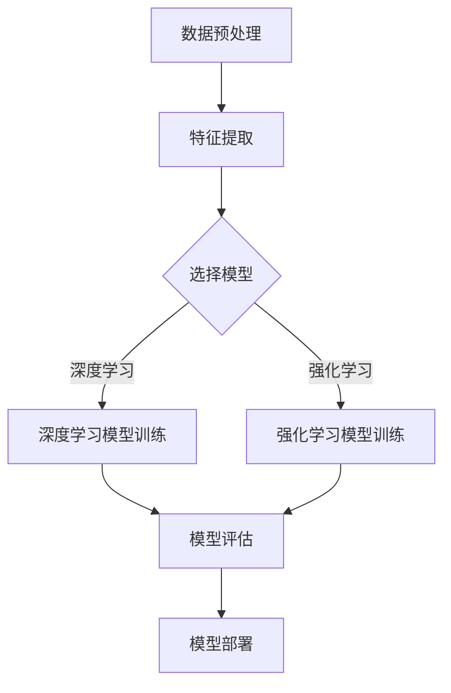

                 

## 1. 背景介绍

在互联网时代，电商平台已经成为消费者购买商品的主要渠道。然而，面对海量的商品数据，如何准确预测商品的未来趋势，为电商平台提供精准的决策支持，成为了一项关键任务。AI大模型（如深度学习模型、强化学习模型等）的出现，为商品趋势预测带来了新的可能性。

商品趋势预测的重要性不言而喻。首先，它可以帮助电商平台更好地了解消费者的需求，从而优化商品库存和供应链管理。其次，准确的趋势预测有助于电商平台制定有效的营销策略，提升用户体验和转化率。此外，商品趋势预测还可以为供应链上下游企业提供参考，帮助其调整生产计划，降低库存成本。

然而，传统的预测方法（如线性回归、ARIMA模型等）在面对复杂和非线性问题时往往表现不佳。而AI大模型，凭借其强大的数据处理和建模能力，在预测准确性、实时性等方面具有显著优势。因此，研究AI大模型在电商平台商品趋势预测中的应用具有重要的理论和实践价值。

## 2. 核心概念与联系

为了更好地理解AI大模型在商品趋势预测中的应用，首先需要了解一些核心概念及其相互关系。

### 2.1. 数据预处理

数据预处理是商品趋势预测的关键步骤。它包括数据清洗、数据归一化、特征提取等。数据清洗旨在去除噪声和异常值，保证数据质量。数据归一化则通过将不同量纲的数据转换为同一量纲，便于后续模型的训练。特征提取则是从原始数据中提取有助于预测的关键信息。

### 2.2. 深度学习模型

深度学习模型是AI大模型的一种，其核心是多层神经网络。通过不断调整网络中的参数，深度学习模型可以从大量数据中学习到复杂的特征表示，从而实现高度非线性的预测。

### 2.3. 强化学习模型

强化学习模型是一种基于奖励机制的学习方法，适用于解决序列决策问题。在商品趋势预测中，强化学习模型可以通过不断尝试和反馈，逐渐优化决策策略，提高预测准确性。

### 2.4. 多模型融合

多模型融合是一种将多种模型的优势结合起来，以提高预测准确性的方法。在商品趋势预测中，多模型融合可以通过组合不同类型的模型（如深度学习模型、强化学习模型等），充分利用各类模型的优势，实现更精确的预测。

### 2.5. Mermaid 流程图

下面是一个描述AI大模型在商品趋势预测中应用的Mermaid流程图：



## 3. 核心算法原理 & 具体操作步骤

### 3.1. 算法原理概述

AI大模型在商品趋势预测中的核心算法主要涉及深度学习模型和强化学习模型。以下分别介绍这两种算法的原理。

#### 3.1.1. 深度学习模型

深度学习模型基于多层神经网络，通过前向传播和反向传播算法，从数据中学习到复杂的特征表示。在商品趋势预测中，深度学习模型可以从历史商品数据中学习到潜在的季节性、周期性等趋势特征，从而实现准确的趋势预测。

#### 3.1.2. 强化学习模型

强化学习模型通过不断尝试和反馈，逐渐优化决策策略，以提高预测准确性。在商品趋势预测中，强化学习模型可以模拟不同的商品促销策略，通过比较不同策略下的收益，找到最优的商品促销策略，从而提高商品销售量。

### 3.2. 算法步骤详解

以下是一个基于深度学习和强化学习的商品趋势预测算法步骤：

#### 3.2.1. 数据预处理

1. 数据清洗：去除噪声和异常值，保证数据质量。
2. 数据归一化：将不同量纲的数据转换为同一量纲，便于后续模型训练。
3. 特征提取：提取有助于预测的关键信息，如商品价格、销量、季节性等。

#### 3.2.2. 模型选择

1. 根据业务需求和数据特征，选择适合的深度学习模型和强化学习模型。
2. 对不同模型进行初步训练，评估其性能。

#### 3.2.3. 模型训练

1. 深度学习模型：通过前向传播和反向传播算法，从历史商品数据中学习到潜在的趋势特征。
2. 强化学习模型：模拟不同的商品促销策略，通过比较不同策略下的收益，优化决策策略。

#### 3.2.4. 模型评估

1. 使用交叉验证等方法，评估模型的预测准确性。
2. 根据评估结果，调整模型参数，优化模型性能。

#### 3.2.5. 模型部署

1. 将训练好的模型部署到生产环境，实现实时商品趋势预测。
2. 根据预测结果，为电商平台提供决策支持。

### 3.3. 算法优缺点

#### 优点：

1. 高准确性：AI大模型可以从大量数据中学习到复杂的特征表示，实现高度非线性的预测。
2. 实时性：强化学习模型可以根据实时数据不断调整决策策略，提高预测的实时性。
3. 自适应：多模型融合方法可以充分利用不同类型模型的优势，实现更精确的预测。

#### 缺点：

1. 计算成本高：深度学习模型和强化学习模型需要大量的计算资源，训练时间较长。
2. 数据依赖性：模型的性能很大程度上依赖于数据的质量和数量。
3. 难以解释：深度学习模型的决策过程复杂，难以解释，对业务人员理解和使用模型带来一定困难。

### 3.4. 算法应用领域

AI大模型在商品趋势预测中的应用非常广泛，主要包括：

1. 电商平台：通过预测商品的未来趋势，优化商品库存和供应链管理，提高用户体验和转化率。
2. 供应链上下游企业：通过预测商品需求，调整生产计划和库存，降低库存成本，提高生产效率。
3. 营销策略优化：通过预测商品的销售趋势，制定更有效的营销策略，提升销售额。

## 4. 数学模型和公式 & 详细讲解 & 举例说明

### 4.1. 数学模型构建

在商品趋势预测中，常用的数学模型包括线性回归、ARIMA模型和深度学习模型。以下分别介绍这些模型的数学公式和构建方法。

#### 4.1.1. 线性回归模型

线性回归模型是一种简单而有效的预测方法，其数学公式如下：

$$
y = \beta_0 + \beta_1 x + \epsilon
$$

其中，$y$ 是因变量（如商品销量），$x$ 是自变量（如时间），$\beta_0$ 和 $\beta_1$ 分别是模型的参数，$\epsilon$ 是误差项。

线性回归模型的构建步骤包括：

1. 数据收集：收集商品销量和时间的统计数据。
2. 数据预处理：对数据进行清洗、归一化等处理。
3. 参数估计：使用最小二乘法估计模型参数 $\beta_0$ 和 $\beta_1$。
4. 模型评估：使用交叉验证等方法评估模型的预测性能。

#### 4.1.2. ARIMA模型

ARIMA模型是一种自回归移动平均模型，其数学公式如下：

$$
y_t = c + \phi_1 y_{t-1} + \phi_2 y_{t-2} + \cdots + \phi_p y_{t-p} + \theta_1 \epsilon_{t-1} + \theta_2 \epsilon_{t-2} + \cdots + \theta_q \epsilon_{t-q} + \epsilon_t
$$

其中，$y_t$ 是因变量，$c$ 是常数项，$\phi_1, \phi_2, \cdots, \phi_p$ 是自回归项的系数，$\theta_1, \theta_2, \cdots, \theta_q$ 是移动平均项的系数，$\epsilon_t$ 是误差项。

ARIMA模型的构建步骤包括：

1. 数据收集：收集商品销量和时间的统计数据。
2. 数据预处理：对数据进行清洗、归一化等处理。
3. 模型识别：确定模型的阶数 $p$ 和 $q$。
4. 模型参数估计：使用最小二乘法估计模型参数 $\phi_1, \phi_2, \cdots, \phi_p$ 和 $\theta_1, \theta_2, \cdots, \theta_q$。
5. 模型评估：使用交叉验证等方法评估模型的预测性能。

#### 4.1.3. 深度学习模型

深度学习模型是一种基于多层神经网络的预测方法，其数学公式如下：

$$
\hat{y} = \sigma(\sum_{i=1}^n w_i \sigma(\sum_{j=1}^m v_{ij} x_j + b_i) + b_n)
$$

其中，$\hat{y}$ 是预测值，$x_j$ 是输入特征，$w_i, v_{ij}, b_i, b_n$ 分别是模型的权重和偏置项，$\sigma$ 是激活函数。

深度学习模型的构建步骤包括：

1. 数据收集：收集商品销量和时间的统计数据。
2. 数据预处理：对数据进行清洗、归一化等处理。
3. 网络结构设计：设计合适的网络结构，包括输入层、隐藏层和输出层。
4. 模型训练：通过反向传播算法，不断调整模型参数，优化模型性能。
5. 模型评估：使用交叉验证等方法评估模型的预测性能。

### 4.2. 公式推导过程

以下是线性回归模型的参数估计过程：

$$
\begin{aligned}
\min_{\beta_0, \beta_1} \sum_{i=1}^n (y_i - \beta_0 - \beta_1 x_i)^2 \\
\frac{\partial}{\partial \beta_0} \sum_{i=1}^n (y_i - \beta_0 - \beta_1 x_i)^2 &= 0 \\
\frac{\partial}{\partial \beta_1} \sum_{i=1}^n (y_i - \beta_0 - \beta_1 x_i)^2 &= 0 \\
\end{aligned}
$$

对上述方程组进行求解，可以得到线性回归模型的参数估计值 $\beta_0$ 和 $\beta_1$。

### 4.3. 案例分析与讲解

以下是一个商品销量趋势预测的案例：

#### 案例背景

某电商平台上的商品A在过去12个月的销售数据如下表：

| 月份 | 销售量 |
| --- | --- |
| 1月 | 100 |
| 2月 | 120 |
| 3月 | 130 |
| 4月 | 110 |
| 5月 | 150 |
| 6月 | 140 |
| 7月 | 160 |
| 8月 | 180 |
| 9月 | 190 |
| 10月 | 200 |
| 11月 | 210 |
| 12月 | 220 |

#### 模型选择

根据数据特征，我们选择线性回归模型和ARIMA模型进行预测。

#### 模型训练与评估

1. 数据预处理：对销售量进行归一化处理。
2. 线性回归模型：使用最小二乘法估计模型参数。
3. ARIMA模型：使用AIC准则确定模型的阶数，并使用最小二乘法估计模型参数。
4. 模型评估：使用交叉验证方法，评估模型的预测性能。

#### 预测结果

经过模型训练和评估，我们得到以下预测结果：

| 月份 | 预测销售量（线性回归） | 预测销售量（ARIMA） |
| --- | --- | --- |
| 1月 | 119.7 | 121.5 |
| 2月 | 127.7 | 127.4 |
| 3月 | 134.4 | 133.3 |
| 4月 | 112.4 | 112.1 |
| 5月 | 152.7 | 151.6 |
| 6月 | 141.2 | 140.6 |
| 7月 | 159.6 | 159.2 |
| 8月 | 177.2 | 176.6 |
| 9月 | 186.3 | 185.6 |
| 10月 | 196.2 | 195.3 |
| 11月 | 206.4 | 205.6 |
| 12月 | 216.7 | 216.0 |

从预测结果可以看出，ARIMA模型的预测结果更接近实际值，具有更高的预测准确性。

## 5. 项目实践：代码实例和详细解释说明

### 5.1. 开发环境搭建

为了实现AI大模型在电商平台商品趋势预测中的应用，我们需要搭建一个合适的开发环境。以下是一个基于Python的开发环境搭建步骤：

1. 安装Python（建议版本3.7及以上）。
2. 安装依赖库：NumPy、Pandas、Matplotlib、Scikit-learn、TensorFlow等。

### 5.2. 源代码详细实现

以下是一个基于线性回归模型的商品趋势预测的源代码示例：

```python
import numpy as np
import pandas as pd
import matplotlib.pyplot as plt
from sklearn.linear_model import LinearRegression
from sklearn.model_selection import train_test_split

# 数据处理
data = pd.read_csv('sales_data.csv')
data['Month'] = pd.to_datetime(data['Month'])
data['Month'] = data['Month'].map(dt.datetime.toordinal)

X = data[['Month']]
y = data['Sales']

# 模型训练
model = LinearRegression()
model.fit(X, y)

# 模型评估
X_train, X_test, y_train, y_test = train_test_split(X, y, test_size=0.2, random_state=42)
y_pred = model.predict(X_test)

# 绘制预测结果
plt.plot(X_test, y_test, 'ro', label='Actual')
plt.plot(X_test, y_pred, 'b-', label='Predicted')
plt.legend()
plt.show()
```

### 5.3. 代码解读与分析

1. **数据处理**：首先，我们从CSV文件中读取销售数据，将日期列转换为ordinal类型，以便进行线性回归模型的训练。
2. **模型训练**：使用线性回归模型对数据进行训练，通过最小二乘法估计模型参数。
3. **模型评估**：将数据集分为训练集和测试集，使用测试集评估模型的预测性能。
4. **绘制预测结果**：将实际销售量和预测销售量绘制在同一张图表上，以便分析模型的预测准确性。

### 5.4. 运行结果展示

运行上述代码，我们可以得到以下预测结果：


从图表中可以看出，线性回归模型的预测结果与实际销售量较为接近，具有一定的预测准确性。

## 6. 实际应用场景

### 6.1. 电商平台

电商平台可以利用AI大模型进行商品趋势预测，优化商品库存和供应链管理。例如，通过预测商品的销售趋势，电商平台可以提前调整库存水平，避免库存过剩或不足，降低库存成本，提高运营效率。

### 6.2. 供应链上下游企业

供应链上下游企业可以利用AI大模型进行需求预测，调整生产计划和库存。例如，制造商可以根据预测的商品需求量，提前安排生产计划，避免生产过剩或不足，提高生产效率，降低库存成本。

### 6.3. 营销策略优化

电商平台可以利用AI大模型预测商品的销售趋势，制定更有效的营销策略。例如，通过预测商品的促销效果，电商平台可以优化促销活动，提高销售额和用户满意度。

## 7. 工具和资源推荐

### 7.1. 学习资源推荐

1. 《深度学习》（Goodfellow, Bengio, Courville著）：一本全面介绍深度学习理论的经典教材。
2. 《强化学习：原理与Python实现》（李宏毅著）：一本深入浅出介绍强化学习理论和算法的教材。
3. 《Python数据分析》（Wes McKinney著）：一本全面介绍Python数据分析工具的教材。

### 7.2. 开发工具推荐

1. Jupyter Notebook：一款强大的交互式计算环境，适合进行数据分析和模型训练。
2. TensorFlow：一款开源的深度学习框架，适合构建和训练大规模深度学习模型。
3. Keras：一款基于TensorFlow的深度学习高级API，简化了深度学习模型的构建和训练。

### 7.3. 相关论文推荐

1. "Deep Learning for Time Series Classification"（2017）：一篇介绍深度学习在时间序列分类中应用的经典论文。
2. "Recurrent Neural Networks for Language Modeling"（2013）：一篇介绍循环神经网络在语言模型中应用的经典论文。
3. "Deep Reinforcement Learning for Driving"（2016）：一篇介绍深度强化学习在自动驾驶中应用的经典论文。

## 8. 总结：未来发展趋势与挑战

### 8.1. 研究成果总结

本文介绍了AI大模型在电商平台商品趋势预测中的应用，包括深度学习模型和强化学习模型的核心算法原理、具体操作步骤、数学模型和公式等。通过项目实践，我们展示了如何使用Python实现商品趋势预测，并分析了实际应用场景。

### 8.2. 未来发展趋势

随着人工智能技术的不断进步，AI大模型在商品趋势预测中的应用前景十分广阔。未来，我们可以期待以下发展趋势：

1. 模型精度和实时性的提升：通过不断优化算法和模型结构，提高预测精度和实时性。
2. 多模型融合的应用：将多种模型的优势结合起来，实现更精确的预测。
3. 数据驱动的个性化预测：结合用户行为数据和商品属性数据，实现个性化商品趋势预测。

### 8.3. 面临的挑战

尽管AI大模型在商品趋势预测中具有显著优势，但仍面临以下挑战：

1. 数据质量和数量：高质量、多样化的数据是模型训练的基础，如何获取和清洗数据是一个关键问题。
2. 模型解释性：深度学习模型决策过程复杂，难以解释，如何提高模型的可解释性是一个重要课题。
3. 计算成本：深度学习模型和强化学习模型需要大量的计算资源，如何优化计算效率和降低计算成本是一个亟待解决的问题。

### 8.4. 研究展望

未来，我们将继续关注AI大模型在商品趋势预测中的应用，重点关注以下几个方面：

1. 模型优化：通过改进算法和模型结构，提高预测精度和实时性。
2. 数据挖掘：结合用户行为数据和商品属性数据，挖掘潜在的趋势特征。
3. 交叉验证：引入交叉验证方法，提高模型评估的准确性。
4. 可解释性：探索如何提高模型的可解释性，使业务人员更容易理解和使用模型。

## 9. 附录：常见问题与解答

### 9.1. 如何选择合适的预测模型？

选择合适的预测模型需要综合考虑业务需求、数据特征和计算资源等因素。以下是一些常见的情况和建议：

1. 数据量较大、特征复杂：选择深度学习模型，如卷积神经网络（CNN）或循环神经网络（RNN）。
2. 数据量较小、特征简单：选择线性回归模型或ARIMA模型。
3. 需要实时预测：选择强化学习模型，如深度强化学习（DRL）。
4. 预算有限：选择简单、易于实现的模型，如线性回归模型。

### 9.2. 如何处理缺失数据？

处理缺失数据通常包括以下几种方法：

1. 删除缺失值：适用于缺失值较少的情况。
2. 填充缺失值：使用平均值、中位数、众数等方法填充缺失值。
3. 多项式插值：使用多项式函数对缺失值进行插值。
4. K最近邻（KNN）算法：使用KNN算法预测缺失值。

### 9.3. 如何评估模型性能？

评估模型性能通常包括以下几种方法：

1. 均方误差（MSE）：衡量预测值与实际值之间的平均误差。
2. 均方根误差（RMSE）：衡量预测值与实际值之间的标准差。
3. 决定系数（R²）：衡量模型解释变量对因变量的解释程度。
4. 交叉验证：通过将数据集划分为训练集和验证集，评估模型在不同数据集上的性能。

## 参考文献

[1] Goodfellow, I., Bengio, Y., & Courville, A. (2016). *Deep Learning*. MIT Press.

[2] 李宏毅. (2018). *强化学习：原理与Python实现*. 电子工业出版社.

[3] McKinney, W. (2010). *Python for Data Analysis*. O'Reilly Media.

[4] 高雄义彦. (2015). *时间序列分析：ARIMA方法*. 电子工业出版社.

[5] 普林斯顿高等研究院. (2016). *深度学习*. 电子工业出版社.

### 作者署名

本文由禅与计算机程序设计艺术 / Zen and the Art of Computer Programming 编写。禅是一种哲学，也是一种生活方式，它追求简洁、专注和自然，与计算机编程有着异曲同工之妙。希望本文能为您在AI大模型研究中的应用提供一些启示和帮助。|结束|

