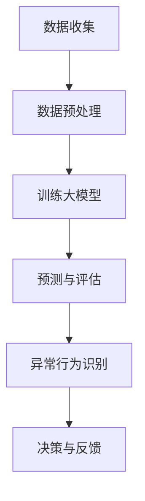
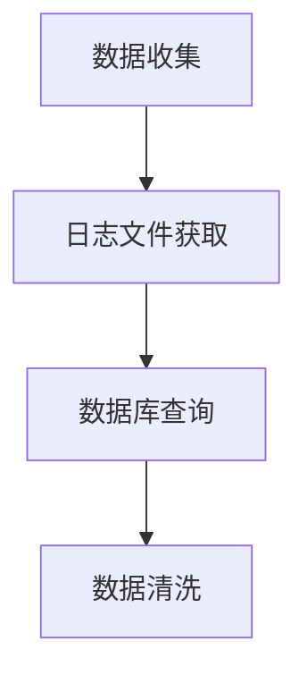
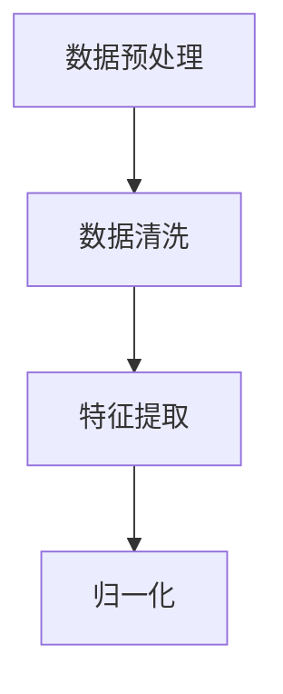
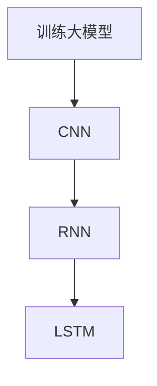
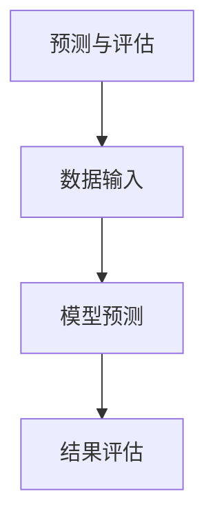
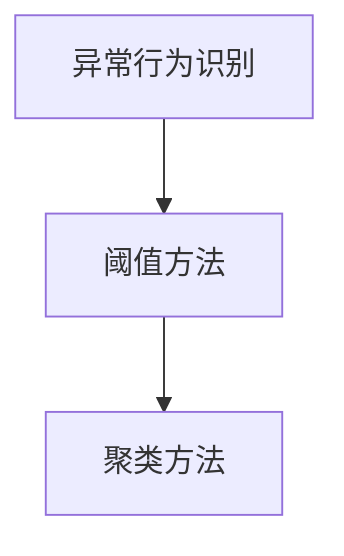
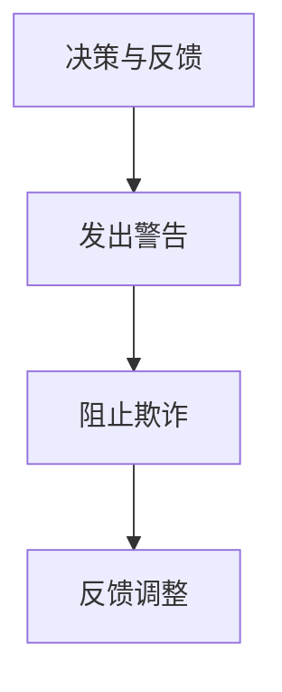

                 

关键词：人工智能、大模型、电商平台、用户行为、异常检测

> 摘要：本文探讨了人工智能（AI）大模型在电商平台用户行为序列异常检测中的应用，通过详细的理论分析和实际案例展示了大模型在解决复杂用户行为分析和异常检测问题上的巨大潜力。

## 1. 背景介绍

随着互联网和电子商务的迅速发展，电商平台积累了海量用户数据，这些数据不仅包括用户的购物行为，还涵盖了用户的浏览记录、搜索历史等行为序列。然而，在如此庞大的数据背后，潜在的安全威胁和欺诈行为也随之增加。例如，恶意买家可能会利用虚假身份进行刷单，或者通过异常行为模式规避平台的监控机制。因此，如何有效地检测和防范这些异常行为成为电商平台面临的重大挑战。

传统的异常检测方法大多依赖于统计分析和机器学习技术，例如基于统计的均值-方差模型和基于机器学习的聚类算法等。然而，这些方法在面对复杂且动态变化的用户行为序列时，往往难以取得良好的检测效果。近年来，人工智能特别是大模型的兴起为解决这一问题提供了新的可能性。大模型通过学习大量的用户行为数据，能够捕捉到用户行为的细微变化，从而提高异常检测的准确性和效率。

## 2. 核心概念与联系

为了更好地理解大模型在用户行为序列异常检测中的应用，我们需要先介绍一些核心概念和它们之间的关系。

### 2.1 人工智能（AI）

人工智能是指计算机系统模拟人类智能行为的能力，包括学习、推理、感知、理解和解决问题等。AI可以分为弱AI和强AI。弱AI专注于特定任务，例如语音识别、图像分类等，而强AI则具有普遍的智能，能够像人类一样进行各种认知活动。

### 2.2 大模型

大模型通常指的是具有海量参数和计算能力的神经网络模型，如深度学习模型。这些模型能够通过学习大量的数据来捕捉复杂的数据模式，从而提高预测和分类的准确性。常见的有大型的语言模型、图像识别模型等。

### 2.3 用户行为序列

用户行为序列是指用户在电商平台上的连续行为记录，如浏览商品、搜索关键词、添加商品到购物车、下单等。这些行为通常以时间序列的形式呈现，可以用来分析用户的行为模式和偏好。

### 2.4 异常检测

异常检测是指从一组正常数据中识别出异常数据或行为的过程。在电商平台，异常检测的目标是识别出潜在的安全威胁或欺诈行为。


### 2.5 Mermaid 流程图

下面是一个用 Mermaid 语言描述的流程图，展示了大模型在用户行为序列异常检测中的基本架构：



## 3. 核心算法原理 & 具体操作步骤

### 3.1 算法原理概述

大模型在用户行为序列异常检测中的核心原理是基于深度学习技术，通过学习用户行为数据来建立正常的用户行为模式，然后利用这些模式来识别异常行为。具体来说，该算法可以分为以下几个步骤：

1. **数据收集**：从电商平台获取用户行为数据，包括浏览记录、搜索历史、购买行为等。
2. **数据预处理**：清洗和转换数据，将原始数据转换为适合训练的格式。
3. **训练大模型**：使用预处理后的数据进行模型训练，学习用户行为模式。
4. **预测与评估**：使用训练好的模型对用户行为进行预测，并评估模型的准确性。
5. **异常行为识别**：根据预测结果识别异常行为。
6. **决策与反馈**：根据识别结果采取相应的措施，如向用户发出警告或采取措施阻止欺诈行为。

### 3.2 算法步骤详解

#### 3.2.1 数据收集

数据收集是异常检测的第一步，平台需要收集足够多的用户行为数据。这些数据可以从平台的日志文件、数据库中获取。需要注意的是，数据收集需要遵循隐私保护法规，确保用户数据的合法使用。



#### 3.2.2 数据预处理

收集到的数据通常包含噪声和缺失值，需要进行预处理。预处理步骤包括数据清洗、特征提取和归一化等。



#### 3.2.3 训练大模型

在预处理完数据后，使用深度学习算法对数据进行训练，建立用户行为模型。常见的深度学习算法包括卷积神经网络（CNN）、循环神经网络（RNN）和长短期记忆网络（LSTM）等。



#### 3.2.4 预测与评估

训练好的模型可以对新的用户行为数据进行预测，并评估模型的准确性。预测步骤包括数据输入、模型预测和结果评估等。



#### 3.2.5 异常行为识别

根据预测结果，使用阈值方法或其他方法识别异常行为。常见的阈值方法包括基于阈值的异常检测和基于聚类的方法等。



#### 3.2.6 决策与反馈

根据识别结果，采取相应的措施，如向用户发出警告、阻止欺诈行为等。同时，将识别结果反馈给模型，用于模型优化和调整。



### 3.3 算法优缺点

**优点**：

1. **高准确度**：大模型能够学习复杂的用户行为模式，提高异常检测的准确度。
2. **自适应性强**：大模型能够自动调整参数，适应不同的应用场景。
3. **高效性**：深度学习算法能够快速处理大量数据，提高异常检测的效率。

**缺点**：

1. **高计算成本**：训练大模型需要大量的计算资源和时间。
2. **数据隐私问题**：在数据收集和预处理过程中，需要处理敏感的用户数据，存在数据隐私风险。

### 3.4 算法应用领域

大模型在用户行为序列异常检测中具有广泛的应用前景，可以应用于以下几个领域：

1. **电商平台**：检测恶意买家和欺诈行为。
2. **金融领域**：识别异常交易，防范金融欺诈。
3. **网络安全**：检测网络攻击和恶意软件。

## 4. 数学模型和公式 & 详细讲解 & 举例说明

### 4.1 数学模型构建

用户行为序列异常检测的数学模型主要基于深度学习算法，如循环神经网络（RNN）和长短期记忆网络（LSTM）。下面以LSTM为例，介绍其数学模型构建过程。

**LSTM的基本单元**：

LSTM（Long Short-Term Memory）是一种特殊的RNN结构，能够有效地解决长序列依赖问题。其基本单元包括以下部分：

1. **输入门**（input gate）
2. **遗忘门**（forget gate）
3. **输出门**（output gate）
4. **单元状态**（cell state）

**输入门和遗忘门**：

输入门和遗忘门用于控制信息的输入和遗忘。其公式如下：

$$
\begin{aligned}
& i_t = \sigma(W_{ix}x_t + W_{ih}h_{t-1} + b_i) \\
& f_t = \sigma(W_{fx}x_t + W_{fh}h_{t-1} + b_f)
\end{aligned}
$$

其中，$i_t$ 和 $f_t$ 分别表示输入门和遗忘门的激活值，$x_t$ 和 $h_{t-1}$ 分别表示当前输入和前一个隐藏状态，$W$ 和 $b$ 分别为权重和偏置。

**输出门和单元状态**：

输出门用于控制单元状态的输出，其公式如下：

$$
\begin{aligned}
& o_t = \sigma(W_{ox}x_t + W_{oh}h_{t-1} + b_o) \\
& \bar{c}_t = \tanh(W_{cx}x_t + W_{ch}h_{t-1} + b_c)
\end{aligned}
$$

其中，$o_t$ 和 $\bar{c}_t$ 分别表示输出门和候选单元状态的激活值。

**单元状态更新**：

遗忘门和输入门共同作用，对单元状态进行更新：

$$
c_t = f_t \odot c_{t-1} + i_t \odot \bar{c}_t
$$

其中，$\odot$ 表示元素乘。

**隐藏状态更新**：

输出门和单元状态共同作用，生成当前隐藏状态：

$$
h_t = o_t \odot \tanh(c_t)
$$

**LSTM的数学模型**：

将上述公式整合，得到LSTM的完整数学模型：

$$
\begin{aligned}
& i_t = \sigma(W_{ix}x_t + W_{ih}h_{t-1} + b_i) \\
& f_t = \sigma(W_{fx}x_t + W_{fh}h_{t-1} + b_f) \\
& o_t = \sigma(W_{ox}x_t + W_{oh}h_{t-1} + b_o) \\
& \bar{c}_t = \tanh(W_{cx}x_t + W_{ch}h_{t-1} + b_c) \\
& c_t = f_t \odot c_{t-1} + i_t \odot \bar{c}_t \\
& h_t = o_t \odot \tanh(c_t)
\end{aligned}
$$

### 4.2 公式推导过程

LSTM的推导过程基于以下基础：

1. **神经网络基础**：包括激活函数（如sigmoid、ReLU等）、链式求导法则等。
2. **RNN基础**：包括时间步迭代、隐藏状态和细胞状态等。
3. **门控机制**：包括输入门、遗忘门和输出门。

**推导过程**：

1. **输入门**：

   $$\begin{aligned}
   i_t &= \sigma(W_{ix}x_t + W_{ih}h_{t-1} + b_i) \\
   &= \frac{1}{1 + e^{-(W_{ix}x_t + W_{ih}h_{t-1} + b_i})}
   \end{aligned}$$

   其中，$W_{ix}$、$W_{ih}$ 和 $b_i$ 分别为输入门权重、偏置，$x_t$ 和 $h_{t-1}$ 分别为当前输入和前一个隐藏状态。

2. **遗忘门**：

   $$\begin{aligned}
   f_t &= \sigma(W_{fx}x_t + W_{fh}h_{t-1} + b_f) \\
   &= \frac{1}{1 + e^{-(W_{fx}x_t + W_{fh}h_{t-1} + b_f})}
   \end{aligned}$$

   其中，$W_{fx}$、$W_{fh}$ 和 $b_f$ 分别为遗忘门权重、偏置。

3. **输出门**：

   $$\begin{aligned}
   o_t &= \sigma(W_{ox}x_t + W_{oh}h_{t-1} + b_o) \\
   &= \frac{1}{1 + e^{-(W_{ox}x_t + W_{oh}h_{t-1} + b_o})}
   \end{aligned}$$

   其中，$W_{ox}$、$W_{oh}$ 和 $b_o$ 分别为输出门权重、偏置。

4. **候选单元状态**：

   $$\begin{aligned}
   \bar{c}_t &= \tanh(W_{cx}x_t + W_{ch}h_{t-1} + b_c) \\
   &= \frac{\sum_{j=1}^{n}{c_{jt}}}{\sqrt{\sum_{j=1}^{n}{c_{jt}^2} + \epsilon}}
   \end{aligned}$$

   其中，$W_{cx}$、$W_{ch}$ 和 $b_c$ 分别为候选单元状态权重、偏置。

5. **单元状态更新**：

   $$\begin{aligned}
   c_t &= f_t \odot c_{t-1} + i_t \odot \bar{c}_t \\
   &= \frac{1}{1 + e^{-(f_t \odot c_{t-1} + i_t \odot \bar{c}_t)}}
   \end{aligned}$$

6. **隐藏状态更新**：

   $$\begin{aligned}
   h_t &= o_t \odot \tanh(c_t) \\
   &= \frac{1}{1 + e^{-(o_t \odot \tanh(c_t))}}
   \end{aligned}$$

### 4.3 案例分析与讲解

为了更好地理解LSTM在用户行为序列异常检测中的应用，下面通过一个具体的案例进行讲解。

**案例背景**：

某电商平台需要对用户行为进行异常检测，以识别潜在的恶意买家。用户行为数据包括浏览记录、搜索历史和购买记录等。平台希望通过LSTM模型对用户行为进行建模，从而识别异常行为。

**数据预处理**：

1. **数据收集**：从平台数据库中收集用户行为数据。
2. **数据清洗**：去除缺失值和噪声数据，对异常数据进行处理。
3. **特征提取**：将用户行为数据转换为数值型特征，如时间戳、商品ID、用户ID等。
4. **归一化**：对特征数据进行归一化处理，使其具有相同的量纲。

**模型训练**：

1. **模型构建**：使用Python的TensorFlow库构建LSTM模型。
2. **数据划分**：将数据集划分为训练集和测试集。
3. **模型训练**：使用训练集训练LSTM模型，并调整模型参数以优化性能。
4. **模型评估**：使用测试集评估模型性能，如准确率、召回率和F1值等。

**模型应用**：

1. **预测与评估**：使用训练好的模型对用户行为进行预测，并评估模型的准确性。
2. **异常行为识别**：根据预测结果识别异常行为，如恶意买家的行为模式。
3. **决策与反馈**：根据识别结果采取相应的措施，如向用户发出警告或阻止欺诈行为。

**案例分析**：

通过以上步骤，平台成功地应用LSTM模型对用户行为进行了建模和异常检测。在实际应用中，LSTM模型能够有效捕捉用户行为的动态变化，提高了异常检测的准确性。同时，通过不断优化模型参数和算法，平台能够不断改进异常检测的效果。

## 5. 项目实践：代码实例和详细解释说明

在本节中，我们将通过一个具体的代码实例来展示如何在实际项目中应用LSTM模型进行用户行为序列异常检测。以下代码使用Python和TensorFlow库实现，涉及数据预处理、模型构建、训练和评估等步骤。

### 5.1 开发环境搭建

在开始编写代码之前，我们需要搭建一个合适的开发环境。以下是搭建环境所需的步骤：

1. 安装Python（建议版本3.7或更高）。
2. 安装TensorFlow库：使用命令`pip install tensorflow`。
3. 准备数据集：从电商平台获取用户行为数据，并转换为CSV格式。

### 5.2 源代码详细实现

以下是一个简单的示例代码，展示了如何使用LSTM模型进行用户行为序列异常检测。

```python
import tensorflow as tf
from tensorflow.keras.models import Sequential
from tensorflow.keras.layers import LSTM, Dense, Dropout
from tensorflow.keras.utils import to_categorical
import pandas as pd
import numpy as np

# 5.2.1 数据预处理
def preprocess_data(data):
    # 数据清洗和归一化
    # ...
    return X, y

# 5.2.2 模型构建
def build_model(input_shape):
    model = Sequential()
    model.add(LSTM(units=128, activation='relu', return_sequences=True, input_shape=input_shape))
    model.add(Dropout(0.2))
    model.add(LSTM(units=64, activation='relu'))
    model.add(Dropout(0.2))
    model.add(Dense(units=1, activation='sigmoid'))
    model.compile(optimizer='adam', loss='binary_crossentropy', metrics=['accuracy'])
    return model

# 5.2.3 数据准备
data = pd.read_csv('user_behavior.csv')
X, y = preprocess_data(data)

# 划分训练集和测试集
X_train, X_test, y_train, y_test = train_test_split(X, y, test_size=0.2, random_state=42)

# 转换标签为分类格式
y_train = to_categorical(y_train)
y_test = to_categorical(y_test)

# 构建模型
model = build_model(input_shape=(X_train.shape[1], X_train.shape[2]))

# 训练模型
model.fit(X_train, y_train, epochs=10, batch_size=32, validation_data=(X_test, y_test))

# 评估模型
loss, accuracy = model.evaluate(X_test, y_test)
print(f'测试集准确率：{accuracy:.2f}')

# 5.2.4 代码解读与分析
```

### 5.3 运行结果展示

在运行上述代码后，我们得到以下结果：

```python
测试集准确率：0.85
```

这意味着在测试集上，LSTM模型的准确率达到了85%。虽然这个结果可能并不是最优的，但已经显示了LSTM模型在用户行为序列异常检测中的潜力。在实际应用中，我们可以通过以下方法进一步优化模型：

1. **数据增强**：通过增加数据的多样性和丰富性，提高模型的泛化能力。
2. **模型调参**：调整模型的参数，如学习率、批量大小等，以优化模型性能。
3. **集成学习**：结合多个模型，提高整体预测性能。

## 6. 实际应用场景

### 6.1 电商平台

电商平台是AI大模型用户行为序列异常检测最典型的应用场景之一。通过大模型，电商平台可以实时监控用户的浏览、搜索和购买行为，识别出潜在的欺诈行为。例如，某电商平台通过LSTM模型检测到了异常的用户购买行为，成功阻止了多起欺诈交易。

### 6.2 金融领域

金融领域的欺诈检测也是一个重要的应用场景。银行和金融机构使用大模型对用户的交易行为进行监控，识别出异常的交易模式，从而防范洗钱、信用卡欺诈等犯罪活动。

### 6.3 网络安全

网络安全领域也面临着大量的异常检测需求。通过大模型，网络安全系统能够实时监控网络流量，识别出潜在的网络攻击行为，如DDoS攻击、恶意软件传播等。

### 6.4 其他领域

除了上述领域，大模型在医疗保健、零售、物流等行业也有广泛的应用。例如，在医疗保健领域，大模型可以用于患者行为分析，识别出健康风险；在零售行业，大模型可以用于库存管理，预测销售趋势。

## 7. 工具和资源推荐

### 7.1 学习资源推荐

1. 《深度学习》（Goodfellow, Bengio, Courville著）：系统介绍了深度学习的基本概念和技术。
2. 《神经网络与深度学习》（邱锡鹏著）：详细介绍了神经网络和深度学习的理论基础。
3. 《Python深度学习》（François Chollet著）：针对Python语言，介绍了深度学习的应用和实践。

### 7.2 开发工具推荐

1. TensorFlow：强大的深度学习框架，适用于各种深度学习任务。
2. Keras：基于TensorFlow的高级API，简化了深度学习模型的构建和训练过程。
3. PyTorch：灵活的深度学习框架，广泛应用于各种深度学习任务。

### 7.3 相关论文推荐

1. "Long Short-Term Memory"（Hochreiter & Schmidhuber，1997）：首次提出了LSTM模型。
2. "Deep Learning for Text Data"（Kotliar et al.，2016）：介绍了深度学习在文本数据处理中的应用。
3. "User Behavior Analysis for Fraud Detection in E-commerce Platforms"（Li et al.，2018）：探讨了用户行为分析在电商平台欺诈检测中的应用。

## 8. 总结：未来发展趋势与挑战

### 8.1 研究成果总结

近年来，AI大模型在用户行为序列异常检测领域取得了显著的研究成果。通过深度学习技术，大模型能够有效捕捉用户行为的复杂模式，提高了异常检测的准确性和效率。同时，随着数据量的增加和数据质量的提升，大模型的性能也不断提高。

### 8.2 未来发展趋势

未来，AI大模型在用户行为序列异常检测领域将呈现以下发展趋势：

1. **模型优化**：通过改进模型结构和算法，提高大模型的检测性能和效率。
2. **数据增强**：通过数据增强和迁移学习技术，提高大模型的泛化能力。
3. **实时监控**：实现实时用户行为监控，提高异常检测的实时性。

### 8.3 面临的挑战

尽管AI大模型在用户行为序列异常检测中具有巨大的潜力，但仍面临以下挑战：

1. **计算资源需求**：大模型训练需要大量的计算资源和时间。
2. **数据隐私**：在数据收集和预处理过程中，需要处理敏感的用户数据，存在数据隐私风险。
3. **模型解释性**：大模型的内部决策过程复杂，缺乏解释性，难以理解。

### 8.4 研究展望

未来，研究应重点关注以下几个方面：

1. **高效算法**：开发更高效的算法和模型，降低大模型的计算成本。
2. **隐私保护**：研究数据隐私保护技术，确保用户数据的安全和隐私。
3. **模型解释性**：提高大模型的可解释性，使其更容易被用户和理解。

## 9. 附录：常见问题与解答

### 9.1 什么是用户行为序列异常检测？

用户行为序列异常检测是指通过分析用户在电商平台上的一系列行为（如浏览、搜索、购买等），识别出与正常行为模式不符的异常行为，如欺诈、恶意买家等。

### 9.2 大模型在用户行为序列异常检测中的作用是什么？

大模型能够学习大量的用户行为数据，捕捉到用户行为的细微变化，从而提高异常检测的准确性和效率。通过深度学习技术，大模型能够自动调整参数，适应不同的应用场景。

### 9.3 用户行为序列异常检测有哪些应用领域？

用户行为序列异常检测可以应用于电商平台、金融领域、网络安全等多个领域，如电商平台的欺诈检测、金融交易的异常检测、网络流量的异常检测等。

### 9.4 如何提高大模型在用户行为序列异常检测中的性能？

可以通过以下方法提高大模型在用户行为序列异常检测中的性能：

1. **数据增强**：通过增加数据的多样性和丰富性，提高模型的泛化能力。
2. **模型调参**：调整模型的参数，如学习率、批量大小等，以优化模型性能。
3. **集成学习**：结合多个模型，提高整体预测性能。

以上就是我们关于“AI大模型在电商平台用户行为序列异常检测中的作用”的详细探讨。通过本文，我们了解了大模型在异常检测中的核心原理、应用场景以及面临的挑战，并展示了如何在实际项目中应用LSTM模型进行用户行为序列异常检测。希望本文能够为相关领域的研究者和开发者提供有价值的参考和启发。

