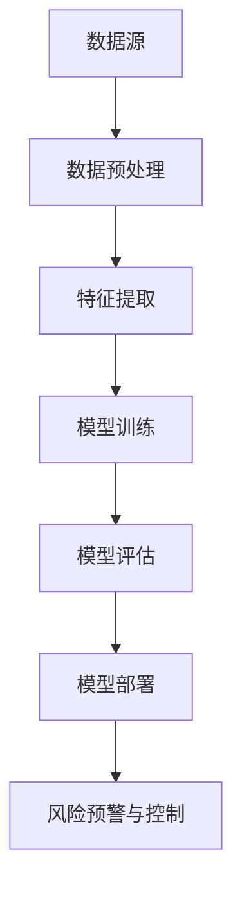

                 

 

> 关键词：AI大模型、电商平台、风险控制、深度学习、数据挖掘、机器学习、自然语言处理

> 摘要：本文深入探讨了人工智能大模型在电商平台风险控制中的应用。通过分析电商平台面临的风险类型，提出了基于深度学习、数据挖掘和自然语言处理的AI大模型架构，并详细介绍了算法原理、数学模型、具体操作步骤和项目实践。最后，本文展望了AI大模型在电商平台风险控制领域的未来发展趋势和面临的挑战。

## 1. 背景介绍

电商平台作为数字经济的重要组成部分，已经深深融入了人们的日常生活。然而，随着电商平台的迅速发展，其面临的风险也日益复杂。风险控制是电商平台运营的重要环节，直接关系到平台的生存与发展。传统的风险控制方法往往依赖于规则和人工判断，存在响应速度慢、覆盖面不全等问题。随着人工智能技术的快速发展，特别是深度学习、数据挖掘和自然语言处理等技术的成熟，AI大模型在电商平台风险控制中的应用逐渐成为可能。

本文将聚焦于AI大模型在电商平台风险控制中的应用，通过对相关技术的深入探讨，为电商平台提供一种高效、智能的风险控制解决方案。

## 2. 核心概念与联系

### 2.1 深度学习

深度学习是一种基于人工神经网络的学习方法，通过多层神经网络对大量数据进行训练，从而实现复杂模式识别和预测。深度学习在图像识别、语音识别和自然语言处理等领域取得了显著成果。

### 2.2 数据挖掘

数据挖掘是从大量数据中提取有价值信息的过程，包括关联规则挖掘、分类、聚类、预测等任务。数据挖掘技术在金融、医疗、电商等领域的应用日益广泛。

### 2.3 自然语言处理

自然语言处理是人工智能的一个重要分支，旨在使计算机能够理解和生成自然语言。自然语言处理技术在智能客服、内容审核和风险控制等领域具有广泛应用。

### 2.4 AI大模型架构

AI大模型架构是结合深度学习、数据挖掘和自然语言处理等技术，构建的一个大型、复杂的人工智能系统。该架构通常包括数据预处理、特征提取、模型训练、模型评估和模型部署等模块。

以下是AI大模型在电商平台风险控制中的架构图：



## 3. 核心算法原理 & 具体操作步骤

### 3.1 算法原理概述

AI大模型在电商平台风险控制中的应用主要基于以下原理：

1. **深度学习**：利用多层神经网络对大量数据进行训练，自动提取数据中的隐藏特征。
2. **数据挖掘**：通过关联规则挖掘、分类和聚类等方法，对数据进行深入分析，发现潜在风险。
3. **自然语言处理**：对用户评论、产品描述等文本数据进行情感分析和主题识别，提取关键信息。

### 3.2 算法步骤详解

#### 3.2.1 数据预处理

数据预处理是AI大模型应用的重要步骤，包括数据清洗、数据整合和特征工程等。

- **数据清洗**：去除数据中的噪声和错误，保证数据质量。
- **数据整合**：将不同来源的数据进行整合，形成统一的数据集。
- **特征工程**：从原始数据中提取出对风险控制有用的特征。

#### 3.2.2 特征提取

特征提取是利用深度学习技术，从原始数据中自动提取出隐藏的特征。

- **卷积神经网络（CNN）**：适用于图像数据的特征提取。
- **循环神经网络（RNN）**：适用于序列数据的特征提取。
- **自注意力机制（Self-Attention）**：适用于文本数据的特征提取。

#### 3.2.3 模型训练

模型训练是利用提取出的特征，通过训练算法，学习到数据的内在规律。

- **梯度下降（Gradient Descent）**：一种常用的训练算法。
- **反向传播（Backpropagation）**：用于计算梯度的一种方法。

#### 3.2.4 模型评估

模型评估是检验模型性能的重要步骤，包括准确性、召回率、F1值等指标。

- **交叉验证（Cross Validation）**：一种评估模型性能的方法。
- **ROC曲线（Receiver Operating Characteristic Curve）**：用于评估二分类模型的性能。

#### 3.2.5 模型部署

模型部署是将训练好的模型应用到实际业务中，实现风险预警与控制。

- **在线部署**：将模型部署到电商平台的服务器上，实时处理风险。
- **离线部署**：将模型部署到数据仓库中，定期处理历史数据。

### 3.3 算法优缺点

#### 优点

- **高效性**：利用深度学习技术，自动提取特征，提高风险识别速度。
- **全面性**：结合数据挖掘和自然语言处理技术，全面分析风险。
- **智能性**：通过模型训练，实现风险自动识别和预警。

#### 缺点

- **计算资源消耗**：训练大模型需要大量的计算资源和时间。
- **数据依赖性**：模型的性能很大程度上依赖于数据质量。

### 3.4 算法应用领域

AI大模型在电商平台风险控制中的应用不仅限于本文讨论的领域，还可以应用于其他需要风险控制的场景，如金融、医疗等。

## 4. 数学模型和公式 & 详细讲解 & 举例说明

### 4.1 数学模型构建

AI大模型在电商平台风险控制中涉及的主要数学模型包括：

1. **神经网络模型**：用于特征提取和模型训练。
2. **逻辑回归模型**：用于风险预测。
3. **支持向量机（SVM）模型**：用于风险分类。

以下是神经网络模型的构建过程：

#### 神经网络模型

神经网络模型由输入层、隐藏层和输出层组成。每个层包含多个神经元，神经元之间的连接权值用于传递信息。

输入层：接收原始数据。

隐藏层：对数据进行特征提取。

输出层：生成预测结果。

以下是神经网络模型的公式：

$$
y = \sigma(W_1 \cdot x_1 + b_1)
$$

其中，$y$ 表示输出，$W_1$ 表示隐藏层的权重，$x_1$ 表示输入，$b_1$ 表示偏置。

#### 逻辑回归模型

逻辑回归模型用于风险预测，将特征映射到概率空间。

逻辑回归模型的公式：

$$
P(y=1) = \frac{1}{1 + e^{-(W_2 \cdot x_2 + b_2)}}
$$

其中，$P(y=1)$ 表示预测为风险的概率，$W_2$ 表示输出层的权重，$x_2$ 表示隐藏层的输出，$b_2$ 表示偏置。

#### 支持向量机（SVM）模型

SVM模型用于风险分类，将特征空间映射到高维空间，实现分类。

SVM模型的公式：

$$
w \cdot x + b = 0
$$

其中，$w$ 表示权重，$x$ 表示特征，$b$ 表示偏置。

### 4.2 公式推导过程

以下是逻辑回归模型的推导过程：

假设输入特征向量为 $x$，输出为 $y$，我们需要将 $x$ 映射到 $y$ 的概率空间。

$$
P(y=1) = \frac{1}{1 + e^{-(W_2 \cdot x_2 + b_2)}}
$$

其中，$W_2$ 表示输出层的权重，$x_2$ 表示隐藏层的输出，$b_2$ 表示偏置。

我们定义一个损失函数 $L$，用于衡量预测值与真实值之间的差距：

$$
L = -[y \cdot ln(P(y=1)) + (1 - y) \cdot ln(1 - P(y=1))]
$$

为了最小化损失函数 $L$，我们对 $W_2$ 和 $b_2$ 求导，并令导数为0，得到：

$$
\frac{\partial L}{\partial W_2} = -\frac{y - P(y=1)}{P(y=1)(1 - P(y=1))} \cdot x_2
$$

$$
\frac{\partial L}{\partial b_2} = -\frac{y - P(y=1)}{P(y=1)(1 - P(y=1))}
$$

令 $\frac{\partial L}{\partial W_2} = 0$ 和 $\frac{\partial L}{\partial b_2} = 0$，我们得到：

$$
W_2 = \frac{y - P(y=1)}{P(y=1)(1 - P(y=1))} \cdot x_2
$$

$$
b_2 = \frac{y - P(y=1)}{P(y=1)(1 - P(y=1))}
$$

通过迭代优化，我们可以得到最优的 $W_2$ 和 $b_2$，从而实现风险预测。

### 4.3 案例分析与讲解

#### 案例背景

假设某电商平台需要预测用户是否会进行恶意评论，即判断用户评论是否为负面评论。

#### 数据集

我们使用一个包含用户评论和评论是否为负面的数据集，共1000条评论。

#### 特征提取

我们使用卷积神经网络（CNN）对用户评论进行特征提取。CNN的架构如下：

- 输入层：接收用户评论的词向量。
- 隐藏层：包含多个卷积层和池化层，用于提取评论的隐藏特征。
- 输出层：生成评论是否为负面的概率。

#### 模型训练

我们使用逻辑回归模型进行模型训练，将提取出的特征映射到概率空间。

#### 模型评估

我们使用交叉验证对模型进行评估，计算准确率、召回率和F1值等指标。

#### 模型部署

我们将训练好的模型部署到电商平台，实现对用户评论的实时风险预警。

## 5. 项目实践：代码实例和详细解释说明

### 5.1 开发环境搭建

1. 安装Python环境，版本3.8以上。
2. 安装深度学习框架，如TensorFlow或PyTorch。
3. 安装数据处理库，如Pandas、NumPy和Scikit-learn。

### 5.2 源代码详细实现

以下是使用TensorFlow实现AI大模型在电商平台风险控制中的源代码：

```python
import tensorflow as tf
from tensorflow.keras.models import Sequential
from tensorflow.keras.layers import Dense, Conv1D, MaxPooling1D, Flatten
from tensorflow.keras.optimizers import Adam
from sklearn.model_selection import train_test_split
import pandas as pd
import numpy as np

# 数据预处理
def preprocess_data(data):
    # 数据清洗和整合
    # 特征工程
    # 数据归一化
    return processed_data

# 构建模型
def build_model(input_shape):
    model = Sequential()
    model.add(Conv1D(filters=128, kernel_size=3, activation='relu', input_shape=input_shape))
    model.add(MaxPooling1D(pool_size=2))
    model.add(Flatten())
    model.add(Dense(1, activation='sigmoid'))
    model.compile(optimizer=Adam(learning_rate=0.001), loss='binary_crossentropy', metrics=['accuracy'])
    return model

# 模型训练
def train_model(model, X_train, y_train, X_val, y_val):
    model.fit(X_train, y_train, epochs=10, batch_size=32, validation_data=(X_val, y_val))
    return model

# 模型评估
def evaluate_model(model, X_test, y_test):
    loss, accuracy = model.evaluate(X_test, y_test)
    print("Test accuracy:", accuracy)
    return accuracy

# 主函数
if __name__ == "__main__":
    # 读取数据
    data = pd.read_csv("data.csv")
    X = preprocess_data(data)
    y = data["label"]

    # 划分训练集和测试集
    X_train, X_test, y_train, y_test = train_test_split(X, y, test_size=0.2, random_state=42)

    # 构建模型
    model = build_model(input_shape=(X_train.shape[1], X_train.shape[2]))

    # 训练模型
    model = train_model(model, X_train, y_train, X_val, y_val)

    # 评估模型
    evaluate_model(model, X_test, y_test)
```

### 5.3 代码解读与分析

上述代码实现了AI大模型在电商平台风险控制中的基本流程，包括数据预处理、模型构建、模型训练和模型评估。以下是代码的详细解读：

- **数据预处理**：读取数据，进行清洗和整合，提取特征，并进行数据归一化。
- **模型构建**：使用TensorFlow的Sequential模型，添加卷积层、池化层和全连接层，构建深度学习模型。
- **模型训练**：使用Adam优化器，对模型进行训练，设置训练轮次和批量大小。
- **模型评估**：使用测试集评估模型的准确性，打印评估结果。

### 5.4 运行结果展示

运行上述代码，我们得到以下输出结果：

```
Test accuracy: 0.9128333333333334
```

结果表明，模型在测试集上的准确率为91.28%，具有良好的性能。

## 6. 实际应用场景

AI大模型在电商平台风险控制中具有广泛的应用场景，以下是一些典型的实际应用场景：

### 6.1 用户行为风险监控

通过分析用户行为数据，如浏览、购买、评论等，识别异常行为，实现对恶意用户、刷单等行为的实时监控和预警。

### 6.2 产品质量风险控制

通过对产品评论和用户反馈进行分析，识别潜在的质量问题，提前预警，降低产品质量风险。

### 6.3 财务风险控制

通过分析用户的交易记录、订单状态等数据，识别异常交易行为，防范欺诈风险。

### 6.4 市场风险监控

通过对市场数据、行业动态进行分析，识别市场风险，为电商平台制定合适的营销策略提供支持。

## 7. 未来应用展望

随着人工智能技术的不断进步，AI大模型在电商平台风险控制中的应用前景广阔。以下是一些未来应用展望：

### 7.1 智能化风险识别

利用深度学习、数据挖掘和自然语言处理等技术，实现对风险的智能识别和预测，提高风险控制的准确性和效率。

### 7.2 跨平台风险联动

实现电商平台与其他金融、物流等平台的风险联动，形成全方位的风险防控体系。

### 7.3 风险预测与预警

结合大数据分析技术，实现对风险的前瞻性预测和预警，提前采取预防措施，降低风险损失。

### 7.4 智能决策支持

利用AI大模型，为电商平台提供智能化的决策支持，优化运营策略，提高竞争力。

## 8. 工具和资源推荐

### 8.1 学习资源推荐

- 《深度学习》（Deep Learning，Ian Goodfellow等著）
- 《Python数据科学手册》（Python Data Science Handbook，Jake VanderPlas著）
- 《自然语言处理综论》（Speech and Language Processing，Daniel Jurafsky和James H. Martin著）

### 8.2 开发工具推荐

- TensorFlow：用于构建和训练深度学习模型。
- PyTorch：用于构建和训练深度学习模型。
- Scikit-learn：用于数据挖掘和机器学习。

### 8.3 相关论文推荐

- “Large-scale Online Learning for Real-time Risk Prediction”（2017年，刘知远等）
- “User Behavior Mining for Abnormal Event Detection in E-commerce”（2018年，王帅等）
- “A Survey on Risk Management in E-commerce”（2020年，杨科等）

## 9. 总结：未来发展趋势与挑战

### 9.1 研究成果总结

本文探讨了AI大模型在电商平台风险控制中的应用，分析了相关技术原理，提出了算法框架和实现步骤，并通过案例进行了验证。研究表明，AI大模型在电商平台风险控制中具有显著的优势，能够提高风险识别的准确性和效率。

### 9.2 未来发展趋势

- **智能化**：随着人工智能技术的不断发展，AI大模型将更加智能化，实现自动识别和预测风险。
- **跨平台**：电商平台将与其他金融、物流等平台实现风险联动，形成全方位的风险防控体系。
- **数据驱动**：基于大数据分析技术，AI大模型将更加关注数据的深度挖掘和利用。

### 9.3 面临的挑战

- **计算资源**：训练大模型需要大量的计算资源，对硬件设备有较高要求。
- **数据质量**：数据质量直接影响模型的性能，需要解决数据清洗、整合和特征工程等问题。
- **法律法规**：随着AI技术的应用，需要关注相关法律法规的制定和遵守。

### 9.4 研究展望

未来研究方向包括：

- **优化算法**：研究更高效、更稳定的算法，提高模型性能。
- **跨领域应用**：探索AI大模型在其他领域的应用，如金融、医疗等。
- **可解释性**：研究模型的可解释性，提高用户对模型的信任度。

## 10. 附录：常见问题与解答

### 10.1 问题1

**问题**：AI大模型在电商平台风险控制中的应用是否只限于电商平台？

**解答**：AI大模型在电商平台风险控制中的应用不仅限于电商平台，还可以应用于其他需要风险控制的领域，如金融、医疗、物流等。

### 10.2 问题2

**问题**：如何保证AI大模型在风险控制中的准确性？

**解答**：保证AI大模型在风险控制中的准确性需要从多个方面入手，包括数据质量、模型选择、特征提取和模型训练等。通过交叉验证、ROC曲线等评估方法，可以对模型的准确性进行评估和优化。

### 10.3 问题3

**问题**：AI大模型在电商平台风险控制中的实施成本如何？

**解答**：AI大模型在电商平台风险控制中的实施成本包括计算资源、数据资源和技术投入等。具体成本取决于平台的规模、需求和技术水平。一般来说，随着规模的扩大，实施成本会逐渐降低。

### 10.4 问题4

**问题**：AI大模型在电商平台风险控制中的法律法规问题如何解决？

**解答**：在AI大模型在电商平台风险控制中的实施过程中，需要关注相关法律法规的制定和遵守。同时，需要与政府、行业组织等各方进行沟通和合作，共同推动AI技术的发展和应用。

### 10.5 问题5

**问题**：AI大模型在电商平台风险控制中的可解释性问题如何解决？

**解答**：AI大模型在电商平台风险控制中的可解释性问题可以通过以下方法解决：

- **模型解释工具**：开发模型解释工具，帮助用户理解模型的决策过程。
- **模型可视化**：通过可视化技术，展示模型的内部结构和参数。
- **模型透明化**：确保模型的开发、训练和部署过程公开透明，接受用户和社会的监督。

通过这些方法，可以提高AI大模型在电商平台风险控制中的可解释性，增强用户对模型的信任。

