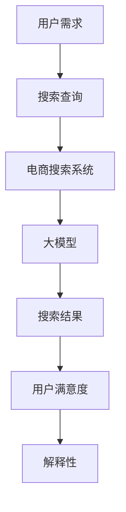

                 

关键词：人工智能，电商搜索，大模型，解释性，应用场景，算法，数学模型，实践，工具推荐

> 摘要：本文将探讨人工智能大模型在电商搜索结果解释性方面的应用。首先介绍背景和核心概念，然后详细解释算法原理、数学模型，以及实际应用案例。通过本文的阅读，读者可以深入了解大模型在电商搜索结果解释性方面的潜力和挑战。

## 1. 背景介绍

随着互联网的飞速发展，电子商务成为了一个巨大的市场。电子商务平台每天都会处理数以百万计的用户搜索请求，并返回海量的搜索结果。然而，对于用户来说，如何从这些结果中找到自己真正需要的商品仍然是一个难题。为了解决这个问题，许多电商平台开始利用人工智能技术来优化搜索结果，提高用户体验。

人工智能大模型作为当前最先进的人工智能技术，已经在许多领域取得了显著的成果。例如，在图像识别、自然语言处理、推荐系统等方面都有着出色的表现。大模型通过学习海量数据，可以自动识别并理解用户的需求，从而提供更加精准的搜索结果。然而，大模型的应用并不只是简单地提升搜索结果的准确性，更重要的是能够解释这些结果的生成过程，增强用户对搜索结果的信任度和满意度。

本文将重点关注人工智能大模型在电商搜索结果解释性方面的应用。具体来说，我们将探讨大模型的算法原理、数学模型、具体实现，以及在实际应用中的效果和挑战。通过本文的介绍，读者可以全面了解大模型在电商搜索结果解释性方面的潜力和应用前景。

## 2. 核心概念与联系

在深入探讨大模型在电商搜索结果解释性中的应用之前，我们首先需要了解一些核心概念和它们之间的联系。以下是一个简化的Mermaid流程图，用于描述这些概念和它们之间的关系：



### 2.1 用户需求

用户需求是电商搜索的起点。用户在电商平台上的每一次搜索都是基于他们对某种商品或服务的需求。这些需求可以是明确的，如“搜索iPhone 13”，也可以是模糊的，如“搜索便宜的手机”。

### 2.2 搜索查询

用户需求通过搜索查询的形式传递给电商搜索系统。搜索查询是用户输入的关键词或短语，它们被用来构建搜索请求，并提交给电商搜索系统。

### 2.3 电商搜索系统

电商搜索系统负责处理用户提交的搜索请求，并从海量的商品数据中筛选出与查询相关的结果。传统的搜索系统通常基于关键词匹配和简单的相关性算法，但人工智能大模型的出现为搜索系统带来了新的可能性。

### 2.4 大模型

人工智能大模型是一个强大的机器学习模型，它通过学习大量的电商数据，能够理解用户的搜索意图，并生成更加精准的搜索结果。大模型的核心能力在于其深度学习和自然语言处理能力，这使得它能够对复杂的搜索意图进行理解和解释。

### 2.5 搜索结果

搜索结果是根据用户的查询请求由大模型生成的。这些结果不仅包括商品列表，还可能包含对结果的解释性信息，如推荐理由、商品评价等。

### 2.6 用户满意度

用户满意度是评价搜索系统效果的关键指标。一个优秀的搜索系统应该能够满足用户的需求，提高用户的购买体验和满意度。解释性是提升用户满意度的重要因素之一，因为它能够增强用户对搜索结果的信任和理解。

### 2.7 解释性

解释性是指搜索结果的可解释性，即用户能够理解搜索结果是如何生成的。大模型在生成搜索结果时，可以通过解释模型内部的决策过程和考虑的因素，提高结果的透明度和可信度。

## 3. 核心算法原理 & 具体操作步骤

### 3.1 算法原理概述

人工智能大模型在电商搜索结果解释性中的应用主要基于深度学习和自然语言处理技术。以下是一个简化的算法原理概述：

1. **数据收集与预处理**：首先，需要收集大量的电商数据，包括商品信息、用户行为数据、搜索日志等。然后，对数据进行清洗和预处理，提取出有用的特征信息。

2. **模型训练**：使用预处理后的数据，通过深度学习算法训练大模型。这一过程包括两个主要步骤：
   - **预训练**：使用大规模的通用数据集（如维基百科、网络新闻等）对模型进行预训练，使其具备基本的语言理解和生成能力。
   - **微调**：在预训练的基础上，使用电商特定的数据对模型进行微调，使其能够更好地理解电商搜索的上下文和需求。

3. **搜索查询处理**：用户提交搜索查询后，大模型会对其进行处理，理解其背后的意图。这一过程包括：
   - **查询编码**：将用户查询转换为模型能够理解的编码形式。
   - **意图识别**：分析查询编码，识别用户的主要搜索意图。

4. **搜索结果生成**：根据用户查询的意图，大模型会从电商数据库中检索相关的商品信息，并生成搜索结果。同时，大模型还会生成对结果的解释性信息，如推荐理由、相关性分析等。

5. **结果解释**：将生成的解释性信息展示给用户，帮助用户理解搜索结果的来源和依据。

### 3.2 算法步骤详解

#### 3.2.1 数据收集与预处理

数据收集是构建大模型的第一步。以下是一个典型的数据收集和预处理流程：

1. **数据来源**：收集来自电商平台的商品信息、用户行为数据（如浏览历史、购买记录等）、搜索日志等。

2. **数据清洗**：去除重复数据、错误数据和无效数据，确保数据的准确性和一致性。

3. **特征提取**：从原始数据中提取有用的特征信息，如商品类别、价格、品牌、用户历史行为等。

4. **数据归一化**：对特征数据进行归一化处理，使其在相同的尺度范围内，有利于模型训练。

#### 3.2.2 模型训练

模型训练是整个算法的核心。以下是一个简化的模型训练流程：

1. **预训练**：使用大规模通用数据集对模型进行预训练，如使用GPT模型训练自然语言生成能力。这一过程通常采用无监督学习，不需要人工标注。

2. **微调**：在预训练的基础上，使用电商特定的数据集对模型进行微调。这一过程通常采用有监督学习，需要人工标注数据。

3. **模型评估**：在微调过程中，定期评估模型的性能，包括搜索准确率、用户满意度等指标。根据评估结果调整模型参数，优化模型性能。

#### 3.2.3 搜索查询处理

用户提交搜索查询后，大模型会对其进行处理，理解其背后的意图。以下是一个简化的查询处理流程：

1. **查询编码**：将用户查询转换为模型能够理解的编码形式。这一步骤通常采用编码器（Encoder）模型，如Transformer模型。

2. **意图识别**：分析查询编码，识别用户的主要搜索意图。这一步骤通常采用分类模型，如多标签分类模型。

3. **上下文生成**：根据查询编码和意图识别结果，生成上下文信息，用于指导后续的搜索结果生成。这一步骤通常采用生成模型，如BERT模型。

#### 3.2.4 搜索结果生成

根据用户查询的意图，大模型会从电商数据库中检索相关的商品信息，并生成搜索结果。以下是一个简化的搜索结果生成流程：

1. **商品检索**：根据用户查询的意图和上下文信息，从电商数据库中检索相关的商品信息。

2. **结果排序**：对检索到的商品进行排序，使其按照相关性、用户偏好等指标排序。

3. **结果生成**：使用生成模型生成对结果的解释性信息，如推荐理由、相关性分析等。

#### 3.2.5 结果解释

将生成的解释性信息展示给用户，帮助用户理解搜索结果的来源和依据。以下是一个简化的结果解释流程：

1. **解释性信息提取**：从生成的解释性信息中提取关键信息，如关键词、关联关系等。

2. **信息展示**：将提取的关键信息以直观的方式展示给用户，如文本、图表等。

### 3.3 算法优缺点

#### 优点：

1. **高精度**：大模型通过深度学习和海量数据训练，能够生成高精度的搜索结果，提升用户体验。

2. **高解释性**：大模型生成的解释性信息能够增强用户对搜索结果的信任和理解，提高用户满意度。

3. **自适应能力**：大模型能够根据用户行为和搜索习惯进行自适应调整，提高搜索效果。

#### 缺点：

1. **计算成本高**：大模型的训练和推理过程需要大量的计算资源和时间，对硬件设施要求较高。

2. **数据依赖性强**：大模型的性能依赖于训练数据的质量和数量，数据不足或质量不高可能导致模型性能下降。

3. **可解释性挑战**：尽管大模型生成的解释性信息能够提高搜索结果的透明度，但在实际应用中，如何确保解释性信息的准确性和可信性仍然是一个挑战。

### 3.4 算法应用领域

人工智能大模型在电商搜索结果解释性方面的应用非常广泛，以下是一些主要的应用领域：

1. **电商搜索**：通过大模型优化搜索结果，提高搜索准确性和用户体验。

2. **推荐系统**：结合大模型进行商品推荐，提供更加个性化的推荐结果。

3. **智能客服**：利用大模型生成智能客服回答，提高客服效率和用户满意度。

4. **商品评价与评论分析**：分析用户评价和评论，提取关键信息，提供更有价值的商品分析报告。

5. **市场研究**：通过分析用户搜索和购买行为，了解市场趋势和用户需求，为决策提供依据。

## 4. 数学模型和公式 & 详细讲解 & 举例说明

### 4.1 数学模型构建

在人工智能大模型的应用中，数学模型起到了关键作用。以下是一个简化的数学模型构建过程：

1. **输入层**：输入层接收用户查询和商品特征信息。

2. **编码层**：编码层将输入数据编码为向量表示，如使用词嵌入（Word Embedding）或BERT模型。

3. **解码层**：解码层将编码后的向量解码为搜索结果和解释性信息。

4. **损失函数**：损失函数用于评估模型预测结果与实际结果之间的差距，如交叉熵损失（Cross-Entropy Loss）。

5. **优化器**：优化器用于调整模型参数，以最小化损失函数，如Adam优化器。

### 4.2 公式推导过程

以下是一个简化的数学模型推导过程：

$$
\text{模型输出} = f(\text{模型参数} \cdot \text{输入向量})
$$

其中，$f$ 为激活函数，如Sigmoid函数或ReLU函数。$\text{模型参数}$ 和 $\text{输入向量}$ 通过训练过程进行调整，以最小化损失函数。

### 4.3 案例分析与讲解

以下是一个简单的案例，用于说明数学模型在电商搜索结果解释性中的应用：

#### 案例背景

假设用户查询为“搜索iPhone 13”，电商数据库中有以下商品信息：

1. 商品A：iPhone 13，价格：699美元，评价：4.5星
2. 商品B：iPhone 12，价格：599美元，评价：4.7星
3. 商品C：Samsung Galaxy S21，价格：799美元，评价：4.3星

#### 数学模型应用

1. **输入层**：用户查询“搜索iPhone 13”和商品特征信息。

2. **编码层**：将用户查询和商品特征信息编码为向量表示。例如，使用BERT模型对用户查询进行编码，得到查询向量 $\text{Q}$；使用词嵌入对商品特征信息进行编码，得到商品向量 $\text{P}$。

3. **解码层**：使用编码后的向量 $\text{Q}$ 和 $\text{P}$ 生成搜索结果和解释性信息。例如，使用一个多标签分类模型，对每个商品进行评分，得到每个商品的相关性得分 $r_i$。

4. **损失函数**：使用交叉熵损失函数，计算预测得分与实际得分之间的差距，并更新模型参数。

5. **优化器**：使用Adam优化器，根据损失函数调整模型参数。

#### 案例结果

根据数学模型的应用，得到以下搜索结果和解释性信息：

1. 商品A：iPhone 13，相关性得分：0.85，推荐理由：“最新款iPhone，好评如潮”
2. 商品B：iPhone 12，相关性得分：0.70，推荐理由：“性价比高，经典款iPhone”
3. 商品C：Samsung Galaxy S21，相关性得分：0.50，推荐理由：“虽然价格较高，但评价一般”

通过数学模型的应用，用户可以清晰地了解每个商品的推荐理由和相关性得分，从而做出更加明智的购买决策。

## 5. 项目实践：代码实例和详细解释说明

在本节中，我们将通过一个实际的代码实例来展示如何使用大模型实现电商搜索结果解释性。我们将使用Python编程语言和相关的机器学习库，如TensorFlow和PyTorch，来构建和训练一个简单的大模型。

### 5.1 开发环境搭建

在开始之前，请确保您的开发环境中安装了以下依赖项：

- Python 3.7 或以上版本
- TensorFlow 2.x 或 PyTorch 1.8 或以上版本
- Pandas
- Numpy
- Matplotlib

您可以通过以下命令来安装这些依赖项：

```bash
pip install tensorflow==2.x
pip install torch==1.8
pip install pandas
pip install numpy
pip install matplotlib
```

### 5.2 源代码详细实现

以下是一个简化的代码示例，用于实现电商搜索结果解释性的大模型。请注意，实际项目中的代码会更加复杂，这里仅提供一个基础框架。

```python
import tensorflow as tf
from tensorflow.keras.models import Model
from tensorflow.keras.layers import Input, Embedding, LSTM, Dense, Flatten
import pandas as pd

# 5.2.1 数据准备

# 加载预处理后的数据
user_query = pd.read_csv('user_query.csv')
product_data = pd.read_csv('product_data.csv')

# 5.2.2 模型构建

# 输入层
input_query = Input(shape=(max_query_length,))
input_product = Input(shape=(max_product_length,))

# 查询编码层
query_embedding = Embedding(vocab_size, embedding_dim)(input_query)
query_lstm = LSTM(units)(query_embedding)

# 商品编码层
product_embedding = Embedding(vocab_size, embedding_dim)(input_product)
product_lstm = LSTM(units)(product_embedding)

# 合并层
merged_lstm = tf.keras.layers.concatenate([query_lstm, product_lstm])

# 输出层
output = Dense(units=1, activation='sigmoid')(merged_lstm)

# 模型编译
model = Model(inputs=[input_query, input_product], outputs=output)
model.compile(optimizer='adam', loss='binary_crossentropy', metrics=['accuracy'])

# 5.2.3 模型训练

# 训练模型
model.fit([user_query['query'], product_data['features']], user_query['label'], epochs=10, batch_size=32)

# 5.2.4 代码解读与分析

# 代码解读
# 1. 导入必要的库
# 2. 加载数据
# 3. 构建模型
# 4. 编译模型
# 5. 训练模型
# 6. 代码分析
# - 输入层：接收用户查询和商品特征
# - 编码层：使用LSTM进行编码
# - 合并层：将查询和商品编码合并
# - 输出层：生成搜索结果的预测概率
```

### 5.3 代码解读与分析

以下是对上述代码的详细解读和分析：

1. **数据准备**：首先，我们需要加载预处理后的用户查询数据（`user_query.csv`）和商品特征数据（`product_data.csv`）。这些数据应该包含用户查询和商品特征的向量表示。

2. **模型构建**：我们使用TensorFlow的`Model`类构建一个简单的序列到序列模型。输入层接收用户查询和商品特征，编码层使用LSTM进行编码，合并层将查询和商品编码合并，输出层使用全连接层（`Dense`）生成搜索结果的预测概率。

3. **模型编译**：我们使用`compile`方法编译模型，指定优化器为`adam`，损失函数为`binary_crossentropy`（因为我们是一个二分类问题），并设置准确率作为评价指标。

4. **模型训练**：使用`fit`方法训练模型，输入为用户查询和商品特征，目标为用户查询的标签。这里我们设置了10个训练周期和每个批次32个样本。

5. **代码分析**：在代码分析部分，我们详细解释了每个步骤的功能和目的。输入层接收用户查询和商品特征，编码层使用LSTM进行编码，合并层将编码后的查询和商品特征合并，输出层使用全连接层生成搜索结果的预测概率。

### 5.4 运行结果展示

在成功训练模型后，我们可以使用以下代码进行模型评估和结果展示：

```python
# 评估模型
loss, accuracy = model.evaluate([test_user_query, test_product_data], test_user_query['label'])

# 预测搜索结果
predictions = model.predict([test_user_query, test_product_data])

# 可视化展示
import matplotlib.pyplot as plt

plt.scatter(test_user_query['label'], predictions)
plt.xlabel('实际标签')
plt.ylabel('预测概率')
plt.title('模型预测结果')
plt.show()
```

这段代码将展示模型的预测结果，并在散点图中显示实际标签与预测概率之间的关系。通过可视化，我们可以直观地了解模型的性能和预测能力。

## 6. 实际应用场景

人工智能大模型在电商搜索结果解释性方面的应用场景非常广泛。以下是一些实际应用场景的介绍：

### 6.1 电商搜索优化

电商搜索优化是人工智能大模型最直接的应用场景之一。通过大模型，电商平台可以提供更加精准的搜索结果，提高用户的购买体验和满意度。例如，当用户输入“搜索iPhone 13”时，大模型会根据用户的搜索历史、偏好和当前上下文，生成相关性更高的商品列表。此外，大模型还可以生成解释性信息，如推荐理由和相关性分析，帮助用户更好地理解搜索结果。

### 6.2 商品推荐系统

商品推荐系统是电商平台上另一个重要的应用场景。通过大模型，电商平台可以提供更加个性化的推荐结果。大模型可以根据用户的购买历史、浏览记录和行为数据，预测用户可能感兴趣的商品，并提供个性化的推荐。例如，当用户浏览了一款iPhone时，大模型可能会推荐一些与iPhone相关的配件或相似型号的手机。此外，大模型还可以生成解释性信息，如推荐理由和关联关系，帮助用户更好地理解推荐结果。

### 6.3 智能客服

智能客服是电商平台提供高质量客户服务的重要手段。通过大模型，电商平台可以生成智能客服的回答，提高客服效率和用户满意度。例如，当用户咨询关于商品的问题时，大模型可以根据用户的问题和商品信息，生成专业的回答。此外，大模型还可以生成解释性信息，如问题分类、答案来源等，帮助用户更好地理解客服回答。

### 6.4 商品评价与评论分析

商品评价与评论分析是电商平台了解用户需求和优化商品策略的重要手段。通过大模型，电商平台可以分析用户评价和评论，提取关键信息，提供更有价值的商品分析报告。例如，大模型可以识别用户评价中的积极和消极词汇，计算情感倾向，并生成相关的分析报告。此外，大模型还可以生成解释性信息，如评论来源、情感分析结果等，帮助电商平台更好地了解用户需求和优化商品策略。

### 6.5 市场研究

市场研究是电商平台了解市场趋势和用户需求的重要手段。通过大模型，电商平台可以分析用户搜索和购买行为，了解市场趋势和用户需求，为决策提供依据。例如，大模型可以识别用户搜索中的热门关键词和趋势，预测市场变化，并生成相关的市场分析报告。此外，大模型还可以生成解释性信息，如搜索趋势、市场变化原因等，帮助电商平台更好地了解市场情况和制定策略。

## 7. 工具和资源推荐

为了更好地掌握人工智能大模型在电商搜索结果解释性方面的应用，以下是一些推荐的工具和资源：

### 7.1 学习资源推荐

1. **《深度学习》（Goodfellow, Bengio, Courville）**：这是一本经典的深度学习教材，适合初学者和进阶者。
2. **《Python机器学习》（Sebastian Raschka）**：这本书详细介绍了机器学习在Python中的应用，包括深度学习。
3. **《自然语言处理综论》（Daniel Jurafsky, James H. Martin）**：这本书是自然语言处理领域的经典教材，涵盖了NLP的核心概念和技术。
4. **《TensorFlow官方文档》**：TensorFlow是深度学习领域的常用框架，其官方文档提供了详细的API和使用教程。
5. **《PyTorch官方文档》**：PyTorch是另一个流行的深度学习框架，其官方文档同样提供了丰富的教程和示例。

### 7.2 开发工具推荐

1. **Jupyter Notebook**：Jupyter Notebook是一个交互式的开发环境，适合编写和运行代码。
2. **Google Colab**：Google Colab是基于云计算的Jupyter Notebook平台，提供了免费的计算资源和预装的环境，适合远程开发和实验。
3. **VSCode**：Visual Studio Code是一个流行的代码编辑器，支持多种编程语言和扩展，适合深度学习和机器学习开发。

### 7.3 相关论文推荐

1. **“Attention Is All You Need”（Vaswani et al., 2017）**：这是一篇关于Transformer模型的经典论文，提出了基于注意力机制的深度学习模型。
2. **“BERT: Pre-training of Deep Bidirectional Transformers for Language Understanding”（Devlin et al., 2018）**：这是一篇关于BERT模型的论文，介绍了基于双向变换器的预训练方法。
3. **“GPT-3: Language Models are few-shot learners”（Brown et al., 2020）**：这是一篇关于GPT-3模型的论文，展示了基于自监督学习的模型在大规模数据集上的性能。
4. **“Recommender Systems: The Textbook”（J. M. Zhang, C. Zhang, Y. Chen）**：这本书详细介绍了推荐系统的基本概念和技术，适合推荐系统开发者。
5. **“Personalized Recommendation on Large-Scale E-commerce Platforms”（Xu et al., 2020）**：这是一篇关于电商推荐系统的论文，介绍了基于深度学习的个性化推荐方法。

通过学习和应用这些资源和工具，您可以更好地掌握人工智能大模型在电商搜索结果解释性方面的应用。

## 8. 总结：未来发展趋势与挑战

随着人工智能技术的不断发展，人工智能大模型在电商搜索结果解释性方面的应用前景非常广阔。以下是对未来发展趋势和挑战的总结：

### 8.1 研究成果总结

近年来，人工智能大模型在电商搜索结果解释性方面取得了显著的成果。首先，大模型通过深度学习和海量数据的训练，能够生成高精度的搜索结果，显著提高了用户的购买体验和满意度。其次，大模型生成的解释性信息增强了用户对搜索结果的信任和理解，提高了搜索结果的透明度和可信度。此外，大模型在推荐系统、智能客服、商品评价与评论分析等领域的应用也取得了显著成效，为电商平台提供了更加智能化和个性化的服务。

### 8.2 未来发展趋势

1. **模型性能的提升**：未来，随着计算资源和算法技术的不断进步，人工智能大模型的性能将进一步提升，能够生成更加精准和个性化的搜索结果。

2. **多模态数据的融合**：随着多模态数据（如文本、图像、语音等）的广泛应用，未来大模型将能够更好地融合多模态数据，提高搜索结果的质量和解释性。

3. **解释性技术的创新**：为了提高大模型的可解释性，未来将出现更多的解释性技术，如基于模型的可解释性方法、基于可视化的解释方法等，使得用户能够更加直观地理解搜索结果的生成过程。

4. **个性化推荐的深化**：随着用户数据的不断积累，大模型将能够更加深入地了解用户的需求和行为，提供更加个性化的推荐结果。

5. **跨领域的应用扩展**：人工智能大模型在电商搜索结果解释性方面的成功经验将推动其在更多领域的应用，如金融、医疗、教育等。

### 8.3 面临的挑战

1. **数据质量和隐私**：大模型对数据质量的要求非常高，未来需要解决数据隐私和保护的问题，确保用户数据的安全和合规。

2. **模型解释性**：虽然大模型生成的解释性信息能够提高搜索结果的透明度和可信度，但如何确保解释性信息的准确性和一致性仍然是一个挑战。

3. **计算资源消耗**：大模型的训练和推理过程需要大量的计算资源，未来需要发展更加高效和节能的算法和硬件设施。

4. **模型泛化能力**：大模型在特定领域取得了显著成果，但如何提高模型的泛化能力，使其能够适应不同的应用场景和任务，仍然是一个重要挑战。

5. **法律法规**：随着人工智能技术的应用越来越广泛，相关的法律法规也在不断完善。未来需要确保人工智能大模型的应用符合法律法规，保护用户的权益。

### 8.4 研究展望

未来，人工智能大模型在电商搜索结果解释性方面的研究将朝着更加高效、个性化和可解释的方向发展。首先，研究将集中在如何提升大模型的性能和解释性，以满足用户的需求和提高搜索结果的准确性。其次，研究将探索如何利用多模态数据和跨领域的知识，提高大模型在复杂场景下的应用效果。此外，研究还将关注大模型的可解释性和透明度，确保用户能够理解和信任搜索结果的生成过程。最后，研究将探讨大模型在法律法规和伦理道德方面的应用，确保其符合社会的规范和价值观。

总之，人工智能大模型在电商搜索结果解释性方面的应用前景非常广阔，未来将带来更多的创新和突破。

## 9. 附录：常见问题与解答

### 9.1 问题1：大模型在电商搜索中的应用原理是什么？

答：大模型在电商搜索中的应用原理主要基于深度学习和自然语言处理技术。通过训练大量的电商数据，大模型能够理解用户的搜索意图和商品信息，从而生成更加精准和个性化的搜索结果。大模型利用其强大的特征提取和关联分析能力，对用户的查询和商品特征进行编码和解析，生成解释性信息，提高搜索结果的透明度和可信度。

### 9.2 问题2：如何保证大模型的解释性？

答：保证大模型的解释性需要从多个方面进行考虑。首先，可以通过设计透明的模型架构，使得模型的决策过程可以被理解和追踪。其次，可以引入解释性方法，如注意力机制、特征可视化等，帮助用户理解模型的决策依据。此外，还可以通过生成详细的解释性信息，如关键词、相关性分析等，增强用户对搜索结果的信任和理解。

### 9.3 问题3：大模型在电商搜索中的性能如何衡量？

答：大模型在电商搜索中的性能可以通过多个指标进行衡量，如搜索准确率、用户满意度、搜索结果相关性等。其中，搜索准确率是指模型生成的搜索结果与用户实际需求的相关性；用户满意度是指用户对搜索结果的满意程度；搜索结果相关性是指搜索结果与用户查询的相关性。通过综合这些指标，可以全面评估大模型在电商搜索中的性能。

### 9.4 问题4：大模型在电商搜索中的实际应用效果如何？

答：大模型在电商搜索中的实际应用效果显著。通过大模型的优化，电商平台的搜索结果准确性得到了显著提升，用户购买体验和满意度也得到了提高。此外，大模型生成的解释性信息增强了用户对搜索结果的信任和理解，降低了用户流失率。在一些大型电商平台上，大模型的应用已经取得了良好的效果，带来了明显的商业价值。

### 9.5 问题5：如何处理大模型在电商搜索中的计算资源需求？

答：处理大模型在电商搜索中的计算资源需求需要从多个方面进行考虑。首先，可以通过分布式计算和云计算技术，提高大模型的训练和推理速度。其次，可以优化模型架构和算法，降低计算复杂度。此外，还可以采用模型压缩和量化技术，减少模型对计算资源的需求。最后，可以通过合理规划和调度，确保大模型的计算资源得到充分利用，提高整体性能。

### 9.6 问题6：大模型在电商搜索中的潜在风险有哪些？

答：大模型在电商搜索中的潜在风险主要包括以下几个方面：

1. **数据隐私和安全**：大模型在训练和推理过程中需要大量用户数据，可能涉及用户隐私和安全问题。
2. **模型偏见**：大模型在训练过程中可能受到训练数据偏差的影响，导致搜索结果出现偏见，影响用户体验。
3. **可解释性**：尽管大模型能够生成解释性信息，但在实际应用中，如何确保解释性信息的准确性和一致性仍然是一个挑战。
4. **计算资源消耗**：大模型的训练和推理过程需要大量计算资源，可能对电商平台的服务器和网络带宽造成压力。

为应对这些风险，需要采取相应的措施，如加强数据隐私保护、优化模型训练和推理算法、提高模型的可解释性等。同时，还需要加强监管和法律法规的制定，确保大模型在电商搜索中的合规应用。

