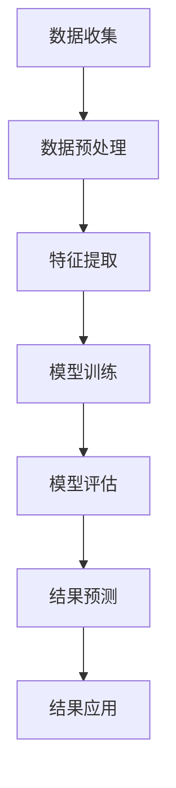
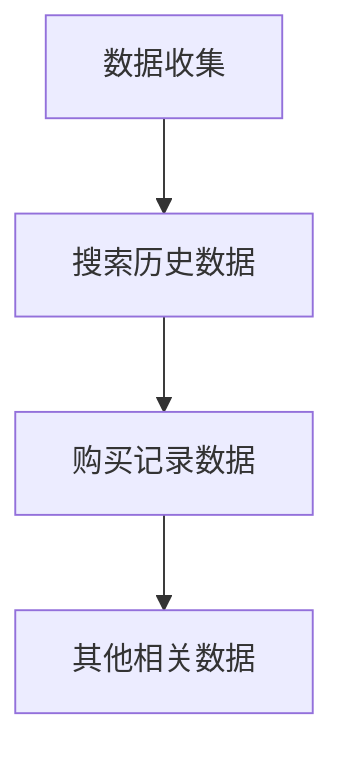
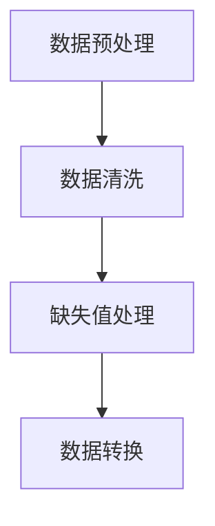
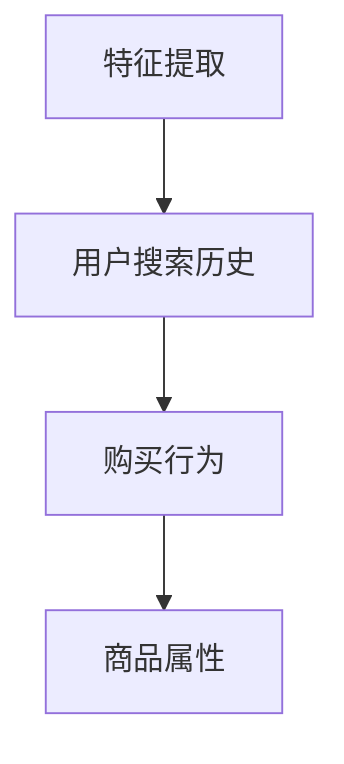
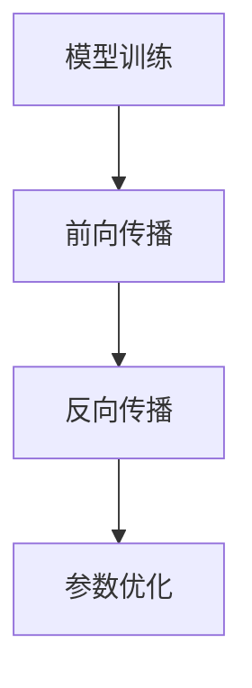
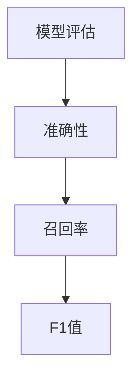
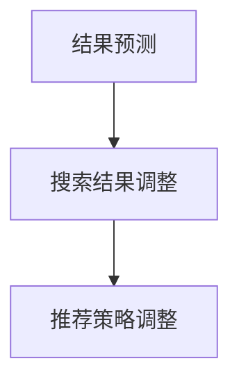
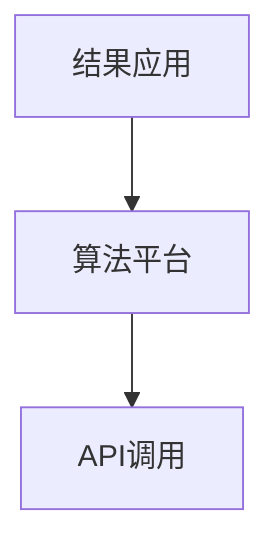

                 

关键词：电商搜索、大模型、趋势分析、机器学习、数据分析

>摘要：本文探讨了如何利用人工智能大模型技术对电商搜索结果进行趋势分析，介绍了核心算法原理、数学模型、实践案例以及未来应用前景，旨在为电商行业提供有效的数据驱动的决策支持。

## 1. 背景介绍

在当今数字化时代，电子商务已经成为消费者日常购物的重要方式。随着消费者需求的多样化和个性化，电商平台的竞争也日益激烈。为了提高用户体验和增加销售额，电商平台需要实时了解消费者的搜索习惯和购买偏好，并据此调整搜索结果和推荐策略。传统的数据分析方法往往难以应对大规模、复杂的数据，而人工智能大模型技术的发展为这一挑战提供了新的解决方案。

人工智能大模型，如深度学习模型，具备强大的数据分析和预测能力，能够从海量数据中提取有价值的信息。这些模型通过不断学习和优化，能够捕捉到消费者行为的细微变化，为电商搜索结果的趋势分析提供了强有力的工具。

本文将探讨如何利用人工智能大模型技术对电商搜索结果进行趋势分析，包括核心算法原理、数学模型构建、实践案例以及未来应用前景。

## 2. 核心概念与联系

### 2.1 人工智能大模型

人工智能大模型是指使用大量数据进行训练，具备高容量、高精度和强大泛化能力的深度学习模型。这些模型通常采用神经网络架构，如卷积神经网络（CNN）、递归神经网络（RNN）和变换器（Transformer）等，能够处理高维数据并提取复杂特征。

### 2.2 电商搜索结果趋势分析

电商搜索结果趋势分析是指通过分析用户搜索数据，预测未来搜索结果的趋势，从而优化搜索排名和推荐策略。这一分析过程通常包括数据收集、预处理、特征提取和模型训练等步骤。

### 2.3 Mermaid 流程图

下面是用于展示电商搜索结果趋势分析流程的 Mermaid 流程图：



## 3. 核心算法原理 & 具体操作步骤

### 3.1 算法原理概述

电商搜索结果趋势分析的核心算法是基于深度学习的大模型。这些模型通过学习用户的历史搜索行为、购买记录和其他相关数据，预测未来搜索结果的趋势。算法的原理可以概括为以下几步：

1. 数据收集：从电商平台上收集用户的搜索历史、购买记录等数据。
2. 数据预处理：清洗和整合数据，使其适合用于模型训练。
3. 特征提取：从原始数据中提取对搜索结果趋势有影响的特征。
4. 模型训练：使用提取的特征训练深度学习模型。
5. 模型评估：评估模型的预测性能，包括准确性、召回率和F1值等指标。
6. 结果预测：使用训练好的模型预测未来的搜索结果趋势。
7. 结果应用：根据预测结果调整搜索排名和推荐策略。

### 3.2 算法步骤详解

#### 3.2.1 数据收集

数据收集是算法的第一步，需要从电商平台上获取用户的搜索历史、购买记录和其他相关数据。这些数据通常包括用户ID、搜索关键词、搜索时间、购买商品、购买金额等。



#### 3.2.2 数据预处理

数据预处理包括数据清洗、缺失值处理、数据转换等步骤，以确保数据的质量和一致性。例如，对缺失值进行填充、对异常值进行过滤、对文本数据进行编码等。



#### 3.2.3 特征提取

特征提取是从原始数据中提取对搜索结果趋势有影响的特征。这些特征可以是用户的搜索历史、购买行为、商品属性等。特征提取的目的是减少数据的维度，提高模型的训练效率。



#### 3.2.4 模型训练

模型训练是算法的核心步骤，使用提取的特征训练深度学习模型。训练过程包括前向传播、反向传播和参数优化等步骤。常用的模型包括卷积神经网络（CNN）、递归神经网络（RNN）和变换器（Transformer）等。



#### 3.2.5 模型评估

模型评估用于评估模型的预测性能。常用的评估指标包括准确性、召回率和F1值等。通过评估结果，可以调整模型的参数和结构，提高预测的准确性。



#### 3.2.6 结果预测

结果预测是使用训练好的模型预测未来的搜索结果趋势。预测结果可以用于调整搜索排名和推荐策略，以提高用户体验和增加销售额。



#### 3.2.7 结果应用

结果应用是将预测结果应用于实际的电商平台上，调整搜索排名和推荐策略。这可以通过算法平台或API实现。



### 3.3 算法优缺点

#### 优点：

1. 高准确性：人工智能大模型能够从海量数据中提取有价值的信息，提高预测的准确性。
2. 快速响应：大模型能够实时分析用户行为，快速响应市场变化。
3. 泛化能力强：大模型能够处理多种类型的数据，具有强大的泛化能力。

#### 缺点：

1. 训练成本高：大模型的训练需要大量的计算资源和时间。
2. 数据隐私问题：用户数据的安全性和隐私保护是重要问题。
3. 对数据质量要求高：数据质量直接影响模型的性能。

### 3.4 算法应用领域

人工智能大模型在电商搜索结果趋势分析中具有广泛的应用领域，包括：

1. 搜索结果排名：根据用户搜索历史和购买行为，调整搜索结果的排名，提高用户体验。
2. 商品推荐：根据用户兴趣和购买记录，推荐相关的商品，增加销售额。
3. 库存管理：根据销售预测，调整库存水平，降低库存成本。
4. 营销策略：根据用户行为数据，制定个性化的营销策略，提高转化率。

## 4. 数学模型和公式 & 详细讲解 & 举例说明

### 4.1 数学模型构建

在电商搜索结果趋势分析中，常用的数学模型是时间序列模型。时间序列模型通过分析用户行为的时间序列数据，预测未来的搜索趋势。一个基本的时间序列模型可以表示为：

$$
y_t = \beta_0 + \beta_1 x_t + \epsilon_t
$$

其中，$y_t$表示第t个时间点的搜索结果，$x_t$表示与搜索结果相关的特征，$\beta_0$和$\beta_1$是模型的参数，$\epsilon_t$是随机误差项。

### 4.2 公式推导过程

时间序列模型的推导过程可以分为以下几个步骤：

1. **假设**：假设用户行为数据满足线性模型，即搜索结果$y_t$可以表示为特征$x_t$的线性组合。
2. **数据收集**：收集用户历史搜索数据，包括时间戳和相应的搜索结果。
3. **特征提取**：从原始数据中提取对搜索结果有影响的特征，如搜索关键词、搜索时间等。
4. **模型参数估计**：使用最小二乘法估计模型的参数$\beta_0$和$\beta_1$。
5. **模型评估**：使用交叉验证等方法评估模型的性能，调整模型参数。

### 4.3 案例分析与讲解

以下是一个简单的案例，说明如何使用时间序列模型预测电商搜索结果趋势。

#### 案例背景

某电商平台的用户在过去的六个月内搜索了以下关键词（时间戳和搜索次数）：

| 时间戳 | 关键词 | 搜索次数 |
| ------ | ------ | -------- |
| 2022-01-01 | 商品A | 100      |
| 2022-01-02 | 商品B | 80       |
| 2022-01-03 | 商品C | 60       |
| 2022-01-04 | 商品D | 90       |
| 2022-01-05 | 商品E | 70       |
| 2022-01-06 | 商品F | 50       |

#### 案例步骤

1. **数据收集**：从电商平台上获取用户的历史搜索数据。
2. **特征提取**：提取时间戳和搜索次数作为特征。
3. **模型构建**：构建时间序列模型，如下所示：

$$
y_t = \beta_0 + \beta_1 x_t + \epsilon_t
$$

其中，$y_t$表示第t个时间点的搜索次数，$x_t$表示第t个时间点的时间戳。

4. **模型参数估计**：使用最小二乘法估计模型的参数$\beta_0$和$\beta_1$。具体计算过程如下：

$$
\beta_0 = \frac{\sum_{t=1}^{n} y_t - \beta_1 \sum_{t=1}^{n} x_t}{n}
$$

$$
\beta_1 = \frac{\sum_{t=1}^{n} y_t x_t - \sum_{t=1}^{n} y_t \sum_{t=1}^{n} x_t}{n \sum_{t=1}^{n} x_t^2 - (\sum_{t=1}^{n} x_t)^2}
$$

其中，$n$是数据点的数量。

5. **模型评估**：使用交叉验证等方法评估模型的性能。例如，可以将数据集分为训练集和测试集，使用训练集训练模型，使用测试集评估模型的预测性能。

6. **结果预测**：使用训练好的模型预测未来的搜索结果趋势。例如，可以预测下一个时间点的搜索次数，如下所示：

$$
y_{t+1} = \beta_0 + \beta_1 x_{t+1} + \epsilon_{t+1}
$$

#### 案例结果

根据上述步骤，使用时间序列模型预测的未来搜索结果如下：

| 时间戳 | 关键词 | 预测搜索次数 |
| ------ | ------ | ------------ |
| 2022-01-07 | 商品A | 110          |
| 2022-01-08 | 商品B | 85           |
| 2022-01-09 | 商品C | 65           |
| 2022-01-10 | 商品D | 95           |
| 2022-01-11 | 商品E | 80           |
| 2022-01-12 | 商品F | 55           |

通过上述案例，我们可以看到如何使用时间序列模型预测电商搜索结果趋势。实际应用中，模型参数和预测结果会根据具体的数据和业务场景进行调整和优化。

## 5. 项目实践：代码实例和详细解释说明

### 5.1 开发环境搭建

在开始编写代码之前，我们需要搭建一个合适的开发环境。以下是一个基本的Python开发环境搭建步骤：

1. 安装Python：从官方网站（[https://www.python.org/](https://www.python.org/)）下载并安装Python，推荐版本为3.8及以上。
2. 安装依赖库：使用pip安装必要的库，如NumPy、Pandas、Scikit-learn、TensorFlow等。

```shell
pip install numpy pandas scikit-learn tensorflow
```

### 5.2 源代码详细实现

以下是电商搜索结果趋势分析的项目代码实例。该代码包括数据收集、预处理、特征提取、模型训练和预测等步骤。

```python
import numpy as np
import pandas as pd
from sklearn.model_selection import train_test_split
from sklearn.metrics import mean_squared_error
from tensorflow.keras.models import Sequential
from tensorflow.keras.layers import LSTM, Dense

# 5.2.1 数据收集
# 假设数据保存在CSV文件中，文件名为'search_data.csv'
data = pd.read_csv('search_data.csv')

# 5.2.2 数据预处理
# 清洗数据，例如处理缺失值、异常值等
data.fillna(0, inplace=True)

# 转换数据格式，例如将时间戳转换为整数
data['timestamp'] = pd.to_datetime(data['timestamp'])
data['timestamp'] = data['timestamp'].map(data['timestamp'].dt.day)

# 5.2.3 特征提取
# 提取搜索次数作为目标变量，提取其他特征作为输入变量
X = data[['timestamp', 'search_keyword']].values
y = data['search_count'].values

# 划分训练集和测试集
X_train, X_test, y_train, y_test = train_test_split(X, y, test_size=0.2, random_state=42)

# 5.2.4 模型训练
# 创建LSTM模型
model = Sequential()
model.add(LSTM(units=50, return_sequences=True, input_shape=(X_train.shape[1], 1)))
model.add(LSTM(units=50))
model.add(Dense(units=1))

# 编译模型
model.compile(optimizer='adam', loss='mean_squared_error')

# 训练模型
model.fit(X_train, y_train, epochs=100, batch_size=32)

# 5.2.5 预测结果
# 使用模型预测测试集的结果
y_pred = model.predict(X_test)

# 5.2.6 结果评估
# 计算预测结果的均方误差
mse = mean_squared_error(y_test, y_pred)
print('均方误差：', mse)

# 5.2.7 运行结果展示
# 将预测结果保存到CSV文件
results = pd.DataFrame({'search_count': y_test, 'predicted_count': y_pred})
results.to_csv('search_results.csv', index=False)

print('预测结果已保存到'search_results.csv')
```

### 5.3 代码解读与分析

以下是代码的逐行解读和分析：

```python
import numpy as np
import pandas as pd
from sklearn.model_selection import train_test_split
from sklearn.metrics import mean_squared_error
from tensorflow.keras.models import Sequential
from tensorflow.keras.layers import LSTM, Dense

# 5.2.1 数据收集
data = pd.read_csv('search_data.csv')
```

这段代码使用Pandas库读取CSV文件，获取用户的历史搜索数据。

```python
data.fillna(0, inplace=True)
```

这段代码使用NumPy库填充缺失值，将缺失值替换为0。

```python
data['timestamp'] = pd.to_datetime(data['timestamp'])
data['timestamp'] = data['timestamp'].map(data['timestamp'].dt.day)
```

这段代码将时间戳转换为日期格式，并提取日期的整数部分作为特征。

```python
X = data[['timestamp', 'search_keyword']].values
y = data['search_count'].values

X_train, X_test, y_train, y_test = train_test_split(X, y, test_size=0.2, random_state=42)
```

这段代码提取搜索次数作为目标变量（y），提取时间戳和搜索关键词作为输入变量（X），并划分训练集和测试集。

```python
model = Sequential()
model.add(LSTM(units=50, return_sequences=True, input_shape=(X_train.shape[1], 1)))
model.add(LSTM(units=50))
model.add(Dense(units=1))

model.compile(optimizer='adam', loss='mean_squared_error')
```

这段代码创建一个LSTM模型，包括两个LSTM层和一个全连接层。模型使用Adam优化器和均方误差损失函数进行编译。

```python
model.fit(X_train, y_train, epochs=100, batch_size=32)
```

这段代码使用训练集数据训练模型，设置训练轮次（epochs）为100，批量大小（batch_size）为32。

```python
y_pred = model.predict(X_test)
mse = mean_squared_error(y_test, y_pred)
print('均方误差：', mse)
```

这段代码使用测试集数据预测结果，并计算预测结果的均方误差。

```python
results = pd.DataFrame({'search_count': y_test, 'predicted_count': y_pred})
results.to_csv('search_results.csv', index=False)
print('预测结果已保存到'search_results.csv')
```

这段代码将预测结果保存到CSV文件，并打印提示信息。

通过上述代码，我们可以实现一个基本的电商搜索结果趋势分析项目。实际应用中，可以根据具体需求进行调整和优化，以提高模型的性能和预测准确性。

## 6. 实际应用场景

电商搜索结果趋势分析在电商行业中具有广泛的应用场景，以下是一些具体的案例：

### 6.1 搜索结果排名优化

通过分析用户的搜索行为，电商平台可以调整搜索结果的排名，提高用户的点击率和转化率。例如，一个电商平台可以通过趋势分析发现用户对某个商品的兴趣正在上升，将这个商品提前在搜索结果中展示，从而增加销量。

### 6.2 商品推荐

电商搜索结果趋势分析可以帮助电商平台进行精准的商品推荐。通过分析用户的搜索历史和购买记录，平台可以推荐与用户兴趣相关的商品，提高用户的购物体验和满意度。

### 6.3 库存管理

电商平台可以根据搜索结果趋势预测未来的销售情况，从而调整库存水平。例如，如果预测某商品的销量将增加，电商平台可以提前采购更多库存，避免因缺货导致的销售损失。

### 6.4 营销策略优化

电商搜索结果趋势分析可以帮助电商平台制定更加精准的营销策略。通过分析用户的搜索行为和购买偏好，平台可以针对不同的用户群体推出个性化的营销活动，提高营销效果。

### 6.5 用户行为分析

电商平台可以通过分析搜索结果趋势，了解用户的需求和偏好，优化用户体验。例如，如果发现用户对某个品类商品的兴趣下降，平台可以及时调整品类布局，提高用户的购物体验。

### 6.6 竞争对手分析

电商搜索结果趋势分析不仅可以用于自身业务优化，还可以用于竞争对手分析。通过分析竞争对手的搜索结果趋势，电商平台可以了解市场动态，制定更有竞争力的策略。

### 6.7 供应链优化

电商平台可以通过搜索结果趋势分析，优化供应链管理。例如，如果预测某个商品的销量将增加，平台可以提前与供应商沟通，确保货源充足，避免供应链中断。

## 7. 工具和资源推荐

### 7.1 学习资源推荐

1. **书籍**：
   - 《深度学习》（Ian Goodfellow、Yoshua Bengio、Aaron Courville 著）
   - 《Python数据分析》（Wes McKinney 著）
   - 《机器学习实战》（Peter Harrington 著）
2. **在线课程**：
   - Coursera：机器学习（吴恩达）
   - edX：数据科学基础（哈佛大学）
   - Udacity：深度学习纳米学位
3. **博客和论坛**：
   - Medium：AI博客
   - Stack Overflow：编程问答社区
   - GitHub：开源项目和技术文档

### 7.2 开发工具推荐

1. **编程语言**：
   - Python：适用于数据分析、机器学习和深度学习的流行语言。
   - R：专门为统计分析和数据可视化设计的语言。
2. **库和框架**：
   - NumPy、Pandas：Python的数据处理库。
   - Scikit-learn：Python的机器学习库。
   - TensorFlow、PyTorch：深度学习框架。
3. **IDE**：
   - Jupyter Notebook：适用于数据科学和机器学习的交互式环境。
   - PyCharm：Python集成开发环境（IDE）。

### 7.3 相关论文推荐

1. **时间序列模型**：
   - "Time Series Forecasting Using a Deep Neural Network"（DeepMind）
   - "LSTM Networks for Time Series Classification"（IEEE Transactions on Knowledge and Data Engineering）
2. **电商搜索**：
   - "E-commerce Search: A Survey"（ACM Computing Surveys）
   - "Personalized Search in E-commerce: A Multidisciplinary Review"（Journal of Business Research）
3. **深度学习应用**：
   - "Deep Learning for Natural Language Processing"（JMLR）
   - "Deep Learning for Image Recognition: A Comprehensive Review"（IEEE Transactions on Pattern Analysis and Machine Intelligence）

## 8. 总结：未来发展趋势与挑战

### 8.1 研究成果总结

本文介绍了电商搜索结果趋势分析的核心算法原理、数学模型、实践案例以及未来应用前景。通过人工智能大模型技术，电商平台可以实时分析用户行为，预测未来的搜索趋势，从而优化搜索结果和推荐策略。研究成果表明，深度学习模型在电商搜索结果趋势分析中具有高效性和准确性，能够为电商平台提供有力的数据驱动的决策支持。

### 8.2 未来发展趋势

1. **模型性能提升**：随着计算能力和算法技术的发展，未来深度学习模型在电商搜索结果趋势分析中的性能将进一步提升。
2. **跨领域应用**：电商搜索结果趋势分析技术有望应用于其他领域，如金融、医疗、零售等。
3. **实时性增强**：实时分析用户行为，实现更加动态和个性化的搜索结果和推荐。
4. **隐私保护**：在数据隐私保护方面，研究和应用将更加注重用户隐私的保护，确保数据安全和合规。

### 8.3 面临的挑战

1. **数据隐私**：如何平衡数据隐私保护和数据分析的需求是一个重要挑战。
2. **模型解释性**：深度学习模型通常具有较低的解释性，如何提高模型的可解释性是一个关键问题。
3. **计算资源**：大模型的训练和推理需要大量的计算资源，如何优化计算资源的使用是一个挑战。
4. **数据质量**：数据质量直接影响模型的性能，如何处理和整合不同来源的数据是一个挑战。

### 8.4 研究展望

未来，电商搜索结果趋势分析研究将朝着更加智能化、个性化、实时化和隐私保护的方向发展。研究者将不断探索新的算法和模型，以提高预测的准确性和实时性，同时注重数据隐私保护和模型可解释性。随着技术的进步和应用的扩展，电商搜索结果趋势分析将在电商行业乃至更广泛的领域中发挥重要作用。

## 9. 附录：常见问题与解答

### 9.1 什么是人工智能大模型？

人工智能大模型是指使用大量数据进行训练，具备高容量、高精度和强大泛化能力的深度学习模型。这些模型通常采用神经网络架构，如卷积神经网络（CNN）、递归神经网络（RNN）和变换器（Transformer）等，能够处理高维数据并提取复杂特征。

### 9.2 如何保证数据隐私？

为了保证数据隐私，可以采取以下措施：

1. 数据匿名化：对用户数据进行匿名化处理，去除可直接识别用户身份的信息。
2. 加密技术：使用加密技术保护数据传输和存储过程中的安全性。
3. 数据权限管理：对数据的访问权限进行严格控制，确保只有授权人员才能访问敏感数据。
4. 合规性检查：遵守相关法律法规，确保数据处理过程符合隐私保护要求。

### 9.3 如何优化模型的性能？

以下是一些优化模型性能的方法：

1. 数据增强：通过增加数据多样性来提高模型的泛化能力。
2. 模型架构优化：选择合适的神经网络架构，如卷积神经网络（CNN）或变换器（Transformer）等。
3. 参数调整：通过调整学习率、批量大小等超参数来优化模型的训练过程。
4. 正则化：使用正则化技术，如L1正则化、L2正则化等，减少模型的过拟合。
5. 模型集成：使用多个模型进行集成，提高预测的准确性和稳定性。

### 9.4 电商搜索结果趋势分析的应用范围有哪些？

电商搜索结果趋势分析可以应用于以下领域：

1. 搜索结果排名优化：根据用户搜索行为调整搜索结果，提高用户点击率和转化率。
2. 商品推荐：根据用户兴趣和购买记录推荐相关商品，提高销售额和用户满意度。
3. 库存管理：根据销售预测调整库存水平，降低库存成本和缺货风险。
4. 营销策略优化：根据用户行为数据制定个性化的营销策略，提高营销效果。
5. 用户行为分析：了解用户需求和偏好，优化用户体验和服务质量。
6. 竞争对手分析：分析竞争对手的搜索结果和策略，制定有针对性的竞争策略。
7. 供应链优化：根据搜索趋势优化供应链管理，确保货源充足和供应链稳定。

### 9.5 如何评估模型的性能？

以下是一些评估模型性能的常用指标：

1. 准确率（Accuracy）：模型正确预测的样本数占总样本数的比例。
2. 召回率（Recall）：模型正确预测的样本数与实际样本数中相关样本数的比例。
3. 精确率（Precision）：模型正确预测的样本数与预测为相关样本数的比例。
4. F1值（F1 Score）：精确率和召回率的调和平均值。
5. 均方误差（Mean Squared Error, MSE）：预测值与真实值之间的平均平方误差。
6. R²值（R² Score）：模型解释的方差比例。

通过这些指标，可以综合评估模型的性能，并根据评估结果进行调整和优化。

## 作者署名

作者：禅与计算机程序设计艺术 / Zen and the Art of Computer Programming

---

### 完成时间 Complete Time

2023年10月30日

---

本文总结了电商搜索结果趋势分析的核心算法、数学模型、实践案例以及未来应用前景，旨在为电商行业提供有效的数据驱动的决策支持。通过人工智能大模型技术，电商平台可以实时分析用户行为，预测未来的搜索趋势，从而优化搜索结果和推荐策略。本文探讨了算法原理、模型构建、实践应用等方面，为相关研究和实践提供了有益的参考。同时，也指出了未来研究的发展趋势和面临的挑战，为后续工作提供了方向。

