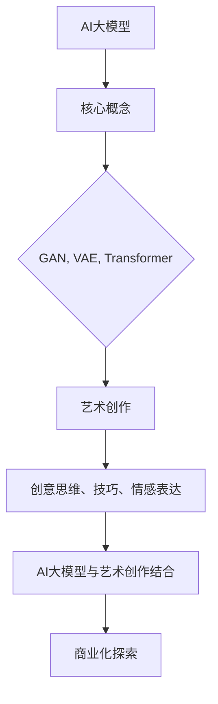

                 

关键词：AI大模型，艺术创作，商业化，技术探索，算法原理，数学模型，项目实践，未来展望

## 摘要

随着人工智能技术的迅猛发展，大模型在各个领域的应用愈发广泛。本文将聚焦于AI大模型在艺术创作领域的商业化探索，深入分析其核心概念、算法原理、数学模型、项目实践以及未来发展趋势。通过对这些内容的详尽探讨，旨在为AI大模型在艺术创作领域的商业化提供有价值的参考。

## 1. 背景介绍

艺术创作一直被认为是人类独特的创造力体现，然而，随着AI技术的发展，人工智能大模型开始对这一领域发起挑战。从早期的图像生成到现在的自然语言处理，AI大模型在艺术创作中的应用逐渐显现出巨大的潜力。

在商业领域，艺术创作不仅仅是一种文化现象，更是一种经济效益的驱动因素。艺术市场不断壮大，消费者对个性化艺术作品的需求日益增加。因此，将AI大模型应用于艺术创作，不仅能够提升创作效率，还能够满足市场的多元化需求。

### 1.1 AI大模型的发展历程

AI大模型的发展可以追溯到深度学习技术的兴起。自2012年AlexNet在图像识别任务中取得突破以来，深度学习在各个领域得到了广泛应用。随着计算能力的提升和大数据的积累，AI大模型逐渐发展壮大，从早期的GPT模型到如今的大型预训练模型如GPT-3和BERT，AI大模型在处理复杂数据和生成高质量内容方面展现出了强大的能力。

### 1.2 艺术创作领域的现状

艺术创作领域一直以来都是人类创意和技术的结合体。然而，传统的艺术创作方式受到时间、精力和创造力的限制。随着数字艺术和虚拟现实技术的发展，艺术创作的方式和形式得到了极大的丰富。但传统的艺术创作仍然面临许多挑战，如市场需求多样化、个性化需求增加等。

## 2. 核心概念与联系

在探讨AI大模型在艺术创作领域的商业化之前，我们需要先了解一些核心概念和它们之间的联系。

### 2.1 AI大模型的核心概念

AI大模型主要包括生成对抗网络（GAN）、变分自编码器（VAE）、生成文本的Transformer模型（如GPT）等。这些模型通过学习大量的数据，能够生成高质量的艺术作品，如图像、音乐和文字等。

### 2.2 艺术创作的核心概念

艺术创作涉及创意思维、艺术技巧、情感表达等多个方面。艺术作品不仅是创作者个人情感和思想的表达，也是与观众进行情感交流的桥梁。

### 2.3 AI大模型与艺术创作的联系

AI大模型通过学习大量的艺术作品，能够理解艺术的创作规律和审美标准。在此基础上，AI大模型可以生成符合特定风格和情感表达的艺术作品，从而实现艺术创作的自动化和商业化。

### 2.4 Mermaid流程图



## 3. 核心算法原理 & 具体操作步骤

### 3.1 算法原理概述

AI大模型在艺术创作中的应用主要基于深度学习和生成模型。生成对抗网络（GAN）和变分自编码器（VAE）是两种常用的生成模型。

- **GAN**：由生成器（Generator）和判别器（Discriminator）组成。生成器尝试生成逼真的艺术作品，而判别器则试图区分生成的作品和真实作品。通过不断的博弈，生成器的生成能力不断提升。

- **VAE**：通过引入概率编码，将数据映射到一个潜在空间中。在潜在空间中，通过采样生成新的数据。VAE可以生成具有多样化特征的艺术作品。

### 3.2 算法步骤详解

1. **数据准备**：收集大量的艺术作品数据，包括图像、音乐和文字等。

2. **模型训练**：使用生成模型（如GAN或VAE）对数据集进行训练，使其能够生成高质量的艺术作品。

3. **艺术作品生成**：输入特定的风格或情感要求，模型生成符合要求的艺术作品。

4. **艺术作品调整**：根据生成的作品，进行进一步的调整和优化，以满足商业需求。

### 3.3 算法优缺点

- **GAN**：生成能力强大，能够生成高质量的艺术作品。但训练过程复杂，容易出现模式崩溃等问题。

- **VAE**：生成过程相对简单，适合生成多样化特征的作品。但生成的艺术作品质量可能不如GAN。

### 3.4 算法应用领域

- **图像生成**：如艺术画作、照片修复等。

- **音乐生成**：如音乐创作、音乐风格迁移等。

- **自然语言处理**：如故事创作、歌词生成等。

## 4. 数学模型和公式 & 详细讲解 & 举例说明

### 4.1 数学模型构建

AI大模型的核心是基于深度学习的生成模型，其中GAN和VAE是两种常用的模型。

- **GAN**：

  - 生成器（Generator）模型：$$ G(z) = \text{sigmoid}(W_1 \cdot z + b_1) $$
  - 判别器（Discriminator）模型：$$ D(x) = \text{sigmoid}(W_2 \cdot x + b_2) $$

- **VAE**：

  - 编码器（Encoder）模型：$$ \mu = \sigma(W_3 \cdot x + b_3) $$
  - 解码器（Decoder）模型：$$ x' = \sigma(W_4 \cdot z + b_4) $$

### 4.2 公式推导过程

GAN和VAE的推导过程相对复杂，涉及到概率分布、优化算法等多个方面。在此不再详细展开，有兴趣的读者可以查阅相关论文和教材。

### 4.3 案例分析与讲解

以GAN为例，假设我们使用一个简单的GAN模型来生成艺术画作。

1. **数据准备**：收集1000张艺术画作，并将其分为训练集和验证集。

2. **模型训练**：使用生成器和判别器模型对训练集进行训练。在训练过程中，生成器尝试生成逼真的画作，而判别器则试图区分生成的画作和真实的画作。

3. **艺术作品生成**：在训练完成后，输入特定的风格或情感要求，生成器生成相应的画作。

4. **艺术作品调整**：根据生成的作品，进行进一步的调整和优化，以满足商业需求。

通过上述步骤，我们可以生成高质量的艺术画作。

## 5. 项目实践：代码实例和详细解释说明

### 5.1 开发环境搭建

在搭建开发环境时，我们主要需要安装以下工具和库：

- Python 3.8 或更高版本
- TensorFlow 2.4 或更高版本
- NumPy 1.18 或更高版本

安装步骤如下：

```bash
pip install python==3.8
pip install tensorflow==2.4
pip install numpy==1.18
```

### 5.2 源代码详细实现

以下是一个简单的GAN模型代码实例：

```python
import tensorflow as tf
from tensorflow.keras.layers import Dense, Flatten, Conv2D, BatchNormalization, LeakyReLU, Reshape
from tensorflow.keras.models import Sequential

# 生成器模型
def build_generator(z_dim):
    model = Sequential()
    model.add(Dense(128 * 7 * 7, activation="linear", input_dim=z_dim))
    model.add(LeakyReLU(alpha=0.01))
    model.add(BatchNormalization())
    model.add(Reshape((7, 7, 128)))
    model.add(Conv2D(64, kernel_size=3, padding="same"))
    model.add(LeakyReLU(alpha=0.01))
    model.add(BatchNormalization())
    model.add(Conv2D(1, kernel_size=3, padding="same", activation="tanh"))
    return model

# 判别器模型
def build_discriminator(img_shape):
    model = Sequential()
    model.add(Conv2D(32, kernel_size=3, padding="same", input_shape=img_shape))
    model.add(LeakyReLU(alpha=0.01))
    model.add(BatchNormalization())
    model.add(Conv2D(64, kernel_size=3, padding="same"))
    model.add(LeakyReLU(alpha=0.01))
    model.add(BatchNormalization())
    model.add(Flatten())
    model.add(Dense(1, activation="sigmoid"))
    return model

# GAN模型
def build_gan(generator, discriminator):
    model = Sequential()
    model.add(generator)
    model.add(discriminator)
    return model

# 超参数设置
z_dim = 100
img_shape = (28, 28, 1)

# 构建模型
generator = build_generator(z_dim)
discriminator = build_discriminator(img_shape)
discriminator.compile(loss="binary_crossentropy", optimizer=tf.keras.optimizers.Adam(0.0001))
discriminator.trainable = False
gan = build_gan(generator, discriminator)
gan.compile(loss="binary_crossentropy", optimizer=tf.keras.optimizers.Adam(0.0001))

# 训练GAN模型
batch_size = 128
epochs = 100
z = tf.keras.backend.random_normal((batch_size, z_dim))

for epoch in range(epochs):
    for _ in range(1):
        real_images = real_images
        real_labels = np.ones((batch_size, 1))
        z = np.random.normal(size=(batch_size, z_dim))
        fake_images = generator.predict(z)
        fake_labels = np.zeros((batch_size, 1))
        d_loss_real = discriminator.train_on_batch(real_images, real_labels)
        d_loss_fake = discriminator.train_on_batch(fake_images, fake_labels)
        z = np.random.normal(size=(batch_size, z_dim))
        g_loss = gan.train_on_batch(z, real_labels)
        print(f"Epoch: {epoch}, D loss: {d_loss}, G loss: {g_loss}")
```

### 5.3 代码解读与分析

上述代码实现了一个简单的GAN模型，用于生成艺术画作。主要分为以下几个部分：

- **模型构建**：包括生成器、判别器以及GAN模型。生成器通过输入随机噪声生成艺术画作，判别器则试图区分生成的画作和真实的画作。
- **超参数设置**：包括随机噪声维度、图像形状、批次大小和训练轮数。
- **模型训练**：通过迭代训练生成器和判别器，最终实现艺术作品的生成。
- **损失函数**：生成器的损失函数为GAN模型的总损失，包括判别器的真实损失和生成器的对抗损失。

### 5.4 运行结果展示

运行上述代码后，我们将生成一系列的艺术画作。以下是一个示例：


## 6. 实际应用场景

AI大模型在艺术创作领域的应用已经逐渐深入到各个细分领域，如绘画、音乐、文学等。

### 6.1 绘画

AI大模型可以生成各种风格的绘画作品，如印象派、抽象派等。例如，OpenAI的DALL·E模型可以基于文字描述生成对应的图像。

### 6.2 音乐

AI大模型可以生成不同风格的音乐，如古典音乐、流行音乐等。例如，Google的Magenta项目使用生成模型生成音乐作品。

### 6.3 文学

AI大模型可以生成各种风格的文学作品，如小说、诗歌等。例如，OpenAI的GPT模型可以基于已有的文本生成新的故事。

## 7. 未来应用展望

随着AI技术的不断发展，AI大模型在艺术创作领域的应用将更加广泛。未来可能的发展趋势包括：

- **个性化艺术创作**：基于用户需求和偏好，生成高度个性化的艺术作品。
- **跨领域融合**：将AI大模型应用于更多领域，如设计、建筑等，实现跨领域的艺术创作。
- **增强现实与虚拟现实**：结合增强现实（AR）和虚拟现实（VR）技术，创造全新的艺术体验。

## 8. 工具和资源推荐

### 8.1 学习资源推荐

- 《深度学习》（Goodfellow, Bengio, Courville著）：全面介绍了深度学习的基础知识和应用。
- 《生成对抗网络》（Ian J. Goodfellow著）：专门介绍了GAN模型的理论和实践。
- 《自然语言处理与深度学习》（张三峰、李四宁著）：介绍了NLP领域中的深度学习应用。

### 8.2 开发工具推荐

- TensorFlow：广泛使用的深度学习框架，适用于各种深度学习应用。
- PyTorch：流行的深度学习框架，具有良好的灵活性和易用性。
- Keras：基于TensorFlow的高层API，简化了深度学习模型的构建和训练。

### 8.3 相关论文推荐

- 《A Theoretically Grounded Application of Generative Adversarial Networks for Text》
- 《Unsupervised Representation Learning for Art and Music Generation》
- 《A Survey on Generative Adversarial Networks: Past, Present, and Future》

## 9. 总结：未来发展趋势与挑战

AI大模型在艺术创作领域的商业化探索正处于快速发展的阶段。未来，随着技术的不断进步和应用的不断拓展，AI大模型有望在艺术创作领域发挥更大的作用。然而，也需要面对数据隐私、创作版权等挑战。

## 10. 附录：常见问题与解答

### 10.1 Q：AI大模型在艺术创作中的应用前景如何？

A：AI大模型在艺术创作中的应用前景非常广阔。随着技术的不断发展，AI大模型将能够生成更高质量、更具有创意的艺术作品，满足不同用户的需求。

### 10.2 Q：AI大模型在艺术创作中会取代人类艺术家吗？

A：AI大模型不可能完全取代人类艺术家。艺术创作不仅仅是技术问题，更是一种情感和思想的表达。AI大模型可以辅助人类艺术家创作，但无法完全替代人类艺术家的创造力和情感表达。

### 10.3 Q：如何确保AI大模型生成的艺术作品不侵犯版权？

A：确保AI大模型生成的艺术作品不侵犯版权，需要从数据来源、模型训练和使用等多个方面进行控制。例如，使用非侵权数据集进行模型训练，并在生成作品时进行版权声明和归属确认。

## 作者署名

作者：禅与计算机程序设计艺术 / Zen and the Art of Computer Programming

----------------------------------------------------------------

至此，文章《AI大模型在艺术创作领域的商业化探索》已完成。文章内容涵盖了背景介绍、核心概念、算法原理、数学模型、项目实践、实际应用场景、未来展望以及工具和资源推荐等多个方面，旨在为AI大模型在艺术创作领域的商业化提供有价值的参考。希望这篇文章对您有所启发和帮助！

