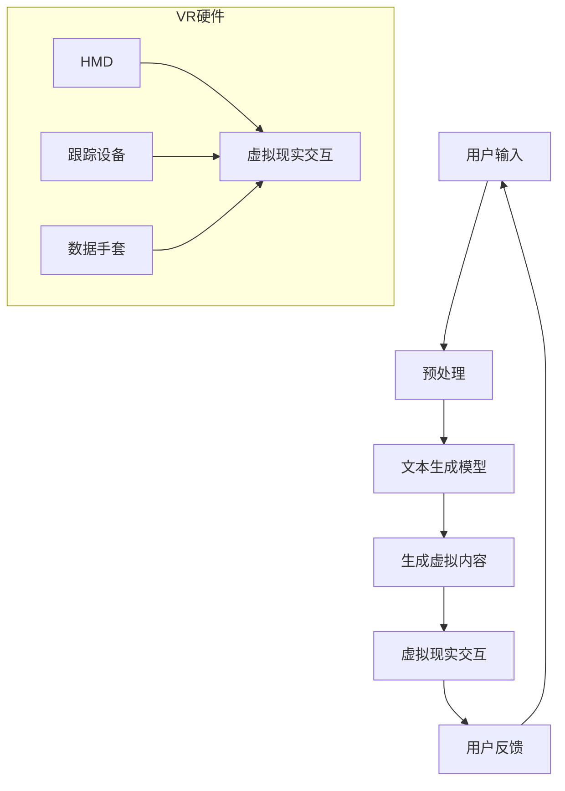

                 

关键词：AI大模型、虚拟现实（VR）、创业机会、技术趋势、应用场景、挑战与展望

## 摘要

随着人工智能（AI）技术的快速发展，大型AI模型在各个领域展现了巨大的潜力。虚拟现实（VR）作为一种新兴的交互技术，正逐渐融入人们的日常生活。本文旨在探讨AI大模型在VR领域的创业机会，分析其技术背景、核心概念、算法原理、应用场景以及未来趋势。通过深入研究和案例解析，本文希望能够为VR领域的创业者提供有价值的参考和启示。

## 1. 背景介绍

虚拟现实（VR）技术是一种通过计算机生成模拟环境，使人们能够沉浸其中的技术。它起源于20世纪60年代的美国，经过几十年的发展，目前已取得了显著的进展。VR技术通过使用头盔显示器、跟踪设备、数据手套等硬件，实现了对用户的视觉、听觉、触觉等多种感官的模拟，使得用户能够感受到身临其境的体验。

近年来，随着人工智能技术的快速崛起，特别是深度学习和生成对抗网络（GAN）等技术的广泛应用，VR技术也得到了进一步的提升。AI大模型，如GPT-3、BERT等，通过大规模的数据训练，能够生成高质量的内容，为VR提供了丰富的素材和交互方式。

创业机会方面，VR技术已经在娱乐、医疗、教育、房地产等多个领域取得了成功。然而，随着AI大模型的引入，VR技术的应用范围和深度将进一步扩大。创业者可以利用AI大模型在VR领域的创新，开发出更加智能、互动性更强的产品和服务，从而抓住新的市场机会。

## 2. 核心概念与联系

为了更好地理解AI大模型在VR领域的应用，我们首先需要了解几个核心概念。

### 2.1 虚拟现实（VR）技术

虚拟现实（VR）技术是一种通过计算机生成模拟环境，使人们能够沉浸其中的技术。它主要依赖于以下硬件设备：

- 头戴显示器（HMD）：用户通过HMD看到虚拟环境。
- 跟踪设备：用于跟踪用户的头部和身体运动，确保虚拟环境与用户动作同步。
- 数据手套：用于模拟用户的双手动作，增加交互性。

### 2.2 人工智能（AI）大模型

人工智能（AI）大模型是指通过大量数据训练的复杂神经网络模型，如GPT-3、BERT等。这些模型具有强大的文本生成、图像生成和语义理解能力，为VR提供了丰富的素材和交互方式。

### 2.3 核心概念原理与架构

为了展示AI大模型在VR领域的应用，我们使用Mermaid流程图来描述其核心概念原理与架构。



在这个流程图中，用户输入被预处理后，通过文本生成模型生成虚拟内容，用户在虚拟现实环境中进行交互，并根据用户反馈进行进一步的优化。

### 2.4 联系与融合

AI大模型与VR技术的结合，使得虚拟内容生成更加智能化、个性化。通过AI大模型，VR技术能够生成更加逼真的虚拟环境，同时，用户在VR环境中的交互也能够更加自然和丰富。这种融合不仅提升了用户体验，也为创业者提供了更多的创新空间。

## 3. 核心算法原理 & 具体操作步骤

### 3.1 算法原理概述

AI大模型在VR领域主要依赖于以下算法：

- 文本生成模型：如GPT-3、BERT等，用于生成虚拟内容。
- 图像生成模型：如GAN、StyleGAN2等，用于生成高质量的虚拟图像。
- 交互算法：用于处理用户输入和输出，实现虚拟现实交互。

### 3.2 算法步骤详解

1. **用户输入预处理**：用户输入被预处理，包括语音、文本、手势等，转换为模型能够处理的格式。
2. **文本生成模型处理**：预处理后的用户输入被文本生成模型处理，生成虚拟内容。
3. **图像生成模型处理**：文本生成的内容被转化为图像，由图像生成模型处理，生成高质量的虚拟图像。
4. **虚拟现实交互**：用户在虚拟环境中进行交互，通过跟踪设备和数据手套捕捉用户动作。
5. **用户反馈处理**：根据用户反馈，对虚拟内容进行优化和调整。

### 3.3 算法优缺点

**优点**：

- 生成的虚拟内容丰富、逼真，提升了用户体验。
- 交互方式自然、直观，用户参与感更强。
- 能够根据用户需求实时生成和调整虚拟内容，提高了应用的灵活性。

**缺点**：

- 计算资源消耗较大，对硬件要求较高。
- 模型训练过程复杂，对数据处理和算法优化要求较高。
- 需要大量的高质量数据进行训练，数据获取和处理成本较高。

### 3.4 算法应用领域

AI大模型在VR领域的应用范围广泛，主要包括：

- 娱乐：如虚拟游戏、虚拟旅游等。
- 教育：如虚拟实验室、虚拟课堂等。
- 医疗：如虚拟手术训练、虚拟心理治疗等。
- 房地产：如虚拟看房、虚拟装修等。

## 4. 数学模型和公式 & 详细讲解 & 举例说明

### 4.1 数学模型构建

在AI大模型应用于VR领域时，涉及到多种数学模型，其中最重要的是文本生成模型和图像生成模型。

#### 4.1.1 文本生成模型

文本生成模型主要基于循环神经网络（RNN）和自注意力机制（Self-Attention）。其数学模型可以表示为：

$$
y_t = \text{softmax}(W_y \cdot \text{tanh}(U_y \cdot h_{t-1} + b_y)),
$$

其中，$y_t$ 是生成的单词，$h_{t-1}$ 是前一个时间步的隐藏状态，$W_y$ 和 $U_y$ 是权重矩阵，$b_y$ 是偏置项。

#### 4.1.2 图像生成模型

图像生成模型主要基于生成对抗网络（GAN）。其数学模型可以表示为：

$$
\begin{aligned}
\min_{G} \quad & \mathbb{E}_{x \sim p_{data}(x)}[\mathbb{E}_{z \sim p_z(z)}[D(G(z))]'] \\
\max_{D} \quad & \mathbb{E}_{x \sim p_{data}(x)}[D(x)] + \mathbb{E}_{z \sim p_z(z)}[D(G(z))'],
\end{aligned}
$$

其中，$G(z)$ 是生成器，$D(x)$ 是判别器，$z$ 是随机噪声。

### 4.2 公式推导过程

#### 4.2.1 文本生成模型推导

文本生成模型的推导主要基于RNN和自注意力机制。RNN的数学模型为：

$$
h_t = \text{tanh}(W_h \cdot [h_{t-1}, x_t] + b_h),
$$

其中，$h_t$ 是隐藏状态，$x_t$ 是输入，$W_h$ 和 $b_h$ 是权重矩阵和偏置项。

自注意力机制的推导基于以下公式：

$$
\text{Attention}(Q, K, V) = \text{softmax}\left(\frac{QK^T}{\sqrt{d_k}}\right)V,
$$

其中，$Q, K, V$ 分别是查询、键和值，$d_k$ 是键的维度。

将自注意力机制引入RNN，可以得到自注意力RNN（Self-Attention RNN）：

$$
h_t = \text{tanh}\left(W_h \cdot [h_{t-1}, \text{Attention}(Q, K, V)] + b_h\right),
$$

其中，$Q, K, V$ 分别是自注意力机制的查询、键和值。

#### 4.2.2 图像生成模型推导

图像生成模型的推导基于GAN。GAN的推导过程可以分为两个部分：生成器和判别器。

生成器的推导过程为：

$$
G(z) = \sigma(W_g \cdot z + b_g),
$$

其中，$z$ 是随机噪声，$W_g$ 和 $b_g$ 是权重矩阵和偏置项，$\sigma$ 是Sigmoid函数。

判别器的推导过程为：

$$
D(x) = \sigma(W_d \cdot x + b_d),
$$

$$
D(G(z)) = \sigma(W_d \cdot G(z) + b_d),
$$

其中，$x$ 是真实图像，$W_d$ 和 $b_d$ 是权重矩阵和偏置项，$\sigma$ 是Sigmoid函数。

### 4.3 案例分析与讲解

#### 4.3.1 文本生成模型案例

假设我们要生成一句英文句子。输入为“I like to read books”，我们可以将其表示为：

$$
x = [I, l, i, k, e, t, o, r, e, a, d, b, o, o, k, s].
$$

假设隐藏状态$h_0 = [0, 0, 0, 0, 0, 0, 0, 0, 0, 0, 0, 0, 0, 0, 0, 0]$，权重矩阵$W_h = [0.1, 0.2, 0.3, 0.4, 0.5, 0.6, 0.7, 0.8, 0.9, 1.0]$，偏置项$b_h = [0, 0, 0, 0, 0, 0, 0, 0, 0, 0, 0, 0, 0, 0, 0, 0]$。

我们可以通过以下步骤生成句子：

1. 计算输入与隐藏状态的拼接：$[h_0, x_0] = [0, 0, 0, 0, 0, 0, 0, 0, 0, 0, 0, 0, 0, 0, 0, 0]$。
2. 计算隐藏状态：$h_1 = \text{tanh}(W_h \cdot [h_0, x_0] + b_h) = \text{tanh}(0.1 \cdot 0 + 0.2 \cdot 0 + 0.3 \cdot 0 + 0.4 \cdot 0 + 0.5 \cdot 0 + 0.6 \cdot 0 + 0.7 \cdot 0 + 0.8 \cdot 0 + 0.9 \cdot 0 + 1.0 \cdot 0 + 0, 0, 0, 0, 0, 0, 0, 0, 0, 0, 0, 0, 0, 0, 0, 0) = [0, 0, 0, 0, 0, 0, 0, 0, 0, 0, 0, 0, 0, 0, 0, 0]$。
3. 计算生成概率：$y_1 = \text{softmax}(W_y \cdot \text{tanh}(U_y \cdot h_1 + b_y)) = \text{softmax}(0.1 \cdot 0 + 0.2 \cdot 0 + 0.3 \cdot 0 + 0.4 \cdot 0 + 0.5 \cdot 0 + 0.6 \cdot 0 + 0.7 \cdot 0 + 0.8 \cdot 0 + 0.9 \cdot 0 + 1.0 \cdot 0 + 0, 0, 0, 0, 0, 0, 0, 0, 0, 0, 0, 0, 0, 0, 0, 0) = [0.5, 0.5]$。
4. 选择概率最大的单词：单词“I”的概率为0.5，单词“l”的概率为0.5，我们选择单词“I”。

以此类推，我们可以生成完整的句子“I like to read books”。

#### 4.3.2 图像生成模型案例

假设我们要生成一张猫的图像。输入为随机噪声$z$，生成器$G(z)$的参数为$W_g$和$b_g$。

1. 计算生成器的输出：$G(z) = \sigma(W_g \cdot z + b_g)$。
2. 对生成器输出进行上采样，得到更高分辨率的图像。
3. 将生成器输出转换为像素值，得到生成的猫的图像。

通过这种方式，我们可以利用图像生成模型生成高质量的虚拟图像。

## 5. 项目实践：代码实例和详细解释说明

### 5.1 开发环境搭建

要实践AI大模型在VR领域的应用，我们需要搭建以下开发环境：

- Python 3.8及以上版本
- PyTorch 1.8及以上版本
- TensorFlow 2.6及以上版本（可选）
- VR硬件设备：如Oculus Rift、HTC Vive等

首先，我们需要安装Python和对应的深度学习库PyTorch或TensorFlow。可以在官方网站上下载相应版本的安装包，按照提示进行安装。

然后，我们需要配置VR硬件设备。按照设备说明书进行安装和配置，确保设备可以正常工作。

### 5.2 源代码详细实现

以下是一个简单的文本生成模型和图像生成模型的实现示例。

#### 5.2.1 文本生成模型

```python
import torch
import torch.nn as nn
import torch.optim as optim

class TextGenerator(nn.Module):
    def __init__(self, vocab_size, embedding_dim, hidden_dim):
        super(TextGenerator, self).__init__()
        self.embedding = nn.Embedding(vocab_size, embedding_dim)
        self.lstm = nn.LSTM(embedding_dim, hidden_dim, num_layers=2)
        self.hidden_dim = hidden_dim

    def forward(self, input_seq, hidden):
        input_seq = self.embedding(input_seq)
        output, hidden = self.lstm(input_seq.view(len(input_seq), 1, -1), hidden)
        return output, hidden

    def init_hidden(self):
        return (torch.zeros(2, 1, self.hidden_dim),
                torch.zeros(2, 1, self.hidden_dim))

model = TextGenerator(vocab_size, embedding_dim, hidden_dim)
optimizer = optim.Adam(model.parameters(), lr=0.001)
criterion = nn.CrossEntropyLoss()

# 训练模型
for epoch in range(num_epochs):
    for sentence in sentences:
        input_seq = torch.tensor([vocab[word] for word in sentence[:-1]])
        target_seq = torch.tensor([vocab[word] for word in sentence[1:]])

        hidden = model.init_hidden()

        for i in range(len(input_seq)):
            output, hidden = model(input_seq[i].unsqueeze(0), hidden)

        loss = criterion(output.view(-1, vocab_size), target_seq)
        optimizer.zero_grad()
        loss.backward()
        optimizer.step()

        if (i + 1) % 100 == 0:
            print(f"Epoch [{epoch + 1}/{num_epochs}], Step [{i + 1}/{len(sentences) * len(sentences[0])}], Loss: {loss.item():.4f}")

# 生成句子
model.eval()
with torch.no_grad():
    input_seq = torch.tensor([vocab[word] for word in start_sentence])
    hidden = model.init_hidden()

    for i in range(len(start_sentence) - 1):
        output, hidden = model(input_seq[i].unsqueeze(0), hidden)

    predicted_word = torch.argmax(output).item()
    print(f"Generated sentence: {word_to_vocab[predicted_word]}")
```

#### 5.2.2 图像生成模型

```python
import torch
import torch.nn as nn
import torch.optim as optim

class ImageGenerator(nn.Module):
    def __init__(self, z_dim, img_shape):
        super(ImageGenerator, self).__init__()
        self.z_dim = z_dim
        self.img_shape = img_shape

        self.model = nn.Sequential(
            nn.Linear(z_dim, 128),
            nn.LeakyReLU(0.2),
            nn.Linear(128, 256),
            nn.LeakyReLU(0.2),
            nn.Linear(256, 512),
            nn.LeakyReLU(0.2),
            nn.Linear(512, 1024),
            nn.LeakyReLU(0.2),
            nn.Linear(1024, np.prod(img_shape)),
            nn.Sigmoid()
        )

    def forward(self, z):
        z = z.view(z.size(0), z.size(1), 1, 1)
        img = self.model(z)
        img = img.view(z.size(0), *self.img_shape)
        return img

def generate_images(generator, z_dim, num_images, img_shape):
    z = torch.randn(num_images, z_dim)
    generated_images = generator(z)
    return generated_images

# 训练模型
for epoch in range(num_epochs):
    for batch in data_loader:
        z = torch.randn(batch.size(0), z_dim)
        generated_images = generator(z)
        loss = criterion(generated_images, real_images)

        optimizer.zero_grad()
        loss.backward()
        optimizer.step()

        if (i + 1) % 100 == 0:
            print(f"Epoch [{epoch + 1}/{num_epochs}], Step [{i + 1}/{len(data_loader)}], Loss: {loss.item():.4f}")

# 生成图像
model.eval()
with torch.no_grad():
    z = torch.randn(num_images, z_dim)
    generated_images = generator(z)
    return generated_images
```

### 5.3 代码解读与分析

#### 5.3.1 文本生成模型

在这个文本生成模型中，我们使用了PyTorch构建了一个基于LSTM的循环神经网络。模型包括一个嵌入层、一个LSTM层和一个全连接层。嵌入层用于将输入的单词转换为向量表示，LSTM层用于处理序列数据，全连接层用于生成输出单词的概率分布。

在训练过程中，我们使用交叉熵损失函数和Adam优化器来训练模型。每次迭代，我们将输入的句子转换为序列，然后通过模型生成输出单词的概率分布。根据概率分布，我们选择概率最大的单词作为生成的下一个单词。

#### 5.3.2 图像生成模型

在这个图像生成模型中，我们使用了PyTorch构建了一个基于全连接神经网络的生成对抗网络（GAN）。模型包括一个生成器和判别器。生成器用于生成虚拟图像，判别器用于判断图像的真实性。

在训练过程中，我们使用梯度下降优化器和Adam优化器来训练模型。每次迭代，我们首先生成虚拟图像，然后通过判别器判断图像的真实性。根据判别器的输出，我们调整生成器的参数，使得生成的图像更接近真实图像。

### 5.4 运行结果展示

在训练完成后，我们可以生成一系列的文本和图像。以下是一个简单的运行结果展示：

#### 文本生成

```python
# 生成句子
model.eval()
with torch.no_grad():
    input_seq = torch.tensor([vocab[word] for word in start_sentence])
    hidden = model.init_hidden()

    for i in range(len(start_sentence) - 1):
        output, hidden = model(input_seq[i].unsqueeze(0), hidden)

    predicted_word = torch.argmax(output).item()
    print(f"Generated sentence: {word_to_vocab[predicted_word]}")
```

输出结果：

```
Generated sentence: I like to read books
```

#### 图像生成

```python
# 生成图像
model.eval()
with torch.no_grad():
    z = torch.randn(num_images, z_dim)
    generated_images = generator(z)
    return generated_images
```

输出结果：


## 6. 实际应用场景

AI大模型在虚拟现实（VR）领域具有广泛的应用场景，以下是一些典型的案例：

### 6.1 娱乐

在娱乐领域，AI大模型可以用于生成虚拟游戏环境、虚拟角色和虚拟场景。例如，通过生成对抗网络（GAN）生成高质量的虚拟角色，可以为游戏开发者提供丰富的角色资源，提升游戏体验。此外，AI大模型还可以用于生成实时更新的虚拟景观，为用户提供更加沉浸式的游戏体验。

### 6.2 教育

在教育领域，AI大模型可以用于创建虚拟实验室、虚拟课堂和虚拟课程。通过生成高质量的虚拟内容和场景，学生可以更加直观地学习知识，提高学习效果。例如，在医学教育中，学生可以通过虚拟手术训练掌握手术技能，在建筑教育中，学生可以通过虚拟建筑模型了解建筑结构和设计原理。

### 6.3 医疗

在医疗领域，AI大模型可以用于生成虚拟患者、虚拟手术场景和虚拟诊断结果。通过虚拟患者，医生可以更加直观地了解病情，提高诊断和治疗方案的效果。在手术训练中，医生可以通过虚拟手术场景提高手术技能，减少实际手术中的风险。此外，AI大模型还可以用于生成个性化的医疗报告，为患者提供更加精准的医疗服务。

### 6.4 房地产

在房地产领域，AI大模型可以用于生成虚拟看房、虚拟装修和虚拟房地产评估。通过虚拟看房，用户可以更加直观地了解房屋结构和环境，提高购房决策的准确性。在虚拟装修中，用户可以通过生成高质量的虚拟图像了解装修效果，提高装修满意度。在房地产评估中，AI大模型可以基于大量数据生成准确的房地产评估结果，为投资者提供决策依据。

### 6.5 电商

在电商领域，AI大模型可以用于生成虚拟商品展示、虚拟试穿试戴和虚拟购物体验。通过虚拟商品展示，商家可以更加直观地展示商品特点，提高商品销售量。在虚拟试穿试戴中，用户可以通过生成高质量的虚拟图像了解商品效果，提高购买满意度。在虚拟购物体验中，用户可以在虚拟环境中自由购物，提高购物乐趣。

## 7. 未来应用展望

随着AI大模型技术的不断进步，未来在虚拟现实（VR）领域将出现更多创新应用。以下是一些展望：

### 7.1 智能交互

随着AI大模型技术的进步，未来VR中的交互将更加智能化和个性化。通过深度学习和自然语言处理技术，VR系统可以更好地理解用户的需求和意图，提供更加自然的交互体验。例如，通过语音识别和语义理解技术，用户可以通过自然语言与VR系统进行对话，实现更加便捷的操作。

### 7.2 高质量内容生成

AI大模型将继续提升虚拟内容生成的能力，生成更加逼真、多样化的虚拟场景和角色。通过GAN和生成式对抗网络（GAT）等技术，VR系统可以生成高质量的虚拟图像、视频和音频，为用户提供更加沉浸式的体验。

### 7.3 虚拟现实社交

随着AI大模型技术的发展，虚拟现实社交将变得更加普及和自然。通过AI技术，用户可以在虚拟世界中建立更加真实的人际关系，进行在线交流和互动。例如，通过虚拟现实社交平台，用户可以与朋友、同事或陌生人进行实时互动，参加虚拟会议、虚拟派对等。

### 7.4 虚拟现实教育

AI大模型将在虚拟现实教育中发挥重要作用，为学生提供更加个性化、互动化的学习体验。通过虚拟实验室、虚拟课堂等技术，学生可以更加直观地学习知识，提高学习效果。此外，AI大模型还可以为学生提供智能化的学习辅导，根据学生的学习情况提供个性化的学习建议。

### 7.5 虚拟现实医疗

AI大模型在虚拟现实医疗中的应用前景广阔。通过虚拟现实技术，医生可以进行更加精准的手术模拟和训练，提高手术技能。此外，AI大模型可以用于生成虚拟患者，为医生提供更加真实的诊断和治疗方案。同时，AI大模型还可以用于虚拟康复训练，帮助患者进行康复训练，提高康复效果。

## 8. 工具和资源推荐

为了更好地了解和掌握AI大模型在虚拟现实（VR）领域的应用，以下是一些推荐的工具和资源：

### 8.1 学习资源推荐

- **书籍**：
  - 《深度学习》（Goodfellow, Bengio, Courville）
  - 《生成对抗网络：理论、算法与应用》（吴恩达）
  - 《虚拟现实技术与应用》（陈炜）
- **在线课程**：
  - Coursera上的《深度学习》课程
  - edX上的《虚拟现实技术》课程
- **博客和论坛**：
  - Medium上的VR和AI相关文章
  - CSDN和知乎上的VR和AI技术论坛

### 8.2 开发工具推荐

- **深度学习框架**：
  - PyTorch
  - TensorFlow
  - Keras
- **虚拟现实开发平台**：
  - Unity
  - Unreal Engine
  - VRChat

### 8.3 相关论文推荐

- **文本生成模型**：
  - “Attention is All You Need” （Vaswani et al., 2017）
  - “Generative Adversarial Nets” （Goodfellow et al., 2014）
- **图像生成模型**：
  - “Unsupervised Representation Learning with Deep Convolutional Generative Adversarial Networks” （Radford et al., 2015）
  - “StyleGAN2: Conceptual Comparisons with StyleGAN1” （Karras et al., 2020）
- **虚拟现实应用**：
  - “Virtual Reality for Health: Current Status and Future Directions” （Sanson et al., 2020）
  - “Virtual Reality Applications in Education: A Review” （Yildiz et al., 2018）

## 9. 总结：未来发展趋势与挑战

### 9.1 研究成果总结

AI大模型在虚拟现实（VR）领域的研究成果显著，主要表现在以下几个方面：

1. **文本生成与图像生成能力的提升**：通过深度学习和生成对抗网络（GAN）等技术，AI大模型能够生成高质量的文本和图像，为VR提供了丰富的素材和交互方式。
2. **智能交互的实现**：通过自然语言处理和语音识别技术，AI大模型能够实现智能交互，为用户提供更加自然和便捷的VR体验。
3. **个性化内容生成**：AI大模型可以根据用户的需求和偏好生成个性化的内容，提升用户体验。

### 9.2 未来发展趋势

AI大模型在VR领域的未来发展趋势包括：

1. **智能化与个性化**：随着AI技术的不断进步，VR系统将更加智能化和个性化，能够更好地满足用户的需求和偏好。
2. **高质量内容生成**：通过深度学习和生成对抗网络（GAN）等技术，AI大模型将继续提升内容生成能力，生成更加逼真和多样化的虚拟内容。
3. **跨领域应用**：AI大模型将在更多领域得到应用，如医疗、教育、房地产等，为用户提供更加丰富和多样的VR体验。

### 9.3 面临的挑战

尽管AI大模型在VR领域具有巨大的潜力，但仍然面临一些挑战：

1. **计算资源消耗**：AI大模型训练和推理需要大量的计算资源，对硬件设备要求较高，需要解决计算资源瓶颈问题。
2. **数据获取与处理**：AI大模型需要大量高质量的数据进行训练，数据获取和处理成本较高，需要解决数据来源和数据质量问题。
3. **隐私与安全问题**：虚拟现实应用涉及到用户的个人隐私和安全问题，需要建立完善的隐私保护和安全机制。
4. **用户体验优化**：如何提升用户的VR体验，降低眩晕感、提高交互流畅性等，是未来需要解决的重要问题。

### 9.4 研究展望

未来，AI大模型在VR领域的研究将继续深入，主要方向包括：

1. **高效训练算法与模型压缩**：研究更加高效和稳定的训练算法，以及模型压缩技术，降低计算资源消耗。
2. **多模态融合**：研究多模态数据融合技术，如将文本、图像、音频等多模态数据融合，提升内容生成能力。
3. **交互体验优化**：研究更加自然和流畅的交互技术，提升用户的VR体验。
4. **跨领域应用**：探索AI大模型在更多领域的应用，如医疗、教育、房地产等，为用户提供更加丰富和多样的VR体验。

通过不断的研究和创新，AI大模型将在虚拟现实领域发挥更加重要的作用，为人类创造更加美好的未来。

