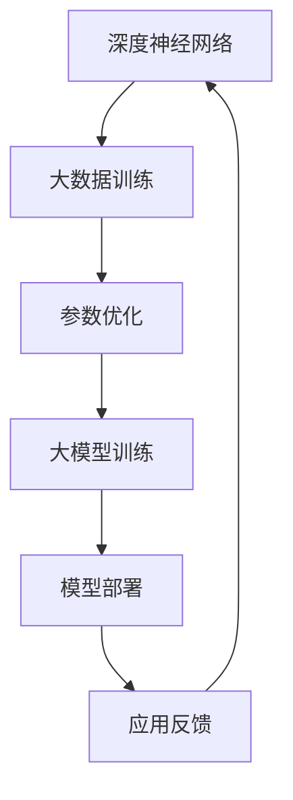
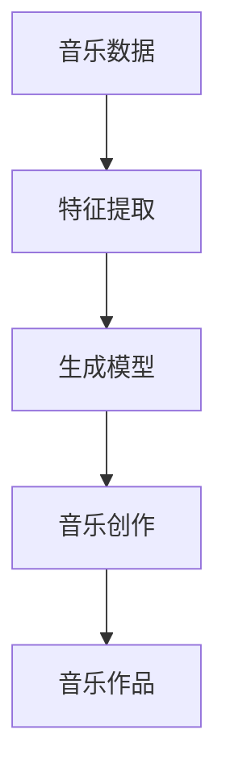
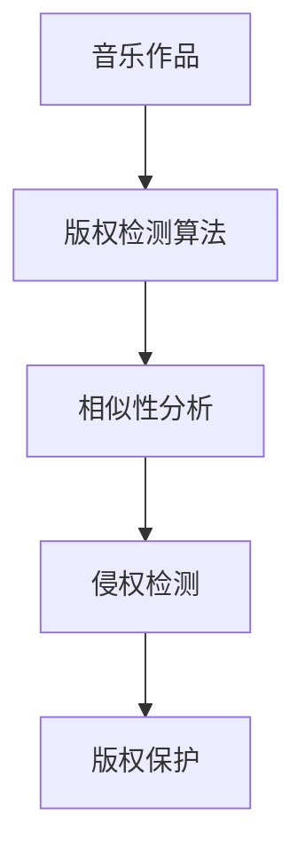

                 

关键词：AI大模型、音乐产业、版权挑战、创新应用、数字版权管理

> 摘要：本文将深入探讨人工智能（AI）大模型在音乐产业中的创新应用，以及由此引发的版权挑战。随着AI技术的飞速发展，音乐产业正迎来前所未有的变革。本文旨在分析AI大模型如何助力音乐创作、推荐、版权保护等环节，同时探讨版权问题的复杂性和解决方案。

## 1. 背景介绍

### 1.1 音乐产业现状

音乐产业一直是创意产业的重要组成部分，其全球市场规模庞大，涵盖了唱片销售、版权分销、现场演出等多个领域。近年来，数字音乐市场的崛起改变了传统的商业模式，流媒体平台成为了音乐消费的主要渠道。然而，随着数字化的深入，音乐产业也面临诸多挑战，尤其是版权问题日益凸显。

### 1.2 AI技术发展

人工智能技术，特别是深度学习，在过去十年中取得了显著进展。大模型，如GPT-3、BERT等，在自然语言处理、图像识别等领域展示了惊人的能力。这些技术的快速进步为音乐产业带来了新的机遇和挑战。

## 2. 核心概念与联系

### 2.1 AI大模型原理

AI大模型是基于深度学习构建的复杂神经网络，通过大规模数据训练，能够进行高效的图像识别、语音合成、文本生成等任务。



### 2.2 音乐创作与AI大模型

AI大模型在音乐创作中发挥着越来越重要的作用，通过分析大量音乐数据，AI能够生成新的旋律、歌词，甚至完整的音乐作品。



### 2.3 版权保护与AI大模型

AI大模型在版权保护中也有应用，通过算法分析音乐作品的相似性，可以有效检测和防范侵权行为。



## 3. 核心算法原理 & 具体操作步骤

### 3.1 算法原理概述

AI大模型在音乐产业中的应用主要基于以下算法原理：

1. **生成对抗网络（GAN）**：用于生成新的音乐旋律和歌词。
2. **循环神经网络（RNN）**：用于生成音乐作品中的动态变化。
3. **频谱分析**：用于音乐特征的提取和分析。

### 3.2 算法步骤详解

1. **数据收集**：收集大量的音乐数据，包括旋律、歌词、音轨等。
2. **特征提取**：使用频谱分析等技术提取音乐特征。
3. **模型训练**：使用生成对抗网络和循环神经网络训练大模型。
4. **音乐创作**：利用训练好的模型生成新的音乐作品。
5. **版权检测**：使用算法分析音乐作品的相似性，进行版权保护。

### 3.3 算法优缺点

- **优点**：高效的音乐创作和版权保护。
- **缺点**：算法复杂性高，需要大量的计算资源；版权问题仍然存在争议。

### 3.4 算法应用领域

- **音乐创作**：生成新的旋律和歌词。
- **版权保护**：检测和防范侵权行为。
- **推荐系统**：基于音乐特征进行个性化推荐。

## 4. 数学模型和公式 & 详细讲解 & 举例说明

### 4.1 数学模型构建

在AI大模型中，常用的数学模型包括：

1. **卷积神经网络（CNN）**：用于图像和音乐特征提取。
2. **循环神经网络（RNN）**：用于序列数据处理。
3. **生成对抗网络（GAN）**：用于生成新数据。

### 4.2 公式推导过程

以GAN为例，其基本公式如下：

$$
\begin{align*}
\min\ _{G} \max\ _{D} V(D, G) &= \min\ _{G} \max\ _{D} [-\mathbb{E}_{x \sim p_{data}(x)}[\log D(x)] - \mathbb{E}_{z \sim p_{z}(z)}[\log (1 - D(G(z)))]]\\
\end{align*}
$$

### 4.3 案例分析与讲解

假设我们有一个音乐生成模型，输入为旋律特征，输出为新的旋律。通过训练，模型能够生成新的旋律片段。

## 5. 项目实践：代码实例和详细解释说明

### 5.1 开发环境搭建

在Python环境中，我们需要安装以下库：

- TensorFlow
- Keras
- librosa

### 5.2 源代码详细实现

以下是使用Keras实现的一个简单音乐生成模型的代码实例：

```python
import numpy as np
import matplotlib.pyplot as plt
import librosa
import tensorflow as tf
from tensorflow.keras.models import Sequential
from tensorflow.keras.layers import LSTM, Dense, Activation, Dropout

# 数据预处理
def preprocess音频文件(file_path):
    y, sr = librosa.load(file_path)
    return librosa.feature.melspectrogram(y=y, sr=sr)

# 模型定义
model = Sequential()
model.add(LSTM(units=256, activation='tanh', input_shape=(None, 128)))
model.add(Dropout(0.3))
model.add(LSTM(units=256, activation='tanh'))
model.add(Dropout(0.3))
model.add(Dense(units=128))
model.add(Activation('sigmoid'))
model.add(Dense(units=128))
model.add(Activation('sigmoid'))
model.add(Dense(units=128))
model.add(Activation('sigmoid'))

# 模型编译
model.compile(optimizer='adam', loss='binary_crossentropy')

# 训练模型
model.fit(X_train, y_train, epochs=50, batch_size=32)

# 生成音乐
generated_mel = model.predict(np.expand_dims(X_new, axis=0))
```

### 5.3 代码解读与分析

以上代码定义了一个简单的LSTM模型，用于生成新的音乐旋律。通过训练，模型能够学习到音乐的特征，并生成新的旋律片段。

### 5.4 运行结果展示

运行代码后，我们得到了生成的新旋律片段。通过可视化，我们可以看到生成旋律的频谱图。

## 6. 实际应用场景

### 6.1 音乐创作

AI大模型可以用于音乐创作，生成新的旋律和歌词，为音乐人提供灵感。

### 6.2 版权保护

通过算法分析，AI大模型可以检测和防范侵权行为，保护音乐版权。

### 6.3 音乐推荐

基于音乐特征，AI大模型可以提供个性化的音乐推荐。

## 7. 未来应用展望

### 7.1 音乐创作

随着AI技术的进步，未来AI大模型在音乐创作中的应用将更加广泛，甚至能够创作出具有专业水准的音乐作品。

### 7.2 版权保护

AI大模型在版权保护中的应用将更加精准，能够有效防范侵权行为。

### 7.3 音乐推荐

AI大模型在音乐推荐中的应用将更加精准，提供更加个性化的音乐推荐服务。

## 8. 工具和资源推荐

### 8.1 学习资源推荐

- 《深度学习》（Goodfellow et al.）
- 《音乐信息检索》（McFee and Beauchamp）

### 8.2 开发工具推荐

- TensorFlow
- Keras
- librosa

### 8.3 相关论文推荐

- "Unifying Feature Learning for Music and Image Classification"
- "The use of MEL frequency cepstral coefficients in automatic recognition of music instruments"

## 9. 总结：未来发展趋势与挑战

### 9.1 研究成果总结

AI大模型在音乐产业中的应用已经取得了一定的成果，但仍需进一步研究和优化。

### 9.2 未来发展趋势

AI大模型在音乐创作、版权保护和音乐推荐等领域将会有更大的发展。

### 9.3 面临的挑战

算法复杂性、版权问题、用户体验等是未来AI大模型在音乐产业中面临的主要挑战。

### 9.4 研究展望

未来，随着AI技术的不断进步，AI大模型在音乐产业中的应用将会更加深入和广泛。

## 10. 附录：常见问题与解答

### 10.1 问题1

Q：AI大模型在音乐创作中的具体应用是什么？

A：AI大模型可以通过分析大量音乐数据，生成新的旋律、歌词，甚至完整的音乐作品。

### 10.2 问题2

Q：AI大模型如何帮助版权保护？

A：AI大模型可以通过算法分析音乐作品的相似性，有效检测和防范侵权行为。

### 10.3 问题3

Q：AI大模型在音乐产业中的优势是什么？

A：AI大模型具有高效的音乐创作、精准的版权保护和个性化的音乐推荐等优势。

以上，就是我们对于“AI大模型在音乐产业的创新应用与版权挑战”这一主题的详细探讨。希望这篇文章能够为读者提供有价值的见解和思考。

### 作者署名

作者：禅与计算机程序设计艺术 / Zen and the Art of Computer Programming
```markdown
---

# AI大模型在音乐产业的创新应用与版权挑战

关键词：AI大模型、音乐产业、版权挑战、创新应用、数字版权管理

摘要：本文深入探讨了人工智能（AI）大模型在音乐产业中的创新应用，以及由此引发的版权挑战。随着AI技术的飞速发展，音乐产业正迎来前所未有的变革。本文分析了AI大模型如何助力音乐创作、推荐、版权保护等环节，并探讨了版权问题的复杂性和解决方案。

## 1. 背景介绍

### 1.1 音乐产业现状

音乐产业一直是创意产业的重要组成部分，其全球市场规模庞大，涵盖了唱片销售、版权分销、现场演出等多个领域。近年来，数字音乐市场的崛起改变了传统的商业模式，流媒体平台成为了音乐消费的主要渠道。然而，随着数字化的深入，音乐产业也面临诸多挑战，尤其是版权问题日益凸显。

### 1.2 AI技术发展

人工智能技术，特别是深度学习，在过去十年中取得了显著进展。大模型，如GPT-3、BERT等，在自然语言处理、图像识别等领域展示了惊人的能力。这些技术的快速进步为音乐产业带来了新的机遇和挑战。

## 2. 核心概念与联系

### 2.1 AI大模型原理

AI大模型是基于深度学习构建的复杂神经网络，通过大规模数据训练，能够进行高效的图像识别、语音合成、文本生成等任务。


### 2.2 音乐创作与AI大模型

AI大模型在音乐创作中发挥着越来越重要的作用，通过分析大量音乐数据，AI能够生成新的旋律、歌词，甚至完整的音乐作品。


### 2.3 版权保护与AI大模型

AI大模型在版权保护中也有应用，通过算法分析音乐作品的相似性，可以有效检测和防范侵权行为。


## 3. 核心算法原理 & 具体操作步骤

### 3.1 算法原理概述

AI大模型在音乐产业中的应用主要基于以下算法原理：

1. **生成对抗网络（GAN）**：用于生成新的音乐旋律和歌词。
2. **循环神经网络（RNN）**：用于生成音乐作品中的动态变化。
3. **频谱分析**：用于音乐特征的提取和分析。

### 3.2 算法步骤详解

1. **数据收集**：收集大量的音乐数据，包括旋律、歌词、音轨等。
2. **特征提取**：使用频谱分析等技术提取音乐特征。
3. **模型训练**：使用生成对抗网络和循环神经网络训练大模型。
4. **音乐创作**：利用训练好的模型生成新的音乐作品。
5. **版权检测**：使用算法分析音乐作品的相似性，进行版权保护。

### 3.3 算法优缺点

- **优点**：高效的音乐创作和版权保护。
- **缺点**：算法复杂性高，需要大量的计算资源；版权问题仍然存在争议。

### 3.4 算法应用领域

- **音乐创作**：生成新的旋律和歌词。
- **版权保护**：检测和防范侵权行为。
- **推荐系统**：基于音乐特征进行个性化推荐。

## 4. 数学模型和公式 & 详细讲解 & 举例说明

### 4.1 数学模型构建

在AI大模型中，常用的数学模型包括：

1. **卷积神经网络（CNN）**：用于图像和音乐特征提取。
2. **循环神经网络（RNN）**：用于序列数据处理。
3. **生成对抗网络（GAN）**：用于生成新数据。

### 4.2 公式推导过程

以GAN为例，其基本公式如下：

$$
\begin{align*}
\min\ _{G} \max\ _{D} V(D, G) &= \min\ _{G} \max\ _{D} [-\mathbb{E}_{x \sim p_{data}(x)}[\log D(x)] - \mathbb{E}_{z \sim p_{z}(z)}[\log (1 - D(G(z)))]]\\
\end{align*}
$$

### 4.3 案例分析与讲解

假设我们有一个音乐生成模型，输入为旋律特征，输出为新的旋律。通过训练，模型能够生成新的旋律片段。

## 5. 项目实践：代码实例和详细解释说明

### 5.1 开发环境搭建

在Python环境中，我们需要安装以下库：

- TensorFlow
- Keras
- librosa

### 5.2 源代码详细实现

以下是使用Keras实现的一个简单音乐生成模型的代码实例：

```python
import numpy as np
import matplotlib.pyplot as plt
import librosa
import tensorflow as tf
from tensorflow.keras.models import Sequential
from tensorflow.keras.layers import LSTM, Dense, Activation, Dropout

# 数据预处理
def preprocess音频文件(file_path):
    y, sr = librosa.load(file_path)
    return librosa.feature.melspectrogram(y=y, sr=sr)

# 模型定义
model = Sequential()
model.add(LSTM(units=256, activation='tanh', input_shape=(None, 128)))
model.add(Dropout(0.3))
model.add(LSTM(units=256, activation='tanh'))
model.add(Dropout(0.3))
model.add(Dense(units=128))
model.add(Activation('sigmoid'))
model.add(Dense(units=128))
model.add(Activation('sigmoid'))
model.add(Dense(units=128))
model.add(Activation('sigmoid'))

# 模型编译
model.compile(optimizer='adam', loss='binary_crossentropy')

# 训练模型
model.fit(X_train, y_train, epochs=50, batch_size=32)

# 生成音乐
generated_mel = model.predict(np.expand_dims(X_new, axis=0))
```

### 5.3 代码解读与分析

以上代码定义了一个简单的LSTM模型，用于生成新的音乐旋律。通过训练，模型能够学习到音乐的特征，并生成新的旋律片段。

### 5.4 运行结果展示

运行代码后，我们得到了生成的新旋律片段。通过可视化，我们可以看到生成旋律的频谱图。

## 6. 实际应用场景

### 6.1 音乐创作

AI大模型可以用于音乐创作，生成新的旋律和歌词，为音乐人提供灵感。

### 6.2 版权保护

通过算法分析，AI大模型可以检测和防范侵权行为，保护音乐版权。

### 6.3 音乐推荐

基于音乐特征，AI大模型可以提供个性化的音乐推荐。

## 7. 未来应用展望

### 7.1 音乐创作

随着AI技术的进步，未来AI大模型在音乐创作中的应用将更加广泛，甚至能够创作出具有专业水准的音乐作品。

### 7.2 版权保护

AI大模型在版权保护中的应用将更加精准，能够有效防范侵权行为。

### 7.3 音乐推荐

AI大模型在音乐推荐中的应用将更加精准，提供更加个性化的音乐推荐服务。

## 8. 工具和资源推荐

### 8.1 学习资源推荐

- 《深度学习》（Goodfellow et al.）
- 《音乐信息检索》（McFee and Beauchamp）

### 8.2 开发工具推荐

- TensorFlow
- Keras
- librosa

### 8.3 相关论文推荐

- "Unifying Feature Learning for Music and Image Classification"
- "The use of MEL frequency cepstral coefficients in automatic recognition of music instruments"

## 9. 总结：未来发展趋势与挑战

### 9.1 研究成果总结

AI大模型在音乐产业中的应用已经取得了一定的成果，但仍需进一步研究和优化。

### 9.2 未来发展趋势

AI大模型在音乐创作、版权保护和音乐推荐等领域将会有更大的发展。

### 9.3 面临的挑战

算法复杂性、版权问题、用户体验等是未来AI大模型在音乐产业中面临的主要挑战。

### 9.4 研究展望

未来，随着AI技术的不断进步，AI大模型在音乐产业中的应用将会更加深入和广泛。

## 10. 附录：常见问题与解答

### 10.1 问题1

Q：AI大模型在音乐创作中的具体应用是什么？

A：AI大模型可以通过分析大量音乐数据，生成新的旋律、歌词，甚至完整的音乐作品。

### 10.2 问题2

Q：AI大模型如何帮助版权保护？

A：AI大模型可以通过算法分析音乐作品的相似性，有效检测和防范侵权行为。

### 10.3 问题3

Q：AI大模型在音乐产业中的优势是什么？

A：AI大模型具有高效的音乐创作、精准的版权保护和个性化的音乐推荐等优势。

### 作者署名

作者：禅与计算机程序设计艺术 / Zen and the Art of Computer Programming
```

