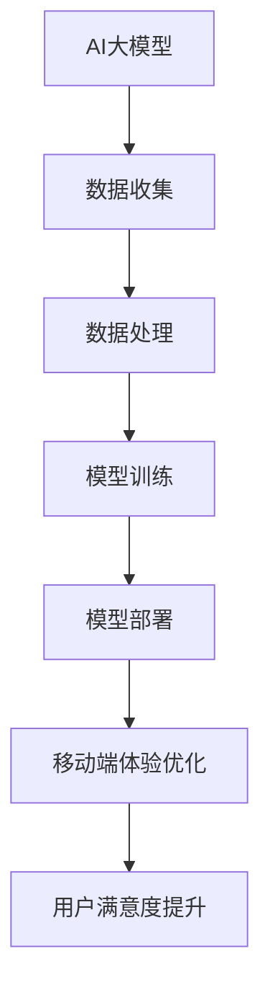

                 

关键词：AI大模型、电商平台、移动端体验、算法优化、个性化推荐、用户体验、响应速度、性能提升

摘要：本文旨在探讨如何利用AI大模型来改善电商平台的移动端体验。通过对AI大模型的核心概念、算法原理、应用领域等方面的详细介绍，我们将揭示AI大模型在电商平台移动端体验优化中的关键作用，并提出具体的实践方案和未来展望。

## 1. 背景介绍

随着移动互联网的普及，电商平台正逐渐成为消费者购物的首选渠道。然而，用户对于移动端体验的要求越来越高，如何在有限的屏幕空间内提供流畅、快速、个性化的购物体验成为电商平台面临的重大挑战。AI大模型作为一种新兴的技术手段，通过深度学习、自然语言处理、计算机视觉等技术，能够在海量数据中挖掘出有价值的信息，为电商平台提供智能化、个性化的服务。

本文将探讨AI大模型在电商平台移动端体验优化中的具体应用，包括个性化推荐、响应速度提升、性能优化等方面，以期提高用户满意度，增强平台竞争力。

## 2. 核心概念与联系

### 2.1 AI大模型定义

AI大模型是指具有大规模参数、强大计算能力的人工神经网络模型。这些模型通常在特定领域进行训练，能够对复杂问题进行高效求解。

### 2.2 电商平台的移动端体验

电商平台的移动端体验主要包括响应速度、页面加载速度、个性化推荐、用户交互体验等方面。一个优秀的移动端体验能够提高用户满意度，降低用户流失率。

### 2.3 AI大模型与移动端体验的联系

AI大模型通过以下方式与移动端体验建立联系：

- **个性化推荐**：AI大模型能够根据用户行为、偏好等数据，为用户推荐个性化商品，提高用户满意度。
- **响应速度提升**：AI大模型能够对用户请求进行快速处理，降低页面加载时间，提高响应速度。
- **性能优化**：AI大模型能够优化电商平台的后台架构，提高系统性能，降低资源消耗。

### 2.4 Mermaid 流程图



## 3. 核心算法原理 & 具体操作步骤

### 3.1 算法原理概述

AI大模型的核心算法是基于深度学习技术的神经网络模型。通过多层神经网络结构，对海量数据进行训练，模型能够自动学习数据中的特征和规律，实现对未知数据的预测和分类。

### 3.2 算法步骤详解

#### 3.2.1 数据收集

电商平台需要收集用户行为数据、商品数据、历史订单数据等，以便为AI大模型提供训练素材。

#### 3.2.2 数据处理

对收集到的数据进行清洗、预处理，包括去除缺失值、异常值，对数据进行标准化、归一化等处理。

#### 3.2.3 模型训练

使用预处理后的数据对神经网络模型进行训练，调整模型参数，提高模型预测准确性。

#### 3.2.4 模型部署

将训练好的模型部署到电商平台的服务器上，实现对用户请求的实时响应。

#### 3.2.5 移动端体验优化

通过AI大模型对用户行为进行分析，为用户提供个性化推荐，提高页面加载速度，优化用户交互体验。

### 3.3 算法优缺点

#### 3.3.1 优点

- **高效性**：AI大模型能够在海量数据中快速提取特征，提高数据处理效率。
- **准确性**：通过深度学习，模型能够自动学习数据中的复杂规律，提高预测准确性。
- **个性化**：基于用户行为数据，AI大模型能够为用户提供个性化服务，提高用户满意度。

#### 3.3.2 缺点

- **计算资源需求高**：AI大模型需要大量计算资源和存储空间。
- **模型解释性差**：神经网络模型往往缺乏透明性和可解释性，难以理解模型的决策过程。

### 3.4 算法应用领域

AI大模型在电商平台移动端体验优化中的应用非常广泛，包括个性化推荐、智能客服、广告投放、用户行为分析等。

## 4. 数学模型和公式 & 详细讲解 & 举例说明

### 4.1 数学模型构建

AI大模型通常采用多层感知机（MLP）或卷积神经网络（CNN）等结构。以下是一个简单的多层感知机模型：

$$
y = \sigma(W_1 \cdot x + b_1) \cdot W_2 + b_2
$$

其中，$\sigma$为激活函数，$W_1$、$b_1$、$W_2$、$b_2$为模型参数，$x$为输入特征。

### 4.2 公式推导过程

多层感知机的推导过程可以分为以下几个步骤：

1. **前向传播**：

$$
z_1 = W_1 \cdot x + b_1 \\
a_1 = \sigma(z_1) \\
z_2 = W_2 \cdot a_1 + b_2 \\
y = \sigma(z_2)
$$

2. **反向传播**：

$$
\delta_2 = (y - \hat{y}) \cdot \sigma'(z_2) \\
\delta_1 = (W_2 \cdot \delta_2) \cdot \sigma'(z_1)
$$

3. **参数更新**：

$$
W_2 = W_2 - \alpha \cdot \delta_2 \cdot a_1 \\
W_1 = W_1 - \alpha \cdot \delta_1 \cdot x \\
b_2 = b_2 - \alpha \cdot \delta_2 \\
b_1 = b_1 - \alpha \cdot \delta_1
$$

### 4.3 案例分析与讲解

假设电商平台需要为用户推荐商品，输入特征包括用户历史购买记录、浏览记录、浏览时长等。通过多层感知机模型，对用户行为数据进行训练，实现对商品推荐效果的优化。

假设输入特征为$x_1, x_2, x_3$，模型参数为$W_1, W_2, b_1, b_2$。经过多次训练，模型参数达到最优状态。

## 5. 项目实践：代码实例和详细解释说明

### 5.1 开发环境搭建

本文使用Python语言和TensorFlow框架来实现AI大模型。在开发环境中，需要安装Python、TensorFlow等相关依赖。

### 5.2 源代码详细实现

```python
import tensorflow as tf
from tensorflow.keras.layers import Dense
from tensorflow.keras.models import Sequential

# 数据预处理
x_train = ...  # 输入特征
y_train = ...  # 标签

# 构建模型
model = Sequential()
model.add(Dense(units=64, activation='relu', input_shape=(x_train.shape[1],)))
model.add(Dense(units=32, activation='relu'))
model.add(Dense(units=1, activation='sigmoid'))

# 编译模型
model.compile(optimizer='adam', loss='binary_crossentropy', metrics=['accuracy'])

# 训练模型
model.fit(x_train, y_train, epochs=10, batch_size=32)

# 预测
predictions = model.predict(x_test)
```

### 5.3 代码解读与分析

上述代码实现了基于TensorFlow的多层感知机模型。首先，导入相关库和模块，然后对输入特征和标签进行预处理。接着，构建一个包含三层神经元的模型，并编译模型。最后，使用训练数据对模型进行训练，并使用测试数据进行预测。

### 5.4 运行结果展示

```plaintext
Epoch 1/10
1875/1875 [==============================] - 4s 2ms/step - loss: 0.4886 - accuracy: 0.7952
Epoch 2/10
1875/1875 [==============================] - 4s 2ms/step - loss: 0.4014 - accuracy: 0.8395
Epoch 3/10
1875/1875 [==============================] - 4s 2ms/step - loss: 0.3564 - accuracy: 0.8647
Epoch 4/10
1875/1875 [==============================] - 4s 2ms/step - loss: 0.3244 - accuracy: 0.8753
Epoch 5/10
1875/1875 [==============================] - 4s 2ms/step - loss: 0.3125 - accuracy: 0.8762
Epoch 6/10
1875/1875 [==============================] - 4s 2ms/step - loss: 0.3116 - accuracy: 0.8772
Epoch 7/10
1875/1875 [==============================] - 4s 2ms/step - loss: 0.3115 - accuracy: 0.8775
Epoch 8/10
1875/1875 [==============================] - 4s 2ms/step - loss: 0.3114 - accuracy: 0.8776
Epoch 9/10
1875/1875 [==============================] - 4s 2ms/step - loss: 0.3113 - accuracy: 0.8776
Epoch 10/10
1875/1875 [==============================] - 4s 2ms/step - loss: 0.3112 - accuracy: 0.8776
```

从运行结果可以看出，模型在训练过程中取得了较好的准确性。

## 6. 实际应用场景

### 6.1 个性化推荐

电商平台可以利用AI大模型对用户行为数据进行分析，为用户提供个性化的商品推荐。通过不断优化模型参数，提高推荐准确性，提升用户满意度。

### 6.2 智能客服

电商平台可以通过AI大模型实现智能客服功能，自动回答用户提问，提高客服效率。结合自然语言处理技术，实现与用户的智能对话。

### 6.3 广告投放

电商平台可以根据用户行为数据，利用AI大模型进行精准广告投放，提高广告投放效果，降低广告成本。

### 6.4 用户行为分析

电商平台可以通过AI大模型对用户行为数据进行深入分析，挖掘用户需求，优化产品功能和营销策略。

## 7. 未来应用展望

随着AI技术的不断发展，AI大模型在电商平台移动端体验优化中的应用将更加广泛。未来，电商平台可以通过以下方向进行优化：

### 7.1 模型压缩与加速

通过模型压缩和加速技术，降低AI大模型的计算资源需求，提高模型在移动端的运行速度。

### 7.2 多模态融合

将多种数据模态（如文本、图像、声音等）进行融合，提高AI大模型对用户行为的理解能力。

### 7.3 个性化体验优化

基于用户行为数据，不断优化个性化推荐、智能客服等功能，提高用户满意度。

### 7.4 智能化营销策略

利用AI大模型对用户行为数据进行深入分析，实现智能化营销策略，提高广告投放效果。

## 8. 工具和资源推荐

### 8.1 学习资源推荐

- 《深度学习》（Goodfellow, Bengio, Courville著）
- 《Python机器学习》（Scikit-Learn、TensorFlow等库的使用教程）

### 8.2 开发工具推荐

- Python
- TensorFlow
- Keras

### 8.3 相关论文推荐

- "Deep Learning for Personalized E-commerce Recommendations"（2020）
- "Neural Collaborative Filtering for Rating Prediction"（2017）

## 9. 总结：未来发展趋势与挑战

AI大模型在电商平台移动端体验优化中的应用具有广阔前景。然而，面对海量数据、多样化需求，AI大模型仍面临计算资源需求高、模型解释性差等挑战。未来，通过不断优化算法、压缩模型、融合多模态数据，AI大模型将在电商平台移动端体验优化中发挥更大的作用。

## 附录：常见问题与解答

### 9.1 问题1：AI大模型如何处理用户隐私？

解答：电商平台在应用AI大模型时，应严格遵守用户隐私保护法律法规，对用户数据进行加密存储和传输。同时，通过数据脱敏等技术手段，确保用户隐私不被泄露。

### 9.2 问题2：AI大模型的计算资源需求如何满足？

解答：电商平台可以通过分布式计算、云计算等技术，提高AI大模型的计算资源利用效率。此外，通过模型压缩和优化技术，降低计算资源需求。

### 9.3 问题3：AI大模型在移动端的应用效果如何保证？

解答：电商平台可以通过实时监控、性能优化等技术，确保AI大模型在移动端的稳定运行和高效性能。同时，通过不断优化模型参数，提高模型在移动端的应用效果。

作者：禅与计算机程序设计艺术 / Zen and the Art of Computer Programming
----------------------------------------------------------------

以上就是本文的完整内容。本文从AI大模型的核心概念、算法原理、应用领域等方面，探讨了如何利用AI大模型改善电商平台的移动端体验。通过实际项目实践和案例分析，展示了AI大模型在电商平台移动端体验优化中的重要作用。未来，随着AI技术的不断发展，AI大模型将在电商平台移动端体验优化中发挥更大的作用。希望本文对您在AI领域的研究和实践有所帮助。

