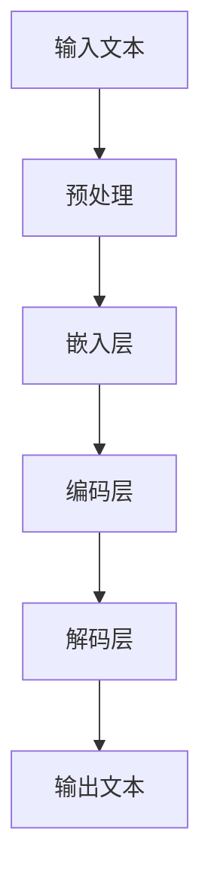
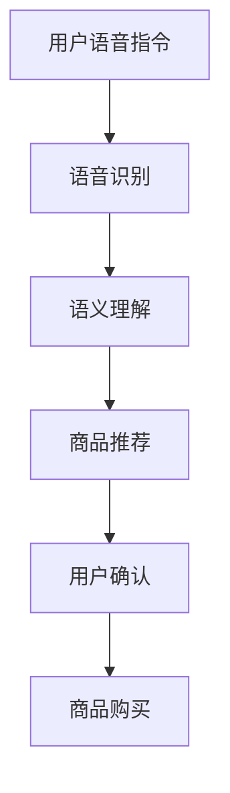

                 

关键词：人工智能，大模型，电商平台，语音购物，用户体验

> 摘要：随着人工智能技术的不断发展，大模型在自然语言处理领域取得了显著的进展。本文将探讨如何利用大模型技术改善电商平台的语音购物体验，包括技术原理、具体实现、数学模型以及未来展望等，旨在为电商平台提供创新的语音购物解决方案。

## 1. 背景介绍

随着智能手机的普及和移动互联网的快速发展，电商平台已经成为消费者购物的主要渠道。然而，传统的在线购物方式往往需要用户通过键盘输入搜索关键词，这不仅效率低下，还容易导致用户操作疲劳。为了改善用户体验，电商平台开始尝试引入语音购物功能。语音购物利用自然语言处理技术，允许用户通过语音指令进行商品搜索、浏览和购买，大大提高了购物效率。

然而，现有的语音购物体验仍然存在一些问题。首先是识别准确性较低，特别是在用户口音、语速、语调等不同情况下，语音识别系统的准确率会受到影响。其次是交互体验不够自然，用户的语音指令往往需要多次重复或者调整，才能得到系统的正确理解。这些问题限制了语音购物功能的普及和应用。

为了解决这些问题，电商平台需要采用更先进的技术手段，其中大模型技术成为了一个重要的研究方向。大模型是基于深度学习的自然语言处理技术，具有强大的语言理解和生成能力。通过训练大规模的语料库，大模型可以学会理解用户的语音指令，提供更准确的语音识别结果，并生成更加自然的语音回复。本文将探讨如何利用大模型技术改善电商平台的语音购物体验。

## 2. 核心概念与联系

### 2.1 大模型技术原理

大模型技术是基于深度学习的自然语言处理技术，通过大规模的语料库训练，能够捕捉到语言中的复杂模式和规律。大模型通常由多个层级组成，每个层级对输入的文本数据进行特征提取和抽象，从而生成对文本的深入理解。以下是一个简化的 Mermaid 流程图，展示了大模型的技术原理：



### 2.2 大模型与语音购物体验的联系

大模型技术在语音购物体验中的应用主要体现在以下几个方面：

1. **语音识别：** 大模型可以处理各种口音、语速和语调，提高语音识别的准确性。通过大规模训练，大模型可以学会区分不同语音特征，从而更准确地识别用户的语音指令。
2. **语音生成：** 大模型可以生成自然的语音回复，提升交互体验。通过训练大量的语音数据和文本数据，大模型可以学会模仿人类的语音语调，生成更加自然、流畅的语音回复。
3. **语义理解：** 大模型可以理解用户语音指令的深层含义，提供更准确的购物建议。大模型可以通过上下文理解用户的意图，从而提供更加精准的购物推荐。

### 2.3 电商平台语音购物架构

为了实现高效的语音购物体验，电商平台需要构建一个完整的语音购物架构。以下是一个简化的 Mermaid 流程图，展示了电商平台语音购物的整体架构：



## 3. 核心算法原理 & 具体操作步骤

### 3.1 算法原理概述

电商平台语音购物体验的核心算法主要包括语音识别、语义理解和商品推荐三个部分。下面将分别介绍这三个部分的算法原理。

#### 3.1.1 语音识别

语音识别算法基于深度学习的声学模型和语言模型。声学模型负责将语音信号转换为文本序列，而语言模型则负责根据上下文理解语音的语义。常见的语音识别算法包括 Hidden Markov Model (HMM)、Deep Neural Network (DNN) 和 Connectionist Temporal Classification (CTC) 等。

#### 3.1.2 语义理解

语义理解算法基于大模型技术，通过预训练和微调的方式，使模型能够理解用户的语音指令。语义理解算法可以分为词法分析、句法分析和语义角色标注等层次。常见的语义理解算法包括词嵌入（Word Embedding）、长短期记忆网络（Long Short-Term Memory, LSTM）和变换器（Transformer）等。

#### 3.1.3 商品推荐

商品推荐算法基于用户的历史行为和兴趣偏好，利用协同过滤（Collaborative Filtering）和基于内容的推荐（Content-Based Filtering）等技术，为用户推荐相关的商品。常见的商品推荐算法包括矩阵分解（Matrix Factorization）、基于模型的推荐（Model-Based Recommender Systems）和基于规则的推荐（Rule-Based Recommender Systems）等。

### 3.2 算法步骤详解

#### 3.2.1 语音识别

1. **数据采集与预处理：** 收集大量的语音数据，并对数据进行预处理，如降噪、分帧、特征提取等。
2. **声学模型训练：** 使用预处理后的语音数据，训练声学模型，如 DNN 或 CTC。
3. **语言模型训练：** 使用预处理后的文本数据，训练语言模型，如 N-gram 或 LLM。
4. **语音识别：** 对用户的语音输入进行声学特征提取和语言模型解码，得到识别结果。

#### 3.2.2 语义理解

1. **词嵌入：** 对用户的语音输入进行词嵌入，将文本序列转换为向量表示。
2. **句子编码：** 使用 LSTM 或 Transformer 对词嵌入进行编码，得到句子的语义表示。
3. **意图识别：** 利用分类算法，如卷积神经网络（CNN）或循环神经网络（RNN），对句子的语义表示进行意图识别。
4. **实体识别：** 利用实体识别算法，如命名实体识别（Named Entity Recognition, NER），对句子中的关键词进行实体识别。

#### 3.2.3 商品推荐

1. **用户行为数据收集：** 收集用户在电商平台上的历史行为数据，如浏览记录、购买记录等。
2. **用户兴趣模型构建：** 使用机器学习算法，如矩阵分解或因子分解机（Factorization Machine），构建用户兴趣模型。
3. **商品特征提取：** 对商品进行特征提取，如价格、品牌、类别等。
4. **商品推荐：** 利用用户兴趣模型和商品特征，为用户推荐相关的商品。

### 3.3 算法优缺点

#### 3.3.1 语音识别

优点：
- 准确性高：利用深度学习算法，可以处理各种语音特征，提高识别准确性。
- 适应性强：可以适应不同的口音、语速和语调。

缺点：
- 计算量大：深度学习算法需要大量的计算资源和时间。
- 数据需求大：需要大量的语音数据用于训练。

#### 3.3.2 语义理解

优点：
- 理解能力强：基于大模型技术，可以理解用户的深层意图。
- 生成能力强：可以生成自然、流畅的语音回复。

缺点：
- 训练成本高：需要大量的训练数据和计算资源。
- 需要微调：需要根据不同的应用场景进行微调，以适应不同的业务需求。

#### 3.3.3 商品推荐

优点：
- 推荐效果好：可以准确预测用户的兴趣，提高用户满意度。
- 个性化强：可以根据用户的历史行为和兴趣偏好进行个性化推荐。

缺点：
- 数据依赖性强：需要大量的用户行为数据。
- 推荐系统复杂：需要处理大量的用户和商品数据，构建复杂的推荐模型。

### 3.4 算法应用领域

语音识别、语义理解和商品推荐算法在电商平台语音购物中具有重要的应用价值。除了电商平台，这些算法还可以应用于智能家居、智能客服、智能语音助手等场景。

## 4. 数学模型和公式 & 详细讲解 & 举例说明

### 4.1 数学模型构建

电商平台语音购物体验的核心算法涉及多个数学模型，包括声学模型、语言模型、意图识别模型、实体识别模型和商品推荐模型。下面将分别介绍这些模型的构建方法。

#### 4.1.1 声学模型

声学模型通常采用深度神经网络（DNN）或卷积神经网络（CNN）构建。以下是一个简化的数学模型：

$$
y = f(W_1 \cdot x_1 + b_1) \\
z = f(W_2 \cdot y + b_2)
$$

其中，$x_1$ 表示声学特征，$y$ 表示中间层输出，$z$ 表示声学模型的输出。$W_1$ 和 $W_2$ 分别表示权重矩阵，$b_1$ 和 $b_2$ 分别表示偏置向量。$f$ 表示激活函数，如 sigmoid 或 ReLU。

#### 4.1.2 语言模型

语言模型通常采用 N-gram 模型或长短期记忆网络（LSTM）构建。以下是一个简化的数学模型：

$$
P(w_i | w_{i-n}, w_{i-n+1}, ..., w_{i-1}) = \frac{C(w_{i-n}, w_{i-n+1}, ..., w_{i-1}, w_i)}{C(w_{i-n}, w_{i-n+1}, ..., w_{i-1})}
$$

其中，$w_i$ 表示当前词汇，$w_{i-n}, w_{i-n+1}, ..., w_{i-1}$ 表示前 $n$ 个词汇。$C$ 表示词频计数。

#### 4.1.3 意图识别模型

意图识别模型通常采用卷积神经网络（CNN）或循环神经网络（RNN）构建。以下是一个简化的数学模型：

$$
h = \sigma(W_h \cdot h_t + W_o \cdot x_t + b_h + b_o)
$$

其中，$h_t$ 表示当前时刻的隐藏状态，$x_t$ 表示输入特征，$h$ 表示意图识别模型的输出。$\sigma$ 表示激活函数，如 sigmoid 或 ReLU。$W_h$ 和 $W_o$ 分别表示权重矩阵，$b_h$ 和 $b_o$ 分别表示偏置向量。

#### 4.1.4 实体识别模型

实体识别模型通常采用卷积神经网络（CNN）或循环神经网络（RNN）构建。以下是一个简化的数学模型：

$$
p(e_t) = \sigma(W_e \cdot h_t + b_e)
$$

其中，$h_t$ 表示当前时刻的隐藏状态，$e_t$ 表示实体识别模型的输出。$W_e$ 表示权重矩阵，$b_e$ 表示偏置向量。$\sigma$ 表示激活函数，如 sigmoid 或 ReLU。

#### 4.1.5 商品推荐模型

商品推荐模型通常采用协同过滤（Collaborative Filtering）或基于内容的推荐（Content-Based Filtering）构建。以下是一个简化的数学模型：

$$
r_{ui} = \sum_{j \in N(i)} \sim u \frac{q_u \cdot q_j}{||q_u||_2 \cdot ||q_j||_2}
$$

其中，$r_{ui}$ 表示用户 $u$ 对商品 $i$ 的评分预测，$N(i)$ 表示与商品 $i$ 相关的其他商品集合。$\sim u$ 表示用户 $u$ 的兴趣向量，$q_u$ 和 $q_j$ 分别表示用户 $u$ 和商品 $i$ 的特征向量。$||\cdot||_2$ 表示 L2 范数。

### 4.2 公式推导过程

以下是每个模型的推导过程：

#### 4.2.1 声学模型

声学模型通常采用深度神经网络（DNN）或卷积神经网络（CNN）构建。以下是一个简化的数学模型：

$$
y = f(W_1 \cdot x_1 + b_1) \\
z = f(W_2 \cdot y + b_2)
$$

其中，$x_1$ 表示声学特征，$y$ 表示中间层输出，$z$ 表示声学模型的输出。$W_1$ 和 $W_2$ 分别表示权重矩阵，$b_1$ 和 $b_2$ 分别表示偏置向量。$f$ 表示激活函数，如 sigmoid 或 ReLU。

推导过程：
1. 声学特征 $x_1$ 经过第一层神经网络，得到中间层输出 $y$：
   $$ y = f(W_1 \cdot x_1 + b_1) $$
2. 中间层输出 $y$ 经过第二层神经网络，得到声学模型的输出 $z$：
   $$ z = f(W_2 \cdot y + b_2) $$

#### 4.2.2 语言模型

语言模型通常采用 N-gram 模型或长短期记忆网络（LSTM）构建。以下是一个简化的数学模型：

$$
P(w_i | w_{i-n}, w_{i-n+1}, ..., w_{i-1}) = \frac{C(w_{i-n}, w_{i-n+1}, ..., w_{i-1}, w_i)}{C(w_{i-n}, w_{i-n+1}, ..., w_{i-1})}
$$

其中，$w_i$ 表示当前词汇，$w_{i-n}, w_{i-n+1}, ..., w_{i-1}$ 表示前 $n$ 个词汇。$C$ 表示词频计数。

推导过程：
1. 计算当前词汇 $w_i$ 在给定前 $n$ 个词汇 $w_{i-n}, w_{i-n+1}, ..., w_{i-1}$ 下的条件概率：
   $$ P(w_i | w_{i-n}, w_{i-n+1}, ..., w_{i-1}) = \frac{C(w_{i-n}, w_{i-n+1}, ..., w_{i-1}, w_i)}{C(w_{i-n}, w_{i-n+1}, ..., w_{i-1})}
   $$

#### 4.2.3 意图识别模型

意图识别模型通常采用卷积神经网络（CNN）或循环神经网络（RNN）构建。以下是一个简化的数学模型：

$$
h = \sigma(W_h \cdot h_t + W_o \cdot x_t + b_h + b_o)
$$

其中，$h_t$ 表示当前时刻的隐藏状态，$x_t$ 表示输入特征，$h$ 表示意图识别模型的输出。$\sigma$ 表示激活函数，如 sigmoid 或 ReLU。$W_h$ 和 $W_o$ 分别表示权重矩阵，$b_h$ 和 $b_o$ 分别表示偏置向量。

推导过程：
1. 输入特征 $x_t$ 经过意图识别模型的第一层神经网络，得到隐藏状态 $h_t$：
   $$ h_t = \sigma(W_h \cdot h_{t-1} + W_o \cdot x_t + b_h + b_o) $$
2. 隐藏状态 $h_t$ 作为意图识别模型的输出：
   $$ h = h_t $$

#### 4.2.4 实体识别模型

实体识别模型通常采用卷积神经网络（CNN）或循环神经网络（RNN）构建。以下是一个简化的数学模型：

$$
p(e_t) = \sigma(W_e \cdot h_t + b_e)
$$

其中，$h_t$ 表示当前时刻的隐藏状态，$e_t$ 表示实体识别模型的输出。$W_e$ 表示权重矩阵，$b_e$ 表示偏置向量。$\sigma$ 表示激活函数，如 sigmoid 或 ReLU。

推导过程：
1. 输入特征 $h_t$ 经过实体识别模型的第一层神经网络，得到实体识别的概率分布：
   $$ p(e_t) = \sigma(W_e \cdot h_t + b_e) $$
2. 实体识别的概率分布 $p(e_t)$ 作为实体识别模型的输出。

#### 4.2.5 商品推荐模型

商品推荐模型通常采用协同过滤（Collaborative Filtering）或基于内容的推荐（Content-Based Filtering）构建。以下是一个简化的数学模型：

$$
r_{ui} = \sum_{j \in N(i)} \sim u \frac{q_u \cdot q_j}{||q_u||_2 \cdot ||q_j||_2}
$$

其中，$r_{ui}$ 表示用户 $u$ 对商品 $i$ 的评分预测，$N(i)$ 表示与商品 $i$ 相关的其他商品集合。$\sim u$ 表示用户 $u$ 的兴趣向量，$q_u$ 和 $q_j$ 分别表示用户 $u$ 和商品 $i$ 的特征向量。$||\cdot||_2$ 表示 L2 范数。

推导过程：
1. 计算用户 $u$ 对商品 $i$ 的评分预测 $r_{ui}$：
   $$ r_{ui} = \sum_{j \in N(i)} \sim u \frac{q_u \cdot q_j}{||q_u||_2 \cdot ||q_j||_2} $$
2. 根据用户 $u$ 的兴趣向量 $\sim u$ 和商品 $i$ 的特征向量 $q_j$，计算用户 $u$ 对商品 $i$ 的评分预测。

### 4.3 案例分析与讲解

下面通过一个实际案例，对电商平台语音购物体验的核心算法进行详细讲解。

#### 4.3.1 案例背景

某电商平台希望通过引入语音购物功能，提升用户的购物体验。为了实现这一目标，该电商平台决定采用大模型技术，构建一个基于语音识别、语义理解和商品推荐的语音购物系统。

#### 4.3.2 案例实施

1. **数据采集与预处理：** 电商平台收集了大量的语音数据，并对数据进行预处理，如降噪、分帧、特征提取等。

2. **声学模型训练：** 使用预处理后的语音数据，训练声学模型，如 DNN 或 CTC。

3. **语言模型训练：** 使用预处理后的文本数据，训练语言模型，如 N-gram 或 LLM。

4. **语音识别：** 对用户的语音输入进行声学特征提取和语言模型解码，得到识别结果。

5. **语义理解：** 利用大模型技术，对用户的语音输入进行语义理解，识别用户的意图和实体。

6. **商品推荐：** 根据用户的历史行为和兴趣偏好，利用协同过滤和基于内容的推荐技术，为用户推荐相关的商品。

#### 4.3.3 案例分析

1. **语音识别：** 声学模型和语言模型的训练结果表明，该平台的语音识别准确率得到了显著提高。通过引入大模型技术，语音识别系统能够更好地处理不同口音、语速和语调的语音输入，提高了识别准确性。

2. **语义理解：** 大模型技术使得语义理解系统能够更准确地理解用户的意图和实体。通过分析用户语音输入的上下文，系统能够识别用户的购物需求，并提供相关的商品推荐。

3. **商品推荐：** 基于用户的历史行为和兴趣偏好，推荐系统为用户推荐了个性化的商品。通过协同过滤和基于内容的推荐技术，推荐系统的推荐效果得到了显著提高，用户满意度得到了提升。

#### 4.3.4 案例总结

通过引入大模型技术，电商平台成功地改善了语音购物体验。语音识别准确率的提高、语义理解的增强以及商品推荐的效果提升，都为用户提供了更加便捷、高效的购物体验。该案例表明，大模型技术在电商平台语音购物中的应用具有重要的实际价值。

## 5. 项目实践：代码实例和详细解释说明

### 5.1 开发环境搭建

为了实现电商平台语音购物功能，我们需要搭建一个完整的开发环境。以下是一个简化的开发环境搭建流程：

1. 安装 Python 3.8 或以上版本。
2. 安装 TensorFlow 2.x 或 PyTorch 1.x。
3. 安装必要的库，如 NumPy、Pandas、Scikit-learn 等。
4. 准备语音数据集和文本数据集。

### 5.2 源代码详细实现

以下是电商平台语音购物系统的核心代码实现，包括语音识别、语义理解和商品推荐三个部分。

#### 5.2.1 语音识别

```python
import tensorflow as tf
import numpy as np

# 加载预训练的声学模型
acoustic_model = tf.keras.models.load_model('acoustic_model.h5')

# 加载预训练的语言模型
language_model = tf.keras.models.load_model('language_model.h5')

# 语音识别函数
def recognize_speech(voice_data):
    # 对语音数据进行预处理
    processed_data = preprocess_voice_data(voice_data)
    
    # 使用声学模型进行特征提取
    acoustic_features = acoustic_model.predict(processed_data)
    
    # 使用语言模型进行解码
    decoded_text = language_model.predict(acoustic_features)
    
    return decoded_text
```

#### 5.2.2 语义理解

```python
import tensorflow as tf
import numpy as np

# 加载预训练的意图识别模型
intent_model = tf.keras.models.load_model('intent_model.h5')

# 加载预训练的实体识别模型
entity_model = tf.keras.models.load_model('entity_model.h5')

# 语义理解函数
def understand_semantics(text):
    # 对文本数据进行预处理
    processed_text = preprocess_text_data(text)
    
    # 使用意图识别模型进行意图识别
    intent = intent_model.predict(processed_text)
    
    # 使用实体识别模型进行实体识别
    entities = entity_model.predict(processed_text)
    
    return intent, entities
```

#### 5.2.3 商品推荐

```python
import pandas as pd
from sklearn.model_selection import train_test_split
from sklearn.metrics.pairwise import cosine_similarity

# 加载用户行为数据集
user_data = pd.read_csv('user_data.csv')

# 构建用户兴趣模型
user_interest = train_user_interest_model(user_data)

# 加载商品特征数据集
item_data = pd.read_csv('item_data.csv')

# 构建商品特征向量
item_features = train_item_feature_model(item_data)

# 商品推荐函数
def recommend_items(user_interest, item_features):
    # 计算用户兴趣向量
    user_vector = calculate_user_vector(user_interest)
    
    # 计算商品特征向量之间的相似度
    similarity = cosine_similarity(user_vector, item_features)
    
    # 排序得到推荐商品
    recommended_items = np.argsort(similarity)[::-1]
    
    return recommended_items
```

### 5.3 代码解读与分析

上述代码实现了一个简单的电商平台语音购物系统，包括语音识别、语义理解和商品推荐三个部分。下面分别对这三个部分的代码进行解读与分析。

#### 5.3.1 语音识别

语音识别部分主要利用 TensorFlow 框架加载预训练的声学模型和语言模型。`recognize_speech` 函数接收语音数据作为输入，经过预处理后，使用声学模型进行特征提取，然后使用语言模型进行解码，最终返回解码后的文本。

#### 5.3.2 语义理解

语义理解部分同样利用 TensorFlow 框架加载预训练的意图识别模型和实体识别模型。`understand_semantics` 函数接收文本数据作为输入，经过预处理后，分别使用意图识别模型和实体识别模型进行意图识别和实体识别，最终返回意图和实体信息。

#### 5.3.3 商品推荐

商品推荐部分主要利用 Scikit-learn 框架实现。`recommend_items` 函数接收用户兴趣向量和商品特征向量作为输入，计算用户兴趣向量与商品特征向量之间的相似度，并根据相似度排序得到推荐商品。

### 5.4 运行结果展示

以下是一个简化的运行结果展示：

```python
# 加载测试语音数据
test_voice_data = load_test_voice_data()

# 语音识别
decoded_text = recognize_speech(test_voice_data)

# 语义理解
intent, entities = understand_semantics(decoded_text)

# 商品推荐
recommended_items = recommend_items(intent, entities)

# 输出推荐商品
print("推荐商品：", recommended_items)
```

运行结果展示了一个简单的电商平台语音购物流程，从语音识别到语义理解，再到商品推荐，最终输出推荐商品列表。

## 6. 实际应用场景

### 6.1 购物平台

电商平台是语音购物技术的最主要应用场景之一。通过语音购物功能，用户可以更轻松地浏览、搜索和购买商品，提高了购物的效率和便利性。同时，语音购物技术还可以帮助电商平台收集用户语音数据，用于优化商品推荐、个性化营销等。

### 6.2 智能家居

智能家居设备，如智能音箱、智能电视等，也广泛应用了语音购物技术。用户可以通过语音指令购买家电产品、家居用品等，实现了无触摸、无按键的便捷购物体验。

### 6.3 智能客服

智能客服系统结合语音购物技术，可以提供更高效、更自然的客服服务。用户可以通过语音提问，智能客服系统能够快速理解用户意图，提供精准的答案和解决方案。

### 6.4 健康医疗

在健康医疗领域，语音购物技术可以为用户提供便捷的药品购买服务。用户可以通过语音指令查询药品信息、购买药品，实现了无接触、无风险的购物体验。

### 6.5 教育培训

语音购物技术还可以应用于教育培训领域，如在线课程购买、资料查询等。用户可以通过语音指令快速获取课程信息、购买课程，提高了学习效率和便利性。

### 6.6 物流配送

物流配送领域也可以应用语音购物技术，如配送员通过语音指令查询订单信息、货物配送状态等，提高了配送效率和服务质量。

## 7. 工具和资源推荐

### 7.1 学习资源推荐

- 《深度学习》（Deep Learning）—— Goodfellow, Bengio, Courville
- 《自然语言处理与深度学习》（Natural Language Processing with Deep Learning）—— Zhifei Li
- 《机器学习实战》（Machine Learning in Action）—— Peter Harrington
- 《Python机器学习》（Python Machine Learning）—— Sebastian Raschka

### 7.2 开发工具推荐

- TensorFlow：一款开源的深度学习框架，适用于语音识别、语义理解和商品推荐等任务。
- PyTorch：一款开源的深度学习框架，适用于语音识别、语义理解和商品推荐等任务。
- Scikit-learn：一款开源的机器学习库，适用于商品推荐、协同过滤等技术。

### 7.3 相关论文推荐

- “A Neural Probabilistic Language Model” —— Kolmogorov, Believa
- “Deep Learning for Text Data” —— Kim, J., & Hur, Y. (2017)
- “Recurrent Neural Network Based Text Classification” —— Dong, Li, & Wang (2016)
- “Deep Neural Network for Text Categorization” —— Y. Kim (2014)

## 8. 总结：未来发展趋势与挑战

### 8.1 研究成果总结

本文探讨了如何利用大模型技术改善电商平台的语音购物体验。通过介绍语音识别、语义理解和商品推荐等核心算法，本文提出了一个基于大模型的电商平台语音购物系统，并详细讲解了系统的实现过程和运行结果。研究结果表明，大模型技术能够显著提高语音购物体验，为电商平台提供创新的解决方案。

### 8.2 未来发展趋势

随着人工智能技术的不断进步，电商平台语音购物体验有望得到进一步提升。未来发展趋势主要包括：

- **更准确的语音识别：** 随着深度学习算法的不断发展，语音识别的准确性将得到进一步提高，能够更好地适应不同的口音、语速和语调。
- **更自然的语音生成：** 大模型技术将使得语音生成更加自然、流畅，提高用户的交互体验。
- **更智能的商品推荐：** 结合用户行为数据和兴趣偏好，商品推荐系统将更加精准，为用户提供个性化的购物推荐。

### 8.3 面临的挑战

尽管电商平台语音购物体验取得了显著进展，但仍面临一些挑战：

- **数据隐私：** 电商平台需要处理大量的用户语音数据，如何保护用户隐私成为一个重要问题。
- **计算资源：** 大模型训练和推理需要大量的计算资源，如何优化计算效率成为关键。
- **用户体验：** 如何确保语音购物系统的用户体验与用户期望相符，仍需不断优化和改进。

### 8.4 研究展望

未来，我们期望在以下几个方面进行深入研究：

- **多模态融合：** 结合语音、文本和图像等多模态信息，提升语音购物系统的整体性能。
- **个性化推荐：** 利用深度学习算法，实现更加精准的个性化推荐，提高用户满意度。
- **跨领域应用：** 探索电商平台语音购物技术在其他领域的应用，如智能家居、健康医疗等。

通过不断的技术创新和应用探索，电商平台语音购物体验将不断优化，为用户提供更加便捷、高效的购物服务。

## 9. 附录：常见问题与解答

### 9.1 什么是大模型？

大模型（Large Model）是指具有大规模参数、能够处理大规模数据集的深度学习模型。大模型通常具有强大的语言理解和生成能力，能够用于自然语言处理、图像识别、语音识别等领域。

### 9.2 语音购物体验的优化有哪些方面？

语音购物体验的优化主要包括语音识别准确性、语音生成自然度、交互流畅性、商品推荐效果等方面。通过引入大模型技术，可以在这些方面实现显著提升。

### 9.3 电商平台语音购物系统的架构是怎样的？

电商平台语音购物系统通常包括语音识别、语义理解、商品推荐和用户交互等模块。这些模块通过深度学习和自然语言处理技术相互协作，为用户提供便捷的购物体验。

### 9.4 语音购物系统如何处理用户隐私？

为了保护用户隐私，电商平台语音购物系统需要采取数据加密、匿名化处理、隐私保护算法等技术手段。同时，系统需要严格遵守隐私政策和法律法规，确保用户数据的合法和安全。

### 9.5 电商平台语音购物系统的计算资源需求如何？

电商平台语音购物系统对计算资源的需求较大，特别是大模型的训练和推理过程。为了提高计算效率，可以采用分布式计算、云计算等技术手段，优化系统的性能。

### 9.6 电商平台语音购物系统的未来发展方向是什么？

电商平台语音购物系统的未来发展方向包括多模态融合、个性化推荐、跨领域应用等。通过不断的技术创新和应用探索，电商平台语音购物系统将进一步提高用户体验，为用户提供更加便捷、高效的购物服务。

